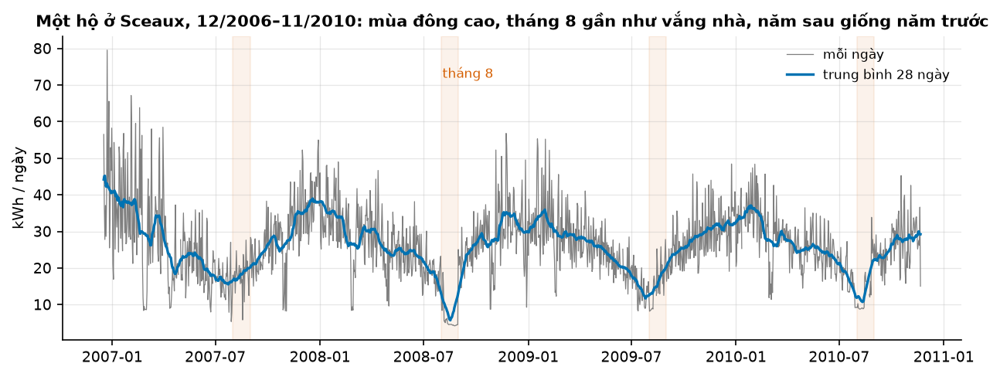
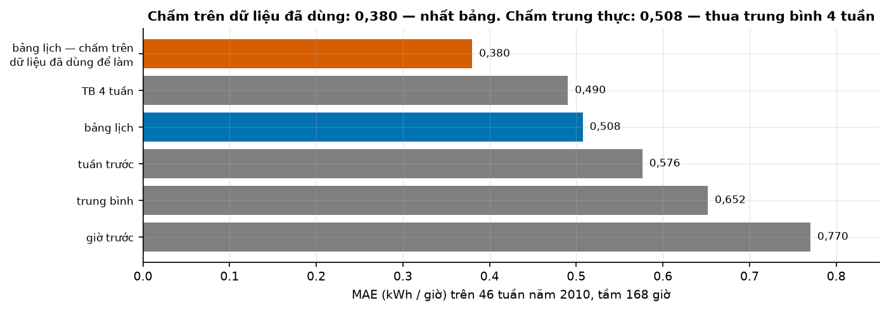
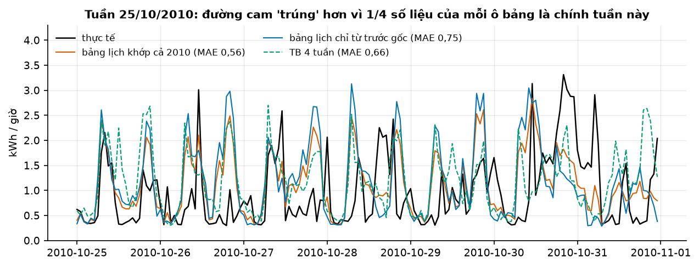
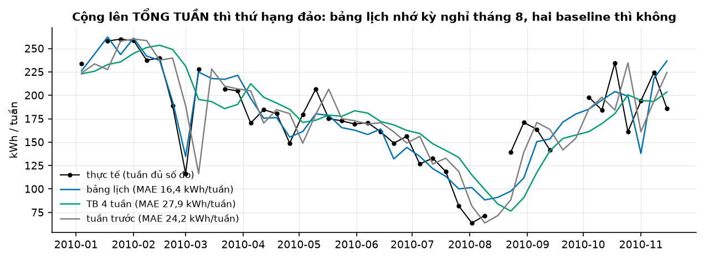

# Buổi 1 — Forecasting là gì

## 1. Mục tiêu

Sau buổi này bạn:

- Viết được **phiếu bài toán dự báo** 6 ô cho một tình huống lạ trong 15 phút: quyết định, biến mục tiêu, tầm dự báo, độ chi
  tiết, mốc cắt dữ liệu, chi phí sai hai chiều.
- Phân biệt dự báo với mục tiêu và kế hoạch; nêu bốn yếu tố quyết định một thứ có dự báo được hay không.
- Chỉ ra bằng số vì sao **chấm dự báo trên dữ liệu đã dùng để làm nó** cho sai số ảo, và vì sao **không có baseline** thì một
  con số MAE không nói lên gì.
- Giải thích vì sao quyết định có chi phí lệch cần **phân phối** dự báo, không chỉ một con số.
- Kể được bài học chính của các cuộc thi M1–M6.

Sản phẩm của buổi: một hàm đánh giá dự báo cuốn theo tuần có đủ baseline (`code/danh_gia.py`) và mẫu phiếu bài toán
(`code/phieu-bai-toan.md`) dùng lại suốt khoá.

## 2. Nhắc lại buổi trước

Đây là buổi đầu tiên. Bạn cần biết:

- **Python cơ bản** — hàm, vòng lặp, list/dict. Chưa quen thì đọc Phụ lục A của khoá trước khi làm lab.
- **pandas tối thiểu** — `pd.read_csv`, một `Series` có chỉ mục thời gian, `resample("h").mean()` (gộp theo giờ),
  `groupby(...).mean()`. Code của buổi đã viết sẵn phần đọc dữ liệu; bạn đọc để hiểu, không phải viết lại.
- **Trung bình, trị tuyệt đối.** Chỉ số duy nhất hôm nay là **MAE** — sai số tuyệt đối trung bình:
  $\text{MAE} = \frac{1}{n}\sum_{t} \lvert y_t - \hat y_t \rvert$, cùng đơn vị với dữ liệu (ở đây kWh mỗi giờ).

## 3. Trạng thái đầu buổi

Sau `cd lab && make up`:

| Hạng mục | Trạng thái |
|---|---|
| Dữ liệu | `du-lieu/raw/uci-household-power/household_power_consumption.txt` — 2.075.259 phút, 16/12/2006 17:24 → 26/11/2010 21:02, 133 MB, sha256 `4259c9d7ece5` |
| Nguồn | Hebrail & Berard, UCI Machine Learning Repository, CC BY 4.0 (`NGUON.txt`) |
| Môi trường | Python 3.12; numpy 2.5.3, pandas 3.0.5, matplotlib 3.11.2 |
| `code/kiem_tra_moi_truong.py` | in phiên bản thư viện và kích thước tệp dữ liệu |
| `code/danh_gia.py` | đọc điện theo giờ, "mô hình" bảng lịch, bốn hàm baseline, `du_bao_cuon`, `danh_gia` |
| `code/phieu-bai-toan.md` | mẫu phiếu 6 ô, để trống |
| **Đang cố tình sai** | `danh_gia` báo một bảng chỉ có **một** dòng: bảng lịch MAE **0,380** kWh/giờ — trông rất tốt |
| `make check` lúc này | ĐỎ: 4/8 test hỏng |

## 4. Lý thuyết

### 4.1 Dự báo, mục tiêu, kế hoạch

FPP (Hyndman & Athanasopoulos) mở đầu bằng một cảnh báo: dự báo trong doanh nghiệp "is frequently confused with planning and
goals". Ba thứ khác nhau:

| | Trả lời câu hỏi | Ví dụ với chuỗi cà phê |
|---|---|---|
| **Dự báo** | điều gì *sẽ* xảy ra, với mọi thông tin đang có | tuần tới bán khoảng 1.900 ly, 80% khả năng trong 1.600–2.300 (số giả định) |
| **Mục tiêu** | ta *muốn* điều gì xảy ra | tuần tới bán 2.500 ly |
| **Kế hoạch** | ta *làm gì* để dự báo tiến gần mục tiêu | chạy khuyến mãi, đặt thêm 20 kg hạt |

Lỗi hay gặp nhất: sửa con số dự báo cho khớp mục tiêu ("sếp muốn 2.500 thì dự báo 2.500"). Khi đó kho đặt nguyên liệu theo mong
muốn, không theo thực tế — và không ai còn biết mô hình đúng hay sai.

### 4.2 Cái gì dự báo được

FPP nêu **bốn** yếu tố: "how well we understand the factors that contribute to it; how much data is available; how similar the
future is to the past; whether the forecasts can affect the thing we are trying to forecast."

| Yếu tố | Điện hộ gia đình ngày mai | Tỷ giá tuần sau |
|---|---|---|
| Hiểu nguyên nhân | có — giờ giấc, thời tiết, ngày nghỉ | ít |
| Đủ dữ liệu | có — 4 năm theo phút | có |
| Tương lai giống quá khứ | thường có | khủng hoảng làm đổi hẳn |
| Dự báo có làm đổi chính nó | không — hộ không đọc dự báo của bạn | có — thị trường phản ứng với dự báo |

FPP kết luận nhu cầu điện ngắn hạn "can be highly accurate because all four conditions are usually satisfied", còn tỷ giá chỉ thoả
một điều kiện. Bốn yếu tố này là câu hỏi đầu tiên cho mọi dự án: nó nói trước độ chính xác nào là hợp lý để kỳ vọng.

### 4.3 Phiếu bài toán dự báo — 6 ô

FPP gọi bước định nghĩa bài toán là "Often this is the most difficult part of forecasting." Trước khi mở dữ liệu, điền đủ 6 ô:

| Ô | Câu hỏi | Ví dụ: công ty bán lẻ điện mua trước điện cho một khu dân cư |
|---|---|---|
| 1. Quyết định | Ai dùng dự báo để làm gì? | Chiều Chủ nhật đặt mua điện theo giờ cho 7 ngày tới trên thị trường kỳ hạn |
| 2. Biến mục tiêu | Chính xác đo cái gì, đơn vị nào? | kWh tiêu thụ mỗi giờ của khu (ở lab: một hộ) |
| 3. Tầm dự báo | Xa bao nhiêu bước? | 1–168 giờ kể từ 00:00 thứ Hai |
| 4. Độ chi tiết | Gộp tới mức nào? | theo giờ, cả khu (không theo từng hộ) |
| 5. Mốc cắt dữ liệu | Lúc ra dự báo biết những gì? | số đo tới 23:59 Chủ nhật; thời tiết dự báo, không có thời tiết thật |
| 6. Chi phí sai hai chiều | Thiếu mất gì? Thừa mất gì? | thiếu: mua giá giao ngay ≈ 4 lần; thừa: bán lại lỗ ≈ 1 lần |

Mỗi ô đổi cách làm: ô 3 và 5 quyết định baseline nào hợp lệ (mục 4.5), ô 4 quyết định chấm ở mức nào (mục 4.7), ô 6 quyết định
báo con số nào (mục 4.8). Mẫu trống ở `code/phieu-bai-toan.md`.

**Tần suất cập nhật** — bao lâu làm lại dự báo một lần — thường đi kèm ô 1. Ở ví dụ trên là mỗi tuần.

### 4.4 Nhìn dữ liệu: một đường duy nhất

FPP: "Always start by graphing the data." Trước mọi mô hình, vẽ một đường và viết ra câu hỏi.



**Đọc hình.** Mỗi năm có một "chữ U": tháng 1–2/2007 trung bình 35,5 kWh/ngày, tháng 6/2007 là 19,8. Dải cam là tháng 8 — năm
nào cũng là đáy: trung bình tháng 8 là 18,3 (2007), 6,6 (2008), 15,8 (2009), 14,1 (2010). Tháng 8/2008 từ ngày 6 tới 30 mỗi ngày
chỉ 4,2–6,2 kWh, tức nhà gần như vắng người (kỳ nghỉ hè). Tháng 12/2006 cao bất thường (chỉ có 15 ngày đầu chuỗi). Theo giờ, trung bình thấp nhất lúc 04h (0,44 kWh) và cao nhất
lúc 20h (1,90); cuối tuần (1,22–1,25) cao hơn ngày thường (0,98–1,08).

Năm câu hỏi nên viết ngay: (1) giờ thiếu nằm ở đâu — có 431 giờ thiếu (1,25%), gồm 10 ngày không có giờ nào đủ số đo, như 18–21/8/2010;
(2) kỳ nghỉ tháng 8 có lặp lại đúng ngày mỗi năm không; (3) đơn vị là gì — cột `Global_active_power` là kW trung bình mỗi phút,
nên trung bình trong giờ là kWh của giờ đó; (4) mốc thời gian là giờ địa phương hay UTC; (5) chuỗi có đổi mức (thiết bị mới,
người chuyển đi) không.

### 4.5 Baseline: chuẩn tối thiểu để so

FPP §5.2: "Some forecasting methods are extremely simple and surprisingly effective … these methods will serve as benchmarks".
Petropoulos et al. (2022) yêu cầu mọi phương pháp mới "should always be compared to a larger number of suitable benchmark
methods". Với chuỗi giờ, tầm $h \le 168$, gốc dự báo $T$:

| Baseline | Công thức | Hàm |
|---|---|---|
| giờ trước (naive) | $\hat y_{T+h} = y_T$ | `du_bao_gio_truoc` |
| trung bình | $\hat y_{T+h} = \bar y_{1..T}$ | `du_bao_trung_binh` |
| tuần trước (naive mùa vụ) | $\hat y_{T+h} = y_{T+h-168}$ | `du_bao_tuan_truoc` |
| TB 4 tuần | $\hat y_{T+h} = \frac14 \sum_{k=1}^{4} y_{T+h-168k}$ | `du_bao_tb_4_tuan` |

Ô 3 và 5 của phiếu quyết định baseline nào **hợp lệ**. "Cùng giờ hôm qua" ($y_{T+h-24}$) nghe tự nhiên nhưng với $h = 100$ thì
giờ đó nằm *sau* gốc dự báo — lúc đặt mua điện ta chưa có số đó. Một baseline dùng dữ liệu chưa có không phải baseline mà là
gian lận.

**"Mô hình" hôm nay** là một bảng lịch: trung bình lượng điện theo (tuần trong năm, thứ, giờ) — $53 \times 7 \times 24 = 8.904$
ô. Nó đủ linh hoạt để "nhớ" kỳ nghỉ tháng 8, và đủ nhiều tham số để thuộc lòng dữ liệu.

### 4.6 Sai số ảo: chấm trên dữ liệu đã dùng để làm dự báo

FPP §5.8: "the size of the residuals is not a reliable indication of how large true forecast errors are likely to be" và "A
model which fits the training data well will not necessarily forecast well. A perfect fit can always be obtained by using a model
with enough parameters." **Phần dư** tính trên dữ liệu đã dùng để khớp; **sai số dự báo** tính trên dữ liệu mô hình chưa thấy.

**Cách chấm trung thực — dự báo cuốn.** Mỗi thứ Hai 00:00 của năm 2010 là một gốc. Tại gốc, mọi phương pháp chỉ được dùng dữ
liệu *trước* gốc, dự báo 168 giờ tới, rồi mới đem so với số đo. 46 gốc, 7.435 giờ có số đo được chấm.

```python
for goc in cac_goc:                                  # mỗi thứ Hai
    thoi_gian = pd.date_range(goc, periods=168, freq="h")
    lich_su = chuoi[chuoi.index < goc]               # CHỈ quá khứ
    du_bao = du_bao_bang_lich(bang_lich(lich_su), thoi_gian)
```

Code đầu buổi khớp `bang_lich(chuoi)` **một lần trên toàn bộ chuỗi** — gồm cả năm 2010 đang được chấm — và chỉ báo bảng lịch.



**Đọc hình.** Thanh cam trên cùng là con số code đầu buổi báo: 0,380. Không có dòng nào để so, 0,380 trông như một thành công.
Chấm trung thực (thanh xanh), bảng lịch là **0,508** — tệ hơn 34% — và **thua** baseline TB 4 tuần (0,490). Hai baseline khác
cho thấy chuỗi này không dễ: tuần trước 0,576, trung bình 0,652, giờ trước 0,770. Trên từng tuần, TB 4 tuần thắng bảng lịch
30/46 tuần.

Vì sao chênh nhiều như vậy? Với dữ liệu tới hết 2009, mỗi ô bảng trung bình có 2,99 giờ; thêm năm 2010 thì 3,82 giờ. Khi khớp cả
2010, khoảng **1/4 số liệu của mỗi ô là chính giờ đang được chấm** — mô hình được xem đáp án trước.



**Đọc hình.** Tuần 25/10/2010 (tuần chênh lớn nhất). Đường cam (bảng khớp cả 2010) bám các đỉnh buổi tối của đường đen sát hơn
đường xanh (bảng chỉ dùng quá khứ): MAE 0,56 so với 0,75. Không có gì "thông minh" hơn ở đường cam — nó chỉ chứa một phần của
đường đen. Tối thứ Bảy 30/10 lúc 20h có đỉnh 3,31 kWh — cả ba dự báo đều thấp hơn nhiều.

### 4.7 Độ chi tiết quyết định cách chấm

Kết luận "TB 4 tuần tốt hơn bảng lịch" chỉ đúng **cho quyết định theo giờ**. Nếu quyết định là mua một khối điện cả tuần (ô 4 của
phiếu đổi), cộng dự báo lên tổng tuần rồi chấm:



**Đọc hình.** Trên 41 tuần đủ số đo, bảng lịch (trung thực) sai trung bình **16,4 kWh/tuần**; tuần trước 24,2; TB 4 tuần 27,9. Tháng
8 là nơi khác biệt: đường xanh lá (TB 4 tuần) chỉ hạ xuống *sau khi* kỳ nghỉ đã bắt đầu và lên lại chậm, còn bảng lịch biết trước
tháng 8 thấp vì đã thấy ba năm trước. Theo giờ, bảng lịch thua vì từng giờ rất nhiễu (máy giặt bật lệch nửa tiếng); cộng
lên tuần thì nhiễu triệt tiêu và phần "nhịp năm" của bảng lịch phát huy.

M3 đã ghi nhận: "The relative ranking of the performance of the various methods varies according to the accuracy measure being
used." Hôm nay thêm một vế: **và theo độ chi tiết được chấm**. Vì vậy ô 4 phải điền trước khi chọn mô hình.

### 4.8 Dự báo điểm, khoảng, phân phối — và chi phí lệch

FPP §1.7: khi nói "dự báo" ta thường chỉ "the average value of the forecast distribution". Nhưng quyết định ở ô 6 có chi phí lệch:
thiếu 1 kWh mất 4, thừa 1 kWh mất 1. Nếu $F$ là phân phối của lượng điện, lượng mua tốt nhất là **quantile**

$$
Q^\ast = F^{-1}\!\left(\frac{C_u}{C_u + C_o}\right) = F^{-1}\!\left(\frac{4}{4+1}\right) = F^{-1}(0{,}8)
$$

— kết quả kinh điển của bài toán người bán báo (newsvendor), $C_u$ là chi phí thiếu, $C_o$ chi phí thừa. Gneiting (2011) chứng minh
cùng ý đó từ phía chấm điểm: "Effective point forecasting requires that the scoring function be specified a priori".

Chạy thật: lấy sai số của TB 4 tuần trên năm 2009 (8.665 giờ), quantile 0,8 của sai số là **+0,455 kWh**. Cộng con số đó vào dự báo
TB 4 tuần cho năm 2010:

| Dự báo năm 2010 | Chi phí / giờ | MAE | Tỷ lệ giờ dự báo thiếu |
|---|---|---|---|
| TB 4 tuần (một con số) | 1,213 | **0,490** | 44,0% |
| TB 4 tuần + quantile 0,8 sai số 2009 | **0,987** | 0,673 | 20,1% |


**Đọc hình.** Bên trái: cộng thêm càng nhiều thì chi phí giảm tới đáy quanh 0,45–0,5 rồi tăng lại; vạch cam (0,455 — tính chỉ từ
năm 2009) rơi gần đúng đáy. Bên phải: cùng các mức đó, MAE tăng đều. Chi phí giảm 18,6% trong khi MAE xấu đi 37%. Tỷ lệ giờ dự báo
thiếu 20,1% gần đúng $1 - 0{,}8$ — dấu hiệu quantile đã hiệu chỉnh tốt. Người chỉ nhìn MAE sẽ chọn sai.

Đây là lý do khoá học dạy **dự báo phân phối**: cùng một mô hình phục vụ được mọi tỷ lệ chi phí, chỉ cần đọc quantile khác.

### 4.9 Bài học từ các cuộc thi M1–M6

| Cuộc thi | Dữ liệu | Bài học (trích từ bài công bố) |
|---|---|---|
| M1 (1982) | 1.001 chuỗi, dài 9–132 quan sát | "Statistically sophisticated or complex methods do not necessarily provide more accurate forecasts than simpler ones"; thứ hạng đổi theo chỉ số; kết hợp tốt hơn từng phương pháp; độ chính xác phụ thuộc tầm |
| M2 (1993) | 29 chuỗi thật (23 của công ty, 6 vĩ mô), dự báo theo thời gian thực | Người dự báo có thêm thông tin về công ty và được điều chỉnh bằng phán đoán, nhưng không cải thiện rõ so với phương pháp thống kê (tóm tắt thứ cấp) |
| M3 (2000) | 3.003 chuỗi | Makridakis & Hibon (2000) cho rằng kết quả M3 ủng hộ bốn kết luận của M1 |
| M4 (2018) | chuỗi đa tần suất | "Out Of the 17 most accurate methods, 12 were "combinations""; phương pháp lai thống kê + ML tốt hơn benchmark kết hợp gần 10%; sáu phương pháp ML thuần "performed poorly" |
| M5 (2022) | 42.840 chuỗi bán lẻ Walmart | Lần đầu mọi phương pháp dẫn đầu là ML thuần (phần lớn LightGBM), học chung trên nhiều chuỗi liên quan ("cross-learning") và dùng biến ngoài; nhánh Uncertainty chấm 9 quantile |
| M6 (2022–2023, công bố 2025) | tài sản tài chính, dự báo + danh mục đầu tư | 38/163 đội dự báo tốt hơn benchmark; tương quan giữa độ chính xác dự báo và hiệu quả đầu tư r = 0,04 |

Đọc xuyên suốt: **đơn giản và kết hợp** thắng khi mỗi chuỗi đứng riêng; **ML thắng khi có nhiều chuỗi liên quan và biến ngoài**
(M5); và **dự báo tốt chưa chắc thành quyết định tốt** (M6) — đúng ý mục 4.8. Bốn kết luận của M1 lấy theo Makridakis & Hibon (2000);
dòng M2 là tóm tắt thứ cấp vì chưa đọc được bài gốc — nguồn ghi trong `NGHIEN-CUU.md`.

### 4.10 Bản đồ các cách tiếp cận trong khoá

| Cách tiếp cận | Khi nào hợp | Ở khoá này |
|---|---|---|
| Phán đoán chuyên gia | chưa có dữ liệu, sự kiện chưa từng xảy ra | kết hợp với mô hình khi ra quyết định (Giai đoạn 7) |
| Thống kê (ETS, ARIMA, hồi quy động) | ít chuỗi, cần giải thích, khoảng dự báo rõ ràng | Giai đoạn 2 |
| ML trên bảng feature (LightGBM) | nhiều chuỗi liên quan, nhiều biến ngoài | Giai đoạn 3 |
| Deep learning (N-BEATS, TFT, PatchTST) | rất nhiều chuỗi dài | Giai đoạn 5 |
| Foundation model chuỗi thời gian | dự báo không cần huấn luyện, dữ liệu ít | Giai đoạn 6 |
| LLM | đọc văn bản, sinh feature, giải thích — hiếm khi là mô hình dự báo chính | Giai đoạn 6 |

Mọi cách tiếp cận đều chấm bằng cùng một quy trình: dự báo cuốn, chỉ dữ liệu trước gốc, luôn có baseline.

## 5. Lab từng bước

### Bước 1 — Dựng môi trường, kiểm phiên bản

```bash
cd lab && make up          # uv sync --frozen + tải dữ liệu, kiểm sha256
env -u VIRTUAL_ENV uv run --no-sync --project 00-nen python ../code/kiem_tra_moi_truong.py
make notebook              # mở JupyterLab, các tệp .py thành notebook
```

```text
Python      3.12.3
numpy       2.5.3
pandas      3.0.5
matplotlib  3.11.2
dữ liệu     household_power_consumption.txt 132,960,755 byte
```

### Bước 2 — Vẽ một đường, viết 5 câu hỏi

Đọc chuỗi bằng `doc_dien_theo_gio()` (34.464 giờ, thiếu 431), gộp lên ngày bằng `resample("D").sum(min_count=20)`, vẽ. Viết 5 câu
hỏi về dữ liệu *trước* khi đọc mục 4.4.

### Bước 3 — Ba phiếu bài toán

Điền `code/phieu-bai-toan.md` cho ba tình huống: (a) chuỗi 40 quán cà phê đặt hạt và sữa mỗi thứ Năm; (b) EVN điều độ phát điện
cho ngày mai; (c) bệnh viện xếp lịch trực 9 ngày Tết. Mỗi phiếu đủ 6 ô, ô 6 phải có **cả hai chiều**.

### Bước 4 — Đoán bằng mắt

Nhìn 8 tuần cuối trước gốc 15/11/2010, ghi con số bạn đoán cho **tổng điện tuần 15–21/11/2010**. Sau đó mới so với:

| Tuần bắt đầu | Thực tế | TB 4 tuần | tuần trước | bảng lịch |
|---|---|---|---|---|
| 01/11/2010 | 194,0 | 194,5 | 161,1 | 138,0 |
| 08/11/2010 | 224,4 | 193,5 | 194,0 | 218,1 |
| 15/11/2010 | 186,0 | 203,5 | 224,4 | 236,7 |

Không phương pháp nào thắng mọi tuần — đó là lý do chấm trên nhiều gốc.

### Bước 5 — Chạy code đầu buổi, thấy sai số ảo, sửa

```bash
env -u VIRTUAL_ENV uv run --no-sync --project 00-nen python ../code/danh_gia.py
make check
```

```text
34464 giờ, thiếu 431, trung bình 1.091 kWh/giờ
bảng lịch    0.38
```

Sửa `du_bao_cuon` trong `code/danh_gia.py`: (1) khớp bảng lịch **bên trong** vòng lặp, chỉ trên `chuoi[chuoi.index < goc]`;
(2) thêm bốn cột baseline; baseline dùng lịch sử đã điền bằng `dien_bang_tuan_truoc`. Chạy lại:

```text
TB 4 tuần     0.490
bảng lịch     0.508
tuần trước    0.576
trung bình    0.652
giờ trước     0.770
```

`make check` phải xanh 8/8. Test `test_du_bao_khong_nhin_thay_tuong_lai` đổi số đo của tuần cuối và đòi mọi dự báo giữ nguyên —
phép thử rẻ nhất để bắt dự báo nhìn thấy đáp án.

## 6. Lỗi thường gặp & cách chẩn đoán

| Triệu chứng | Nguyên nhân | Chẩn đoán | Sửa |
|---|---|---|---|
| MAE rất đẹp, không có gì để so | không có baseline | hỏi "tốt hơn cái gì?" | luôn báo ít nhất naive, naive mùa vụ, trung bình |
| Sai số trên dữ liệu dự án thật tệ hơn hẳn báo cáo | chấm trên dữ liệu đã dùng để khớp | đổi số đo giai đoạn chấm: dự báo có đổi theo không? | dự báo cuốn, chỉ dữ liệu trước gốc |
| Baseline "cùng giờ hôm qua" thắng với tầm 7 ngày | baseline dùng số chưa có tại gốc | kiểm $t - \text{trễ} < \text{gốc}$ cho mọi $h$ | chọn trễ ≥ tầm (168 giờ) |
| "Mô hình A tốt hơn B" rồi đổi ý khi báo cáo tuần | chấm sai độ chi tiết | chấm ở đúng mức của quyết định (ô 4) | cộng dự báo lên mức quyết định rồi chấm |
| Chọn mô hình MAE thấp nhất mà chi phí vận hành vẫn cao | chi phí lệch, MAE nhắm trung vị | tính chi phí theo ô 6 | báo quantile $C_u/(C_u+C_o)$ |
| `ValueError` khi `pd.to_datetime` cột ngày | dữ liệu dạng dd/mm/yyyy | xem 3 dòng đầu tệp | `format="%d/%m/%Y %H:%M:%S"` |
| Cột số thành kiểu chuỗi | giá trị thiếu ghi bằng `?` | `df.dtypes` | `na_values="?"` |
| MAE ra NaN | có giờ thiếu trong `y` | `np.isnan(y).sum()` | bỏ giờ thiếu khi chấm (`mae` của buổi làm sẵn) |
| Dự báo "khớp mục tiêu kinh doanh" | lẫn dự báo với mục tiêu | so con số với phiếu ô 1 | tách: dự báo trung thực, kế hoạch để đạt mục tiêu |
| Tổng tuần của dự báo lệch dù từng giờ ổn | điền giờ thiếu bằng 0 | đếm giờ NaN mỗi tuần | điền bằng tuần trước, chấm chỉ trên giờ có số đo |

## 7. Bài tập về nhà

1. **Phiếu cho tình huống của bạn.** Chọn một quyết định ở nơi bạn làm hoặc học. Điền phiếu 6 ô trong 15 phút, kèm một câu cho mỗi
   yếu tố trong bốn yếu tố của mục 4.2.
2. **Baseline trộn.** Thêm phương pháp "trung bình của TB 4 tuần và bảng lịch" vào `du_bao_cuon`. Chấm theo giờ và theo tổng tuần.
   So với bảng mục 4.6 và 4.7 — M3 và M4 nói gì về kết hợp?
3. **Chi phí đảo chiều.** Đổi thành thiếu 1 : thừa 3. Quantile nào tối ưu? Tính lượng cần cộng thêm từ sai số năm 2009, chi phí và
   tỷ lệ giờ dự báo thiếu trên năm 2010.

## 8. Tiêu chí "Xong khi"

- [ ] `make check` xanh 8/8.
- [ ] Viết được phiếu bài toán cho một tình huống lạ trong 15 phút, đủ 6 ô, ô 6 có cả hai chiều.
- [ ] Giải thích bằng số vì sao 0,380 là sai số ảo, và vì sao con số trung thực (0,508) thua một baseline.
- [ ] Giải thích vì sao ở tổng tuần thứ hạng đảo lại, và vì sao với chi phí thiếu 4 : thừa 1 nên báo quantile 0,8.

## 9. Đọc thêm

- Hyndman, R.J., Athanasopoulos, G. et al. *Forecasting: Principles and Practice, the Pythonic Way* — chương 1 (§1.1–1.7) và chương 5
  (§5.2 phương pháp đơn giản, §5.8 đánh giá độ chính xác): https://otexts.com/fpppy/
- Makridakis, S. & Hibon, M. (2000). The M3-Competition: results, conclusions and implications. *IJF* 16(4), 451–476.
- Makridakis, S., Spiliotis, E. & Assimakopoulos, V. (2018). The M4 Competition: Results, findings, conclusion and way forward.
  *IJF* 34(4), 802–808.
- Makridakis, S., Spiliotis, E. & Assimakopoulos, V. (2022). M5 accuracy competition: Results, findings, and conclusions. *IJF* 38(4),
  1346–1364.
- Makridakis, S. et al. (2025). The M6 forecasting competition: Bridging the gap between forecasting and investment decisions. *IJF*
  41(4), 1315–1354. arXiv:2310.13357
- Petropoulos, F. et al. (2022). Forecasting: theory and practice. *IJF* 38(3), 705–871. arXiv:2012.03854 — mục 2.12.1 về benchmark.
- Makridakis, S., Spiliotis, E. & Assimakopoulos, V. (2018). Statistical and Machine Learning forecasting methods: Concerns and ways
  forward. *PLoS ONE* 13(3): e0194889.
- Gneiting, T. (2011). Making and evaluating point forecasts. *JASA* 106(494), 746–762. arXiv:0912.0902
- Hebrail, G. & Berard, A. (2006). Individual Household Electric Power Consumption. UCI Machine Learning Repository.
  https://doi.org/10.24432/C58K54
