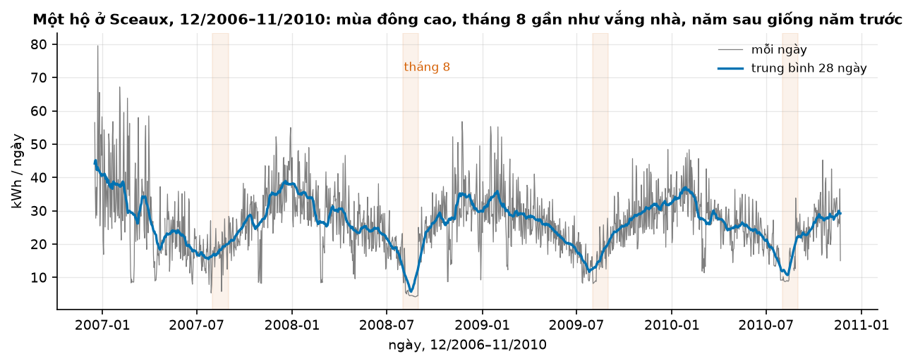
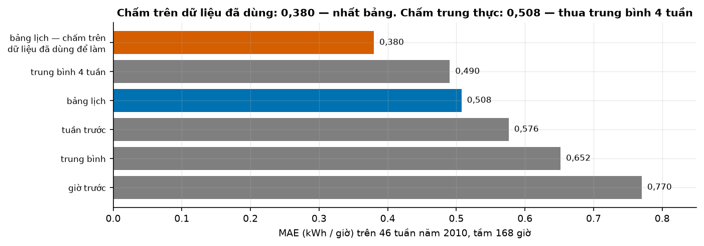
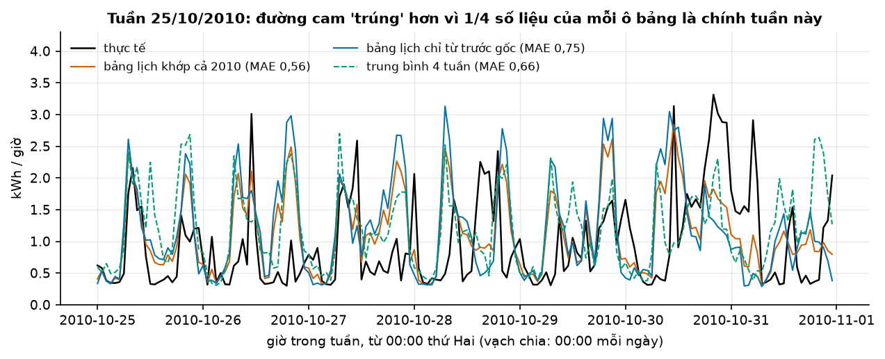
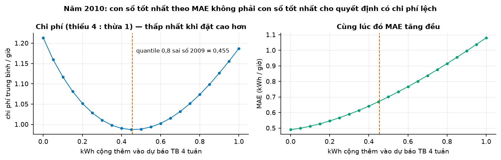

# Buổi 1 — Forecasting là gì

## 1. Mục tiêu

Sau buổi này bạn:

- Viết được **phiếu bài toán dự báo** 6 ô cho một tình huống lạ trong 15 phút.
- Phân biệt dự báo với mục tiêu và kế hoạch; nêu bốn yếu tố quyết định một thứ dự báo được tới đâu.
- Chỉ ra bằng số vì sao chấm trên chính dữ liệu đã dùng để làm dự báo cho **sai số ảo**, tức đẹp hơn thật.
- Chỉ ra vì sao thiếu **baseline** (cách dự báo đơn giản để so) thì một con số sai số không nói lên gì.
- Giải thích vì sao khi thiếu và thừa đắt khác nhau, ta cần cả **phân phối**, không chỉ một con số.

Sản phẩm, dùng lại suốt khoá: hàm đánh giá trung thực (`code/danh_gia.py`) và mẫu phiếu (`code/phieu-bai-toan.md`).

## 2. Nhắc lại buổi trước

Đây là buổi đầu tiên. Bạn cần Python cơ bản (chưa quen thì đọc Phụ lục A) và ba thứ:

- **pandas tối thiểu.** Một `Series` là một cột số, mỗi số gắn một mốc thời gian. `resample("D").sum()` gộp các giờ cùng
  ngày: ngày 1/1 có ba giờ 1, 2, 3 kWh thì gộp thành 1 + 2 + 3 = 6 kWh.
- **Trung bình, trị tuyệt đối.** Trị tuyệt đối bỏ dấu âm: $\lvert -3 \rvert = 3$.
- **Ký hiệu.** $y_t$ là giá trị ở thời điểm $t$: chuỗi 5, 7, 6 có $y_1 = 5$, $y_3 = 6$. Dấu $\sum$ nghĩa là "cộng tất
  cả lại": $\sum_{t=1}^{3} y_t = 5 + 7 + 6 = 18$.

## 3. Trạng thái đầu buổi

Sau `python lab.py up` (trong `lab/`, xem Lab bước 1):

| Hạng mục | Trạng thái |
|---|---|
| Dữ liệu | `du-lieu/raw/uci-household-power/household_power_consumption.txt` — 2.075.259 phút, 16/12/2006 17:24 → 26/11/2010 21:02, 133 MB, sha256 `4259c9d7ece5` |
| Nguồn | Hebrail & Berard, UCI Machine Learning Repository, CC BY 4.0 (`NGUON.txt`) |
| Môi trường | Python 3.12; numpy 2.5.3, pandas 3.0.5, matplotlib 3.11.2 |
| `code/kiem_tra_moi_truong.py` | in phiên bản thư viện và kích thước tệp dữ liệu |
| `code/danh_gia.py` | đọc điện theo giờ, "mô hình" bảng lịch, bốn hàm baseline, `du_bao_cuon`, `danh_gia` |
| `code/phieu-bai-toan.md` | mẫu phiếu 6 ô, để trống |
| **Đang cố tình sai** | `danh_gia` báo một bảng chỉ có **một** dòng: bảng lịch MAE **0,380** kWh/giờ — trông rất tốt |
| `code/lab.ipynb` | notebook của Lab: các ô bước 1, 2, 4, 5 |
| `python lab.py check` lúc này | ĐỎ: 4/8 test hỏng |

- **sha256** là "dấu vân tay" tính từ nội dung tệp; sai một byte là chuỗi khác hẳn. Khớp nghĩa là bạn có đúng tệp tác
  giả dùng.
- `python lab.py check` chạy 8 test, mỗi test tự kiểm một điều. **Đỏ** là hỏng, **xanh** là qua. Đầu buổi đỏ là cố ý.

## 4. Lý thuyết

### Từ mới trong buổi

| Thuật ngữ | Nghĩa | Ví dụ |
|---|---|---|
| biến mục tiêu | Đại lượng cần dự báo (cột `y`). | kWh mỗi giờ của một hộ. |
| gốc dự báo, mốc cắt dữ liệu | Lúc ra dự báo; sau đó coi như chưa biết gì. | Gốc 00:00 thứ Hai. |
| tầm dự báo, $h$ | Dự báo xa bao nhiêu bước. | 7 ngày theo giờ: $h$ = 1…168. |
| độ chi tiết | Gộp dữ liệu tới mức nào. | Từng giờ, hay tổng tuần. |
| công suất (kW), điện năng (kWh) | Mạnh cỡ nào tại một lúc; tổng đã dùng = công suất × giờ. | 2 kW trong nửa giờ = 1 kWh. |
| mùa vụ | Mẫu lặp lại đều theo lịch. | Ngày nào cũng cao lúc 20h. |
| dịch mức | Mức trung bình đổi hẳn rồi ở luôn đó. | Thêm người ở: 1,0 → 1,4 kWh/giờ. |
| mô hình, tham số, khớp | Cách tính ra dự báo; các con số bên trong nó; việc chọn các con số đó từ dữ liệu. | "Mai = trung bình 7 ngày qua". |
| baseline | Cách dự báo đơn giản làm mốc so. | Mô hình thua baseline thì bỏ. |
| naive, seasonal naive | Lấy số cuối đã biết; lấy số cùng lúc của vòng lặp trước. | 19h thứ Ba tuần trước. |
| sai số dự báo | Thực tế − dự báo, trên dữ liệu mô hình chưa thấy. | 1,7 − 1,5 = +0,2. |
| MAE (mean absolute error) | Trung bình độ lớn sai số, bỏ dấu. | +2 và −4 → 3. |
| phần dư | "Sai số" đo trên chính dữ liệu đã dùng để khớp. | Khớp 2010, đo 2010. |
| dự báo cuốn | Dự báo lặp lại, mỗi lần dời gốc tới. | Mỗi thứ Hai một lần. |
| phân phối | Các giá trị có thể xảy ra, mỗi giá trị hay gặp tới đâu. | 10 ngày: 5, 6, 6, 7, …, 12. |
| quantile, trung vị | Quantile 0,8: giá trị nhỏ nhất mà ít nhất 80% giá trị không vượt quá. Trung vị là quantile 0,5. | Mục 4.6. |
| dự báo điểm, dự báo phân phối | Một con số; cả dải giá trị kèm khả năng. | "120 cái" / "100–140: 80%". |
| bài toán newsvendor | Đặt hàng một lần khi thiếu và thừa đều mất tiền. | Người bán báo. |
| hàm phân phối tích luỹ | Tỷ lệ giá trị nhỏ hơn hoặc bằng một mốc. | Chỉ ở hộp Nâng cao. |
| sai số ảo | Sai số đo trên chính dữ liệu đã dùng để làm dự báo — đẹp hơn sai số thật. | Học thuộc đề cũ rồi thi lại đúng đề đó: 10 điểm; đề mới chỉ 6. |
| thị trường kỳ hạn, giá giao ngay | Kỳ hạn: mua trước, chốt giá sớm. Giao ngay: mua lúc cần, đắt hơn. | Chủ nhật mua điện cho cả tuần; thiếu thì mua giao ngay. |

Đọc lướt; mỗi từ được giải thích lại ở lần đầu xuất hiện.

### 4.1 Dự báo là gì, và cái gì dự báo được

**Vấn đề.** Con số ta sắp đưa ra là điều *sẽ* xảy ra, hay điều ta *muốn* xảy ra? Và thứ này dự báo được tới đâu?

**Trực giác.** Bản tin nói "mai mưa 80%". Bạn muốn nắng, nhưng không ai sửa bản tin vì thế; mang ô là **kế hoạch**.
Sách *Forecasting: Principles and Practice* (viết tắt FPP, của Hyndman và Athanasopoulos, đọc miễn phí trên mạng) tách
ba thứ (FPP §1.2):

| | Trả lời câu hỏi | Ví dụ với chuỗi quán cà phê |
|---|---|---|
| **Dự báo** | điều gì *sẽ* xảy ra, với mọi thông tin đang có | tuần tới bán khoảng 1.900 ly (số giả định) |
| **Mục tiêu** | ta *muốn* điều gì | bán 2.500 ly |
| **Kế hoạch** | ta *làm gì* để tiến gần mục tiêu | chạy khuyến mãi, đặt thêm hạt |

**Ví dụ số nhỏ — tự tính tay.** Sếp muốn 2.500 ly nên bảo "dự báo 2.500". Kho đặt nguyên liệu cho 2.500 ly, tuần đó
bán 1.900 ly. Nguyên liệu thừa cho 2.500 − 1.900 = 600 ly, và không ai còn biết mô hình dự báo đúng hay sai.

**Cái gì dự báo được.** FPP §1.1 nêu bốn yếu tố; thoả càng nhiều thì dự báo càng chính xác.

| Yếu tố | Điện của một hộ, ngày mai | Tỷ giá, tuần sau |
|---|---|---|
| 1. Hiểu điều gì tác động tới nó | có: giờ giấc, thời tiết, ngày nghỉ | ít |
| 2. Có nhiều dữ liệu | có: 4 năm, từng phút | có |
| 3. Tương lai giống quá khứ | thường có | khủng hoảng làm đổi hẳn |
| 4. Dự báo **không** làm đổi chính nó | đúng: hộ không đọc dự báo | sai: nhà đầu tư mua bán theo dự báo |

**Đọc bảng.** Điện ngày mai thoả cả bốn, tỷ giá chỉ thoả yếu tố 2: điện ngắn hạn dự báo được rất chính xác, tỷ giá thì
không.

**Dữ liệu thật.** Lab dùng điện của **một hộ** ở Sceaux, gần Paris, đo từng phút từ 12/2006 tới 11/2010. Một hộ khó hơn
cả thành phố vì từng giờ lên xuống theo việc bật tắt máy móc (mục 4.5).

**Tóm lại.** **Dự báo là điều sẽ xảy ra, không phải điều ta muốn; đừng sửa nó cho khớp mục tiêu. Bốn yếu tố cho biết
một thứ dự báo được tới đâu.**

**Tự kiểm tra.** Hãng xe công bố "giá tháng sau tăng 10%", khách đổ xô mua trước. Yếu tố nào bị vi phạm?

<details>
<summary>Đáp án</summary>

Yếu tố 4: chính lời dự báo làm đổi thứ được dự báo. Nhầm hay gặp là chọn yếu tố 3: tương lai đúng là khác quá khứ,
nhưng nguyên nhân là lời dự báo.

</details>

### 4.2 Phiếu bài toán dự báo — 6 ô

**Vấn đề.** Cùng dữ liệu điện, "dự báo cho ai, để làm gì" đổi thì cách làm và cách chấm đổi theo. FPP §1.6 gọi đây
là bước thường khó nhất.

| Ô | Câu hỏi | Ví dụ: công ty bán lẻ điện mua trước điện cho một khu dân cư |
|---|---|---|
| 1. Quyết định | Ai dùng dự báo làm gì, bao lâu một lần? | Cuối ngày Chủ nhật (sau 23:59) đặt mua điện theo giờ cho 7 ngày tới trên thị trường kỳ hạn, mỗi tuần một lần |
| 2. Biến mục tiêu | Đo cái gì, đơn vị nào? | kWh mỗi giờ của khu (ở lab: một hộ) |
| 3. Tầm dự báo | Xa bao nhiêu bước? | 1–168 giờ, từ 00:00 thứ Hai |
| 4. Độ chi tiết | Gộp tới mức nào? Chấm ở mức nào? | theo giờ, cả khu |
| 5. Mốc cắt dữ liệu | Lúc ra dự báo đã biết gì? | số đo tới 23:59 Chủ nhật; thời tiết *dự báo*, chưa có thời tiết thật |
| 6. Chi phí sai hai chiều | Thiếu mất gì? Thừa mất gì? | mỗi kWh thiếu phải mua gấp giá giao ngay, mất khoảng 4 đồng; mỗi kWh thừa bán lại lỗ khoảng 1 đồng |

**Thị trường kỳ hạn**: mua điện trước, chốt giá hôm nay cho điện giao tuần sau. **Giá giao ngay**: giá mua ngay lúc
cần, thường đắt hơn nhiều.

**Đọc bảng.** Ô 3 và ô 5 quyết định baseline nào được dùng (mục 4.3), ô 4 quyết định chấm ở mức nào (mục 4.5), ô 6
quyết định nên báo con số nào (mục 4.6).

**Ví dụ số nhỏ — tự tính tay: đơn vị ở ô 2.** Dữ liệu gốc ghi **công suất** (kW) trung bình từng phút; ta cần **điện
năng** (kWh) từng giờ. Giả sử 30 phút đầu nhà dùng 2,0 kW, 30 phút sau 0,4 kW.

- Điện năng = 2,0 × 0,5 giờ + 0,4 × 0,5 giờ = 1,0 + 0,2 = 1,2 kWh.
- Trung bình công suất trong giờ = (2,0 + 0,4)/2 = 1,2 kW.

Hai số bằng nhau vì nhân với đúng 1 giờ: **trung bình kW trong một giờ là số kWh của giờ đó** (code làm vậy với 60 phút).

Một giờ **đủ số đo** khi có ít nhất nửa số phút đo được; không đủ thì để trống (`NaN`). Chuỗi cắt từ 00:00 ngày 17/12/2006
(ngày đầu đủ 24 giờ) tới 23:00 Chủ nhật 21/11/2010 (tuần đủ cuối cùng): 34.464 giờ, trong đó 431 giờ trống.

**Dữ liệu thật: vẽ trước khi làm.** FPP khuyên luôn bắt đầu bằng việc vẽ.



**Cách đọc hình.**

1. **Trục ngang**: ngày, 12/2006–11/2010.
2. **Trục dọc**: kWh/ngày.
3. **Ký hiệu**: xám là từng ngày; xanh là trung bình 28 ngày quanh đó; dải cam nhạt là tháng 8.
4. **Nhìn vào đâu**: đường xanh qua các mùa; dải cam; tháng 8/2008 (4–6 kWh/ngày).
5. **Kết luận**: mùa đông cao, tháng 8 gần như vắng nhà, năm sau giống năm trước.

Trong ngày cũng có nhịp: thấp nhất lúc 4h, cao nhất lúc 20h; cuối tuần dùng nhiều hơn ngày thường. Mẫu lặp lại đều như
vậy gọi là **mùa vụ**; chuỗi này có mùa vụ theo ngày, tuần và năm.

**Tóm lại.** **Điền 6 ô trước khi mở dữ liệu, rồi vẽ và viết câu hỏi (Lab bước 2).**

**Tự kiểm tra.** Máy lạnh 1,5 kW chạy 40 phút rồi tắt 20 phút. Giờ đó dùng bao nhiêu kWh?

<details>
<summary>Đáp án</summary>

1,5 × 40/60 + 0 × 20/60 = 1,0 kWh, bằng trung bình công suất trong giờ. Nhầm hay gặp là 1,5 kWh: quên máy chỉ chạy
2/3 giờ.

</details>

### 4.3 Baseline: chuẩn tối thiểu để so

**Vấn đề.** Code đầu buổi báo MAE 0,380 kWh/giờ. Tốt hay xấu? Một con số đứng một mình không trả lời được.

**Trực giác.** Bạn được 7 điểm: cả lớp được 9 thì 7 là kém, cả lớp được 4 thì 7 là giỏi. **Baseline** là "điểm của cả
lớp": cách dự báo đơn giản ai cũng làm được (FPP §5.2).

**Ký hiệu thời gian — dùng suốt khoá.**

- $T$: giờ cuối cùng đã có số đo, ví dụ 23:00 Chủ nhật 3/1/2010 (nhãn "23:00" là cả giờ 23:00–23:59).
- **Gốc dự báo**: lúc ra dự báo, ngay sau $T$ (00:00 thứ Hai 4/1). Từ gốc trở đi coi như chưa biết.
- $h$: số giờ tính từ $T$. $T + 1$ là 00:00 thứ Hai; $T + 168$ là 23:00 Chủ nhật 10/1.
- $y_T$: số đo ở giờ $T$. $\hat y_{T+h}$ ("y mũ") là số **dự báo** cho giờ $T + h$.

**Ví dụ số nhỏ — tự tính tay.** Dự báo 19:00 thứ Ba 5/1. Từ 23:00 Chủ nhật tới đó là 24 + 20 = 44 giờ, nên $h = 44$.
Số giả định: lúc $T$ nhà dùng 0,6 kWh; trung bình mọi giờ đã biết là 1,1 kWh; 19:00 thứ Ba của bốn tuần trước (xa tới
gần) là 1,6; 1,2; 1,4; 1,8. Thực tế hôm đó là 1,7 kWh.

| Baseline | Lấy số nào | Dự báo (kWh) | Sai số = thực tế − dự báo |
|---|---|---|---|
| giờ trước (naive) | giờ $T$ | 0,6 | 1,7 − 0,6 = +1,1 |
| trung bình | mọi giờ đã biết | 1,1 | +0,6 |
| tuần trước (seasonal naive) | 19:00 thứ Ba tuần trước | 1,8 | −0,1 |
| trung bình 4 tuần | (1,6 + 1,2 + 1,4 + 1,8)/4 | 1,5 | +0,2 |

**Đọc bảng.** Hai baseline "cùng giờ, cùng thứ" sai ít nhất vì điện lặp lại theo tuần; "giờ trước" sai nhiều nhất vì
23:00 là giờ sắp ngủ. Sai số dương nghĩa là dự báo thấp hơn thực tế.

**Công thức** của bốn cách, theo thứ tự trong bảng:

$$
\hat y_{T+h} = y_T, \qquad \hat y_{T+h} = \bar y, \qquad \hat y_{T+h} = y_{T+h-168}, \qquad
\hat y_{T+h} = \tfrac{1}{4}\sum_{k=1}^{4} y_{T+h-168k}
$$

- $\bar y$ ("y ngang"): trung bình mọi giờ từ giờ đầu tới giờ $T$.
- $y_{T+h-168}$: số đo 168 giờ (một tuần) trước giờ cần dự báo. Lùi lại một số bước như vậy gọi là **trễ**.
- $k$ = 1, 2, 3, 4: lùi 1 tới 4 tuần; $\sum$ cộng bốn số, $\tfrac14$ lấy trung bình.

**Nói bằng lời.** Với $h = 44$: $T + 44 - 168 = T - 124$, tức 19:00 thứ Ba 29/12/2009, số đo 1,8. Công thức cuối lấy
thêm ba tuần xa hơn rồi chia bốn, ra 1,5.

**Baseline nào hợp lệ.** Chỉ được dùng số đã có tại gốc, tức giờ $T$ trở về trước. Thử "cùng giờ hôm qua"
($y_{T+h-24}$) với $h = 100$:

- Giờ cần dự báo: $T + 100$, tức 03:00 thứ Sáu 8/1.
- Giờ baseline lấy số: $T + 100 - 24 = T + 76$, tức 03:00 thứ Năm 7/1.
- $T + 76 > T$: giờ đó nằm *sau* gốc, lúc đặt mua chưa có số. Dùng nó là gian lận, không phải baseline.

Quy tắc: trễ phải lớn hơn hoặc bằng tầm xa nhất, ở đây là một tuần.

**MAE: thước đo để so.** MAE (sai số tuyệt đối trung bình) là trung bình độ lệch, không kể dấu:

$$
\text{MAE} = \frac{1}{n}\sum_{t=1}^{n} \lvert y_t - \hat y_t \rvert
$$

- $y_t$: số đo thật ở giờ $t$; $\hat y_t$: số dự báo cho giờ đó; $y_t - \hat y_t$: sai số.
- $n$: số giờ được chấm. $\sum$ cộng $n$ trị tuyệt đối; $\frac1n$ lấy trung bình.

**Nói bằng lời.** Bốn giờ thật 1,5; 0,5; 2,0; 1,0 kWh, dự báo đều 1,0. Sai số +0,5; −0,5; +1,0; 0. Bỏ dấu rồi cộng:
0,5 + 0,5 + 1,0 + 0 = 2,0. Chia cho $n = 4$: MAE = 2,0/4 = 0,5, tức trung bình mỗi giờ lệch 0,5 kWh.

**Tự viết bằng NumPy** (đúng các số trên; `dap-an/vi_du_nho.py` in mọi số của mục này):

```python
import numpy as np
tuan = np.array([1.6, 1.2, 1.4, 1.8])      # 19:00 thứ Ba của 4 tuần trước, xa tới gần
print(tuan[-1], tuan.mean())               # 1.8 (tuần trước), 1.5 (trung bình 4 tuần)
y, du_bao = np.array([1.5, 0.5, 2.0, 1.0]), np.full(4, 1.0)
print(np.mean(np.abs(y - du_bao)))         # 0.5 — MAE
```

**Thư viện.** `code/danh_gia.py` có `du_bao_gio_truoc`, `du_bao_trung_binh`, `du_bao_tuan_truoc`,
`du_bao_trung_binh_4_tuan`, `mae` (bỏ qua giờ trống) và `dien_bang_tuan_truoc`: điền giờ trống bằng cùng giờ tuần
trước nữa, chỉ nhìn về quá khứ nên không gian lận.

**"Mô hình" hôm nay: bảng lịch.** Trung bình lượng điện theo từng bộ (tuần trong năm, thứ, giờ): 53 × 7 × 24 = 8.904 ô.
Mỗi ô là một **tham số** (con số bên trong mô hình); tính các ô từ dữ liệu gọi là **khớp** mô hình. Nhiều ô giúp bảng
nhớ kỳ nghỉ tháng 8, nhưng mỗi ô chỉ có vài giờ nên bảng dễ **thuộc lòng** cả những lần bật máy giặt ngẫu nhiên, như
học thuộc đáp án đề cũ.

**Tóm lại.** **Không có baseline thì MAE không nói lên gì. Baseline chỉ dùng số đã có tại gốc. Với điện theo giờ,
baseline tốt là "cùng giờ, cùng thứ" của các tuần trước.**

**Tự kiểm tra.** Tầm 168 giờ. "Cùng giờ hai ngày trước" ($y_{T+h-48}$) có hợp lệ không? Thử $h = 30$ và $h = 60$.

<details>
<summary>Đáp án</summary>

$h = 30$: $T - 18$, trước gốc, dùng được. $h = 60$: $T + 12$, sau gốc, không dùng được. Baseline phải đúng cho mọi $h$
từ 1 tới 168, nên nó **không hợp lệ**. Nhầm hay gặp là chỉ thử một $h$ nhỏ.

</details>

### 4.4 Sai số ảo và dự báo cuốn

**Vấn đề.** Code đầu buổi khớp bảng lịch trên **toàn bộ** chuỗi, gồm cả năm 2010, rồi chấm trên chính năm 2010, được
0,380. Tin được không?

**Ví dụ số nhỏ — tự tính tay.** Một ô bảng lịch có ba giờ của các năm trước, tổng 1,0 + 1,4 + 1,2 = 3,6 kWh. Giờ cần
chấm năm nay là 2,0 kWh.

- **Trung thực** (chỉ ba số cũ): dự báo (1,0 + 1,4 + 1,2)/3 = 1,2; sai số 2,0 − 1,2 = 0,8.
- **Nhìn trộm** (thêm giờ đang chấm): dự báo (1,0 + 1,4 + 1,2 + 2,0)/4 = 1,4; sai số 2,0 − 1,4 = 0,6.

Sai số nhỏ đi mà mô hình chẳng giỏi hơn: nó chứa sẵn một phần đáp án. FPP §5.8 đặt hai tên:

- **Phần dư**: tính trên chính dữ liệu đã dùng để khớp (kiểu nhìn trộm).
- **Sai số dự báo**: tính trên dữ liệu mô hình chưa thấy (kiểu trung thực).

Mô hình đủ nhiều tham số luôn khớp hoàn hảo dữ liệu đã thấy, nên phần dư nhỏ không đảm bảo dự báo tốt.

**Cách chấm trung thực — dự báo cuốn.** Tại mỗi thứ Hai 00:00 năm 2010: chỉ dùng dữ liệu *trước* gốc, dự báo 168 giờ
tới, rồi mới so với số đo. Xong thì dời gốc sang thứ Hai sau.

```python
for goc in cac_goc:                                  # mỗi thứ Hai 00:00
    thoi_gian = pd.date_range(goc, periods=168, freq="h")
    lich_su = chuoi[chuoi.index < goc]               # CHỈ quá khứ
    du_bao = du_bao_bang_lich(bang_lich(lich_su), thoi_gian)
```

Từ gốc 4/1 tới gốc 15/11/2010 có 46 gốc, tức 46 × 168 = 7.728 giờ. Bỏ 293 giờ trống, còn 7.435 giờ được chấm.



**Cách đọc hình.**

1. **Trục ngang**: MAE (kWh/giờ) trên 46 tuần năm 2010; ngắn là tốt.
2. **Trục dọc**: tên phương pháp.
3. **Ký hiệu**: cam là bảng lịch nhìn trộm; xanh là bảng lịch trung thực; xám là bốn baseline.
4. **Nhìn vào đâu**: thanh cam với thanh xanh (cùng mô hình), rồi thanh xanh với thanh xám ngay trên nó.
5. **Kết luận**: nhìn trộm thì bảng lịch đứng đầu; chấm trung thực thì nó thua trung bình 4 tuần.

**Đọc hình bằng số.** Cùng mô hình, trung thực cho 0,508 thay vì 0,380, lớn hơn khoảng 34%. Trung bình 4 tuần (0,490)
thắng ở 30 trên 46 tuần.

**Vì sao chênh nhiều vậy?** Với dữ liệu tới hết 2009, mỗi ô trung bình có 2,99 giờ; thêm 2010 thì 3,82 giờ. Phần mới
chiếm (3,82 − 2,99)/3,82 ≈ 0,22: khoảng 22% số liệu mỗi ô chính là giờ đang chấm.



**Cách đọc hình.**

1. **Trục ngang**: 168 giờ của tuần 25–31/10/2010; vạch là 00:00 mỗi ngày.
2. **Trục dọc**: kWh/giờ.
3. **Ký hiệu**: đen là thực tế; cam là bảng lịch nhìn trộm; xanh dương là bảng lịch trung thực; xanh lá đứt là trung
   bình 4 tuần.
4. **Nhìn vào đâu**: các đỉnh buổi tối, nơi đường cam bám đen sát hơn xanh dương.
5. **Kết luận**: đây là tuần hai cách chấm chênh nhất; đường cam "trúng" hơn chỉ vì khoảng một phần tư số liệu mỗi ô
   của nó là chính tuần này.

**Tóm lại.** **Chấm trên dữ liệu đã dùng để khớp cho sai số ảo; hãy dùng dự báo cuốn. Phép thử rẻ nhất: đổi số đo giai
đoạn chấm; dự báo trung thực không được đổi theo.**

**Tự kiểm tra.** Một ô có hai giờ cũ 0,8 và 1,2 kWh; giờ cần chấm là 0,4 kWh. Tính sai số (thực tế − dự báo) khi chấm
trung thực và khi nhìn trộm.

<details>
<summary>Đáp án</summary>

Trung thực: dự báo 1,0; sai số 0,4 − 1,0 = −0,6. Nhìn trộm: dự báo (0,8 + 1,2 + 0,4)/3 = 0,8; sai số −0,4. Nhầm hay
gặp là nghĩ nhìn trộm chỉ có lợi khi thực tế cao; thật ra nó luôn kéo dự báo về phía đáp án.

</details>

### 4.5 Độ chi tiết quyết định cách chấm

**Vấn đề.** "Trung bình 4 tuần tốt hơn bảng lịch" đúng cho quyết định **theo giờ**. Nếu công ty mua một khối điện cho
cả tuần (ô 4 đổi) thì sao?

**Trực giác.** Mỗi giờ có phần lên xuống ngẫu nhiên gọi là **nhiễu** (máy giặt bật lúc 19:10 tuần này, 19:50 tuần sau);
cộng cả tuần thì lệch lên và lệch xuống do nhiễu bù trừ nhau.

**Ví dụ số nhỏ — tự tính tay.** Bốn giờ thật là 2, 0, 2, 0 kWh, tổng 4.

- **Cách A** dự báo 1, 1, 1, 1. Sai số (thực tế − dự báo) +1, −1, +1, −1: MAE giờ = 4/4 = 1; sai số tổng 4 − 4 = 0.
- **Cách B** dự báo 2,5; 0,5; 2,5; 0,5. Sai số −0,5 cả bốn giờ: MAE giờ = 0,5; sai số tổng 4 − 6 = −2.

Theo giờ B thắng; theo tổng A thắng. Sai số +1 và −1 của A triệt tiêu khi cộng; −0,5 của B cùng dấu nên cộng dồn.

**Dữ liệu thật.** Cộng dự báo 168 giờ thành tổng tuần rồi chấm. Chỉ chấm 41 **tuần đủ số đo** (cả 168 giờ có số);
tuần thiếu giờ sẽ cho tổng thấp giả.


**Cách đọc hình.**

1. **Trục ngang**: các tuần năm 2010, mỗi chấm một tuần tính từ thứ Hai.
2. **Trục dọc**: kWh/tuần.
3. **Ký hiệu**: chấm đen = thực tế; xanh dương = bảng lịch trung thực; xanh lá = trung bình 4 tuần; xám = tuần trước.
4. **Nhìn vào đâu**: tháng 8. Xanh lá hạ *sau khi* kỳ nghỉ bắt đầu, lên lại chậm; xanh dương hạ đúng lúc (bảng lịch đã
   thấy ba tháng 8 trước).
5. **Kết luận**: cộng lên tổng tuần thì thứ hạng đảo.

| Phương pháp | MAE theo giờ (kWh/giờ) | MAE tổng tuần (kWh/tuần) |
|---|---|---|
| trung bình 4 tuần | 0,490 | 27,9 |
| bảng lịch (trung thực) | 0,508 | 16,4 |
| tuần trước | 0,576 | 24,2 |

**Đọc bảng.** Theo giờ trung bình 4 tuần đứng đầu; theo tổng tuần bảng lịch đứng đầu. Cộng lên tuần, lệch lên xuống
của cả ba cách đều bù trừ; chỉ **lệch cùng một chiều nhiều ngày** là dồn lại, như hai baseline ở tháng 8.

**Tóm lại.** **Chấm ở đúng độ chi tiết của quyết định (ô 4). Hai mô hình có thể xếp hạng ngược nhau ở hai mức, nên điền
ô 4 trước khi chọn mô hình.**

**Tự kiểm tra.** Ba ngày thật 10, 20, 30 kWh. Cách C dự báo 20, 20, 20; cách D dự báo 12, 22, 32. Cách nào thắng theo
ngày (MAE), cách nào thắng theo tổng ba ngày?

<details>
<summary>Đáp án</summary>

C có sai số −10, 0, +10: MAE = 20/3 ≈ 6,7, còn sai số tổng = 60 − 60 = 0. D có sai số −2, −2, −2: MAE = 2, còn sai số
tổng = 60 − 66 = −6. Theo ngày D thắng, theo tổng C thắng. Nhầm hay gặp: "MAE ngày nhỏ thì tổng cũng chính xác".

</details>

### 4.6 Một con số hay cả phân phối — khi thiếu và thừa đắt khác nhau

**Vấn đề.** Theo ô 6 (mục 4.2), mua **ít hơn** lượng nhà thật sự dùng thì mỗi kWh thiếu mất **4 đồng**. Mua **nhiều
hơn** thì mỗi kWh thừa mất **1 đồng** ("đồng" là đơn vị giả định). Mỗi giờ nên mua bao nhiêu? Mua đúng dự báo trung
bình không phải cách tốt nhất.

> **Mượn trước — phân phối và quantile** (buổi 2 học kỹ)
>
> - **Phân phối** của một đại lượng: danh sách các giá trị nó có thể nhận, và mỗi giá trị hay gặp tới đâu. Ví dụ
>   10 ngày qua, lúc 19 giờ nhà dùng 7, 5, 9, 6, 8, 12, 6, 9, 7, 8 kWh. Dãy này cho ta hình dung phân phối của
>   "lượng điện lúc 19 giờ".
> - **Quantile** (phân vị) mức 0,8: giá trị **nhỏ nhất** mà ít nhất 80% số giá trị nhỏ hơn hoặc bằng nó.
> - Cách tính tay: xếp tăng dần. Lấy vị trí bằng 0,8 × số giá trị, làm tròn lên. Với 10 giá trị thì 0,8 × 10 = 8,
>   nên lấy số thứ 8; với 7 giá trị thì 0,8 × 7 = 5,6, lấy số thứ 6.
> - Xếp 10 số trên: 5, 6, 6, 7, 7, 8, 8, **9**, 9, 12. Số thứ 8 là 9, nên quantile 0,8 là **9 kWh**. Kiểm lại: có 9
>   trên 10 ngày dùng không quá 9 kWh (hai ngày cùng dùng 9), tức "ít nhất 80%".
> - Quantile 0,5 là mốc chia đôi, còn gọi là **trung vị**. Với số lượng chẵn, sách phổ thông lấy trung bình hai số giữa
>   (7,5 ở dãy trên); cách đếm này lấy số thứ 5 (7). Hai quy ước chỉ khác khi có hai số đứng giữa.

**Trực giác.** Với người bán bánh mì, hết bánh (mất khách) đắt hơn dư bánh (lỗ tiền bột), nên họ làm **dư ra một
chút** so với lượng bán trung bình. Thiếu điện đắt gấp 4 lần thừa, nên cũng mua cao hơn trung bình.

**Ví dụ số nhỏ — tự tính tay.** Dùng lại 10 ngày ở trên, ngày nào cũng mua cùng một lượng. Chi phí 10 ngày:

- **Thiếu** (kWh) = nhu cầu − lượng mua, ở những ngày nhu cầu lớn hơn lượng mua.
- **Thừa** (kWh) = lượng mua − nhu cầu, ở những ngày nhu cầu nhỏ hơn.
- **Chi phí** = 4 × tổng kWh thiếu + 1 × tổng kWh thừa (đồng).

Tính một dòng làm mẫu, mua 8 kWh mỗi ngày:

- Ngày thiếu là các ngày dùng 9, 9 và 12. Tổng thiếu là 1 + 1 + 4 = 6 kWh, nên mất 4 × 6 = 24 đồng.
- Ngày thừa là các ngày dùng 5, 6, 6, 7 và 7. Tổng thừa là 3 + 2 + 2 + 1 + 1 = 9 kWh, nên mất 1 × 9 = 9 đồng.
- Tổng chi phí là 24 + 9 = **33 đồng**.

| Mua mỗi ngày (kWh) | Số ngày thiếu | Tổng kWh thiếu | Tổng kWh thừa | Chi phí 10 ngày (đồng) |
|---|---|---|---|---|
| 6 | 7 | 18 | 1 | 73 |
| 7 | 5 | 11 | 4 | 48 |
| 8 | 3 | 6 | 9 | 33 |
| **9** | 1 | 3 | 16 | **28** |
| 10 | 1 | 2 | 25 | 33 |
| 11 | 1 | 1 | 34 | 38 |
| 12 | 0 | 0 | 43 | 43 |

**Đọc bảng.** Cột cuối giảm dần rồi tăng lại, thấp nhất ở **mua 9 kWh**, đúng quantile 0,8 trong hộp "Mượn trước".

Mua đúng lượng trung bình (7,7 kWh) tốn 37,5 đồng, đắt hơn cách tốt nhất khoảng 34%.

**Vì sao lại là quantile 0,8?** Tăng lượng mua từng kWh một:

- **Từ 8 lên 9.** 3 ngày đang thiếu (dùng 9, 9, 12) bớt thiếu 1 kWh: tiết kiệm 3 × 4 = 12 đồng. Bảy ngày còn lại thừa
  thêm 1 kWh: mất 7 × 1 = 7 đồng. Lời 5 đồng, nên tăng.
- **Từ 9 lên 10.** Chỉ 1 ngày thiếu (dùng 12): tiết kiệm 1 × 4 = 4 đồng. Chín ngày thừa thêm: mất 9 × 1 = 9 đồng. Lỗ
  5 đồng, nên dừng ở 9.

Gọi $s$ là tỷ lệ ngày còn thiếu **ở lượng mua hiện tại**. Mỗi
ngày thiếu được lợi 4 đồng, mỗi ngày còn lại mất 1 đồng, nên tăng có lời khi $4s > 1 \times (1 - s)$, tức $s > 0{,}2$.

Vậy dừng ở mức nhỏ nhất mà ngày thiếu không quá 20%, tức đủ điện cho ít nhất 80% số ngày: đúng định nghĩa quantile 0,8.

Tổng quát: gọi $C_u$ là tiền mất mỗi kWh thiếu, $C_o$ mỗi kWh thừa. Tăng có lời khi $C_u s > C_o (1 - s)$, tức
$s(C_u + C_o) > C_o$, tức $s > C_o/(C_u + C_o)$. Khi dừng, tỷ lệ ngày đủ là $1 - C_o/(C_u + C_o) = C_u/(C_u + C_o)$.

**Công thức.**

$$
p^\ast = \frac{C_u}{C_u + C_o}
$$

- $C_u$: chi phí cho mỗi kWh **thiếu** (chữ u là *under*, mua dưới nhu cầu). Ở đây 4 đồng.
- $C_o$: chi phí cho mỗi kWh **thừa** (chữ o là *over*, mua trên nhu cầu). Ở đây 1 đồng.
- $p^\ast$: mức quantile nên mua.

**Nói bằng lời.** Mức quantile nên mua bằng chi phí thiếu chia cho tổng hai chi phí.

- Thiếu 4, thừa 1: $4 / (4 + 1) = 0{,}8$, nên mua ở quantile 0,8.
- Thiếu và thừa đắt như nhau: $1/2 = 0{,}5$, nên mua đúng trung vị.

Trường hợp cuối giải thích câu "MAE nhắm trung vị": MAE phạt mọi kWh lệch như nhau, như chi phí thiếu 1, thừa 1, nên
con số làm MAE nhỏ nhất là trung vị.

Bài toán này tên là **newsvendor** (người bán báo nhập báo mỗi sáng).

**Tự viết bằng NumPy.**

```python
import numpy as np

nhu_cau = np.array([7, 5, 9, 6, 8, 12, 6, 9, 7, 8])   # kWh
C_u, C_o = 4, 1                                         # đồng / kWh thiếu, đồng / kWh thừa

def chi_phi(mua, y=nhu_cau):
    thieu = np.clip(y - mua, 0, None)   # chỉ giữ phần nhu cầu vượt lượng mua
    thua = np.clip(mua - y, 0, None)    # chỉ giữ phần lượng mua vượt nhu cầu
    return C_u * thieu.sum() + C_o * thua.sum()

chi_phi(8), chi_phi(9)                   # (33, 28)
np.quantile(nhu_cau, C_u / (C_u + C_o))  # 9.0 — trùng lượng mua rẻ nhất
```

Mặc định `np.quantile` **nội suy** giữa hai số kề nhau nên có thể ra số lẻ (dãy 1, 1, 2, 3, 3, 4, 5, 5, 6, 9: tính tay
ra 5, `np.quantile(..., 0.8)` ra 5,2). Thêm `method="inverted_cdf"` để khớp cách tính tay. Script in mọi con số:
`dap-an/vi_du_quantile.py`.

**Dữ liệu thật: hộ gia đình năm 2010.** Chưa có phân phối từng giờ, ta xem dự báo trung bình 4 tuần (mục 4.3)
**thường hụt bao nhiêu** trong quá khứ.

1. **Sai số = thực tế − dự báo.** Dương: mua đúng dự báo sẽ **thiếu**; âm: sẽ **thừa**.
2. **Lấy sai số năm 2009**, chấm bằng dự báo cuốn như mục 4.4 (8.665 giờ đủ số đo). Quantile 0,8 của chúng là
   **+0,455 kWh**: trong 80% số giờ, thực tế vượt dự báo không quá 0,455 kWh.
3. **Dự báo mới cho năm 2010** = trung bình 4 tuần + 0,455 kWh. Không dùng năm 2010 để chọn con số này, vì đó là năm
   được chấm (sẽ thành sai số ảo).

Vì thực tế = dự báo + sai số, lượng mua "dự báo + quantile 0,8 của sai số" **xấp xỉ** quantile 0,8 của lượng điện giờ
ấy. Xấp xỉ vì ta giả định năm 2010 lệch giống 2009 và giờ nào cũng có cùng kiểu sai số
(bảng dưới kiểm; buổi 25 dự báo quantile riêng từng giờ).

Chi phí mỗi giờ = 4 × kWh thiếu + 1 × kWh thừa, lấy trung bình qua mọi giờ năm 2010.

| Cách mua cho năm 2010 | Chi phí trung bình (đồng/giờ) | MAE (kWh/giờ) | Tỷ lệ giờ bị thiếu |
|---|---|---|---|
| Đúng bằng trung bình 4 tuần | 1,213 | **0,490** | 44,0% |
| Trung bình 4 tuần + 0,455 kWh | **0,987** | 0,673 | 20,1% |

**Đọc bảng.** Dòng 2 rẻ hơn 18,6% nhưng MAE **tệ hơn**: MAE phạt thiếu và thừa như nhau nên không thấy lợi của mua
dư.

Dòng 2 thiếu 20,1% số giờ, sát mức quantile 0,8 hứa, nên con số chọn từ năm 2009 dùng tốt cho năm 2010.



**Cách đọc hình.**

1. **Trục ngang** (cả hai ô): số kWh cộng thêm vào dự báo trung bình 4 tuần, 0–1 kWh.
2. **Trục dọc**: ô trái là chi phí mỗi giờ năm 2010 (đồng); ô phải là MAE (kWh/giờ).
3. **Ký hiệu**: mỗi chấm một mức cộng thêm; vạch cam đứt là 0,455 kWh chọn từ năm 2009.
4. **Nhìn vào đâu**: đáy đường cong ô trái (quanh 0,45–0,5 kWh), vạch cam gần đúng đáy; cùng chỗ đó ở ô phải, MAE vẫn tăng.
5. **Kết luận**: chấm bằng thước đo sai thì sẽ chọn sai.

**Tóm lại.** **Thiếu và thừa đắt khác nhau thì đừng mua đúng dự báo trung bình; mua ở quantile $C_u/(C_u+C_o)$. Vì vậy
khoá dạy dự báo phân phối: có phân phối thì tỷ lệ chi phí nào cũng chỉ việc đọc ra quantile tương ứng.**

**Tự kiểm tra.** Một tiệm bánh ngọt: bánh thừa cuối ngày phải bỏ, mất 3 nghìn đồng mỗi cái. Thiếu bánh thì mất
1 nghìn đồng tiền lãi mỗi cái. Nên làm số bánh ở quantile nào, cao hay thấp hơn trung vị?

<details>
<summary>Đáp án</summary>

$C_u = 1$, $C_o = 3$, nên $p^\ast = 1 / (1 + 3) = 0{,}25$, thấp hơn trung vị: tiệm nên làm **ít hơn** lượng bán thường
ngày vì thừa đắt hơn thiếu. Nhầm hay gặp là đảo $C_u$ và $C_o$, ra 0,75.

</details>

> **Nâng cao — có thể bỏ qua lần đọc đầu.**
>
> - Sách thường viết công thức ở dạng $Q^\ast = F^{-1}(p^\ast)$. Trong đó $F(x)$ là tỷ lệ giá trị nhỏ hơn hoặc bằng
>   $x$ (hàm phân phối tích luỹ). $F^{-1}$ làm ngược lại: nhận một tỷ lệ, trả về mốc. Đó chính là quantile.
> - Cùng ý đó từ phía chấm điểm (Gneiting, 2011): phải nói trước dự báo sẽ bị chấm bằng gì, vì mỗi thước đo có con số
>   tốt nhất riêng (MAE: trung vị; chi phí 4 : 1: quantile 0,8).

## 5. Lab từng bước

Lệnh gõ trong terminal, đứng ở thư mục `lab/`. Code của bước 1, 2, 4, 5 nằm sẵn trong `code/lab.ipynb`: mở bằng
JupyterLab (`python lab.py notebook`) hoặc VS Code, chạy từng ô từ trên xuống.

### Bước 1 — Dựng môi trường, kiểm phiên bản

**Mục đích:** cài đúng thư viện, tải dữ liệu, chắc máy bạn giống máy tác giả.

```bash
python lab.py up           # cài thư viện theo phiên bản đã chốt + tải dữ liệu, kiểm sha256
python lab.py notebook     # mở JupyterLab ở code/, rồi mở lab.ipynb
```

Ô đầu của notebook (`%run kiem_tra_moi_truong.py`) in:

```text
Python      3.12.14
numpy       2.5.3
pandas      3.0.5
matplotlib  3.11.2
dữ liệu     household_power_consumption.txt 132,960,755 byte
```

**Đọc kết quả:** phiên bản khớp mục 3 thì mọi con số sẽ ra y hệt tài liệu. Dòng "dữ liệu" ghi "CHƯA CÓ" thì chạy lại
`python lab.py up` và đọc lỗi.

### Bước 2 — Vẽ một đường, đặt câu hỏi

**Mục đích:** tự nhìn 4 năm trên một hình (mục 4.2), viết ít nhất ba câu hỏi của riêng bạn rồi mới so với năm câu mẫu
cuối bước.

```python
from danh_gia import doc_dien_theo_gio

s = doc_dien_theo_gio()                    # 34.464 giờ, 431 giờ trống
ngay = s.resample("D").sum(min_count=20)   # ngày có dưới 20 giờ đủ số đo thì để trống, không cộng thiếu
ngay.plot(figsize=(10, 3), ylabel="kWh / ngày")
```

Không có `min_count`, `sum()` coi giờ trống là 0 và ngày mất tín hiệu hiện ra như ngày "dùng 0 kWh".

**Đọc kết quả:** đường đứt ở những ngày có dưới 20 giờ đủ số đo, ví dụ 18–21/8/2010.

| Loại ngày trống | Số ngày |
|---|---|
| dưới 20 giờ đủ số đo (bị `min_count=20` để trống) | 21 |
| trong đó: không có giờ nào đủ số đo (mục 4.2) | 10 |

**Đọc bảng.** Không mâu thuẫn: 10 ngày "không có giờ nào" nằm trong 21 ngày "dưới 20 giờ".

Năm câu mẫu:

1. **Giờ trống nằm ở đâu?** (bảng trên)
2. **Kỳ nghỉ tháng 8 có lặp lại đúng ngày mỗi năm không?** Có thì mô hình "nhớ lịch" sẽ có lợi.
3. **Đơn vị là gì?** Đã trả lời ở mục 4.2.
4. **Mốc thời gian là giờ địa phương hay UTC?** UTC là giờ chuẩn quốc tế; giờ Pháp lệch nó 1–2 giờ tuỳ mùa (buổi 3).
5. **Có dịch mức không?** Tức mức trung bình đổi hẳn rồi ở luôn đó, ví dụ nhà có thêm người.

### Bước 3 — Ba phiếu bài toán

**Mục đích:** luyện điền phiếu 6 ô (mục 4.2) cho: (a) chuỗi 40 quán cà phê đặt hạt và sữa mỗi thứ Năm; (b) Tập đoàn
Điện lực Việt Nam lên kế hoạch phát điện cho ngày mai; (c) bệnh viện xếp lịch trực 9 ngày Tết. Điền vào
`code/phieu-bai-toan.md`.

**Đọc kết quả:** đủ 6 ô, ô 3 nói rõ tính từ lúc nào, ô 6 có **cả hai chiều** (thiếu một chiều thì chưa biết nên báo
con số nào, mục 4.6).

### Bước 4 — Đoán bằng mắt

**Mục đích:** tự đoán trước khi xem các phương pháp.

```python
tam = s["2010-09-20":"2010-11-14"]         # 8 tuần ngay trước gốc 15/11/2010
tam.plot(figsize=(10, 3), ylabel="kWh / giờ")
tuan = tam.index.to_period("W-SUN").start_time          # mỗi giờ -> thứ Hai đầu tuần của nó
print(tam.groupby(tuan).sum(min_count=168).round(1))    # tổng tuần; tuần thiếu giờ thì để trống
```

```text
2010-09-20      NaN
2010-09-27      NaN
2010-10-04    198.0
2010-10-11    184.3
2010-10-18    234.6
2010-10-25    161.1
2010-11-01    194.0
2010-11-08    224.4
```

Python in dấu chấm thập phân: `198.0` là 198,0 kWh; hai tuần đầu trống vì có giờ thiếu số đo. Ghi ra giấy con số bạn
đoán cho **tổng tuần 15–21/11/2010**, rồi mới xem bảng (kWh/tuần):

| Tuần bắt đầu | Thực tế | trung bình 4 tuần | tuần trước | bảng lịch |
|---|---|---|---|---|
| 01/11/2010 | 194,0 | 194,5 | 161,1 | 138,0 |
| 08/11/2010 | 224,4 | 193,5 | 194,0 | 218,1 |
| 15/11/2010 | 186,0 | 203,5 | 224,4 | 236,7 |

**Đọc bảng.** Mỗi dòng, tìm cột gần "Thực tế" nhất: tuần giữa bảng lịch gần nhất; hai tuần kia trung bình 4 tuần gần
nhất, nhưng tuần cuối vẫn lệch 17,5 kWh.

**Đọc kết quả:** không phương pháp nào thắng mọi tuần, kể cả con số bạn đoán, nên phải chấm trên nhiều gốc.

### Bước 5 — Chạy code đầu buổi, thấy sai số ảo, sửa

**Mục đích:** thấy 0,38 "quá đẹp", sửa nguyên nhân (mục 4.4), thêm baseline (mục 4.3).

Chạy ô `%run danh_gia.py` trong notebook, và trong terminal `python lab.py check`:

```text
34464 giờ, thiếu 431, trung bình 1.091 kWh/giờ
bảng lịch    0.38
```

`1.091` là 1,091 kWh/giờ, không phải một nghìn. Bảng chỉ một dòng, không có gì để so; 4 test đỏ.

Sửa `du_bao_cuon` trong `code/danh_gia.py`:

1. Khớp bảng lịch **bên trong** vòng lặp, chỉ trên `chuoi[chuoi.index < goc]`.
2. Thêm bốn cột baseline, dùng lịch sử đã điền bằng `dien_bang_tuan_truoc` (mục 4.3); riêng "trung bình" dùng lịch sử
   chưa điền.

Chạy lại ô `%run danh_gia.py`:

```text
trung bình 4 tuần    0.490
bảng lịch            0.508
tuần trước           0.576
trung bình           0.652
giờ trước            0.770
```

**Đọc kết quả:** bảng lịch lên 0,508 và xuống hạng hai; vẫn quá đẹp thì bạn còn khớp trên giờ đang chấm. `python lab.py
check` phải xanh hết. Test `test_du_bao_khong_nhin_thay_tuong_lai` là phép thử ở Tóm lại mục 4.4: cộng 5 kWh vào mọi giờ tuần
cuối, đòi mọi dự báo giữ nguyên.

## 6. Lỗi thường gặp & cách chẩn đoán

| Triệu chứng | Nguyên nhân | Chẩn đoán | Sửa |
|---|---|---|---|
| MAE rất đẹp, không có gì để so | không có baseline | hỏi "tốt hơn cái gì?" | luôn báo ít nhất naive, seasonal naive, trung bình |
| Sai số khi dùng thật tệ hơn hẳn báo cáo | chấm trên dữ liệu đã dùng để khớp | đổi số đo giai đoạn chấm: dự báo có đổi theo không? | dự báo cuốn, chỉ dữ liệu trước gốc |
| Baseline "cùng giờ hôm qua" thắng với tầm 7 ngày | baseline dùng số chưa có tại gốc | với mọi $h$, kiểm giờ lấy số $T + h - \text{trễ}$ có $\le T$ không (trễ = số giờ lùi lại) | chọn trễ ≥ tầm (168 giờ) |
| "Mô hình A tốt hơn B" rồi đổi ý khi báo cáo tuần | chấm sai độ chi tiết | chấm ở đúng mức của quyết định (ô 4) | cộng dự báo lên mức quyết định rồi chấm |
| Chọn mô hình MAE thấp nhất mà chi phí vẫn cao | chi phí lệch; MAE nhắm trung vị (mục 4.6) | tính chi phí theo ô 6 | báo quantile $C_u/(C_u+C_o)$ |
| Dự báo "khớp mục tiêu kinh doanh" | lẫn dự báo với mục tiêu | so con số với ô 1 của phiếu | tách: dự báo trung thực, kế hoạch để đạt mục tiêu |
| Tổng tuần của dự báo thấp dù từng giờ ổn | điền giờ trống bằng 0 | đếm giờ `NaN` mỗi tuần | điền bằng tuần trước; chấm chỉ trên giờ có số đo |

## 7. Bài tập về nhà

1. **Phiếu cho tình huống của bạn.** Chọn một quyết định ở nơi bạn làm hoặc học; điền phiếu 6 ô trong 15 phút, kèm
   một câu cho mỗi yếu tố của mục 4.1.
2. **Kết hợp dự báo** là lấy trung bình dự báo của nhiều phương pháp: trung bình 4 tuần báo 1,5, bảng lịch báo 1,9 →
   kết hợp (1,5 + 1,9)/2 = 1,7. Thêm cột này vào `du_bao_cuon`, chấm theo giờ và theo tổng tuần. Kết hợp có thắng cả
   hai phương pháp gốc không?
3. **Chi phí đảo chiều.** Thiếu 1 đồng/kWh, thừa 3 đồng/kWh: quantile nào tốt nhất? Làm lại ba bước "Dữ liệu thật" của
   mục 4.6, tính quantile bằng `np.nanquantile(sai_so, muc)`. Báo chi phí trung bình mỗi giờ và tỷ lệ giờ bị thiếu.
   Gợi ý: con số cộng thêm lần này âm, tức mua ít hơn dự báo.

## 8. Tiêu chí "Xong khi"

- [ ] `python lab.py check` xanh 8/8.
- [ ] Điền phiếu 6 ô cho một tình huống lạ trong 15 phút, ô 6 đủ hai chiều.
- [ ] Giải thích bằng số: vì sao 0,380 là sai số ảo, vì sao 0,508 thua một baseline.
- [ ] Giải thích: vì sao thứ hạng đảo ở tổng tuần, vì sao chi phí thiếu 4 : thừa 1 thì báo quantile 0,8.

## 9. Đọc thêm

**Các cuộc thi dự báo M1–M6** (Makridakis và cộng sự) chấm nhiều đội trên dữ liệu tương lai. M1 (1982): phương pháp
phức tạp không chắc hơn phương pháp đơn giản, và lấy trung bình nhiều phương pháp thường tốt hơn. M4 (2018): 12 trong
17 phương pháp tốt nhất là kết hợp. M5 (2022): lần đầu machine learning dẫn đầu (buổi 22–23). M6 (2025): dự báo đúng
hơn chưa chắc thành quyết định đầu tư tốt hơn, đúng ý mục 4.6.

**Tài liệu.**

- Hyndman, R.J., Athanasopoulos, G. et al. *Forecasting: Principles and Practice, the Pythonic Way* — chương 1 (§1.1–1.7)
  và chương 5 (§5.2 phương pháp đơn giản, §5.8 đánh giá độ chính xác): https://otexts.com/fpppy/
- Makridakis, S. & Hibon, M. (2000). The M3-Competition: results, conclusions and implications. *IJF* 16(4), 451–476.
- Makridakis, S., Spiliotis, E. & Assimakopoulos, V. (2018). The M4 Competition: Results, findings, conclusion and way
  forward. *IJF* 34(4), 802–808.
- Makridakis, S., Spiliotis, E. & Assimakopoulos, V. (2022). M5 accuracy competition: Results, findings, and
  conclusions. *IJF* 38(4), 1346–1364.
- Makridakis, S. et al. (2025). The M6 forecasting competition: Bridging the gap between forecasting and investment
  decisions. *IJF* 41(4), 1315–1354. arXiv:2310.13357
- Petropoulos, F. et al. (2022). Forecasting: theory and practice. *IJF* 38(3), 705–871. arXiv:2012.03854 — mục 2.12.1
  về baseline.
- Gneiting, T. (2011). Making and evaluating point forecasts. *JASA* 106(494), 746–762. arXiv:0912.0902
- Hebrail, G. & Berard, A. (2006). Individual Household Electric Power Consumption. UCI Machine Learning Repository.
  https://doi.org/10.24432/C58K54
