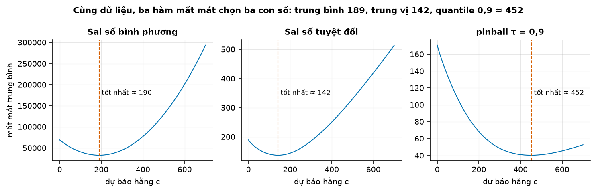
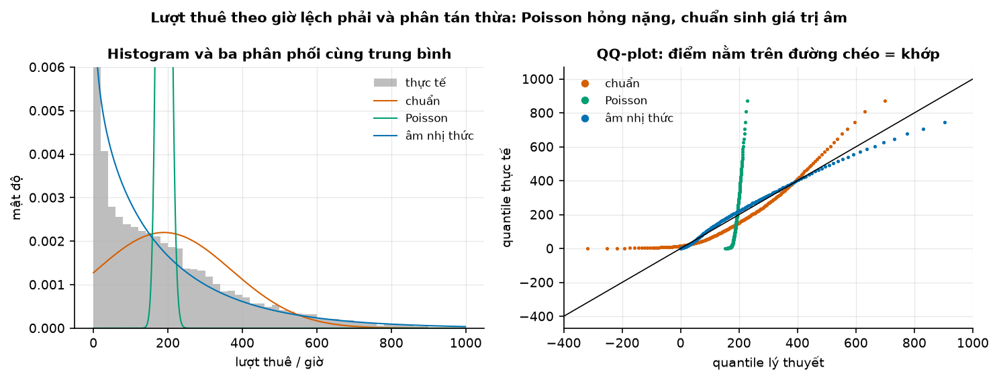
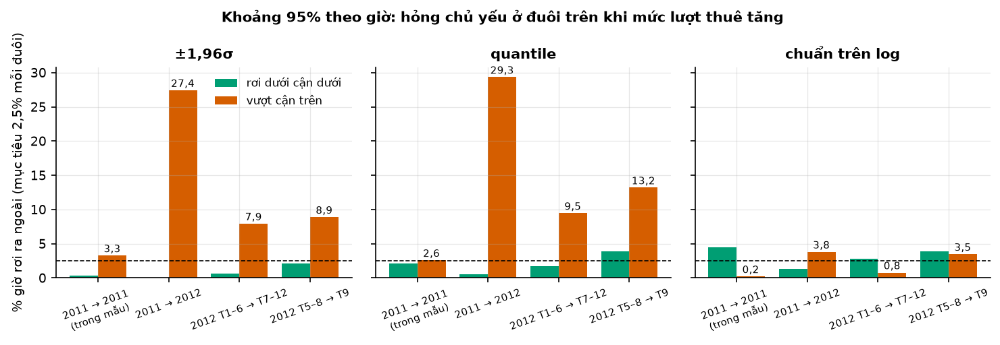
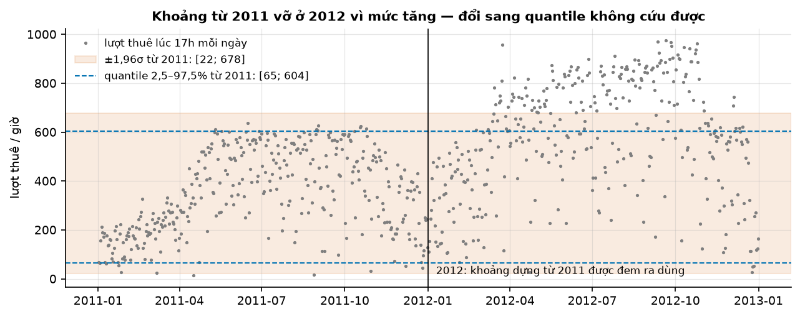
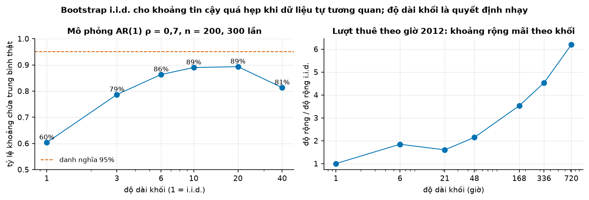

# Buổi 2 — Xác suất và thống kê cho dự báo

## 1. Mục tiêu

Sau buổi này bạn:

- Đọc được một dự báo như một **phân phối**: CDF, quantile, trung bình, trung vị — và chọn con số nào tuỳ theo hàm mất mát
  của quyết định.
- Tự viết hàm quantile và bootstrap bằng NumPy, khớp từng số với `np.quantile` và `scipy.stats.bootstrap`.
- Chọn phân phối cho dữ liệu đếm (chuẩn, Poisson, âm nhị thức) bằng histogram, QQ-plot và AIC.
- Đo **tỷ lệ phủ thật** của một khoảng "95%", tách được hai lý do nó hỏng: **sai hình dạng** và **tương lai khác quá khứ**.
- Giải thích vì sao bootstrap i.i.d. cho khoảng tin cậy quá hẹp trên chuỗi thời gian, và sửa bằng block bootstrap — kèm
  cái giá phải trả là chọn độ dài khối.

## 2. Nhắc lại buổi trước

Buổi 1 đặt bài toán dự báo thành sáu ô: quyết định, biến mục tiêu, tầm dự báo, độ chi tiết, mốc cắt dữ liệu, chi phí sai
hai chiều. Hai ý dùng ngay hôm nay:

- **Chi phí sai không đối xứng** — thiếu xe đạp ở trạm lúc cao điểm khác chi phí với thừa xe. Con số "tốt nhất" để báo cáo phụ
  thuộc chi phí đó; mục 4.2 chỉ ra chính xác nó phụ thuộc thế nào.
- **Đánh giá trên dữ liệu chưa dùng để làm dự báo.** Buổi 1 thấy sai số trên dữ liệu huấn luyện đẹp giả tạo. Hôm nay gặp lại ý
  đó ở dạng khoảng: một khoảng phủ 96% trên chính năm dựng ra nó có thể chỉ phủ 72% ở năm sau.

## 3. Trạng thái đầu buổi

Sau `cd lab && make up`:

| Hạng mục | Trạng thái |
|---|---|
| Dữ liệu | `du-lieu/raw/uci-bike-sharing/hour.csv` — 17.379 giờ, 01/01/2011 → 31/12/2012, sha256 `e03de4ee4ef4`; `day.csv` 731 ngày; `Readme.txt` |
| Nguồn | Capital Bikeshare (Washington D.C.), UCI Machine Learning Repository, CC BY 4.0 (`NGUON.txt`) |
| Môi trường | Python 3.12; numpy 2.5.3, pandas 3.0.5, scipy 1.18.1, statsmodels 0.15.0, matplotlib 3.11.2 |
| `code/xac_suat.py` | `quantile_tu_viet`, `khoang_du_bao`, `ty_le_phu`, `khoang_tin_cay_trung_binh`, `ar1`, `ty_le_phu_khoang_tin_cay`, `doc_luot_thue`, `khoang_theo_gio` |
| **Đang cố tình sai** | `khoang_du_bao` = trung bình ± 1,96σ; `khoang_tin_cay_trung_binh` lấy mẫu lại từng giờ độc lập |
| **Triệu chứng** | trên dữ liệu log-chuẩn cận dưới âm, đuôi dưới gần 0%; khoảng tin cậy 95% trên AR(1) chỉ chứa trung bình thật **60%** số lần |
| `make check` lúc này | ĐỎ: 5/8 test hỏng |

## 4. Lý thuyết

### 4.1 Phân phối, CDF, quantile

**Trực giác.** Lượt thuê xe lúc 17h ngày mai chưa biết. Cái ta nói được là *khả năng* của từng mức: 400 lượt thì hay gặp, 900
lượt thì hiếm. Đó là một **biến ngẫu nhiên** $Y$ và **phân phối** của nó.

**Công thức.** Hàm phân phối tích luỹ $F(y) = P(Y \le y)$. **Quantile** mức $p$ là ngưỡng mà $Y$ không vượt quá với xác suất
$p$:

$$
q_p = \inf\{\, y : F(y) \ge p \,\}
$$

Trung vị là $q_{0.5}$. Từ mẫu hữu hạn có nhiều quy ước; Hyndman & Fan (1996) liệt kê 9 loại. `np.quantile` mặc định dùng loại 7:
sắp tăng $x_{(0)} \le \dots \le x_{(n-1)}$, tính $h = (n-1)p$, rồi nội suy

$$
\hat q_p = x_{(\lfloor h \rfloor)} + \big(h - \lfloor h \rfloor\big)\big(x_{(\lfloor h \rfloor + 1)} - x_{(\lfloor h \rfloor)}\big)
$$

**Tự viết bằng NumPy** (`quantile_tu_viet`, test đối chiếu `np.quantile` với n = 1, 2, 7, 100 và 21 mức $p$):

```python
x = np.sort(np.asarray(x, dtype=float))
h = (x.size - 1) * q
duoi = np.floor(h).astype(int)
tren = np.minimum(duoi + 1, x.size - 1)
return x[duoi] + (h - duoi) * (x[tren] - x[duoi])
```

**Thư viện:** `np.quantile(x, q, method="linear")`. So số với R hay Excel mà lệch thì kiểm phương pháp tính trước khi nghi code.

### 4.2 Trung bình, trung vị, quantile — ba câu trả lời cho ba câu hỏi

Gneiting (2011) chứng minh: sai số bình phương là hàm mất mát nhất quán với **trung bình**, sai số tuyệt đối với **trung vị**,
và pinball loss mức $\tau$ với **quantile** $\tau$:

$$
L_\tau(y, c) = \begin{cases} \tau\,(y - c) & y \ge c \\ (1-\tau)\,(c - y) & y < c \end{cases}
$$

Chạy trên chính lượt thuê theo giờ — tìm hằng số $c$ làm nhỏ nhất từng hàm mất mát:

| Tối thiểu hoá | $c$ tối ưu | Đại lượng mẫu |
|---|---|---|
| trung bình $(y - c)^2$ | 189,46 | trung bình 189,46 |
| trung bình $\lvert y - c\rvert$ | 142,0 | trung vị 142 |
| pinball $\tau = 0.9$ | 452,0 | quantile 0,9 (loại 7) 451,2 |



**Đọc hình.** Mỗi đường là mất mát trung bình trên 17.379 giờ khi dự báo mọi giờ bằng cùng một hằng số $c$ (lưới bước 2). Đường
bình phương đối xứng quanh 190 và dốc rất nhanh về bên phải — vài giờ 900 lượt kéo nó; đường tuyệt đối có đáy ở 142; pinball
$\tau = 0{,}9$ phạt dự báo thấp gấp 9 lần dự báo cao nên đáy dời hẳn sang 452 và bên trái dốc hơn bên phải.

(Dữ liệu là số nguyên nên mọi giá trị giữa hai điểm kề 451 và 452 đều tối ưu như nhau; phép tối ưu dừng ở 452.) Chênh lệch 189 so
với 142 là 33%: với dữ liệu lệch phải, "dự báo trung bình" và "dự báo trung vị" là hai con số khác nhau. Một trạm cần **ít khi
thiếu xe** nên dựa vào quantile cao, không dựa vào trung bình.

### 4.3 Chọn phân phối cho dữ liệu đếm

Lượt thuê theo giờ có trung bình 189,46, độ lệch chuẩn 181,39, hệ số lệch 1,277. Ba ứng viên:

- **Chuẩn** $N(\mu, \sigma^2)$ — đối xứng, cho phép giá trị âm.
- **Poisson** $P(Y = k) = e^{-\mu}\mu^k/k!$ — phương sai **bằng** trung bình.
- **Âm nhị thức** — phương sai $\mu + \alpha\mu^2$ **lớn hơn** trung bình (phân tán thừa).

Phương sai thật chia trung bình ở đây là **173,7**: Poisson bị loại trước khi vẽ.



**Đọc hình.** Bên trái: đường Poisson là một cột nhọn quanh 189 — phân phối gần như không có ai thuê 20 hay 600 xe, trong khi
histogram có rất nhiều. Đường chuẩn bắt đầu từ trên 0 ở trục trái: nó gán **14,8%** xác suất cho số lượt âm (đã tính $F(0)$).
Âm nhị thức bám theo cả phần dốc gần 0 và đuôi dài. Bên phải là **QQ-plot**: quantile thực tế theo quantile lý thuyết; khớp thì
nằm trên đường chéo. Poisson dựng đứng (quá hẹp), chuẩn cong chữ S và có quantile lý thuyết âm, âm nhị thức gần đường chéo tới
khoảng 400 rồi nằm dưới (dự báo đuôi trên dài hơn thực tế).

Con số đi kèm: AIC chuẩn 230.086,2; Poisson 3.002.494,2; âm nhị thức 216.800,4. Quantile 0,99 thực tế 782; chuẩn nói 611, Poisson
222, âm nhị thức 953. Không phân phối nào hoàn hảo — dữ liệu là **hỗn hợp** 24 giờ khác nhau (phương sai âm nhị thức 42.685 so
với thực tế 32.900). Mô hình có điều kiện theo giờ sẽ tốt hơn; đó là việc của các buổi mô hình.

**MLE.** Tham số được ước lượng bằng **hợp lý cực đại**: chọn $\theta$ làm $L(\theta) = P(\text{dữ liệu} \mid \theta)$ lớn nhất.
Likelihood là xác suất *của dữ liệu* khi biết tham số, không phải xác suất của tham số. Với âm nhị thức giữ trung bình bằng trung
bình mẫu và tối ưu $n$ liên tục ta được $n = 0{,}8447$ ($\alpha = 1/n = 1{,}1838$, log-likelihood −108.398,2); statsmodels
`NegativeBinomial` cho đúng $\alpha = 1{,}1838$. `scipy.stats.fit(stats.nbinom, …)` lại ra $n = 1{,}0$ tròn, AIC 217.131,3 — vì
tài liệu scipy nói với phân phối rời rạc "parameters which must be integral will be constrained to integral values".

### 4.4 Khoảng dự báo: đo tỷ lệ phủ thật

**Khoảng tin cậy** nói về một **tham số** (ví dụ trung bình). **Khoảng dự báo** nói về một **giá trị chưa quan sát** — lượt thuê
lúc 17h ngày mai. Khoảng dự báo luôn phải rộng hơn vì phải chứa cả biến động của chính quan sát mới. Hyndman viết khoảng dự báo là
"an interval associated with a random variable yet to be observed".

Công thức quen thuộc cho khoảng 95%: $\bar y \pm 1{,}96\, s$. Nó đúng khi dữ liệu gần chuẩn, độc lập, và **tương lai giống quá
khứ**. Kiểm cả ba điều trên lượt thuê bằng cách dựng khoảng riêng cho mỗi giờ trong ngày từ lịch sử, rồi đếm:

| Lịch sử → chấm trên | ±1,96σ: phủ (dưới / trên) | quantile thực nghiệm: phủ (dưới / trên) |
|---|---|---|
| 2011 → chính 2011 | 96,4% (0,3% / 3,3%) | 95,3% (2,2% / 2,6%) |
| 2011 → 2012 | **72,5%** (0,1% / 27,4%) | **70,1%** (0,5% / 29,3%) |
| 2012 tháng 1–6 → tháng 7–12 | 91,5% (0,6% / 7,9%) | 88,8% (1,8% / 9,5%) |
| 2012 tháng 5–8 → tháng 9 | 89,0% (2,1% / 8,9%) | 82,9% (3,9% / 13,2%) |

**Hai bệnh khác nhau.**

1. **Sai hình dạng** (dòng 1). Trong mẫu, ±1,96σ phủ 96,4% — trông tốt — nhưng đuôi dưới chỉ 0,3% và đuôi trên 3,3%, lệch xa
   2,5% / 2,5%. Với khoảng chung không tách giờ, cận dưới là **−118,4** lượt. Quantile thực nghiệm sửa đúng bệnh này: 2,2% / 2,6%.
2. **Tương lai khác quá khứ** (dòng 2). Lượt thuê trung bình tăng từ 143,8 (2011) lên 234,7 (2012). Mọi khoảng dựng từ 2011 đều
   vỡ đuôi trên — 27% đến 29% giờ năm 2012 vượt cận trên. Đổi ±1,96σ sang quantile **không cứu được** (70,1%). Dùng lịch sử gần
   hơn (dòng 3) đỡ hơn nhiều. Muốn sửa thật phải mô hình hoá mức tăng — việc của các buổi mô hình.



**Đọc hình.** Mỗi cột là phần trăm giờ rơi ra ngoài một đuôi; đường gạch là mục tiêu 2,5%. Cột cam (vượt cận trên) cao vọt ở
mọi kịch bản chấm ngoài mẫu với hai cách đầu — dấu hiệu dịch chuyển mức, không phải nhiễu. Quantile thậm chí tệ hơn ±1,96σ ngoài
mẫu: nó bám sát hình dạng của lịch sử, còn ±1,96σ "vô tình" rộng hơn ở đuôi trên. Ô thứ ba (thang log) bàn ở mục 4.5.



**Đọc hình.** Mỗi chấm là lượt thuê lúc 17h một ngày. Bên trái vạch đen (2011), chấm nằm trong cả dải cam (±1,96σ) và giữa hai
vạch xanh (quantile). Bên phải (2012), cả mùa hè nổi lên trên hai đường cận: không phải khoảng hẹp mà là mức đã đổi. Khoảng cam
còn đưa cận dưới xuống 22 — gần như "có thể không ai thuê xe lúc 17h" — trong khi cận quantile là 65.

Một lưu ý khi đọc các bảng xếp hạng: M4 báo hai phương pháp đứng đầu "achieved an amazing success in specifying the 95%
prediction intervals correctly" — tức là việc đạt đúng tỷ lệ phủ là thành tích đáng kể, không phải điều mặc nhiên.

### 4.5 Thang log: khoảng "phủ 94,9%" chưa chắc là khoảng tốt

Một mẹo phổ biến cho dữ liệu dương lệch phải: lấy $z = \log y$, dựng $\bar z \pm 1{,}96\, s_z$, rồi mũ ngược lại. Cận dưới luôn
dương. Chạy thật trên cùng các kịch bản (phủ / dưới / trên):

| Lịch sử → chấm trên | chuẩn trên log |
|---|---|
| 2011 → chính 2011 | 95,3% (**4,5%** / 0,2%) |
| 2011 → 2012 | **94,9%** (1,3% / 3,8%) |
| 2012 tháng 1–6 → tháng 7–12 | 96,4% (2,8% / 0,8%) |
| 2012 tháng 5–8 → tháng 9 | 92,6% (3,9% / 3,5%) |

Nhìn cột 2011 → 2012 thì tưởng tìm được lời giải. Không phải:

- **Trong mẫu đuôi đã lệch** — 4,5% dưới, 0,2% trên. Log "sửa quá tay": dữ liệu mỗi giờ lệch phải ít hơn log-chuẩn, nên cận trên bị
  đẩy quá xa.
- **Khoảng rất rộng.** Lúc 17h, khoảng log từ 2011 là **[82; 1077]** lượt — cận trên cao hơn mọi giá trị 17h của cả năm 2012
  (0% vượt). Nó "đỡ" được mức tăng 2012 vì quá rộng, không vì hiểu mức tăng. So với quantile [65; 604] thì người vận hành trạm
  gần như không dùng được con số 1077.
- **Mũ ngược lại cho trung vị, không cho trung bình.** FPP §5.6: "the back-transformed point forecast will not be the mean of the
  forecast distribution. In fact, it will usually be the median". Cộng các dự báo trung vị của 24 giờ không ra dự báo trung bình
  của cả ngày.

Bài học: một con số tỷ lệ phủ không đủ. Luôn báo **cả hai đuôi** và **độ rộng**; đánh giá độ sắc nét cùng lúc với độ phủ — ý này
thành chỉ số (interval score, CRPS) ở các buổi đánh giá dự báo xác suất.

### 4.6 Luật số lớn, CLT — và khi nào chúng không cứu bạn

**Định lý giới hạn trung tâm** nói trung bình mẫu của các quan sát **i.i.d.** có phương sai **hữu hạn** tiến tới phân phối
chuẩn. Hai điều kiện in đậm hay bị quên. Hesterberg (2015) cảnh báo với dữ liệu lệch: "The Central Limit Theorem operates on glacial
time scales."

Chuỗi thời gian vi phạm "i.i.d." gần như luôn luôn. Lượt thuê có tự tương quan trễ 1 giờ là **0,844**. Với chuỗi AR(1) hệ số
$\rho$, $n$ quan sát chỉ mang thông tin như khoảng

$$
n_{\text{eff}} \approx n\,\frac{1-\rho}{1+\rho}
$$

quan sát độc lập. $\rho = 0{,}7$ và $n = 200$ cho $n_{\text{eff}} \approx 35$. Mọi khoảng tin cậy tính như thể có 200 quan sát độc
lập sẽ quá hẹp.

### 4.7 Bootstrap và block bootstrap

**Trực giác.** Muốn biết trung bình mẫu dao động bao nhiêu mà không có công thức: lấy mẫu lại có hoàn lại từ chính dữ liệu (Efron,
1979), tính trung bình mỗi lần, xem các trung bình đó trải rộng bao nhiêu. Lấy quantile 2,5% và 97,5% của chúng là khoảng tin
cậy **percentile**.

Nhưng lấy từng giờ độc lập làm **xáo trộn** thứ tự — mọi phụ thuộc biến mất. **Moving block bootstrap** (Künsch, 1989) chọn lại cả
**khối** $l$ quan sát liền nhau, giữ phụ thuộc bên trong khối.

**Ví dụ tay.** Mẫu 5 ngày $x = [12, 15, 11, 30, 14]$, trung bình 16,4. Với `rng = np.random.default_rng(3)`, ba lần lấy chỉ số có
hoàn lại `rng.integers(0, 5, size=(3, 5))`:

| lần | chỉ số | mẫu lại | trung bình |
|---|---|---|---|
| 1 | 4, 0, 0, 1, 0 | 14, 12, 12, 15, 12 | 13,0 |
| 2 | 4, 4, 2, 0, 0 | 14, 14, 11, 12, 12 | 12,6 |
| 3 | 1, 2, 3, 2, 1 | 15, 11, 30, 11, 15 | 16,4 |

Lặp vài nghìn lần, độ trải của cột cuối là độ bất định của trung bình. Lần 1 và 2 không chọn ngày 30 — một giá trị ngoại lai quyết
định phần lớn độ rộng khoảng khi mẫu nhỏ. Nếu 5 ngày này liền nhau và ngày 30 kéo theo ngày 14 cao hơn bình thường, lấy mẫu từng
ngày riêng lẻ sẽ tách hai ngày đó ra — đúng chỗ block bootstrap sửa.

**Tự viết bằng NumPy** — một hàm cho cả hai (`l = 1` là i.i.d.):

```python
def _chi_so_bootstrap(n, so_lan, l, rng):
    if l <= 1:
        return rng.integers(0, n, size=(so_lan, n))
    so_khoi = int(np.ceil(n / l))
    bat_dau = rng.integers(0, n - l + 1, size=(so_lan, so_khoi))
    return (bat_dau[:, :, None] + np.arange(l)).reshape(so_lan, -1)[:, :n]

tb = x[_chi_so_bootstrap(x.size, 1999, l, rng)].mean(axis=1)
lo, hi = np.quantile(tb, [0.025, 0.975])
```

**Thư viện.** `scipy.stats.bootstrap((x,), np.mean, method="percentile", rng=…)` chỉ làm bản i.i.d. — scipy không có block
bootstrap. Trên cùng một chuỗi AR(1) (seed 7, 9.999 lần) bản tự viết và scipy cho **cùng khoảng** $[-0{,}634;\,-0{,}303]$; block
bootstrap cho $[-0{,}810;\,-0{,}201]$ (khối 6) — rộng gần gấp đôi. Gói `arch` có `MovingBlockBootstrap`, `StationaryBootstrap` và chọn độ
dài khối tự động (Politis & White, 2004).



**Đọc hình trái.** Mô phỏng 300 chuỗi AR(1) $\rho = 0{,}7$, $n = 200$, trung bình thật bằng 0. Bootstrap i.i.d. ($l = 1$) chỉ chứa
trung bình thật **60,3%** số lần. Khối dài 6 ($\approx n^{1/3}$) lên 86,3%, 10–20 đạt 89%, rồi khối 40 tụt về 81,3% vì chỉ còn 5
khối cho mỗi lần lấy mẫu. Không có độ dài nào đạt đủ 95% ở cỡ mẫu này.

**Đọc hình phải.** Lượt thuê theo giờ năm 2012: độ rộng khoảng tin cậy của trung bình, chia cho bản i.i.d. Khối $n^{1/3} = 21$ giờ
rộng ×1,60; khối 1 tuần (168 giờ) ×3,53; khối 1 tháng (720 giờ) ×6,19 — đường cứ đi lên, không có mặt bằng. Lý do: chuỗi có xu
hướng tăng và mùa vụ, "trung bình của năm 2012" không phải một tham số ổn định. Hall, Horowitz & Jing (1995) cho thấy độ dài khối
tối ưu tăng theo **bậc** $n^{1/3}$ (khi ước lượng phương sai) — đó là tốc độ, không phải hằng số đúng cho mọi chuỗi.

## 5. Lab từng bước

### Bước 1 — Dựng nền và chạy code có sẵn

```bash
cd lab && make up
env -u VIRTUAL_ENV uv run --no-sync --project 00-nen python ../code/xac_suat.py
make check
```

Output của `code/`: khoảng theo giờ từ 2011 chấm trên 2012 phủ `0.7251` (dưới `0.0007`, trên `0.2742`); khoảng tin cậy bootstrap trên
AR(1) phủ `0.6033`. `make check`: 5 test hỏng.

### Bước 2 — Histogram, ba phân phối, QQ-plot

Đọc `du-lieu/raw/uci-bike-sharing/hour.csv`, cột `cnt`. Tính trung bình, trung vị, độ lệch chuẩn, tỷ lệ phương sai/trung bình.
Khớp chuẩn và Poisson bằng trung bình mẫu; khớp âm nhị thức bằng MLE (tối ưu `-stats.nbinom.logpmf(y, n, n/(n+mu)).sum()` theo
$\log n$). So AIC và QQ-plot. Thử `scipy.stats.fit` và giải thích vì sao ra $n = 1$.

```python
import numpy as np
from scipy import optimize, stats
from xac_suat import doc_luot_thue

y = doc_luot_thue()["cnt"].to_numpy()
mu, sd = y.mean(), y.std(ddof=1)

def nll_nb(ln):                                   # tối ưu theo log n để n luôn dương
    n = np.exp(ln)
    return -stats.nbinom.logpmf(y, n, n / (n + mu)).sum()

n = float(np.exp(optimize.minimize_scalar(nll_nb, bounds=(-5, 5), method="bounded").x))
ll = {"chuẩn": stats.norm.logpdf(y, mu, sd).sum(), "Poisson": stats.poisson.logpmf(y, mu).sum(), "âm nhị thức": -nll_nb(np.log(n))}
so_tham_so = {"chuẩn": 2, "Poisson": 1, "âm nhị thức": 2}
for ten, v in ll.items():
    print(f"{ten:12s} AIC = {2 * so_tham_so[ten] - 2 * v:,.1f}")
print(f"n = {n:.4f}  α = 1/n = {1 / n:.4f}  P(Y<0) chuẩn = {stats.norm.cdf(0, mu, sd):.3f}")
print(stats.fit(stats.nbinom, y, bounds={"n": (0, 10), "p": (0, 1)}).params)
```

```text
chuẩn        AIC = 230,086.2
Poisson      AIC = 3,002,494.2
âm nhị thức  AIC = 216,800.4
n = 0.8447  α = 1/n = 1.1838  P(Y<0) chuẩn = 0.148
FitParams(n=np.float64(1.0), p=np.float64(0.005250356167783752), loc=np.float64(0.0))
```

### Bước 3 — Quantile và bootstrap tự viết

Chạy test `test_quantile_khop_numpy` (đã xanh). So `khoang_tin_cay_trung_binh(x, do_dai_khoi=1, so_lan=9999, seed=7)` với
`scipy.stats.bootstrap((x,), np.mean, n_resamples=9999, method="percentile", rng=np.random.default_rng(7))` trên
`x = ar1(200, 0.7, np.random.default_rng(7))`.

```python
x = ar1(200, 0.7, np.random.default_rng(7))
print(np.round(khoang_tin_cay_trung_binh(x, so_lan=9999, do_dai_khoi=1, seed=7), 3))
kq = stats.bootstrap((x,), np.mean, n_resamples=9999, method="percentile", rng=np.random.default_rng(7))
print(np.round([kq.confidence_interval.low, kq.confidence_interval.high], 3))
print(np.round(khoang_tin_cay_trung_binh(x, so_lan=9999, do_dai_khoi=6, seed=7), 3))
```

```text
[-0.634 -0.303]      # tự viết, i.i.d.
[-0.634 -0.303]      # scipy, i.i.d. — trùng từng chữ số vì cùng dãy số ngẫu nhiên
[-0.81  -0.201]      # tự viết, khối 6 ≈ 200^(1/3): rộng gần gấp đôi
```

Hai khoảng i.i.d. trùng nhau cho thấy phần lấy mẫu lại viết đúng; khác biệt với khối 6 là do **cách lấy mẫu**, không phải lỗi code.

### Bước 4 — Đo tỷ lệ phủ thật, sửa `khoang_du_bao`

Chạy lại bảng mục 4.4 với code của bạn. Đổi `khoang_du_bao` sang quantile thực nghiệm (dùng `quantile_tu_viet`). Chạy lại: dòng
"2011 → 2011" phải cân hai đuôi, dòng "2011 → 2012" vẫn khoảng 70% — viết hai câu giải thích vì sao không đổi được.

### Bước 5 — Sửa `khoang_tin_cay_trung_binh`

Mặc định phải lấy mẫu theo khối; độ dài khối mặc định $\max(2, \operatorname{round}(n^{1/3}))$. Chạy `ty_le_phu_khoang_tin_cay` với
`do_dai_khoi` = 1, 3, 6, 10, 20, 40 và vẽ lại hình trái mục 4.7.

```bash
make check     # phải xanh 8/8
```

## 6. Lỗi thường gặp & cách chẩn đoán

| Triệu chứng | Nguyên nhân | Chẩn đoán | Sửa |
|---|---|---|---|
| Cận dưới âm cho dữ liệu không âm | ±1,96σ trên dữ liệu lệch phải | so cận dưới với 0; đếm từng đuôi | quantile thực nghiệm, hoặc làm trên thang log |
| "Khoảng 95% phủ 96%" nhưng một đuôi gần 0% | chỉ đếm tỷ lệ phủ tổng | báo cả hai đuôi | `ty_le_phu` trả dưới/trên |
| Khoảng phủ tốt trong mẫu, vỡ ở năm sau | tương lai khác quá khứ (mức tăng) | chấm trên dữ liệu sau mốc dựng khoảng | lịch sử gần hơn; mô hình mức/xu hướng |
| Khoảng tin cậy hẹp bất thường trên chuỗi thời gian | bootstrap i.i.d., bỏ qua tự tương quan | ACF trễ 1; so với block bootstrap | block bootstrap; kiểm độ nhạy theo độ dài khối |
| Khoảng tin cậy đổi mạnh khi đổi độ dài khối | chuỗi không dừng (xu hướng, mùa vụ) | vẽ độ rộng theo độ dài khối | tách xu hướng/mùa vụ trước; báo độ nhạy |
| Poisson cho khoảng dự báo quá hẹp | phương sai lớn hơn trung bình nhiều lần | tỷ lệ phương sai/trung bình | âm nhị thức hoặc mô hình có điều kiện |
| `scipy.stats.fit(nbinom, …)` ra n nguyên | scipy ràng buộc tham số nguyên với phân phối rời rạc | xem `fit.params.n` | MLE tự viết hoặc statsmodels NB2 |
| `AttributeError: 'nbinom_gen' object has no attribute 'fit'` | phân phối rời rạc không có `.fit` | — | `scipy.stats.fit` hoặc tự tối ưu |
| Tin "95% khoảng tin cậy nghĩa là 95% khả năng chứa giá trị thật" | hiểu sai khoảng tin cậy tần suất | — | 95% là tần suất của **quy trình** khi lặp lại (Greenland et al., 2016) |
| Kết quả `np.quantile` khác R/Excel | khác loại quantile | `method=` | ghi rõ phương pháp khi so |

## 7. Bài tập về nhà

1. **Khoảng theo giờ và loại ngày.** Dựng khoảng quantile theo (giờ, `workingday`) từ tháng 1–6/2012, chấm trên tháng 7–12/2012.
   So với bảng mục 4.4 dòng 3. Tách theo loại ngày có giúp đuôi cân hơn không?
2. **Cửa sổ trượt.** Dựng khoảng cho mỗi tháng 2012 từ 8 tuần ngay trước đó. Vẽ tỷ lệ phủ theo tháng. Tháng nào vỡ, vì sao?
3. **Dữ liệu ngày.** Với `day.csv` năm 2012 (366 ngày), tính khoảng tin cậy trung bình lượt thuê ngày bằng i.i.d. và block bootstrap
   khối 7, 14, 30. Lập bảng độ rộng và viết một đoạn: bạn sẽ báo con số nào cho quản lý, kèm cảnh báo gì.

## 8. Tiêu chí "Xong khi"

- [ ] `make check` xanh 8/8.
- [ ] Giải thích bằng số vì sao khoảng ±1,96σ theo giờ dựng từ 2011 chỉ phủ khoảng 73% trên 2012, và vì sao quantile thực nghiệm
      không sửa được (nhưng sửa được hình dạng đuôi trong mẫu).
- [ ] Giải thích vì sao bootstrap i.i.d. cho khoảng tin cậy chỉ phủ khoảng 60% trên AR(1) $\rho = 0{,}7$, và block bootstrap sửa tới
      đâu.
- [ ] Chọn được phân phối cho lượt thuê theo giờ bằng tỷ lệ phương sai/trung bình, QQ-plot và AIC.

## 9. Đọc thêm

- Hyndman, R.J., Athanasopoulos, G. et al. *Forecasting: Principles and Practice, the Pythonic Way* — chương 5 (khoảng dự báo, bootstrap
  phần dư, biến đổi và bias adjustment): https://otexts.com/fpppy/
- Hyndman, R.J. — *The difference between prediction intervals and confidence intervals*: https://robjhyndman.com/hyndsight/intervals/
- Gneiting, T. (2011). Making and evaluating point forecasts. *JASA* 106(494), 746–762. https://arxiv.org/abs/0912.0902
- Hyndman, R.J. & Fan, Y. (1996). Sample quantiles in statistical packages. *The American Statistician* 50(4), 361–365.
- Efron, B. (1979). Bootstrap methods: another look at the jackknife. *Annals of Statistics* 7(1), 1–26.
- Künsch, H.R. (1989). The jackknife and the bootstrap for general stationary observations. *Annals of Statistics* 17(3), 1217–1241.
- Hall, P., Horowitz, J.L. & Jing, B.-Y. (1995). On blocking rules for the bootstrap with dependent data. *Biometrika* 82(3), 561–574.
- Hesterberg, T. (2015). What teachers should know about the bootstrap. arXiv:1411.5279
- Greenland, S. et al. (2016). Statistical tests, P values, confidence intervals, and power: a guide to misinterpretations. *European
  Journal of Epidemiology* 31, 337–350.
- SciPy — `scipy.stats.bootstrap`, `scipy.stats.fit`; statsmodels — `NegativeBinomial`; arch — `arch.bootstrap`.
- Phụ lục B của khoá — xác suất thống kê tối thiểu.
