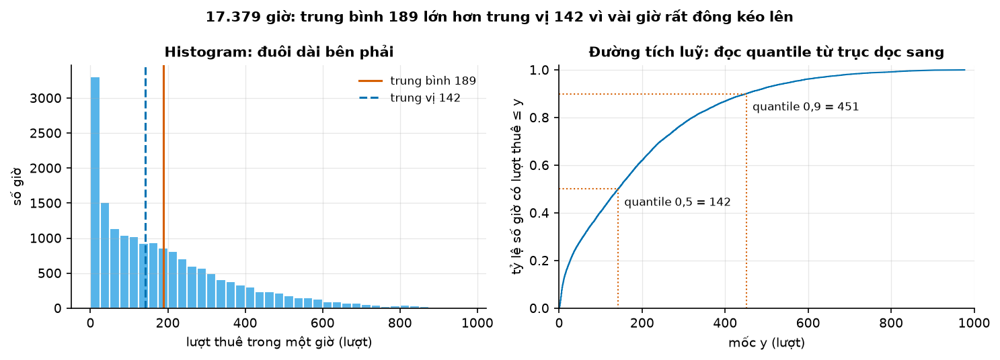
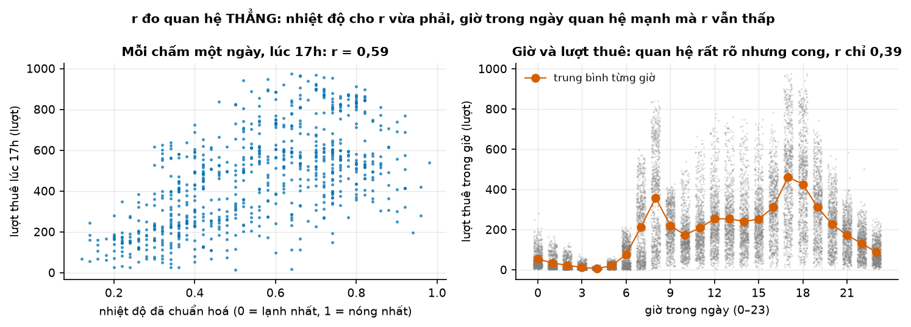
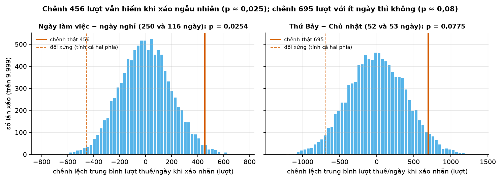

# Buổi 2 — Xác suất và thống kê cho dự báo

## 1. Mục tiêu

Tính tay quantile, trung vị, trung bình, độ lệch chuẩn, hệ số tương quan $r$; biết 1,96 từ đâu ra và đo tỷ lệ phủ thật
của khoảng "95%"; đọc một kiểm định giả thuyết; biết vì sao chuỗi thời gian cần block bootstrap.

## 2. Nhắc lại buổi trước

- **Sai số = thực tế − dự báo.** Dự báo 400, thực tế 460 thì sai số +60: ta đã dự báo **thấp**.
- **Chi phí lệch không đối xứng.** Mỗi đơn vị thiếu mất $C_u$ đồng, mỗi đơn vị thừa mất $C_o$ đồng thì nên đặt ở
  quantile mức $C_u/(C_u + C_o)$: thiếu mất 4, thừa mất 1 → quantile 0,8.
- **Chấm trên dữ liệu chưa dùng.** Đo trên dữ liệu đã dùng để dựng dự báo thì đẹp giả tạo.

## 3. Trạng thái đầu buổi

Sau `cd lab && python lab.py up`:

| Hạng mục | Trạng thái |
|---|---|
| Dữ liệu | `du-lieu/raw/uci-bike-sharing/hour.csv` — 17.379 giờ, 01/01/2011 → 31/12/2012 (đủ thì là 17.544; thiếu 165 giờ không có số liệu), sha256 `e03de4ee4ef4`; `day.csv` 731 ngày; `Readme.txt` |
| Nguồn | Capital Bikeshare (Washington D.C.), UCI Machine Learning Repository, CC BY 4.0 (`NGUON.txt`) |
| Môi trường | Python 3.12; numpy 2.5.3, pandas 3.0.5, scipy 1.18.1, statsmodels 0.15.0, matplotlib 3.11.2 |
| `code/xac_suat.py` | `quantile_tu_viet`, `khoang_du_bao`, `ty_le_phu`, `khoang_tin_cay_trung_binh`, `ar1`, `ty_le_phu_khoang_tin_cay`, `doc_luot_thue`, `khoang_theo_gio` |
| **Đang cố tình sai** | `khoang_du_bao` = trung bình ± 1,96 × độ lệch chuẩn; `khoang_tin_cay_trung_binh` lấy mẫu lại từng giờ độc lập |
| **Triệu chứng** | trên dữ liệu luôn dương và lệch phải, cận dưới âm, đuôi dưới gần như không bao giờ bị vượt; khoảng tin cậy 95% trên chuỗi mô phỏng tự tương quan chỉ chứa trung bình thật **60%** số lần |
| `python lab.py check` lúc này | ĐỎ: 5/8 test hỏng |

`python lab.py check` chạy bộ chấm tự động (các test).

## 4. Lý thuyết

### Từ mới trong buổi

| Thuật ngữ | Nghĩa một câu | Ví dụ |
|---|---|---|
| biến ngẫu nhiên (random variable) | Đại lượng chưa biết trước giá trị, chỉ biết khả năng của từng giá trị. | Lượt thuê lúc 17h mai. |
| histogram | Biểu đồ cột đếm có bao nhiêu giá trị rơi vào mỗi khoảng. | 0–9: 6 số; 10–19: 2 số. |
| quantile, trung vị | Quantile $p$: giá trị nhỏ nhất mà ít nhất tỷ lệ $p$ số liệu ≤ nó. Trung vị là quantile 0,5. | Mục 4.1. |
| phương sai, độ lệch chuẩn | Tổng bình phương khoảng cách tới trung bình, chia $n-1$; độ lệch chuẩn là căn của nó. | 2, 4, 6 → 4 và 2. |
| hệ số lệch (skewness) | Dương khi đuôi phải dài (vài số rất lớn). Khác độ lệch chuẩn. | 1, 1, 2, 2, 3, 20 → dương. |
| pinball loss | Phạt dự báo quantile $\tau$: thiếu phạt $\tau$, thừa phạt $1-\tau$ mỗi đơn vị. | $\tau$ = 0,8, thật 10, dự báo 8 → 1,6. |
| phân phối chuẩn (normal distribution) | Hình chuông đối xứng; 95% giá trị trong trung bình ± 1,96 độ lệch chuẩn. | 100 ± 1,96 × 10 → 80,4–119,6. |
| khoảng tin cậy | Khoảng cho một con số cố định chưa biết. | Cho trung bình thật. |
| tỷ lệ phủ (coverage) | Tỷ lệ số lần giá trị thật rơi vào khoảng. | 64 trên 100 lần trúng → 64%. |
| trong mẫu / ngoài mẫu | Đo trên dữ liệu đã dùng / chưa dùng để dựng. | Dựng từ 2011, chấm 2012. |
| xu hướng | Hướng đi lâu dài của chuỗi. | Lượt thuê 2011 → 2012 tăng. |
| tương quan (hệ số $r$) | Số từ −1 đến 1 đo hai biến cùng tăng giảm theo đường thẳng tới đâu. | 1, 2, 3 và 2, 4, 6 → $r$ = 1. |
| tự tương quan (autocorrelation) | Tương quan của chuỗi với chính nó dời lùi $k$ bước. | 1, 3, 1, 3 → trễ 1: −0,75. |
| kiểm định, giả thuyết không ($H_0$) | Xem dữ liệu có đủ bằng chứng bác bỏ giả định mặc định $H_0$ không. | $H_0$: "đồng xu cân đối". |
| p-value | Nếu $H_0$ đúng, xác suất gặp kết quả lệch cỡ này hoặc hơn. | ≥ 9 ngửa / 10 lần: 11/1.024. |
| mức ý nghĩa ($\alpha$) | Ngưỡng chọn trước; p nhỏ hơn thì bác bỏ $H_0$. Hay dùng 0,05. | p = 0,011 → bác bỏ. |
| mẫu / tổng thể | Mẫu: số liệu có trong tay. Tổng thể: mọi giá trị đo được nếu đo mãi; "trung bình thật" là trung bình của nó. | 9 giờ 17h đang có / mọi giờ 17h. |
| seed | Con số khởi đầu của bộ sinh số ngẫu nhiên; cùng seed thì ra cùng dãy số. | `np.random.default_rng(2026)`. |
| i.i.d. | Độc lập (biết lần này không giúp đoán lần kia) và cùng phân phối (mọi lần rút từ cùng một "hộp"). | Các lần tung một xúc xắc. |
| định lý giới hạn trung tâm (CLT) | Trung bình của nhiều số i.i.d. có phân phối gần hình chuông. | Trung bình 30 lần tung xúc xắc ≈ 3,5. |
| tự hồi quy (autoregressive), AR(1) | Giá trị mới = $\rho$ × giá trị cũ + phần ngẫu nhiên. | 0,7 × 10 + 0,5 = 7,5. |
| cỡ mẫu hiệu dụng (effective sample size) | Số quan sát độc lập mà dữ liệu tự tương quan "đáng giá". | 200 điểm, $\rho$ = 0,7 → 35. |
| bootstrap, block bootstrap | Rút lại có hoàn lại từ chính dữ liệu để xem một con số dao động cỡ nào; block rút cả khúc liền nhau. | Từ 5, 7, 9 rút 7, 7, 5. |

### 4.1 Phân phối, quantile, trung vị

**Vấn đề.** Lúc 17h mai trạm có bao nhiêu lượt thuê? Không ai biết chắc, nhưng dưới 100 lượt thì hiếm, quanh 400 thì
hay gặp. Cần cách ghi lại "khả năng của từng mức".

**Trực giác.** Bảng "mỗi giá trị hay gặp tới đâu" của một biến ngẫu nhiên là **phân phối** của nó. Xem lại nhiều ngày
cũ là thấy được phân phối.

**Ví dụ số nhỏ — tự tính tay.** Lượt thuê của 9 giờ đêm khác nhau: 8, 2, 36, 5, 12, 3, 18, 6, 9.

1. **Xếp tăng dần:** 2, 3, 5, 6, 8, 9, 12, 18, 36.
2. **Histogram**: 0–9 → 6 số, 10–19 → 2 số, 20–29 → 0 số, 30–39 → 1 số. Cột cao bên trái, thấp dần sang phải, và
   một số lẻ loi rất xa (36): phân phối **lệch phải**, hay có **đuôi phải dài**.
3. **Đường tích luỹ** (CDF, hàm phân phối tích luỹ) tại mốc $y$ là tỷ lệ số giá trị nhỏ hơn hoặc bằng $y$. Tại 8: có 5
   số ≤ 8 (2, 3, 5, 6, 8) → 5/9 ≈ 0,56. Tại 12: có 7 số → 7/9 ≈ 0,78.
4. **Quantile** làm ngược lại: cho một tỷ lệ, tìm mốc. Quantile mức $p$ là giá trị **nhỏ nhất** mà ít nhất tỷ lệ $p$
   số liệu nhỏ hơn hoặc bằng nó.

Cách đếm tay (giống buổi 1): xếp tăng, lấy vị trí $= p \times n$, **làm tròn lên**.

- Quantile 0,8: 0,8 × 9 = 7,2, làm tròn lên thành 8. Số thứ 8 là **18** (kiểm lại ở "Nói bằng lời" dưới).
- Quantile 0,5: 0,5 × 9 = 4,5, làm tròn lên thành 5. Số thứ 5 là **8**. Đây là **trung vị**, số đứng giữa.
- Số lượng **chẵn** thì không có số đứng giữa. Với 1, 2, 3, 4, đếm tay cho 2; `np.median` lấy trung bình hai số giữa,
  2,5. Chỉ khác quy ước.

Hiểu lầm hay gặp: quantile 0,8 **không phải** "80% của số lớn nhất" (0,8 × 36 = 28,8).



**Cách đọc hình.**

1. **Trục ngang**: lượt thuê một giờ (ô trái, khoảng rộng 25 lượt); mốc $y$ (ô phải).
2. **Trục dọc**: số giờ mỗi khoảng (trái); tỷ lệ giờ có lượt thuê ≤ $y$ (phải).
3. **Ký hiệu**: cam liền là trung bình, xanh đứt là trung vị; chấm cam ô phải chỉ cách đọc quantile.
4. **Nhìn vào đâu**: ô phải, đi ngang từ 0,9 tới đường cong rồi thả xuống: gặp 451. Từ 0,5: gặp 142.
5. **Kết luận**: lệch phải; trung bình (189) lớn hơn trung vị (142) vì vài giờ rất đông kéo lên.

**Công thức.**

$$
F(y) = \frac{\text{số giá trị} \le y}{n}, \qquad q_p = \min\{\, y : F(y) \ge p \,\}
$$

- $n$: số giá trị. $F(y)$: đường tích luỹ, tỷ lệ giá trị không vượt $y$.
- $\{\, y : F(y) \ge p \,\}$: "tập các mốc $y$ mà tỷ lệ không vượt $y$ ít nhất là $p$". Dấu hai chấm đọc là "sao cho".
- $\min$: lấy mốc nhỏ nhất trong tập đó. $q_p$: quantile mức $p$.

**Nói bằng lời.** Quantile $p$ là mốc nhỏ nhất đủ để tỷ lệ $p$ số liệu nằm dưới hoặc bằng nó. Với 9 số trên và
$p$ = 0,8: $F(12) = 7/9 \approx 0{,}78$ chưa đủ, $F(18) = 8/9 \approx 0{,}89$ đủ, nên $q_{0,8} = 18$.

**Tự viết bằng NumPy — và vì sao máy ra số khác.** `np.quantile` mặc định **nội suy**: đặt mức $q$ ở vị trí
$(n - 1) \times q$ (đếm từ 0) rồi lấy điểm giữa hai số kề nhau theo phần lẻ:

```python
import numpy as np

def quantile_tu_viet(x, q):
    x = np.sort(np.asarray(x, dtype=float))   # 2, 3, 5, 6, 8, 9, 12, 18, 36 — đánh số 0, 1, …, 8
    h = (x.size - 1) * q                      # vị trí "lẻ": (9 − 1) × 0,8 = 6,4
    duoi = np.floor(h).astype(int)            # phần nguyên của h: 6  → x[6] = 12
    tren = np.minimum(duoi + 1, x.size - 1)   # số kế tiếp: 7         → x[7] = 18
    return x[duoi] + (h - duoi) * (x[tren] - x[duoi])   # 12 + 0,4 × (18 − 12) = 14,4

quantile_tu_viet([8, 2, 36, 5, 12, 3, 18, 6, 9], 0.8)   # 14.4
```

Đây là hàm `quantile_tu_viet` trong `code/`. Thêm `method="inverted_cdf"` thì máy đếm như tay:
`np.quantile(x, 0.8, method="inverted_cdf")` ra 18. Với hàng nghìn số, hai cách gần như trùng nhau.

**Tóm lại.** **Trung vị là quantile 0,5. Tay đếm vị trí làm tròn lên; máy mặc định nội suy nên có thể ra số lẻ.**

**Tự kiểm tra.** Dãy 4, 1, 7, 3, 10. Tính tay quantile 0,6.

<details>
<summary>Đáp án</summary>

Xếp tăng: 1, 3, 4, 7, 10. Vị trí 0,6 × 5 = 3, đã là số nguyên nên không cần làm tròn. Số thứ 3 là **4**. Kiểm lại:
3 trên 5 số (60%) ≤ 4, tức đủ "ít nhất 60%".

</details>

### 4.2 Trung bình, độ phân tán — và nên báo con số nào

**Vấn đề.** Chỉ được báo **một** con số thì chọn trung bình, trung vị hay quantile? Đo độ dao động bằng gì?

**Trực giác.** Lương 9 nhân viên và 1 giám đốc: trung bình bị lương giám đốc kéo lên, trung vị thì không.

**Mẫu và tổng thể** (bảng Từ mới). Lấy 9 giờ khác thì trung bình mẫu ra số khác. "**Lặp lại việc lấy mẫu**" (mục
4.3, 4.6) là tưởng tượng làm vậy rất nhiều lần.

**Ví dụ số nhỏ — tự tính tay.** Vẫn 9 giờ: 2, 3, 5, 6, 8, 9, 12, 18, 36.

1. **Trung bình** = tổng chia số lượng: 99/9 = 11 (trung vị chỉ 8, vì số 36 kéo trung bình lên).
2. **Độ lệch** mỗi số khỏi trung bình: 2 − 11 = −9, rồi lần lượt −8, −6, −5, −3, −2, 1, 7, 25.
3. **Bình phương** các độ lệch: 81, 64, 36, 25, 9, 4, 1, 49, 625. Tổng = 894.
4. **Phương sai**: 894 / (9 − 1) = 111,75 (đơn vị: lượt bình phương).
5. **Độ lệch chuẩn**: √111,75 ≈ 10,57 lượt. Đây là "khoảng cách điển hình" từ một số tới trung bình.

**$s$ và $\sigma$.** Chia $n - 1$ như trên cho $s$ = 10,57, dùng khi ước lượng tổng thể từ một mẫu. Chia $n$ cho
$\sigma$ (sigma) = 9,97, dùng khi các số đang có là cả tổng thể; nên $\sigma$ còn là **độ lệch chuẩn của tổng thể**.
Vì sao chia $n - 1$: Phụ lục B, mục 5.

**Hệ số lệch** đo đuôi dài về phía nào: trung bình của $(\text{độ lệch}/s)^3$. Lập phương giữ dấu và phóng đại số
lớn, nên số 36 (lệch +25) góp gần hết: kết quả **+1,35**, đuôi phải dài. scipy và pandas dùng quy ước hơi khác, cùng
dấu (Phụ lục B, mục 6).

**Công thức.**

$$
\bar y = \frac{1}{n}\sum_{i=1}^{n} y_i, \qquad s^2 = \frac{1}{n-1}\sum_{i=1}^{n}(y_i - \bar y)^2, \qquad s = \sqrt{s^2}
$$

- $y_i$: giá trị thứ $i$. $\sum_{i=1}^{n}$: cộng từ giá trị thứ 1 tới thứ $n$.
- $\bar y$ (đọc "y gạch"): trung bình. $s^2$: phương sai. $s$: độ lệch chuẩn (chia $n - 1$). Khoảng "trung bình
  ± 1,96 × $s$" ở mục 4.3 gọi tắt là **±1,96s**.

**Nói bằng lời.** Công thức chính là các bước 1–5 ở trên; $s$ cùng đơn vị với dữ liệu.

**Con số nào để báo? Tuỳ cách bị phạt.** **Hàm mất mát** là quy tắc tính tiền phạt cho một dự báo sai. Với giá trị
thật $y$ và dự báo $c$:

- **Tuyệt đối** $\lvert y - c \rvert$: lệch bao nhiêu phạt bấy nhiêu, thiếu hay thừa như nhau.
- **Bình phương** $(y - c)^2$: lệch 2 phạt 4, lệch 10 phạt 100, nên rất sợ lệch xa.
- **Pinball** mức $\tau$: thiếu mỗi đơn vị phạt $\tau$, thừa mỗi đơn vị phạt $1 - \tau$.

Dự báo mọi giờ bằng cùng một con số $c$, tính phạt trung bình trên 9 giờ:

| Dự báo c | Phạt tuyệt đối trung bình | Phạt bình phương trung bình | Pinball τ = 0,8 trung bình |
|---|---|---|---|
| 8 (trung vị) | **6,56** | 108,3 | 4,18 |
| 11 (trung bình) | 7,33 | **99,3** | 3,67 |
| 18 (quantile 0,8) | 11,00 | 148,3 | **3,40** |

**Đọc bảng.** Mỗi cột có đáy (in đậm) ở một dòng khác; thử mọi $c$ từ 0 tới 40 cũng ra đúng ba đáy này. Vì sao
(chi tiết: Phụ lục B, mục 8):

- **Tuyệt đối → trung vị.** Nhích $c$ lên 1: số bên dưới phạt thêm 1, số bên trên bớt 1; hai bên cân ở trung vị.
- **Bình phương → trung bình.** Số ở xa (36) bị phạt rất nặng nên kéo $c$ về phía nó; tổng phạt nhỏ nhất đúng khi
  độ lệch dương và âm cộng lại bằng 0, tức $c$ là trung bình.
- **Pinball $\tau$ → quantile $\tau$.** Nhích $c$ lên 1: số dưới $c$ phạt thêm $1 - \tau$, số trên bớt $\tau$. Hai bên
  cân khi tỷ lệ số nằm dưới $c$ đúng bằng $\tau$.

**Pinball loss** là cách phạt của bài toán chi phí lệch ở buổi 1:

$$
L_\tau(y, c) = \begin{cases} \tau\,(y - c) & \text{nếu } y \ge c \text{ (dự báo thiếu)} \\ (1-\tau)\,(c - y) & \text{nếu } y < c \text{ (dự báo thừa)} \end{cases}
$$

- $y$: giá trị thật. $c$: con số dự báo. $\tau$ (tau): mức quantile muốn nhắm, từ 0 tới 1.

**Nói bằng lời.** Với $\tau$ = 0,8: thật 36, dự báo 18 thì thiếu 18, phạt 0,8 × 18 = 14,4. Thật 2, dự báo 18 thì thừa
16, phạt 0,2 × 16 = 3,2. Thiếu đắt gấp 0,8/0,2 = 4 lần thừa, đúng tỷ lệ 4 : 1 ở buổi 1.

**Tự viết bằng NumPy.**

```python
y = np.array([2, 3, 5, 6, 8, 9, 12, 18, 36])
y.mean(), np.median(y), y.var(ddof=1), y.std(ddof=1)   # 11.0, 8.0, 111.75, 10.57 — ddof=1 là chia n − 1
sai = y - 18                                            # dự báo c = 18
np.where(sai >= 0, 0.8 * sai, -0.2 * sai).mean()        # pinball 0,8: 3.40
```

`pd.Series(y).std()` mặc định chia $n - 1$, còn `np.std(y)` chia $n$: luôn ghi rõ `ddof`.

**Dữ liệu thật.** Lượt thuê theo giờ có trung bình 189,46, độ lệch chuẩn 181,39, hệ số lệch 1,277. Hình dưới thử mọi
hằng số $c$ trên cả 17.379 giờ, với pinball $\tau$ = **0,9**.


**Cách đọc hình.**

1. **Trục ngang**: con số dự báo $c$ dùng chung cho mọi giờ, 0 tới 700 lượt, bước 2.
2. **Trục dọc**: phạt trung bình; đơn vị khác nhau giữa ba ô nên chỉ so hình dạng.
3. **Ký hiệu**: trái bình phương, giữa tuyệt đối, phải pinball $\tau$ = 0,9; vạch cam đứt là $c$ tốt nhất.
4. **Nhìn vào đâu**: vị trí đáy mỗi ô. Ô phải dốc bên trái hơn vì dự báo thấp bị phạt gấp 9 lần.
5. **Kết luận**: mỗi cách phạt chọn một con số khác nhau, như ví dụ 9 giờ.

| Ô | Cách phạt | Đáy của đường | Đại lượng của mẫu |
|---|---|---|---|
| trái | bình phương | 189,46 | trung bình |
| giữa | tuyệt đối | 142 | trung vị |
| phải | pinball $\tau$ = 0,9 | 452 | quantile 0,9 ≈ 451 |

**Đọc bảng.** Đáy khớp đại lượng của mẫu (dòng cuối lệch 1 lượt vì $c$ đi bước 2).

**Tóm lại.** **Độ lệch chuẩn đo độ phân tán; hệ số lệch dương báo đuôi phải dài. Con số nên báo do cách phạt quyết
định: bình phương → trung bình, tuyệt đối → trung vị, pinball $\tau$ → quantile $\tau$.**

**Tự kiểm tra.** Dãy 1, 2, 3, 4, 100. Cửa hàng bị phạt thiếu và thừa như nhau mỗi đơn vị. Nên báo 22 hay 3?

<details>
<summary>Đáp án</summary>

Phạt thiếu và thừa như nhau mỗi đơn vị là phạt tuyệt đối, nên báo **trung vị 3**; trung bình 22 bị số 100 kéo lên.
Trung bình chỉ tốt nhất khi phạt theo bình phương.

</details>

### 4.3 Khoảng dự báo, tỷ lệ phủ, và con số 1,96

**Vấn đề.** Báo "17h mai có 65 tới 604 lượt, khả năng 95%" giúp trạm biết cần chuẩn bị tối đa bao nhiêu xe. Nhưng
"95%" có thật là 95% không?

**Trực giác.** Nói "mai 28–33 độ, 95%" nhiều lần mà cứ 100 lần trúng 95 thì lời hứa giữ được: **tỷ lệ phủ** đạt 95%.

**Đường cong thay cho histogram.** Chia chiều cao mỗi cột cho (tổng số giờ × độ rộng cột) thì tổng diện tích các cột bằng một. Khi đó diện tích mỗi cột
là tỷ lệ số giờ rơi vào cột ấy (cột có diện tích 0,2 chứa 20% số giờ). Cột thật hẹp thì đỉnh các cột thành đường cong trơn: **diện tích dưới đường cong bên trái $y$ = tỷ lệ giá trị ≤ $y$**.

**Con số 1,96 đến từ phân phối chuẩn**, đường cong hình chuông đối xứng quanh trung bình. Theo `scipy.stats.norm.cdf`
(tỷ lệ bên trái một mốc), phần nằm giữa:

| Khoảng quanh trung bình | Tỷ lệ giá trị nằm trong |
|---|---|
| ± 1 độ lệch chuẩn | 68,3% |
| ± 1,96 độ lệch chuẩn | 95,0% |
| ± 2 độ lệch chuẩn | 95,4% |

**Đọc bảng.** 1,96 làm phần giữa đúng 95%, mỗi **đuôi** còn 2,5%. Vậy 1,96 là quantile 0,975 của phân phối chuẩn có
trung bình 0, độ lệch chuẩn 1 (với đường cong, quantile $p$ là mốc có diện tích bên trái bằng $p$). Mọi phân phối
chuẩn là cùng hình chuông dời đi và co giãn, nên 1,96 dùng được cho tất cả.

Kiểm bằng máy: hàm quantile `norm.ppf(0.975)` cho 1,95996; rút 100.000 số chuẩn (seed 0) thì 94,98% nằm trong ±1,96.

**Ví dụ số nhỏ — tự tính tay.** Hai phép tính.

1. **Khoảng ±1,96 trên 9 giờ ở mục 4.1.** Trung bình 11, độ lệch chuẩn 10,57. Cận dưới 11 − 1,96 × 10,57 = −9,7.
   Cận trên 11 + 20,7 = 31,7. Cận dưới **âm** là vô lý với số lượt thuê. Số 36 lại nằm ngoài cận trên.
2. **Đếm tỷ lệ phủ, tách hai đuôi.** Khoảng [4; 20] và 10 giá trị thật 3, 7, 12, 15, 9, 30, 11, 6, 2, 25.
   - Trong khoảng: 7, 12, 15, 9, 11, 6 → 6/10 = 60% (tỷ lệ phủ).
   - Rơi **dưới** cận dưới: 3, 2 → 20%. Vượt **trên** cận trên: 30, 25 → 20%.
   - Khoảng 95% tốt có khoảng 2,5% ở **mỗi** đuôi.

**Công thức** của khoảng 95%, hai cách:

$$
\big[\, \bar y - 1{,}96\, s \;;\; \bar y + 1{,}96\, s \,\big] \quad \text{hoặc} \quad \big[\, q_{0,025} \;;\; q_{0,975} \,\big]
$$

- $\bar y$, $s$: trung bình và độ lệch chuẩn của lịch sử (mục 4.2).
- $q_{0,025}$, $q_{0,975}$: quantile 0,025 và 0,975 của lịch sử (mục 4.1), gọi là **khoảng quantile thực nghiệm**.

**Nói bằng lời.** Cách một lấy trung bình cộng trừ 1,96 lần độ lệch chuẩn, chỉ đúng khi dữ liệu hình chuông. Cách hai
lấy thẳng hai mốc có 2,5% lịch sử nằm dưới và 2,5% nằm trên.

- Lượt thuê 17h năm 2011, cách một → [22; 678] lượt.
- Cùng dữ liệu, cách hai → [65; 604] lượt: cận dưới cao hơn, cận trên thấp hơn, đúng hình lệch phải.

**Khoảng dự báo khác khoảng tin cậy.**

Khoảng dự báo cho **một giá trị chưa quan sát** (lượt thuê 17h mai) nên thêm dữ liệu cũng không hẹp về 0. Khoảng tin
cậy cho **một con số cố định chưa biết** (trung bình thật) nên càng nhiều dữ liệu càng hẹp (mục 4.6).

**Tự viết bằng NumPy.** Hàm `ty_le_phu` trong `code/` tính phủ, dưới, trên bằng `np.mean((y >= lo) & (y <= hi))`,
`np.mean(y < lo)`, `np.mean(y > hi)`: với [4; 20] ra 0,6; 0,2; 0,2.

**Dữ liệu thật.** Mỗi giờ trong ngày có một khoảng 95%, dựng từ lượt thuê ở đúng giờ đó của mọi ngày lịch sử, rồi
chấm từng giờ của đoạn được chấm.

| Cách dựng | Chấm trên | Phủ | Rơi dưới cận dưới | Vượt cận trên |
|---|---|---|---|---|
| ±1,96s | 2011 (trong mẫu) | 96,4% | 0,3% | 3,3% |
| quantile thực nghiệm | 2011 (trong mẫu) | 95,3% | 2,2% | 2,6% |
| ±1,96s | 2012 (ngoài mẫu) | 72,5% | 0,1% | 27,4% |
| quantile thực nghiệm | 2012 (ngoài mẫu) | 70,1% | 0,5% | 29,3% |

**Đọc bảng.**

- **Hai dòng đầu: sai hình dạng.** Trong mẫu, hai cách phủ gần như nhau, nhưng ±1,96s lệch hai đuôi (dưới gần 0,
  trên quá 2,5%). Quantile thực nghiệm cân lại hai đuôi.
- **Hai dòng sau: tương lai khác quá khứ.** Lượt thuê trung bình mỗi giờ tăng từ 143,8 (2011) lên 234,7 (2012), nên
  gần 3 trên 10 giờ của 2012 vượt cận trên. Đó là **dịch mức**: cả chuỗi dời lên cao hơn.
- Quantile **không cứu được** dịch mức, còn kém ±1,96s một chút: $s$ bị vài giờ rất đông kéo to nên cận trên cao thừa,
  vô tình đỡ một phần. Sửa dịch mức là việc của các buổi mô hình.

**Tóm lại.** **Dữ liệu lệch phải làm ±1,96s sai hình dạng; quantile thực nghiệm sửa được, nhưng cả hai vỡ khi tương lai
dịch mức. Luôn chấm ngoài mẫu và báo riêng hai đuôi.**

**Tự kiểm tra.** Khoảng 95% chấm trên 200 giờ: 190 giờ nằm trong, 0 giờ dưới cận dưới, 10 giờ vượt cận trên. Khoảng có
tốt không?

<details>
<summary>Đáp án</summary>

Phủ 190/200 = 95%, nhưng đuôi dưới 0% và đuôi trên 5%, lệch xa 2,5% mỗi bên: cả khoảng nằm **thấp hơn** mức cần.
Chỉ nhìn "95%" thì sẽ tưởng khoảng tốt.

</details>

### 4.4 Tương quan

**Vấn đề.** Trời ấm thì nhiều người thuê xe hơn không? Nếu có, nhiệt độ dự báo giúp dự báo lượt thuê. Cần một con số
đo "hai đại lượng cùng tăng giảm tới đâu".

**Trực giác.** Nếu ngày nóng hơn thường cũng là ngày đông hơn thường, hai đại lượng "cùng chiều": tương quan dương.

**Ví dụ số nhỏ — tự tính tay.** 5 ngày, nhiệt độ $x$ (°C) và lượt thuê $y$ (trăm lượt). Trung bình $\bar x$ = 100/5 = 20,
$\bar y$ = 350/5 = 70; hai cột giữa của bảng là độ lệch khỏi hai trung bình này:

| Ngày | x (°C) | y (trăm lượt) | x − 20 | y − 70 | tích |
|---|---|---|---|---|---|
| 1 | 10 | 40 | −10 | −30 | 300 |
| 2 | 15 | 60 | −5 | −10 | 50 |
| 3 | 20 | 50 | 0 | −20 | 0 |
| 4 | 25 | 90 | 5 | 20 | 100 |
| 5 | 30 | 110 | 10 | 40 | 400 |

**Đọc bảng.** Cột "tích" dương khi hai độ lệch cùng dấu. Không có tích âm nào, nên hai đại lượng cùng chiều.

Các bước còn lại:

- Tổng các tích: 300 + 50 + 0 + 100 + 400 = 850.
- Tổng bình phương độ lệch của $x$: 100 + 25 + 0 + 25 + 100 = 250. Của $y$: 900 + 100 + 400 + 400 + 1.600 = 3.400.
- $r = 850 / \sqrt{250 \times 3.400} = 850 / 922{,}0 \approx$ **0,922**.

**Công thức.**

$$
r = \frac{\sum_{i}(x_i - \bar x)(y_i - \bar y)}{\sqrt{\sum_{i}(x_i - \bar x)^2 \cdot \sum_{i}(y_i - \bar y)^2}}
$$

- $x_i, y_i$: cặp giá trị thứ $i$ (cùng một ngày). $\bar x, \bar y$: hai trung bình.
- Tử số: tổng các tích độ lệch, dương khi hai bên hay cùng chiều. Mẫu số: chia để $r$ luôn nằm từ −1 tới 1.

**Nói bằng lời.** Nhân độ lệch của hai đại lượng theo từng ngày, cộng lại, rồi chia cho một số chuẩn hoá. Với 5 ngày
trên: 850 / 922,0 = 0,922, gần 1, tức gần như cùng tăng theo một đường thẳng.

$r$ = 1 là cùng chiều hoàn hảo trên đường thẳng, −1 ngược chiều hoàn hảo, 0 là không có quan hệ **thẳng**. Đổi đơn
vị không đổi $r$, vì tử và mẫu cùng nhân lên.



**Cách đọc hình.**

1. **Trục ngang**: nhiệt độ đã chuẩn hoá, 0 lạnh nhất, 1 nóng nhất (trái); giờ trong ngày (phải).
2. **Trục dọc**: lượt thuê; ô trái chỉ lúc 17h, ô phải mọi giờ.
3. **Ký hiệu**: ô trái mỗi chấm là một ngày; ô phải chấm xám là từng giờ, đường cam là trung bình mỗi giờ.
4. **Nhìn vào đâu**: ô trái, đám chấm nghiêng lên nhưng loe. Ô phải, đường cam có hai đỉnh (8h, 17h) và đáy lúc 4h.
5. **Kết luận**: $r$ chỉ đo quan hệ **thẳng**; giờ quyết định lượt thuê rất mạnh nhưng theo đường cong (bảng dưới).

**Tự viết bằng NumPy.**

```python
x = np.array([10, 15, 20, 25, 30]); y = np.array([40, 60, 50, 90, 110])
dx, dy = x - x.mean(), y - y.mean()
r = (dx * dy).sum() / np.sqrt((dx**2).sum() * (dy**2).sum())   # 0.922
np.corrcoef(x, y)[0, 1]                                         # 0.922 — thư viện, cùng số
```

Trong pandas, `df[["temp", "cnt"]].corr()` cho cả bảng $r$.

**Dữ liệu thật.** Cột `temp` (nhiệt độ) và `hum` (độ ẩm) đã co giãn về 0–1; $r$ không đổi theo đơn vị nên dùng thẳng.

| Cặp | Mọi giờ (17.379 giờ) | Chỉ lúc 17h (730 ngày; 29/10/2012 thiếu giờ 17) |
|---|---|---|
| nhiệt độ × lượt thuê | 0,405 | 0,588 |
| độ ẩm × lượt thuê | −0,323 | −0,253 |
| giờ trong ngày × lượt thuê | 0,394 | — |

**Đọc bảng.**

- Chỉ xét 17h thì $r$ đổi, vì **giờ** là biến gây nhiễu (hộp "Mượn trước" dưới đây).

**Tương quan không phải nhân quả.** Bán kem và số vụ đuối nước tương quan dương vì cùng tăng khi trời nóng, không phải
vì kem gây đuối nước. Nhưng biến không gây ra $y$ **vẫn có thể giúp dự báo** $y$ (sách FPP, §7.8, xem Đọc thêm).

> **Mượn trước — biến gây nhiễu** (buổi 8 học kỹ)
>
> - **Biến gây nhiễu** (confounder): biến thứ ba tác động lên cả hai đại lượng, làm chúng trông như liên quan. Trời nóng
>   là biến gây nhiễu của cặp kem × đuối nước.
> - "Giờ trong ngày" gây nhiễu cặp độ ẩm × lượt thuê: đêm ẩm hơn ngày (độ ẩm trung bình 0,74 lúc 4h, 0,49 lúc 15h)
>   và đêm cũng vắng người. Chỉ xét 17h (giữ cố định giờ) thì $r$ của độ ẩm yếu đi. Của nhiệt độ lại mạnh lên: trên
>   mọi giờ, lượt thuê lên xuống rất mạnh theo giờ (đêm gần 0, 17h rất cao), phần này gần như không liên quan nhiệt độ
>   nên che mất quan hệ; giữ cố định 17h thì bỏ được phần che đó.

> **Mượn trước — tự tương quan** (buổi 7 học kỹ)
>
> - **Tự tương quan** ở độ trễ $k$: tương quan của một chuỗi với chính nó dời lùi $k$ bước.
> - Ví dụ chuỗi 1, 3, 1, 3: trung bình 2, độ lệch −1, 1, −1, 1. Nhân từng cặp liền nhau: (1)(−1) + (−1)(1) + (1)(−1) = −3.
>   Chia tổng bình phương độ lệch của cả chuỗi (1 + 1 + 1 + 1 = 4) được −0,75: lên xuống xen kẽ. Mẫu số là của
>   **cả chuỗi**, không như $r$ ở trên, nên không ra đúng −1; chuỗi dài thì hai cách gần như bằng nhau.
> - Lượt thuê theo giờ có tự tương quan trễ 1 là **0,844**. Mục 4.6 cho thấy điều này làm hỏng bootstrap.

**Tóm lại.** **$r$ đo hai đại lượng cùng tăng giảm theo đường thẳng tới đâu. $r$ gần 0 vẫn có thể có quan hệ cong.
$r$ lớn chưa chắc là nhân quả, vì có thể có biến gây nhiễu.**

**Tự kiểm tra.** $x$ = −2, −1, 0, 1, 2 và $y = x^2$ = 4, 1, 0, 1, 4. Tính $r$. Hai đại lượng có liên quan không?

<details>
<summary>Đáp án</summary>

$\bar x = 0$, $\bar y = 2$. Độ lệch $y$: 2, −1, −2, −1, 2. Tích với độ lệch $x$: −4, 1, 0, −1, 4, tổng 0. Vậy **$r = 0$**.
Nhưng $y$ hoàn toàn do $x$ quyết định, theo đường cong chữ U: $r = 0$ không có nghĩa "không liên quan".

</details>

### 4.5 Kiểm định giả thuyết

**Vấn đề.** Năm 2012, ngày làm việc trung bình có 5.744,6 lượt thuê, ngày nghỉ 5.288,2: chênh 456 lượt. Khác biệt
thật, hay do may?

**Trực giác.** Tung đồng xu 10 lần được 9 ngửa. "Nếu đồng xu cân đối, 9 ngửa trở lên có hiếm không?" Rất hiếm thì
thôi tin nó cân đối.

**Ví dụ số nhỏ — tự tính tay.** Bốn bước, áp cho đồng xu.

1. **Giả thuyết không $H_0$**: giả định "không có gì đặc biệt" mà ta tìm cách bác bỏ. Ở đây: "đồng xu cân đối".
2. **Đại lượng kiểm định**: con số tóm tắt dữ liệu. Ở đây: số lần ngửa, bằng 9.
3. **p-value**: **nếu $H_0$ đúng**, xác suất gặp kết quả lệch cỡ này **hoặc hơn**. Tung 10 lần có $2^{10}$ = 1.024 dãy
   kết quả, dãy nào cũng cùng khả năng. Có 10 dãy đúng 9 ngửa (chọn lần sấp duy nhất) và 1 dãy 10 ngửa. Vậy p = (10 + 1)/1.024 = 11/1.024
   ≈ 0,011.
4. **So với mức ý nghĩa** $\alpha$, ngưỡng chọn **trước** khi xem dữ liệu, hay dùng 0,05 (5%). p = 0,011 < 0,05 nên
   **bác bỏ $H_0$**: dữ liệu khó xảy ra nếu đồng xu cân đối.

Hỏi "đồng xu lệch về bên nào cũng được" thì đếm cả 9 sấp trở lên, gọi là kiểm định **hai phía** (p = 22/1.024).
Chỉ dùng một phía khi hướng đã định **trước** khi xem dữ liệu; không chắc thì dùng hai phía (mặc định của khoá).
$C(n, k)$ là số cách chọn $k$ lần ngửa trong $n$ lần, ví dụ $C(10, 7) = (10 × 9 × 8)/(3 × 2 × 1) = 120$ và
$C(10, 8) = 45$. Nếu chỉ được 7 ngửa: có 120 + 45 + 10 + 1 = 176 dãy từ 7 ngửa trở lên, p = 176/1.024 ≈ 0,17 > 0,05:
**không bác bỏ**.

Ba câu phải nhớ:

- **Không bác bỏ không phải chứng minh $H_0$ đúng**: có thể tung quá ít.
- **p-value không phải xác suất $H_0$ đúng**, mà là xác suất của dữ liệu **khi giả sử** $H_0$ đúng (Hội Thống kê Hoa
  Kỳ, 2016).
- **Có ý nghĩa thống kê không có nghĩa là khác biệt lớn.** Rất nhiều dữ liệu thì chênh nhỏ xíu cũng cho p nhỏ.

**Kiểm định hoán vị** (permutation test) áp cùng bốn bước cho câu hỏi "hai nhóm có khác nhau không". Ví dụ 6 ngày, lượt
thuê (nghìn lượt): ngày làm việc 5, 7, 6; ngày nghỉ 3, 2, 4.

1. Chênh trung bình thật: (5 + 7 + 6)/3 − (3 + 2 + 4)/3 = 6 − 3 = **3**.
2. $H_0$: nhãn "làm việc/nghỉ" không liên quan tới lượt thuê. Nếu vậy, gán nhãn kiểu nào cũng như nhau.
3. Số cách chọn 3 trong 6 ngày làm nhóm "làm việc" là $C(6, 3) = (6 × 5 × 4)/(3 × 2 × 1) = 20$. Tổng 6 số là 27. Nếu
   nhóm "làm việc" có tổng $A$ thì chênh = $A/3 − (27 − A)/3$. Chênh ≥ 3 cần $A$ ≥ 18, chỉ có 7 + 6 + 5. Chênh ≤ −3 cần
   $A$ ≤ 9, chỉ có 2 + 3 + 4. Vậy 2 trong 20 cách lệch cỡ 3 hoặc hơn **về cả hai phía** (câu hỏi "khác nhau",
   không nói phía nào).
4. p = 2/20 = 0,10, lớn hơn 0,05: **không bác bỏ**. Dù ba ngày làm việc đều cao hơn ba ngày nghỉ, 6 ngày là quá ít để kết luận.

Nhiều ngày thì không liệt kê hết được: máy **xáo nhãn ngẫu nhiên** $B$ lần và đếm.

**Công thức.**

$$
p = \frac{k + 1}{B + 1}
$$

- $B$: số lần xáo nhãn. $k$: số lần xáo cho chênh lệch (bỏ dấu) lớn bằng hoặc hơn chênh lệch thật.
- Cộng 1 ở tử và mẫu là tính cả cách gán nhãn thật, nên p không bao giờ bằng 0.

**Nói bằng lời.** p là tỷ lệ số lần "gán nhãn bừa" mà vẫn ra chênh lệch cỡ thật hoặc hơn. Với ngày làm việc 2012: xáo
9.999 lần, có 253 lần lệch bằng hoặc hơn 456, nên p = (253 + 1)/(9.999 + 1) ≈ 0,025.

**Tự viết bằng NumPy.**

```python
def hoan_vi(y, nhom, so_lan=9999, seed=2026):
    y, nhom = np.asarray(y, dtype=float), np.asarray(nhom, dtype=bool)
    that = y[nhom].mean() - y[~nhom].mean()          # chênh lệch thật
    rng = np.random.default_rng(seed)
    k = 0
    for _ in range(so_lan):
        xao = rng.permutation(nhom)                   # xáo nhãn True/False, giữ nguyên các con số
        k += abs(y[xao].mean() - y[~xao].mean()) >= abs(that)   # hai phía: lệch về bên nào cũng tính
    return that, (k + 1) / (so_lan + 1)
```

`scipy.stats.permutation_test` cho p = 0,023 (seed 2026), lệch nhẹ vì dãy ngẫu nhiên khác.

**Dữ liệu thật.** Lượt thuê theo ngày năm 2012, 9.999 lần xáo, seed 2026:

| So sánh | Số ngày mỗi nhóm | Chênh trung bình (lượt/ngày) | p-value | Ở mức 5% |
|---|---|---|---|---|
| ngày làm việc − ngày nghỉ | 250 và 116 | +456 | 0,025 | bác bỏ $H_0$ |
| thứ Bảy − Chủ nhật | 52 và 53 | +695 | 0,078 | không bác bỏ |

**Đọc bảng.** Dòng 2 chênh **lớn hơn** mà p cũng **lớn hơn**: chỉ khoảng 50 ngày mỗi nhóm nên trung bình dao động
mạnh hơn.



**Cách đọc hình.**

1. **Trục ngang**: chênh lệch trung bình lượt thuê giữa hai nhóm khi nhãn bị xáo (lượt/ngày).
2. **Trục dọc**: số lần xáo rơi vào mỗi khoảng.
3. **Ký hiệu**: ô trái là dòng 1 của bảng, ô phải dòng 2. Cột xanh là chênh lệch "nếu $H_0$ đúng"; vạch cam liền là
   chênh thật, cam đứt là mức đối xứng bên âm.
4. **Nhìn vào đâu**: phần cột ngoài hai vạch cam: ô trái chỉ một mẩu nhỏ, ô phải nhiều hơn hẳn.
5. **Kết luận**: chênh thật ở ô trái hiếm khi do xáo ngẫu nhiên; ở ô phải, với ít ngày, thì không hiếm.

**Một cảnh báo.** Xáo nhãn giả định các ngày **độc lập**, nhưng ngày đông hay đi liền ngày đông (tự tương quan trễ 1
là 0,748). Khi đó p-value thật thường **lớn hơn** số tính được (lý do ở mục 4.6).

**Tóm lại.** **Kiểm định hỏi: nếu $H_0$ đúng, dữ liệu như vậy hiếm cỡ nào? p nhỏ hơn mức ý nghĩa (thường 0,05) thì
bác bỏ $H_0$; không bác bỏ thì chưa kết luận được gì.**

**Tự kiểm tra.** Một báo cáo viết: "Mô hình A và B có p = 0,30, vậy hai mô hình tốt như nhau." Câu này sai ở đâu?

<details>
<summary>Đáp án</summary>

p = 0,30 > 0,05 chỉ cho phép nói **không bác bỏ** "hai mô hình như nhau", không phải chứng minh chúng như nhau: có
thể dữ liệu quá ít để thấy khác biệt.

</details>

### 4.6 Bootstrap và block bootstrap

**Vấn đề.** Trung bình lượt thuê theo giờ năm 2012 là 234,7. Một năm khác "giống hệt" thì con số này dao động bao
nhiêu? Đó là câu hỏi của **khoảng tin cậy** cho trung bình.

**Trực giác: i.i.d., luật số lớn, CLT.**

- **i.i.d.** (bảng Từ mới): tung xúc xắc là i.i.d.; lượt thuê giờ liền nhau thì **không**.
- **Luật số lớn**: với dữ liệu i.i.d., trung bình mẫu càng gần trung bình thật khi $n$ tăng.
- **CLT**: với dữ liệu i.i.d., trung bình mẫu có phân phối gần hình chuông, độ lệch chuẩn $\sigma/\sqrt{n}$.
  $\sigma$ là độ lệch chuẩn của tổng thể, tức độ phân tán của từng giá trị lẻ (thực tế thay bằng $s$).
- **Vì sao $\sqrt n$?** Một đồng xu ghi +1 hoặc −1, mỗi mặt nửa số lần: trung bình 0, bình phương độ lệch luôn là 1,
  nên phương sai 1. Hai đồng độc lập cho tổng −2, 0, 0, 2 (4 khả năng như nhau, là cả tổng thể nên chia 4): phương sai (4 + 0 + 0 + 4)/4 = 2 =
  1 + 1. Số độc lập thì phương sai của tổng bằng tổng các phương sai (Phụ lục B, mục 11). Vậy tổng 4 đồng có phương sai 4, độ lệch chuẩn $\sqrt 4 = 2$ (không phải 4, vì lệch lên lệch xuống
  bù nhau một phần). Chia 4 ra trung bình: 2/4 = 0,5 = $1/\sqrt 4$. Tổng quát: $\sigma/\sqrt n$.

**Ví dụ số nhỏ — kiểm $1/\sqrt n$ bằng máy** (**mô phỏng**: cho máy rút ngẫu nhiên thật nhiều lần). Coi cả 17.379
giờ là tổng thể (trung bình thật 189,5, $\sigma$ = 181,4). Rút **có hoàn lại** $n$ giờ, tính trung bình, lặp 20.000 lần (seed 5):

| Cỡ mẫu n | Độ lệch chuẩn của 20.000 trung bình | σ/√n |
|---|---|---|
| 25 | 36,1 | 181,4/5 = 36,3 |
| 100 | 18,2 | 181,4/10 = 18,1 |
| 400 | 9,1 | 181,4/20 = 9,1 |

**Đọc bảng.** Cột 2 khớp cột 3: dữ liệu lệch phải nhưng trung bình mẫu vẫn dao động đúng $\sigma/\sqrt n$. Tăng $n$ gấp 4
thì độ dao động chỉ giảm một nửa.

Khoảng tin cậy khi đó là trung bình mẫu ± 1,96 × $s/\sqrt n$. Chạy thật (seed 12): coi 8.734 giờ năm 2012 là tổng thể
(trung bình thật 234,7), rút 20 mẫu 100 giờ, mỗi mẫu dựng một khoảng. 19 khoảng chứa 234,7; khoảng thứ 20 là
[148,1; 231,8]. Người chỉ có mẫu thứ 20 không biết mình trượt: "95%" nói về **quy trình** (19 trên 20 lần trúng), không
nói một khoảng cụ thể có 95% khả năng đúng.

**Nhưng dữ liệu tự tương quan chứa ít thông tin hơn.** Giờ này đông thì giờ kế gần như chắc cũng đông, nên giờ kế
mang ít thông tin mới. Mô hình đơn giản nhất cho điều này là **AR(1)**:

$$
x_t = \rho\, x_{t-1} + \varepsilon_t
$$

- $x_t$: giá trị ở bước $t$. $x_{t-1}$: giá trị bước trước. $\rho$ (rho): hệ số, từ −1 tới 1, bằng tự tương quan trễ 1.
- $\varepsilon_t$ (epsilon): phần ngẫu nhiên mới ở bước $t$, i.i.d., trung bình 0.

**Nói bằng lời.** Giá trị mới bằng $\rho$ lần giá trị cũ cộng một cú hích ngẫu nhiên. $\rho$ = 0,7, bước trước 10, cú
hích 0,5: bước này 0,7 × 10 + 0,5 = 7,5.

Với AR(1), $n$ quan sát chỉ đáng giá như $n_{\text{eff}}$ quan sát độc lập (**cỡ mẫu hiệu dụng**):

$$
n_{\text{eff}} \approx n\,\frac{1-\rho}{1+\rho}, \qquad \frac{\text{độ rộng đúng}}{\text{độ rộng tính như i.i.d.}} \approx \sqrt{\frac{n}{n_{\text{eff}}}}
$$

- $n$: số quan sát. $\rho$: tự tương quan trễ 1. Phân số $(1-\rho)/(1+\rho)$ là phần thông tin "mới" mỗi điểm mang
  theo: $\rho$ = 0 cho 1 (độc lập), $\rho$ càng gần 1 càng gần 0. $\rho$ = 0,5 cho 1/3: 3 điểm liền nhau chỉ đáng
  1 điểm độc lập.
- Vế phải: độ rộng tỷ lệ $1/\sqrt{\text{số quan sát độc lập}}$, nên tỷ số hai độ rộng là $\sqrt{n/n_{\text{eff}}}$.

**Nói bằng lời.** $\rho$ = 0,7 và $n$ = 200: $n_{\text{eff}}$ ≈ 200 × 0,3/1,7 ≈ 35. Khoảng tin cậy đúng phải rộng
khoảng $\sqrt{200/35} \approx 2{,}4$ lần khoảng tính như 200 quan sát độc lập.

**Bootstrap** không cần công thức: lấy mẫu lại **có hoàn lại** (rút xong bỏ lại, có thể rút trúng lần nữa) từ chính dữ liệu, cùng cỡ, tính trung
bình, lặp vài nghìn lần. Quantile 0,025 và 0,975 của các trung bình đó là khoảng tin cậy 95% kiểu **percentile**
(quantile viết theo phần trăm).

**Vì sao cách này đúng?** Mẫu rút ngẫu nhiên là **bức ảnh thu nhỏ** của tổng thể, nên rút có hoàn lại từ nó gần giống
rút mẫu mới từ tổng thể, việc ta không làm được. Kiểm bằng máy (seed 11): coi 8.734 giờ năm 2012 là tổng thể và rút
**một** mẫu 100 giờ.

| Cách | Độ lệch chuẩn của 5.000 trung bình |
|---|---|
| rút 5.000 mẫu mới từ tổng thể (điều ta không làm được ngoài đời) | 21,2 |
| bootstrap: rút 5.000 lần có hoàn lại từ chính mẫu 100 giờ | 21,0 |

**Đọc bảng.** Hai số gần bằng nhau: chỉ từ một mẫu, bootstrap đoán đúng độ dao động, với điều kiện mẫu giống tổng thể
**cả về cách các điểm đi cùng nhau**. Chuỗi tự tương quan thì rút từng điểm làm mất điều đó: bootstrap coi $n$ giờ như $n$ điểm độc lập, nên khoảng hẹp
như tính với $n$ chứ không phải $n_{\text{eff}}$.

**Ví dụ số nhỏ — tự tính tay.** 5 ngày liền nhau $x$ = 12, 15, 11, 30, 14 (đánh số 0–4), trung bình 16,4. Ba lần lấy
chỉ số ngẫu nhiên (`np.random.default_rng(3).integers(0, 5, size=(3, 5))`):

| Lần | Chỉ số | Mẫu lại | Trung bình |
|---|---|---|---|
| 1 | 4, 0, 0, 1, 0 | 14, 12, 12, 15, 12 | 13,0 |
| 2 | 4, 4, 2, 0, 0 | 14, 14, 11, 12, 12 | 12,6 |
| 3 | 1, 2, 3, 2, 1 | 15, 11, 30, 11, 15 | 16,4 |

**Đọc bảng.** Lần 1 và 2 không rút trúng số 30 nên trung bình thấp hẳn; thứ tự ngày bị xáo trộn.

**Block bootstrap** (Künsch 1989) rút cả **khối** $l$ ngày liền nhau. Ví dụ khối dài 2 (seed 2):

- Rút 3 điểm bắt đầu (chỉ số 3, 1 và 0) → ba khối (30, 14), (15, 11), (12, 15).
- Nối lại, cắt còn 5 số: 30, 14, 15, 11, 12 → trung bình (30 + 14 + 15 + 11 + 12)/5 = 16,4.
- Ngày 30 và ngày 14 kế tiếp nó đi cùng nhau, nên phụ thuộc giữa hai ngày liền nhau được giữ.

**Tự viết bằng NumPy** — viết bằng vòng lặp cho dễ đọc; `l = 1` là bản i.i.d.:

```python
def chi_so_khoi(n, l, rng):
    """Một lần lấy mẫu lại: danh sách n chỉ số, ghép từ các khối l chỉ số liền nhau."""
    chi_so = []
    while len(chi_so) < n:
        b = int(rng.integers(0, n - l + 1))   # điểm bắt đầu khối, sao cho khối không vượt quá cuối chuỗi
        chi_so.extend(range(b, b + l))       # thêm b, b+1, …, b+l−1
    return chi_so[:n]                        # khối cuối có thể thừa, cắt cho đủ n

rng = np.random.default_rng(2)
chi_so_khoi(5, 2, rng)                       # [3, 4, 1, 2, 0] — đúng ví dụ tay ở trên

tb = [x[chi_so_khoi(len(x), l, rng)].mean() for _ in range(1999)]   # 1999 trung bình mẫu lại
lo, hi = np.quantile(tb, [0.025, 0.975])                             # khoảng tin cậy 95% percentile
```

Hàm `_chi_so_bootstrap` trong `code/` làm đúng việc này nhưng tính mọi lần cùng lúc bằng mảng NumPy, nhanh hơn.

**Thư viện.** `scipy.stats.bootstrap((x,), np.mean, method="percentile", rng=…)` chỉ có bản i.i.d. Thử trên một chuỗi
AR(1) mô phỏng ($\rho$ = 0,7, $n$ = 200, seed 7, 9.999 lần lấy mẫu lại):

| Cách | Khoảng tin cậy 95% cho trung bình |
|---|---|
| tự viết, i.i.d. | [−0,634; −0,303] |
| scipy, i.i.d. | [−0,634; −0,303] |
| tự viết, khối 6 | [−0,810; −0,201] |

**Đọc bảng.** Hai dòng i.i.d. trùng nhau: phần lấy mẫu lại viết đúng. Khối 6 (≈ căn bậc ba của 200, quy tắc kinh
nghiệm) rộng gần gấp đôi. Cả ba không chứa trung bình thật 0 (trung bình mẫu −0,467): khoảng đơn lẻ có thể trượt, nên
phải đo tỷ lệ trượt qua nhiều lần.


**Cách đọc hình.**

1. **Trục ngang**: độ dài khối (1 là i.i.d.), thang nhân (mỗi vạch gấp vài lần vạch trước).
2. **Trục dọc**: tỷ lệ khoảng 95% chứa trung bình thật (trái); độ rộng chia cho độ rộng bản i.i.d. (phải).
3. **Ký hiệu**: ô trái, mỗi chấm là 300 chuỗi AR(1) mô phỏng ($\rho$ = 0,7, $n$ = 200); cam đứt là 95%. Ô phải là
   dữ liệu thật: lượt thuê 2012.
4. **Nhìn vào đâu**: ô trái, chấm đầu (i.i.d.) thấp xa đường 95%, đỉnh cũng không chạm; ô phải, đường đi lên mãi.
5. **Kết luận**: bootstrap i.i.d. cho khoảng quá hẹp khi dữ liệu tự tương quan; độ dài khối là quyết định nhạy.

Số của ô trái (seed 2026, 300 chuỗi, mỗi chuỗi 999 lần lấy mẫu lại):

| Độ dài khối | 1 | 3 | 6 | 10 | 20 | 40 |
|---|---|---|---|---|---|---|
| Tỷ lệ chứa trung bình thật | 60,3% | 78,7% | 86,3% | 89,0% | 89,3% | 81,3% |

**Đọc bảng.** Tỷ lệ tăng từ khối 1 tới khối 20 rồi **tụt** ở khối 40.

- Khối ngắn: mỗi chỗ nối cắt đứt một chỗ phụ thuộc, nên khoảng hẹp.
- Khối dài: chỉ 1 vị trí bắt đầu khối chứa được điểm đầu chuỗi, còn điểm giữa có 40 vị trí, nên hai đầu hiếm khi vào
  mẫu. Mẫu lấy lại nào cũng gần như chỉ là phần giữa chuỗi, nên trung bình của chúng ít khác nhau; khoảng dựng từ độ trải
  của các trung bình đó lại **hẹp**. Luôn thử vài độ dài và báo độ nhạy.
- Với $n$ = 200 không độ dài nào tránh được cả hai. Chuỗi dài hơn thì đỡ: $n$ = 2.000, khối 13 cho 94,0%.

Ô phải (lượt thuê 2012) rộng mãi vì chuỗi có xu hướng: mỗi khối mang mức của mùa nó được cắt ra, khối càng dài thì
trung bình mẫu lại càng phụ thuộc việc rút trúng mùa nào.

**Tóm lại.** **Khoảng tin cậy của trung bình hẹp theo $1/\sqrt n$ khi dữ liệu i.i.d. Dữ liệu tự tương quan chỉ đáng
$n_{\text{eff}} < n$ quan sát, nên bootstrap từng điểm cho khoảng quá hẹp. Block bootstrap sửa phần lớn nhưng nhạy với
độ dài khối.**

**Tự kiểm tra.** Chuỗi 1.000 giờ, tự tương quan trễ 1 là 0,8. $n_{\text{eff}}$ bằng bao nhiêu? Khoảng tin cậy tính như
i.i.d. hẹp đi mấy lần so với đúng?

<details>
<summary>Đáp án</summary>

$n_{\text{eff}}$ ≈ 1.000 × 0,2/1,8 ≈ **111**. Tỷ lệ độ rộng là $\sqrt{1.000/111} = \sqrt{9} = 3$: khoảng i.i.d. hẹp đi
khoảng 3 lần. Quên căn bậc hai sẽ ra "hẹp 9 lần", sai.

</details>

## 5. Lab từng bước

### Bước 1 — Dựng nền và chạy code có sẵn

**Mục đích:** dựng môi trường, thấy hai triệu chứng của `code/`.

```bash
python lab.py up           # trong lab/: môi trường + dữ liệu, kiểm sha256
python lab.py notebook     # mở JupyterLab ở code/, mở lab.ipynb (hoặc mở bằng VS Code)
python lab.py check        # đầu buổi: 5/8 test đỏ
```

**Đọc kết quả:** `0.7251` (72,51%) là tỷ lệ phủ năm 2012 của khoảng dựng từ 2011, khớp bảng mục 4.3; `0.6033` (60%)
khớp dòng "Triệu chứng" ở mục 3.

### Bước 2 — Tương quan và kiểm định hoán vị trên dữ liệu thật

**Mục đích:** tự tính lại các con số của mục 4.4 và 4.5. Từ đây mỗi bước là một nhóm ô trong `code/lab.ipynb`.

**Đọc kết quả:** $r$ khớp bảng mục 4.4, p khớp bảng mục 4.5 (thử cả thứ Bảy − Chủ nhật, `weekday` 6 và 0). p ra 0 là
quên cộng 1 ở tử và mẫu.

### Bước 3 — Quantile và bootstrap tự viết

**Mục đích:** kiểm bootstrap tự viết khớp scipy (bảng "Thư viện" mục 4.6) trước khi sửa code.

**Đọc kết quả:** ba dòng khớp bảng đó; lệch thì kiểm seed và `so_lan`.

### Bước 4 — Đo tỷ lệ phủ thật, sửa `khoang_du_bao`

**Mục đích:** sửa bệnh "sai hình dạng" và thấy nó không sửa được bệnh "dịch mức".

Chạy ô bước 4 một lần. Rồi trong `code/xac_suat.py` đổi `khoang_du_bao` sang quantile thực nghiệm (mức 0,025 và
0,975, dùng `quantile_tu_viet`) và chạy lại ô đó.

**Đọc kết quả:** khớp bảng mục 4.3: "2011 → 2011" cân hai đuôi, "2011 → 2012" vẫn khoảng 70%. Cận dưới còn âm là
chưa thay hết ±1,96s.

### Bước 5 — Sửa `khoang_tin_cay_trung_binh`

**Mục đích:** đổi bootstrap mặc định sang block bootstrap và thấy tỷ lệ phủ tăng.

Trong `code/xac_suat.py`, đặt độ dài khối mặc định $\max(2, \operatorname{round}(n^{1/3}))$. Chạy ô bước 5 (thử độ dài
khối 1, 3, 6, 10, 20, 40), rồi `python lab.py check`: phải xanh 8/8.

**Đọc kết quả:** khớp bảng độ dài khối mục 4.6. Test `test_khoang_tin_cay_van_dung_voi_iid` đỏ là khoảng quá hẹp
ngay cả với dữ liệu độc lập: kiểm lại mức quantile.

## 6. Lỗi thường gặp & cách chẩn đoán

| Triệu chứng | Nguyên nhân | Chẩn đoán | Sửa |
|---|---|---|---|
| Cận dưới âm cho dữ liệu không âm | ±1,96s trên dữ liệu lệch phải | so cận dưới với 0; đếm từng đuôi | quantile thực nghiệm |
| "Khoảng 95% phủ 96%" nhưng một đuôi gần 0% | chỉ đếm tỷ lệ phủ tổng | báo cả hai đuôi | `ty_le_phu` trả dưới/trên |
| Khoảng phủ tốt trong mẫu, vỡ ở năm sau | tương lai dịch mức | chấm trên dữ liệu sau mốc dựng khoảng | lịch sử gần hơn; mô hình mức/xu hướng |
| Khoảng tin cậy hẹp bất thường trên chuỗi thời gian | bootstrap i.i.d. bỏ qua tự tương quan | tự tương quan trễ 1; so với block bootstrap | block bootstrap; kiểm độ nhạy theo độ dài khối |
| "$r$ gần 0 nên hai biến không liên quan" | $r$ chỉ đo quan hệ thẳng | vẽ biểu đồ chấm | nhìn hình trước khi tin $r$ |
| "Tương quan cao nên X gây ra Y" | biến gây nhiễu | tính $r$ trong từng nhóm (vd. từng giờ) | nói "đi cùng", không nói "gây ra" |
| "p = 0,30 nên hai nhóm như nhau" | nhầm "không bác bỏ" với "chứng minh" | xem cỡ mẫu, độ lớn chênh lệch | báo chênh lệch kèm khoảng, không chỉ p |

## 7. Bài tập về nhà

1. **Dữ liệu ngày.** `day.csv` năm 2012: khoảng tin cậy trung bình lượt thuê ngày bằng i.i.d. và khối 7, 14, 30.
   Lập bảng độ rộng; viết con số báo quản lý, kèm cảnh báo.
2. **Trời mưa.** Kiểm định hoán vị lượt thuê ngày mưa (`weathersit` ≥ 3) với ngày còn lại năm 2012; kết luận theo bốn
   bước mục 4.5, thêm một câu về tự tương quan.

## 8. Tiêu chí "Xong khi"

- [ ] `python lab.py check` xanh 8/8.
- [ ] Tính tay quantile, trung vị, trung bình, độ lệch chuẩn, $r$ trên 5–10 số.
- [ ] Giải thích bằng số vì sao khoảng ±1,96s từ 2011 chỉ phủ khoảng 73% năm 2012.
- [ ] Đọc đúng một p-value: nói được $H_0$, so với 0,05, không nói "chứng minh".
- [ ] Giải thích vì sao bootstrap i.i.d. chỉ phủ khoảng 60% trên AR(1), và block bootstrap sửa tới đâu.

## 9. Đọc thêm

- *Forecasting: Principles and Practice*, bản Python (Hyndman, Athanasopoulos et al.): §5.5 khoảng dự báo (1,28 / 1,64 /
  2,58 cho 80% / 90% / 99%); §7.8 nhân quả. https://otexts.com/fpppy/
- OpenIntro Statistics (miễn phí), chương 2 và 5: kiểm định xáo ngẫu nhiên. https://www.openintro.org/book/os/
- Seeing Theory: mô phỏng tương tác, có CLT. https://seeing-theory.brown.edu/
- Greenland et al. (2016): các cách hiểu sai p-value; Efron (1979), Künsch (1989): bootstrap và block bootstrap.
