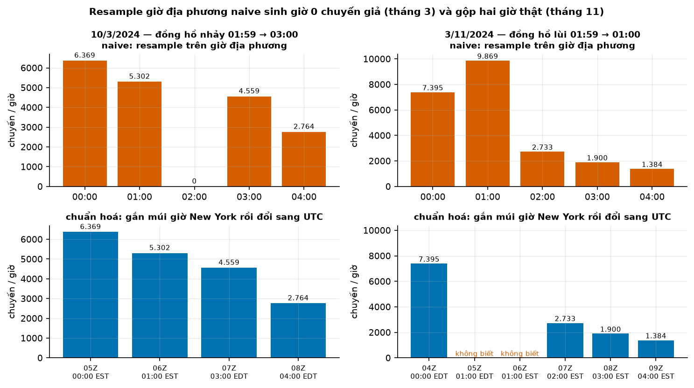
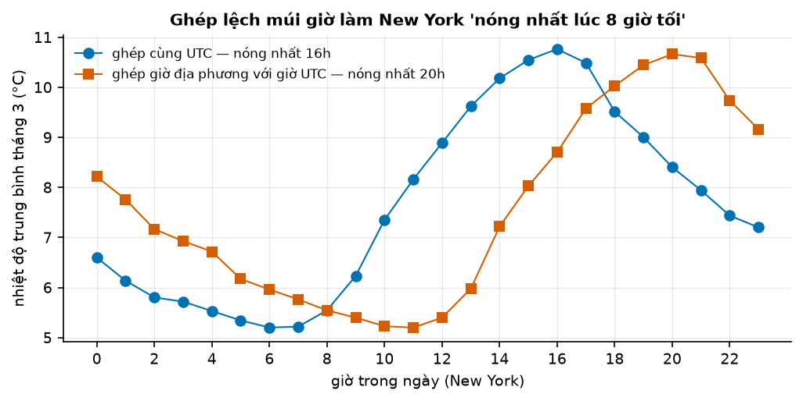
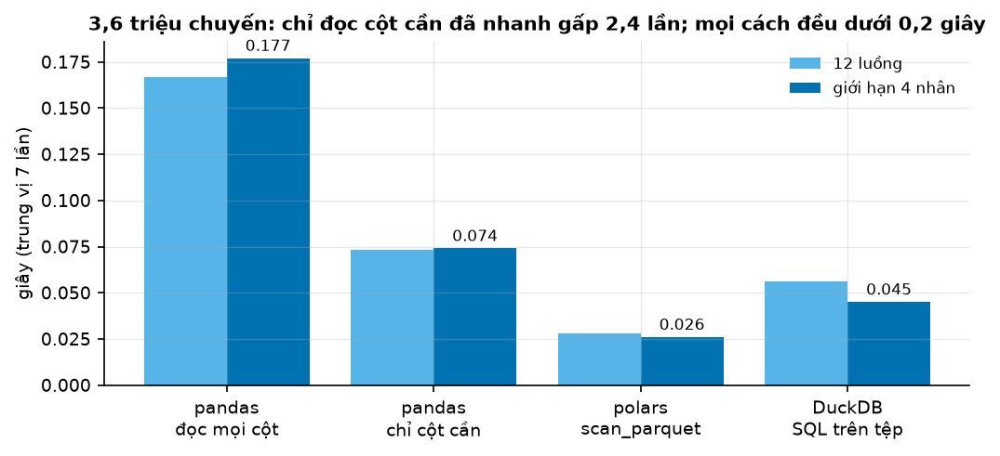

# Buổi 3 — Dữ liệu thời gian với pandas, polars, DuckDB

## 1. Mục tiêu

Sau buổi này bạn:

- Phân biệt được **thời điểm naive** và **thời điểm có múi giờ**, và chỉ ra trên dữ liệu thật hai ngày đổi giờ mùa hè
  (DST) làm hỏng một chuỗi theo giờ ra sao — bằng con số, không bằng lời.
- Chọn đúng cách gộp khi đổi tần suất: **cộng** cho lưu lượng (số chuyến), **trung bình / giá trị cuối** cho trạng thái
  (nhiệt độ), và biết giờ trống là "0" hay "không biết".
- Ghép hai nguồn khác múi giờ mà không tạo quan hệ giả — và có một phép thử nhanh để phát hiện ghép lệch.
- Làm cùng một việc bằng pandas, polars, DuckDB; đọc được con số bấm giờ của chính máy mình.
- Viết hàm `chuan_hoa_thoi_gian()`: nhận dữ liệu thô bất kỳ, trả **bảng dạng dài `unique_id, ds, y` theo UTC, đủ mốc,
  không trùng**, qua 11 test của bộ chấm. **Đây là cột mốc M0 của khoá.**

## 2. Nhắc lại buổi trước

Buổi 1 và 2 cho ba ý dùng ngay hôm nay:

- **Mốc cắt dữ liệu** (cutoff): lúc ra dự báo, ta chỉ biết những gì đã xảy ra *trước* mốc đó. Mọi phép ghép dữ liệu hôm
  nay phải giữ nguyên tắc này — giá trị gắn cho giờ $t$ chỉ được lấy từ thông tin có tại $t$.
- **Dự báo cần đánh giá trên dữ liệu chưa dùng để làm nó.** Muốn cắt tập huấn luyện/kiểm tra theo thời gian thì trục thời
  gian phải đúng trước đã: một giờ bị lặp hay bị mất là một dòng rơi nhầm phía.
- **Phân phối lệch và dữ liệu đếm**: số chuyến theo giờ là biến đếm, phương sai lớn hơn trung bình, nhiều ô bằng 0 khi chia
  nhỏ. Hôm nay bạn sẽ thấy 53,7% ô "khu vực × giờ" bằng 0.

Cú pháp pandas/polars/DuckDB cho thời gian được tổng hợp trong **Phụ lục A**; tài liệu này chỉ nhắc chỗ cần.

## 3. Trạng thái đầu buổi

Sau `cd lab && make up`:

| Hạng mục | Trạng thái |
|---|---|
| Dữ liệu | `du-lieu/raw/nyc-tlc-yellow-2024-03/yellow_tripdata_2024-03.parquet` — 3.582.628 chuyến, sha256 `2d4cdc8fb967` |
| | `du-lieu/raw/nyc-tlc-yellow-2024-11/yellow_tripdata_2024-11.parquet` — 3.646.369 chuyến, sha256 `5ef321876de5` |
| | `du-lieu/raw/nyc-tlc-zone-lookup/taxi_zone_lookup.csv` — 265 khu vực, sha256 `1a99e1050922` |
| | `du-lieu/raw/open-meteo-new-york-2024-03-11/…-utc.csv` — thời tiết theo giờ 01/3 → 30/11/2024, **UTC**, sha256 `fd75dc93e76d` |
| | bài tập: taxi tháng 1/2024 (sha256 `c4d59da7bbc8`) và thời tiết New York tháng 1/2024 UTC (sha256 `117856cb5284`) |
| Môi trường | Python 3.12; pandas 3.0.5, polars 1.44.2, duckdb 1.5.5, pyarrow 25.0.1 (`lab/00-nen/pyproject.toml`) |
| `code/thoi_gian.py` | `chuan_hoa_thoi_gian`, `doc_chuyen_taxi`, `dem_chuyen_theo_gio`, `doc_thoi_tiet`, `ghep_thoi_tiet`, `gio_nong_nhat` |
| `code/bam_gio.py` | bấm giờ đọc + đếm theo giờ bằng pandas, polars, DuckDB |
| **Đang cố tình sai** | thời gian để **naive**; `resample` trên giờ địa phương; không bỏ dòng trùng; thời tiết (UTC) ghép thẳng với giờ taxi (địa phương) |
| **Triệu chứng** | tháng 3 có một giờ **0 chuyến**; tháng 11 có giờ 01:00 **9.869 chuyến** (gần gấp đôi thường lệ); `gio_nong_nhat()` trả **20** — New York "nóng nhất lúc 8 giờ tối" |
| `make check` lúc này | ĐỎ: 10/11 test hỏng |

## 4. Lý thuyết

### 4.1 Một con số thời gian chưa đủ để biết "khi nào"

**Trực giác.** "01:30 ngày 3/11/2024 ở New York" xảy ra **hai lần**: một lần theo giờ mùa hè (EDT, UTC−4), một giờ sau
đồng hồ lùi lại và 01:30 đến lần nữa theo giờ chuẩn (EST, UTC−5). Còn "02:30 ngày 10/3/2024" **không bao giờ xảy ra**:
đồng hồ nhảy từ 01:59 lên 03:00. Một giá trị ngày-giờ không kèm múi giờ (**naive**) vì thế không trỏ được tới một thời điểm
duy nhất. Giá trị có múi giờ (**aware**) thì trỏ được.

**Công thức.** Mỗi thời điểm aware tương ứng đúng một thời điểm UTC:

$$
t_{\text{UTC}} = t_{\text{địa phương}} - \text{offset}(t), \qquad \text{offset}(t) \in \{-5\text{ h}, -4\text{ h}\} \text{ với New York}
$$

Khó ở chỗ $\text{offset}(t)$ phụ thuộc chính $t$ — và ở hai ngày đổi giờ, phép ngược từ giờ địa phương về UTC có 0 hoặc 2
nghiệm. Việt Nam (`Asia/Ho_Chi_Minh`) hiện không có DST: offset luôn +7 giờ (cơ sở dữ liệu múi giờ IANA ghi như vậy từ
13/6/1975).

**Tự viết bằng NumPy.** Với một ngày thường, đổi giờ là phép trừ trên `datetime64`:

```python
import numpy as np
gio_ny = np.array(["2024-03-09T20:00", "2024-03-11T20:00"], dtype="datetime64[m]")
offset = np.array([-5, -4]) * np.timedelta64(1, "h")      # EST trước 10/3, EDT sau 10/3
gio_utc = gio_ny - offset                                  # ['2024-03-10T01:00', '2024-03-12T00:00']
```

Bảng offset đúng cho mọi năm là cơ sở dữ liệu múi giờ IANA — đừng tự gõ tay. **Thư viện:**
`tz_localize("America/New_York")` gắn múi giờ cho giá trị naive, `tz_convert("UTC")` đổi sang UTC.

Ở giờ không tồn tại hay giờ lặp, ba công cụ của buổi xử lý mặc định **khác nhau** (đã chạy, pandas 3.0.5, polars 1.44.2,
duckdb 1.5.5):

| Tình huống | pandas `tz_localize` | polars `replace_time_zone` | DuckDB `timezone()` |
|---|---|---|---|
| 02:30 ngày 10/3 (không tồn tại) | `ValueError … nonexistent time` | lỗi; `non_existent` chỉ `raise`/`null` | **không báo lỗi**, ra 07:30Z — trùng với 03:30 |
| 01:30 ngày 3/11 (lặp) | `ValueError: Cannot infer dst time` | lỗi; `ambiguous` = `earliest`/`latest`/`null` | **không báo lỗi**, chọn EST (06:30Z) |

DuckDB im lặng là nguy hiểm nhất: không có gì báo bạn biết dữ liệu vừa bị dời. DuckDB còn lấy `TimeZone` mặc định theo
hệ điều hành — trên máy ở Việt Nam là `Asia/Ho_Chi_Minh` — nên luôn `SET TimeZone = 'UTC'` đầu script.

### 4.2 DST trong dữ liệu taxi thật

Từ điển dữ liệu TLC chỉ viết "tpep_pickup_datetime — The date and time when the meter was engaged", không nhắc múi giờ.
Tệp Parquet lưu kiểu timestamp không múi giờ. Bằng chứng đây là giờ địa phương nằm ngay trong dữ liệu:



**Đọc hình.** Hàng trên là cách của `code/`: `resample("h")` trên giờ naive.
- *Ô trái (10/3):* cột 02:00 bằng **0** — không phải vì không ai đi taxi, mà vì giờ đó không tồn tại. Một mô hình học
  "rạng sáng Chủ nhật có giờ 0 chuyến" từ ô này.
- *Ô phải (3/11):* cột 01:00 cao **9.869** chuyến, trong khi 01:00 Chủ nhật tuần sau chỉ 5.318: hai giờ thật bị gộp làm một.

Hàng dưới là sau khi gắn múi giờ New York rồi đổi sang UTC. Tháng 3 còn 4 giờ liền nhau (05Z → 08Z), không có giờ ảo.
Tháng 11 hiện ra 6 giờ UTC, nhưng hai giờ 05Z và 06Z ghi **"không biết"**. Từ giờ đón naive không có cách nào tách 9.869
chuyến thành EDT và EST, nên hàm của đáp án bỏ các dòng đó (ghi số 9.869 vào `df.attrs`) và đánh dấu hai mốc UTC là NaN
thay vì 0. "Không có chuyến" và "không biết có bao nhiêu chuyến" là hai điều khác nhau.

Dữ liệu còn để lại dấu vết khác của DST: 1.093 chuyến đón lúc 01:xx ngày 10/3 có giờ trả sau 03:00 (thời lượng bị cộng thêm
một giờ); tháng 11 có 1.078 chuyến "trả khách trước khi đón", trong đó 1.001 chuyến đón lúc 01:xx ngày 3/11.

### 4.3 Đổi tần suất: nhãn khoảng, cách gộp, và giờ trống

**Nhãn khoảng.** Một con số gán nhãn 10:00 là của 9:00–10:00 hay 10:00–11:00? pandas quy định `label` và `closed` mặc
định là `'left'` với mọi tần suất trừ `ME`, `YE`, `QE`, `BME`, `BYE`, `BQE` và `W` (mặc định `'right'`). User guide cảnh
báo điều này "might unintendedly lead to looking ahead, where the value for a later time is pulled back to a previous time".
Với dữ liệu 30 phút `1, 2, 3, 4` bắt đầu 00:00, mặc định cho `{00:00: 3, 01:00: 7}`; `closed='right', label='right'` cho
`{00:00: 1, 01:00: 5, 02:00: 4}` — cùng dữ liệu, khác bảng.

**Cách gộp theo loại biến.** Lưu lượng (số chuyến, kWh) thì **cộng**; trạng thái (nhiệt độ, giá) thì **trung bình** hoặc
**giá trị cuối**. Cộng nhiệt độ theo giờ là vô nghĩa; lấy trung bình số chuyến theo giờ là đổi đơn vị mà không ai biết.

**Giờ trống.** Từ ba sự kiện 00:10 = 1, 00:50 = 2, 02:20 = 5 (đã chạy):

| Cách | 00:00 | 01:00 | 02:00 | Ghi chú |
|---|---|---|---|---|
| `resample("h").sum()` | 3 | **0** | 5 | giờ trống = 0: đúng cho **đếm sự kiện** |
| `resample("h").mean()` | 1,5 | **NaN** | 5 | giờ trống = không biết: đúng cho **trạng thái** |
| `asfreq("h")` | 1 (00:10) | NaN (01:10) | NaN (02:10) | neo lưới ở mốc ĐẦU, bỏ giá trị lệch lưới |

`resample` chỉ phủ từ sự kiện đầu tới sự kiện cuối; muốn đủ mốc cho cả khoảng thì phải `reindex` theo một lưới cho trước.

### 4.4 Ghép hai nguồn: cùng quy ước thời gian trước, hướng thời gian sau

Thời tiết Open-Meteo của buổi tải bằng `timezone=UTC`. Đó là chủ ý: khi xin `timezone=America/New_York`, API trả **một**
offset cố định (offset của ngày gọi API) cho cả khoảng — có cả dòng 02:00 ngày 10/3 không tồn tại và không có giờ lặp ngày
3/11 (issue #1764 của open-meteo mô tả đúng lỗi này).

Ghép giờ taxi địa phương naive thẳng với giờ UTC của thời tiết là lệch 4 giờ (tháng 3–11, EDT) hoặc 5 giờ (mùa đông).
Phép thử nhanh: **giờ nóng nhất trong ngày**.



**Đọc hình.** Đường xanh (ghép cùng UTC) nóng nhất 16h và mát nhất 6–7h sáng — đúng nhịp ngày. Đường cam (ghép lệch) nóng
nhất **20h** và mát nhất 11h trưa: cả đường bị dời phải 4 giờ. Không cần hiểu khí tượng, chỉ cần biết "trưa nắng hơn tối".
Hậu quả với mô hình: tương quan giữa lượng mưa và số chuyến cùng giờ (sau khi khử mùa vụ giờ-trong-tuần) là **−0,100** khi
ghép lệch và **+0,136** khi ghép đúng — **đổi dấu**. Mô hình học từ bảng ghép lệch sẽ "biết" rằng mưa làm ít người đi taxi.

Khi hai nguồn không cùng nhịp (dữ liệu tháng và dữ liệu ngày, giá thay đổi bất thường), dùng `merge_asof` — mặc định
`direction="backward"`, lấy giá trị **gần nhất trong quá khứ**. Đã chạy: trái 10:00, 11:00; phải 09:30, 10:30, 11:00 →
backward cho `[9, 11]`, `forward` cho `[10, 11]` (kéo giá trị tương lai về), `allow_exact_matches=False` cho `[9, 10]` —
dùng khi giá trị lúc 11:00 công bố trễ vài phút.

### 4.5 Dạng dài: một chuỗi cho mỗi khu vực

Hệ thư viện Nixtla và phần lớn khoá này dùng **dạng dài** `unique_id, ds, y`. Đếm chuyến tháng 3 theo khu vực đón: 259 khu
vực có chuyến (bảng tra có 265). Trải lên **lưới chung** 743 giờ UTC (00:00 ngày 1/3 EST → 00:00 ngày 1/4 EDT — tháng 3
ngắn một giờ) cho 192.437 dòng, **53,7% ô bằng 0**: đa số khu vực hiếm khi có khách mỗi giờ. Lưới chung là điều kiện để so
sánh giữa các chuỗi và để các buổi sau cắt backtest cùng mốc.

```python
dai = chuan_hoa_thoi_gian(chuyen.assign(mot=1), "tpep_pickup_datetime", "mot", "h",
                          mui_gio_nguon="America/New_York", cot_id="PULocationID", gop="sum",
                          mo_ho="NaT", khoang=("2024-03-01 05:00", "2024-04-01 04:00"))
dai.head(2)
#  unique_id                        ds    y
#          1 2024-03-01 05:00:00+00:00  0.0
#          1 2024-03-01 06:00:00+00:00  0.0
rong = dai.pivot(index="ds", columns="unique_id", values="y")   # (743, 259): mỗi cột một khu vực
```

Hai lưu ý nhỏ từ output thật. Cột của bảng rộng xếp `1, 10, 100, 101…` chứ không phải `1, 2, 3` — `unique_id` là chuỗi ký tự
nên được sắp theo từ điển; muốn sắp theo số thì đổi kiểu trước khi `pivot`. Và ba khu vực đông nhất tháng 3 là Midtown Center
(163.267 chuyến), JFK Airport (157.703), Upper East Side South (155.631) — trong khi hơn một nửa số ô của bảng là 0: tổng rất
lớn ở vài chuỗi, rất thưa ở phần còn lại. Đó là hình dạng điển hình của dữ liệu nhiều chuỗi mà các buổi 19 và 22 xử lý.

### 4.6 pandas, polars, DuckDB — và pandas 2 với pandas 3

| | pandas | polars | DuckDB |
|---|---|---|---|
| Kiểu làm việc | bảng trong RAM, eager | eager hoặc **lazy** (tối ưu cả truy vấn trước khi chạy) | SQL trên tệp Parquet/CSV |
| Gộp theo giờ | `dt.floor("h")` + `groupby` / `resample` | `dt.truncate("1h")` + `group_by` | `date_trunc('hour', ts)` |
| Ghép quá khứ gần nhất | `merge_asof` | `join_asof` | `ASOF JOIN` |



Bấm giờ trên máy soạn khoá (i5-11600K; tệp tháng 3; trung vị 7 lần sau 1 lần làm nóng; giới hạn 4 nhân để sát máy học viên):
pandas đọc mọi cột **0,177 s**, pandas chỉ đọc cột cần **0,074 s**, polars `scan_parquet` **0,026 s**, DuckDB SQL **0,045 s**.
Hai bài học: chỉ đọc cột cần đã nhanh hơn 2,4 lần với pandas; và ở 3,6 triệu dòng mọi công cụ đều dưới 0,2 giây — khác biệt
chỉ đáng kể ở quy mô lớn. Benchmark độc lập db-benchmark (báo cáo 17/8/2026, gộp nhóm 100 triệu dòng, máy 16 nhân): DuckDB
1.5.4 mất 2,75 s, polars 1.42.1 mất 5,40 s; bản pandas được đo gần nhất là 2.2.3 từ tháng 2/2025. Benchmark đo trên dữ
liệu tổng hợp nạp sẵn vào bộ nhớ, không đo bước đọc tệp — đừng dùng nó để đoán tốc độ trên bài của bạn.

Buổi 1–13 dùng pandas 3; các buổi dùng statsforecast/mlforecast dùng pandas 2.3.3 vì các thư viện đó chưa hỗ trợ pandas 3.
Hàm của buổi này chạy đúng trên cả hai (bộ chấm đã chạy qua cả hai bản). Khác biệt chạm tới bài hôm nay:

| | pandas 2.3.3 | pandas 3.0.5 |
|---|---|---|
| `to_datetime` offset lẫn lộn, không `utc=True` | cảnh báo, trả cột kiểu object | `ValueError: Mixed timezones detected` |
| `freq="H"` | chạy, cảnh báo | `ValueError: Invalid frequency` — dùng `"h"` |
| đơn vị datetime khi đọc | `ns` | `us` |
| đối tượng múi giờ | pytz | `zoneinfo` |

Viết `utc=True`, dùng bí danh mới (`h`, `min`, `ME`) và gán bằng `.loc` là chạy được trên cả hai.

### 4.7 Năm câu hỏi trước khi tin một cột thời gian

Trước mọi phép gộp, chạy năm dòng chẩn đoán. Output thật trên tệp tháng 11:

```python
don, tra = t["tpep_pickup_datetime"], t["tpep_dropoff_datetime"]
don.dtype, don.dt.tz                  # 1. kiểu, múi giờ          → datetime64[us], None  (naive!)
don.min(), don.max()                  # 2. khoảng thời gian       → 2002-12-31 22:17:43, 2024-12-01 22:04:33
(~don.between("2024-11-01", "2024-12-01", inclusive="left")).sum()   # 3. ngoài khoảng → 50
(tra < don).sum()                     # 4. thời lượng âm          → 1078
gio = don.dt.floor("h").drop_duplicates()
gio[gio.between("2024-11-01", "2024-12-01", inclusive="left")].dt.date.value_counts().value_counts()
                                      # 5. số giờ có dữ liệu/ngày → {24: 30}
```

Câu 5 đáng dừng lại. Với tệp tháng 3, cùng dòng lệnh cho `{24: 30, 23: 1}` và ngày 23 giờ là 10/3 — phát hiện được giờ bị
mất. Với tệp tháng 11 nó cho `{24: 30}`: ngày 3/11 có 25 giờ thật nhưng trên giờ naive chỉ còn 24, **không có dấu hiệu gì**.
Giờ lặp chỉ lộ ra qua số chuyến bất thường của giờ 01:00 hoặc qua câu 4 (thời lượng âm dồn vào giờ đó). Kiểm tra đếm mốc thời
gian không thay được việc biết múi giờ của nguồn.

## 5. Lab từng bước

### Bước 1 — Dựng nền, bấm giờ

```bash
cd lab && make up
env -u VIRTUAL_ENV uv run --no-sync --project 00-nen python ../code/bam_gio.py
```

Ghi số luồng CPU và bốn con số của máy bạn. Mọi cách đều báo **747** nhóm giờ, không phải 744 của tháng 3 — vì sao? (Gợi ý:
tệp có 23 chuyến đón ngoài tháng, sớm nhất `2002-12-31 22:17:10`.)

### Bước 2 — Đếm theo giờ bằng code có sẵn, tìm hai ngày DST

```bash
env -u VIRTUAL_ENV uv run --no-sync --project 00-nen python ../code/thoi_gian.py
```

Output: `3582605 chuyến → 744 giờ`, `giờ nóng nhất: 20`. Tự in các giờ 00:00–05:00 của ngày 10/3 và 3/11 từ
`dem_chuyen_theo_gio` — bạn phải thấy giờ 0 chuyến và giờ 9.869 chuyến trong hình mục 4.2. Viết một câu cho mỗi ngày: đây là
lỗi của khách đi taxi hay lỗi của trục thời gian?

### Bước 3 — Ghép thời tiết, thấy "nóng nhất lúc 20h"

Mở `code/thoi_gian.py`, đọc `doc_thoi_tiet` và `ghep_thoi_tiet`. Cột `time` của thời tiết là UTC; cột giờ của taxi là giờ New
York. Giải thích vì sao lệch đúng **4** giờ chứ không phải 5.

### Bước 4 — Sửa `chuan_hoa_thoi_gian`

Viết lại theo đặc tả trong docstring. Thứ tự làm từng bước:
1. Mọi đầu vào về UTC có múi giờ: cột có offset → `pd.to_datetime(…, utc=True)`; cột naive →
   `tz_localize(mui_gio_nguon, ambiguous=mo_ho, nonexistent="NaT")` rồi `tz_convert("UTC")`.
2. Bỏ dòng trùng — **chỉ** với dữ liệu trạng thái hoặc khi `bo_trung=True`. Với sự kiện, hai chuyến cùng giây là hai chuyến
   thật: bật bỏ trùng trên taxi sẽ xoá hơn 1,8 triệu chuyến (đã thử).
3. `dt.floor(tan_suat)` rồi gộp theo `gop`.
4. `reindex` mỗi chuỗi lên lưới đủ mốc; giờ trống 0 với sự kiện, NaN với trạng thái; mốc mà dòng mơ hồ có thể thuộc về → NaN.

Sửa `ghep_thoi_tiet` để **từ chối** thời gian naive, và `gio_nong_nhat` để lấy giờ theo múi giờ New York.

```bash
make check
```

Chạy từng test một khi đỏ: `env -u VIRTUAL_ENV uv run --no-sync --project 00-nen python -m pytest cham -k dst -x`.

### Bước 5 — Dạng dài theo khu vực

Gọi `dem_chuyen_theo_gio(chuyen, theo_khu_vuc=True)` rồi `chuan_hoa_thoi_gian(…, khoang=("2024-03-01 05:00",
"2024-04-01 04:00"))` để mọi khu vực cùng lưới. Kiểm: mỗi chuỗi 743 dòng, không dòng trùng `(unique_id, ds)`; đếm tỷ lệ ô bằng 0.

### Bước 6 — Làm lại một bước bằng polars hoặc DuckDB

Đếm chuyến theo giờ UTC tháng 11 bằng polars (`dt.replace_time_zone("America/New_York", ambiguous=…)`) hoặc DuckDB
(`SET TimeZone='UTC'; … timezone('America/New_York', tpep_pickup_datetime)`). So với pandas ở giờ 01:00 ngày 3/11: công cụ
nào báo lỗi, công cụ nào im lặng dời dữ liệu?

Kết quả đã chạy trên máy soạn khoá, lọc 00:00–04:00 giờ New York ngày 3/11:

```python
(pl.scan_parquet(tep).select(pl.col("tpep_pickup_datetime").alias("t"))
   .filter(pl.col("t").is_between(pl.datetime(2024, 11, 3, 0), pl.datetime(2024, 11, 3, 4), closed="left"))
   .with_columns(pl.col("t").dt.replace_time_zone("America/New_York", ambiguous="null")
                 .dt.convert_time_zone("UTC").dt.truncate("1h").alias("gio_utc"))
   .group_by("gio_utc").len().sort("gio_utc").collect())
# null → 9869 | 04:00 UTC → 7395 | 07:00 UTC → 2733 | 08:00 UTC → 1900
```

```sql
SET TimeZone = 'UTC';
SELECT date_trunc('hour', timezone('America/New_York', tpep_pickup_datetime)) AS gio_utc, count(*)
FROM 'yellow_tripdata_2024-11.parquet'
WHERE tpep_pickup_datetime >= '2024-11-03 00:00' AND tpep_pickup_datetime < '2024-11-03 04:00'
GROUP BY 1 ORDER BY 1;
-- 04:00+00 → 7395 | 06:00+00 → 9869 | 07:00+00 → 2733 | 08:00+00 → 1900
```

polars buộc bạn chọn (`ambiguous="null"` gom 9.869 chuyến vào một nhóm `null` — thấy ngay). DuckDB không hỏi: cả 9.869
chuyến bị dồn vào 06:00 UTC, giờ 05:00 UTC biến mất khỏi bảng mà không có dòng cảnh báo nào. Bảng DuckDB trông "sạch" nhất
— và sai nhất. pandas (hàm đáp án) cho 05:00 và 06:00 UTC là NaN, ghi 9.869 dòng bị bỏ vào `attrs`.

## 6. Lỗi thường gặp & cách chẩn đoán

| Triệu chứng | Nguyên nhân | Chẩn đoán | Sửa |
|---|---|---|---|
| Một giờ bằng 0 vào rạng sáng Chủ nhật tháng 3 | resample trên giờ địa phương naive, giờ không tồn tại | in 00:00–05:00 ngày đổi giờ | gắn múi giờ rồi đổi UTC trước khi gộp |
| Một giờ gần gấp đôi rạng sáng Chủ nhật tháng 11 | hai giờ thật gộp làm một | so với cùng giờ tuần sau | như trên; giờ không tách được → NaN |
| Chuyến có thời lượng âm | giờ lặp DST ghi naive | đếm `dropoff < pickup` theo giờ | tính thời lượng trên thời gian đã đổi UTC |
| "Nóng nhất lúc 20h", mưa làm giảm khách | ghép giờ địa phương với giờ UTC | giờ nóng nhất trung bình | cả hai nguồn về UTC trước khi `merge` |
| Số nhóm giờ nhiều hơn số giờ trong tháng | bản ghi có ngày ngoài tháng (2002, 2008, 2009…) | `min`/`max` cột thời gian | lọc theo khoảng tháng của tệp |
| Open-Meteo lệch 1 giờ quanh DST | tham số `timezone=` dùng một offset cố định | so với tải `timezone=UTC` | luôn tải UTC |
| Kết quả DuckDB khác nhau giữa hai máy | `TimeZone` mặc định theo hệ điều hành | `SELECT current_setting('TimeZone')` | `SET TimeZone='UTC'` đầu script |
| `ValueError: Mixed timezones detected` (pandas 3) | offset lẫn lộn trong một cột | xem giá trị có `+07:00` và `Z` | `pd.to_datetime(…, utc=True)` |
| `ValueError: Invalid frequency: H` | bí danh cũ trên pandas 3 | — | `h`, `min`, `s`, `ME`, `QE`, `YE` |
| Sau gộp, số chuyến giảm hàng triệu | bỏ dòng trùng trên dữ liệu sự kiện | so tổng trước/sau | chỉ bỏ trùng với trạng thái hoặc nguồn xuất trùng |

## 7. Bài tập về nhà

1. **Tháng 3 và tháng 11 với polars thuần.** Viết lại `dem_chuyen_theo_gio` chỉ bằng polars lazy. Kết quả phải khớp pandas
   từng giờ ngoài các giờ mơ hồ; nộp bảng so sánh và thời gian chạy.
2. **Mùa đông lệch mấy giờ?** Dùng hai bộ đã có sẵn sau `make up`: `du-lieu/raw/nyc-tlc-yellow-2024-01/` và
   `du-lieu/raw/open-meteo-new-york-2024-01/` (thời tiết tháng 1, UTC). Lặp lại phép thử giờ nóng nhất với bản ghép lệch và bản
   ghép đúng. Dự đoán trước con số rồi mới chạy.
3. **Một nguồn dữ liệu của bạn.** Lấy một bảng có cột thời gian từ công việc thật (log, giao dịch, cảm biến). Viết một đoạn: cột
   thời gian là naive hay có múi giờ, nhãn là đầu hay cuối khoảng, gộp bằng cộng hay trung bình — và chạy
   `chuan_hoa_thoi_gian` với tham số tương ứng.

## 8. Tiêu chí "Xong khi"

- [ ] `make check` xanh 11/11 với `code/` đã sửa.
- [ ] Trả lời bằng số: ngày 10/3 và 3/11/2024 bản naive sai ở giờ nào, sai bao nhiêu chuyến.
- [ ] Giải thích được vì sao ghép lệch múi giờ làm tương quan mưa–số chuyến đổi dấu, và phép thử "giờ nóng nhất" bắt được nó.
- [ ] Có bảng dạng dài theo khu vực, lưới chung 743 giờ UTC, không dòng trùng.
- [ ] Ghi được con số bấm giờ của máy mình và nói vì sao chỉ đọc cột cần lại nhanh hơn.

## 9. Đọc thêm

- Hyndman, R.J., Athanasopoulos, G. et al. *Forecasting: Principles and Practice, the Pythonic Way*, chương 2 (chuỗi thời gian
  và tần suất) — https://otexts.com/fpppy/
- pandas User Guide — *Time series / date functionality* (múi giờ, DST, `resample`, `asfreq`):
  https://pandas.pydata.org/docs/user_guide/timeseries.html
- polars — `Expr.dt.replace_time_zone`: https://docs.pola.rs/api/python/stable/reference/expressions/api/polars.Expr.dt.replace_time_zone.html
- DuckDB — TIMESTAMPTZ functions: https://duckdb.org/docs/current/sql/functions/timestamptz.html
- NYC TLC — Data Dictionary Yellow Taxi: https://www.nyc.gov/assets/tlc/downloads/pdf/data_dictionary_trip_records_yellow.pdf
- Open-Meteo issue #1764 (offset múi giờ): https://github.com/open-meteo/open-meteo/issues/1764
- DuckDB Labs db-benchmark: https://duckdblabs.github.io/db-benchmark/
- Phụ lục A của khoá — cú pháp thời gian pandas 2/3, polars, DuckDB.
