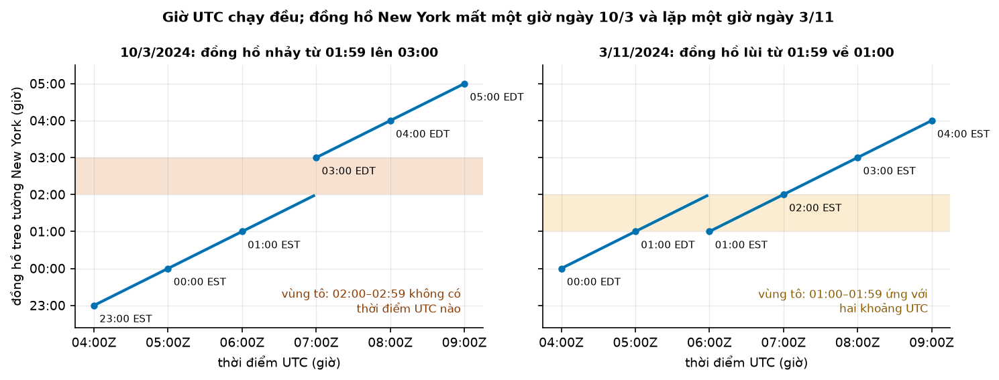

# Buổi 3 — Dữ liệu thời gian với pandas, polars, DuckDB

## 1. Mục tiêu

Sau buổi này bạn:

- Đổi giờ địa phương sang **UTC** (giờ chung của thế giới) bằng tay và bằng pandas; chỉ ra giờ "không tồn tại" và giờ
  "xảy ra hai lần" ở New York.
- Chỉ ra bằng số trên dữ liệu taxi thật: ngày đổi **giờ mùa hè** làm hỏng chuỗi đếm theo giờ ra sao.
- Gộp đúng khi đổi tần suất: **cộng** cho số lượng (số chuyến), **trung bình** hoặc **giá trị cuối** cho số đo trạng thái
  (nhiệt độ); phân biệt giờ trống là "0" hay "không biết".
- Ghép hai nguồn khác múi giờ mà không tạo quan hệ giả, và phát hiện ghép lệch bằng một phép thử nhanh.
- Viết hàm `chuan_hoa_thoi_gian()` trả bảng **dạng dài** `unique_id, ds, y` theo UTC, đủ mốc, không trùng; qua 11 test.

Hàm này là **cột mốc M0** của khoá: dạng dữ liệu mà mọi buổi sau nhận vào.

## 2. Nhắc lại buổi trước

- **Mốc cắt dữ liệu** (cutoff): lúc dự báo chỉ được dùng thông tin đã có, nên giá trị gắn cho giờ $t$ chỉ lấy từ thông tin
  đã có tại $t$.
- **Chia dữ liệu theo thời gian**: phần quá khứ (tập huấn luyện) để làm mô hình, phần sau (tập kiểm tra) để chấm. Trục
  thời gian sai thì mốc chia cũng sai: dữ liệu của tập kiểm tra có thể lọt sang tập huấn luyện.
- **Dữ liệu đếm** (số chuyến, số đơn hàng) chỉ nhận 0, 1, 2…; chia nhỏ theo nơi và giờ thì rất nhiều ô bằng 0.

## 3. Trạng thái đầu buổi

Sau `cd lab && python lab.py up`. Hai từ cần biết để đọc bảng: **Parquet** là một định dạng tệp lưu bảng theo từng cột, có nén,
đọc nhanh hơn CSV. **sha256** là "dấu vân tay" của một tệp: tệp đổi một byte là chuỗi sha256 đổi hẳn. Bảng ghi 12 ký tự
đầu để bạn đối chiếu.

| Hạng mục | Trạng thái |
|---|---|
| Dữ liệu | `du-lieu/raw/nyc-tlc-yellow-2024-03/yellow_tripdata_2024-03.parquet` — 3.582.628 chuyến, sha256 `2d4cdc8fb967` |
| | `du-lieu/raw/nyc-tlc-yellow-2024-11/yellow_tripdata_2024-11.parquet` — 3.646.369 chuyến, sha256 `5ef321876de5` |
| | `du-lieu/raw/nyc-tlc-zone-lookup/taxi_zone_lookup.csv` — 265 khu vực, sha256 `1a99e1050922` |
| | `du-lieu/raw/open-meteo-new-york-2024-03-11/…-utc.csv` — thời tiết theo giờ 01/3 → 30/11/2024, **UTC**, sha256 `fd75dc93e76d` |
| | bài tập: taxi tháng 1/2024 (sha256 `c4d59da7bbc8`) và thời tiết New York tháng 1/2024 UTC (sha256 `117856cb5284`) |
| Môi trường | Python 3.12; pandas 3.0.5, polars 1.44.2, duckdb 1.5.5, pyarrow 25.0.1 (`lab/00-nen/pyproject.toml`) |
| `code/thoi_gian.py` | `chuan_hoa_thoi_gian`, `doc_chuyen_taxi`, `dem_chuyen_theo_gio`, `doc_thoi_tiet`, `ghep_thoi_tiet`, `gio_nong_nhat` |
| `code/bam_gio.py` | bấm giờ đọc + đếm theo giờ bằng pandas, polars, DuckDB |
| **Đang cố tình sai** | thời gian để **naive** (không ghi múi giờ); đếm theo giờ (`resample`, mục 4.3) trên giờ địa phương; không bỏ dòng trùng; thời tiết (UTC) ghép thẳng với giờ taxi (giờ New York) |
| **Triệu chứng** | tháng 3 có một giờ **0 chuyến**; tháng 11 có giờ 01:00 **9.869 chuyến** (gần gấp đôi thường lệ); `gio_nong_nhat()` trả **20** — New York "nóng nhất lúc 8 giờ tối" |
| `python lab.py check` lúc này | ĐỎ: 10/11 test hỏng |

`python lab.py check` là lệnh chạy bộ chấm: 11 hàm test tự động gọi code của bạn và so với kết quả đúng. ĐỎ nghĩa là còn test hỏng.

## 4. Lý thuyết

### Từ mới trong buổi

| Thuật ngữ | Nghĩa một câu | Ví dụ |
|---|---|---|
| UTC | Giờ phối hợp quốc tế: một đồng hồ chung cho cả thế giới, chạy đều, không bao giờ vặn theo mùa. | 07:00 sáng ở Hà Nội là 00:00 UTC. |
| hậu tố Z | Chữ Z cuối một giờ nghĩa là "giờ này tính theo UTC"; giống hệt viết `+00:00`. | `07:30Z` = 07:30 UTC = 14:30 Hà Nội. |
| offset (độ lệch múi giờ) | Giờ địa phương lệch UTC bao nhiêu giờ. | Hà Nội +7; New York mùa đông −5, mùa hè −4. |
| múi giờ (time zone), IANA | Tên một vùng dùng chung luật giờ, ví dụ `America/New_York`. IANA là tổ chức giữ bảng tra múi giờ mà mọi máy tính dùng. | Bảng IANA ghi: New York đổi offset hai lần mỗi năm. |
| giờ mùa hè (DST, daylight saving time) | Một số nơi vặn đồng hồ nhanh 1 giờ vào mùa hè, rồi vặn lại vào mùa thu. | New York 2024: nhanh lên ngày 10/3, lùi lại ngày 3/11. |
| EST / EDT | Giờ chuẩn miền Đông nước Mỹ (UTC−5) và giờ mùa hè miền Đông (UTC−4). | 00:00 EST = 05:00Z; 00:00 EDT = 04:00Z. |
| naive / aware | Thời điểm không ghi múi giờ (naive) hoặc có ghi (aware). | `2024-03-10 01:30` là naive; `2024-03-10 01:30-05:00` là aware. |
| NaN, NaT | Ô "không biết" của pandas: NaN cho số (Not a Number), NaT cho thời gian (Not a Time). | Nhiệt độ lúc 01:00 không đo → NaN, khác với 0 độ. |
| tần suất, `resample` | Tần suất là khoảng cách giữa hai mốc liền nhau. `resample` đổi tần suất, ví dụ gộp 60 phút thành 1 giờ. | Đếm chuyến theo phút → cộng lại theo giờ. |
| `closed`, `label` | Khi gộp: đầu nào của khoảng được tính vào (`closed`), và khoảng được đặt tên bằng mốc đầu hay mốc cuối (`label`). | Khoảng [9:00, 10:00) tên "9:00": chứa 9:00, không chứa 10:00. |
| chuỗi đều / chuỗi không đều | Chuỗi đều: các mốc cách nhau bằng nhau. Không đều: lúc dày lúc thưa. | Chuyến taxi đến lúc 00:10, 00:50, 02:20 là không đều. |
| ghép as-of (`merge_asof`) | Ghép mỗi dòng với giá trị gần nhất đã có ở trước (hoặc đúng) thời điểm của dòng đó. | Đơn hàng lúc 10:07 lấy giá cập nhật lúc 10:05, không lấy giá lúc 10:10. |
| định dạng dài / định dạng rộng | Dạng dài: mỗi dòng một (chuỗi, mốc, giá trị). Dạng rộng: mỗi chuỗi một cột. | 2 khu vực × 3 giờ: dạng dài 6 dòng; dạng rộng 3 dòng × 2 cột. |
| `unique_id`, `ds`, `y` | Ba cột của dạng dài: tên chuỗi, thời điểm, giá trị cần dự báo. | `("161", 2024-03-01 05:00Z, 412)`. |
| backtest | Giả vờ đứng ở nhiều mốc cắt trong quá khứ, dự báo, rồi so với cái đã thật sự xảy ra. | Đứng ở 4 thứ Hai của tháng 3, mỗi lần dự báo 24 giờ tới. |

### 4.1 UTC, múi giờ và giờ mùa hè: một con số giờ chưa đủ để biết "khi nào"

**Vấn đề.** Taxi ghi giờ đón theo đồng hồ New York, thời tiết ghi theo UTC. Muốn ghép hai bảng, phải đặt chúng lên
**cùng một trục thời gian**.

Trong tài liệu này, "05Z" là viết gọn của "05:00Z".

**Giờ mùa hè ở New York.** Múi giờ `America/New_York` có hai offset: mùa đông **EST** (UTC−5), mùa hè **EDT** (UTC−4),
khi đồng hồ được vặn nhanh 1 giờ. Năm 2024 có hai lần vặn:

- **Chủ nhật 10/3**: lúc đồng hồ sắp chỉ 02:00 EST, người ta vặn nó lên 03:00 EDT. Các giờ 02:00–02:59 **không tồn tại**.
- **Chủ nhật 3/11**: lúc đồng hồ sắp chỉ 02:00 EDT, người ta vặn nó lùi về 01:00 EST. Các giờ 01:00–01:59 **xảy ra hai lần**.

Vậy từ 10/3/2024 đến 3/11/2024 New York lệch UTC 4 giờ; ngoài khoảng đó lệch 5 giờ.

**Ví dụ số nhỏ — tự tính tay.** Đổi giờ New York sang UTC: **cộng 5 giờ nếu đang EST, cộng 4 giờ nếu đang EDT** (vì offset
âm, trừ offset tức là cộng). Tính mẫu vài dòng:

- 00:00 ngày 10/3 là EST (chưa tới giờ vặn): 00:00 + 5 = **05:00Z**.
- 03:00 ngày 10/3 là EDT (đã vặn): 03:00 + 4 = **07:00Z**. Phút cuối của EST là 01:59 + 5 = 06:59Z. Phút ngay sau đó,
  07:00Z, đồng hồ đã chỉ 03:00. Không có thời điểm UTC nào để đồng hồ chỉ 02:30.
- 01:30 ngày 3/11 lần thứ nhất là EDT: 01:30 + 4 = **05:30Z**. Một giờ sau, đồng hồ lùi và chỉ 01:30 lần nữa, lúc này là
  EST: 01:30 + 5 = **06:30Z**.

Làm như vậy cho mọi giờ từ 00:00 tới 04:00 của hai ngày (kiểm lại bằng `dap-an/vi_du_nho.py`):

| Đồng hồ New York | Chủ nhật 10/3/2024 → UTC | Chủ nhật 3/11/2024 → UTC |
|---|---|---|
| 00:00 | 05:00Z (EST) | 04:00Z (EDT) |
| 01:00 | 06:00Z (EST) | 05:00Z (EDT) **và** 06:00Z (EST) |
| 01:30 | 06:30Z (EST) | 05:30Z (EDT) **và** 06:30Z (EST) |
| 02:00 | **không tồn tại** | 07:00Z (EST) |
| 02:30 | **không tồn tại** | 07:30Z (EST) |
| 03:00 | 07:00Z (EDT) | 08:00Z (EST) |
| 04:00 | 08:00Z (EDT) | 09:00Z (EST) |

**Đọc bảng.** Ngày đổi giờ mùa xuân chỉ có **23 giờ**; ngày mùa thu có **25 giờ**. Một giờ New York không kèm offset ứng với không, một
hoặc hai thời điểm UTC; giờ UTC luôn chỉ đúng một thời điểm.



**Cách đọc hình.**

1. **Trục ngang** (cả hai ô): thời điểm UTC, mỗi vạch một giờ.
2. **Trục dọc**: giờ đồng hồ New York tại thời điểm UTC đó (23:00 là đêm hôm trước).
3. **Ký hiệu**: đường xanh là giờ New York; dải tô màu là vùng giờ có vấn đề.
4. **Nhìn vào đâu**: ô trái, đường nhảy qua dải cam mà không chạm; ô phải, đường rơi lại và đi qua dải vàng hai lần.
5. **Kết luận**: giờ UTC chạy đều; đồng hồ New York mất một giờ ngày 10/3 và lặp một giờ ngày 3/11.

**Công thức.**

$$
t_{\text{UTC}} = t_{\text{địa phương}} - \text{offset}(t)
$$

- $t_{\text{địa phương}}$: giờ đồng hồ treo tường ở nơi ghi dữ liệu.
- $\text{offset}(t)$: độ lệch so với UTC tại đúng thời điểm đó. New York: −5 giờ (EST) hoặc −4 giờ (EDT). Hà Nội: +7 giờ.
- $t_{\text{UTC}}$: cùng thời điểm đó, đọc trên đồng hồ UTC.

**Nói bằng lời.** Giờ UTC bằng giờ địa phương trừ đi offset. Ví dụ 20:00 tối 9/3 ở New York có offset −5, nên UTC là
20:00 − (−5) = 20:00 + 5 = 01:00 ngày 10/3. Chỗ khó: offset phụ thuộc thời điểm, nên hai ngày đổi giờ có giờ
ứng với **0** (02:30 ngày 10/3) hoặc **2** (01:30 ngày 3/11) thời điểm UTC (bảng trên). Việt Nam (`Asia/Ho_Chi_Minh`) không đổi giờ theo mùa: offset luôn +7.

**Thư viện.** pandas có hai hàm, làm hai việc khác nhau:

- `tz_localize("America/New_York")`: **gắn** múi giờ cho giá trị naive; con số giờ giữ nguyên, giá trị thành aware.
- `tz_convert("UTC")`: **đổi** giá trị aware sang múi giờ khác; con số giờ đổi, thời điểm thật giữ nguyên.

Gặp giờ không tồn tại hay giờ lặp, `tz_localize` mặc định **báo lỗi** (`ValueError`). Hai tham số dưới đây đều nhận
`"raise"` (báo lỗi) hoặc `"NaT"` (đánh dấu "không biết"), và thêm:

- `nonexistent` (giờ không tồn tại, như 02:30 ngày 10/3): `"shift_forward"` dời lên giờ hợp lệ kế tiếp (03:00).
- `ambiguous` (giờ mơ hồ, tức giờ lặp như 01:30 ngày 3/11): `"infer"` đoán theo thứ tự dòng (lần đầu EDT, lần sau EST),
  hoặc một mảng True/False, True là giờ mùa hè.

**DuckDB** (cơ sở dữ liệu chạy SQL ngay trên tệp) thì **không báo lỗi** mà im lặng dời giờ (Bước 6 của Lab).

**Tóm lại.** **Giờ naive chưa chỉ ra một thời điểm: đổi mọi thứ về UTC có ghi múi giờ trước khi làm gì khác. New York
mất một giờ ngày đổi giờ mùa xuân (10/3) và lặp một giờ ngày mùa thu (3/11).**

**Tự kiểm tra.** (a) Cảm biến ở Hà Nội ghi `2024-07-01 07:15` (naive). Giờ UTC là mấy giờ? (b) Cảm biến ở New York ghi
`2024-11-03 01:15`. Giờ UTC là mấy giờ?

<details>
<summary>Đáp án</summary>

(a) Offset +7, nên 07:15 − 7 = **00:15Z** ngày 1/7. (b) Có **hai** đáp án: 01:15 EDT = 05:15Z, và 01:15 EST = 06:15Z.
Nhầm hay gặp: cộng 7 thay vì trừ ở câu (a), ra 14:15Z. Hãy nhớ: Hà Nội đi
**trước** UTC, nên giờ UTC phải **nhỏ hơn** giờ Hà Nội.

</details>

### 4.2 Giờ mùa hè trong dữ liệu taxi thật

**Vấn đề.** Từ điển dữ liệu taxi New York chỉ gọi cột `tpep_pickup_datetime` là "ngày giờ lúc đồng hồ tính tiền được
bật", không nhắc múi giờ; tệp Parquet cũng lưu nó ở kiểu naive. Ta phải tìm bằng chứng trong chính dữ liệu: nếu cột là giờ
New York, ngày 10/3 sẽ trống một giờ và ngày 3/11 có một giờ gấp đôi.

**Ví dụ số nhỏ — tự tính tay.** Bốn chuyến đêm 10/3, giờ đón naive: 01:20, 01:50, 03:10, 03:40.

- Đếm theo giờ trên chính con số naive: giờ 01:00 có 2 chuyến, giờ 02:00 có **0**, giờ 03:00 có 2.
- Đổi sang UTC trước (bảng mục 4.1): 01:20 + 5 = 06:20Z; 01:50 + 5 = 06:50Z; 03:10 + 4 = 07:10Z; 03:40 + 4 = 07:40Z.
  Đếm theo giờ UTC: 06Z có 2, 07Z có 2. **Hai giờ liền nhau, không có giờ 0.**

Ngày 3/11 ngược lại: bốn chuyến ghi 01:10, 01:40, 01:20, 01:50 có thể là hai chuyến EDT và hai chuyến EST. Đếm naive dồn
cả bốn vào giờ 01:00, gấp đôi, và không cách nào tách.


**Cách đọc hình.**

1. **Trục ngang**: hàng trên là giờ New York 00:00–04:00; hàng dưới là giờ UTC kèm giờ New York ("05Z / 00:00 EST").
2. **Trục dọc**: số chuyến đón trong mỗi giờ (chuyến/giờ).
3. **Ký hiệu**: cột cam là cách của `code/` (giờ naive); cột xanh là sau khi đổi UTC; "không biết" là giờ không đếm được.
4. **Nhìn vào đâu**: ô trên bên trái, cột 02:00 bằng 0; ô trên bên phải, cột 01:00 cao vọt; hàng dưới, hai chỗ đó.
5. **Kết luận**: resample trên giờ naive sinh giờ 0 chuyến giả (10/3) và gộp hai giờ thật (3/11).

Ô trên bên phải: giờ 01:00 có **9.869** chuyến, trong khi cùng giờ Chủ nhật tuần sau chỉ có **5.318**: hai giờ thật gộp làm một.

Ngày 3/11, chuyến ghi 01:xx có thể là EDT hoặc EST. Hàm của đáp án bỏ các dòng đó và ghi số dòng bỏ vào `df.attrs` (một
từ điển ghi chú gắn kèm bảng pandas). Nó ghi NaN ("không biết") cho cả hai mốc chúng có thể thuộc về (05:00Z, 06:00Z)
thay vì một con số bị đếm thiếu.

**Dấu vết khác trong dữ liệu.** Thời lượng chuyến = giờ trả − giờ đón. Tính trên giờ naive thì hai ngày đổi giờ cho số sai:

- 10/3: đón 01:50 EST, trả 03:05 EDT. Thật ra chuyến dài 15 phút (06:50Z → 07:05Z). Trên giờ naive, 01:50 → 03:05 là
  75 phút: **dư đúng một giờ**, vì giờ 02:xx bị nhảy qua.
- 3/11: đón 01:50 EDT, trả 01:10 EST. Thật ra dài 20 phút (05:50Z → 06:10Z). Trên giờ naive, 01:50 → 01:10 là **âm 40
  phút**: khách "được trả trước khi đón".

| Dấu vết DST trong tệp thật | Số chuyến |
|---|---|
| Đón 01:xx ngày 10/3, trả sau 03:00 (thời lượng dư một giờ) | 1.093 |
| Tháng 11: giờ trả sớm hơn giờ đón | 1.078 |
| … trong đó đón lúc 01:xx ngày 3/11 | 1.001 |

**Đọc bảng.** Dòng 3 so với dòng 2: gần hết các chuyến "trả trước khi đón" của tháng 11 dồn vào đúng giờ lặp, bằng
chứng mạnh rằng cột thời gian là giờ New York, không phải UTC.

**Tóm lại.** **Cột giờ của taxi New York là giờ địa phương naive. Đếm trên nó tạo một giờ 0 chuyến giả ngày 10/3/2024
và một giờ gấp đôi ngày 3/11/2024.**

**Tự kiểm tra.** Một chuyến ghi đón `2024-03-10 01:45`, trả `2024-03-10 03:10` (naive, giờ New York). Chuyến dài bao
nhiêu phút?

<details>
<summary>Đáp án</summary>

Đón 01:45 EST = 06:45Z. Trả 03:10 EDT = 07:10Z. Chuyến dài **25 phút**. Nhầm hay gặp: trừ thẳng hai con số naive, ra 85
phút (dư một giờ vì 02:xx không tồn tại).

</details>

### 4.3 Đổi tần suất: khoảng nào, gộp thế nào, giờ trống ra sao

**Vấn đề.** Taxi là chuỗi **không đều** (mỗi chuyến ở một giây bất kỳ); mô hình cần chuỗi **đều**, mỗi giờ một con số.
Phải trả lời ba câu: sự kiện đúng 10:00 thuộc giờ nào, gộp bằng cộng hay trung bình, giờ trống ghi gì?

**Khoảng và nhãn.** Pandas chia trục thời gian thành các khoảng dài bằng tần suất, ví dụ [9:00, 10:00). Dấu `[` nghĩa là
**có** tính 9:00, dấu `)` nghĩa là **không** tính 10:00: khoảng "đóng bên trái" (`closed="left"`). Kết quả được ghi tên
bằng mốc đầu, 9:00 (`label="left"`).

**Ví dụ số nhỏ — tự tính tay.** Bốn chuyến lúc 9:00, 9:40, 10:00, 10:20. Đếm theo giờ bằng cách cộng số chuyến:

- Mặc định (đóng trái, nhãn trái): [9:00, 10:00) có 9:00 và 9:40 → **2**, tên "9:00". [10:00, 11:00) có 10:00 và 10:20 →
  **2**, tên "10:00".
- `closed="right", label="right"` (đóng phải, nhãn phải): khoảng thành (8:00, 9:00], (9:00, 10:00], (10:00, 11:00], đặt tên
  bằng mốc cuối. Chuyến 9:00 rơi vào (8:00, 9:00], tên "9:00". Chuyến 9:40 và 10:00 rơi vào (9:00, 10:00], tên "10:00".
  Kết quả {9:00: 1, 10:00: 2, 11:00: 1}.

Cùng dữ liệu, khác bảng: không biết `closed` và `label` thì không biết con số thuộc khoảng nào.

**Công thức.** Với đóng trái, nhãn trái, mỗi thời điểm được đưa về mốc đầu khoảng của nó:

$$
\text{nhãn}(t) = \left\lfloor \frac{t}{\Delta} \right\rfloor \times \Delta
$$

- $t$: thời điểm của sự kiện.
- $\Delta$: độ dài một khoảng (tần suất), ví dụ 1 giờ.
- $\lfloor x \rfloor$: làm tròn xuống số nguyên.

**Nói bằng lời.** Nhãn là thời điểm làm tròn **xuống** tới bội số gần nhất của tần suất. Với $\Delta$ = 1 giờ, 9:40 là
9,67 giờ; làm tròn xuống được 9, rồi 9 × 1 giờ = 9 giờ, tức nhãn 9:00. Còn 10:00 đúng bằng 10 giờ, nên nhãn là 10:00, không phải 9:00.
Trong pandas, phép này là `dt.floor("h")`.

**Mặc định không giống nhau cho mọi tần suất.** Mã tần suất: `h` giờ, `D` ngày, `W` tuần, `ME`/`QE`/`YE` cuối
tháng/quý/năm. Với `W`, `ME`, `QE`, `YE`, pandas mặc định **đóng phải, nhãn phải** (doanh số tháng 1 ghi nhãn 31/1); các
tần suất khác đóng trái, nhãn trái. Với đóng trái, nhãn ở **đầu** khoảng nhưng con số chỉ biết đủ ở **cuối** khoảng, nên
dễ gây rò rỉ tương lai:

> **Mượn trước — rò rỉ tương lai** (buổi 5 và 13 học kỹ)
>
> - **Rò rỉ tương lai**: mô hình được cho xem thông tin mà ở thời điểm dự báo thật chưa có. Kết quả chấm vì thế đẹp giả.
> - Ví dụ: nhãn 09:00 (đóng trái) chứa số chuyến của cả khoảng 9:00–9:59. Con số đó chỉ biết đủ lúc 10:00. Nếu lúc 9:05
>   bạn dùng "giá trị nhãn 09:00" làm đầu vào, bạn đang dùng các chuyến lúc 9:40 chưa xảy ra.

**Gộp bằng gì.** Số lượng (số chuyến, kWh điện) thì **cộng**: giờ đó có tổng bao nhiêu. Số đo trạng thái (nhiệt độ, giá)
thì lấy **trung bình** hoặc **giá trị cuối**. Cộng 60 lần đo nhiệt độ trong một giờ ra "1.500 độ", vô nghĩa. Lấy trung bình
số chuyến thì ra "số chuyến trung bình mỗi phút", tức đã đổi đơn vị mà không ai hay.

**Giờ trống.** Ba sự kiện: 00:10 = 1, 00:50 = 2, 02:20 = 5. Giờ 01:00 không có gì. Kết quả (chạy thật, `dap-an/vi_du_nho.py`):

| Cách | Các mốc ra | Giá trị | Dùng khi |
|---|---|---|---|
| `resample("h").sum()` | 00:00, 01:00, 02:00 | 3; **0**; 5 | đếm sự kiện: giờ trống là 0 chuyến |
| `resample("h").mean()` | 00:00, 01:00, 02:00 | 1,5; **NaN**; 5 | số đo trạng thái: giờ trống là "không đo" |
| `asfreq("h")` | 00:10, 01:10, 02:10 | 1; NaN; NaN | không hợp với sự kiện |
| `.sum()` rồi `reindex` lên 00:00–04:00 | 00:00 … 04:00 | 3; 0; 5; 0; 0 | cần đủ mốc cho cả khoảng |

**Đọc bảng.** "Không có chuyến" (0) khác "không biết" (NaN): điền 0 cho giờ không biết là bịa ra một giờ vắng khách.
`asfreq` **không gộp**: lưới của nó bắt đầu từ sự kiện đầu (00:10) và chỉ lấy giá trị đúng tại mốc. `resample` chỉ phủ từ sự kiện đầu tới sự
kiện cuối; `reindex` thêm các mốc còn thiếu với giá trị điền.

**Tự viết bằng NumPy, rồi thư viện.** Làm tròn xuống giờ rồi đếm:

```python
import numpy as np
# datetime64[m]: kiểu thời gian của NumPy, chính xác tới phút
t = np.array(["2024-01-01T00:10", "2024-01-01T00:50", "2024-01-01T02:20"], dtype="datetime64[m]")
v = np.array([1, 2, 5])
gio = t.astype("datetime64[h]")                  # đổi sang độ chính xác giờ = làm tròn xuống giờ
luoi = np.arange(gio.min(), gio.max() + 1)       # đủ mốc: 00, 01, 02
tong = np.array([v[gio == g].sum() for g in luoi])   # [3 0 5]
```

Trong pandas: `s.resample("h").sum()` trên một `Series` có chỉ mục thời gian, hoặc `df.groupby(df["t"].dt.floor("h"))`
rồi `.sum()`. Cách thứ hai không tự thêm giờ trống, phải `reindex` sau.

**Dữ liệu thật.** Sau khi bỏ các chuyến ghi ngày ngoài tháng (Lab bước 1), `resample("h")` trên giờ naive cho tháng 3
ra 744 giờ; trên UTC chỉ 743, vì ngày đổi giờ 10/3
ngắn một giờ. Giờ thừa chính là giờ trống ảo ở mục 4.2. (`groupby` thì chỉ tạo nhóm cho giờ có dòng, nên trên giờ naive vẫn ra 743 — Lab
bước 1 — nhưng đó là đếm thiếu giờ trống, không phải trục đúng.)

**Tóm lại.** **Mặc định pandas gộp theo khoảng đóng trái, nhãn là mốc đầu. Số lượng thì cộng, trạng thái thì trung bình
hoặc giá trị cuối. Giờ trống của đếm sự kiện là 0; giờ trống của số đo là NaN.**

**Tự kiểm tra.** Nhiệt độ đo lúc 00:15 = 20 °C, 00:45 = 22 °C, 02:30 = 18 °C. Gộp theo giờ bằng `resample("h")` với cách
gộp đúng. Kết quả giờ 00:00, 01:00, 02:00 là gì?

<details>
<summary>Đáp án</summary>

Nhiệt độ là trạng thái nên lấy trung bình: 00:00 → (20 + 22) / 2 = **21**; 01:00 → **NaN** (không đo); 02:00 → **18**.
Nhầm hay gặp: dùng `.sum()` ra 42 độ và 0 độ lúc 01:00 — "0 độ" là một nhiệt độ thật, rất khác "không đo".

</details>

### 4.4 Ghép hai nguồn: cùng UTC trước, đúng hướng thời gian sau

**Vấn đề.** Để hỏi "mưa có làm tăng khách không", ta ghép số chuyến với thời tiết theo giờ. Nếu hai bảng dùng hai trục
thời gian khác nhau, mỗi dòng taxi nhận thời tiết của giờ khác, và kết luận sai mà không có lỗi nào hiện lên.

**Ví dụ số nhỏ — tự tính tay.** Code đầu buổi ghép bằng con số giờ: dòng taxi "15:00" (giờ New York, naive) nối với dòng
thời tiết "15:00" (UTC). Ngày 15/3 New York đang EDT:

- Thời tiết thật lúc 16:00 New York được ghi là 20:00Z (16 + 4), nên nó bị gắn vào dòng taxi **"20:00"**.
- Tức là đường thời tiết bị **đẩy sang phải 4 giờ** trên trục giờ New York: nắng nhất lúc 16:00 hiện ra ở 20:00, và
  dòng taxi 15:00 nhận thời tiết của 11:00.

Mùa EST thì lệch 5 giờ (mục 4.1); tháng 3 phần lớn là EDT.

Phép thử nhanh: **giờ nóng nhất trong ngày**, vì ai cũng biết buổi chiều nóng hơn buổi tối.


**Cách đọc hình.**

1. **Trục ngang**: giờ trong ngày theo cột giờ của bảng ghép.
2. **Trục dọc**: nhiệt độ trung bình tháng 3/2024 ở giờ đó (°C).
3. **Ký hiệu**: đường xanh là ghép đúng (cả hai về UTC); đường cam là bảng của `code/`.
4. **Nhìn vào đâu**: đỉnh mỗi đường. Xanh cao nhất lúc 16 giờ; cam cùng hình dạng nhưng trượt phải khoảng 4 giờ.
5. **Kết luận**: ghép lệch múi giờ làm New York "nóng nhất lúc 8 giờ tối", một điều vô lý dễ thấy.

> **Mượn trước — tương quan** (buổi 2 và 8 học kỹ)
>
> - **Tương quan** (hệ số $r$) là một số từ −1 đến 1, đo hai đại lượng cùng tăng giảm tới đâu. Gần 1: cùng lên cùng
>   xuống. Gần −1: cái này lên thì cái kia xuống. Gần 0: không thấy quan hệ.
> - Ví dụ $x$ = 1, 2, 3 và $y$ = 2, 4, 6 thì $r$ = 1. Đổi $y$ = 6, 4, 2 thì $r$ = −1.
> - Cách tính: lấy độ lệch khỏi trung bình của từng số, $d_x$ và $d_y$. Khi đó
>   $r = \sum d_x d_y \,/\, \sqrt{\sum d_x^2 \cdot \sum d_y^2}$ ($\sum$: cộng tất cả). Với ví dụ trên: $d_x$ = −1, 0, 1 và $d_y$ = −2, 0, 2, nên
>   $r = 4 / \sqrt{2 \times 8} = 1$.
> - Tương quan không chứng minh cái này gây ra cái kia.

> **Mượn trước — khử mùa vụ** (buổi 6 học kỹ)
>
> - **Mùa vụ**: nhịp lặp lại đều đặn. Taxi đông lúc 8 giờ sáng ngày thường, vắng lúc 4 giờ sáng, tuần nào cũng vậy.
> - **Khử mùa vụ** theo giờ trong tuần: lấy số chuyến trừ đi mức trung bình của **cùng giờ, cùng thứ**. Phần còn lại cho
>   biết giờ này đông hơn hay vắng hơn bình thường.
> - Ví dụ: 8 giờ sáng thứ Hai trung bình 5.000 chuyến; hôm nay 5.400 chuyến; phần còn lại là 5.400 − 5.000 = +400.
> - Phải khử trước khi tính tương quan với mưa. Nếu không, tương quan sẽ bị nhịp ngày đêm chi phối: đêm vắng khách
>   và đêm cũng có thể hay mưa, dù mưa không liên quan gì.

**Vì sao ghép lệch làm đổi dấu tương quan.** Ví dụ 8 giờ liền nhau:

- Mưa (mm): 0, 0, 2, 2, 0, 0, 0, 0.
- Số chuyến sau khi khử mùa vụ, tính bằng trăm chuyến so với mức bình thường: −1, −1, +3, +3, −1, −1, −1, −1.
- Ghép đúng: hai giờ mưa chính là hai giờ đông hơn bình thường, nên $r$ = 1.
- Ghép lệch 4 giờ: mưa bị dời thành 0, 0, 0, 0, 0, 0, 2, 2, rơi vào hai giờ vắng hơn bình thường. Tính lại ra
  $r$ ≈ −0,33: dấu đã đổi (`dap-an/vi_du_nho.py`).

Trên dữ liệu thật tháng 3/2024, tương quan giữa lượng mưa và số chuyến cùng giờ (đã khử mùa vụ giờ trong tuần):

| Cách ghép | Tương quan mưa – số chuyến |
|---|---|
| lệch (giờ New York naive với giờ UTC) | −0,100 |
| đúng (cả hai về UTC) | +0,136 |

**Đọc bảng.** Cả hai đều yếu (gần 0), vì mưa chỉ là một trong nhiều thứ ảnh hưởng số chuyến. Nhưng hai dòng khác cả
dấu: mô hình học từ bảng ghép lệch sẽ tin rằng mưa làm giảm khách.

**Khi hai nguồn không cùng nhịp: `merge_asof`.** Có lúc bảng bên phải không có đúng mốc của bảng bên trái. Ví dụ: giá
chỉ được ghi khi thay đổi. `merge_asof` ghép mỗi dòng bên trái với dòng bên phải **gần nhất theo thời gian**. Tham số
`direction` chọn hướng; mặc định `"backward"` là nhìn về **quá khứ**. Ví dụ:

| Bảng bên phải: thời điểm | 09:30 | 10:30 | 11:00 |
|---|---|---|---|
| giá | 9 | 10 | 11 |

| Bên trái | `"backward"` (mặc định) | `"forward"` | `allow_exact_matches=False` |
|---|---|---|---|
| 10:00 | 9 (từ 09:30) | 10 (từ 10:30) | 9 (từ 09:30) |
| 11:00 | 11 (từ 11:00, đúng lúc) | 11 (từ 11:00) | 10 (từ 10:30) |

**Đọc bảng.** `"forward"` kéo giá tương lai (10:30) về dòng 10:00: rò rỉ. Cột cuối cấm lấy dòng **đúng cùng** thời
điểm; dùng khi con số nhãn 11:00 được công bố trễ vài phút, nên đúng 11:00 bạn chưa có nó.

**Tóm lại.** **Đưa mọi nguồn về UTC có ghi múi giờ rồi mới ghép; ghép lệch không báo lỗi mà dời dữ liệu, có thể đổi dấu
tương quan (kiểm bằng giờ nóng nhất). Ghép theo thời gian gần nhất thì chỉ nhìn về quá khứ (`backward`).**

**Tự kiểm tra.** Ngày 20/11/2024, bảng của `code/` ghép dòng taxi "15:00" (giờ New York) với dòng thời tiết "15:00" (UTC).
Dòng taxi đó nhận thời tiết của mấy giờ New York?

<details>
<summary>Đáp án</summary>

Sau 3/11/2024 New York là EST (UTC−5). Đổi 15:00Z về New York: 15 − 5 = 10, tức **10:00**, sớm 5 giờ. Nhầm hay gặp: nhớ "lệch 4 giờ" cho cả
năm. Độ lệch 4 giờ chỉ đúng từ 10/3 đến 3/11/2024.

</details>

### 4.5 Dạng dài: một chuỗi cho mỗi khu vực

**Vấn đề.** Ta muốn một chuỗi theo giờ cho **từng khu vực đón khách**: tháng 3 có 259 khu vực có chuyến. Lưu chúng thế
nào cho gọn, và để các buổi sau cắt cùng mốc?

**Ví dụ số nhỏ — tự tính tay.** Hai khu vực A, B, ba giờ.

| `unique_id` | `ds` | `y` |
|---|---|---|
| A | 05:00Z | 3 |
| A | 06:00Z | 0 |
| A | 07:00Z | 5 |
| B | 05:00Z | 1 |
| B | 06:00Z | 2 |
| B | 07:00Z | 0 |

**Đọc bảng.** Đây là dạng dài; `ds` viết tắt *datestamp* (dấu thời gian). Dạng rộng của cùng dữ liệu có 3 dòng × 2 cột
số (A, B). Thêm khu vực thì dạng dài chỉ thêm dòng, không thêm cột; các thư viện Nixtla (statsforecast, mlforecast) dùng
ở các buổi sau nhận dạng dài.

**Lưới chung.** Mọi chuỗi phải có **cùng một danh sách mốc**, gọi là lưới chung: khu vực vắng lúc 3 giờ sáng vẫn cần dòng
"3 giờ sáng, 0 chuyến". Nhờ vậy các buổi sau làm **backtest** cùng mốc cắt cho mọi chuỗi. Lưới tháng 3/2024:

- Đầu tháng: 00:00 ngày 1/3/2024 New York (EST) là 05:00Z. Cuối tháng: 00:00 ngày 1/4/2024 (EDT) là 04:00Z.
- Tham số `khoang=("2024-03-01 05:00", "2024-04-01 04:00")` hiểu là khoảng nửa mở [05:00Z ngày 1/3/2024, 04:00Z ngày
  1/4/2024): **có** mốc đầu, **không có** mốc cuối.
- Mốc cuối cùng của lưới là 03:00Z ngày 1/4/2024, tức 23:00 EDT ngày 31/3/2024. Đếm ra **743** mốc. Nếu tính cả mốc cuối
  thì sẽ là 744, dư một giờ thuộc tháng 4.

```python
dai = chuan_hoa_thoi_gian(chuyen.assign(mot=1),        # mỗi chuyến một cột "mot" = 1, cộng lại thành số chuyến
                          "tpep_pickup_datetime", "mot", "h",
                          mui_gio_nguon="America/New_York", cot_id="PULocationID", gop="sum",
                          mo_ho="NaT",                  # gặp giờ lặp (tháng 11) thì bỏ dòng, mốc liên quan ghi NaN
                          khoang=("2024-03-01 05:00", "2024-04-01 04:00"))   # lưới chung [đầu, cuối)
dai.head(2)
#  unique_id                        ds    y
#          1 2024-03-01 05:00:00+00:00  0.0
#          1 2024-03-01 06:00:00+00:00  0.0
rong = dai.pivot(index="ds", columns="unique_id", values="y")   # đổi sang dạng rộng: (743, 259)
```

`pivot` đổi dạng dài sang dạng rộng: giá trị của cột `index` thành dòng, giá trị của cột `columns` thành cột.

**Dữ liệu thật.** Bảng dạng dài có 192.437 dòng, và **53,7%** số ô bằng 0: đa số khu vực hiếm khi có khách trong một giờ.
Trong khi đó vài khu vực rất đông:

| Khu vực đông nhất tháng 3/2024 | Số chuyến |
|---|---|
| Midtown Center | 163.267 |
| sân bay quốc tế John F. Kennedy | 157.703 |
| Upper East Side South | 155.631 |

**Đọc bảng.** Vài chuỗi rất lớn, phần còn lại rất thưa: hình dạng điển hình của dữ liệu nhiều chuỗi mà buổi 19 và 22 xử lý.

**Tóm lại.** **Dạng dài `unique_id, ds, y` lưu mỗi (chuỗi, mốc) một dòng. Mọi chuỗi trải lên cùng một lưới mốc; tháng
3/2024 theo UTC có 743 giờ, không phải 744.**

**Tự kiểm tra.** 3 cửa hàng, mỗi cửa hàng bán theo giờ trong 2 ngày thường (không đổi giờ). Dạng dài có bao nhiêu dòng?
Dạng rộng có mấy dòng, mấy cột số?

<details>
<summary>Đáp án</summary>

Mỗi chuỗi 2 × 24 = 48 mốc. Dạng dài: 3 × 48 = **144 dòng**. Dạng rộng: **48 dòng**, **3 cột số**. Nhầm hay gặp: quên
rằng giờ không bán gì vẫn phải có dòng (y = 0) trên lưới chung.

</details>

### Nâng cao — ba công cụ

> **Nâng cao — có thể bỏ qua lần đọc đầu.** Bảng so pandas, polars, DuckDB ở giờ mùa hè và khác biệt pandas 2/3 nằm ở
> Phụ lục A mục 10–11.

**polars lazy.** pandas chạy *eager*: mỗi lệnh chạy xong mới tới lệnh sau. polars còn chạy được *lazy* (chạy lười). Bạn
viết cả chuỗi lệnh trước; polars xem toàn bộ rồi mới chạy, nhờ vậy tự bỏ các cột không dùng. Với nhiều tệp lớn,
polars lazy (`scan_parquet`) hay SQL DuckDB chạy thẳng trên tệp chỉ đọc cột cần, nhanh và tốn ít RAM hơn nạp hết vào
pandas.

## 5. Lab từng bước

Lệnh gõ trong terminal ở thư mục `lab/`. Code của các bước nằm sẵn trong `code/lab.ipynb` (mở bằng `python lab.py
notebook` hoặc VS Code), chạy từng ô từ trên xuống.

### Bước 1 — Dựng nền, bấm giờ

**Mục đích:** có môi trường và dữ liệu; đo xem máy bạn đọc 3,6 triệu chuyến nhanh tới đâu bằng ba công cụ.

```bash
python lab.py up           # môi trường + dữ liệu (~180 MB), kiểm sha256
python lab.py notebook     # mở code/lab.ipynb, chạy ô bước 1 (%run bam_gio.py)
```

Script chạy mỗi cách 1 lần làm nóng, rồi 7 lần đo và báo **trung vị**: xếp 7 lần tăng dần, lấy lần thứ 4, để một lần
chậm bất thường không kéo lệch kết quả.


**Cách đọc hình.**

1. **Trục ngang**: bốn cách đọc tệp tháng 3 rồi đếm chuyến theo giờ.
2. **Trục dọc**: thời gian chạy (giây, trung vị).
3. **Ký hiệu**: xanh nhạt là 12 luồng (máy soạn khoá), xanh đậm là 4 nhân (sát máy học viên).
4. **Nhìn vào đâu**: so cột "pandas đọc mọi cột" với "pandas chỉ cột cần".
5. **Kết luận**: chỉ đọc cột cần đã nhanh gấp 2,4 lần; mọi cách đều dưới 0,2 giây.

**Đọc kết quả:**

- Ghi số luồng CPU và bốn con số của máy bạn, so với hình. Parquet lưu theo cột, nên đọc một cột thì bỏ qua được phần
  lớn tệp.
- Mọi cách đều báo **747** nhóm giờ, không phải 744:

  | Phần | Số chuyến | Số nhóm giờ |
  |---|---|---|
  | chuyến đón trong tháng 3 | 3.582.605 | 743 |
  | chuyến đón ngoài tháng 3 (sớm nhất `2002-12-31 22:17:10`) | 23 | 4 |
  | cả tệp | 3.582.628 | 747 |

  **Đọc bảng.** Nhóm thừa đến từ các chuyến ghi ngày ngoài tháng; từ đây về sau ta bỏ chúng. Trong tháng chỉ có 743
  nhóm vì giờ bị nhảy qua ngày 10/3 không có chuyến nào (mục 4.2).

### Bước 2 — Đếm theo giờ bằng code có sẵn, hỏi năm câu

**Mục đích:** thấy tận mắt giờ 0 chuyến và giờ gấp đôi, rồi học năm câu chẩn đoán trước khi tin một cột thời gian.

Ô `%run thoi_gian.py` in `3582605 chuyến → 744 giờ` và `giờ nóng nhất: 20`. Ô kế in 00:00–05:00 của ngày 10/3 và 3/11:
thấy lại giờ 0 chuyến và giờ 9.869 chuyến của mục 4.2. Ô thứ ba hỏi năm câu trên tệp tháng 11:

1. Kiểu, múi giờ: `datetime64[us]`, `None` — naive.
2. Khoảng thời gian: 2002-12-31 22:17 → 2024-12-01 22:04.
3. Số chuyến ngoài tháng: 50.
4. Số chuyến thời lượng âm: 1.078.
5. Số giờ có dữ liệu mỗi ngày: `{24: 30}`, tức 30 ngày, ngày nào cũng 24 giờ.

**Đọc kết quả:**

- Tháng 3: câu 5 cho `{24: 30, 23: 1}`; ngày 23 giờ là ngày 10/3, lộ ngay.
- Tháng 11: câu 5 cho `{24: 30}`: ngày có 25 giờ thật chỉ còn 24 trên giờ naive, **không có dấu hiệu gì**. Giờ lặp chỉ lộ
  qua số chuyến bất thường hoặc câu 4.
- Viết một câu cho mỗi ngày: lỗi của khách đi taxi hay lỗi của trục thời gian?

### Bước 3 — Ghép thời tiết, thấy "nóng nhất lúc 20h"

**Mục đích:** hiểu vì sao `gio_nong_nhat()` ra 20.

Mở `code/thoi_gian.py`, đọc `doc_thoi_tiet` và `ghep_thoi_tiet`, tìm chỗ ghép theo con số giờ mà không hỏi múi giờ.

**Đọc kết quả:** giải thích vì sao đường cam trượt khoảng 4 giờ chứ không phải 5 (gợi ý: mục 4.4).

### Bước 4 — Sửa `chuan_hoa_thoi_gian`

**Mục đích:** viết lại hàm cột mốc M0 cho đúng đặc tả dưới đây, đến khi `python lab.py check` xanh.

Đặc tả các tham số (cũng chép trong docstring của hàm trong `code/thoi_gian.py`):

| Tham số | Nghĩa | Mặc định |
|---|---|---|
| `tan_suat` | tần suất của kết quả, mã pandas (`"h"`, `"D"`…) | `"h"` |
| `mui_gio_nguon` | múi giờ của cột thời gian **khi nó naive**; cột có offset thì bỏ qua | `"UTC"` |
| `cot_id` | cột tên chuỗi; `None` = chỉ một chuỗi, tên `"chuoi"` | `None` |
| `gop` | `"sum"`, `"count"` cho số lượng/sự kiện; `"mean"`, `"last"` cho trạng thái | `"sum"` |
| `mo_ho` | xử lý giờ lặp: `"raise"`, `"infer"`, `"NaT"` hoặc mảng True/False (xem mục 4.1) | `"raise"` |
| `dien` | giá trị cho mốc không có dữ liệu; `None` = 0 với sum/count, NaN với mean/last | `None` |
| `bo_trung` | bỏ dòng trùng hệt (cùng chuỗi, thời điểm, giá trị); `None` = bật cho mean/last, tắt cho sum/count | `None` |
| `khoang` | `(bắt đầu, kết thúc)` UTC: lưới chung [bắt đầu, kết thúc); `None` = mỗi chuỗi từ mốc đầu tới mốc cuối của nó | `None` |

Kết quả: bảng ba cột `unique_id, ds, y`; `ds` là thời gian UTC có múi giờ; `df.attrs` ghi số dòng bỏ vì giờ mùa hè và số
dòng trùng. Làm theo thứ tự:

1. Mọi đầu vào về UTC có múi giờ. Cột có offset (ví dụ `+07:00` hay `Z`): `pd.to_datetime(…, utc=True)`. Cột naive:
   `tz_localize(mui_gio_nguon, ambiguous=mo_ho, nonexistent="NaT")` rồi `tz_convert("UTC")`.
2. Bỏ dòng trùng **chỉ** với dữ liệu trạng thái hoặc khi `bo_trung=True`. Với sự kiện, hai chuyến cùng giây là hai chuyến
   thật: bật bỏ trùng trên taxi sẽ xoá hơn 1,8 triệu chuyến (đã thử).
3. `dt.floor(tan_suat)` rồi gộp theo `gop`.
4. `reindex` mỗi chuỗi lên lưới đủ mốc: giờ trống ghi 0 với sự kiện, NaN với trạng thái. Mốc mà dòng mơ hồ có thể thuộc
   về thì ghi NaN (mục 4.2). Giờ không tồn tại thành NaT dù `ambiguous` là gì;
   giờ lặp chỉ thành NaT khi `ambiguous="NaT"`. Vậy dòng NaT với `"NaT"` mà có giờ với `True` là dòng mơ hồ. Gắn múi giờ cho chúng một lần với `True` (coi là EDT), một lần với `False` (EST), đổi UTC, làm
   tròn xuống giờ: ra hai mốc cần ghi NaN.

Sửa thêm `ghep_thoi_tiet` để **từ chối** (báo `ValueError`) thời gian naive, và `gio_nong_nhat` để lấy giờ theo múi giờ
New York (`dt.tz_convert("America/New_York").dt.hour`).

Chạy lại ô bước 2 để thấy giờ 0 chuyến và giờ gấp đôi đã hết, rồi `python lab.py check`.

**Đọc kết quả:**

- Xanh 11/11 là xong.
- `test_taxi_thang_3_khong_co_gio_0_chuyen_ao` còn đỏ: bạn vẫn đếm trên giờ naive.
- `test_ghep_thoi_tiet_dung_mui_gio` báo 20: `gio_nong_nhat` chưa đổi về giờ New York.
- Tổng số chuyến tháng 3 phải còn đúng 3.582.605. Thấp hơn nhiều thì bạn đã bỏ trùng trên dữ liệu sự kiện.

### Bước 5 — Dạng dài theo khu vực

**Mục đích:** dựng bảng 259 chuỗi trên lưới chung như mục 4.5 (ô bước 5 của notebook). Đừng dùng
`dem_chuyen_theo_gio(chuyen, theo_khu_vuc=True)`: nó không truyền `khoang`, nên mỗi khu vực chỉ phủ từ chuyến đầu tới
chuyến cuối của nó.

**Đọc kết quả:**

- Mỗi chuỗi có 743 dòng. Thấy 744 thì bạn đang tính cả mốc cuối của `khoang`, hoặc vẫn chạy trên giờ naive.
- `dai.duplicated(["unique_id", "ds"]).sum()` phải bằng 0.
- Tỷ lệ ô bằng 0 khoảng 53,7%, như mục 4.5.

### Bước 6 — Làm lại một bước bằng polars hoặc DuckDB

**Mục đích:** thấy mỗi công cụ xử lý giờ lặp khác nhau, và công cụ nào im lặng dời dữ liệu.

Đếm chuyến theo giờ UTC ngày 3/11/2024, lọc 00:00–04:00 giờ New York, bằng polars hoặc DuckDB.

Với polars, dùng `dt.replace_time_zone("America/New_York", ambiguous="null")` rồi `dt.convert_time_zone("UTC")` và
`dt.truncate("1h")`. Với DuckDB, câu lệnh đã chạy trên máy soạn khoá:

```sql
SET TimeZone = 'UTC';   -- không để DuckDB lấy múi giờ của máy
-- timezone('America/New_York', t): coi giờ naive t là giờ New York (như tz_localize); giờ lặp nó chọn EST
SELECT date_trunc('hour', timezone('America/New_York', tpep_pickup_datetime)) AS gio_utc, count(*)
FROM 'yellow_tripdata_2024-11.parquet'
WHERE tpep_pickup_datetime >= '2024-11-03 00:00' AND tpep_pickup_datetime < '2024-11-03 04:00'
GROUP BY 1 ORDER BY 1;
```

| Giờ UTC | polars (`ambiguous="null"`) | DuckDB |
|---|---|---|
| 04:00Z | 7.395 | 7.395 |
| 05:00Z | — | **mất** |
| 06:00Z | — | 9.869 |
| nhóm `null` | 9.869 | — |
| 07:00Z | 2.733 | 2.733 |
| 08:00Z | 1.900 | 1.900 |

**Đọc kết quả** (đọc bảng)**:** polars gom các chuyến mơ hồ vào nhóm `null`, thấy ngay. DuckDB dồn cả vào 06:00Z và làm
mất 05:00Z, không cảnh báo: bảng trông sạch nhất nhưng sai nhất. Đáp án pandas ghi NaN cho hai mốc đó (mục 4.2).

## 6. Lỗi thường gặp & cách chẩn đoán

| Triệu chứng | Nguyên nhân | Chẩn đoán | Sửa |
|---|---|---|---|
| Một giờ bằng 0 vào rạng sáng Chủ nhật tháng 3 | đếm theo giờ trên giờ địa phương naive; giờ đó không tồn tại | in 00:00–05:00 ngày đổi giờ | gắn múi giờ rồi đổi UTC trước khi gộp |
| Một giờ gần gấp đôi rạng sáng Chủ nhật tháng 11 | hai giờ thật gộp làm một | so với cùng giờ tuần sau | như trên; giờ không tách được → NaN |
| Chuyến có thời lượng âm | giờ lặp ghi naive | đếm `dropoff < pickup` theo giờ | tính thời lượng trên thời gian đã đổi UTC |
| "Nóng nhất lúc 20h", mưa làm giảm khách | ghép giờ địa phương với giờ UTC | giờ nóng nhất trung bình | cả hai nguồn về UTC trước khi `merge` |
| Thời tiết Open-Meteo (dịch vụ tải thời tiết của buổi) lệch 1 giờ mùa đông | xin `timezone=America/New_York` thì dịch vụ ghi một offset (−04:00) cho cả khoảng | so với bản tải `timezone=UTC` | luôn tải UTC |
| Kết quả DuckDB khác nhau giữa hai máy | `TimeZone` mặc định theo hệ điều hành | `SELECT current_setting('TimeZone')` | `SET TimeZone='UTC'` đầu script |
| `ValueError: Mixed timezones detected` (pandas 3) | nhiều offset lẫn trong một cột | xem giá trị có `+07:00` và `Z` | `pd.to_datetime(…, utc=True)` |
| Sau gộp, số chuyến giảm hàng triệu | bỏ dòng trùng trên dữ liệu sự kiện | so tổng trước/sau | chỉ bỏ trùng với trạng thái hoặc nguồn xuất trùng |

## 7. Bài tập về nhà

1. **Polars thuần.** Viết lại `dem_chuyen_theo_gio` bằng polars lazy cho tháng 3 và tháng 11; kết quả khớp pandas từng
   giờ, trừ giờ mơ hồ. Nộp bảng so sánh và thời gian chạy.
2. **Mùa đông lệch mấy giờ?** Với `du-lieu/raw/nyc-tlc-yellow-2024-01/` và `du-lieu/raw/open-meteo-new-york-2024-01/`
   (có sẵn sau `python lab.py up`), lặp lại phép thử giờ nóng nhất cho bản ghép lệch và bản đúng. Dự đoán con số trước khi chạy.
3. **Nguồn của bạn.** Với một bảng có cột thời gian từ công việc thật, ghi: naive hay có múi giờ, nhãn đầu hay cuối
   khoảng, gộp cộng hay trung bình. Rồi chạy `chuan_hoa_thoi_gian` với tham số tương ứng.

## 8. Tiêu chí "Xong khi"

- [ ] `python lab.py check` xanh 11/11 với `code/` đã sửa.
- [ ] Trả lời bằng số: ở hai ngày đổi giờ 2024, bản naive sai ở giờ nào, bao nhiêu chuyến.
- [ ] Viết được bảng đối chiếu New York ↔ UTC cho hai ngày đổi giờ mà không nhìn tài liệu.
- [ ] Giải thích được vì sao ghép lệch làm tương quan mưa – số chuyến đổi dấu, và phép thử giờ nóng nhất bắt nó thế nào.
- [ ] Có bảng dạng dài theo khu vực trên lưới chung 743 giờ UTC, không dòng trùng.
- [ ] Ghi được số bấm giờ của máy mình và nói vì sao đọc ít cột thì nhanh hơn.

## 9. Đọc thêm

- Hyndman, R.J., Athanasopoulos, G. et al. *Forecasting: Principles and Practice, the Pythonic Way*, chương 2 (chuỗi thời gian
  và tần suất) — https://otexts.com/fpppy/
- pandas User Guide — *Time series / date functionality* (múi giờ, DST, `resample`, `asfreq`):
  https://pandas.pydata.org/docs/user_guide/timeseries.html
- Python — `zoneinfo` (giờ lặp và thuộc tính `fold`): https://docs.python.org/3/library/zoneinfo.html
- polars — `Expr.dt.replace_time_zone`: https://docs.pola.rs/api/python/stable/reference/expressions/api/polars.Expr.dt.replace_time_zone.html
- DuckDB — TIMESTAMPTZ functions: https://duckdb.org/docs/current/sql/functions/timestamptz.html
- NYC TLC — Data Dictionary Yellow Taxi: https://www.nyc.gov/assets/tlc/downloads/pdf/data_dictionary_trip_records_yellow.pdf
- Open-Meteo issue #1764 (offset múi giờ): https://github.com/open-meteo/open-meteo/issues/1764
- Phụ lục A của khoá — cú pháp thời gian pandas 2/3, polars, DuckDB (không bắt buộc).
