# Buổi 4 — Đọc và vẽ biểu đồ chuỗi thời gian

## 1. Mục tiêu

Sau buổi này bạn:

- Phân biệt **xu hướng, mùa vụ, chu kỳ** và chỉ ra từng thứ trên hình bằng một bằng chứng cụ thể.
- Tự viết **bộ 8 biểu đồ chẩn đoán** (`bo_bieu_do_chan_doan`) cho một chuỗi theo giờ: đường, seasonal tuần, subseries tháng,
  lag, heatmap giờ×thứ, boxplot theo giờ, scatter tô màu theo năm, ACF — dùng lại cho mọi buổi sau.
- Phát hiện **mùa vụ kép** (ngày lồng tuần) mà biểu đồ đường thô che mất.
- Nhận ra và vẽ lại một biểu đồ **gây hiểu nhầm** (trục kép, trục y cắt); biết khi nào làm trơn, gộp tần suất, thang log che hay
  làm lộ thông tin.
- Viết tiêu đề hình nói **kết luận**, không nói tên biến.

## 2. Nhắc lại buổi trước

Những gì hôm nay dùng từ phần dữ liệu thời gian:

- **Lưới thời gian đầy đủ.** Dữ liệu sự kiện/đo đạc thường thiếu mốc. Trước khi vẽ hay tính, dựng lưới đều
  (`pd.date_range(..., freq="h")`) rồi `reindex`: mốc thiếu thành **NaN**, không phải 0. Số 0 nghĩa là "đo được, bằng không";
  NaN nghĩa là "không biết".
- **Gộp theo tần suất.** Số đếm (lượt thuê) gộp bằng **tổng**; đại lượng trạng thái (nhiệt độ) gộp bằng **trung bình**.
  `resample("D").sum(min_count=12)` trả NaN cho ngày có dưới 12 giờ số liệu thay vì một tổng thấp giả.
- **Thứ trong tuần.** `DatetimeIndex.dayofweek` đánh 0 = thứ Hai … 6 = Chủ nhật. Nhiều bộ dữ liệu tự đánh số khác — luôn kiểm
  một ngày đã biết.
- **Tự tương quan** (khái niệm, buổi 2): lượt thuê giờ này tương quan với giờ trước ($r = 0{,}844$); dữ liệu phụ thuộc thời gian
  không phải các quan sát độc lập.

## 3. Trạng thái đầu buổi

Sau `cd lab && python lab.py up`:

| Hạng mục | Trạng thái |
|---|---|
| Dữ liệu | `du-lieu/raw/uci-bike-sharing/hour.csv` — 17.379 dòng, 01/01/2011 00:00 → 31/12/2012 23:00, sha256 `e03de4ee4ef4`; lưới giờ đầy đủ 17.544 → 165 giờ thiếu trên 76 ngày |
| Nguồn | Fanaee-T & Gama, UCI Machine Learning Repository, CC BY 4.0 (`NGUON.txt`) |
| Môi trường | Python 3.12; numpy 2.5.3, pandas 3.0.5, matplotlib 3.11.2, statsmodels 0.15.0 |
| `code/bieu_do.py` | `doc_luot_thue`, `ho_so_tuan`, `acf_nhanh`, `cap_tre`, `ve_duong`, `ve_nhiet_do_truc_kep`, `bo_bieu_do_chan_doan`, `bieu_do_gay_hieu_nham`, `ve_lai_trung_thuc` |
| **Đang cố tình sai** | bộ chẩn đoán chỉ có 2 ô: đường thô 17.544 giờ và trục kép lượt thuê–nhiệt độ có trục y cắt; `ho_so_tuan` cho 7 dòng **giống hệt nhau**; `ve_lai_trung_thuc` trả lại chính hình gây hiểu nhầm |
| **Triệu chứng** | nhìn bộ biểu đồ không thấy thứ Bảy khác thứ Hai; trục kép "chứng minh" lượt thuê bám nhiệt độ |
| `python lab.py check` lúc này | ĐỎ: 7/8 test hỏng |

## 4. Lý thuyết

### 4.1 Xu hướng, mùa vụ, chu kỳ

**Trực giác.** Ba câu hỏi khác nhau: *mức chung đang đi lên hay xuống?* (xu hướng), *có lặp lại theo lịch không?* (mùa vụ), *có lên
xuống không theo lịch không?* (chu kỳ).

FPP định nghĩa: xu hướng — "a long-term increase or decrease in the data. It does not have to be linear"; mùa vụ — ảnh hưởng của
"the time of the year, the day of the week or the hour of the day. Seasonality is always of a fixed and known period", và "one
series can have more than one seasonal pattern"; chu kỳ — "rises and falls that are not of a fixed frequency", thường kéo dài
"at least 2 years". Quy tắc phân biệt: tần suất cố định gắn với lịch → mùa vụ; không cố định → chu kỳ.

Lượt thuê xe có **xu hướng** (2012 cao hơn 2011), **ba mùa vụ** (ngày, tuần, năm) và hai năm dữ liệu thì **không đủ** để nói về
chu kỳ.

### 4.2 Biểu đồ đường, gộp tần suất, làm trơn

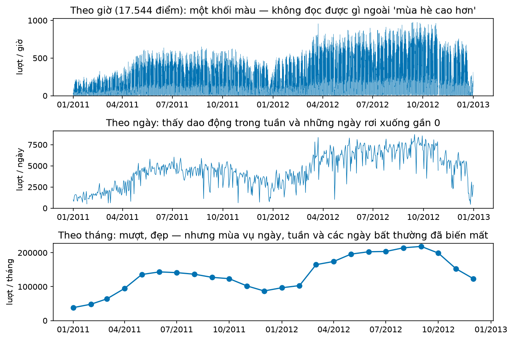

**Đọc hình.** Hàng trên: 17.544 điểm theo giờ thành một khối màu — mắt không tách được ngày với tuần. Hàng giữa (tổng theo ngày):
thấy dải dao động dày trong mỗi tháng và vài ngày rơi xuống rất thấp (thấp nhất 26/12/2012: 441 lượt). Hàng dưới (theo tháng): đẹp,
mượt, dễ báo cáo — và **mất sạch** mùa vụ ngày, tuần lẫn các ngày bất thường.

**Đọc đúng:** "Theo tháng, 2012 cao hơn 2011 ở mọi tháng — tỷ lệ 1,41 (tháng 6) đến 2,57 (tháng 3)." **Đọc sai:** "Theo biểu đồ
tháng, lượt thuê ổn định, không có dao động ngắn hạn." Gộp tần suất là làm trơn: nó "smoothing over the short-term variability"
(Alarcon Falconi et al., 2020). Chọn mức gộp theo câu hỏi, và luôn xem ít nhất một mức chi tiết hơn mức báo cáo.

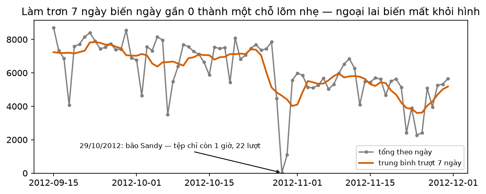

**Đọc hình.** Ngày 29/10/2012 (bão Sandy) tệp chỉ còn 1 giờ với 22 lượt — chấm xám chạm đáy. Đường cam (trung bình trượt 7 ngày có
tâm) tại ngày đó là **4.632**: chỉ một chỗ lõm nhẹ. Ai chỉ xem đường làm trơn sẽ không biết có một ngày dữ liệu gần như trống.

**Tỷ lệ khung hình.** Cùng dữ liệu, khung hẹp cao phóng đại độ dốc; khung rộng thấp làm lộ dao động mùa vụ. Heer & Agrawala (2006)
lấy ví dụ CO₂: tỷ lệ 1,17 "reveals an accelerating increase", tỷ lệ 7,87 "facilitates closer inspection of seasonal fluctuations".
Không có một tỷ lệ đúng cho mọi câu hỏi.

**Thang log.** Trên thang log, khoảng cách bằng nhau là **phần trăm thay đổi bằng nhau**.

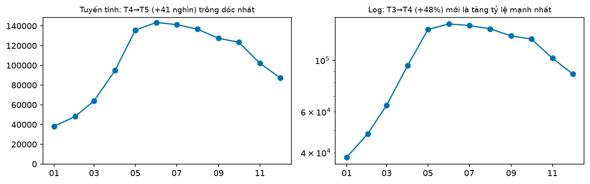

**Đọc hình.** Năm 2011: trên thang tuyến tính đoạn T4→T5 (+40.951 lượt) dốc nhất; trên thang log đoạn T3→T4 (+48,1%) dốc nhất,
T4→T5 chỉ +43,2%. Dùng log khi biến động tỷ lệ với mức (tăng trưởng, giá); dùng tuyến tính khi quan tâm con số tuyệt đối
(cần bao nhiêu xe).

### 4.3 Seasonal plot — mỗi chu kỳ một đường

FPP: seasonal plot vẽ dữ liệu theo "the individual “seasons”", giúp thấy mẫu hình mùa vụ và "identify years when the pattern changes".
Với dữ liệu giờ, "mùa" là **giờ trong tuần** (0 … 167).

**Tự viết.** Mỗi dòng là một giờ, cột là một tuần:

```python
gio_tuan = df["thu"] * 24 + df["gio"]                       # 0 = T2 00h … 167 = CN 23h
bang = df.assign(gio_tuan=gio_tuan, tuan=df.index.to_period("W-SUN")) \
         .pivot_table(index="gio_tuan", columns="tuan", values="cnt")
ax.plot(bang.index, bang.to_numpy(), color="grey", alpha=0.3)   # mỗi tuần một đường
ax.plot(bang.index, bang.median(axis=1).to_numpy())             # trung vị
```

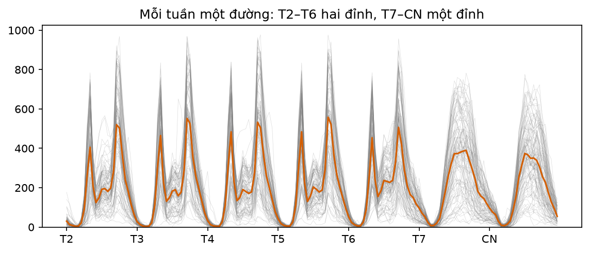

**Đọc hình.** Năm ô T2–T6 mỗi ô **hai đỉnh** nhọn (sáng và chiều); T7 và CN mỗi ô **một bướu** tròn giữa ngày. Đó là mùa vụ tuần
lồng mùa vụ ngày — hình dạng ngày *phụ thuộc* thứ. Các đường xám tản rộng theo chiều dọc vì mức thay đổi theo mùa năm.

**Đọc đúng:** "Ngày làm việc có hai giờ cao điểm đi làm/về; cuối tuần đi chơi giữa ngày." **Đọc sai:** "Cuối tuần vắng hơn hẳn ngày thường"
— trên 655 ngày đủ 24 giờ, tổng ngày trung bình thứ Bảy 4.653, Chủ nhật 4.523, thứ Hai 4.708, thứ Sáu 4.933: chênh vài phần trăm;
khác nhau chủ yếu ở **hình dạng**, không ở mức.

### 4.4 Subseries plot — mỗi mùa một chuỗi con

FPP: "the data for each season are collected together in separate mini time plots", "especially useful in identifying changes within
particular seasons".

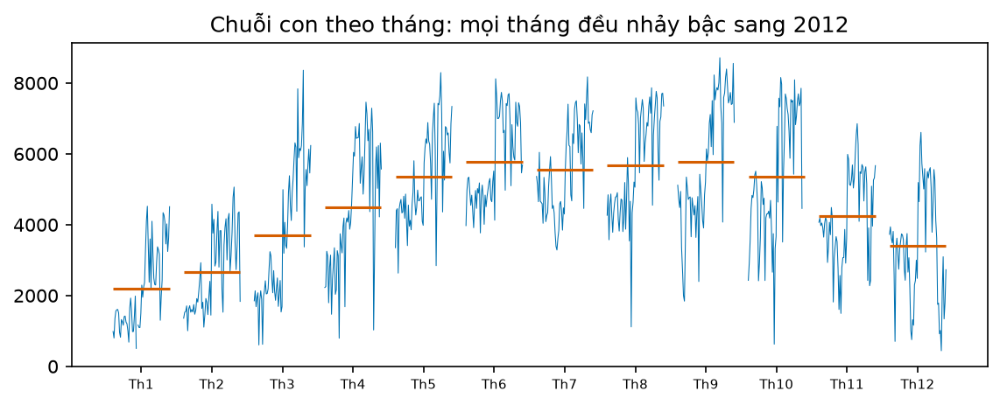

**Đọc hình.** Mỗi ô là một tháng; đường xanh là tổng theo ngày của tháng đó qua **hai năm** nối nhau (nửa trái là 2011, nửa phải 2012),
vạch cam là trung bình. Trong mọi ô, nửa phải cao hơn nửa trái — mức tăng xảy ra ở *mọi* tháng, không chỉ mùa hè. Vạch cam vẽ ra
mùa vụ năm: thấp tháng 1 và 12, cao tháng 6–9.

**Đọc sai kinh điển:** "Trong tháng 3 lượt thuê tăng dần từ đầu tới cuối tháng" — bước nhảy giữa ô là **ranh giới hai năm**, không
phải xu hướng trong tháng.

**Thư viện.** `statsmodels.graphics.tsaplots.month_plot` có docstring "Seasonal plot of monthly data" nhưng mã nguồn vẽ mỗi tháng
một đoạn cộng đường trung bình — tức là **subseries** plot; nó chỉ nhận dữ liệu tháng hoặc quý.

### 4.5 Lag plot — tự tương quan bằng mắt

**Trực giác.** Vẽ $y_t$ theo $y_{t-k}$. Điểm bám đường chéo → giá trị $k$ bước trước dự đoán tốt giá trị hiện tại.

**Tự viết.** `cap_tre(y, k)` = `pd.DataFrame({"truoc": y.shift(k), "sau": y}).dropna()`.

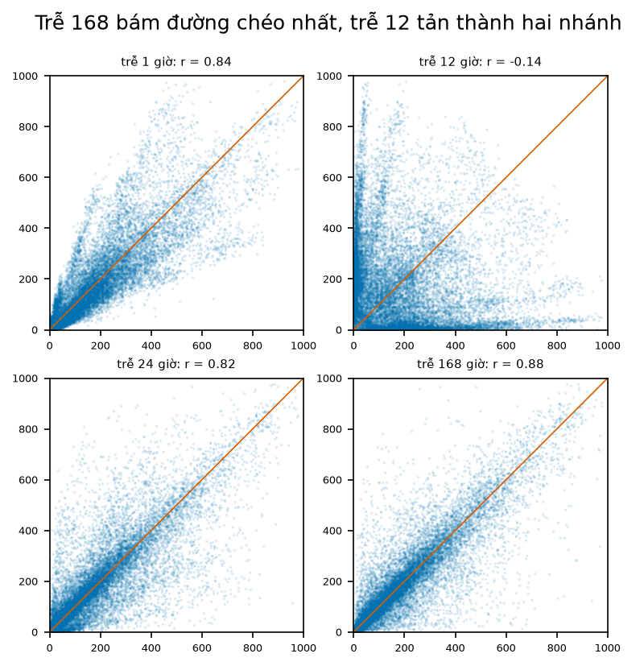

**Đọc hình.** Trễ 1 giờ ($r = 0{,}843$): đám mây dọc đường chéo nhưng xoè ở giá trị cao. Trễ 12 giờ ($r = -0{,}144$): **hai nhánh** bám
hai trục — 8h sáng cao ghép với 20h hôm trước thấp, và ngược lại; đây là đỉnh ghép với đáy chứ không phải "quan hệ âm". FPP giải thích
hiện tượng tương tự: "peaks … are plotted against troughs". Trễ 24 ($r = 0{,}819$) và trễ 168 ($r = 0{,}876$): trễ một tuần bám đường
chéo **chặt nhất**, vì cùng giờ tuần trước có cùng loại ngày.

### 4.6 Heatmap giờ × thứ

**Công thức.** Ô $(d, h)$ là trung bình lượt thuê các giờ có thứ $d$, giờ $h$:

$$
H_{d,h} = \frac{1}{\lvert \{t : \text{thu}(t) = d, \text{gio}(t) = h\} \rvert} \sum_{\text{thu}(t)=d,\ \text{gio}(t)=h} y_t
$$

**Tự viết.** `df.pivot_table(index="thu", columns="gio", values="cnt", aggfunc="mean")` rồi `ax.imshow(bang)`. (Thư viện lịch `july`
hỏng trên matplotlib 3.11 — tự dựng bằng pivot an toàn hơn.)

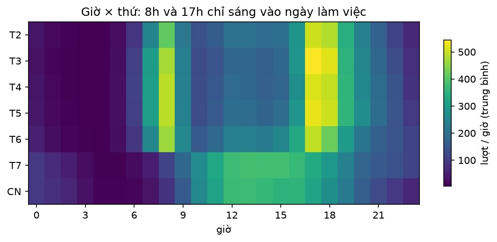

**Đọc hình.** Hai cột sáng lúc 8h và 17h chạy qua 5 dòng đầu rồi **tắt** ở T7, CN; hai dòng cuối sáng ở khoảng 11h–16h. Số: 8h thứ Tư
488 lượt, 8h Chủ nhật 84; 13h thứ Hai 206, 13h thứ Bảy 385. Heatmap là cách nhanh nhất để thấy mùa vụ kép trên một hình.

**Đọc sai:** "Thứ Sáu 17h thấp hơn thứ Ba nên thứ Sáu ít người đi" — 492 so với 544 là khác biệt nhỏ trên nền biến động lớn (xem
boxplot); heatmap chỉ cho **trung bình**, không cho độ phân tán.

### 4.7 Boxplot theo giờ — phân phối, không chỉ trung bình

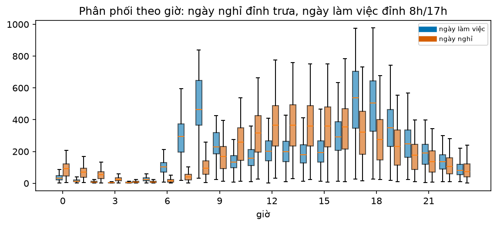

**Đọc hình.** Hộp là khoảng tứ phân vị (25%–75%), vạch giữa là trung vị. Ngày làm việc lúc 17h: trung vị 539, hộp 347,5–703,5 —
rộng hơn 350 lượt. Ngày nghỉ lúc 13h: trung vị 367, hộp 235,5–493. Ngày nghỉ lúc 8h: trung vị 94 so với 463 của ngày làm việc — hai
phân phối gần như **không chồng lên nhau**. Hộp rộng ở giờ cao điểm nghĩa là dự báo giờ đó sẽ khó hơn, dù trung bình rõ ràng.

### 4.8 Scatter tô màu theo thời gian

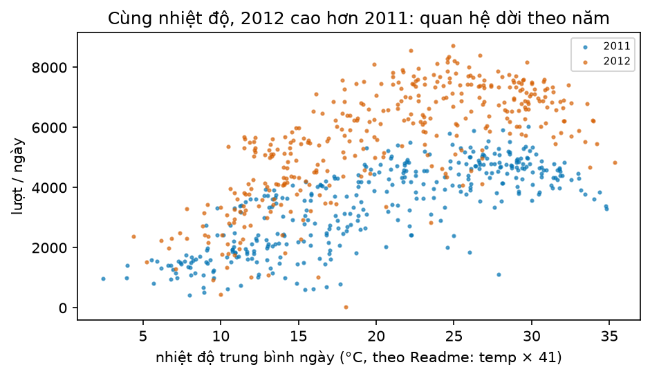

**Đọc hình.** Hai đám mây song song: cùng nhiệt độ, chấm cam (2012) cao hơn chấm xanh (2011). Quanh 24,6 °C trung bình 6.751 lượt/ngày
năm 2012 so với 4.316 năm 2011. Tương quan trong từng năm 0,771 và 0,714; **gộp hai năm chỉ 0,627** — trộn hai mức làm quan hệ trông
yếu hơn. Nhiệt độ trên trục x lấy theo Readme (`temp × 41`); trang UCI ghi công thức khác (t_min = −8, t_max = 39) nên chỉ đọc
**vị trí tương đối**, đừng trích con số độ C tuyệt đối.

**Đọc sai:** "Nhiệt độ năm 2012 làm người ta thuê xe nhiều hơn" — màu cho thấy quan hệ **dời theo năm** (hệ thống mở rộng, người dùng
tăng), không phải do nhiệt độ.

### 4.9 ACF nhanh

**Công thức** (FPP §2.8):

$$
r_k = \frac{\sum_{t=k+1}^{T} (y_t - \bar y)(y_{t-k} - \bar y)}{\sum_{t=1}^{T} (y_t - \bar y)^2}
$$

**Tự viết** (`acf_nhanh`, bỏ qua cặp có NaN):

```python
lech = y - np.nanmean(y)
mau = np.nansum(lech**2)
r = [np.nansum(lech[k:] * lech[:-k]) / mau for k in range(1, so_tre + 1)]
```

**Thư viện.** `statsmodels.graphics.tsaplots.plot_acf` — dải mặc định là dải Bartlett rộng dần theo độ trễ (`bartlett_confint=True`),
khác dải cố định ±1,96/√T của FPP.

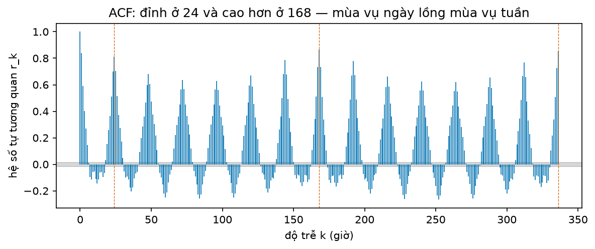

**Đọc hình.** Hình vỏ sò lặp mỗi 24 giờ: $r_{24} = 0{,}813$, $r_{12} = -0{,}143$. Đỉnh ở 168 ($0{,}864$) và 336 ($0{,}854$) **cao hơn**
đỉnh 144 ($0{,}786$) — mùa vụ tuần nằm trên mùa vụ ngày. Dải xám ±0,0149 gần như vô hình: với $T = 17.379$, gần như mọi cột đều
"có ý nghĩa", nên đọc **hình dạng**, đừng đếm cột vượt dải. Lưu ý $r_{168}$ theo công thức ACF (0,864) khác hệ số tương quan của lag
plot (0,876) vì mẫu số và trung bình khác nhau.

### 4.10 Bẫy: trục kép và trục y cắt

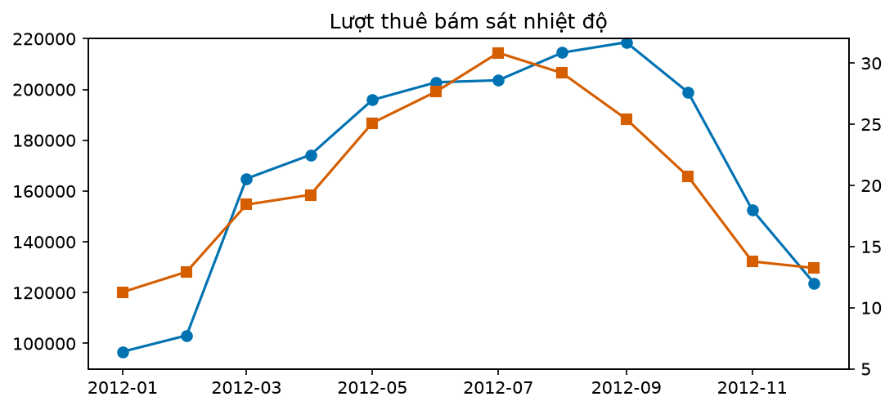

**Đọc hình.** Hai đường gần trùng nhau, tiêu đề "Lượt thuê bám sát nhiệt độ". Hai thủ thuật: (1) **trục kép** — thang phải (5–32 °C)
chọn tuỳ ý để đường cam nằm đè đường xanh; Few (2008): "When lines are associated with different quantitative scales … their
intersection means nothing"; (2) **trục y cắt** ở 90.000 — tháng 1 (96.744) trông gần bằng 0, tức mức tăng tới tháng 9 (218.573) bị
phóng to. Correll et al. (2020) thấy cảm giác phóng đại này "persistent … even for designs with explicit visual cues".

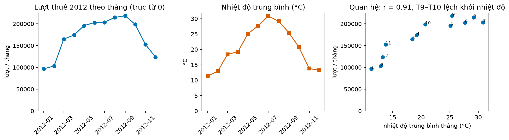

**Đọc hình.** Tách ba bảng: lượt thuê từ 0, nhiệt độ riêng, và scatter để nói về **quan hệ**. Scatter cho $r = 0{,}91$ qua 12 tháng —
quan hệ có thật — nhưng tháng 9 (25,4 °C) có lượt thuê cao nhất năm trong khi tháng 7 nóng nhất (30,8 °C): quá nóng không làm tăng thêm.
Điều này không thấy được trên trục kép.

**Sắc thái.** Datawrapper, sau khuyến cáo năm 2018, đã viết "we've changed our minds" với người đọc quen trục kép (tài chính). Mặc định
của khoá: **đánh chỉ số hoặc tách bảng**. Trục y: số đếm và tổng bắt đầu từ 0; đại lượng mức như nhiệt độ không bắt buộc — chọn phạm vi
theo độ lớn thay đổi có ý nghĩa.

### 4.11 Nguyên tắc tiêu đề

Tiêu đề trả lời "hình này cho thấy gì?". "cnt" hay "Lượt thuê theo giờ" là nhãn; "Giờ × thứ: 8h và 17h chỉ sáng vào ngày làm việc" là
kết luận người đọc kiểm được ngay trên hình. Bộ chấm từ chối tiêu đề là tên biến.

## 5. Lab từng bước

### Bước 1 — Chạy code đầu buổi

```bash
cd lab && python lab.py up
python lab.py chay ../code/bieu_do.py
python lab.py check                  # 7/8 đỏ
```

In ra `17544 giờ trên lưới, thiếu 165` và bảng `ho_so_tuan` có 7 dòng giống nhau (8h: 359 ở mọi thứ).

### Bước 2 — Sửa `ho_so_tuan`

Dùng `pivot_table(index="thu", columns="gio", values="cnt", aggfunc="mean")`, `reindex` về 7 × 24. Kiểm: thứ Hai 8h = 412, Chủ nhật
8h = 84.

### Bước 3 — Viết 8 hàm vẽ, ghép `bo_bieu_do_chan_doan`

Mỗi hàm nhận `(ax, df)`. Lưới 4×2; gắn `ax.set_label(nhan)` với nhãn: `duong`, `mua_vu_tuan`, `chuoi_con_thang`, `tre`, `nhiet_gio_thu`,
`hop_theo_gio`, `phan_tan_nhiet_do`, `acf`. Yêu cầu: không `twinx`; biểu đồ đường gộp theo ngày và trục y từ 0; ACF tới ít nhất trễ 168;
tiêu đề ≥ 20 ký tự nói kết luận.

### Bước 4 — 5 nhận xét có bằng chứng

Viết 5 câu, mỗi câu dạng "*[nhận xét]* — thấy ở *[hình]*, *[chỗ nào]*, *[con số]*". Ví dụ: "Cuối tuần không có giờ cao điểm đi làm —
heatmap, cột 8h, dòng T7–CN tối (114 và 84 so với 412–489)."

### Bước 5 — Vẽ lại biểu đồ gây hiểu nhầm

`bieu_do_gay_hieu_nham(df)` dựng sẵn — không sửa. Viết `ve_lai_trung_thuc(df)`: không trục kép, trục lượt thuê từ 0, có một hình nói
về quan hệ.

```bash
python lab.py check                  # 8/8 xanh
```

## 6. Lỗi thường gặp & cách chẩn đoán

| Triệu chứng | Nguyên nhân | Chẩn đoán | Sửa |
|---|---|---|---|
| Hình đường là một khối màu | vẽ quá nhiều điểm | đếm điểm / chiều rộng pixel | gộp theo ngày, hoặc vẽ một đoạn ngắn |
| "Không có mùa vụ tuần" | chỉ nhìn đường thô hoặc tổng tháng | heatmap giờ×thứ, ACF tới trễ 168 | thêm seasonal tuần + heatmap |
| Heatmap thứ lệch một ngày | lẫn 0 = CN (cột `weekday`) với 0 = T2 (`dayofweek`) | kiểm một ngày đã biết (01/01/2011 là thứ Bảy) | dùng một quy ước, ghi rõ |
| Giờ thiếu hiện thành 0 trên hình | `resample().sum()` không `min_count` | đếm NaN trên lưới đầy đủ | `min_count`, hoặc giữ NaN |
| Hai đường "bám nhau" | trục kép tự chọn thang | vẽ scatter, tính tương quan | tách bảng / đánh chỉ số |
| Biến động nhỏ trông khổng lồ | trục y cắt | xem trục bắt đầu ở đâu | số đếm bắt đầu từ 0 |
| Ngày bất thường biến mất | làm trơn / gộp tháng | vẽ chấm dữ liệu gốc dưới đường trơn | luôn giữ lớp dữ liệu gốc |
| "Lag 12 có quan hệ âm" | đỉnh ghép với đáy của mùa vụ ngày | xem lag plot có hai nhánh | đọc theo chu kỳ, không theo dấu |
| Đếm "cột ACF vượt dải" ra hàng trăm | T lớn → dải rất hẹp | dải ±1,96/√T = ±0,0149 | đọc hình dạng, dùng kiểm định (buổi 7) |
| `month_plot` không nhận dữ liệu giờ | chỉ nhận tháng/quý; thực chất là subseries plot | đọc mã nguồn | tự viết subseries |
| `seaborn.boxplot` phát `MatplotlibDeprecationWarning: vert` | seaborn 0.13.2 gọi API cũ của matplotlib 3.11 | cảnh báo đến từ seaborn | vô hại; hoặc dùng `ax.boxplot` |
| Scatter gộp nhiều năm cho tương quan thấp | trộn các mức khác nhau | tô màu theo năm | tính theo từng năm, hoặc khử xu hướng |

## 7. Bài tập về nhà

1. **Chuỗi lạ trong 20 phút.** Áp `bo_bieu_do_chan_doan` cho cột `casual` (khách vãng lai) thay cho `cnt`. Viết 5 nhận xét có bằng chứng.
   Mùa vụ tuần của `casual` khác `cnt` thế nào?
2. **Seasonal plot theo năm.** Vẽ tổng theo ngày theo "ngày trong năm", mỗi năm một đường. Tìm hai khoảng thời gian hai năm khác nhau rõ
   và giải thích bằng dữ liệu (ngày lễ, thời tiết, ngày thiếu).
3. **Hai tỷ lệ khung hình.** Vẽ tổng theo ngày năm 2012 ở tỷ lệ 1:1 và 8:1. Mỗi tỷ lệ làm lộ điều gì?

## 8. Tiêu chí "Xong khi"

- [ ] `python lab.py check` xanh 8/8.
- [ ] Với một chuỗi lạ, trong 20 phút nộp bộ 8 biểu đồ + 5 nhận xét, mỗi nhận xét chỉ vào hình, chỗ, con số.
- [ ] Chỉ ra mùa vụ kép ngày + tuần trên ít nhất hai hình (heatmap, seasonal tuần, ACF) mà biểu đồ đường thô che mất.
- [ ] Giải thích hai thủ thuật trong biểu đồ gây hiểu nhầm và vì sao bản vẽ lại trung thực hơn.

## 9. Đọc thêm

- Hyndman, R.J., Athanasopoulos, G. et al. *Forecasting: Principles and Practice, the Pythonic Way*, chương 2 — Time series graphics:
  https://otexts.com/fpppy/nbs/02-graphics.html
- Correll, M., Bertini, E. & Franconeri, S. (2020). Truncating the Y-Axis: Threat or Menace? *CHI 2020*. arXiv:1907.02035
- Few, S. (2008). Dual-Scaled Axes in Graphs: Are They Ever the Best Solution? *Perceptual Edge*.
- Muth, L.C. (2018, có cập nhật). Bài về biểu đồ trục kép, *Datawrapper Blog*: https://www.datawrapper.de/blog/dualaxis/
- Heer, J. & Agrawala, M. (2006). Multi-Scale Banking to 45 Degrees. *IEEE TVCG* 12(5).
- Ortigossa, E. et al. (2025). Time Series Information Visualization — A Review of Approaches and Tools. arXiv:2507.14920
- statsmodels 0.15 — `plot_acf`, `month_plot`, `seasonal_diagnostic_plot`; seaborn 0.13 — `heatmap`, `boxplot`, `lineplot(hue=...)`.
- Fanaee-T, H. & Gama, J. (2013). Bike Sharing Dataset — bài gốc, doi:10.1007/s13748-013-0040-3; dữ liệu doi:10.24432/C5W894.
- Phụ lục C của khoá — Sổ tay đọc biểu đồ.
