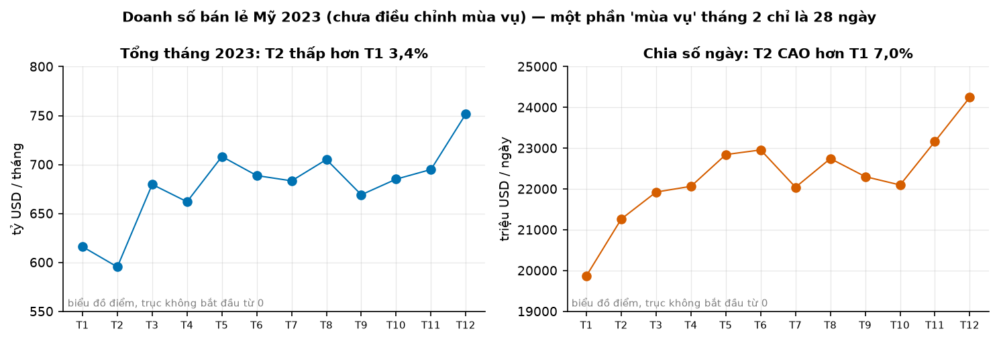
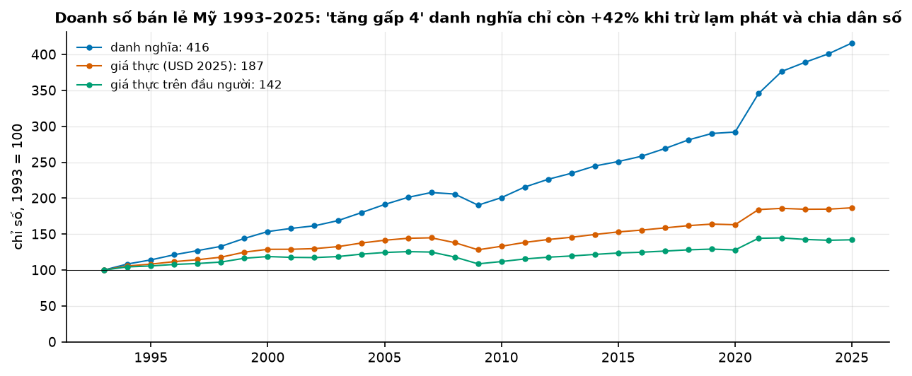
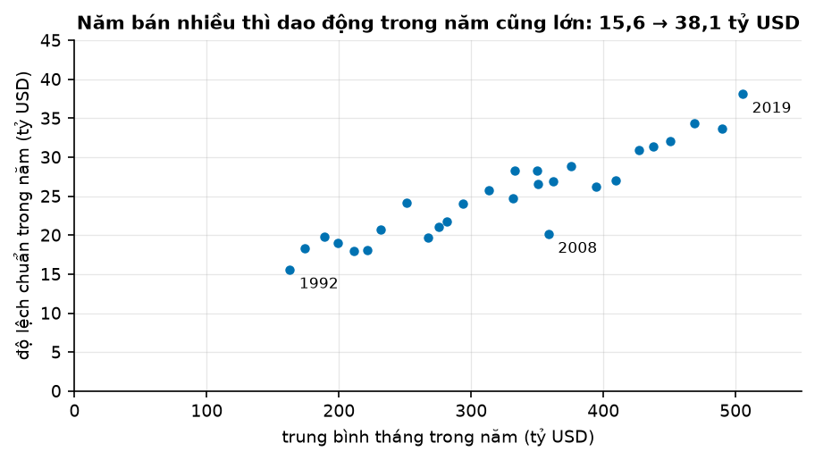
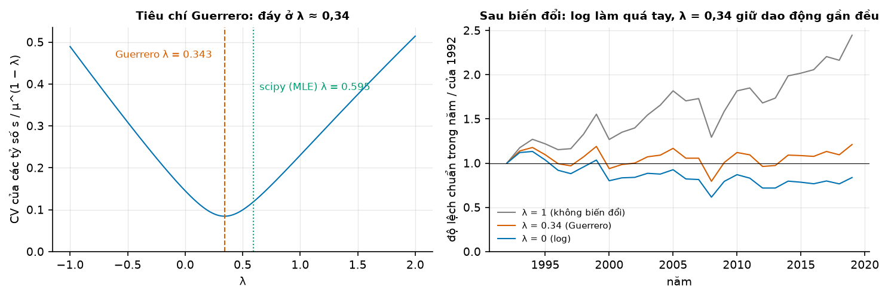
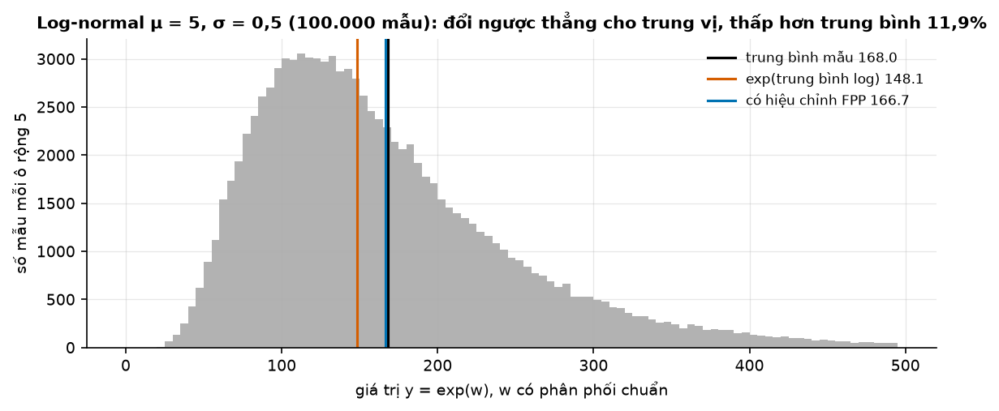
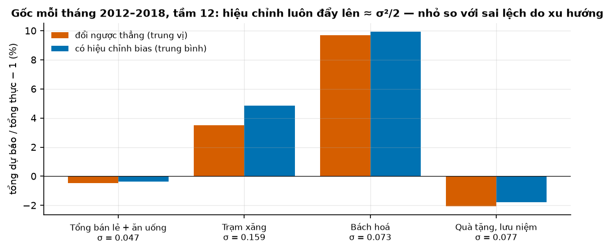

# Buổi 5 — Biến đổi và điều chỉnh dữ liệu

## 1. Mục tiêu

Sau buổi này bạn:

- Bỏ khỏi dữ liệu những dao động **đã biết nguyên nhân**: số ngày trong tháng, lạm phát, dân số, trước khi bắt mô hình tự
  học chúng.
- Giải thích vì sao **log** làm dao động đều nhau khi dao động tỷ lệ với mức; tự viết **Box-Cox** và chọn λ bằng cách của
  **Guerrero**.
- Chỉ ra bằng số: dự báo trên thang log rồi đổi ngược bằng `exp` cho **trung vị**, thấp hơn **trung bình**; hiệu chỉnh bias
  đẩy nó lên bao nhiêu.
- Nói được khi nào nên hiệu chỉnh bias, khi nào không, dựa trên số đo của backtest.

## 2. Nhắc lại buổi trước

Từ buổi 4 (đọc biểu đồ):

- **Thang log**: trục dọc mà 100 → 200 và 200 → 400 cao bằng nhau. Cùng độ dốc nghĩa là cùng **phần trăm** thay đổi.
- **Xu hướng** là mức chung đổi lâu dài; **mùa vụ** là mẫu lặp sau số bước cố định theo lịch; **chu kỳ mùa vụ** $m$ là số
  bước đó (dữ liệu tháng lặp theo năm: $m$ = 12).

Từ buổi 1–3:

- **Seasonal naive**: dự báo bằng giá trị cùng lúc của vòng lặp trước, ví dụ tháng 3 năm nay = tháng 3 năm ngoái.
- **Gốc dự báo**: lúc ra dự báo; chỉ được dùng dữ liệu trước gốc. **Backtest**: đứng ở nhiều gốc trong quá khứ, dự báo, so
  với cái đã xảy ra.

Từ buổi 2 (xác suất và thống kê):

- Dữ liệu **lệch phải** (vài số rất lớn) có trung bình lớn hơn trung vị.
- **Phương sai** $s^2$ là trung bình bình phương khoảng cách tới trung bình (chia $n - 1$); **độ lệch chuẩn** $s$ là căn của nó.
- **Phân phối chuẩn**: hình chuông đối xứng, nên trung bình bằng trung vị.
- Dự báo làm **phạt tuyệt đối** (như MAE) nhỏ nhất là **trung vị**; làm **phạt bình phương** nhỏ nhất là **trung bình**.

## 3. Trạng thái đầu buổi

Sau `python lab.py up` (trong thư mục `lab/`):

| Hạng mục | Trạng thái |
|---|---|
| Dữ liệu | `du-lieu/raw/census-marts-ban-le/mrtssales92-present.xlsx` — doanh số bán lẻ Mỹ theo tháng, 1/1992 → 6/2026 (414 tháng), sha256 `2c58dce5119a` |
| | `bls-cpi-u/cu.data.1.AllItems.tsv` — chỉ số giá CPI-U theo tháng, sha256 `47507ab13d93` |
| | `bea-nipa-thang/NipaDataM.txt` — dân số Mỹ theo tháng, sha256 `dd14f325cc4b` |
| Nguồn | U.S. Census Bureau (MARTS, bản lưu Internet Archive 13/9/2026), U.S. BLS, U.S. BEA — public domain |
| Môi trường | Python 3.12; numpy 2.5.3, pandas 3.0.5, scipy 1.18.1, statsmodels 0.15.0, openpyxl 3.1.5 |
| `code/bien_doi.py` | `doc_ban_le`, `doc_cpi`, `doc_dan_so`, `theo_ngay`, `so_sanh_thang`, `gia_thuc`, `tang_truong`, `tang_truong_thuc_dau_nguoi`, `boxcox`, `boxcox_nguoc`, `guerrero`, `du_bao_log`, `danh_gia_bias` |
| `code/lab.ipynb` | notebook của Lab, bước 1–5 |
| **Đang cố tình sai** | `so_sanh_thang` so tổng tháng **không chia số ngày**; `tang_truong_thuc_dau_nguoi` trả tăng trưởng danh nghĩa; `boxcox_nguoc` bỏ qua `sigma2` |
| **Triệu chứng** | "tháng 3/2023 tăng 14,2% so với tháng 2"; "bán lẻ tăng 316% từ 1993"; dự báo trung bình và trung vị ra y hệt nhau |
| `python lab.py check` lúc này | ĐỎ: 5/8 test hỏng |

## 4. Lý thuyết

Dữ liệu chính: **doanh số bán lẻ và ăn uống Mỹ** theo tháng, triệu USD, chưa điều chỉnh mùa vụ.

### Từ mới trong buổi

| Thuật ngữ | Nghĩa một câu | Ví dụ |
|---|---|---|
| điều chỉnh lịch | Chia tổng tháng cho số ngày (hoặc số ngày bán hàng) để tháng dài và tháng ngắn so được với nhau. | 280 tỷ / 28 ngày = 10 tỷ/ngày. |
| giá danh nghĩa / giá thực | Danh nghĩa: số tiền ghi lúc đó. Thực: đổi về sức mua của một năm gốc. | 150 tỷ lúc giá chung gấp 1,25 = 120 tỷ giá gốc. |
| CPI (chỉ số giá tiêu dùng) | Con số theo dõi giá một giỏ hàng; tăng 10% nghĩa là giá chung tăng 10%. | 100 → 125: giá chung tăng 25%. |
| năm gốc | Năm mà ta đổi mọi con số về sức mua của nó. | "USD năm 2025". |
| trên đầu người | Chia cho dân số. | 120 tỷ / 12 triệu người = 10 nghìn USD/người. |
| log, `exp` | $\log y$ trả lời "$e$ mũ mấy thì bằng $y$"; `exp` làm ngược lại. Buổi này dùng log tự nhiên ($e \approx 2{,}718$). | $\log 100 = 4{,}605$; $\exp(4{,}605) = 100$. |
| biến đổi Box-Cox | Họ phép biến đổi chọn bằng một số $\lambda$: $\lambda = 1$ gần như giữ nguyên, $\lambda = 0$ là log. | $\lambda$ = 0,5 biến 100 thành 18. |
| hệ số biến thiên (CV) | Độ lệch chuẩn chia trung bình: dao động to cỡ bao nhiêu phần của mức. | Trung bình 100, độ lệch chuẩn 10 → CV = 0,1. |
| Guerrero | Cách chọn $\lambda$ sao cho dao động trong mỗi năm đều nhau sau biến đổi. | Bán lẻ Mỹ 1992–2019: $\lambda \approx$ 0,34. |
| Yeo-Johnson | Biến thể của Box-Cox nhận được cả số 0 và số âm. | Dùng cho chuỗi phần trăm tăng trưởng. |
| đổi ngược (back-transform) | Đưa dự báo trên thang đã biến đổi về thang gốc. | Dự báo log 4,6 → $\exp(4{,}6) \approx$ 99,5. |
| log-normal | Số $y = \exp(w)$ với $w$ có phân phối chuẩn: luôn dương, lệch phải. | Doanh số, giá nhà. |
| hiệu chỉnh bias | Nhân dự báo đổi ngược với một hệ số nhỏ để ra trung bình thay vì trung vị. | 99,5 × (1 + 0,04 / 2) ≈ 101,5. |
| sai phân (differencing) | Thay mỗi giá trị bằng hiệu của nó với giá trị trước (chỉ ở hộp Nâng cao). | 100, 103, 105 → 3, 2. |
| drift | Mức tăng trung bình mỗi bước (ở đây: mỗi năm), cộng vào seasonal naive. | Năm ngoái 100, drift +3 → năm nay 103. |

### 4.1 Điều chỉnh lịch: tháng dài bán nhiều hơn tháng ngắn

**Vấn đề.** Doanh số tháng 3 thường cao hơn tháng 2. Một phần là người ta mua nhiều hơn, một phần chỉ vì tháng 3 dài hơn
31 − 28 = 3 ngày. Muốn biết nhu cầu có đổi không, phải bỏ phần do số ngày.

**Ví dụ số nhỏ — tự tính tay.** Một cửa hàng bán đều 10 tỷ mỗi ngày. Tháng 2 (28 ngày) bán 280 tỷ, tháng 3 (31 ngày) bán 310
tỷ. So thẳng: 310 / 280 − 1 = +10,7%. Chia số ngày: 280 / 28 = 10 và 310 / 31 = 10, tức **không đổi**. Toàn bộ 10,7% là do
ba ngày thêm.

**Công thức.**

$$
y^{\text{ngày}}_t = \frac{y_t}{\text{số ngày của tháng } t}
$$

- $y_t$: tổng doanh số tháng $t$. $y^{\text{ngày}}_t$: doanh số trung bình mỗi ngày của tháng đó.

**Nói bằng lời.** Chia tổng tháng cho số ngày của tháng. Tháng 3/2023 bán 679.701 triệu USD trong 31 ngày: 679.701 / 31 ≈
21.926 triệu USD mỗi ngày.



**Cách đọc hình.**

1. **Trục ngang** (cả hai ô): tháng năm 2023.
2. **Trục dọc**: ô trái là tổng tháng (tỷ USD); ô phải là trung bình mỗi ngày (triệu USD). Hai trục cố ý không bắt đầu từ 0
   để thấy chênh vài phần trăm, nên hình dùng chấm, không dùng cột (ngoại lệ có chủ đích của quy ước buổi 4).
3. **Ký hiệu**: mỗi chấm là một tháng.
4. **Nhìn vào đâu**: đoạn T1 → T2 ở hai ô.
5. **Kết luận**: theo tổng tháng, tháng 2 **giảm** so với tháng 1 (595.432 / 616.100 − 1 = −3,4%); chia số ngày thì tháng 2
   **tăng** (21.265 / 19.874 − 1 = +7,0%). Dấu của kết luận đảo ngược.

**Mức tinh hơn: ngày bán hàng.** Nếu Chủ nhật bán ít, đếm số ngày **không phải Chủ nhật** thay cho số ngày lịch. Census còn công
bố chuỗi **đã điều chỉnh** (ADJUSTED), đã bỏ cả mùa vụ, ngày lễ và chênh lệch số ngày bán hàng. Bốn con số cho cùng một câu hỏi:

| Tháng 3 so với tháng 2/2023 | So thẳng | Chia ngày lịch | Chia ngày không phải Chủ nhật (24 → 27) | Chuỗi ADJUSTED |
|---|---|---|---|---|
| Tăng | +14,15% | +3,11% | +1,47% | −1,05% |

**Đọc bảng.** Đi từ trái sang phải, mỗi cột bỏ thêm một nguyên nhân đã biết, và "tăng trưởng" co dần tới âm. Không cột nào sai;
mỗi cột trả lời một câu hỏi khác. Báo cáo phải nói đã bỏ gì.

**Tóm lại.** **Chia tổng tháng cho số ngày trước khi so hai tháng. Nói rõ đã chia số ngày lịch, số ngày bán hàng, hay dùng
chuỗi đã điều chỉnh.**

**Tự kiểm tra.** Tháng 1 bán 620 tỷ trong 31 ngày, tháng 2 bán 588 tỷ trong 28 ngày. Theo ngày, tháng 2 tăng hay giảm, bao
nhiêu phần trăm?

<details>
<summary>Đáp án</summary>

620 / 31 = 20 tỷ/ngày; 588 / 28 = 21 tỷ/ngày. Tháng 2 **tăng** 21 / 20 − 1 = 5%. Nhầm hay gặp: so thẳng 588 / 620 − 1 ≈ −5,2%
rồi kết luận "tháng 2 giảm".

</details>

### 4.2 Lạm phát và dân số: tăng thật bao nhiêu

**Vấn đề.** Doanh số bán lẻ Mỹ năm 2025 gấp 4,16 lần năm 1993. Nhưng giá cả cũng tăng, và dân số cũng đông hơn. Mỗi người thật
sự mua nhiều hơn bao nhiêu?

**Ví dụ số nhỏ — tự tính tay.** Hai năm:

| | Năm gốc | Năm sau |
|---|---|---|
| Doanh thu (tỷ) | 100 | 150 |
| CPI | 100 | 125 |
| Dân số (triệu người) | 10 | 12 |

**Đọc bảng.** Bỏ lần lượt hai nguyên nhân:

- **Giá thực** (theo giá năm gốc): 150 / 125 × 100 = 120. Tăng 20%, không phải 50%.
- **Trên đầu người**: 100 / 10 = 10 và 120 / 12 = 10. Mỗi người mua **y như cũ**; toàn bộ phần tăng là do giá và do thêm người.

**Công thức.**

$$
x_t = \frac{y_t}{z_t} \times z_{\text{gốc}}
$$

- $y_t$: doanh số danh nghĩa ở thời điểm $t$. $z_t$: CPI ở thời điểm $t$. $z_{\text{gốc}}$: CPI của năm gốc.
- $x_t$: doanh số theo giá của năm gốc.

**Nói bằng lời.** Chia cho CPI lúc đó rồi nhân CPI năm gốc. Ở ví dụ: 150 / 125 × 100 = 120 tỷ theo giá năm gốc. Muốn trên
đầu người thì chia thêm cho dân số.



**Cách đọc hình.**

1. **Trục ngang**: năm, 1993 → 2025.
2. **Trục dọc**: chỉ số, năm 1993 = 100 (buổi 4: đánh chỉ số để ba chuỗi khác đơn vị chung một trục); bắt đầu từ 0.
3. **Ký hiệu**: xanh dương là danh nghĩa; cam là giá thực (USD năm 2025); xanh lá là giá thực trên đầu người.
4. **Nhìn vào đâu**: điểm cuối năm 2025 của ba đường.
5. **Kết luận**: chỉ số năm 2025 đi 416 → 187 → 142 khi lần lượt trừ lạm phát và chia dân số: "tăng hơn 4 lần" danh nghĩa chỉ
   còn tăng thật khoảng 42%.

| | 1993 | 2025 |
|---|---|---|
| CPI (trung bình năm) | 144,5 | 321,94 |
| Dân số (triệu người) | 260,3 | 341,9 |

**Đọc bảng.** Giá chung tăng 321,94 / 144,5 = 2,23 lần, dân số tăng 341,9 / 260,3 = 1,31 lần; hai thứ đó giải thích gần hết con
số "gấp 4". Phần còn lại, +42% trong 32 năm, ứng với khoảng 1,1% mỗi năm.

Ba mức là ba câu hỏi: tổng tiền (danh nghĩa), sức mua (giá thực), mức chi tiêu mỗi người (trên đầu người). Với dự báo doanh
thu, thường dự báo **giá thực** rồi nhân lại CPI dự báo.

**Tóm lại.** **Chia CPI (rồi nhân CPI năm gốc) để bỏ lạm phát; chia dân số để ra mức mỗi người. Con số "tăng bao nhiêu" phải nói
rõ là danh nghĩa, thực, hay thực trên đầu người.**

**Tự kiểm tra.** Lương 10 → 11 triệu; CPI 200 → 220. Lương thực (theo giá năm ngoái) tăng bao nhiêu?

<details>
<summary>Đáp án</summary>

11 / 220 × 200 = 10 triệu, tức **không tăng**: giá tăng đúng bằng lương. Nhầm hay gặp: trừ phần trăm cho nhau. Cách đó chỉ gần
đúng khi các phần trăm nhỏ. Lương gấp 3, giá gấp 2 thì lương thực gấp 3 / 2 = 1,5, tức tăng 50%, không phải 200% − 100% = 100%.

</details>

### 4.3 Log: khi dao động lớn lên theo mức

**Vấn đề.** Năm doanh số cao thì chênh lệch giữa tháng đông và tháng vắng cũng lớn. Nhiều mô hình (buổi 6, 16, 17) giả định
dao động to như nhau ở mọi mức. Cần một phép biến đổi làm dao động đều lại.

**Trực giác.** Một cửa hàng nhỏ tháng Tết bán tăng 20%: 100 → 120 triệu, chênh 20. Một siêu thị cũng tăng 20%: 1.000 → 1.200
triệu, chênh 200. Trên thang thường, hai cú tăng trông khác hẳn nhau. Thật ra chúng **giống nhau** tính theo phần
trăm. Log biến "nhân" thành "cộng", nên cùng phần trăm thì cùng khoảng cách.

**Ví dụ số nhỏ — tự tính tay.** Dùng log tự nhiên:

| $y$ | 100 | 120 | 1.000 | 1.200 |
|---|---|---|---|---|
| $\log y$ | 4,605 | 4,787 | 6,908 | 7,090 |

**Đọc bảng.** Trên thang gốc, hai cú tăng là 20 và 200. Trên thang log, cả hai đều là 4,787 − 4,605 = 7,090 − 6,908 = 0,182,
đúng bằng $\log 1{,}2$.

Quy tắc: $\log(a \times b) = \log a + \log b$, nên $\log(1{,}2 \times y) - \log y = \log 1{,}2$ với mọi $y$. Log chỉ dùng được
cho số **dương**.



**Cách đọc hình.**

1. **Trục ngang**: trung bình các tháng trong một năm (tỷ USD mỗi tháng), bắt đầu từ 0.
2. **Trục dọc**: độ lệch chuẩn của 12 tháng trong năm đó (tỷ USD), bắt đầu từ 0: dao động giữa tháng đông và tháng vắng.
3. **Ký hiệu**: mỗi chấm là một năm, 1992 → 2019.
4. **Nhìn vào đâu**: chấm 1992 (dưới trái) và chấm 2019 (trên phải).
5. **Kết luận**: mức tăng gấp khoảng 3,1 lần (162,9 → 505,4 tỷ USD), độ lệch chuẩn tăng gấp khoảng 2,4 lần (15,6 → 38,1): dao động
   lớn lên theo mức, nhưng chậm hơn mức.

Chữ "chậm hơn" quan trọng. Log hợp nhất khi dao động tỷ lệ **đúng** với mức (mức gấp 3 thì dao động gấp 3). Ở đây dao động chỉ
gấp 2,4, nên log sẽ ép quá tay.

**Tóm lại.** **Log biến tăng theo phần trăm thành tăng theo khoảng cách: cùng phần trăm thì cùng khoảng cách, bất kể mức. Nó làm
dao động đều lại khi dao động tỷ lệ với mức; chỉ dùng cho số dương.**

**Tự kiểm tra.** Năm A: tháng vắng nhất 50, đông nhất 100. Năm B: vắng nhất 500, đông nhất 1.000. Trên thang log, khoảng cách
giữa tháng vắng nhất và đông nhất của năm nào lớn hơn?

<details>
<summary>Đáp án</summary>

Bằng nhau: 100 / 50 = 1.000 / 500 = 2, cả hai đều gấp đôi, nên trên thang log cùng cao $\log 2 \approx 0{,}693$. Nhầm hay gặp:
nghĩ năm B lớn hơn vì chênh 500 so với 50; đó là thang gốc.

</details>

### 4.4 Box-Cox và cách chọn λ

**Vấn đề.** Không biến đổi thì dao động của bán lẻ phình ra theo mức; lấy log thì ép quá tay. Cần một nấc ở giữa, và một cách
chọn nấc đó bằng số, không bằng mắt.

**Trực giác.** Box-Cox là một "núm vặn" $\lambda$: vặn về 1 thì gần như giữ nguyên dữ liệu, vặn về 0 thì là log, ở giữa (ví dụ
0,5, gần giống lấy căn bậc hai) thì ép nhẹ hơn log.

**Công thức.**

$$
w_t = \begin{cases}\log y_t & \lambda = 0\\[2pt] \dfrac{y_t^{\lambda} - 1}{\lambda} & \lambda \ne 0\end{cases}
$$

- $y_t$: giá trị gốc (dương). $w_t$: giá trị sau biến đổi. $\lambda$: số chọn trước, thường giữa −1 và 2.
- Trừ 1 rồi chia $\lambda$ để các giá trị $\lambda$ gần 0 cho kết quả gần với log.

**Nói bằng lời.** Nâng $y$ lên luỹ thừa $\lambda$, trừ 1, chia cho $\lambda$; riêng $\lambda = 0$ thì lấy log. Với $y = 100$:
$\lambda = 1$ cho (100 − 1) / 1 = 99; $\lambda = 0{,}5$ cho (10 − 1) / 0,5 = 18; $\lambda = 0$ cho log 100 = 4,605.

**Ví dụ số nhỏ — tự tính tay (chọn λ theo Guerrero).** Chia chuỗi thành các khối, mỗi khối một năm ($m$ = 12 tháng). Giả sử
có ba năm:

| | Năm 1 | Năm 2 | Năm 3 |
|---|---|---|---|
| Trung bình $\mu$ | 100 | 400 | 900 |
| Độ lệch chuẩn $s$ | 10 | 20 | 30 |

**Đọc bảng.** Mức gấp 9 lần mà dao động chỉ gấp 3: dao động tăng theo mức nhưng chậm hơn mức.

Ý của Guerrero: sau Box-Cox, độ lệch chuẩn của một năm có mức $\mu$ xấp xỉ bằng $s / \mu^{1 - \lambda}$. Với log ($\lambda = 0$)
đó là $s / \mu$: gần mức 100, tăng 1 đơn vị chỉ làm log tăng khoảng 0,01 = 1/100, nên dao động bị chia cho mức (đúng ý mục 4.3). Vậy tìm $\lambda$ để tỷ số này **như nhau ở mọi năm**.

- $\lambda = 1$: $\mu^{0} = 1$, tỷ số là 10, 20, 30. Không đều: dao động lớn dần theo mức.
- $\lambda = 0$ (log): tỷ số là $s / \mu$ = 0,1; 0,05; 0,033. Không đều: log ép quá tay.
- $\lambda = 0{,}5$: $\mu^{0{,}5}$ là 10, 20, 30, tỷ số là 1, 1, 1. **Đều hoàn toàn**.

Để đo "đều tới đâu", Guerrero dùng **hệ số biến thiên** (CV) của các tỷ số: độ lệch chuẩn của chúng chia trung bình của chúng.
Ở $\lambda = 1$: ba tỷ số 10, 20, 30 có độ lệch chuẩn 10 và trung bình 20, nên CV = 10 / 20 = 0,5. Ở $\lambda = 0{,}5$: ba tỷ
số bằng nhau, CV = 0. Thử nhiều $\lambda$, chọn $\lambda$ cho CV nhỏ nhất.

**NumPy và thư viện.** `boxcox` và `guerrero` trong `code/bien_doi.py` làm đúng hai bước trên (mở tệp để đọc). Đối chiếu:
`scipy.special.boxcox(y, lam)` cho cùng kết quả với `boxcox` tự viết (lệch dưới 1e−12 trên dữ liệu bán lẻ).
`statsmodels.base.transform.BoxCox().transform_boxcox(y, method="guerrero", window_length=12)` chọn cùng $\lambda$ với
`guerrero`. Lưu ý: `window_length` mặc định là 4, không phải 12; quên truyền thì ra $\lambda$ khác.



**Cách đọc hình.**

1. **Trục ngang**: ô trái là $\lambda$, từ −1 tới 2; ô phải là năm, 1992 → 2019.
2. **Trục dọc**: ô trái là CV của các tỷ số (nhỏ là đều); ô phải là độ lệch chuẩn trong năm **sau** biến đổi, chia cho của năm
   1992 (bằng 1 nghĩa là dao động không đổi so với 1992).
3. **Ký hiệu**: ô trái, vạch cam đứt là $\lambda$ Guerrero, vạch xanh lá chấm là $\lambda$ scipy chọn; ô phải, xám là không
   biến đổi, cam là $\lambda$ = 0,34, xanh là log.
4. **Nhìn vào đâu**: đáy đường cong ô trái; điểm năm 2019 của ba đường ô phải.
5. **Kết luận**: CV thấp nhất ở $\lambda \approx 0{,}34$; với $\lambda$ đó đường cam nằm sát mức 1 nhất, còn log (xanh) tụt dưới 1:
   ép quá tay.

| Dao động trong năm 2019 so với 1992 | Không biến đổi | $\lambda$ = 0,34 | Log |
|---|---|---|---|
| Gấp (lần) | 2,45 | 1,21 | 0,84 |

**Đọc bảng.** Gần 1 là đều. Không biến đổi thì dao động phình ra; log thì co lại quá mức; $\lambda$ Guerrero ở giữa, gần 1 nhất.

`scipy.stats.boxcox(y)` chọn $\lambda$ = 0,595 theo một tiêu chí khác (hợp lý cực đại, MLE: làm dữ liệu sau biến đổi giống hình
chuông nhất). Hai tiêu chí trả lời hai câu hỏi khác nhau; buổi này dùng Guerrero, vì cần dao động đều.

**Số 0 và số âm.** Box-Cox và log cần số dương. Gặp số 0 hay số âm, `scipy.stats.boxcox` báo
`ValueError: Data must be positive.` Chuỗi phần trăm tăng trưởng của bán lẻ có 25 tháng âm; `scipy.stats.yeojohnson`
chạy được trên nó và chọn $\lambda$ ≈ 1,02, gần như không biến đổi.

**λ là tham số của mô hình.** Chọn $\lambda$ bằng cả chuỗi rồi backtest là dùng dữ liệu tương lai. Trong backtest, ở mỗi gốc dự
báo, tính $\lambda$ chỉ từ dữ liệu trước gốc, lưu lại, và đổi ngược bằng đúng $\lambda$ đó.

**Tóm lại.** **Box-Cox là núm vặn $\lambda$ giữa "giữ nguyên" (1) và log (0). Guerrero chọn $\lambda$ làm dao động mỗi năm đều nhau
nhất; với bán lẻ Mỹ đó là 0,34, không phải log. $\lambda$ là tham số của mô hình, như drift hay trung bình.**

**Tự kiểm tra.** Ba năm có trung bình 100, 400, 900 và độ lệch chuẩn 5, 20, 45. $\lambda$ nào làm tỷ số Guerrero đều?

<details>
<summary>Đáp án</summary>

$\lambda = 0$ (log): tỷ số $s / \mu$ = 5/100 = 20/400 = 45/900 = 0,05, đều cả ba năm. Dao động tỷ lệ đúng với mức, nên log vừa
khít. Nhầm hay gặp: chọn 0,5 như ví dụ trong bài; khi đó $s / \sqrt{\mu}$ = 0,5; 1; 1,5, không đều.

</details>

### 4.5 Đổi ngược: ra trung vị, không phải trung bình

**Vấn đề.** Dự báo trên thang log xong phải đổi về đơn vị gốc bằng `exp`. Con số nhận được thường **thấp hơn** trung bình thật.
Cộng dồn nhiều tháng hay nhiều cửa hàng, phần hụt cộng dồn theo.

**Ví dụ số nhỏ — tự tính tay.** Ba giá trị trên thang log: 0, 1, 2.

- Trung bình trên thang log là 1. Đổi ngược: $\exp(1) \approx 2{,}72$.
- Đổi từng giá trị về thang gốc: $\exp(0) = 1$, $\exp(1) \approx 2{,}72$, $\exp(2) \approx 7{,}39$. Trung bình thật là
  (1 + 2,72 + 7,39) / 3 ≈ **3,70**.
- Vậy 2,72 < 3,70: "exp của trung bình log" thấp hơn "trung bình thật". Nhưng 2,72 đúng là số **đứng giữa** của ba số trên: nó
  là **trung vị**.

Vì sao: `exp` giữ nguyên thứ tự, nên số đứng giữa trên thang log vẫn đứng giữa sau khi đổi ngược. Nhưng `exp` **kéo giãn** phía
trên: bước từ 1 lên 2 trên thang log thành 7,39 − 2,72 = 4,67 trên thang gốc, còn bước từ 0 lên 1 chỉ thành 2,72 − 1 = 1,72.
Số lớn bị đẩy xa, kéo trung bình lên trên trung vị. Kết quả trên thang gốc lệch phải.

**Công thức.** Nếu dự báo trên thang log có dạng hình chuông với tâm $\hat w$ và phương sai $\sigma^2$ thì:

$$
\text{trung vị} = e^{\hat w}, \qquad \text{trung bình} = e^{\hat w + \sigma^2/2} \approx e^{\hat w}\left(1 + \frac{\sigma^2}{2}\right)
$$

- $\hat w$: dự báo trên thang log (tâm của hình chuông). $\sigma^2$: phương sai của dự báo trên thang log, tức nó hay lệch cỡ nào.
- Dạng xấp xỉ bên phải là **công thức hiệu chỉnh bias** của FPP §5.6 cho $\lambda = 0$. Chứng minh cần toán ngoài buổi này; hình
  dưới kiểm lại bằng mô phỏng.

**Nói bằng lời.** Đổi ngược thẳng cho trung vị; muốn trung bình thì nhân thêm $1 + \sigma^2/2$. Dự báo log 4,6 với phương sai
0,04: $\exp(4{,}6) \approx 99{,}5$ là trung vị; nhân 1 + 0,04/2 = 1,02 ra khoảng 101,5 là trung bình. Phương sai càng lớn, khoảng
hụt càng lớn.

Với $\lambda \ne 0$, FPP cho công thức cùng ý, dùng ở Lab bước 5:

$$
\hat y = (\lambda \hat w + 1)^{1/\lambda}\left[1 + \frac{\sigma^2 (1 - \lambda)}{2(\lambda \hat w + 1)^2}\right]
$$

- $(\lambda \hat w + 1)^{1/\lambda}$: đổi ngược thẳng của Box-Cox (trung vị). Ngoặc vuông: hệ số hiệu chỉnh, bằng 1 khi $\sigma^2 = 0$.

**Nói bằng lời.** Đổi ngược thẳng rồi nhân hệ số hiệu chỉnh. Ví dụ $\lambda$ = 0,5, $\hat w$ = 18 (tức $y$ = 100), $\sigma^2$ = 4:
$\lambda \hat w + 1$ = 10, đổi ngược 10² = 100, hệ số 1 + 4 × 0,5 / (2 × 100) = 1,01, ra 101.



**Cách đọc hình.**

1. **Trục ngang**: giá trị $y = \exp(w)$, với 100.000 giá trị $w$ lấy ngẫu nhiên từ hình chuông tâm 5, độ lệch chuẩn 0,5.
2. **Trục dọc**: số mẫu rơi vào mỗi ô rộng 5 đơn vị (histogram, buổi 2).
3. **Ký hiệu**: vạch đen là trung bình của các mẫu (seed 42); vạch cam là $\exp$(trung bình log); vạch xanh là có hiệu chỉnh FPP.
4. **Nhìn vào đâu**: khoảng cách giữa vạch cam và vạch đen.
5. **Kết luận**: đổi ngược thẳng hụt nhiều (148,1 / 168,0 − 1 = −11,9%); hiệu chỉnh FPP gần khớp (166,7 / 168,0 − 1 = −0,75%).

Hụt bao nhiêu phụ thuộc $\sigma$:

| $\sigma$ trên thang log | Trung vị thấp hơn trung bình | Công thức FPP còn hụt |
|---|---|---|
| 0,1 | −0,50% | −0,00% |
| 0,3 | −4,40% | −0,10% |
| 0,5 | −11,75% | −0,72% |
| 1,0 | −39,35% | −9,02% |

**Đọc bảng.** Cột giữa tăng rất nhanh theo $\sigma$: $\sigma$ nhỏ thì gần như không hụt, $\sigma = 1$ thì trung vị hụt gần 40%. Cột cuối:
xấp xỉ FPP tốt tới $\sigma$ khoảng 0,5; lớn hơn thì dùng dạng chính xác $e^{\hat w + \sigma^2/2}$.

**Tóm lại.** **Đổi ngược thẳng từ thang log cho trung vị, thấp hơn trung bình. Nhân $1 + \sigma^2/2$ để ra trung bình; khoảng hụt
nhỏ khi $\sigma$ nhỏ, rất lớn khi $\sigma$ gần 1.**

**Tự kiểm tra.** Dự báo trên thang log là 3, phương sai 0,2. Trung vị và trung bình (theo FPP) trên thang gốc là bao nhiêu?

<details>
<summary>Đáp án</summary>

Trung vị: $\exp(3) \approx 20{,}09$. Trung bình: 20,09 × (1 + 0,2/2) = 20,09 × 1,1 ≈ 22,10 (dạng chính xác $\exp(3{,}1) \approx
22{,}20$). Nhầm hay gặp: cộng $\sigma^2/2$ vào kết quả **sau** khi đổi ngược (20,09 + 0,1); phải nhân, hoặc cộng vào $\hat w$
**trước** khi lấy exp.

</details>

### 4.6 Trên dữ liệu thật: hiệu chỉnh hay không?

**Vấn đề.** Công thức nói hiệu chỉnh đẩy dự báo lên $\sigma^2/2$. Trên doanh số thật, như vậy là nhiều hay ít, và có làm dự báo
tốt hơn không?

**Cách đo.** Mô hình: **seasonal naive có drift trên thang log**. Dự báo log tháng tới = log cùng tháng năm ngoái + drift. Với 96 tháng
trước gốc, tính hiệu "log tháng này − log cùng tháng năm trước" cho từng tháng. Drift là trung bình các hiệu đó, $\sigma^2$
là phương sai của chúng (các hiệu lệch khỏi drift cỡ nào thì dự báo cũng lệch cỡ đó). Backtest: gốc dự báo mỗi tháng
từ 1/2012 tới 12/2018 (trước đại dịch), mỗi gốc dự báo 12 tháng, tổng cộng 84 × 12 = 1.008 dự báo. Đo: tổng dự báo chia tổng
thực tế, trừ 1. Âm nghĩa là dự báo **thấp hơn** thực tế.

**Ví dụ số nhỏ — tự tính tay.** Ở gốc 1/2018, $\sigma^2$ = 0,00041. Hiệu chỉnh nhân dự báo với 1 + 0,00041 / 2 ≈ 1,0002, tức đẩy
lên khoảng **0,02%**: dự báo tháng 1/2018 đi từ 433.240 lên 433.330 triệu USD.



**Cách đọc hình.**

1. **Trục ngang**: bốn chuỗi; dưới tên là $\sigma$ trung bình của chuỗi trên thang log.
2. **Trục dọc**: tổng dự báo chia tổng thực tế, trừ 1 (%). Trên 0 là dự báo **cao hơn** thực tế.
3. **Ký hiệu**: cột cam là đổi ngược thẳng (trung vị); cột xanh là có hiệu chỉnh (trung bình).
4. **Nhìn vào đâu**: chênh giữa cột cam và cột xanh trong từng cặp, so với độ cao của chính các cột.
5. **Kết luận**: hiệu chỉnh luôn đẩy lên một chút (nhiều nhất ở trạm xăng, nơi $\sigma$ lớn nhất), nhưng nhỏ hơn nhiều so với sai
   lệch do mô hình (bách hoá lệch gần +10%).

| Chuỗi | $\sigma$ | Đổi ngược thẳng | Có hiệu chỉnh | $\sigma^2/2$ |
|---|---|---|---|---|
| Tổng bán lẻ + ăn uống | 0,047 | −0,47% | −0,37% | 0,11% |
| Trạm xăng | 0,159 | +3,50% | +4,85% | 1,27% |
| Bách hoá | 0,073 | +9,69% | +9,93% | 0,26% |
| Quà tặng, lưu niệm | 0,077 | −2,05% | −1,77% | 0,29% |

**Đọc bảng.** So cột "có hiệu chỉnh" trừ cột "đổi ngược thẳng" với cột $\sigma^2/2$: gần khớp ở mọi dòng, lý thuyết đúng. Nhưng
hiệu chỉnh chỉ giúp khi dự báo đang **thấp** (dòng 1 và 4). Ở trạm xăng và bách hoá, dự báo đã **cao hơn** thực tế, nên đẩy lên nữa
làm tệ thêm. Bách hoá lệch +10% vì ngành đang suy giảm mà drift học từ quá khứ; đó là lỗi mô hình, hiệu chỉnh không sửa được.

**Khi nào bật hiệu chỉnh.** Bật khi bạn cần **trung bình**: cộng dự báo nhiều chuỗi hay nhiều tháng thành một tổng, tính doanh
thu kỳ vọng, hay chấm bằng phạt bình phương. Trung bình cộng lại được (tổng các trung bình là trung bình của tổng),
trung vị thì không. **Không** bật khi chấm bằng MAE: MAE nhỏ nhất ở trung vị, mà đổi ngược thẳng đã là trung vị (buổi 2). Và nó chỉ đáng kể khi $\sigma$ đủ lớn
(dữ liệu ngày, giờ, cửa hàng nhỏ), không phải tổng bán lẻ theo tháng.

**Tóm lại.** **Trên dữ liệu thật, hiệu chỉnh đẩy dự báo lên đúng cỡ $\sigma^2/2$. Nó sửa một loại lệch (do đổi ngược), không sửa lệch
do mô hình. Bật khi cần trung bình và $\sigma$ đủ lớn; không bật khi chấm bằng MAE.**

**Tự kiểm tra.** Bạn dự báo 500 cửa hàng trên thang log ($\sigma$ ≈ 0,4 mỗi cửa hàng), rồi cộng lại thành dự báo tổng công ty. Nên
đổi ngược thẳng hay có hiệu chỉnh? Hụt khoảng bao nhiêu nếu không hiệu chỉnh?

<details>
<summary>Đáp án</summary>

**Có hiệu chỉnh**: tổng công ty là cộng dồn, cần trung bình của từng cửa hàng. Theo công thức, mỗi cửa hàng hụt cỡ $\sigma^2/2$ =
0,16 / 2 = 8%, và hụt này **cùng chiều** ở cả 500 cửa hàng nên tổng cũng hụt cỡ 8%. Nhầm hay gặp: nghĩ các sai lệch sẽ bù trừ khi
cộng; sai lệch do đổi ngược luôn âm, không bù trừ.

</details>

> **Nâng cao — có thể bỏ qua lần đọc đầu.** Hai phép biến đổi khác học kỹ ở buổi sau.
>
> - **Sai phân**: thay mỗi giá trị bằng hiệu của nó với giá trị trước ($y_t - y_{t-1}$) hoặc với cùng kỳ năm trước ($y_t - y_{t-12}$,
>   sai phân mùa vụ). Trên thang log, sai phân mùa vụ gần bằng phần trăm tăng so với cùng tháng năm trước. Nó bỏ xu hướng và mùa vụ,
>   nhưng làm dữ liệu "nhiễu" hơn (buổi 7).
> - **Chuẩn hoá theo từng chuỗi**: khi học chung nhiều chuỗi khác cỡ (trạm xăng bán gấp khoảng 80 lần nhà sách), chia mỗi chuỗi cho
>   trung bình của nó để chuỗi lớn không lấn át chuỗi nhỏ. Như $\lambda$, trung bình này chỉ được tính trên dữ liệu trước gốc (buổi 22).

## 5. Lab từng bước

Lệnh gõ trong terminal ở thư mục `lab/`. Code các bước nằm sẵn trong `code/lab.ipynb` (mở bằng `python lab.py notebook` hoặc
VS Code), chạy từng ô từ trên xuống. Bạn sửa `code/bien_doi.py`; notebook tự nạp lại bản mới.

### Bước 1 — Chạy code đầu buổi

**Mục đích:** thấy ba con số sai trước khi sửa.

```bash
python lab.py up           # một lần: môi trường + dữ liệu, kiểm sha256
python lab.py check        # 5/8 test đỏ
python lab.py notebook     # chạy ô bước 1
```

**Đọc kết quả:**

- `T3/T2 2023 thô: 0.1415 theo ngày: 0.1415`: hai con số trùng nhau, tức hàm "theo ngày" chưa chia số ngày.
- `tăng 1993→2025 danh nghĩa: 3.159 thực/đầu người: 3.159`: hàm "thực trên đầu người" chưa trừ gì.
- `bias % (tổng dự báo/tổng thực − 1): {'trung_vi': -0.47, 'trung_binh': -0.47}`: trung bình và trung vị trùng nhau, tức `boxcox_nguoc` bỏ qua `sigma2`.

### Bước 2 — Điều chỉnh lịch

**Mục đích:** sửa `so_sanh_thang` theo mục 4.1.

Chia chuỗi cho số ngày của tháng (`theo_ngay`, dùng `y.index.days_in_month`) trước khi lấy tỷ số. Chạy ô bước 2.

**Đọc kết quả:** ô in 0,0311, tức tháng 3 tăng 3,11% so với tháng 2/2023. Ô cũng in tăng trưởng của chuỗi ADJUSTED; viết một câu
giải thích vì sao hai số khác nhau (bảng mục 4.1).

### Bước 3 — Giá thực trên đầu người

**Mục đích:** sửa `tang_truong_thuc_dau_nguoi` theo mục 4.2.

Đổi sang giá năm gốc bằng `gia_thuc`, chia cho dân số, rồi so trung bình năm cuối với năm đầu. CPI tháng 10/2025 là NaN (BLS không
công bố); `gia_thuc` đã nội suy đúng một tháng đó.

**Đọc kết quả:** 1993 → 2025 ra 0,42 (+42%). Ra 0,87 là mới trừ lạm phát, chưa chia dân số.

### Bước 4 — Box-Cox và bốn giá trị λ

**Mục đích:** đối chiếu `boxcox`, `guerrero` tự viết với thư viện (mục 4.4). Hai hàm này đã đúng; đọc code rồi chạy ô bước 4.

```text
tự viết       : 0.343
statsmodels   : 0.3429
statsmodels mặc định (window_length=4): 0.2462
scipy MLE     : 0.5947
```

**Đọc kết quả:** hai dòng đầu khớp nhau. Dòng 3 khác vì quên truyền chu kỳ 12. Dòng 4 dùng tiêu chí khác (hình chuông, không phải
dao động đều). Ghi rõ bạn dùng cách nào.

### Bước 5 — Hiệu chỉnh bias

**Mục đích:** thêm `sigma2` vào `boxcox_nguoc` theo hai công thức mục 4.5, rồi đo trên backtest.

Chạy ô bước 5. Nó in dự báo ở gốc 1/2018 và kết quả `danh_gia_bias` của tổng bán lẻ:

```text
            trung_vi  trung_binh  sigma2
2018-01-01  433240.0    433329.7  0.00041
2018-02-01  428827.7    428916.6  0.00041
2018-03-01  494878.0    494980.5  0.00041
{'trung_vi': -0.47, 'trung_binh': -0.37}
```

Rồi:

```bash
python lab.py check        # 8/8 xanh
```

**Đọc kết quả:** cột `trung_binh` cao hơn `trung_vi` khoảng 0,02% (mục 4.6). Toàn backtest, hiệu chỉnh kéo −0,47% lên −0,37%. Nếu
`test_hieu_chinh_bias_lambda_khac_0` còn đỏ thì nhánh $\lambda \ne 0$ chưa nhân hệ số trong ngoặc vuông.

## 6. Lỗi thường gặp & cách chẩn đoán

| Triệu chứng | Nguyên nhân | Chẩn đoán | Sửa |
|---|---|---|---|
| "Tháng 2 sụt mạnh" năm nào cũng vậy | chưa chia số ngày | so tổng tháng với trung bình ngày | `theo_ngay` |
| "Doanh số tăng 4 lần từ 1993" | chưa trừ lạm phát, chưa chia dân số | vẽ ba đường chỉ số | `gia_thuc`, chia dân số |
| Dùng chuỗi ADJUSTED rồi lại chia số ngày | bỏ chênh lệch số ngày hai lần | đọc chú thích nguồn | chọn một |
| `ValueError: Data must be positive.` | Box-Cox hoặc log gặp 0 hay số âm | `y.min()` | Yeo-Johnson, hoặc xem lại vì sao có số âm |
| λ statsmodels khác λ tự viết | `window_length` mặc định là 4 | in tham số | truyền `window_length=12` |
| Tổng dự báo nhiều chuỗi thấp hơn tổng thực | cộng các trung vị đã đổi ngược | so tổng dự báo với tổng thực | hiệu chỉnh bias, hoặc dự báo thẳng chuỗi tổng |
| Hiệu chỉnh bias làm sai số tăng | mô hình đang dự báo cao, hoặc chấm bằng MAE | tách lệch do đổi ngược ($\sigma^2/2$) khỏi lệch do mô hình | bỏ hiệu chỉnh khi cần trung vị |
| λ tính trên toàn bộ chuỗi | dùng dữ liệu tương lai | λ có dùng dữ liệu sau gốc không? | tính λ ở từng gốc |
| Đọc `.xlsx` ra toàn NaN | nhãn cột tháng 5 là "May 2025" (không dấu chấm); ô "(S)", "(NA)" | in dòng tiêu đề | regex `\.?`, `pd.to_numeric(errors="coerce")` |
| Dữ liệu trước/sau 4/2025 không khớp | Census đổi định nghĩa từ 4/2025 | đọc chú thích sheet | nêu chỗ gãy khi báo cáo |

## 7. Bài tập về nhà

1. **Ngành khác.** Chọn ba ngành trong tệp bán lẻ của buổi. Tính λ Guerrero (dữ liệu tới 2019) và $\sigma$ của hiệu
   "log tháng này − log cùng tháng năm trước". Ngành nào có $\sigma^2/2$ trên 1%, tức hiệu chỉnh bias đáng kể?
2. **Ngày bán hàng.** Tự đếm số ngày không phải Chủ nhật mỗi tháng, chia doanh số cho số đó. Kết luận về tháng 2/2023 có đổi so với
   chia số ngày lịch không?
3. **Tổng các trung vị.** Lấy ba ngành, dự báo từng ngành trên thang log rồi cộng lại, so với tổng thực trong backtest, có và không
   hiệu chỉnh. Hiệu chỉnh giúp nhiều hơn hay ít hơn so với dự báo một ngành?

## 8. Tiêu chí "Xong khi"

- [ ] `python lab.py check` xanh 8/8.
- [ ] Nói được bốn con số cho câu hỏi "tháng 3 so tháng 2/2023 tăng bao nhiêu" và mỗi con số đã bỏ đi cái gì.
- [ ] Đo được trên backtest: đổi ngược thẳng và có hiệu chỉnh chênh nhau bao nhiêu, và đối chiếu với $\sigma^2/2$.
- [ ] Nêu một trường hợp **không** nên hiệu chỉnh bias, kèm lý do bằng số.

## 9. Đọc thêm

- Hyndman, R.J., Athanasopoulos, G. et al. *Forecasting: Principles and Practice, the Pythonic Way* — §3.1 (biến đổi và điều
  chỉnh), §5.6 (đổi ngược, hiệu chỉnh bias): https://otexts.com/fpppy/
- Hyndman, R.J. — *Back-transforming forecasts* (vì sao đổi ngược cho trung vị): https://robjhyndman.com/hyndsight/backtransforming/
- Guerrero, V.M. (1993). Time-series analysis supported by power transformations. *Journal of Forecasting* 12(1), 37–48.
- Box, G.E.P. & Cox, D.R. (1964). An analysis of transformations. *JRSS B* 26(2), 211–252.
- Proietti, T. & Lütkepohl, H. (2013). Does the Box–Cox transformation help in forecasting macroeconomic time series? *IJF* 29(1),
  88–99 — trên hơn 100 chuỗi, ở tầm ngắn bản đổi ngược thẳng thường có sai số bình phương thấp hơn bản hiệu chỉnh.
- scipy — `stats.boxcox`, `stats.yeojohnson`, `special.boxcox`, `special.inv_boxcox`; statsmodels — `base.transform.BoxCox`.
- U.S. Census Bureau — Monthly Retail Trade Survey; U.S. BLS — CPI; U.S. BEA — NIPA.
