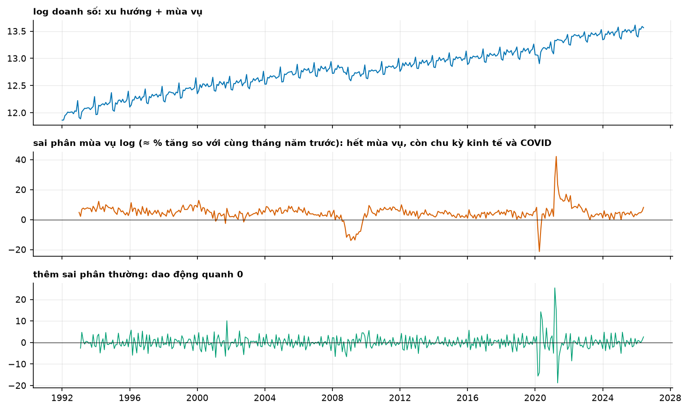
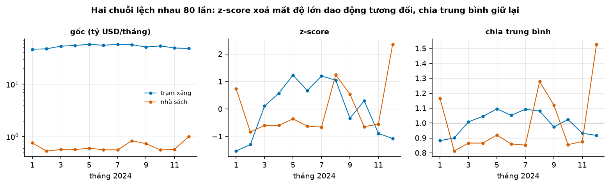

# Buổi 5 — Biến đổi và điều chỉnh dữ liệu

## 1. Mục tiêu

Sau buổi này bạn:

- Bỏ khỏi dữ liệu những biến động **đã biết nguyên nhân**: số ngày trong tháng, lạm phát, dân số — trước khi bắt mô hình tự học chúng.
- Tự viết **Box-Cox** và đổi ngược bằng NumPy, khớp `scipy.special.boxcox`; tự viết cách chọn λ của **Guerrero**, khớp `statsmodels`.
- Giải thích và **đo** vì sao đổi ngược log–exp cho **trung vị** chứ không phải trung bình, và hiệu chỉnh bias đẩy dự báo lên đúng bao nhiêu.
- Nói được khi nào hiệu chỉnh bias đáng làm, khi nào không (và khi nào nó làm tệ đi).
- Dùng **sai phân** và **chuẩn hoá theo chuỗi** đúng chỗ, hiểu cái giá của mỗi phép.

## 2. Nhắc lại buổi trước

- **Phân rã** tách chuỗi thành xu hướng + mùa vụ + phần dư. Hôm nay làm việc ở bước *trước* đó: bỏ bớt biến động có nguyên nhân đã biết để
  phần còn lại dễ mô hình hoá.
- **Mô hình cộng vs nhân**: biên độ mùa vụ tỷ lệ với mức thì lấy log biến nhân thành cộng — đó chính là một biến đổi Box-Cox với λ = 0.
- **Dữ liệu thiếu**: mốc không có số là NaN, không phải 0; ghi lại đã điền bao nhiêu và bằng cách nào.
- **Đánh giá trung thực**: mọi tham số (kể cả λ) phải ước lượng **chỉ từ dữ liệu trước gốc dự báo**, rồi mới chấm trên phần sau.
- **MAE** hướng tới trung vị, **RMSE** hướng tới trung bình — hôm nay điều này quyết định có hiệu chỉnh bias hay không.

## 3. Trạng thái đầu buổi

Sau `cd lab && python lab.py up`:

| Hạng mục | Trạng thái |
|---|---|
| Dữ liệu | `du-lieu/raw/census-marts-ban-le/mrtssales92-present.xlsx` — 35 sheet, 1992–6/2026, sha256 `2c58dce5119a`; `bls-cpi-u/cu.data.1.AllItems.tsv` (`47507ab13d93`); `bea-nipa-thang/NipaDataM.txt` (`dd14f325cc4b`) và `bea-nipa-danh-muc-chuoi/SeriesRegister.txt` |
| Nguồn | U.S. Census Bureau (MARTS, bản lưu Internet Archive 13/9/2026), U.S. BLS (CPI-U), U.S. BEA (NIPA) — public domain |
| Môi trường | Python 3.12; numpy 2.5.3, pandas 3.0.5, scipy 1.18.1, statsmodels 0.15.0, openpyxl 3.1.5 |
| `code/bien_doi.py` | `doc_ban_le`, `doc_cpi`, `doc_dan_so`, `theo_ngay`, `so_sanh_thang`, `gia_thuc`, `tang_truong*`, `boxcox`, `boxcox_nguoc`, `guerrero`, `du_bao_log`, `danh_gia_bias` |
| **Đang cố tình sai** | `so_sanh_thang` so tổng tháng **không chia số ngày**; `tang_truong_thuc_dau_nguoi` trả tăng trưởng danh nghĩa; `boxcox_nguoc` bỏ qua `sigma2` |
| **Triệu chứng** | "tháng 2/2023 giảm 3,4% so với tháng 1"; "bán lẻ tăng 316% từ 1993"; dự báo đổi ngược từ log luôn thấp hơn thực tế |
| `python lab.py check` lúc này | ĐỎ: 5/8 test hỏng |

## 4. Lý thuyết

### 4.1 Điều chỉnh lịch

**Trực giác.** Tháng 2 có 28 ngày, tháng 3 có 31: chênh 10,7% số ngày bán hàng. FPP: "there will be variation between the months simply
because of the different numbers of trading days in each month… computing average sales per trading day in each month".

$$
y^{\text{ngày}}_t = \frac{y_t}{\text{số ngày của tháng } t}
$$


**Đọc hình.** Trái (tổng tháng): tháng 2/2023 (595.432 triệu USD) thấp hơn tháng 1 (616.100) **3,4%** — trông như nhu cầu giảm. Phải (chia
số ngày): tháng 2 đạt 21.265 triệu/ngày so với 19.874 của tháng 1 — **cao hơn 7,0%**. Dấu của kết luận đảo ngược. Tháng 3 so tháng 2: thô
+14,2%, theo ngày chỉ +3,1%.

**Mức tinh hơn: ngày bán hàng.** Không phải ngày nào cũng bán như nhau. Đếm số ngày **không phải Chủ nhật** trong tháng:

```python
ngay_ban = pd.Series([sum(1 for d in pd.date_range(t, t + pd.offsets.MonthEnd(0)) if d.dayofweek != 6)
                      for t in y.index], index=y.index)
z = y / ngay_ban
```

| So sánh | thô | chia ngày lịch | chia ngày bán (trừ CN) |
|---|---|---|---|
| T2/2023 so T1/2023 | −3,35% | +7,00% | +4,70% (26 → 24 ngày bán) |
| T3/2023 so T2/2023 | +14,15% | +3,11% | +1,47% (24 → 27 ngày bán) |

Chuỗi ADJUSTED của Census đi xa hơn: đã khử "seasonal variations and holiday and trading-day differences" — cùng cặp T2→T3 cho **−1,05%**. Bốn con
số cho cùng một câu hỏi, khác nhau ở chỗ đã bỏ gì; nói rõ bạn dùng cái nào và bỏ gì.

### 4.2 Điều chỉnh dân số và lạm phát

FPP: "consider the data per person… It is possible for the total number of beds to increase, but the number of beds per thousand people to
decrease." Với giá: $x_t = \dfrac{y_t}{z_t} \, z_{\text{gốc}}$, $z$ là chỉ số giá (CPI).


**Đọc hình.** Chỉ số 1993 = 100. Đường xanh (danh nghĩa) lên 416 — "doanh số bán lẻ tăng hơn 4 lần". Đường cam (giá USD 2025, CPI 144,5 → 321,94)
chỉ còn 187. Đường xanh lá (thêm chia dân số 260,3 → 341,9 triệu người) còn **142**: tăng thật **+42,0%** trong 32 năm, khoảng 1,1%/năm. Cùng
một dữ liệu, ba câu chuyện — chọn sai là báo cáo sai.

Ba mức điều chỉnh là ba câu hỏi: tổng tiền (danh nghĩa), sức mua (giá thực), mức chi tiêu mỗi người (đầu người). Với dự báo doanh thu, thường
dự báo **giá thực** rồi nhân lại chỉ số giá dự báo.

### 4.3 Biến đổi Box-Cox

**Trực giác.** Khi biến động tỷ lệ với mức, lấy log biến "nhân" thành "cộng": $\log(2y) - \log(y) = \log 2$ dù $y$ lớn hay nhỏ. Box-Cox là họ
liên tục giữa "không làm gì" (λ = 1) và log (λ = 0):

$$
w_t = \begin{cases}\log y_t & \lambda = 0\\[2pt] \dfrac{\operatorname{sign}(y_t)\,\lvert y_t\rvert^{\lambda} - 1}{\lambda} & \lambda \ne 0\end{cases}
$$

FPP dùng dạng có `sign` (Bickel & Doksum 1981) để chịu được giá trị âm khi λ > 0. **Tự viết:**

```python
def boxcox(y, lam):
    y = np.asarray(y, float)
    return np.log(y) if lam == 0 else (np.sign(y) * np.abs(y) ** lam - 1) / lam
```

Khớp `scipy.special.boxcox` tới 1,7e−13 trên dữ liệu bán lẻ.

**Chọn λ — Guerrero (1993).** Chia chuỗi thành các khối dài đúng một chu kỳ mùa vụ (12 tháng), bỏ khối đầu không đủ; mỗi khối tính trung bình
$\mu_i$ và độ lệch chuẩn $s_i$; chọn λ làm **hệ số biến thiên** của $s_i/\mu_i^{1-\lambda}$ nhỏ nhất:

```python
khoi = y[y.size % m:].reshape(-1, m)
ty_so = khoi.std(axis=1, ddof=1) / khoi.mean(axis=1) ** (1 - lam)
cv = ty_so.std(ddof=1) / ty_so.mean()          # cực tiểu theo lam
```


**Đọc hình.** Trái: mỗi chấm là một năm; độ lệch chuẩn trong năm theo mức, cả hai trục log — độ dốc **0,655**, tức biến động tăng **chậm hơn**
mức (dốc 1 nghĩa là tỷ lệ thuận, hợp với log). Giữa: đường CV theo λ có đáy tại **0,343** (Guerrero); MLE của `scipy.stats.boxcox` cho **0,595** —
hai tiêu chí khác nhau, đừng trộn. Phải: độ lệch chuẩn trong năm chuẩn hoá về 1992; dữ liệu gốc (xám) phình ra 2,45 lần tới 2019, λ = 0,343 còn
1,21, còn log (xanh) kéo xuống 0,84 — **quá tay** theo chiều ngược lại.

**Yeo-Johnson** cho dữ liệu có 0 hoặc âm: `scipy.stats.boxcox` báo `ValueError: Data must be positive.`, còn `yeojohnson` chạy được (trên chuỗi
tăng trưởng so cùng kỳ, có 25 tháng âm, λ = 1,091 — gần như không biến đổi).

### 4.4 Đổi ngược: trung vị hay trung bình?

**Trực giác.** Dự báo trên thang log rồi `exp` không trả lại trung bình. Với $w \sim N(\mu, \sigma^2)$:

$$
\mathbb{E}[e^{w}] = e^{\mu + \sigma^2/2} > e^{\mu} = \text{trung vị của } e^{w}
$$

FPP: "the back-transformed point forecast will not be the mean of the forecast distribution. In fact, it will usually be the median… medians do
not add up, whereas means do." Công thức hiệu chỉnh (FPP 5.3), xấp xỉ Taylor bậc hai:

$$
\hat y = \begin{cases} e^{\hat w}\left[1 + \dfrac{\sigma_h^2}{2}\right] & \lambda = 0\\[6pt]
(\lambda \hat w + 1)^{1/\lambda}\left[1 + \dfrac{\sigma_h^2 (1-\lambda)}{2(\lambda \hat w + 1)^2}\right] & \lambda \ne 0\end{cases}
$$


**Đọc hình.** 100.000 mẫu log-normal (μ = 5, σ = 0,5, seed 42): trung bình mẫu 168,0 (vạch đen), exp(trung bình log) 148,1 (cam) — thấp hơn
**11,9%**; hiệu chỉnh FPP 166,7 (xanh) — còn hụt 0,75%. Sai lệch của trung vị so với trung bình đúng bằng $1 - e^{-\sigma^2/2}$:

| σ | trung vị thấp hơn trung bình | sai số còn lại của công thức FPP |
|---|---|---|
| 0,1 | −0,50% | −0,00% |
| 0,3 | −4,40% | −0,10% |
| 0,5 | −11,75% | −0,72% |
| 1,0 | −39,35% | −9,02% |

Với σ lớn, xấp xỉ Taylor cũng hụt — khi đó dùng công thức chính xác $e^{\hat w + \sigma^2/2}$ (chỉ đúng cho λ = 0) hoặc lấy trung bình của mẫu
mô phỏng.

### 4.5 Đo trên dữ liệu thật — và khi nào không nên hiệu chỉnh

Mô hình: **seasonal naive có drift trên thang log**, $\hat w_{T+h} = w_{T+h-12} + \bar d$, với $\bar d$ và $\sigma^2$ ước lượng từ sai phân mùa vụ
của 96 tháng trước gốc. Gốc mỗi tháng từ 1/2012 tới 12/2018 (trước COVID), tầm 12 → 1.008 dự báo.


**Đọc hình.** Cột cam là đổi ngược thẳng, cột xanh là có hiệu chỉnh; trục đứng là tổng dự báo so với tổng thực tế.

| Chuỗi | σ | trung vị | có hiệu chỉnh | σ²/2 |
|---|---|---|---|---|
| Tổng bán lẻ + ăn uống | 0,047 | −0,47% | −0,37% | 0,11% |
| Trạm xăng | 0,159 | +3,50% | +4,85% | 1,27% |
| Bách hoá | 0,073 | +9,69% | +9,93% | 0,26% |
| Quà tặng, lưu niệm | 0,077 | −2,05% | −1,77% | 0,29% |

**Ba kết luận.** (1) Hiệu chỉnh đẩy dự báo lên **đúng** σ²/2 — lý thuyết khớp số đo. (2) Trên dữ liệu tháng của bán lẻ, σ nhỏ nên hiệu chỉnh chỉ
0,1–1,3%, **nhỏ hơn nhiều** sai lệch do xu hướng (bách hoá suy giảm: dự báo cao hơn thực tế gần 10%). (3) Khi dự báo đang **cao hơn** thực tế
(trạm xăng), hiệu chỉnh làm tệ thêm — nó sửa một loại lệch (biến đổi), không sửa loại kia (mô hình sai).

Proietti & Lütkepohl (2013) trên 100+ chuỗi M3: "the naïve predictor that just reverses the transformation leads to a lower mean square error
than the optimal predictor at short forecast leads". Và nếu chỉ số đánh giá là **MAE** thì mục tiêu vốn là trung vị — không hiệu chỉnh mới đúng
(FPP §5.8). Quy tắc dùng được: hiệu chỉnh khi bạn cần **trung bình** (cộng dồn nhiều chuỗi, tính doanh thu kỳ vọng, chấm bằng RMSE) và σ đủ lớn.

### 4.6 Sai phân

**Sai phân thường** $\Delta y_t = y_t - y_{t-1}$ bỏ xu hướng; **sai phân mùa vụ** $\Delta_m y_t = y_t - y_{t-m}$ bỏ mùa vụ. Trên thang log, sai phân
mùa vụ ≈ phần trăm thay đổi so với cùng kỳ năm trước.



**Đọc hình.** Hàng 1: log doanh số — xu hướng cộng mùa vụ. Hàng 2: sai phân mùa vụ (×100) — mùa vụ biến mất, còn lại chu kỳ kinh tế: đáy 2009
−14,0%, tháng 4/2020 −21,3%, tháng 4/2021 +42,1% (so với đáy COVID), trung bình 2012–2019 +3,71%. Hàng 3: sai phân thêm lần nữa — dao động quanh 0
nhưng nhiễu hơn hẳn. Sai phân là thuốc mạnh: mỗi lần dùng đều làm nhiễu to lên và mất một phần thông tin về mức. Buổi 7 đo việc này bằng kiểm định.

### 4.7 Chuẩn hoá theo từng chuỗi

Khi gộp nhiều chuỗi khác thang (trạm xăng 52.626 triệu USD/tháng, nhà sách 655 triệu — gấp 80 lần), mô hình học chung sẽ bị chuỗi lớn lấn át. Ba
cách thường dùng: z-score $(y - \bar y)/s$; min–max; **chia trung bình** $y/\bar y$.



**Đọc hình.** Trái (thang log): hai chuỗi 2024 cách nhau gần hai bậc. Giữa (z-score): cả hai nằm chung dải ±2,4 — nhưng z-score chia cho độ lệch
chuẩn **của chính chuỗi đó**, nên biên độ tương đối bị xoá: trạm xăng dao động 0,88–1,10 lần trung bình, nhà sách 0,81–1,53 lần, mà trên hình
z-score trông như nhau. Phải (chia trung bình): giữ nguyên tỷ lệ — đỉnh tháng 12 của nhà sách 1,53 nổi hẳn so với 1,10 của trạm xăng. Chia trung bình giữ được ý nghĩa tỷ lệ: tháng 12 của nhà sách
là 1,527 lần trung bình năm, còn trạm xăng cao nhất chỉ 1,095 — hai hình dạng mùa vụ so sánh được ngay. Quan trọng: hằng số chuẩn hoá phải tính
**chỉ trên dữ liệu huấn luyện** và lưu lại để đổi ngược.

### 4.8 Gói biến đổi thành một cặp thuận – nghịch

Mọi biến đổi đều phải **đổi ngược được**, và tham số của nó (λ, trung bình, độ lệch chuẩn, năm gốc CPI) là **tham số của mô hình**: ước lượng trên
tập huấn luyện, lưu lại, dùng nguyên vẹn khi đổi ngược. Viết thành một cặp hàm ngay từ đầu để không bao giờ đổi ngược bằng tham số tính trên tập
kiểm tra:

```python
def hoc_bien_doi(train, m):                     # CHỈ dữ liệu trước gốc dự báo
    lam = guerrero(train, m)
    w = boxcox(train, lam)
    return {"lam": lam, "tb": float(np.mean(w)), "sd": float(np.std(w, ddof=1))}

def thuan(y, ts):   return (boxcox(y, ts["lam"]) - ts["tb"]) / ts["sd"]
def nghich(z, ts, sigma2=0.0):
    return boxcox_nguoc(z * ts["sd"] + ts["tb"], ts["lam"], sigma2 * ts["sd"] ** 2)
```

Ba điểm dễ sai: (1) `sigma2` phải tính trên **thang đã biến đổi** — nếu bạn còn chuẩn hoá thì nhân lại phương sai như trên; (2) chuỗi đã điều chỉnh
lạm phát thì dự báo ra **giá thực**, muốn số danh nghĩa phải nhân lại chỉ số giá *dự báo* (và chỉ số giá tương lai thì chưa biết — buổi 8 gọi đây là
biến không biết trước); (3) nếu chia số ngày thì dự báo là "mỗi ngày" — nhân lại số ngày của tháng cần dự báo, con số này biết trước nên an toàn.

## 5. Lab từng bước

### Bước 1 — Chạy code đầu buổi

```bash
cd lab && python lab.py up
python lab.py chay ../code/bien_doi.py
python lab.py check                 # 5/8 đỏ
```

### Bước 2 — Điều chỉnh lịch

Sửa `so_sanh_thang` để chia số ngày (`y.index.days_in_month`). Kiểm: T2→T3/2023 = +3,11%. So thêm với chuỗi ADJUSTED (`da_dieu_chinh=True`) và
giải thích ba con số khác nhau.

### Bước 3 — Giá thực và đầu người

Sửa `tang_truong_thuc_dau_nguoi`: chia CPI, nhân CPI năm gốc, chia dân số. Kiểm: 1993 → 2025 ra **+0,42**. Lưu ý CPI tháng 10/2025 là NaN.

### Bước 4 — Box-Cox và Guerrero

Viết `guerrero` theo mục 4.3; đối chiếu `statsmodels.base.transform.BoxCox().transform_boxcox(y, method="guerrero", window_length=12)` (lệch
< 0,005). So với `scipy.stats.boxcox` (MLE).

```python
from statsmodels.base.transform import BoxCox
from scipy import stats

yt = doc_ban_le()[:"2019-12"].to_numpy()
print("tự viết       :", round(guerrero(yt, 12), 4))
print("statsmodels   :", round(BoxCox().transform_boxcox(yt, method="guerrero", window_length=12)[1], 4))
print("statsmodels mặc định (window_length=4):", round(BoxCox().transform_boxcox(yt, method="guerrero")[1], 4))
print("scipy MLE     :", round(stats.boxcox(yt)[1], 4))
```

```text
tự viết       : 0.343
statsmodels   : 0.3429
statsmodels mặc định (window_length=4): 0.2462
scipy MLE     : 0.5947
```

Ba con số λ khác nhau đều "đúng" theo tiêu chí của chúng: Guerrero với chu kỳ 12, Guerrero với cửa sổ mặc định 4, và hợp lý cực đại. Ghi rõ bạn
dùng cái nào.

### Bước 5 — Hiệu chỉnh bias

Thêm tham số `sigma2` vào `boxcox_nguoc` theo công thức FPP 5.3. Chạy `danh_gia_bias` cho 4 chuỗi ở mục 4.5; kiểm hiệu chỉnh đúng bằng σ²/2 và viết
hai câu: khi nào nên bật, khi nào không.

```text
            trung_vi  trung_binh  sigma2      # gốc 1/2018, tầm 12
2018-01-01  433240.0    433329.7  0.00041
2018-02-01  428827.7    428916.6  0.00041
2018-03-01  494878.0    494980.5  0.00041
```

Ở gốc này σ² = 0,00041 → hiệu chỉnh chỉ **+0,021%**. Trên toàn bộ 1.008 dự báo: `{'trung_vi': -0.47, 'trung_binh': -0.37}` (%).

```bash
python lab.py check                 # 8/8 xanh
```

## 6. Lỗi thường gặp & cách chẩn đoán

| Triệu chứng | Nguyên nhân | Chẩn đoán | Sửa |
|---|---|---|---|
| "Tháng 2 sụt mạnh" mỗi năm | chưa chia số ngày | so tổng tháng với tổng/ngày | `theo_ngay` |
| "Doanh số tăng 4 lần từ 1993" | chưa trừ lạm phát, chưa chia dân số | vẽ ba đường chỉ số | `gia_thuc`, chia dân số |
| Dùng chuỗi ADJUSTED rồi lại chia số ngày | trừ ngày giao dịch hai lần | đọc chú thích nguồn | chọn một |
| `ValueError: Data must be positive.` | Box-Cox/log gặp 0 hoặc âm | `y.min()` | Yeo-Johnson, hoặc cộng hằng số và ghi rõ |
| λ khác nhau giữa hai thư viện | Guerrero vs MLE, cửa sổ khác nhau | in phương pháp và tham số | chọn một, ghi lại |
| `statsmodels` Guerrero ra λ lạ | `window_length` mặc định là **4**, không phải chu kỳ | đọc chữ ký hàm | truyền `window_length=m` |
| Dự báo tổng các chuỗi con thấp hơn tổng thực | cộng các trung vị đã đổi ngược | so tổng dự báo / tổng thực | hiệu chỉnh bias, hoặc dự báo trực tiếp tổng |
| Hiệu chỉnh bias làm sai số **tăng** | mô hình đang dự báo cao, hoặc chấm bằng MAE | tách lệch do biến đổi (σ²/2) và lệch do mô hình | bỏ hiệu chỉnh khi mục tiêu là trung vị |
| λ ước lượng trên toàn bộ dữ liệu | rò rỉ tương lai | λ có dùng dữ liệu sau gốc không? | ước lượng λ trong từng fold |
| CPI có tháng NaN | BLS không công bố (10/2025) | `cpi.isna()` | nội suy ≤ 1 tháng, ghi rõ |
| Đọc `.xlsx` ra toàn NaN | nhãn cột tháng 5 là "May 2025" (không có dấu chấm); ô "(S)"/"(NA)" | in `dong[4]` | regex `\.?`, `pd.to_numeric(errors="coerce")` |
| So dữ liệu trước/sau 4/2025 | Census đổi định nghĩa (bỏ nonemployers) | đọc chú thích sheet | nêu gãy chuỗi khi báo cáo |

## 7. Bài tập về nhà

1. **Ngành khác.** Chọn ba ngành trong MARTS. Tính λ Guerrero và σ của sai phân mùa vụ log. Ngành nào hiệu chỉnh bias đáng kể (> 1%)? Vì sao?
2. **Ngày giao dịch.** Tự đếm số ngày **không phải Chủ nhật** trong mỗi tháng, chia doanh số cho số đó, so với cách chia số ngày lịch. Kết luận
   tháng 2/2023 có đổi không?
3. **Chuẩn hoá.** Lấy 5 ngành, chuẩn hoá bằng z-score và bằng chia trung bình (tham số chỉ từ 2012–2019). Vẽ hình dạng mùa vụ; cách nào cho hình
   so sánh được và vì sao.

## 8. Tiêu chí "Xong khi"

- [ ] `python lab.py check` xanh 8/8.
- [ ] Nói được ba con số cho cùng câu hỏi "tháng 3 so tháng 2 tăng bao nhiêu" và mỗi con số trả lời câu hỏi nào.
- [ ] Đo được trên tập kiểm tra: đổi ngược thẳng so với có hiệu chỉnh chênh nhau bao nhiêu, và đối chiếu với σ²/2.
- [ ] Nêu một trường hợp **không** nên hiệu chỉnh bias, kèm lý do bằng số.
- [ ] Tự viết Box-Cox và Guerrero khớp thư viện trong sai số cho phép.

## 9. Đọc thêm

- Hyndman, R.J., Athanasopoulos, G. et al. *Forecasting: Principles and Practice, the Pythonic Way* — §3.1 (biến đổi và điều chỉnh), §5.6 (đổi
  ngược, hiệu chỉnh bias): https://otexts.com/fpppy/
- Hyndman, R.J. — *Back-transforming*: https://robjhyndman.com/hyndsight/backtransforming/
- Guerrero, V.M. (1993). Time-series analysis supported by power transformations. *Journal of Forecasting* 12(1), 37–48.
- Box, G.E.P. & Cox, D.R. (1964). An analysis of transformations. *JRSS B* 26(2), 211–252.
- Bickel, P.J. & Doksum, K.A. (1981). An analysis of transformations revisited. *JASA* 76(374), 296–311.
- Proietti, T. & Lütkepohl, H. (2013). Does the Box–Cox transformation help in forecasting macroeconomic time series? *IJF* 29(1), 88–99.
- scipy — `stats.boxcox`, `stats.yeojohnson`, `special.inv_boxcox`; statsmodels — `base.transform.BoxCox`; scikit-learn — `PowerTransformer`.
- U.S. Census Bureau — Monthly Retail Trade Survey; U.S. BLS — CPI; U.S. BEA — NIPA.
