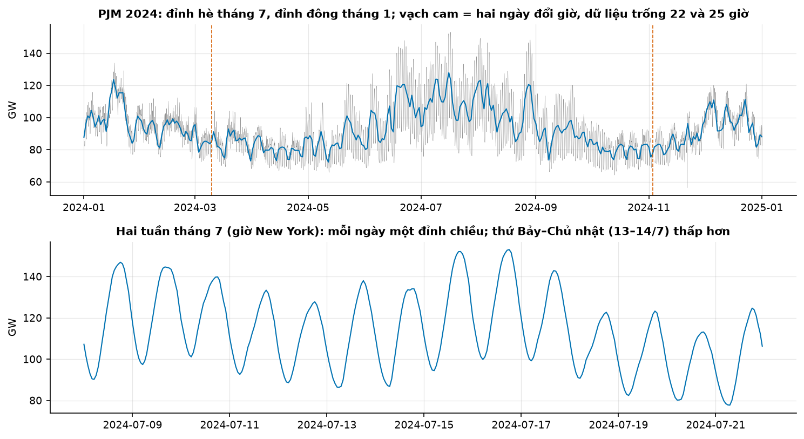
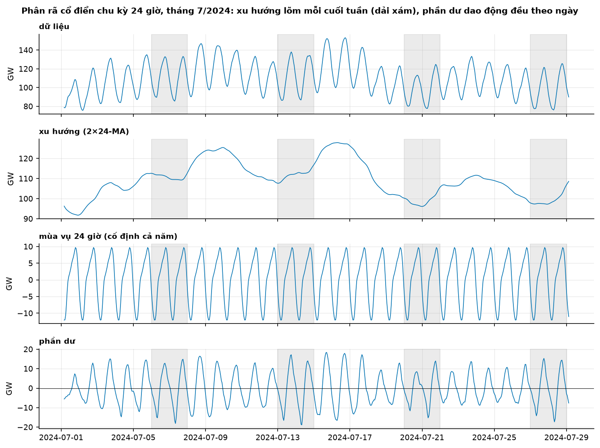
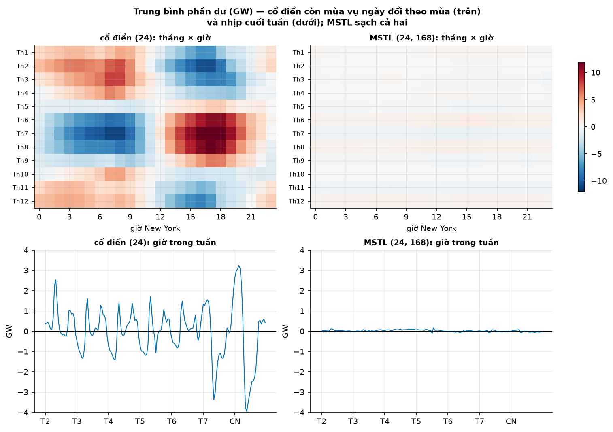
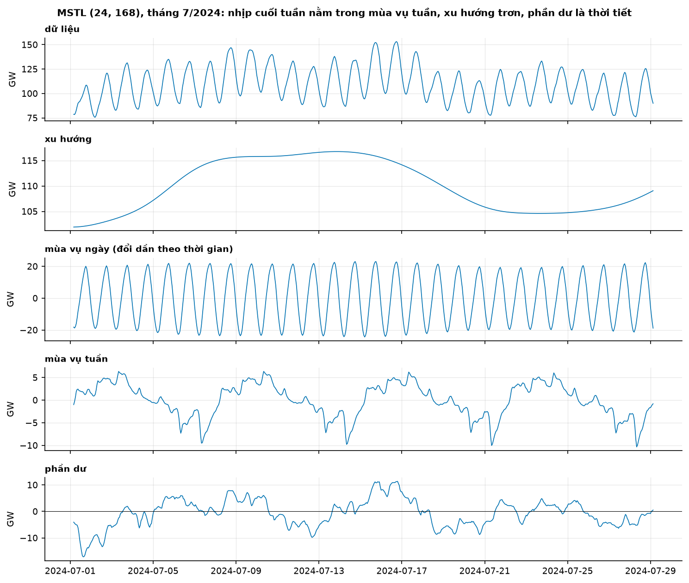
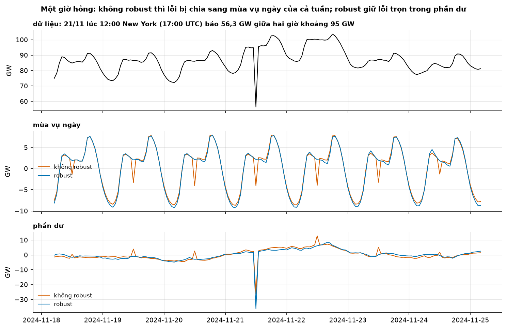
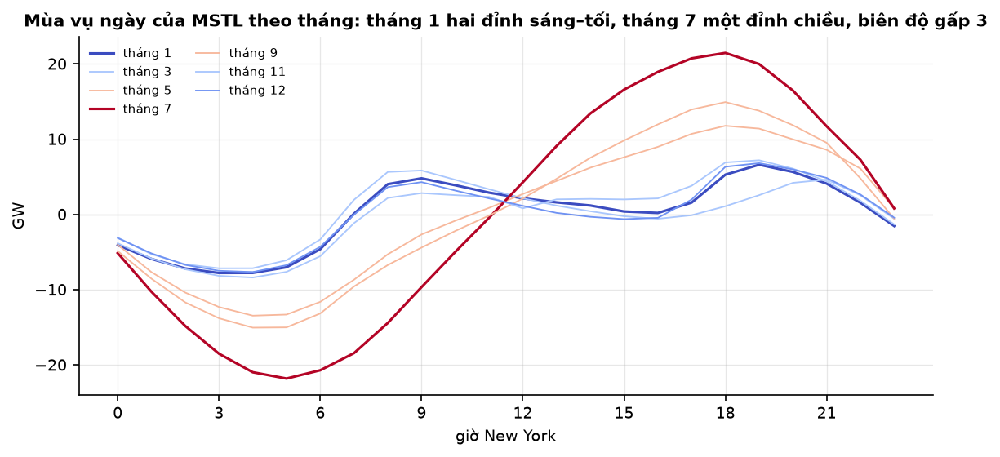

# Buổi 6 — Phân rã chuỗi thời gian

## 1. Mục tiêu

Sau buổi này bạn:

- Tự viết **2×m-MA** và **phân rã cổ điển** bằng NumPy, khớp từng số với `statsmodels`.
- Chỉ ra bằng hình và số **mùa vụ chưa tách hết trốn ở đâu**: trong xu hướng, trong phần dư, hay bị ép cố định cả năm.
- Phân rã một chuỗi có **hai mùa vụ** (ngày + tuần) bằng MSTL; kiểm phần dư sạch mẫu hình mùa vụ bằng số, không bằng cảm giác.
- Tính và diễn giải **độ mạnh xu hướng $F_T$** và **độ mạnh mùa vụ $F_S$** cho từng mùa vụ.
- Biết khi nào bật **robust**, và vì sao robust cứu được một giờ số liệu hỏng nhưng không "tách" được một đợt nắng nóng.

## 2. Nhắc lại buổi trước

- **Mùa vụ** có chu kỳ cố định theo lịch; một chuỗi có thể có nhiều mùa vụ (ngày, tuần, năm). **Xu hướng** là thay đổi dài hạn của mức.
  **Chu kỳ** lên xuống không cố định tần suất.
- **Heatmap giờ × thứ**: ô $(d, h)$ là trung bình các giờ có thứ $d$, giờ $h$ — cách nhanh nhất thấy mùa vụ kép.
- **ACF** $r_k$: tương quan giữa $y_t$ và $y_{t-k}$; đỉnh ở bội số của chu kỳ mùa vụ là dấu hiệu mùa vụ.
- **Lưới thời gian đều**: giờ thiếu là NaN, không phải 0; dữ liệu sự kiện ghi theo giờ địa phương có lỗ và giờ lặp vào ngày đổi giờ (DST)
  — làm việc trên UTC, chỉ đổi sang giờ địa phương khi đọc hình.
- **Trục y, tiêu đề**: tiêu đề nói kết luận; số đếm/tổng vẽ từ 0.

## 3. Trạng thái đầu buổi

Sau `cd lab && python lab.py up`:

| Hạng mục | Trạng thái |
|---|---|
| Dữ liệu | `du-lieu/raw/eia930-balance-2024-h1/EIA930_BALANCE_2024_Jan_Jun.csv` (41,7 MB, sha256 `26768c495c3b`) và `…-h2/EIA930_BALANCE_2024_Jul_Dec.csv` (47,9 MB, `a602a8e577cf`) — mọi vùng điều độ của Mỹ theo giờ |
| Chuỗi của buổi | PJM, cột `Demand (MW)` gốc: 8.784 giờ UTC, 01/01/2024 06:00 → 01/01/2025 05:00 (mốc **cuối** giờ), 47 giờ NaN |
| Nguồn | U.S. Energy Information Administration, Form EIA-930, public domain (`NGUON.txt`) |
| Môi trường | Python 3.12; numpy 2.5.3, pandas 3.0.5, matplotlib 3.11.2, statsmodels 0.15.0 |
| `code/phan_ra.py` | `doc_nhu_cau`, `lap_cho_trong`, `phan_ra`, `do_manh`, `ho_so_phan_du`, `ty_le_mau_hinh_con_lai` |
| **Đang cố tình sai** | `phan_ra` dùng phân rã **cổ điển chu kỳ 24** cho chuỗi có mùa vụ tuần; tham số `robust` bị bỏ qua |
| **Triệu chứng** | $F_S$ = 0,618 cho chuỗi điện rõ ràng rất mùa vụ; không có thành phần tuần; phần dư còn **10%** phương sai ở hồ sơ tháng × giờ; 24 giờ đầu/cuối NaN |
| `python lab.py check` lúc này | ĐỎ: 5/7 test hỏng |

## 4. Lý thuyết

### 4.1 Cộng hay nhân

**Trực giác.** Mô hình cộng $y_t = T_t + S_t + R_t$: dao động mùa vụ có biên độ **không đổi** khi mức đổi. Mô hình nhân
$y_t = T_t \times S_t \times R_t$: dao động tỷ lệ với mức. FPP: cộng "is the most appropriate if the magnitude of the seasonal
fluctuations … does not vary with the level of the time series"; lấy log thì nhân thành cộng: $\log y_t = \log T_t + \log S_t + \log R_t$.



**Đọc hình.** Hàng trên: đường xanh (trung bình ngày) có đỉnh hè tháng 7 và đỉnh đông tháng 1; dải xám (từng giờ) **dày hơn hẳn vào
mùa hè** — biên độ ngày đổi theo mùa. Vạch cam là hai ngày đổi giờ: dữ liệu trống 22 giờ (10–11/3) và 25 giờ (3–4/11). Gai cắm xuống
cuối tháng 11 là 21/11/2024 17:00 UTC: 56.260 MW giữa hai giờ 94.812 và 95.482 — một giờ số liệu hỏng (mục 4.6). Hàng dưới: hai tuần
tháng 7 theo giờ New York, mỗi ngày một đỉnh chiều; thứ Bảy–Chủ nhật 13–14/7 thấp hơn.

Biên độ đổi theo mùa ở đây do **điều hoà nhiệt độ**, không phải do mức: đó là mùa vụ **biến thiên theo thời gian**, không phải lý do để dùng
mô hình nhân. Buổi này dùng mô hình cộng và để mùa vụ thay đổi dần (STL/MSTL).

### 4.2 Trung bình trượt 2×m-MA

**Trực giác.** Muốn lấy xu hướng, trung bình đúng một chu kỳ để mùa vụ tự triệt tiêu. Với $m = 24$ chẵn, cửa sổ 24 giờ không có tâm, nên
lấy trung bình trượt 2 của trung bình trượt 24 — FPP gọi là "centred moving average", "symmetric".

**Công thức.**

$$
\hat T_t = \frac{1}{48} y_{t-12} + \frac{1}{24} \sum_{j=-11}^{11} y_{t+j} + \frac{1}{48} y_{t+12}
$$

25 trọng số, hai đầu mỗi bên 1/48 vì giờ $t-12$ và $t+12$ là **cùng một giờ trong ngày** — mỗi giờ trong ngày được đúng trọng số 1/24.

**Tự viết bằng NumPy** — cả phân rã cổ điển:

```python
m = 24
w = np.r_[0.5, np.ones(m - 1), 0.5] / m               # 25 trọng số, tổng = 1
T = np.full(x.size, np.nan)
T[m // 2 : -m // 2] = np.convolve(x, w, mode="valid")  # mất 12 giờ mỗi đầu
lech = x - T
pha = np.arange(x.size) % m
S_mua = np.array([np.nanmean(lech[pha == k]) for k in range(m)])
S_mua -= S_mua.mean()                                  # tổng mùa vụ = 0
S = S_mua[pha]
R = x - T - S
```

**Thư viện.** `statsmodels.tsa.seasonal.seasonal_decompose(y, period=24)`. Trên PJM 2024, sai khác lớn nhất giữa bản tự viết và thư viện ở
cả xu hướng lẫn mùa vụ là **0,0**. Docstring của statsmodels tự nhận: "This is a naive decomposition. More sophisticated methods should be
preferred."

### 4.3 Phân rã cổ điển chu kỳ 24 hỏng ở đâu

FPP liệt kê bốn điểm yếu: mất xu hướng ở "the first few and last few observations"; xu hướng "over-smooth rapid rises and falls"; mùa vụ bị
giả định "repeats from year to year" — ví dụ chính là điện khi điều hoà phổ biến; và "not robust to these kinds of unusual values".



**Đọc hình.** Dải xám là thứ Bảy–Chủ nhật. **Xu hướng** (hàng 2) lõm xuống ở mọi dải xám: trung bình 24 giờ bám theo mức thấp hơn của ngày
nghỉ. **Mùa vụ** (hàng 3) là một khuôn 24 giờ lặp y hệt — cùng khuôn cho tháng 1 và tháng 7. **Phần dư** (hàng 4) dao động đều đặn biên độ
±15 GW mỗi ngày: đó là phần mùa vụ ngày của tháng 7 mà khuôn cố định cả năm không chứa được.

Nhịp tuần đi đâu? Trung bình xu hướng theo thứ (giờ New York): T2 93.327, T3 94.611, **T4 95.036**, T5 94.917, T6 93.654, **T7 89.523, CN
88.459** MW. Phần lớn nhịp tuần nằm trong **xu hướng**, không phải trong phần dư.

Đo bằng số: nhóm phần dư theo lịch, lấy trung bình mỗi nhóm, rồi so phương sai của các trung bình đó với phương sai của chuỗi:

$$
\text{tỷ lệ mẫu hình} = \frac{\operatorname{Var}_g\big(\bar R_g\big)}{\operatorname{Var}(y)}, \qquad g = (\text{tháng}, \text{giờ}) \text{ hoặc } (\text{thứ}, \text{giờ})
$$

Gần 0 nghĩa là phần dư không còn mẫu hình theo nhóm lịch đó.



**Đọc hình.** Ô trên trái (cổ điển): tháng 6–8 **đỏ đậm** từ 13h tới 21h và xanh đậm lúc rạng sáng — mùa hè cao điểm chiều cao hơn khuôn
chung; tháng 1–2 đỏ ở 6–9h — đỉnh sáng mùa đông. Tháng 7 lúc 17h phần dư trung bình **+13.037 MW**. Tỷ lệ mẫu hình tháng×giờ **0,102**.
Ô dưới trái: phần dư theo giờ trong tuần còn nhịp — thứ Bảy 8h trung bình −3.379 MW; tỷ lệ thứ×giờ 0,0067. Hai ô phải (MSTL): gần như
trắng, tỷ lệ 0,00062 và 0,00001; tháng 7 lúc 17h còn −668 MW.

### 4.4 STL và MSTL

**STL** (Cleveland et al., 1990) thay trung bình trượt bằng **LOESS** — hồi quy cục bộ có trọng số — và lặp hai vòng: vòng trong cập nhật
mùa vụ rồi xu hướng; vòng ngoài tính **trọng số robust** để giảm ảnh hưởng của điểm bất thường. FPP tóm ưu điểm: xử lý "any type of
seasonality", mùa vụ "allowed to change over time, and the rate of change can be controlled by the user", và có thể robust. Nhược: "does
not handle trading day or calendar variation automatically", chỉ có phân rã cộng.

Hai tham số chính (số lẻ): `seasonal` — cửa sổ làm trơn mỗi chuỗi con mùa vụ (Cleveland: ít nhất 7; nhỏ → mùa vụ đổi nhanh); `trend` —
cửa sổ xu hướng, mặc định trong statsmodels là số lẻ nhỏ nhất lớn hơn $1{,}5\,m / (1 - 1{,}5/\text{seasonal})$, tức **47** giờ với $m = 24$.
Cleveland cảnh báo "we do not want the trend and seasonal components to compete for variation in the data": `STL(period=24)` mặc định trên
PJM cho phần dư chỉ **2,8 GW²** — nhỏ không phải vì tốt, mà vì xu hướng 47 giờ đủ mềm để nuốt cả nhịp tuần lẫn thời tiết.

**MSTL** (Bandara, Hyndman & Bergmeir) xử lý nhiều chu kỳ: sắp chu kỳ tăng dần, rồi lặp STL cho từng chu kỳ — ý tưởng Cleveland đã gợi ý:
"proceeding from the shortest-period component to the longest-period component". statsmodels đặt cửa sổ mùa vụ mặc định $7 + 4i$ → (11, 15)
cho (24, 168), lặp 2 lần.

```python
from statsmodels.tsa.seasonal import MSTL
kq = MSTL(y, periods=(24, 168)).fit()        # kq.trend, kq.seasonal["seasonal_24"], ["seasonal_168"], kq.resid
```



**Đọc hình.** Mùa vụ tuần (hàng 4) mang nhịp cuối tuần; xu hướng (hàng 2) trơn, không còn lõm theo thứ Bảy; mùa vụ ngày (hàng 3) cao dần
tới giữa tháng khi trời nóng. Phần dư (hàng 5) là những đợt kéo dài vài ngày — thời tiết, thứ phân rã không thể biết. Phương sai phần dư
16,5 GW² so với 32,4 của cổ điển.

**Lưu ý thực hành.** STL/MSTL của statsmodels trả **toàn NaN, không lỗi, không cảnh báo** nếu đầu vào còn một NaN. `seasonal_decompose` thì báo
`ValueError: This function does not handle missing values`. Buổi này nội suy 47 giờ trống (`lap_cho_trong`) trước khi phân rã.

### 4.5 Độ mạnh xu hướng và mùa vụ

**Trực giác.** Nếu phần dư nhỏ so với "xu hướng + phần dư" thì xu hướng mạnh. FPP §4.3:

$$
F_T = \max\left(0,\ 1 - \frac{\operatorname{Var}(R_t)}{\operatorname{Var}(T_t + R_t)}\right), \qquad
F_S = \max\left(0,\ 1 - \frac{\operatorname{Var}(R_t)}{\operatorname{Var}(S_t + R_t)}\right)
$$

Với nhiều mùa vụ, gói feasts (tác giả FPP) tính $F_S$ **cho từng** thành phần với cùng phần dư. Tự viết:

```python
r = bang["resid"]
F_T = max(0.0, 1 - r.var() / (bang["trend"] + r).var())
F_S_168 = max(0.0, 1 - r.var() / (bang["seasonal_168"] + r).var())
```

| PJM 2024 | $F_T$ | $F_{S,24}$ | $F_{S,168}$ |
|---|---|---|---|
| cổ điển chu kỳ 24 | 0,828 | 0,618 | — |
| MSTL (24, 168) | **0,888** | **0,829** | **0,415** |
| MSTL robust | 0,817 | 0,739 | 0,252 |

**Đọc bảng.** Cùng một chuỗi, $F_S$ ngày nhảy từ 0,618 lên 0,829 chỉ vì đổi phương pháp — con số độ mạnh **phụ thuộc phân rã**, không phải
thuộc tính tuyệt đối của dữ liệu. Mùa vụ tuần có thật nhưng yếu hơn mùa vụ ngày (0,415). Bản robust cho $F$ thấp hơn vì phần dư robust giữ
trọn các điểm bất thường nên phương sai lớn hơn — không có nghĩa là phân rã kém hơn.

### 4.6 Robust: một giờ hỏng và một đợt nắng nóng

Trọng số robust của STL: $h = 6 \operatorname{median}(\lvert R_v \rvert)$, $\rho_v = B(\lvert R_v \rvert / h)$ với $B(u) = (1 - u^2)^2$ khi
$0 \le u < 1$, bằng 0 khi $u \ge 1$. Điểm có phần dư lớn bị giảm trọng số ở vòng sau. FPP: robust thì điểm bất thường "will not affect the
estimates of the trend-cycle and seasonal components. They will, however, affect the remainder component."



**Đọc hình.** Hàng giữa: đường cam (không robust) có một vết lõm lúc 12h trưa **mỗi ngày** trong tuần — lỗi của một giờ bị chia vào khuôn
mùa vụ ngày của các ngày lân cận. Lúc 17:00 UTC ngày 20/11, mùa vụ ngày là −4.051 MW (không robust) so với +2.117 (robust): lệch khoảng
6.200 MW ở một ngày **không hề có lỗi**. Hàng dưới: phần dư tại giờ hỏng −26.322 (không robust) so với **−36.323** (robust) — robust giữ gần
trọn cú rơi khoảng 38.900 MW (so với trung bình hai giờ kề 95.147) ở đúng chỗ.

**Phản ví dụ.** Đợt nóng 15–17/7/2024 không phải một điểm nhọn mà một khối vài ngày. STL hè chu kỳ 24: phần dư lớn nhất trong đợt nóng 3.159 MW
(không robust) và 7.838 MW (robust) với xu hướng mặc định; tăng lên 16.266 / 18.467 MW khi cửa sổ xu hướng 337 giờ. Sự kiện kéo dài bị
**xu hướng hấp thụ**; robust giúp với điểm nhọn, không giúp với sự kiện dài — muốn thấy đợt nóng thì cần biến nhiệt độ (buổi 8).

### 4.7 Mùa vụ biến thiên theo thời gian



**Đọc hình.** Lấy thành phần `seasonal_24` của MSTL, trung bình theo tháng và giờ New York. Tháng 1 (xanh đậm): bướu sáng quanh 8–9h và đỉnh
tối 19h, biên độ **14,4 GW**. Tháng 7 (đỏ đậm): một đỉnh 18h, đáy 4–5h sáng, biên độ **43,3 GW** — gấp 3. Tháng 3 (13,0) và tháng 11 (15,6)
nằm giữa. Phân rã cổ điển ép 12 đường này thành một.

### 4.8 X-13ARIMA-SEATS và dữ liệu khử mùa vụ

Cơ quan thống kê dùng biến thể X-11 hoặc SEATS; FPP: chúng "designed specifically to work with quarterly and monthly data", X-11 "handles
trading day variation, holiday effects". statsmodels có `x13_arima_analysis` nhưng cần chương trình `x13as` riêng (báo `X13NotFoundError` nếu
thiếu) — không dùng cho dữ liệu giờ.

**Chuỗi đã khử mùa vụ** $y_t - S_t$ vẫn chứa phần dư. FPP: "they are not “smooth”, and “downturns” or “upturns” can be misleading". Muốn tìm
điểm đổi chiều thì đọc **xu hướng**, không đọc chuỗi khử mùa vụ. Phần dư là nơi tìm ngoại lai và điểm gãy — việc của buổi 11.

## 5. Lab từng bước

### Bước 1 — Chạy code đầu buổi

```bash
cd lab && python lab.py up
python lab.py chay ../code/phan_ra.py
python lab.py check                    # 5/7 đỏ
```

```text
8784 giờ, NaN 47, 2024-01-01 06:00:00 → 2025-01-01 05:00:00
{'F_T': 0.828, 'F_S_24': 0.618}
('dayofweek', 'hour') mẫu hình còn trong phần dư: 0.0067
('month', 'hour') mẫu hình còn trong phần dư: 0.1016
```

### Bước 2 — Tự viết phân rã cổ điển, xem mùa vụ trốn ở đâu

Viết lại 2×24-MA và mùa vụ bằng NumPy (mục 4.2), so với `seasonal_decompose`. Tính trung bình xu hướng theo thứ và heatmap phần dư tháng×giờ.

### Bước 3 — Đổi sang MSTL (24, 168)

Sửa `phan_ra`: `MSTL(y, periods=(24, 168), stl_kwargs={"robust": robust})`, trả các cột `y, trend, seasonal_24, seasonal_168, resid`. Chạy lại:

```text
{'F_T': 0.888, 'F_S_24': 0.829, 'F_S_168': 0.415}
('dayofweek', 'hour') mẫu hình còn trong phần dư: 0.0
('month', 'hour') mẫu hình còn trong phần dư: 0.0006
```

### Bước 4 — Robust

So `phan_ra(y)` với `phan_ra(y, robust=True)` quanh 21/11/2024: phần dư tại 17:00 UTC và mùa vụ ngày cùng giờ các ngày 18–25/11.

### Bước 5 — Mùa vụ ngày theo tháng

Trung bình `seasonal_24` theo (tháng, giờ New York); vẽ 12 đường, đọc biên độ.

```bash
python lab.py check                    # 7/7 xanh
```

## 6. Lỗi thường gặp & cách chẩn đoán

| Triệu chứng | Nguyên nhân | Chẩn đoán | Sửa |
|---|---|---|---|
| Xu hướng lõm mỗi cuối tuần | chu kỳ khai báo (24) ngắn hơn mùa vụ thật (168) | trung bình xu hướng theo thứ | MSTL (24, 168) |
| Phần dư dao động đều theo ngày | mùa vụ ngày bị ép cố định cả năm | heatmap phần dư tháng×giờ | STL/MSTL cho mùa vụ đổi dần |
| STL trả toàn NaN, không báo lỗi | đầu vào còn NaN | `y.isna().sum()` | nội suy/điền trước, ghi rõ |
| `ValueError: This function does not handle missing values` | `seasonal_decompose` gặp NaN | như trên | như trên |
| Phần dư rất nhỏ, "phân rã tuyệt vời" | cửa sổ xu hướng quá mềm, xu hướng nuốt mùa vụ và thời tiết | vẽ xu hướng: có răng cưa theo ngày/tuần? | tăng `trend`, dùng MSTL |
| Một điểm lạ làm méo mùa vụ cả tuần | không robust | mùa vụ có vết lặp đúng giờ lỗi | `robust=True` |
| Robust vẫn không tách được sự kiện dài | sự kiện nhiều ngày thuộc về xu hướng | xem xu hướng quanh sự kiện | thêm biến giải thích (nhiệt độ) |
| Mùa vụ lệch 1 giờ quanh tháng 3 và 11 | phân rã trên giờ địa phương có lỗ/lặp DST | đếm giờ mỗi ngày | làm trên UTC |
| `extrapolate_trend='freq'` phát FutureWarning | tên cũ, bỏ ở 0.16 | đọc cảnh báo | `extrapolate_trend='period'` |
| `Multiplicative seasonality is not appropriate for zero and negative values` | mô hình nhân gặp 0 | kiểm min | cộng trên log, hoặc làm sạch |
| So $F_S$ giữa hai báo cáo lệch nhau | khác phương pháp/cửa sổ | ghi rõ phương pháp khi báo | báo $F$ kèm tên phân rã |
| Đọc "đỉnh/đáy" trên chuỗi khử mùa vụ | chuỗi khử mùa vụ còn phần dư | so với xu hướng | đọc xu hướng |
| Sao chép cửa sổ từ R sang Python | mặc định khác nhau (feasts 11/21, statsmodels STL 7/47, MSTL 11/15) | in tham số | khai báo tường minh |

## 7. Bài tập về nhà

1. **Vùng khác.** Chạy `phan_ra` cho ERCO (Texas) và ISNE (New England). So $F_{S,168}$ với PJM và giải thích bằng heatmap phần dư.
2. **Cửa sổ mùa vụ.** MSTL với `windows=(7, 7)`, `(11, 15)`, `(51, 51)`. Mỗi lựa chọn thay đổi mùa vụ ngày tháng 7 và phần dư thế nào? Cái nào
   "cạnh tranh" với xu hướng?
3. **Ba mùa vụ.** Dùng cả hai năm 2024 H1+H2 (8.784 giờ), thử `periods=(24, 168, 8760)`. Điều gì xảy ra và vì sao (gợi ý: MSTL bỏ chu kỳ
   ≥ nửa độ dài chuỗi)?

## 8. Tiêu chí "Xong khi"

- [ ] `python lab.py check` xanh 7/7.
- [ ] Phân rã đúng một chuỗi có ≥ 2 mùa vụ; chứng minh phần dư sạch bằng tỷ lệ mẫu hình thứ×giờ và tháng×giờ.
- [ ] Giải thích bằng hình và số nhịp tuần "trốn" ở đâu khi dùng cổ điển chu kỳ 24.
- [ ] Báo $F_T$, $F_{S,24}$, $F_{S,168}$ kèm tên phương pháp và diễn giải.
- [ ] Giải thích vì sao robust sửa được giờ hỏng 21/11 nhưng không tách được đợt nóng tháng 7.

## 9. Đọc thêm

- Hyndman, R.J., Athanasopoulos, G. et al. *Forecasting: Principles and Practice, the Pythonic Way* — ch. 3 Time series decomposition,
  §4.3 STL features: https://otexts.com/fpppy/
- Cleveland, R.B., Cleveland, W.S., McRae, J.E. & Terpenning, I. (1990). STL: A Seasonal-Trend Decomposition Procedure Based on Loess.
  *Journal of Official Statistics* 6(1), 3–73.
- Bandara, K., Hyndman, R.J. & Bergmeir, C. (2025). MSTL: a seasonal-trend decomposition algorithm for time series with multiple seasonal
  patterns. *International Journal of Operational Research* 52(1), 79–98. doi:10.1504/IJOR.2025.143957 (arXiv:2107.13462)
- statsmodels 0.15 — `seasonal_decompose`, `STL`, `MSTL`.
- U.S. EIA — Form EIA-930 instructions; Today in Energy (6/4/2020) về dữ liệu theo giờ và mẫu hình cuối tuần.
- Ruggles, T.H. et al. (2020). Developing reliable hourly electricity demand data through screening and imputation. *Scientific Data* 7, 155.
