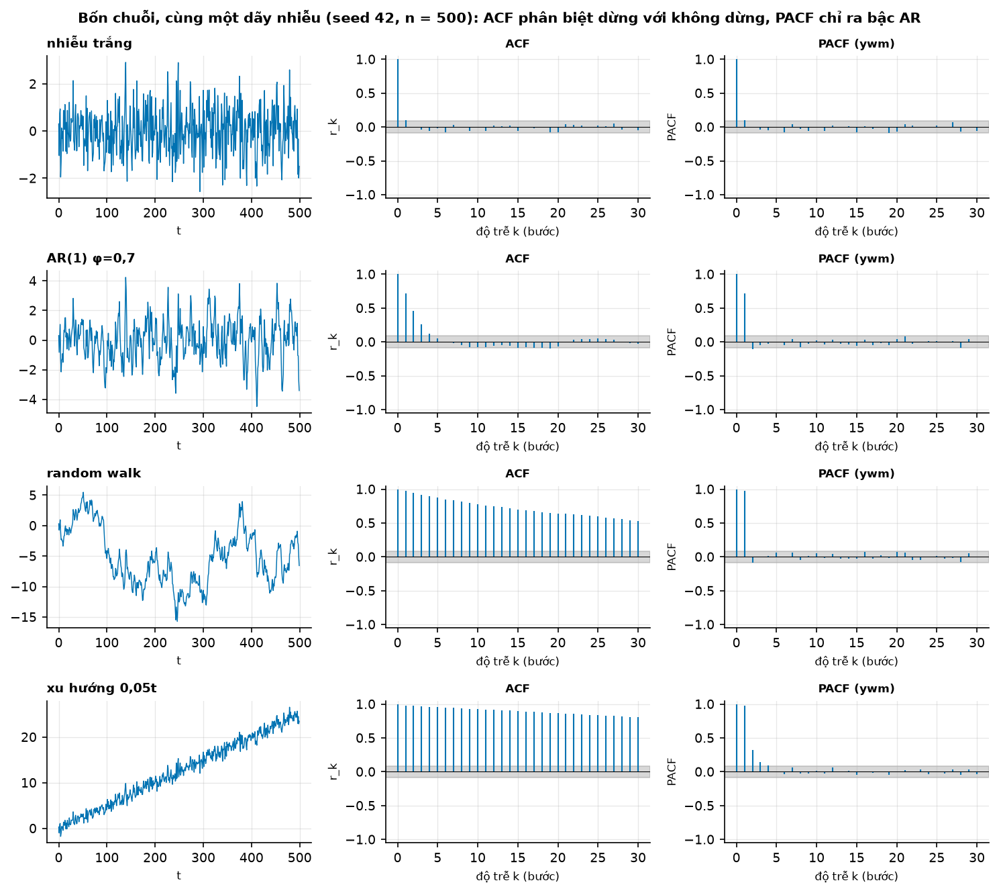
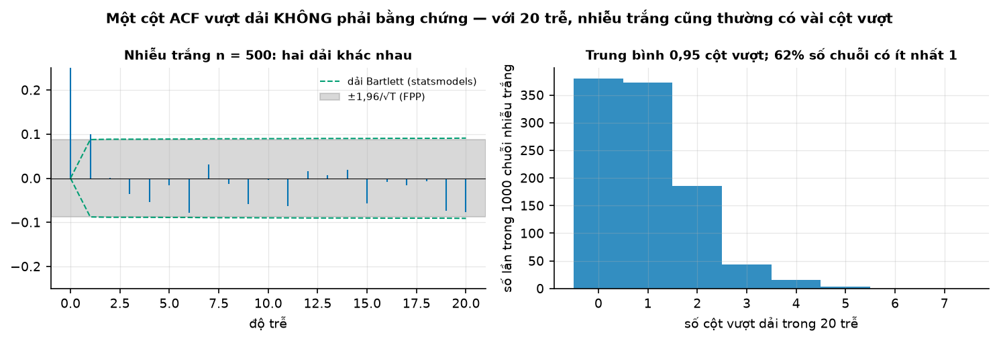
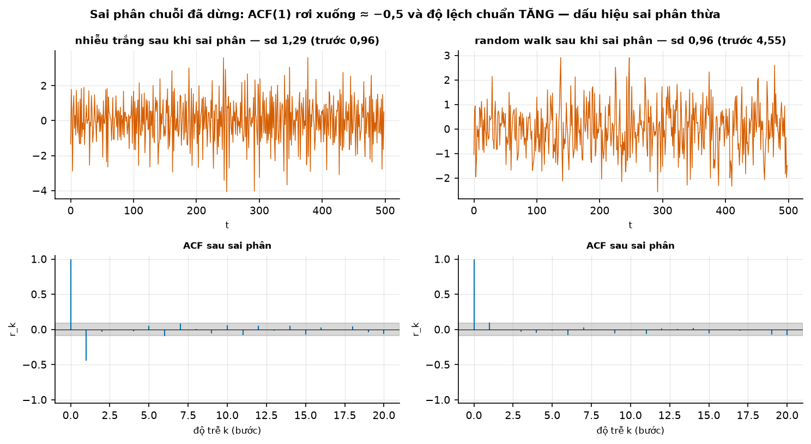
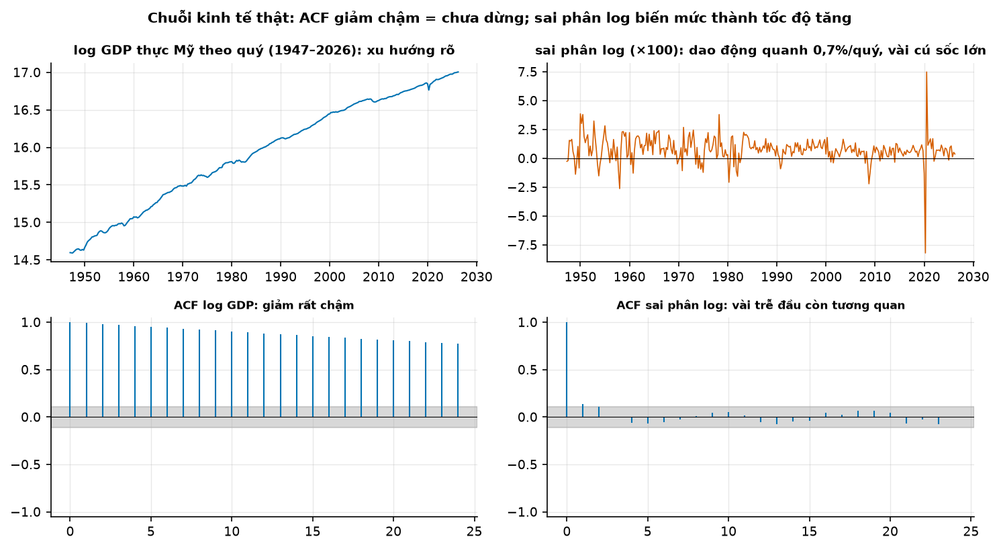
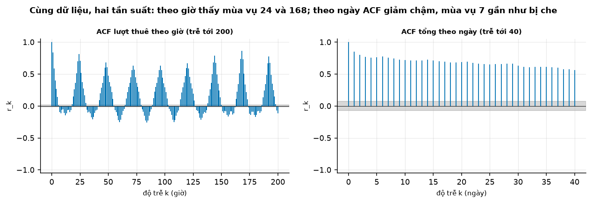

# Buổi 7 — Tự tương quan và tính dừng

## 1. Mục tiêu

Sau buổi này bạn:

- Tự viết **ACF** bằng NumPy khớp `statsmodels`, và đọc được ba hình dạng: xu hướng, mùa vụ, nhiễu trắng.
- Phân biệt **ACF** và **PACF**, nói được mỗi hình trả lời câu hỏi gì.
- Dùng **Ljung-Box** thay cho việc đếm cột vượt dải, và giải thích bằng số vì sao nhìn 20 cột thì "thế nào cũng có một cột vượt".
- Kết luận dừng / không dừng bằng **cả ADF lẫn KPSS** trên cùng dạng xác định, đọc được 4 tổ hợp và biết khi nào chúng mâu thuẫn.
- Quyết định **số lần sai phân** và phát hiện **sai phân thừa** bằng hai dấu hiệu đo được.

## 2. Nhắc lại buổi trước

- **Phân rã** tách xu hướng, mùa vụ, phần dư. Hôm nay ta hỏi ngược lại: *cái còn lại đã hết mẫu hình chưa?* và *chuỗi có đủ ổn định để mô hình hoá
  không?*
- **Biến đổi** (log, Box-Cox) ổn định **phương sai**; **sai phân** ổn định **mức**. Hai việc khác nhau, thường dùng cùng nhau: log rồi sai phân.
- **ACF** $r_k$ là tương quan giữa $y_t$ và $y_{t-k}$; đỉnh ở bội số chu kỳ là mùa vụ. Lượt thuê xe theo giờ có $r_{24} = 0{,}813$, $r_{168} = 0{,}864$.
- **Dữ liệu thiếu** làm hỏng mọi kiểm định: điền hoặc bỏ có chủ đích, và ghi lại.

## 3. Trạng thái đầu buổi

Sau `cd lab && python lab.py up`:

| Hạng mục | Trạng thái |
|---|---|
| Dữ liệu | `bea-nipa-quy/NipaDataQ.txt` (sha256 `7fa7dfb39b76`) — GDP thực A191RX, 318 quý 1947Q1→2026Q2; `frb-g17-san-luong-cong-nghiep/g17-2000-2024.csv` (`3956c6626866`) — 300 tháng; `uci-bike-sharing/hour.csv` (`e03de4ee4ef4`) |
| Nguồn | U.S. BEA (NIPA), Federal Reserve Board (G.17) — public domain; UCI Bike Sharing — CC BY 4.0 |
| Môi trường | Python 3.12; numpy 2.5.3, pandas 3.0.5, scipy 1.18.1, statsmodels 0.15.0 |
| `code/tu_tuong_quan.py` | `doc_gdp`, `doc_san_luong`, `doc_luot_thue`, `sinh_bon_chuoi`, `acf_tu_viet`, `dai_nhieu_trang`, `ljung_box`, `kiem_dinh`, `ket_luan`, `so_lan_sai_phan`, `dau_hieu_sai_phan_thua`, `bang_bon_chuoi` |
| **Đang cố tình sai** | `kiem_dinh` chỉ chạy **ADF** (bỏ KPSS, bỏ dạng 'ct'); `so_lan_sai_phan` **luôn sai phân ít nhất một lần** "cho chắc" |
| **Triệu chứng** | chuỗi xu hướng tất định bị gọi là "không dừng — cần sai phân"; nhiễu trắng cũng được sai phân một lần |
| `python lab.py check` lúc này | ĐỎ: 5/9 test hỏng |

## 4. Lý thuyết

### 4.1 Tự hiệp phương sai và ACF

**Trực giác.** "Giá trị hôm nay nói gì về giá trị $k$ bước sau?" Tự hiệp phương sai ở độ trễ $k$: $c_k = \frac{1}{T}\sum_{t=k+1}^{T}(y_t - \bar y)(y_{t-k} - \bar y)$;
ACF là $r_k = c_k / c_0$. FPP dùng mẫu số là tổng trên **cả** chuỗi:

$$
r_k = \frac{\sum_{t=k+1}^{T}(y_t-\bar y)(y_{t-k}-\bar y)}{\sum_{t=1}^{T}(y_t-\bar y)^2}
$$

**Tự viết bằng NumPy** (khớp `statsmodels.tsa.stattools.acf(..., adjusted=False)` tới sai số máy):

```python
lech = y - np.nanmean(y)
mau = np.nansum(lech**2)
r = [np.nansum(lech[k:] * lech[:-k]) / mau for k in range(1, so_tre + 1)]
```

Chia cho $T$ (không phải $T-k$) làm $r_k$ **co về 0** ở trễ lớn — có chủ ý: ước lượng ở trễ lớn dựa trên ít cặp nên không đáng tin.

### 4.2 Bốn chuỗi, bốn hình dạng ACF/PACF

**PACF** $\phi_{kk}$ là tương quan giữa $y_t$ và $y_{t-k}$ **sau khi** bỏ ảnh hưởng của các trễ ngắn hơn. Với AR(1), $y_{t-2}$ tương quan với $y_t$ chỉ
vì cả hai nối qua $y_{t-1}$ — ACF ở trễ 2 vẫn lớn ($0{,}7^2 = 0{,}49$) nhưng PACF ≈ 0.



**Đọc hình** (n = 500, seed 42, cùng một dãy nhiễu):

| chuỗi | ACF | PACF | dấu hiệu |
|---|---|---|---|
| nhiễu trắng | mọi cột trong dải (1/30 cột vượt) | như ACF | không có gì để học từ quá khứ |
| AR(1) φ = 0,7 | giảm dần theo hình mũ: $r_1 = 0{,}713$, $r_5 = 0{,}050$ | **cắt sau trễ 1**: 0,713 rồi −0,110 | AR bậc 1 |
| random walk | giảm **rất chậm**: $r_1 = 0{,}976$, $r_{30} = 0{,}530$ | 0,976 rồi ≈ 0 | không dừng |
| xu hướng 0,05t | giảm chậm hơn nữa: $r_{30} = 0{,}806$ | 0,979 rồi 0,320 | xu hướng tất định |

Hai dòng cuối trông giống nhau trên ACF — đó là lý do phải có kiểm định (mục 4.4), và vì sao xử lý sai (sai phân hay khử xu hướng) lại quan trọng.

### 4.3 Nhiễu trắng, dải tin cậy và Ljung-Box

**Nhiễu trắng**: không tự tương quan. FPP: "we expect 95% of the spikes in the ACF to lie within ±1,96/√T".



**Đọc hình.** Trái: cùng một chuỗi nhiễu trắng, dải xám cố định ±0,0877 (FPP) và đường gạch là **dải Bartlett** của statsmodels — rộng dần theo trễ
(0,0910 ở trễ 20) vì nó giả định các trễ nhỏ hơn đã có tương quan. Phải: mô phỏng 1.000 chuỗi nhiễu trắng, đếm số cột vượt dải trong 20 trễ: trung
bình **0,95 cột**, và **62%** số chuỗi có ít nhất một cột vượt. Một cột vượt dải không phải bằng chứng gì cả.

**Ljung-Box** gộp $\ell$ trễ vào một kiểm định:

$$
Q^* = T(T+2) \sum_{k=1}^{\ell} \frac{r_k^2}{T-k}, \qquad Q^* \sim \chi^2_{\ell - \text{số tham số}}
$$

FPP khuyên $\ell = 10$ cho dữ liệu không mùa vụ, $\ell = 2m$ cho dữ liệu mùa vụ, và không quá $T/5$. Nếu $r_k$ tính trên **phần dư của một mô hình đã
ước lượng $p$ tham số** thì trừ bậc tự do: `acorr_ljungbox(..., model_df=p)` — quên việc này làm p-value cao giả.

```python
from statsmodels.stats.diagnostic import acorr_ljungbox
acorr_ljungbox(phan_du, lags=[10], model_df=2)     # lb_stat, lb_pvalue
```

Trên ba chuỗi nhiễu trắng (seed 1, 2, 3): p = 0,081; 0,796; 0,885 — đúng như kỳ vọng với H0 đúng.

### 4.4 Tính dừng, random walk, và hai kiểm định

**Dừng yếu** (covariance stationary): trung bình không đổi, phương sai hữu hạn không đổi, và $\operatorname{Cov}(y_t, y_{t-k})$ chỉ phụ thuộc $k$.
**Dừng mạnh**: toàn bộ phân phối đồng thời bất biến theo dịch chuyển thời gian. FPP nói ngắn gọn: "A stationary time series is one whose statistical
properties do not depend on the time at which the series is observed." Chuỗi có **chu kỳ** không cố định tần suất vẫn có thể dừng; chuỗi có xu hướng,
mùa vụ, hoặc phương sai đổi thì không.

**Random walk** $y_t = y_{t-1} + \varepsilon_t$ là ví dụ kinh điển: phương sai $t\sigma^2$ tăng theo thời gian. FPP: "The forecasts from a random walk
model are equal to the last observation" — naive là dự báo tối ưu, và mọi "xu hướng" nhìn thấy chỉ là tích luỹ nhiễu.

**Hai kiểm định ngược nhau:**

| | H0 | H1 | "p nhỏ" nghĩa là |
|---|---|---|---|
| **ADF** | có nghiệm đơn vị (không dừng) | dừng | có bằng chứng **dừng** |
| **KPSS** | dừng (quanh hằng số hoặc quanh xu hướng) | có nghiệm đơn vị | có bằng chứng **không dừng** |

Cả hai đều phải khai **dạng xác định**: `regression="c"` (dừng quanh hằng số) hay `"ct"` (dừng quanh xu hướng tuyến tính). Ghép cặp cùng dạng:

| ADF | KPSS | Kết luận |
|---|---|---|
| bác bỏ | không bác bỏ | dừng (với dạng đã khai) |
| không bác bỏ | bác bỏ | không dừng → sai phân |
| không bác bỏ | không bác bỏ | **không đủ bằng chứng** — dữ liệu ngắn, hoặc gần nghiệm đơn vị |
| bác bỏ | bác bỏ | **mâu thuẫn** — xem lại dạng xác định, phương sai đổi, cú sốc |

Bảng này là **quy tắc kinh nghiệm**, không phải định lý: chính notebook của statsmodels — nguồn phổ biến nhất của bảng — gọi H0 của KPSS là "trend
stationary" trong khi code chạy `regression="c"`, và viết "the null hypothesis can not be rejected. Hence, the series is stationary", tức coi *không
bác bỏ* là *chứng minh*. Zivot nhắc lý do sâu hơn: "the ADF and PP tests have very low power against I(0) alternatives that are close to being I(1)".

**Bảng 4 chuỗi** (chạy thật, seed 42):

| chuỗi | ADF c | KPSS c | ADF ct | KPSS ct | kết luận (c) | kết luận (ct) |
|---|---|---|---|---|---|---|
| nhiễu trắng | 0,000 | 0,10 | 0,000 | 0,10 | dừng | dừng quanh xu hướng |
| AR(1) φ=0,7 | 0,000 | 0,10 | 0,000 | 0,10 | dừng | dừng quanh xu hướng |
| random walk | **0,073** | 0,01 | 0,214 | 0,01 | không dừng | không dừng |
| xu hướng 0,05t | **0,906** | 0,01 | 0,000 | 0,10 | không dừng (kết luận sai) | **dừng quanh xu hướng** |

Hai chỗ đáng nhớ: (1) random walk có ADF p = 0,073 — ở mức 10% sẽ bị gọi nhầm là dừng; (2) chuỗi xu hướng tất định chỉ lộ bản chất khi khai `ct`.
Lưu ý p-value của KPSS bị **cắt** ở 0,01 và 0,1 (statsmodels phát `InterpolationWarning`) — đừng đọc "p = 0,10" là "rất dừng".

**Trend-stationary vs difference-stationary.** Xu hướng tất định thì **khử xu hướng** (hồi quy theo $t$); nghiệm đơn vị thì **sai phân**. Làm ngược
đều hại: Zivot — sai phân chuỗi trend-stationary "produces a unit moving average root"; Nelson & Plosser (1982) cho thấy khử xu hướng một random walk
tạo ra ACF giả, "a statistical artifact".

### 4.5 Sai phân bao nhiêu lần là đủ

Quy tắc của FPP/`ndiffs`: sai phân tiếp chừng nào KPSS còn bác bỏ tính dừng. Nhưng phải kiểm **dấu hiệu sai phân thừa** (Nau): "If the lag-1
autocorrelation is -0.5 or more negative, the series may be overdifferenced"; và "The optimal order of differencing is often the order of differencing
at which the standard deviation is lowest."



**Đọc hình.** Trái: sai phân **nhiễu trắng** — ACF(1) rơi xuống **−0,447** (lý thuyết −0,5) và sd tăng 0,96 → 1,288. Phải: sai phân **random walk** —
ACF(1) = 0,100, sd giảm 4,55 → 0,961: đúng liều. Sai phân một chuỗi đã dừng là tự thêm một nghiệm đơn vị MA vào phần nhiễu.

### 4.6 Trên dữ liệu kinh tế thật



**Đọc hình.** Trên trái: log GDP đi lên gần như thẳng. Dưới trái: ACF giảm rất chậm (0,991 ở trễ 1; 0,923 ở trễ 8) — dấu hiệu chưa dừng; ADF ct
p = 0,833 và KPSS ct p = 0,01 cùng nói "không dừng". Trên phải: sai phân log (×100) dao động quanh **0,76%/quý**, với hai cú sốc COVID: −8,20% (2020Q2)
và +7,48% (2020Q3). Dưới phải: ACF của chuỗi đã sai phân còn 0,133 ở trễ 1 và 0,111 ở trễ 2 — không hoàn toàn nhiễu trắng (Ljung-Box(8) p = 0,0995).

**Tình huống mâu thuẫn thật.** Với chuỗi tăng trưởng GDP: ADF p ≈ 0 (bác bỏ nghiệm đơn vị) **và** KPSS p = 0,048 (bác bỏ tính dừng) — ô thứ tư của
bảng. Máy móc theo KPSS thì `so_lan_sai_phan` trả **2**; nhưng sai phân lần hai cho ACF(1) = **−0,488** và sd tăng 1,105 → 1,455: sai phân thừa. Lấy
đoạn 1985Q1–2019Q4 (bỏ cú sốc COVID) thì ADF p ≈ 0 và KPSS p = 0,099 — **cả hai thống nhất "dừng"**. Kết luận: KPSS bác bỏ vì **phương sai đổi** và cú
sốc, không phải vì nghiệm đơn vị. Kiểm định là bằng chứng, không phải phán quyết.

**Sản lượng công nghiệp** (2000–2024, log): dạng 'c' → ADF p = 0,223, KPSS p = 0,01 (cần sai phân); dạng 'ct' → ADF p = 0,252, KPSS p = 0,10 (không đủ
bằng chứng — ô thứ ba); sau một lần sai phân cả hai đồng ý dừng (ADF p ≈ 0, KPSS p = 0,10) → $d = 1$.



**Đọc hình.** Trái (theo giờ, tới trễ 200): hình vỏ sò 24 giờ, đỉnh cao nhất ở 168. Phải (tổng theo ngày, tới trễ 40): chỉ còn đỉnh ở 7, 14, 21 —
gộp lên ngày **xoá** mùa vụ trong ngày. Chuỗi ngày chưa dừng (ADF p = 0,289, KPSS p = 0,01) vì mức 2012 cao hơn 2011 → $d = 1$.

### 4.7 Sai phân mùa vụ: làm trước, và thường là đủ

Với chuỗi mùa vụ, sai phân **mùa vụ** $\Delta_m y_t = y_t - y_{t-m}$ thường giải quyết cả mùa vụ lẫn phần lớn xu hướng. FPP làm mùa vụ trước:
"If first differencing is done first, there will still be seasonality present." Trên lượt thuê xe **theo ngày** (655 ngày đủ 24 giờ), thang log:

| chuỗi | ADF p | KPSS p | ACF(1) | ACF(7) | sd |
|---|---|---|---|---|---|
| log mức | 0,063 | 0,010 | +0,771 | +0,607 | 0,468 |
| log, sai phân mùa vụ 7 | 0,000 | 0,041 | +0,317 | −0,425 | **0,373** |
| log, sai phân 7 rồi sai phân 1 | 0,000 | 0,100 | **−0,367** | −0,496 | 0,436 |

**Đọc bảng.** Sai phân mùa vụ một lần đưa sd xuống thấp nhất (0,373) và ADF bác bỏ mạnh nghiệm đơn vị. Làm thêm sai phân thường thì KPSS "đẹp hơn"
(p = 0,10) nhưng ACF(1) tụt về −0,367 và sd **tăng** lên 0,436 — đúng hai dấu hiệu sai phân thừa. Chọn theo bằng chứng, không theo p-value đẹp nhất.
(Thứ tự hai phép sai phân không quan trọng: $\Delta\Delta_7 = \Delta_7\Delta$, hai dòng cuối cho cùng con số.)

### 4.8 Tính ergodic — vì sao một chuỗi dài thay được nhiều lần lặp

Ta chỉ quan sát **một** quỹ đạo của quá trình, nhưng vẫn muốn ước lượng trung bình, phương sai, tự tương quan. Ergodic là giả định cho phép điều đó:
Zivot — "the time average converges to the ensemble average as the sample size gets large". Nó hỏng khi chuỗi có mức thay đổi vĩnh viễn (random walk):
trung bình mẫu của một random walk **không** hội tụ về đâu cả — thêm lý do phải đưa chuỗi về dạng dừng trước khi ước lượng.

## 5. Lab từng bước

### Bước 1 — Chạy code đầu buổi

```bash
cd lab && python lab.py up
python lab.py chay ../code/tu_tuong_quan.py
python lab.py check                    # 5/9 đỏ
```

```text
         chuỗi  ACF(1)  ADF c                  kết luận  d
   nhiễu trắng   0.099  0.000                      dừng  1
   AR(1) φ=0,7   0.713  0.000                      dừng  1
   random walk   0.976  0.073 không dừng — cần sai phân  1
xu hướng 0,05t   0.979  0.906 không dừng — cần sai phân  1
```

### Bước 2 — ACF tự viết

Đối chiếu `acf_tu_viet(y, 20)` với `statsmodels.tsa.stattools.acf(y, nlags=20, adjusted=False, fft=True)`. Vẽ ACF và PACF (`method="ywm"`) cho 4 chuỗi.

### Bước 3 — Thêm KPSS và dạng xác định

Sửa `kiem_dinh` để chạy cả `kpss`, có tham số `co_xu_huong` (dạng `'ct'`), và **luôn** truyền `result_object=True`. Bắt `InterpolationWarning` để biết
p bị cắt. Viết lại `ket_luan` theo bảng 4 tổ hợp.

### Bước 4 — Số lần sai phân vừa đủ

Sửa `so_lan_sai_phan`: dựa vào KPSS, **không** sai phân sẵn một lần. Kiểm `dau_hieu_sai_phan_thua` trên nhiễu trắng và random walk.

### Bước 5 — Chuỗi thật

Chạy cho log GDP, tăng trưởng GDP (cả giai đoạn 1985–2019), log sản lượng công nghiệp, lượt thuê theo ngày. Với mỗi chuỗi viết một dòng: kết luận, số
lần sai phân, và **bằng chứng nào** dẫn tới kết luận đó.

```bash
python lab.py check                    # 9/9 xanh
```

## 6. Lỗi thường gặp & cách chẩn đoán

| Triệu chứng | Nguyên nhân | Chẩn đoán | Sửa |
|---|---|---|---|
| "ADF không bác bỏ → chuỗi có nghiệm đơn vị" | không bác bỏ ≠ chứng minh H0 | xem độ mạnh kiểm định, cỡ mẫu | chạy thêm KPSS, xem ACF |
| Chuỗi xu hướng tất định bị sai phân | chỉ chạy dạng `'c'` | chạy lại với `'ct'` | khử xu hướng thay vì sai phân |
| ADF và KPSS cùng bác bỏ | phương sai đổi, cú sốc, gãy cấu trúc | vẽ chuỗi; thử đoạn không có cú sốc | biến đổi ổn định phương sai, tách đoạn, mô hình có gãy |
| ADF và KPSS cùng **không** bác bỏ | dữ liệu ngắn / gần nghiệm đơn vị | cỡ mẫu, ACF | thu thập thêm, hoặc chọn theo mục đích dự báo |
| KPSS "p = 0,10" đọc thành "rất dừng" | p bị cắt theo bảng tra | `InterpolationWarning` | báo "p > 0,1" |
| Sai phân xong ACF(1) ≈ −0,5, sd tăng | sai phân thừa | `dau_hieu_sai_phan_thua` | bớt một lần sai phân |
| Ljung-Box trên phần dư mô hình cho p đẹp | quên `model_df` | so p với và không có `model_df` | truyền số tham số đã ước lượng |
| Đếm cột ACF vượt dải rồi kết luận | đa kiểm định | mô phỏng: 62% chuỗi nhiễu trắng có ≥ 1 cột vượt | dùng Ljung-Box |
| ACF từ `plot_acf` khác hình tự vẽ | dải Bartlett vs ±1,96/√T | `bartlett_confint=False` | thống nhất một cách, ghi rõ |
| PACF trong bảng khác PACF trên hình | `pacf` mặc định `ywadjusted`, `plot_pacf` mặc định `ywm` | in tham số | khai `method="ywm"` |
| FutureWarning về tuple từ `adfuller`/`kpss` | 0.15 sắp đổi kiểu trả về | đọc cảnh báo | truyền `result_object=True` |
| Chuỗi mùa vụ: sai phân thường trước | mùa vụ còn nguyên | ACF ở trễ m | sai phân **mùa vụ** trước, rồi mới xét sai phân thường |

## 7. Bài tập về nhà

1. **Chuỗi mùa vụ.** Lấy lượt thuê theo ngày, sai phân mùa vụ (lag 7) rồi kiểm ADF/KPSS. Có cần thêm sai phân thường không? Dùng cả ACF lẫn hai dấu hiệu
   sai phân thừa để trả lời.
2. **Độ mạnh kiểm định.** Mô phỏng 500 chuỗi AR(1) với φ = 0,95 (n = 200) và đếm tỷ lệ ADF bác bỏ ở mức 5%. So với φ = 0,7. Kết quả nói gì về câu "ADF
   không bác bỏ nên có nghiệm đơn vị"?
3. **Gãy cấu trúc.** Ghép hai đoạn nhiễu trắng có trung bình 0 và 5 (mỗi đoạn 250 điểm). Chạy ADF/KPSS và ACF. Chuỗi này có nghiệm đơn vị không? Kiểm định
   nói gì, và vì sao?

## 8. Tiêu chí "Xong khi"

- [ ] `python lab.py check` xanh 9/9.
- [ ] Với một chuỗi lạ: kết luận dừng / không dừng và số lần sai phân, dựa trên **cả ba** bằng chứng (ACF, ADF, KPSS) — mỗi kết luận kèm con số.
- [ ] Giải thích được hai ô "mâu thuẫn" và "không đủ bằng chứng" bằng ví dụ thật trong buổi (tăng trưởng GDP; log sản lượng công nghiệp dạng 'ct').
- [ ] Chỉ ra sai phân thừa bằng hai dấu hiệu: ACF(1) ≤ −0,45 và độ lệch chuẩn tăng.

## 9. Đọc thêm

- Hyndman, R.J., Athanasopoulos, G. et al. *FPP, the Pythonic Way* — §2.8–2.9 (ACF, nhiễu trắng), §5.4 (Ljung-Box), ch. 9 (tính dừng, sai phân):
  https://otexts.com/fpppy/
- Dickey, D.A. & Fuller, W.A. (1979). *JASA* 74(366a), 427–431; Said, S.E. & Dickey, D.A. (1984). *Biometrika* 71(3), 599–607.
- Kwiatkowski, D., Phillips, P.C.B., Schmidt, P. & Shin, Y. (1992). *Journal of Econometrics* 54(1–3), 159–178.
- Nelson, C.R. & Plosser, C.I. (1982). Trends and random walks in macroeconomic time series. *J. Monetary Economics* 10, 139–162.
- Zivot, E. — *Unit Root Tests* (Econ 584): https://faculty.washington.edu/ezivot/econ584/notes/unitroot.pdf
- Nau, R. — *Identifying the order of differencing*: https://people.duke.edu/~rnau/411arim2.htm
- statsmodels — ví dụ "Stationarity and detrending (ADF/KPSS)" (đọc kèm phê bình ở mục 4.4).
