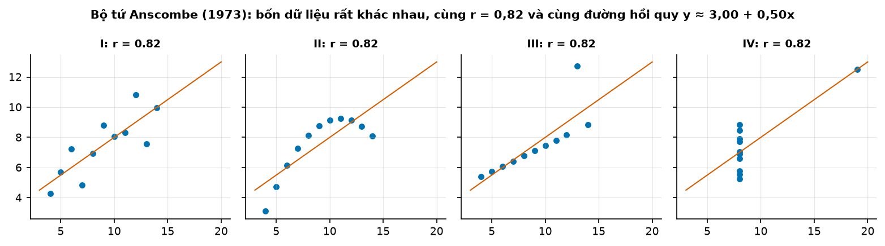
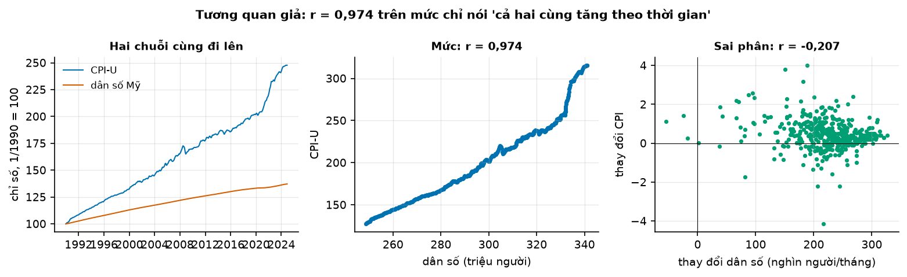
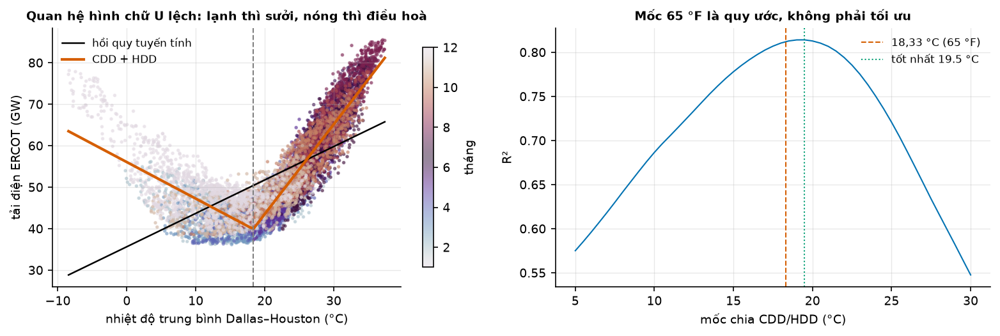
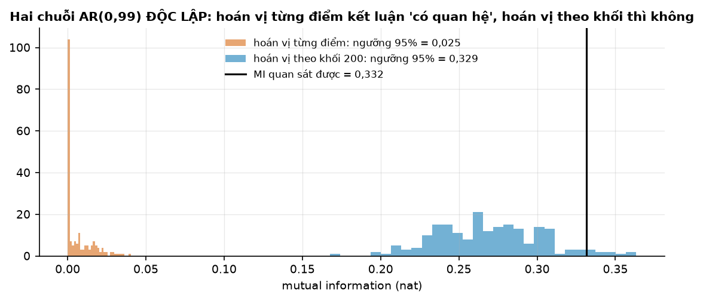
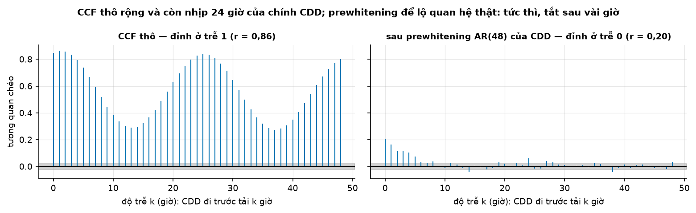
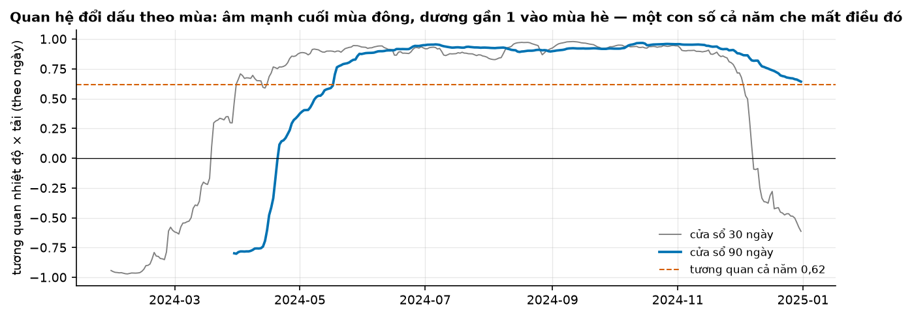
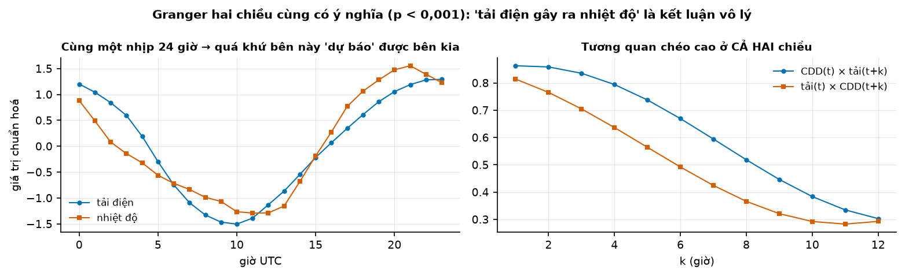

# Buổi 8 — Tương quan giữa các chuỗi

## 1. Mục tiêu

Sau buổi này bạn:

- Chọn đúng hệ số (**Pearson, Spearman**) và biết vì sao phải **vẽ scatter trước** khi tin bất kỳ hệ số nào.
- Phát hiện **tương quan giả** giữa hai chuỗi có xu hướng bằng ba bằng chứng: tương quan sau sai phân, $R^2$ và Durbin–Watson.
- Thấy quan hệ **phi tuyến** mà Pearson bỏ sót, bằng scatter, **mutual information** và cách tách **CDD/HDD**.
- Đo **độ trễ dẫn dắt** bằng tương quan chéo **sau prewhitening**, và biết vì sao tương quan chéo thô nói sai.
- Đo **tương quan trượt** để thấy quan hệ đổi dấu theo mùa.
- Đọc đúng kiểm định **Granger**: "quá khứ X giúp dự báo Y", không phải "X gây ra Y"; và hỏi được câu cuối: biến này có biết trước
  giá trị tương lai không?

## 2. Nhắc lại buổi trước

Từ buổi 2:

- **Hệ số tương quan Pearson** $r$ từ −1 tới 1: hai đại lượng cùng tăng cùng giảm theo **đường thẳng** tới đâu. Công thức: cộng các tích
  "độ lệch của $x$ × độ lệch của $y$", chia cho căn của (tổng bình phương độ lệch $x$ × tổng bình phương độ lệch $y$).
- **Kiểm định, $H_0$, p-value**: p < 0,05 thì bác bỏ $H_0$; không bác bỏ không có nghĩa $H_0$ đúng.
- **Hoán vị**: xáo trộn dữ liệu để xem một con số dao động cỡ nào khi "không có quan hệ gì".

Từ buổi 7:

- **Dừng**: mức, độ dao động, tự tương quan không đổi theo thời gian. Chuỗi có xu hướng hay random walk thì không dừng; **sai phân**
  ($y_t - y_{t-1}$) thường đưa về dừng.
- **Tự tương quan** $r_k$ (ACF): chuỗi giống chính nó dời lùi $k$ bước tới đâu. Nhiệt độ theo giờ có tự tương quan rất mạnh ở trễ 1, 24.
- **AR(p)**: giá trị mới đoán từ $p$ giá trị trước của chính nó.
- Nhìn nhiều độ trễ thì kiểu gì cũng có vài cột vượt dải chỉ do ngẫu nhiên.

## 3. Trạng thái đầu buổi

Sau `python lab.py up` (trong thư mục `lab/`):

| Hạng mục | Trạng thái |
|---|---|
| Dữ liệu | EIA-930 2024 (sha256 `26768c495c3b`, `a602a8e577cf`): tải điện ERCOT (lưới điện Texas) theo giờ; ghép với nhiệt độ còn 8.777 giờ |
| | Open-Meteo ERA5 (dữ liệu thời tiết tái phân tích) Dallas (`0a3b3942535b`) và Houston (`f583a8be1de7`): nhiệt độ theo giờ UTC 2024 |
| | CPI-U (`47507ab13d93`) và dân số Mỹ (`dd14f325cc4b`): 420 tháng 1990–2024 |
| Nguồn | U.S. EIA, BLS, BEA (public domain); Open-Meteo (CC BY 4.0) |
| Môi trường | Python 3.12; numpy 2.5.3, pandas 3.0.5, scipy 1.18.1, statsmodels 0.15.0, scikit-learn 1.9.1 |
| `code/tuong_quan.py` | đọc dữ liệu, `cdd_hdd`, `tuong_quan`, `thong_tin_tuong_ho`, `kiem_y_nghia_mi`, `hoi_quy_don`, `tuong_quan_chuoi`, `ccf_tu_viet`, `loc_prewhiten`, `do_tre_dan_dat`, `tuong_quan_truot`, `granger_hai_chieu` |
| `code/lab.ipynb` | notebook của Lab, bước 1–5 |
| **Đang cố tình sai** | `tuong_quan_chuoi` chỉ tính trên **mức**; `do_tre_dan_dat` dùng tương quan chéo **thô**; `granger_hai_chieu` kết luận "x gây ra y" |
| **Triệu chứng** | CPI và dân số "quan hệ mạnh" ($r$ = 0,974); độ trễ dẫn dắt ra 1 giờ; "tải điện gây ra nhiệt độ" |
| `python lab.py check` lúc này | ĐỎ: 3/10 test hỏng |

## 4. Lý thuyết

Buổi này đi qua **năm tình huống** (mục 4.2–4.6). Mỗi tình huống: câu hỏi → hình → con số → **cái bẫy nói trong một câu**.

### Từ mới trong buổi

| Thuật ngữ | Nghĩa một câu | Ví dụ |
|---|---|---|
| ERCOT, ISNE | Lưới điện Texas và lưới điện New England (mã ERCO, ISNE trong dữ liệu EIA-930). | Chuỗi tải của buổi là ERCOT. |
| Spearman | Tương quan Pearson tính trên **thứ hạng** thay cho giá trị: đo quan hệ "cùng tăng" dù không thẳng. | 1, 2, 3 và 1, 4, 9 → Spearman 1. |
| Kendall | Cũng dùng thứ hạng: tỷ lệ cặp điểm "cùng chiều" trừ tỷ lệ cặp "ngược chiều". | Mọi cặp cùng chiều → 1. |
| hồi quy đơn, $R^2$ | Đường thẳng $y = a + b x$ khớp dữ liệu nhất (tổng bình phương sai lệch nhỏ nhất); $R^2$ là phần dao động của $y$ mà đường thẳng giải thích được. | $R^2$ = 0,8: đường thẳng giải thích 80%. |
| $t$ của hệ số | Hệ số $b$ chia cho sai số chuẩn của nó (độ lệch chuẩn của chính ước lượng $b$); $|t|$ trên khoảng 2 thường được đọc là "có ý nghĩa". | $b$ = 4, sai số chuẩn 1 → $t$ = 4. |
| tương quan giả (spurious) | $r$ cao chỉ vì hai chuỗi cùng có xu hướng, không vì liên quan. | Giá cả và dân số cùng tăng. |
| Durbin–Watson (DW) | Con số đo phần dư của hồi quy có tự tương quan không: gần 2 là không, gần 0 là tự tương quan dương mạnh. | Phần dư 1, 1, 1, −1, −1, −1 → 0,67. |
| CDD, HDD | Độ nóng / độ lạnh so với mốc 18,33 °C (65 °F): $\max(T - 18{,}33, 0)$ và $\max(18{,}33 - T, 0)$. | 25 °C → CDD 6,67, HDD 0. |
| mutual information (MI, thông tin tương hỗ) | Biết $x$ thì bớt được bao nhiêu điều chưa biết về $y$; bằng 0 khi độc lập, bắt được mọi dạng quan hệ. Đơn vị **nat**. | Mục 4.3. |
| hoán vị theo khối | Xáo trộn cả khối liền nhau thay vì từng điểm, để giữ tự tương quan. | Khối 168 giờ = 1 tuần. |
| tương quan chéo (CCF) | Tương quan giữa $x$ lúc $t$ và $y$ lúc $t + k$, theo độ trễ $k$. | $y$ chậm 2 bước sau $x$ → đỉnh ở $k$ = 2. |
| prewhitening | Lọc bỏ phần $x$ "tự đoán được từ quá khứ của nó", lọc $y$ bằng đúng bộ lọc đó, rồi mới tính CCF. | Mục 4.4. |
| tương quan trượt | $r$ tính trên từng cửa sổ thời gian (ví dụ 90 ngày), vẽ theo thời gian. | Mùa đông −0,8, mùa hè +0,97. |
| kiểm định Granger (Granger causality) | Hỏi: thêm quá khứ của $x$ có làm dự báo $y$ tốt hơn hẳn so với chỉ dùng quá khứ của $y$ không. | Mục 4.6. |
| biến gây nhiễu (confounder) | Biến thứ ba điều khiển cả $x$ lẫn $y$, làm chúng trông như liên quan. | Nhịp ngày điều khiển cả nhiệt độ lẫn tải. |
| ex-ante / ex-post | Dự báo chỉ dùng thông tin đã có lúc ra dự báo / dùng cả giá trị thật về sau của biến giải thích. | Dùng nhiệt độ **dự báo** / nhiệt độ **đo được** ngày mai. |

### 4.1 Ba hệ số tương quan, và vì sao phải vẽ trước

**Vấn đề.** Một con số $r$ tóm cả một đám điểm. Nhiều đám điểm rất khác nhau có thể cho cùng một $r$.

**Ví dụ số nhỏ — tự tính tay.**

- $x$ = 1, 2, 3, 4, 5 → $y = x^2$ = 1, 4, 9, 16, 25: $y$ luôn tăng khi $x$ tăng nhưng không theo đường thẳng. Pearson = 0,981, chưa tới 1.
  Hạng của $x$ và hạng của $y$ đều là 1 → 5 theo cùng thứ tự, nên Spearman = **1**.
- $x$ = −2, −1, 0, 1, 2 và $y = x^2$ = 4, 1, 0, 1, 4 (hình chữ U). Trung bình $x$ là 0, trung bình $y$ là 2. Tích độ lệch: (−2)(2) +
  (−1)(−1) + (0)(−2) + (1)(−1) + (2)(2) = −4 + 1 + 0 − 1 + 4 = 0, nên Pearson = **0**, dù $y$ hoàn toàn xác định bởi $x$.

Pearson đo quan hệ **đường thẳng**; Spearman đo quan hệ **cùng tăng (hoặc cùng giảm)**; cả hai bỏ sót chữ U (mục 4.3). Kendall cũng dùng
thứ hạng như Spearman, ít bị ảnh hưởng bởi vài điểm lạ khi mẫu nhỏ.



**Cách đọc hình.**

1. **Trục ngang**: giá trị $x$ của bộ dữ liệu (không đơn vị).
2. **Trục dọc**: giá trị $y$ (không đơn vị), chung thang cho bốn ô.
3. **Ký hiệu**: chấm xanh là điểm dữ liệu; đường cam là đường hồi quy, giống hệt nhau ở bốn ô ($y ≈ 3 + 0{,}5x$).
4. **Nhìn vào đâu**: hình dạng đám chấm ở từng ô.
5. **Kết luận**: bốn bộ có cùng $r$ = 0,82 nhưng là bốn câu chuyện khác nhau: thẳng có nhiễu (I), đường cong (II), thẳng chặt với một
   điểm lạ (III), một cột điểm cộng một điểm kéo cả đường (IV).

| Bộ | I | II | III | IV |
|---|---|---|---|---|
| Pearson | 0,816 | 0,816 | 0,816 | 0,817 |
| Spearman | 0,818 | 0,691 | 0,991 | 0,500 |

**Đọc bảng.** Pearson giống hệt nhau, Spearman thì khác: nó thấy III gần như tăng hoàn hảo (chỉ một điểm lạ) và IV yếu. Nhưng chỉ hình mới
cho biết chuyện gì đang xảy ra.

**Cái bẫy trong một câu.** Một hệ số tương quan không kể được hình dạng của quan hệ: luôn vẽ scatter trước.

**Tóm lại.** **Pearson đo quan hệ đường thẳng, Spearman đo quan hệ cùng tăng theo thứ hạng; cả hai có thể bằng 0 khi quan hệ rất mạnh
nhưng hình chữ U.**

**Tự kiểm tra.** $x$ = 1, 2, 3, 4 và $y$ = 10, 20, 30, 1.000. Spearman bằng bao nhiêu? Pearson lớn hay nhỏ hơn Spearman?

<details>
<summary>Đáp án</summary>

Hạng của $y$ trùng hạng của $x$ (cả hai tăng dần), nên Spearman = **1**. Pearson chỉ khoảng 0,79, vì điểm 1.000 nằm xa hẳn khỏi đường
thẳng qua ba điểm đầu. Nhầm hay gặp: nghĩ điểm lớn làm Spearman nhỏ đi; Spearman chỉ nhìn thứ hạng nên không bị kéo.

</details>

### 4.2 Tình huống 1 — tương quan giả giữa hai chuỗi có xu hướng

**Vấn đề.** CPI (giá cả) và dân số Mỹ 1990–2024 có $r$ = 0,974. Giá cả và số dân liên quan mạnh tới vậy sao?

**Trực giác.** Hai chuỗi cùng đi lên theo thời gian thì tháng nào cũng "cả hai cùng cao hơn tháng trước". Pearson thấy điều đó và cho $r$
cao, dù hai thứ chẳng liên quan. Câu hỏi đúng là: **tháng nào** giá tăng nhanh hơn thường lệ, dân số có tăng nhanh hơn thường lệ không?
Sai phân trả lời câu đó.

**Ví dụ số nhỏ — tự tính tay.** Hai chuỗi 5 tháng:

| Tháng | 1 | 2 | 3 | 4 | 5 |
|---|---|---|---|---|---|
| $a$ | 2 | 3 | 5 | 6 | 8 |
| $b$ | 10 | 12 | 13 | 15 | 16 |
| Bước của $a$ | | +1 | +2 | +1 | +2 |
| Bước của $b$ | | +2 | +1 | +2 | +1 |

**Đọc bảng.** Trên mức, $r$ = 0,974 (kiểm bằng `np.corrcoef`). Nhưng tháng $a$ tăng nhiều thì $b$ tăng ít: $r$ của hai dòng bước là **−1**.
Hai chuỗi chỉ chung một thứ: cùng đi lên.

**Durbin–Watson.** Hồi quy chuỗi này theo chuỗi kia rồi xem **phần dư** (phần đường thẳng không giải thích được). Nếu phần dư lên một
tràng rồi xuống một tràng, mô hình đang bỏ sót cấu trúc thời gian.

$$
DW = \frac{\sum_{t=2}^{T}(e_t - e_{t-1})^2}{\sum_{t=1}^{T} e_t^2}
$$

- $e_t$: phần dư tại $t$. Tử số: tổng bình phương bước nhảy giữa hai phần dư liền nhau. Mẫu số: tổng bình phương phần dư.

**Nói bằng lời.** Phần dư đổi chậm (tự tương quan dương) thì bước nhảy nhỏ, DW gần 0; phần dư lộn xộn thì DW gần 2. Phần dư 1, 1, 1, −1,
−1, −1: chỉ một bước nhảy cỡ 2, nên DW = 2² / 6 = 4 / 6 ≈ 0,67. Phần dư 1, −1, 1, −1, 1, −1: năm bước nhảy cỡ 2, nên DW = 5 × 4 / 6 =
20 / 6 ≈ 3,33.



**Cách đọc hình.**

1. **Trục ngang**: ô trái là năm; ô giữa là dân số (triệu người); ô phải là thay đổi dân số mỗi tháng (nghìn người).
2. **Trục dọc**: ô trái là chỉ số (tháng 1/1990 = 100); ô giữa là CPI; ô phải là thay đổi CPI mỗi tháng.
3. **Ký hiệu**: ô trái, xanh là CPI, cam là dân số; hai ô sau, mỗi chấm một tháng.
4. **Nhìn vào đâu**: hình dạng đám chấm ô giữa so với ô phải.
5. **Kết luận**: trên mức, chấm nằm gần như một đường ($r$ = 0,974); trên thay đổi hằng tháng, đám chấm không có hình dạng ($r$ = −0,207).

| Đại lượng | CPI × dân số | Nghĩa |
|---|---|---|
| $r$ trên mức | 0,974 | "cùng tăng theo thời gian" |
| $R^2$ hồi quy mức | 0,9495 | trông như giải thích được 95% |
| $t$ của hệ số | 88,6 | trông "cực kỳ có ý nghĩa" |
| Durbin–Watson | 0,0051 | phần dư tự tương quan gần như hoàn toàn |
| $r$ sau sai phân | −0,207 | quan hệ tháng-với-tháng gần như không có |

**Đọc bảng.** Ba dòng đầu nói "quan hệ rất mạnh"; hai dòng cuối nói "mô hình sai". DW gần 0 nghĩa là các phép tính $t$ và p-value ở trên dựa
trên giả định sai (sai số độc lập), nên $t$ = 88,6 không đáng tin. Granger và Newbold (1974) cho thấy: $R^2$ cao đi cùng DW thấp là dấu hiệu
của hồi quy giả, không phải của quan hệ thật.

**Cái bẫy trong một câu.** Hai chuỗi cùng có xu hướng luôn tương quan cao trên mức; phải xem tương quan sau sai phân và DW.

**Tóm lại.** **$R^2$ cao, $t$ lớn đi cùng DW gần 0 là dấu hiệu tương quan giả; câu hỏi thật được trả lời bằng tương quan của các thay đổi.**

**Tự kiểm tra.** Hai chuỗi: $r$ trên mức 0,92, $r$ sau sai phân 0,85, DW 1,8. Có nghi tương quan giả không?

<details>
<summary>Đáp án</summary>

**Không nhiều.** Sau sai phân quan hệ vẫn mạnh (0,85), và DW gần 2 nên phần dư không tự tương quan: hai chuỗi thật sự lên xuống cùng
nhau từ tháng này sang tháng khác. Nhầm hay gặp: thấy $r$ trên mức cao là nghi giả ngay; dấu hiệu giả là $r$ **sụp** sau sai phân và DW gần 0.

</details>

### 4.3 Tình huống 2 — quan hệ phi tuyến: nhiệt độ và tải điện

**Vấn đề.** Pearson giữa nhiệt độ và tải điện ERCOT là 0,616, "khá mạnh". Nhưng ai ở Texas cũng biết: trời lạnh bật sưởi, trời nóng bật
điều hoà, cả hai đều làm tải **tăng**.

**Ví dụ số nhỏ — tự tính tay (CDD, HDD).** Mốc 18,33 °C (65 °F, mốc của cơ quan năng lượng Mỹ EIA). Nhiệt độ 10; 18,33; 25; 30 °C cho:
CDD = 0; 0; 25 − 18,33 = 6,67; 30 − 18,33 = 11,67 và HDD = 18,33 − 10 = 8,33; 0; 0; 0. Hai biến mới đều **tăng** khi đi xa mốc, nên hồi quy
tải = $a + b \cdot \text{CDD} + c \cdot \text{HDD}$ (như hồi quy đơn, thêm một biến) vẽ được hình chữ V: phía nóng dốc $b$, phía lạnh dốc $c$.



**Cách đọc hình.**

1. **Trục ngang**: ô trái là nhiệt độ trung bình Dallas – Houston (°C); ô phải là mốc chia CDD/HDD (°C).
2. **Trục dọc**: ô trái là tải điện ERCOT (GW); ô phải là $R^2$ của hồi quy theo CDD + HDD với mốc đó.
3. **Ký hiệu**: ô trái, mỗi chấm một giờ năm 2024 (màu là tháng), đường đen là hồi quy thẳng theo nhiệt độ, đường cam là hồi quy theo
   CDD + HDD; ô phải, vạch cam là mốc 18,33 °C, vạch xanh lá là mốc tốt nhất.
4. **Nhìn vào đâu**: ô trái, phần bên trái 18 °C (đường đen đi xuống nhưng chấm đi lên); ô phải, đỉnh đường cong.
5. **Kết luận**: đường thẳng bỏ sót hẳn nhánh lạnh; hai nhánh CDD/HDD bám được cả hai phía; mốc 65 °F là quy ước, gần tốt nhất (19,5 °C).

| Đại lượng | Giá trị |
|---|---|
| Pearson / Spearman / Kendall | 0,616 / 0,733 / 0,572 |
| $R^2$ hồi quy theo nhiệt độ | 0,379 |
| $R^2$ hồi quy theo CDD + HDD | 0,812 |
| Pearson khi nhiệt độ ≤ 18,33 °C (2.877 giờ) | −0,649 |
| Pearson khi nhiệt độ > 18,33 °C (5.900 giờ) | +0,910 |

**Đọc bảng.** So hai dòng $R^2$: tách hai nhánh giải thích gấp đôi. Hai dòng cuối: quan hệ **đổi dấu** qua mốc. Con số 0,616 là trộn của
một nhánh âm và một nhánh dương; nó còn dương chỉ vì ở Texas nhánh nóng dài hơn.

**Mutual information.** Pearson hỏi "có đường thẳng không"; MI hỏi "biết $x$ có giúp đoán $y$ không, theo **bất kỳ** cách nào".

**Ví dụ số nhỏ — tự tính tay (MI).** Ba loại ngày, mỗi loại 1/3 số ngày: lạnh → tải cao, vừa → tải thấp, nóng → tải cao. Mã hoá lạnh, vừa,
nóng là −1, 0, 1 và cao, thấp là 1, 0: Pearson = 0 (giống chữ U ở mục 4.1). Nhưng biết loại ngày là biết chắc tải. MI so tỷ lệ thật của
mỗi ô với tỷ lệ "nếu độc lập":

| Ô (loại ngày, tải) | Tỷ lệ thật $p(x,y)$ | Nếu độc lập $p(x)\,p(y)$ | Góp vào MI: $p(x,y) \ln \frac{p(x,y)}{p(x)p(y)}$ |
|---|---|---|---|
| lạnh, cao | 1/3 | 1/3 × 2/3 = 2/9 | 1/3 × ln 1,5 ≈ 0,135 |
| vừa, thấp | 1/3 | 1/3 × 1/3 = 1/9 | 1/3 × ln 3 ≈ 0,366 |
| nóng, cao | 1/3 | 1/3 × 2/3 = 2/9 | 1/3 × ln 1,5 ≈ 0,135 |

**Đọc bảng.** Cộng cột cuối: MI ≈ **0,637 nat**. Ô nào xảy ra nhiều hơn mức "độc lập" thì góp dương; độc lập thì mọi tỷ số bằng 1, $\ln 1$
= 0, MI = 0.

$$
I(X;Y) = \sum_{x,y} p(x,y)\,\ln\frac{p(x,y)}{p(x)\,p(y)}
$$

- $p(x,y)$: tỷ lệ gặp cặp $(x, y)$. $p(x)$, $p(y)$: tỷ lệ gặp riêng $x$, riêng $y$. $\ln$: log tự nhiên, nên đơn vị là nat.

**Nói bằng lời.** Với mỗi ô, xem tỷ lệ thật gấp mấy lần tỷ lệ "nếu độc lập", lấy log, nhân với tỷ lệ thật, rồi cộng. Ví dụ ô "vừa, thấp":
1/3 gấp 3 lần 1/9, ln 3 ≈ 1,099, nhân 1/3 ra 0,366.

Với dữ liệu liên tục (nhiệt độ, tải), scikit-learn ước lượng MI bằng cách đếm láng giềng gần (Kraskov và cộng sự, 2004):
`mutual_info_regression(x.reshape(-1, 1), y, random_state=0)`; phải đặt `random_state` để chạy lại ra cùng số. Nhiệt độ × tải ERCOT: MI =
0,862 nat.

**MI có ý nghĩa không? Hoán vị theo khối.** Để biết 0,862 có lớn không, xáo trộn $y$ nhiều lần (phá quan hệ) và xem MI của dữ liệu xáo
trộn dao động cỡ nào. Nhưng hai chuỗi trơn độc lập vẫn hay có những quãng dài tình cờ cùng cao hoặc cùng thấp,
nên MI của chúng không nhỏ. Xáo từng điểm thì phá luôn độ trơn đó: dữ liệu xáo lộn xộn, MI rất nhỏ, và dữ liệu thật trông "đặc biệt"
dù không có quan hệ. Phải xáo **cả khối** liền nhau (Gohil và cộng sự, 2025).



**Cách đọc hình.**

1. **Trục ngang**: giá trị MI (nat).
2. **Trục dọc**: số lần (trong các lần hoán vị) MI rơi vào mỗi ô.
3. **Ký hiệu**: cam là MI khi hoán vị từng điểm; xanh là khi hoán vị theo khối 200 điểm; vạch đen là MI của dữ liệu thật: hai chuỗi AR
   **độc lập**, rất trơn, 2.000 điểm (seed 0).
4. **Nhìn vào đâu**: vạch đen so với đám cam và đám xanh.
5. **Kết luận**: với hai chuỗi không liên quan, vạch đen nằm xa hẳn đám cam (p = 0,005, kết luận sai "có quan hệ") nhưng nằm trong mép đám
   xanh (p = 0,055, không bác bỏ).

Với nhiệt độ × tải thật, hoán vị theo khối một tuần: MI của dữ liệu thật (0,862) vượt xa ngưỡng 95% của dữ liệu xáo (0,124). Quan hệ có
thật.

**Cái bẫy trong một câu.** Pearson trộn hai nhánh ngược dấu thành một con số trông vừa phải; và kiểm MI bằng hoán vị từng điểm thì hai
chuỗi trơn nào cũng trông như có quan hệ.

**Tóm lại.** **Quan hệ đổi dấu (chữ U, chữ V) làm Pearson sai; tách theo cơ chế (CDD/HDD) hoặc đo bằng MI. Kiểm ý nghĩa của MI trên chuỗi
thời gian bằng hoán vị theo khối.**

**Tự kiểm tra.** Hai loại ngày, mỗi loại một nửa: ngày mưa luôn ít khách, ngày nắng luôn nhiều khách. MI bằng bao nhiêu?

<details>
<summary>Đáp án</summary>

Hai ô (mưa, ít) và (nắng, nhiều), mỗi ô tỷ lệ 1/2; nếu độc lập thì mỗi ô 1/2 × 1/2 = 1/4. Mỗi ô góp 1/2 × ln 2 ≈ 0,347; tổng MI = ln 2 ≈
**0,693 nat**. Nhầm hay gặp: cộng cả các ô không xảy ra, (mưa, nhiều) và (nắng, ít); ô có tỷ lệ 0 góp 0.

</details>

### 4.4 Tình huống 3 — tương quan chéo và prewhitening: ai đi trước, bao lâu?

**Vấn đề.** Nhiệt độ tăng thì bao lâu sau tải điện mới tăng? Cần tương quan giữa $x$ lúc $t$ và $y$ lúc $t + k$ cho từng $k$.

**Quy ước của buổi:** $r_k = \operatorname{corr}(x_t, y_{t+k})$; $k$ dương nghĩa là **$x$ đi trước $y$** $k$ bước. `ccf_tu_viet(x, y)`
làm đúng như vậy. Cẩn thận: `statsmodels.tsa.stattools.ccf(a, b)` trả $\operatorname{corr}(a_{t+k}, b_t)$, tức muốn "$x$ dẫn $y$" phải gọi
`ccf(y, x)`. Luôn kiểm hướng bằng chuỗi giả $y_t = x_{t-3}$: đỉnh phải ở $k$ = 3.

**Trực giác của cái bẫy.** Nếu $x$ tự nó rất trơn (giờ này gần bằng giờ trước), thì $x_t$ giống $x_{t+1}$ giống $x_{t+2}$. Khi $y$ đi theo
$x$ chậm 2 bước, $y_{t+2}$ giống $x_t$, mà $x_t$ lại giống $x_{t-1}$, $x_{t+1}$, nên tương quan chéo cao ở **cả một dải** độ trễ quanh 2.
Hình dạng tương quan chéo lúc đó là tự tương quan của chính $x$, không phải quan hệ.

**Ví dụ số nhỏ — tự tính tay.** $x$ là một random walk ngắn (tổng dồn các bước ±1); $y$ đi theo $x$ chậm 2 bước ($y_t = x_{t-2}$, hai số
đầu lấy bằng 1):

| $t$ | 1 | 2 | 3 | 4 | 5 | 6 | 7 | 8 | 9 | 10 | 11 | 12 |
|---|---|---|---|---|---|---|---|---|---|---|---|---|
| $x$ | 1 | 2 | 1 | 2 | 3 | 4 | 3 | 2 | 1 | 2 | 1 | 0 |
| $y$ | 1 | 1 | 1 | 2 | 1 | 2 | 3 | 4 | 3 | 2 | 1 | 2 |
| bước của $x$ | | +1 | −1 | +1 | +1 | +1 | −1 | −1 | −1 | +1 | −1 | −1 |
| bước của $y$ | | 0 | 0 | +1 | −1 | +1 | +1 | +1 | −1 | −1 | −1 | +1 |

**Đọc bảng.** Với random walk, phần "tự đoán được" là giá trị trước, nên lọc = lấy sai phân (hai dòng cuối). Dòng bước của $y$ là chính
dòng bước của $x$ **dời sang phải 2 cột**: đặt hai dòng thẳng nhau thấy ngay chúng chỉ trùng ở độ trễ 2.

| Độ trễ $k$ | 0 | 1 | 2 | 3 | 4 |
|---|---|---|---|---|---|
| Tương quan chéo thô | 0,15 | 0,42 | 0,77 | 0,37 | 0,05 |
| Sau lọc (trên hai dòng bước) | −0,09 | −0,10 | 0,91 | −0,01 | −0,11 |

**Đọc bảng.** Thô thì đỉnh ở 2 nhưng trễ 1 và 3 cũng khá cao, vì $x$ trơn; sau lọc chỉ còn một đỉnh sắc ở 2. Các số tính bằng
`ccf_tu_viet` (ô bước 4).

**Prewhitening** tổng quát: khớp một mô hình AR cho $x$ (phần $x$ tự đoán được từ quá khứ), lấy phần còn lại của $x$; lọc $y$ bằng
**cùng** bộ hệ số AR; rồi mới tính tương quan chéo (Box–Jenkins). Với dữ liệu giờ có nhịp 24 giờ, bậc AR phải đủ phủ một chu kỳ: buổi này
dùng AR(48).

```python
phi = AutoReg(x, lags=48).fit().params[1:]                  # hệ số AR(48) của x
loc = lambda v: np.array([v[i] - phi[::-1] @ v[i-48:i] for i in range(48, v.size)])
r = ccf_tu_viet(loc(x), loc(y), so_tre=48)                  # lọc CẢ HAI bằng cùng phi
```



**Cách đọc hình.**

1. **Trục ngang**: độ trễ $k$ (giờ), 0 → 48; $k$ dương là CDD đi trước tải $k$ giờ.
2. **Trục dọc**: tương quan chéo.
3. **Ký hiệu**: ô trái là thô, ô phải là sau prewhitening AR(48); dải xám là ±2/√n (vùng của tương quan ngẫu nhiên).
4. **Nhìn vào đâu**: độ cao ở trễ 24 ở hai ô; vị trí đỉnh.
5. **Kết luận**: thô thì mọi trễ đều cao và lặp theo nhịp một ngày; sau lọc chỉ còn đỉnh ở trễ 0, tắt dần sau vài giờ: tải phản ứng với
   nóng gần như ngay trong giờ.

| Tương quan chéo | Trễ 0 | Trễ 1 | Trễ 24 |
|---|---|---|---|
| Thô | 0,848 | 0,863 | 0,828 |
| Sau prewhitening AR(48) | 0,205 | 0,163 | 0,061 |

**Đọc bảng.** Dòng thô: cột cuối cao gần bằng cột đầu, đó là nhịp ngày của chính CDD. Dòng sau lọc: cột cuối chỉ còn sát mép dải
của tương quan ngẫu nhiên.

**Cái bẫy trong một câu.** Tương quan chéo thô mang hình dạng tự tương quan của chính $x$; phải prewhiten trước khi đọc độ trễ.

**Tóm lại.** **Tương quan chéo $r_k$ = corr($x_t$, $y_{t+k}$) cho biết $x$ đi trước $y$ bao nhiêu bước. Kiểm quy ước hướng của thư viện bằng
chuỗi giả trước khi tin.**

**Tự kiểm tra.** Bạn gọi `statsmodels.tsa.stattools.ccf(x, y)` và thấy đỉnh ở $k$ = 3. Có kết luận được "$x$ đi trước $y$ 3 bước" không?

<details>
<summary>Đáp án</summary>

**Không.** `ccf(x, y)[k]` là $\operatorname{corr}(x_{t+k}, y_t)$: đỉnh ở 3 nghĩa là $x$ lúc $t + 3$ giống $y$ lúc $t$, tức **$y$ đi trước $x$**
3 bước. Muốn "$x$ dẫn $y$" phải gọi `ccf(y, x)`. Nhầm hay gặp: đọc thứ tự tham số như thứ tự thời gian; luôn thử với chuỗi giả $y_t = x_{t-3}$.

</details>

### 4.5 Tình huống 4 — tương quan trượt: quan hệ có ổn định không?

**Vấn đề.** Mục 4.3 cho thấy quan hệ đổi dấu qua mốc nhiệt. Vậy theo **thời gian** trong năm, quan hệ thay đổi ra sao?

**Ví dụ số nhỏ — tự tính tay.** Sáu ngày: ba ngày đông (5, 10, 15 °C; tải 30, 20, 10) và ba ngày hè (25, 30, 35 °C; tải 20, 30, 40).
Tính riêng từng cửa sổ 3 ngày: mùa đông các điểm thẳng hàng đi xuống, $r$ = **−1**; mùa hè thẳng hàng đi lên, $r$ = **+1**. Gộp cả sáu ngày:
$r$ = **0,48** (kiểm bằng `np.corrcoef`), một con số "vừa phải" không tả đúng ngày nào.



**Cách đọc hình.**

1. **Trục ngang**: ngày cuối của cửa sổ, năm 2024.
2. **Trục dọc**: tương quan giữa nhiệt độ trung bình ngày và tải ngày trong cửa sổ, từ −1 tới 1.
3. **Ký hiệu**: xám là cửa sổ 30 ngày, xanh đậm là cửa sổ 90 ngày, gạch cam là con số cả năm (0,62).
4. **Nhìn vào đâu**: đoạn cuối mùa đông và đoạn mùa hè – thu.
5. **Kết luận**: quan hệ âm mạnh cuối mùa đông, dương gần 1 mùa hè; con số cả năm nằm giữa, không đúng với mùa nào.

| Cửa sổ 90 ngày kết thúc | 31/3/2024 | 14/10/2024 | cả năm |
|---|---|---|---|
| Tương quan | −0,801 | +0,968 | 0,616 |

**Đọc bảng.** Cùng một cặp chuỗi, dấu của tương quan đổi theo mùa; cửa sổ 30 ngày còn xuống tới −0,971.

Lưu ý kỹ thuật: `rolling(90)` mặc định đòi đủ 90 điểm, nhưng `rolling("90D")` (cửa sổ theo số ngày lịch) mặc định chỉ cần 1 điểm, nên
vài giá trị đầu là ±1 giả. Đặt `min_periods` rõ ràng.

**Cái bẫy trong một câu.** Một hệ số cho cả năm là trung bình của các chế độ ngược nhau; phải xem tương quan trượt trước khi tin nó.

**Tóm lại.** **Báo tương quan luôn kèm "trên khoảng thời gian nào" và một hình trượt; quan hệ đổi dấu theo mùa thì tách chế độ thay vì gộp.**

**Tự kiểm tra.** Mô hình dự báo tải được huấn luyện chỉ trên dữ liệu tháng 6–9 (hệ số nhiệt độ dương), rồi dùng cho tháng 1. Chuyện gì xảy ra?

<details>
<summary>Đáp án</summary>

Mô hình học "nóng hơn thì tải cao hơn", nên ngày đợt rét tháng 1 nó dự báo tải **thấp**, trong khi thật ra tải **cao** vì sưởi: sai dấu.
Nhầm hay gặp: nghĩ chỉ cần thêm dữ liệu cùng mùa là đủ; phải có dữ liệu cả hai chế độ, hoặc biến tách chế độ (CDD/HDD).

</details>

### 4.6 Tình huống 5 — Granger: "giúp dự báo", không phải "gây ra"

**Vấn đề.** Nhiệt độ có "gây ra" tải điện không? Có kiểm định mang tên "Granger causality", nhưng nó đo một thứ hẹp hơn nhiều.

**Trực giác.** So hai cách dự báo $y$: **A** chỉ dùng quá khứ của $y$; **B** dùng thêm quá khứ của $x$. Nếu B làm sai số nhỏ đi rõ rệt thì
"quá khứ $x$ có ích để dự báo $y$". Đó là tất cả những gì Granger kiểm.

**Ví dụ số nhỏ — tự tính tay.** $x$ = 3, 1, 4, 1, 5, 9 và $y$ luôn bằng $x$ hôm trước: $y$ = –, 3, 1, 4, 1, 5.

| Ngày | 3 | 4 | 5 | 6 |
|---|---|---|---|---|
| $y$ thật | 1 | 4 | 1 | 5 |
| A: đoán $y$ = $y$ hôm qua | 3 | 1 | 4 | 1 |
| Sai số A | −2 | 3 | −3 | 4 |
| B: đoán $y$ = $x$ hôm qua | 1 | 4 | 1 | 5 |
| Sai số B | 0 | 0 | 0 | 0 |

**Đọc bảng.** Tổng bình phương sai số: A là 4 + 9 + 9 + 16 = 38, B là 0. Thêm quá khứ $x$ làm dự báo tốt hẳn: "$x$ Granger-gây-ra $y$".
Kiểm định thật so hai tổng này bằng một thống kê (kiểm định F) và cho p-value.

```python
from statsmodels.tsa.stattools import grangercausalitytests
kq = grangercausalitytests(np.column_stack([y, x]), maxlag=4)   # kiểm: CỘT 2 có giúp dự báo CỘT 1 không
p = {k: kq[k][0]["ssr_ftest"][1] for k in kq}                   # p-value theo từng độ trễ
```



**Cách đọc hình.**

1. **Trục ngang**: ô trái là giờ UTC trong ngày; ô phải là độ trễ $k$ (giờ).
2. **Trục dọc**: ô trái là giá trị chuẩn hoá (trừ trung bình, chia độ lệch chuẩn) để hai chuỗi chung thang; ô phải là tương quan chéo.
3. **Ký hiệu**: ô trái, xanh là tải điện, cam là nhiệt độ (trung bình theo giờ UTC); ô phải, xanh là CDD đi trước tải, cam là tải đi trước
   CDD.
4. **Nhìn vào đâu**: ô trái, hai đường cùng một nhịp; ô phải, hai đường đều cao.
5. **Kết luận**: tải và nhiệt độ cùng chạy theo một nhịp 24 giờ, nên quá khứ bên này "đoán" được bên kia ở **cả hai chiều**; Granger cho p
   gần 0 cả khi hỏi "tải có giúp dự báo nhiệt độ không".

"Tải điện gây ra nhiệt độ ngoài trời" là vô lý. Cả hai cùng bị một **biến gây nhiễu** điều khiển: nhịp ngày (mặt trời lên thì nóng, người thức
dậy thì dùng điện). Khi $x$ và $y$ cùng bị một quá trình thứ ba điều khiển với độ trễ khác nhau, Granger có thể có ý nghĩa ở chiều bất kỳ
(Maziarz, 2015). Thêm hai điều kiện: chuỗi phải **dừng** (sai phân trước), và kết luận luôn viết "quá khứ X giúp dự báo Y".

**Biến có dùng được để dự báo không?** Tương quan cao chưa đủ. Một biến chỉ dùng được cho dự báo **ex-ante** nếu lúc ra dự báo ta biết,
hoặc dự báo được, giá trị tương lai của nó (FPP §7.6). Nhiệt độ dùng được vì có dự báo thời tiết, nhưng phải dùng **dự báo** nhiệt độ, kèm sai
số của nó. Dùng nhiệt độ **đo được** ngày mai là ex-post: hữu ích để nghiên cứu mô hình, nhưng không phải dự báo thật (buổi 13 học kỹ).

**Cái bẫy trong một câu.** Granger chỉ nói "quá khứ X giúp dự báo Y"; có ý nghĩa ở cả hai chiều thường là dấu hiệu của một biến gây nhiễu
chung, không phải nhân quả.

**Tóm lại.** **Granger so sai số dự báo có và không có quá khứ của X. Chạy cả hai chiều, và luôn hỏi: lúc ra dự báo có biết giá trị tương
lai của biến này không?**

**Tự kiểm tra.** Số kem bán ra và số vụ đuối nước theo tuần: Granger cho "kem → đuối nước" p = 0,01 và "đuối nước → kem" p = 0,02. Kết luận?

<details>
<summary>Đáp án</summary>

Cả hai chiều có ý nghĩa: dấu hiệu của **biến gây nhiễu** chung, ở đây là thời tiết nóng (nhiều người ăn kem và nhiều người đi bơi). Không
kết luận kem gây đuối nước. Nhầm hay gặp: chọn chiều có p nhỏ hơn làm "nguyên nhân".

</details>

> **Nâng cao — có thể bỏ qua lần đọc đầu.** Khi đưa nhiều biến vào một mô hình, câu hỏi đổi thành "biến này có thêm thông tin gì so với các
> biến kia". **VIF** của biến $j$ là $1/(1 - R_j^2)$, với $R_j^2$ là $R^2$ khi hồi quy biến $j$ theo các biến còn lại: CDD và CDD trễ 1 giờ có
> $r$ = 0,987, VIF gần 40 (gần như cùng một thông tin). Nhiều biến trùng nhau làm hệ số riêng lẻ khó diễn giải nhưng không làm dự báo tệ đi.
> Đừng đưa cả nhiệt độ **và** CDD, HDD vào cùng mô hình: theo định nghĩa $T = \text{CDD} - \text{HDD} + 18{,}33$, ba biến phụ thuộc tuyến tính
> chính xác. **Tương quan một phần** đo quan hệ giữa hai biến sau khi đã bỏ ảnh hưởng của các biến còn lại (buổi 18).

## 5. Lab từng bước

Lệnh gõ trong terminal ở thư mục `lab/`. Code các bước nằm sẵn trong `code/lab.ipynb` (mở bằng `python lab.py notebook` hoặc
VS Code), chạy từng ô từ trên xuống. Bạn sửa `code/tuong_quan.py`; notebook tự nạp lại bản mới.

### Bước 1 — Chạy code đầu buổi

**Mục đích:** thấy ba kết luận sai trước khi sửa.

```bash
python lab.py up           # một lần: môi trường + dữ liệu, kiểm sha256
python lab.py check        # 3/10 test đỏ
python lab.py notebook     # chạy ô bước 1
```

```text
1. CPI × dân số: {'r_muc': 0.9744, 'ket_luan': 'quan hệ mạnh'}
3. độ trễ dẫn dắt (thô): 1 | sau prewhitening: 1
5. x gây ra y (Granger, p < 0,05)
```

**Đọc kết quả:** dòng 1 chỉ có $r$ trên mức (mục 4.2); dòng 3 hai con số giống nhau, tức "sau prewhitening" chưa lọc gì (mục 4.4); dòng 5
là một câu nhân quả (mục 4.6).

### Bước 2 — Tương quan giả

**Mục đích:** sửa `tuong_quan_chuoi` theo mục 4.2.

Thêm tương quan sau sai phân và kết quả của `hoi_quy_don` ($R^2$, $t$, DW); kết luận "nghi tương quan giả" khi $r$ trên mức cao, DW thấp và
$r$ sau sai phân nhỏ. Chạy lại ô bước 1.

**Đọc kết quả:** dòng 1 có thêm `r_sai_phan` −0,2071 và `dw` 0,0051, kết luận đổi thành "nghi TƯƠNG QUAN GIẢ".

### Bước 3 — Phi tuyến và MI

**Mục đích:** thấy tận mắt hình chữ U và con số MI (mục 4.3).

Ô bước 3 vẽ scatter nhiệt độ × tải tô màu theo tháng, so $R^2$ theo nhiệt độ với theo CDD + HDD, tính MI và p của hoán vị theo khối.

**Đọc kết quả:** $R^2$ 0,379 và 0,812 như bảng mục 4.3; MI 0,862; p của hoán vị theo khối khoảng 0,01.

### Bước 4 — Tương quan chéo và prewhitening

**Mục đích:** sửa `do_tre_dan_dat` theo mục 4.4.

Ô bước 4 chạy ví dụ tay 12 số và chuỗi giả $y_t = x_{t-3}$ để kiểm quy ước. Sửa `do_tre_dan_dat` để gọi `loc_prewhiten` (AR(48)) khi
`bac` khác `None`, rồi chạy lại ô.

**Đọc kết quả:** chuỗi giả cho đỉnh ở 3. Trên dữ liệu thật, đỉnh chuyển về trễ 0 và cột trễ 24 gần như biến mất, như hình mục 4.4.

### Bước 5 — Tương quan trượt và Granger

**Mục đích:** sửa `granger_hai_chieu` theo mục 4.6.

Ô bước 5 vẽ tương quan trượt 30 và 90 ngày. Sửa `granger_hai_chieu`: khi cả hai chiều cùng có ý nghĩa, kết luận nói rõ là "cả hai chiều",
dấu hiệu của biến gây nhiễu chung; khi một chiều thì viết "quá khứ … giúp dự báo …", không viết "gây ra". Rồi:

```bash
python lab.py check        # 10/10 xanh
```

**Đọc kết quả:** xanh 10/10 là xong. `test_do_tre_sau_prewhitening` còn đỏ thì bạn mới lọc $x$ mà chưa lọc $y$ bằng cùng bộ hệ số.

## 6. Lỗi thường gặp & cách chẩn đoán

| Triệu chứng | Nguyên nhân | Chẩn đoán | Sửa |
|---|---|---|---|
| $r$ = 0,97 giữa hai chuỗi chẳng liên quan | cả hai có xu hướng | DW của hồi quy mức; $r$ sau sai phân | báo cả ba con số; sai phân |
| "$t$ = 88, chắc chắn có quan hệ" | phần dư tự tương quan làm $t$ phình | DW gần 0 | sai phân, hoặc hồi quy động (buổi 18) |
| Pearson nhỏ nhưng scatter hình chữ U | quan hệ đổi dấu | vẽ scatter; MI; chia theo ngưỡng | CDD/HDD, hoặc mô hình phi tuyến |
| MI "có ý nghĩa" trên hai chuỗi độc lập | hoán vị từng điểm phá tự tương quan | so với hoán vị theo khối | hoán vị theo khối |
| MI đổi mỗi lần chạy | ước lượng láng giềng có ngẫu nhiên | xem `random_state` | đặt seed |
| Tương quan chéo cao ở mọi độ trễ | chưa prewhiten | xem trễ bằng chu kỳ (24) | lọc AR đủ bậc cho cả hai chuỗi |
| Độ trễ dẫn dắt ra ngược dấu | nhầm quy ước `ccf(x, y)` | thử $y_t = x_{t-3}$ | tự viết hàm, ghi rõ quy ước |
| `rolling("90D")` cho ±1 ở đầu chuỗi | mặc định chỉ cần 1 điểm | xem vài giá trị đầu | đặt `min_periods` |
| "Granger chứng minh nhân quả" | đọc sai tên kiểm định | chạy cả hai chiều | viết "giúp dự báo"; tìm biến gây nhiễu |
| Granger trên chuỗi không dừng | kiểm định giả định dừng | ADF + KPSS trước | sai phân trước |
| `grangercausalitytests(..., verbose=True)` báo lỗi | statsmodels 0.15 đã bỏ tham số | đọc thông báo lỗi | bỏ `verbose`, đọc dict trả về |
| Biến tương quan cao nhưng vô dụng khi dự báo | không biết trước giá trị tương lai | "lúc ra dự báo có số này chưa?" | dùng dự báo của biến đó, hoặc bỏ |

## 7. Bài tập về nhà

1. **Mô phỏng tương quan giả.** Sinh 1.000 cặp random walk độc lập (200 điểm mỗi chuỗi). Bao nhiêu phần trăm cặp có $|r| > 0{,}5$ trên
   mức? Sau sai phân?
2. **Vùng khác.** Lặp tình huống 2 và 4 cho lưới điện New England (mã ISNE) trong dữ liệu EIA-930 của buổi, với một chuỗi nhiệt độ Boston bạn
   tự tải từ Open-Meteo theo giờ UTC. Pearson cả năm lớn hay nhỏ hơn ERCOT, và vì sao?
3. **Lọc ngược.** Prewhiten bằng AR của **tải** thay vì của CDD rồi tính tương quan chéo. Kết quả khác gì, và vì sao Box–Jenkins lọc theo
   chuỗi **giải thích**?

## 8. Tiêu chí "Xong khi"

- [ ] `python lab.py check` xanh 10/10.
- [ ] Với một cặp chuỗi lạ, trả lời đủ bốn câu kèm số: tương quan có giả không ($r$ mức, $r$ sai phân, DW); tuyến tính hay phi tuyến
      (scatter, MI, $R^2$ hai mô hình); độ trễ dẫn dắt sau prewhitening; biến có biết trước giá trị tương lai không.
- [ ] Nói được cái bẫy của cả năm tình huống, mỗi cái một câu.
- [ ] Giải thích vì sao Granger hai chiều cùng có ý nghĩa trên cặp nhiệt độ – tải điện.

## 9. Đọc thêm

- Granger, C.W.J. & Newbold, P. (1974). Spurious regressions in econometrics. *Journal of Econometrics* 2(2), 111–120.
- Anscombe, F.J. (1973). Graphs in statistical analysis. *The American Statistician* 27(1), 17–21.
- Penn State STAT 510 — Lesson 9: tương quan chéo và prewhitening: https://online.stat.psu.edu/stat510/Lesson09.html
- Kraskov, A., Stögbauer, H. & Grassberger, P. (2004). Estimating mutual information. *Phys. Rev. E* 69, 066138.
- Gohil, N. et al. (2025). Cross Mutual Information. arXiv:2507.15372 — hoán vị theo khối.
- Maziarz, M. (2015). A review of the Granger-causality fallacy. *The Journal of Philosophical Economics* VIII(2), 86–105.
- Hyndman & Athanasopoulos, *FPP the Pythonic Way* §2.6 (scatter, tương quan), §7.6 (ex-ante, ex-post): https://otexts.com/fpppy/
- U.S. EIA — *Degree days*: https://www.eia.gov/energyexplained/units-and-calculators/degree-days.php
