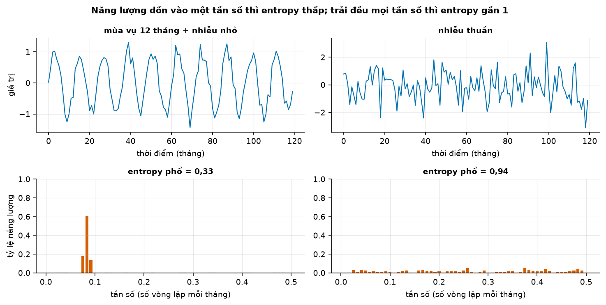

# Buổi 9 — Đặc trưng chuỗi và khả năng dự báo

## 1. Mục tiêu

Sau buổi này bạn:

- Biến mỗi chuỗi thành **một hàng 20 đặc trưng**, và biết đặc trưng nào đổi theo đơn vị đo, đặc trưng nào không.
- Nói bằng lời **spectral entropy** đo gì, tính tay được trên phổ 4 tần số, và dùng nó xếp hạng 4.000 chuỗi theo độ khó.
- Giải thích bằng ví dụ số vì sao đo độ khó bằng **MASE** của seasonal naive cho kết luận sai, còn **sMAPE** thì không.
- Vẽ **bản đồ** 4.000 chuỗi bằng PCA và tách nhóm chuỗi "dùng baseline, đừng tốn công tune".
- **Phân cụm theo hình dạng** bằng DTW, và chứng minh bằng số vì sao phải chuẩn hoá trước.
- Lập bảng **ABC–XYZ** cho dữ liệu bán lẻ, và chỉ ra vì sao trục XYZ không đo được độ khó dự báo.

## 2. Nhắc lại buổi trước

Từ buổi 1–3:

- **Naive** dự báo bằng giá trị cuối; **seasonal naive** dự báo bằng giá trị cùng vị trí của vòng trước (tháng 3 năm nay = tháng 3 năm
  ngoái). **MAE** là trung bình của |sai số|, với sai số = thực tế − dự báo.
- Muốn biết dự báo tốt tới đâu thì **giữ lại đoạn cuối** làm kỳ chấm, chỉ học trên phần trước nó.

Từ buổi 4–8:

- **ACF** $r_k$: chuỗi giống chính nó dời lùi $k$ bước tới đâu, từ −1 tới 1.
- **Hệ số biến thiên** (CV) = độ lệch chuẩn / trung bình: dao động to cỡ bao nhiêu phần của mức. Trung bình 100, độ lệch chuẩn 10 → CV = 0,1.
- **STL** tách chuỗi thành xu hướng $T$ + mùa vụ $S$ + phần dư $R$. **Độ mạnh mùa vụ** $F_S = \max(0, 1 - \operatorname{Var}(R)/\operatorname{Var}(S+R))$:
  gần 1 là mùa vụ lấn át phần dư; **độ mạnh xu hướng** $F_T$ tương tự với $T$.
- **KPSS**: p nhỏ là có bằng chứng chuỗi không dừng.
- **Pearson** đo quan hệ đường thẳng; **Spearman** là Pearson trên thứ hạng, đo quan hệ "cùng tăng" dù không thẳng.

## 3. Trạng thái đầu buổi

Sau `python lab.py up` (trong thư mục `lab/`):

| Hạng mục | Trạng thái |
|---|---|
| Dữ liệu | `du-lieu/raw/monash-m4-monthly/m4_monthly_dataset.tsf` — 48.000 chuỗi theo tháng của cuộc thi M4, dài 60–2.812 tháng, sha256 `473aa4fc814b` |
| | `uci-online-retail-ii/online_retail_II.xlsx` (`572e362708e6`) — 1.067.371 dòng hoá đơn của một cửa hàng bán lẻ trực tuyến, 12/2009 → 12/2011 |
| Nguồn | Monash Time Series Forecasting Repository (Zenodo, CC BY 4.0); UCI Online Retail II (CC BY 4.0) |
| Môi trường | Python 3.12; numpy 2.5.3, pandas 3.0.5, scipy 1.18.1, statsmodels 0.15.0, scikit-learn 1.9.1, dtaidistance 2.5.1 |
| `code/dac_trung.py` | đọc dữ liệu, `entropy_pho`, `dac_trung_mot_chuoi`, `bang_dac_trung`, `smape`, `mase`, `danh_gia_kho_de`, `tuong_quan_kho_de`, `de_xuat_chien_luoc`, `khong_gian_dac_trung`, `phan_cum_dtw`, `abc_xyz` |
| `code/lab.ipynb` | notebook của Lab, bước 1–5 |
| **Đang cố tình sai** | `tuong_quan_kho_de` chỉ báo **MASE** và chỉ Pearson; `de_xuat_chien_luoc` bảo **mọi** chuỗi "đáng đầu tư mô hình"; `phan_cum_dtw` mặc định **không chuẩn hoá** |
| **Triệu chứng** | "entropy không liên quan gì tới độ khó" ($r$ = −0,05); kế hoạch tune cả 4.000 chuỗi; các cụm DTW chỉ khác nhau về độ lớn |
| `python lab.py check` lúc này | ĐỎ: 4/10 test hỏng |

## 4. Lý thuyết

Dữ liệu chính:

- 4.000 chuỗi lấy ngẫu nhiên (seed 42) trong 48.000 chuỗi M4 theo tháng: doanh số, sản lượng, chỉ số kinh tế… của nhiều ngành.
- Mỗi chuỗi giữ **138 tháng cuối**: 120 tháng để tính đặc trưng, 18 tháng để chấm dự báo.

### Từ mới trong buổi

| Thuật ngữ | Nghĩa một câu | Ví dụ |
|---|---|---|
| đặc trưng (feature) của chuỗi | Một con số tóm một tính chất của cả chuỗi. | CV, $r_1$, $F_S$. |
| hệ số lệch (skewness) | Đo phân phối lệch về một phía; dương là có vài số rất lớn (đuôi phải dài). | 1, 1, 2, 2, 3, 20 → 1,75. |
| độ nhọn (kurtosis) | Đo giá trị cực đoan hay gặp cỡ nào so với phân phối chuẩn (hình chuông); dương là hay gặp hơn. | Chuỗi có vài tháng tăng vọt. |
| z-score (chuẩn hoá) | Trừ trung bình rồi chia độ lệch chuẩn: bỏ mức và biên độ, giữ hình dạng. | 100, 300, 100, 300 → −1, 1, −1, 1. |
| tần số | Số vòng lặp mỗi bước; tần số = 1 / chu kỳ. | Lặp mỗi 12 tháng → tần số 1/12 ≈ 0,083. |
| phổ, periodogram | Bảng cho biết mỗi tần số góp bao nhiêu "năng lượng" (phần dao động) vào chuỗi. | Hộp "Mượn trước" mục 4.2. |
| spectral entropy | Đo năng lượng trải đều trên các tần số tới đâu, từ 0 (dồn vào một tần số) tới 1 (trải đều). | Sóng đều → gần 0; nhiễu → gần 1. |
| khả năng dự báo (forecastability) | Chuỗi có bao nhiêu cấu trúc lặp lại mà mô hình khai thác được. | Doanh số mùa vụ đều dễ hơn doanh số thất thường. |
| sMAPE | Trung bình của 200 × \|sai số\| / (\|thực tế\| + \|dự báo\|), tính bằng %. | Thực tế 12, dự báo 11 → 200 × 1 / 23 = 8,7%. |
| MASE | MAE của dự báo chia MAE của seasonal naive trên phần học; dưới 1 là tốt hơn seasonal naive. | MAE 6, MAE seasonal naive 8 → 0,75. |
| ngũ phân vị (quintile) | Xếp tăng dần rồi chia 5 nhóm bằng nhau; Q1 là 20% nhỏ nhất. | 4.000 chuỗi → 5 nhóm 800 chuỗi. |
| PCA, PC1, PC2 | Nén nhiều cột đặc trưng thành 2 cột mới giữ nhiều khác biệt nhất, để vẽ mỗi chuỗi thành một chấm. | 18 đặc trưng → (PC1, PC2). |
| DTW (dynamic time warping) | Khoảng cách giữa hai chuỗi cho phép co giãn trục thời gian để khớp đỉnh với đỉnh. | Hai đỉnh lệch một bước: khoảng cách thường (trừ từng cặp cùng thời điểm) 1,41, DTW 0. |
| cửa sổ Sakoe–Chiba | Giới hạn DTW chỉ được lệch tối đa $w$ bước. | $w$ = 10 tháng. |
| phân cụm phân cấp Ward | Bắt đầu mỗi chuỗi một nhóm, gộp dần hai nhóm gần nhau nhất tới khi còn số nhóm muốn có. | 300 chuỗi → 4 cụm. |
| phân loại ABC–XYZ (AX, CZ) | ABC xếp mã hàng theo doanh thu (A lớn nhất), XYZ theo CV (X dao động ít nhất). | Ô AX: bán nhiều và đều. |
| catch22 | Bộ 22 đặc trưng chọn lọc từ 4.791 đặc trưng, dùng chung trong nghiên cứu. | Mục 4.1. |
| nhu cầu gián đoạn (intermittent demand) | Chuỗi nhiều kỳ bằng 0, thỉnh thoảng mới có số dương. | 0, 0, 3, 0, 0, 1. |
| tune | Thử nhiều cách đặt tham số của một mô hình, giữ cách cho sai số thấp nhất trên dữ liệu kiểm. | Thử 20 cách đặt cho mỗi chuỗi. |
| FFORMA | Dùng đặc trưng của chuỗi để một mô hình tự chọn trọng số kết hợp nhiều phương pháp dự báo. | Hộp Nâng cao mục 4.4. |

### 4.1 Đặc trưng: mỗi chuỗi thành một hàng số

**Vấn đề.** 48.000 chuỗi thì không ai xem từng hình. Muốn hỏi "chuỗi nào khó", "chuỗi nào giống nhau", "chuỗi nào hỏng", cần tóm mỗi
chuỗi thành vài con số so được với nhau.

**Trực giác.** Giống hồ sơ sức khoẻ: không lưu cả cuốn nhật ký ăn uống, chỉ lưu chiều cao, cân nặng, huyết áp. Mỗi đặc trưng trả lời một
câu hỏi về chuỗi. Muốn so công ty bán trăm sản phẩm với công ty bán trăm nghìn, đặc trưng phải **không đổi khi nhân chuỗi với một số**.
Chuỗi M4 lại dài ngắn khác nhau, nên mọi chuỗi được cắt về cùng độ dài trước khi tính.

**Ví dụ số nhỏ — tự tính tay.** Chuỗi $a = (2, 4, 6, 4, 2, 4, 6, 4)$ và chuỗi $1.000 \times a = (2.000, 4.000, \dots)$.

- Trung bình: 4 và 4.000. **Đổi theo đơn vị**: chỉ nói công ty to hay nhỏ.
- CV: độ lệch chuẩn 1,51 / 4 = 0,378 và 1.512 / 4.000 = 0,378. **Không đổi**.
- $r_1$ (buổi 4): 0 ở cả hai, vì nhân mọi độ lệch với 1.000 thì tử số và mẫu số cùng nhân với 1.000².

Hai mươi đặc trưng của buổi, trong `dac_trung_mot_chuoi`:

| Nhóm | Đặc trưng | Trả lời câu hỏi |
|---|---|---|
| Quy mô (2) | trung bình, độ lệch chuẩn | lớn cỡ nào — **đổi theo đơn vị**, chỉ để tham chiếu |
| Phân phối (3) | CV, hệ số lệch, độ nhọn | dao động tương đối to không, có vài tháng cực đoan không |
| Tự tương quan (4) | $r_1$, tổng $r_1^2 + … + r_{10}^2$, $r_{12}$, $r_1$ của chuỗi sai phân | quá khứ nói gì về tương lai |
| STL (5) | $F_T$, $F_S$, spike, độ dốc và độ cong của xu hướng | cấu trúc xu hướng, mùa vụ; phần dư có cú nhảy lẻ không (spike) |
| Hình dạng (4) | tỷ lệ số 0, số lần cắt trung bình (cắt ngang đường trung bình), đoạn phẳng, bất ổn định (trung bình 10 đoạn chênh nhau cỡ nào) | chuỗi thưa, chuỗi bậc thang, mức trôi dần |
| Phổ, tính dừng (2) | spectral entropy, p của KPSS | chuỗi giống nhiễu tới đâu, có dừng không |

**Đọc bảng.** Chỉ hai đặc trưng quy mô đổi theo đơn vị. Nhóm STL cũng sẽ đổi nếu tính trên chuỗi gốc (xu hướng tính bằng USD thì độ dốc
tính bằng USD mỗi tháng). Vì vậy code chạy STL trên chuỗi đã **chuẩn hoá z-score**, như sách FPP của Hyndman (Đọc thêm).

**Đặc trưng còn là máy dò chuỗi hỏng.** Trong 4.000 chuỗi mẫu:

- **1 chuỗi hằng**: mọi tháng bằng nhau, KPSS vỡ nên `kpss_p` là NaN.
- **50 chuỗi bậc thang**: "đoạn phẳng" trên một nửa, tức hơn nửa số điểm rơi vào cùng một khoảng giá trị.
- Tỷ lệ số 0 cao là dấu hiệu nhu cầu gián đoạn, cần mô hình riêng (buổi 19).

**catch22.** Nhóm Lubba lấy 4.791 đặc trưng của thư viện hctsa, thử trên 93 bài toán phân loại chuỗi, bỏ đặc trưng kém và đặc trưng
trùng nhau, còn 22. Bài học: nhiều đặc trưng không có nghĩa là nhiều thông tin. Một đặc trưng của nó đo **đoạn dài nhất liên tiếp
nằm trên trung bình**:

- $A = (1, 5, 6, 7, 5, 1, 1, 2)$, trung bình 3,5: các số trên trung bình là $5, 6, 7, 5$ liền nhau → **4**.
- $B = (1, 6, 1, 6, 1, 6, 1, 6)$, trung bình 3,5: trên rồi dưới xen kẽ → **1**.

Hai chuỗi cùng trung bình và gần cùng độ lệch chuẩn (2,5 và 2,7), nhưng $A$ có "quán tính" (đang cao thì còn cao), $B$ đổi chiều mỗi
bước. Thư viện `pycatch22` 0.5.0 chỉ phát mã nguồn, cần trình biên dịch C để cài, nên không nằm trong nền buổi này.

**Khi nào dùng, khi nào không.** Dùng đặc trưng khi có hàng trăm chuỗi trở lên và cần sắp xếp, lọc, nhóm chúng. Không dùng đặc trưng thay
cho việc nhìn hình khi chỉ có vài chuỗi; và không so đặc trưng giữa hai chuỗi dài ngắn quá khác nhau khi chưa cắt về cùng độ dài.

**Tóm lại.** **Đặc trưng tóm mỗi chuỗi thành một hàng số để so hàng nghìn chuỗi. Đặc trưng tốt không đổi theo đơn vị và được tính trên
cùng độ dài; trung bình và độ lệch chuẩn chỉ để tham chiếu.**

**Tự kiểm tra.** Chuỗi 10, 0, 0, 10, 0, 0, 10, 0, 0. Tỷ lệ số 0 và đoạn dài nhất liên tiếp trên trung bình là bao nhiêu? Nhân chuỗi với
50 thì hai số đó đổi không?

<details>
<summary>Đáp án</summary>

Tỷ lệ số 0 = 6/9 ≈ 0,67. Trung bình 30/9 ≈ 3,3; chỉ các số 10 nằm trên, không có hai số 10 liền nhau → đoạn dài nhất là **1**. Nhân với
50: cả hai **không đổi** (0 × 50 vẫn là 0, thứ tự trên/dưới trung bình giữ nguyên). Nhầm hay gặp: nghĩ mọi đặc trưng đều đổi khi đổi đơn
vị; chỉ đặc trưng đo **độ lớn** mới đổi.

</details>

### 4.2 Spectral entropy: chuỗi giống nhiễu tới đâu

**Vấn đề.** Muốn biết trước khi dự báo: chuỗi này có nhịp đều để khai thác, hay gần như ngẫu nhiên? Cần một con số từ 0 tới 1.

> **Mượn trước — phổ (periodogram)** (buổi 12 học kỹ). Mọi chuỗi đều viết được thành tổng của nhiều sóng đều đặn, mỗi sóng một tần số:
> sóng tần số 1/12 lặp mỗi 12 tháng, sóng tần số 1/2 lặp mỗi 2 tháng (tháng lên, tháng xuống). **Phổ** cho biết mỗi sóng góp bao nhiêu phần vào dao
> động của chuỗi ("năng lượng"). Chuỗi mùa vụ năm đều đặn dồn gần hết năng lượng vào tần số 1/12; nhiễu thuần thì chia đều cho mọi tần
> số. Code tính phổ bằng cách Welch (trung bình phổ của nhiều đoạn chồng nhau cho đỡ nhiễu).

**Trực giác.** Chia năng lượng thành các phần $p_1, p_2, \dots$ cộng lại bằng 1, như chia một chiếc bánh. Cả chiếc bánh ở một đĩa thì
biết ngay nó ở đâu: dễ đoán. Chia đều cho mọi đĩa thì không đĩa nào nổi bật: khó đoán. Entropy đo "chia đều tới đâu".

**Ví dụ số nhỏ — tự tính tay.** Phổ có 4 tần số; quy ước $0 \times \ln 0 = 0$; $\ln 4 \approx 1{,}386$.

| Chuỗi | Phần năng lượng $p$ | $-\sum p \ln p$ | Chia $\ln 4$ |
|---|---|---|---|
| sóng đều | 0; 1; 0; 0 | $-1 \times \ln 1 = 0$ | **0** |
| hai nhịp | 0,5; 0,5; 0; 0 | $-2 \times 0{,}5 \times \ln 0{,}5 = 0{,}693$ | **0,5** |
| nhiễu lý tưởng | 0,25; 0,25; 0,25; 0,25 | $-4 \times 0{,}25 \times \ln 0{,}25 = 1{,}386$ | **1** |

**Đọc bảng.** Năng lượng càng dồn vào ít tần số, entropy càng nhỏ. Chia cho $\ln$ (số tần số) để kết quả luôn nằm từ 0 tới 1, bất kể
phổ có bao nhiêu tần số.



**Cách đọc hình.**

1. **Trục ngang**: hàng trên là tháng 0 → 119; hàng dưới là tần số, 0 → 0,5 vòng mỗi tháng.
2. **Trục dọc**: hàng trên là giá trị chuỗi; hàng dưới là phần năng lượng của mỗi tần số, từ 0 tới 1.
3. **Ký hiệu**: cột trái là sóng lặp mỗi 12 tháng cộng nhiễu nhỏ; cột phải là nhiễu thuần (seed 0); mỗi cột cam là một tần số.
4. **Nhìn vào đâu**: hàng dưới, cột cao nhất của mỗi ô.
5. **Kết luận**: chuỗi mùa vụ dồn gần hết năng lượng vào tần số lặp mỗi 12 tháng, entropy 0,33; nhiễu thuần chia đều cho mọi tần số,
   entropy 0,94.

**Công thức.**

$$
H = \frac{-\sum_{i=1}^{N} p_i \ln p_i}{\ln N}, \qquad p_i = \frac{P_i}{\sum_j P_j}
$$

- $P_i$: năng lượng ở tần số thứ $i$ (bỏ tần số 0, vì đó chỉ là mức trung bình). $p_i$: phần của nó trong tổng. $N$: số tần số.

**Nói bằng lời.** Đổi năng lượng thành phần trăm, cộng "$-p \ln p$" của từng phần, chia cho $\ln N$. Ở dòng "hai nhịp": 0,693 / 1,386 =
0,5. FPP: chuỗi có xu hướng và mùa vụ mạnh cho entropy gần 0 (dễ dự báo), chuỗi rất nhiễu cho entropy gần 1 (khó).

**NumPy và thư viện.** `entropy_pho` trong `code/dac_trung.py`:

```python
_, P = signal.welch(y - y.mean(), fs=1.0, nperseg=min(256, y.size))
p = P[1:] / P[1:].sum()                         # bỏ tần số 0
H = -np.sum(p * np.log(p)) / np.log(p.size)
```

Nixtla `tsfeatures` tính phổ theo cách khác (của Goerg, 2013), nên hai con số không so thẳng được: ghi rõ cách tính khi báo cáo.

**Dữ liệu thật.** Trên 4.000 chuỗi M4, entropy có trung vị 0,462; một phần năm số chuỗi có entropy từ 0,666 trở lên (mốc dùng ở mục 4.4).

**Khi nào dùng, khi nào không.** Dùng để xếp hạng nhanh hàng nghìn chuỗi trước khi dự báo, không cần chạy mô hình nào. Không dùng cho
chuỗi quá ngắn: ít tần số thì con số chập chờn. Đừng tin nó một mình với chuỗi có xu hướng mạnh: xu hướng dồn năng lượng vào tần số
thấp nên entropy thấp, dù phần quanh xu hướng có thể rất nhiễu (Bài tập 1).

**Tóm lại.** **Spectral entropy đo năng lượng của chuỗi trải đều trên các tần số tới đâu: gần 0 là có nhịp rõ, gần 1 là giống nhiễu. Nó
xếp hạng độ khó mà không cần chạy mô hình.**

**Tự kiểm tra.** Phổ có 2 tần số với phần năng lượng 0,5 và 0,5. Entropy bằng bao nhiêu? Nếu là 0,9 và 0,1 thì lớn hơn hay nhỏ hơn?

<details>
<summary>Đáp án</summary>

0,5 và 0,5: $-2 \times 0{,}5 \ln 0{,}5 / \ln 2 = 0{,}693 / 0{,}693$ = **1**: chia đều hết mức có thể với 2 tần số. 0,9 và 0,1:
$-(0{,}9 \ln 0{,}9 + 0{,}1 \ln 0{,}1) / \ln 2 = (0{,}095 + 0{,}230) / 0{,}693 \approx$ **0,47**, nhỏ hơn vì năng lượng dồn vào một phía.
Nhầm hay gặp: quên chia $\ln N$, rồi so entropy giữa phổ có số tần số khác nhau.

</details>

### 4.3 Đo độ khó: vì sao đổi MASE sang sMAPE

**Vấn đề.** Entropy có đoán được **sai số thật** không? Cách kiểm: mỗi chuỗi, dự báo 18 tháng cuối bằng seasonal naive, đo sai số, rồi
tính tương quan giữa entropy và sai số trên 4.000 chuỗi. Code đầu buổi đo sai số bằng MASE và kết luận "entropy vô dụng" ($r$ = −0,05).

**Trực giác.** MASE chia sai số cho **sai số của chính seasonal naive trên phần học**. Chuỗi nhiễu thì cả tử lẫn mẫu cùng lớn; chuỗi đều
thì cả hai cùng nhỏ. Khi mô hình được chấm **là** seasonal naive, tỷ số gần 1 ở mọi chuỗi: phần khó mà entropy đo bị chia mất. sMAPE chia
cho **mức của chuỗi**, nên chuỗi nhiễu vẫn ra sai số lớn.

**Ví dụ số nhỏ — tự tính tay.** Hai chuỗi, chu kỳ $m$ = 4, học 8 điểm, chấm 2 điểm; dự báo bằng seasonal naive (lặp 4 điểm cuối).

| | Phần học | Chấm (thực tế) | Dự báo | \|sai số\| |
|---|---|---|---|---|
| $A$ (đều) | 10, 20, 10, 20, 11, 21, 11, 21 | 12, 22 | 11, 21 | 1, 1 |
| $B$ (thất thường) | 10, 30, 20, 10, 25, 15, 5, 30 | 10, 30 | 25, 15 | 15, 15 |

**Đọc bảng.** Tính hai thước đo cho hai chuỗi:

- **Mẫu số của MASE**: trên phần học, mỗi điểm so với điểm cách 4 bước. $A$: \|11 − 10\|, \|21 − 20\|, \|11 − 10\|, \|21 − 20\| → trung
  bình 1. $B$: 15, 15, 15, 20 → 16,25.
- **MASE**: $A = 1 / 1 = 1{,}00$; $B = 15 / 16{,}25 = 0{,}92$. MASE nói $B$ **dễ hơn** $A$.
- **sMAPE**: $A$ = (200 × 1/23 + 200 × 1/43) / 2 = (8,7 + 4,7) / 2 = **6,7%**; $B$ = (200 × 15/35 + 200 × 15/45) / 2 = (85,7 + 66,7) / 2 =
  **76,2%**. sMAPE nói $B$ khó hơn $A$ hơn mười lần, đúng như mắt thấy.

**Công thức.**

$$
\text{sMAPE} = \frac{1}{h}\sum_{t} \frac{200\,\lvert y_t - \hat y_t\rvert}{\lvert y_t\rvert + \lvert \hat y_t\rvert}, \qquad
\text{MASE} = \frac{\frac{1}{h}\sum_t \lvert y_t - \hat y_t \rvert}{\frac{1}{n-m}\sum_{t=m+1}^{n} \lvert y_t - y_{t-m}\rvert}
$$

- $h$: số điểm chấm (18); $y_t$, $\hat y_t$: thực tế, dự báo; $n$: số điểm học (120); $m$: chu kỳ mùa vụ (12).
- Mẫu số MASE: MAE của seasonal naive trên phần học.

**Nói bằng lời.** sMAPE: lấy |sai số| chia trung bình của thực tế và dự báo, ra phần trăm, rồi lấy trung bình; ở $B$, 15 chia (10 +
25)/2 = 17,5 ra 85,7%. MASE: MAE kỳ chấm chia MAE của seasonal naive trên phần học; ở $B$, 15 / 16,25 = 0,92.


**Cách đọc hình.**

1. **Trục ngang** (cả hai ô): spectral entropy của chuỗi, 0 → 1.
2. **Trục dọc**: ô trái là sMAPE của seasonal naive (%), cắt ở 60; ô phải là MASE, cắt ở 3 (chấm dồn ở mép trên là chuỗi vượt mức cắt).
3. **Ký hiệu**: mỗi chấm là một chuỗi; đường cam nối trung vị của 5 nhóm ngũ phân vị entropy; vạch đứt ô phải là MASE = 1.
4. **Nhìn vào đâu**: đường cam ở hai ô.
5. **Kết luận**: theo sMAPE, nhóm entropy cao nhất có sai số trung vị gấp đôi các nhóm còn lại; theo MASE, mọi nhóm đều quanh 1.

| Tương quan với entropy | Pearson | Spearman |
|---|---|---|
| sMAPE | +0,245 | +0,216 |
| MASE (chia seasonal naive) | −0,048 | +0,027 |
| MASE (chia naive một bước) | −0,381 | −0,535 |

**Đọc bảng.** Cùng dữ liệu, cùng dự báo, chỉ đổi mẫu số của thước đo: tương quan đi từ dương, qua 0, tới âm. Dòng cuối chia cho sai số
của **naive một bước** (so mỗi tháng với tháng ngay trước). Chuỗi entropy thấp thường trơn, tháng này gần tháng trước, nên mẫu số rất nhỏ
và MASE phình to. Chuỗi entropy cao thì tháng nào cũng khác tháng trước, mẫu số lớn, MASE nhỏ, nên kết luận đảo thành "entropy cao là dễ". Hình `hinh/ba-thuoc-do.png` (ô bước 3) vẽ đúng bảng này.

**Khi nào dùng, khi nào không.**

- MASE được thiết kế để so **các mô hình trên cùng một chuỗi** (mô hình của bạn có hơn seasonal naive không), không phải để so độ khó
  giữa các chuỗi.
- sMAPE so được độ khó giữa các chuỗi khác cỡ. Không dùng khi chuỗi có giá trị bằng hoặc gần 0: mẫu số gần 0 làm sMAPE nổ. Nó còn những
  tật khác (buổi 14), nên Phụ lục D khuyên không dùng sMAPE để chấm mô hình. Ở đây mọi chuỗi M4 đều dương, và sMAPE chỉ dùng để xếp hạng độ
  khó.

**Tóm lại.** **Trước khi nói "đặc trưng X đoán được độ khó", hỏi mẫu số của thước đo là gì. MASE của seasonal naive tự chia mất độ khó,
nên luôn quanh 1; sMAPE chia cho mức nên giữ được độ khó. Báo cả Pearson và Spearman.**

**Tự kiểm tra.** Chuỗi $C$ có MAE của seasonal naive trên phần học là 40, trên kỳ chấm là 40, mức quanh 1.000. Chuỗi $D$: 2 và 2, mức
quanh 1.000. MASE và sMAPE (xấp xỉ) của mỗi chuỗi? Chuỗi nào khó hơn?

<details>
<summary>Đáp án</summary>

MASE: $C$ = 40/40 = 1; $D$ = 2/2 = 1 — MASE nói hai chuỗi khó như nhau. sMAPE ≈ 200 × 40 / 2.000 = **4%** cho $C$ và 200 × 2 / 2.000 =
**0,2%** cho $D$: $C$ khó hơn nhiều. Nhầm hay gặp: nghĩ MASE = 1 nghĩa là "khó trung bình"; nó chỉ nói kỳ chấm giống phần học, không nói
chuỗi khó hay dễ.

</details>

### 4.4 Bản đồ tập dữ liệu và chuỗi nào đáng đầu tư mô hình

**Vấn đề.** 18 đặc trưng (bỏ hai đặc trưng quy mô) là 18 chiều, không vẽ được. Cần nén xuống 2 chiều để thấy cả tập trên một hình: vùng
nào dễ, vùng nào khó, chấm nào lạc hẳn.

**Trực giác.** Nhiều đặc trưng nói cùng một điều theo cách khác nhau. $r_1$ cao (tháng này giống tháng trước) thì số lần cắt trung bình
thấp (chuỗi ít đổi chiều). PCA tìm những **trục chung** như vậy: PC1 là hướng các chuỗi khác nhau nhiều nhất, PC2 là hướng khác nhau nhiều
thứ hai, vuông góc với PC1.

**Ví dụ số nhỏ — tự tính tay.** Ba chuỗi, hai đặc trưng:

| Chuỗi | $r_1$ | Số lần cắt trung bình | z của $r_1$ | z của số lần cắt |
|---|---|---|---|---|
| trơn | 0,9 | 10 | 1,22 | −1,22 |
| vừa | 0,5 | 30 | 0 | 0 |
| lởm chởm | 0,1 | 50 | −1,22 | 1,22 |

**Đọc bảng.**

- Trước hết chuẩn hoá từng cột (z-score): trừ trung bình của cột, chia độ lệch chuẩn của cột. Không chuẩn hoá thì cột "số lần cắt" (hàng
  chục) lấn át cột $r_1$ (dưới 1) chỉ vì đơn vị.
- Sau chuẩn hoá, hai cột luôn ngược dấu nhau: một trục chung đủ tả cả hai. PC1 = (z của $r_1$ − z của số lần cắt) / $\sqrt{2}$ cho ba
  chuỗi $1{,}73$; $0$; $-1{,}73$ và giữ **toàn bộ** khác biệt; PC2 bằng 0 ở cả ba.

**Thư viện.** `khong_gian_dac_trung`: `StandardScaler` (chuẩn hoá từng cột) rồi `PCA(n_components=2)` của scikit-learn;
`explained_variance_ratio_` cho phần khác biệt mỗi trục giữ được.


**Cách đọc hình.**

1. **Trục ngang** (cả ba ô): PC1, giữ 41% khác biệt; nặng nhất ở số lần cắt trung bình (+) và $r_1$, tổng $r_k^2$, bất ổn định (−).
   Phải là chuỗi lởm chởm, trái là chuỗi trơn.
2. **Trục dọc**: PC2, giữ thêm 15%; nặng nhất ở độ dốc, độ cong xu hướng và $F_S$.
3. **Ký hiệu**: mỗi chấm là một chuỗi, cùng vị trí ở ba ô; màu lần lượt là entropy, $F_S$, sMAPE của seasonal naive (cắt ở 40%).
4. **Nhìn vào đâu**: phía phải của ba ô; bốn chấm lẻ ở góc trên phải.
5. **Kết luận**: vùng phải sáng ở ô entropy cũng sáng ở ô sMAPE và tối ở ô $F_S$: chuỗi lởm chởm, mùa vụ yếu là chuỗi khó; bốn chấm lẻ
   là chuỗi lạ cần xem tận mắt.

**Chiến lược.** Ghép hai đặc trưng: entropy ≥ 0,666 (20% cao nhất) **và** $F_S$ < 0,4 → nhóm "dùng baseline". Chỉ dùng entropy thì gạt
nhầm cả chuỗi entropy cao mà mùa vụ vẫn mạnh, vẫn có nhịp để mô hình khai thác.

| Nhóm | Số chuỗi | sMAPE trung vị của seasonal naive |
|---|---|---|
| dùng baseline | 137 | 18,11% |
| đáng đầu tư mô hình | 3.863 | 6,05% |

**Đọc bảng.** Nhóm 137 chuỗi khó gấp ba. Khó không có nghĩa mô hình phức tạp sẽ cứu được: chúng gần nhiễu, nên mô hình tốt nhất cũng chỉ
hơn baseline một chút. Dùng baseline cho nhóm này, dồn thời gian tune cho 3.863 chuỗi còn lại, và báo người dùng rằng dự báo nhóm khó có
khoảng bất định rộng.

**Khi nào dùng, khi nào không.** Dùng bản đồ để chọn mẫu đại diện khi thử mô hình (lấy chuỗi ở mọi vùng), và để tìm chuỗi lạ. Đừng đọc
khoảng cách trên bản đồ như khoảng cách thật: PC1 + PC2 chỉ giữ 56%, gần một nửa khác biệt nằm ở các trục khác. Và đừng đưa đặc trưng đổi
theo đơn vị vào, nếu không bản đồ chỉ vẽ ra công ty to hay nhỏ.

> **Nâng cao — có thể bỏ qua lần đọc đầu.** **FFORMA** (Montero-Manso và cộng sự, 2020) đi xa hơn: đưa bộ đặc trưng vào một mô hình, để
> nó học cách trộn nhiều phương pháp dự báo cho từng chuỗi. Cách này đứng thứ hai cuộc thi M4 (buổi 24). Một nghiên cứu
> năm 2025 (arXiv:2511.08884) thấy foundation model (buổi 34–35) hơn hẳn mô hình nhỏ ở chuỗi dễ dự báo theo phổ, còn ở chuỗi gần nhiễu thì
> lợi thế đó biến mất.

**Tóm lại.** **Chuẩn hoá từng cột rồi PCA để vẽ cả tập trên hai trục; vùng lởm chởm, mùa vụ yếu là vùng khó. Chuỗi entropy cao và mùa vụ
yếu thì dùng baseline.**

**Tự kiểm tra.** Bạn đưa cả "trung bình" (từ 50 tới 500.000) vào PCA mà không chuẩn hoá cột. PC1 sẽ chủ yếu nói điều gì?

<details>
<summary>Đáp án</summary>

PC1 gần như chỉ là cột trung bình: nó có khác biệt lớn nhất tính theo số, lớn hơn mọi đặc trưng khác hàng nghìn lần. Bản đồ khi đó chỉ
xếp chuỗi theo độ lớn. Phải bỏ đặc trưng quy mô và chuẩn hoá từng cột. Nhầm hay gặp: nghĩ PCA tự biết cột nào quan trọng; PCA chỉ thấy
con số to hay nhỏ.

</details>

### 4.5 Phân cụm theo hình dạng bằng DTW

**Vấn đề.** Muốn gom các chuỗi **có cùng hình dạng** (tăng đều, giảm dần, có bướu giữa…) để chọn cách dự báo cho từng nhóm. Nhưng hai
chuỗi cùng hình dạng có thể lệch nhau một hai bước, và có thể khác nhau hẳn về độ lớn.

**Trực giác.** So hai chuỗi bằng khoảng cách thường là đặt chúng thẳng hàng theo thời gian, trừ từng cặp. Hai chuỗi có đỉnh lệch nhau
một tháng thì bị coi là rất khác. DTW cho phép một điểm của chuỗi này khớp với điểm lân cận của chuỗi kia, như kéo giãn một đoạn dây cao
su để đỉnh chạm đỉnh.

**Ví dụ số nhỏ — tự tính tay.** $x$ = 0, 0, 1, 0 và $y$ = 0, 1, 0, 0 (đỉnh của $y$ sớm hơn một bước).

- **Khoảng cách thường**: $\sqrt{0^2 + 1^2 + 1^2 + 0^2} = \sqrt 2 \approx 1{,}41$.
- **DTW**: lập bảng $D(i, j)$ = (bình phương chênh lệch của $x_i$ và $y_j$) + nhỏ nhất của ba ô trên, trái, chéo trên-trái.

| $D(i,j)$ | $y_1 = 0$ | $y_2 = 1$ | $y_3 = 0$ | $y_4 = 0$ |
|---|---|---|---|---|
| $x_1 = 0$ | 0 | 1 | 1 | 1 |
| $x_2 = 0$ | 0 | 1 | 1 | 1 |
| $x_3 = 1$ | 1 | **0** | 1 | 2 |
| $x_4 = 0$ | 1 | 1 | **0** | **0** |

**Đọc bảng.** Đường đi rẻ nhất khớp đỉnh $x_3$ với đỉnh $y_2$, rồi chỉ qua các ô 0. Ô cuối bằng 0, nên $\text{DTW} = \sqrt{0} = 0$:
cùng hình dạng.

Nhưng với $z = (0, 3, 0, 0)$, cùng hình và đỉnh cao gấp ba, thì $\text{DTW}(x, z) = 2$: DTW so **giá trị**, nên phải chuẩn hoá z-score
trước. Sau z-score, $z$ thành $(-0{,}58;\ 1{,}73;\ -0{,}58;\ -0{,}58)$, đúng hình của $y$, và DTW về lại 0.

$$
D(i,j) = (x_i - y_j)^2 + \min\{D(i-1,j),\; D(i,j-1),\; D(i-1,j-1)\}, \qquad \text{DTW} = \sqrt{D(n, n)}
$$

- $D(i,j)$: chi phí rẻ nhất để khớp $i$ điểm đầu của $x$ với $j$ điểm đầu của $y$.

**Nói bằng lời.** Mỗi ô cộng chênh lệch của cặp điểm đang khớp với chi phí rẻ nhất để đi tới đó; ô cuối là chi phí khớp toàn bộ. Ở ô
$(3, 2)$: $(1 - 1)^2 + \min(1, 1, 0) = 0$.

**Thư viện.** `dtaidistance` tính cả ma trận khoảng cách 300 × 300 chuỗi trong khoảng 0,3 giây. **Cửa sổ Sakoe–Chiba** bằng 10 chỉ
cho khớp lệch tối đa 10 tháng: vừa nhanh hơn, vừa chặn việc khớp tháng 1 với tháng 11. Rồi phân cụm phân cấp Ward gộp dần các chuỗi gần
nhau thành 4 cụm (`phan_cum_dtw`).


**Cách đọc hình.**

1. **Trục ngang** (mọi ô): tháng 0 → 137.
2. **Trục dọc**: hàng trên là z-score (không đơn vị); hàng dưới là giá trị gốc, mỗi ô một thang.
3. **Ký hiệu**: mỗi cột một cụm, vẽ tối đa 12 chuỗi của cụm; hàng trên phân cụm sau chuẩn hoá, hàng dưới phân cụm trên giá trị gốc.
4. **Nhìn vào đâu**: hình dạng các đường trong từng ô hàng trên; con số trên trục dọc của hàng dưới.
5. **Kết luận**: hàng trên cho bốn hình dạng khác nhau (giảm, tăng đều, bướu giữa, dao động quanh mức); hàng dưới chỉ khác nhau ở độ lớn,
   thang trục dọc tăng dần từ ô trái sang ô phải.

| 300 chuỗi, 4 cụm | Cụm 1 | Cụm 2 | Cụm 3 | Cụm 4 |
|---|---|---|---|---|
| Mức trung vị, không chuẩn hoá | 1.585 | 3.310 | 6.835 | 9.832 |
| Mức trung vị, chuẩn hoá z-score | 2.882 | 4.891 | 2.951 | 4.164 |

**Đọc bảng.** Không chuẩn hoá, mức trung vị tăng đều theo số cụm: thuật toán chỉ xếp chuỗi theo độ lớn, việc mà `sort()` làm được. Chuẩn
hoá thì mức trung vị lộn xộn: cụm không còn liên quan tới độ lớn.

**Khi nào dùng, khi nào không.** Dùng DTW khi hình dạng giống nhau nhưng thời điểm lệch nhau đôi chút, như đỉnh Tết âm lịch năm sớm năm muộn.
Không dùng khi chính thời điểm là điều bạn quan tâm (đỉnh mùa đông và đỉnh mùa hè phải là khác nhau): khi đó đặt cửa sổ nhỏ hoặc dùng
khoảng cách thường. Đừng bỏ chuẩn hoá trừ khi muốn phân cụm theo độ lớn, và nhớ chi phí tăng theo bình phương số chuỗi.

**Tóm lại.** **DTW đo hai chuỗi giống hình dạng tới đâu, cho phép lệch thời gian trong một cửa sổ. Nó so giá trị, nên chuẩn hoá z-score
trước; nếu mức trung vị các cụm tăng đều thì bạn đang phân cụm theo độ lớn.**

**Tự kiểm tra.** $x = (1, 3, 1)$ và $y = (1, 1, 3)$. Khoảng cách thường là bao nhiêu? DTW có bằng 0 không?

<details>
<summary>Đáp án</summary>

Khoảng cách thường: $\sqrt{0 + 4 + 4} \approx 2{,}83$. DTW: khớp $x_1$ với $y_1$ và $y_2$, rồi $x_2$ với $y_3$, đều không tốn gì. Nhưng
$x_3$ vẫn phải khớp với $y_3$ (mọi đường đi đều kết thúc ở ô cuối), chi phí $(1 - 3)^2 = 4$, nên $\text{DTW} = \sqrt 4 = 2$, **không bằng 0**. Nhầm hay gặp: nghĩ
DTW luôn khớp được mọi độ lệch; đường đi phải đi hết cả hai chuỗi, điểm đầu và điểm cuối bắt buộc khớp nhau.

</details>

### 4.6 Phân loại ABC–XYZ, và vì sao XYZ không đo độ khó

**Vấn đề.** Doanh nghiệp có hàng nghìn mã hàng và ít người. Cách phổ biến để chia công sức: xếp mã hàng theo hai trục, giá trị (ABC) và
dao động (XYZ).

**Trực giác.** ABC: vài mã hàng mang phần lớn doanh thu, dự báo sai chúng thì đắt. XYZ theo sách giáo khoa: CV nhỏ là "dễ", CV lớn là "khó".
Kourentzes (2016) phản bác trục thứ hai. Mã hàng có mùa vụ đều tăm tắp có CV cao nhưng dự báo rất dễ. Mã hàng bán quanh một mức nhưng lên
xuống ngẫu nhiên có CV thấp mà khó.

**Ví dụ số nhỏ — tự tính tay.**

- **ABC** (A = 20% mã đầu, B = 30% tiếp, C = 50% còn lại): 5 mã hàng doanh thu 50, 25, 12, 8, 5. Xếp giảm dần: mã 1 là A (1/5 = 20% số mã,
  mang 50% doanh thu), mã 2 là B (tới 2/5 = 40% số mã), ba mã sau là C.
- **XYZ**, ngưỡng quy ước: $\text{CV} < 0{,}5$ là X, $0{,}5 \le \text{CV} \le 1$ là Y, $\text{CV} > 1$ là Z.

| Mã | Bán 4 tháng | Trung bình | Độ lệch chuẩn | CV | Nhóm |
|---|---|---|---|---|---|
| $P$ | 10, 30, 10, 30 | 20 | 11,5 | 0,58 | Y |
| $Q$ | 18, 22, 19, 21 | 20 | 1,8 | 0,09 | X |

**Đọc bảng.** XYZ xếp $P$ khó hơn $Q$. Nhưng $P$ lặp đúng mỗi 2 tháng: seasonal naive dự báo không sai chút nào. $Q$ lên xuống không theo
nhịp nào: tháng sau có thể là 18 hay 22. Sai số dự báo nói ngược với XYZ.


**Cách đọc hình.**

1. **Trục ngang** (cả hai ô): X, Y, Z (CV tăng dần).
2. **Trục dọc**: A, B, C (doanh thu giảm dần).
3. **Ký hiệu**: ô trái ghi số mã hàng, ô phải ghi phần trăm doanh thu; màu càng đậm số càng lớn.
4. **Nhìn vào đâu**: dòng A ở ô phải; ô AX và CZ ở ô trái.
5. **Kết luận**: dòng A (một phần năm số mã) mang 74,7% doanh thu; ô CZ đông gần gấp bốn ô AX.

**Đọc số đo.**

- Bảng gồm 2.773 mã hàng có ít nhất 12 tháng doanh thu.
- CV trung vị tăng từ A sang C (0,63; 0,83; 0,92): mã bán ít thì bán thất thường hơn.
- Trên 4.000 chuỗi M4, Spearman giữa CV và sMAPE của seasonal naive là 0,77: ở dữ liệu này, chuỗi dao động mạnh so với mức thường cũng
  khó. Tương quan cao chưa phải là đo cùng một thứ: như mã $P$, CV xếp sai đúng những chuỗi có mùa vụ đều, là chuỗi đáng mô hình nhất.
  (Tương quan của CV với MASE của seasonal naive, −0,11, không nói gì: mục 4.3.)

**Khi nào dùng, khi nào không.** Dùng ABC để quyết định nơi đặt công sức (ô A đáng mô hình tốt nhất và người xem lại hằng tuần). Không dùng
XYZ theo CV để đo độ khó dự báo: Kourentzes đề xuất thay trục XYZ bằng **sai số thật của một dự báo baseline** trên kỳ chấm, như sMAPE ở mục
4.3.

**Tóm lại.** **ABC xếp mã hàng theo doanh thu, cho biết sai ở đâu thì đắt. XYZ theo CV chỉ đo dao động, không đo độ khó: mùa vụ đều có CV
cao mà dễ. Đo độ khó bằng sai số thật của baseline.**

**Tự kiểm tra.** Mã $R$ bán 0, 40, 0, 40, 0, 40 (trung bình 20). CV bằng bao nhiêu, xếp X, Y hay Z? Seasonal naive với chu kỳ 2 sai bao nhiêu?

<details>
<summary>Đáp án</summary>

Độ lệch chuẩn (chia $n - 1$ = 5): mỗi độ lệch là ±20, tổng bình phương 6 × 400 = 2.400, chia 5 ra 480, căn ≈ 21,9. CV ≈ 21,9 / 20 ≈ 1,1 →
**Z**, "khó nhất". Seasonal naive chu kỳ 2 dự báo đúng tuyệt đối: sai số **0**. Nhầm hay gặp: coi ô Z là "không dự báo được"; Z chỉ nói
doanh số dao động mạnh so với mức.

</details>

## 5. Lab từng bước

Lệnh gõ trong terminal ở thư mục `lab/`. Code các bước nằm sẵn trong `code/lab.ipynb` (mở bằng `python lab.py notebook` hoặc VS Code),
chạy từng ô từ trên xuống. Bạn sửa `code/dac_trung.py`; notebook tự nạp lại bản mới.

### Bước 1 — Chạy code đầu buổi

**Mục đích:** thấy ba kết luận sai trước khi sửa.

```bash
python lab.py up           # một lần: môi trường + dữ liệu M4 và Online Retail II, kiểm sha256
python lab.py check        # 4/10 test đỏ
python lab.py notebook     # chạy ô bước 1 (vài chục giây: tính 20 đặc trưng cho 4.000 chuỗi)
```

**Đọc kết quả:**

- Bảng tương quan chỉ có dòng `mase_snaive` và cột `pearson`: entropy −0,048, "không liên quan".
- `{'đáng đầu tư mô hình': 4000}`: không tách chuỗi nào ra.
- Mức trung vị theo 4 cụm DTW tăng đều 1.585 → 3.310 → 6.835 → 9.832.

### Bước 2 — Đặc trưng và entropy trên chuỗi nhỏ

**Mục đích:** nối ví dụ tay mục 4.1–4.2 với code. Ô bước 2 in 20 đặc trưng của một chuỗi 120 tháng và của chính nó nhân 1.000, và
entropy của hai chuỗi trong hình mục 4.2.

**Đọc kết quả:** chỉ `trung_binh` và `do_lech_chuan` nhân 1.000, mọi đặc trưng khác giữ nguyên; entropy 0,33 và 0,94.

### Bước 3 — Entropy so với sai số thật

**Mục đích:** sửa `tuong_quan_kho_de` theo mục 4.3: báo **ba** thước đo (`smape_snaive`, `mase_snaive`, `mase_naive1_snaive`) và **hai** hệ
số (thêm cột `spearman`, dùng `stats.spearmanr`). Chạy lại ô bước 3.

**Đọc kết quả:** ba dòng entropy như bảng mục 4.3; trung vị MASE ở mọi nhóm ngũ phân vị đều quanh 1. Viết hai câu giải thích
vì sao MASE cho ≈ 0 còn MASE chia naive một bước đảo dấu.

### Bước 4 — Bản đồ và chiến lược

**Mục đích:** vẽ bản đồ mục 4.4 và sửa `de_xuat_chien_luoc`: nhãn "dùng baseline" khi `entropy_pho >= nguong_entropy` **và**
`do_manh_mua_vu < nguong_mua_vu`, còn lại "đáng đầu tư mô hình". Chạy lại ô bước 4; ô vẽ thêm 3 chuỗi nằm xa tâm bản đồ nhất.

**Đọc kết quả:** số chuỗi và sMAPE trung vị như bảng mục 4.4. Nói mỗi chuỗi lạ có dấu hiệu gì (đoạn phẳng, KPSS NaN, spike).

### Bước 5 — Phân cụm hình dạng và ABC–XYZ

**Mục đích:** sửa mặc định `chuan_hoa=True` trong `phan_cum_dtw` (mục 4.5), rồi lập bảng ABC–XYZ (mục 4.6). Chạy lại ô bước 5, rồi:

```bash
python lab.py check        # 10/10 xanh
```

**Đọc kết quả:** mức trung vị theo cụm như dòng dưới của bảng mục 4.5, không còn tăng đều; phép thử "nhân một chuỗi với 100 không đổi
cụm" in `True`. Bảng ABC–XYZ như hình mục 4.6. Xanh 10/10 là xong; `test_phan_cum_theo_hinh_dang` còn đỏ thì `chuan_hoa` vẫn là `False`.

## 6. Lỗi thường gặp & cách chẩn đoán

| Triệu chứng | Nguyên nhân | Chẩn đoán | Sửa |
|---|---|---|---|
| "Đặc trưng không liên quan tới độ khó" | đo độ khó bằng MASE của chính baseline | xem mẫu số của thước đo | dùng sMAPE (chuỗi dương) hoặc sai số chia mức |
| Tương quan đảo dấu khi đổi thước đo | mẫu số khác nhau (naive mùa vụ, naive một bước) | báo nhiều thước đo | nói rõ thước đo trong mọi kết luận |
| Bản đồ chỉ xếp chuỗi theo độ lớn | đặc trưng quy mô vào PCA, hoặc quên chuẩn hoá cột | xem trọng số của PC1 | bỏ đặc trưng quy mô; `StandardScaler` |
| Bản đồ chỉ vẽ ra độ dài chuỗi | chuỗi dài ngắn khác nhau | tương quan độ dài × đặc trưng | cắt về cùng độ dài |
| Bản đồ "đoán" sai số quá giỏi | cột sai số lẫn vào đầu vào PCA | liệt kê cột vào PCA | chỉ đưa cột đặc trưng (`cot_ban_do`) |
| Cụm DTW chỉ khác nhau về mức | không chuẩn hoá từng chuỗi | mức trung vị theo cụm có tăng đều không | z-score trước DTW |
| DTW chạy rất chậm | không giới hạn cửa sổ | đo thời gian | `window=` |
| Entropy thấp mà vẫn khó | xu hướng mạnh dồn năng lượng vào tần số thấp | so entropy chuỗi gốc và phần dư STL | tính thêm trên phần dư |
| `kpss` báo `cannot convert float NaN to integer` | chuỗi hằng | `np.std(y) == 0` | bắt lỗi, đánh dấu chuỗi lạ |
| XYZ gọi chuỗi mùa vụ đều là "khó" | CV đo dao động, không đo độ khó | so CV với sai số baseline | thay trục XYZ bằng sai số baseline |
| Entropy không khớp số của thư viện khác | mỗi thư viện một cách tính phổ | in tham số | chốt cách tính, ghi vào báo cáo |

## 7. Bài tập về nhà

1. **Entropy sau khử xu hướng.** Tính entropy trên chuỗi gốc và trên phần dư STL của 4.000 chuỗi. Tương quan với sMAPE đổi thế nào? Cái nào
   nên dùng để xếp hạng độ khó?
2. **Skill score.** Với mỗi chuỗi, tính skill = 1 − MAE(seasonal naive) / MAE(naive) trên kỳ chấm (dương là seasonal naive hơn naive).
   Tương quan skill với entropy và với $F_S$. Kết quả nói gì so với mục 4.3?
3. **Cụm và chiến lược.** Với 4 cụm DTW, tính sMAPE trung vị của seasonal naive trong từng cụm. Cụm nào nên dùng baseline? So với cách
   tách bằng entropy + $F_S$.

## 8. Tiêu chí "Xong khi"

- [ ] `python lab.py check` xanh 10/10.
- [ ] Nộp bản đồ tập dữ liệu và bảng "dùng baseline / đáng đầu tư mô hình" kèm số chuỗi và sMAPE trung vị mỗi nhóm.
- [ ] Giải thích bằng ví dụ số vì sao entropy tương quan dương với sMAPE nhưng ≈ 0 với MASE của seasonal naive.
- [ ] Chứng minh phân cụm theo hình dạng: nhân một chuỗi với 100 không đổi cụm.
- [ ] Chỉ ra ít nhất 2 chuỗi lạ và dấu hiệu nào phát hiện ra chúng.

## 9. Đọc thêm

- Hyndman, R.J., Athanasopoulos, G. et al. *Forecasting: Principles and Practice, the Pythonic Way* — chương 4 (đặc trưng):
  https://otexts.com/fpppy/nbs/04-features.html
- Lubba, C.H. et al. (2019). catch22: CAnonical Time-series CHaracteristics. *Data Mining and Knowledge Discovery* 33, 1821–1852.
- Goerg, G.M. (2013). Forecastable Component Analysis. *ICML*; arXiv:1205.4591.
- Wang, R. (2025). Time Series Forecastability Measures. arXiv:2507.13556; *Spectral Predictability as a Fast Reliability Indicator* (2025),
  arXiv:2511.08884.
- Montero-Manso, P., Athanasopoulos, G., Hyndman, R.J. & Talagala, T.S. (2020). FFORMA. *IJF* 36(1), 86–92.
- Kourentzes, N. (2016). ABC-XYZ analysis for forecasting: https://kourentzes.com/forecasting/2016/10/15/abc-xyz-analysis-for-forecasting/
- Keogh, E. — *Everything you know about Dynamic Time Warping is Wrong*: https://www.cs.ucr.edu/~eamonn/DTW_myths.pdf
- Thư viện: `dtaidistance`, Nixtla `tsfeatures` (42 đặc trưng, không cập nhật từ 2023), `tsfresh` (782 đặc trưng), `pycatch22`.
- Godahewa, R. et al. (2021). Monash Time Series Forecasting Archive. *NeurIPS Datasets and Benchmarks*.
