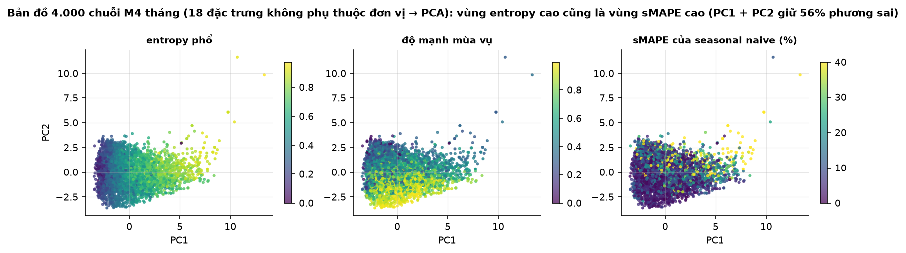
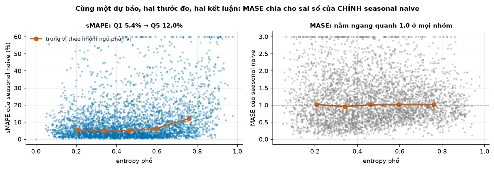
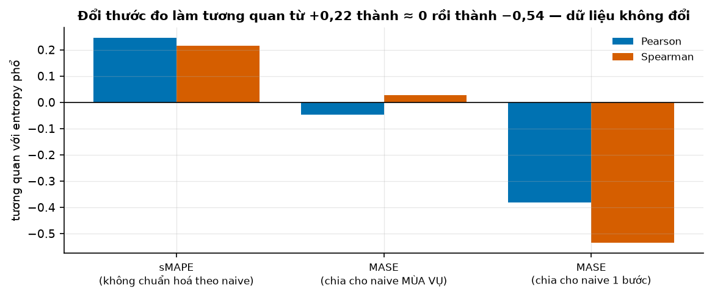
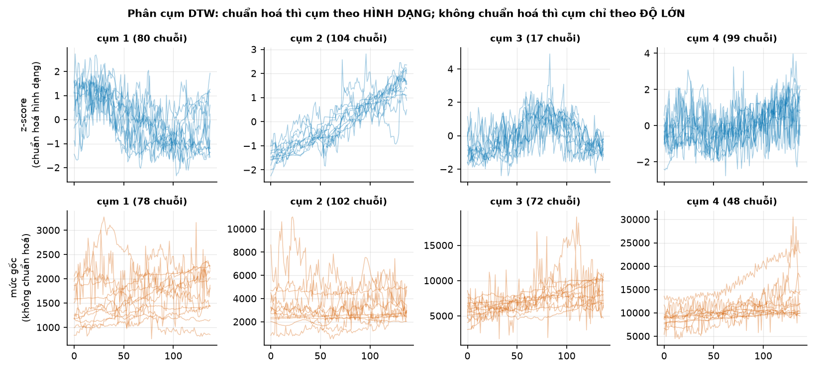
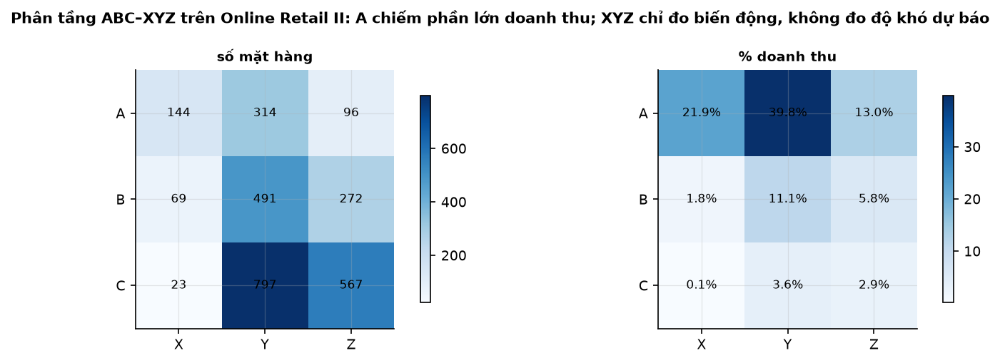

# Buổi 9 — Đặc trưng chuỗi và khả năng dự báo

## 1. Mục tiêu

Sau buổi này bạn:

- Tự viết **20 đặc trưng** cho một chuỗi bằng NumPy/statsmodels, và biết đặc trưng nào phụ thuộc đơn vị đo, đặc trưng nào không.
- Tính **entropy phổ** và dùng nó để xếp hạng độ khó dự báo — kèm cảnh báo: kết luận đổi theo **thước đo sai số** bạn chọn.
- Vẽ **bản đồ tập dữ liệu** (PCA trên không gian đặc trưng), tìm vùng dễ, vùng khó và chuỗi lạ.
- **Phân cụm hình dạng** bằng DTW — và chứng minh bằng số vì sao phải chuẩn hoá trước.
- Lập bảng **ABC–XYZ** cho dữ liệu bán lẻ, và nói được vì sao XYZ *không* đo được độ khó dự báo.
- Trả lời câu hỏi kinh doanh: **chuỗi nào đáng đầu tư mô hình, chuỗi nào dùng baseline**.

## 2. Nhắc lại buổi trước

- **Phân rã STL** cho ba thành phần; **độ mạnh xu hướng/mùa vụ** $F_T = \max(0, 1 - \operatorname{Var}(R)/\operatorname{Var}(T+R))$ và
  $F_S = \max(0, 1 - \operatorname{Var}(R)/\operatorname{Var}(S+R))$ — hôm nay là hai trong 20 đặc trưng.
- **Phổ công suất** (Welch): năng lượng của chuỗi phân bổ theo tần số. Chuỗi có chu kỳ rõ dồn năng lượng vào vài tần số; nhiễu trắng
  trải đều.
- **Baseline**: seasonal naive lặp lại chu kỳ gần nhất. Mọi mô hình phải so với nó.
- **Chuẩn hoá theo chuỗi** (buổi 5): khi gộp nhiều chuỗi khác thang, phải bỏ mức và biên độ trước khi so sánh hình dạng.

## 3. Trạng thái đầu buổi

Sau `cd lab && python lab.py up`:

| Hạng mục | Trạng thái |
|---|---|
| Dữ liệu | `du-lieu/raw/monash-m4-monthly/m4_monthly_dataset.tsf` — **48.000 chuỗi** tháng, dài 60–2.812, sha256 `473aa4fc814b`; `uci-online-retail-ii/online_retail_II.xlsx` (`572e362708e6`) — 1.067.371 dòng hoá đơn |
| Nguồn | Monash Time Series Forecasting Repository (Zenodo, CC BY 4.0); UCI Online Retail II (CC BY 4.0) |
| Môi trường | Python 3.12; numpy 2.5.3, pandas 3.0.5, scipy 1.18.1, statsmodels 0.15.0, scikit-learn 1.9.1, dtaidistance 2.5.1 |
| `code/dac_trung.py` | `doc_tsf`, `lay_mau`, `doc_ban_le`, `entropy_pho`, `dac_trung_mot_chuoi`, `bang_dac_trung`, `du_bao_mua_vu`, `smape`, `mase`, `danh_gia_kho_de`, `tuong_quan_kho_de`, `de_xuat_chien_luoc`, `khong_gian_dac_trung`, `phan_cum_dtw`, `abc_xyz` |
| **Đang cố tình sai** | `tuong_quan_kho_de` chỉ báo **MASE** (và chỉ Pearson); `phan_cum_dtw` mặc định **không chuẩn hoá**; `de_xuat_chien_luoc` bảo *mọi* chuỗi đều "đáng đầu tư mô hình" |
| **Triệu chứng** | "entropy không liên quan gì tới độ khó" (r = −0,05); các cụm DTW chỉ khác nhau về độ lớn; kế hoạch tune cả 4.000 chuỗi |
| `python lab.py check` lúc này | ĐỎ: 4/10 test hỏng |

## 4. Lý thuyết

### 4.1 Vì sao cần đặc trưng

Với 48.000 chuỗi, không ai xem từng hình. Đặc trưng biến mỗi chuỗi thành **một điểm trong không gian vài chục chiều**, rồi mọi câu hỏi
("chuỗi nào giống nhau", "chuỗi nào lạ", "chuỗi nào khó") trở thành câu hỏi hình học. FPP dùng đúng cách này để vẽ cả tập dữ liệu trên
một hình.

Nguyên tắc chọn đặc trưng: (1) **không phụ thuộc đơn vị** — nếu không, mọi thứ chỉ phản ánh doanh nghiệp to hay nhỏ; (2) **không phụ
thuộc độ dài** — chuỗi 2.800 điểm và 60 điểm phải so được; (3) **có diễn giải** — để giải thích được cho người dùng.

### 4.2 Hai mươi đặc trưng tự viết

| Nhóm | Đặc trưng | Ý nghĩa |
|---|---|---|
| Quy mô (2) | trung bình, độ lệch chuẩn | chỉ để tham chiếu — **không** đưa vào PCA nếu chưa chuẩn hoá |
| Phân phối (3) | hệ số biến thiên, độ lệch, độ nhọn | mức biến động tương đối, đuôi |
| Phụ thuộc (4) | acf1, acf10 (tổng bình phương 10 trễ đầu), acf mùa vụ, acf1 của sai phân | quá khứ nói gì về tương lai |
| Phân rã STL (5) | $F_T$, $F_S$, spike, độ dốc và độ cong xu hướng | cấu trúc |
| Hình dạng (4) | tỷ lệ 0, số lần cắt trung bình, đoạn phẳng, bất ổn định | chuỗi thưa, chuỗi bậc thang, mức trôi |
| Tần số + dừng (2) | **entropy phổ**, p-value KPSS | độ "ngẫu nhiên", tính dừng |

**Entropy phổ.** Chuẩn hoá phổ Welch thành phân phối xác suất $p_i = P_i / \sum_j P_j$ (bỏ bin tần số 0 vì đó là mức trung bình), rồi

$$
H = \frac{-\sum_i p_i \ln p_i}{\ln N_{\text{bin}}} \in [0, 1]
$$

FPP: entropy gần 0 nghĩa là chuỗi "has strong trend and seasonality (and so is easy to forecast)"; gần 1 là "very noisy (and so is
difficult to forecast)". Đại lượng $\Omega = 1 - H$ chính là **forecastability** của ForeCA (Goerg, 2013).

```python
_, P = signal.welch(y - y.mean(), fs=1.0, nperseg=min(256, y.size))
p = P[1:] / P[1:].sum()
H = -np.sum(p * np.log(p)) / np.log(p.size)
```

**Cạm bẫy độ dài.** Chuỗi M4 dài 60–2.812 điểm; nhiều đặc trưng (acf10, entropy, spike) phụ thuộc độ dài. Buổi này **cắt mọi chuỗi về
120 điểm cuối** trước khi trích — nếu không, PCA sẽ chủ yếu vẽ ra… độ dài.



**Đọc hình.** Ba ô cùng một bản đồ PCA (20 đặc trưng, đã chuẩn hoá; PC1+PC2 giữ ~45% phương sai), chỉ khác màu. Vùng bên phải sáng ở ô
"entropy phổ" cũng là vùng sáng ở ô "sMAPE" — tức **vùng entropy cao thật sự khó dự báo hơn**; vùng đó tối ở ô "độ mạnh mùa vụ". Bản đồ
này là công cụ để chọn mẫu đại diện khi thử mô hình, và để tìm chuỗi lạ (chấm nằm tách hẳn).

### 4.3 Khả năng dự báo — và cái bẫy của thước đo

Câu hỏi: entropy có dự báo được **sai số thật** không? Cách kiểm: với mỗi chuỗi, dự báo 18 điểm cuối bằng seasonal naive rồi đo sai số.

Ba thước đo cho **cùng một dự báo**:

$$
\text{sMAPE} = \frac{200}{h}\sum \frac{\lvert y_t - \hat y_t\rvert}{\lvert y_t\rvert + \lvert \hat y_t\rvert}, \qquad
\text{MASE} = \frac{\frac1h\sum \lvert y_t - \hat y_t \rvert}{\frac{1}{T-m}\sum_{t>m} \lvert y_t - y_{t-m}\rvert}
$$



**Đọc hình.** Trái: mỗi chấm là một chuỗi; đường cam là trung vị theo ngũ phân vị entropy — **5,38% → 4,87% → 5,15% → 6,11% → 12,04%**.
Phải: cùng dữ liệu, trục đứng là MASE — đường cam **nằm ngang quanh 1,0** (1,02 / 0,95 / 1,01 / 1,02 / 1,02).

Vì sao? MASE chia sai số cho **MAE của chính naive mùa vụ trong mẫu**. Khi mô hình được chấm *là* seasonal naive, mẫu số đã chứa đúng
phần khó mà entropy đang đo — nó tự triệt tiêu. Đây không phải lỗi của MASE (nó được thiết kế để so *các mô hình* trên *cùng* chuỗi),
mà là lỗi khi dùng nó để so **độ khó giữa các chuỗi**.



**Đọc hình.** Tương quan giữa entropy và sai số của cùng một dự báo: **+0,25 / +0,22** (sMAPE), **−0,05 / +0,03** (MASE chia naive mùa
vụ), **−0,38 / −0,54** (MASE chia naive một bước). Con số cuối nói ngược hẳn: "entropy càng cao càng dễ". Lý do: chuỗi entropy cao thì
naive một bước cũng rất tệ, nên mẫu số phình ra nhanh hơn tử số.

**Quy tắc rút ra:** trước khi kết luận "đặc trưng X dự báo được độ khó", hãy hỏi **mẫu số của thước đo là gì**. Báo cáo ít nhất hai
thước đo và cả hai hệ số tương quan (Pearson cho quan hệ tuyến tính, Spearman cho thứ hạng).

### 4.4 Chuỗi nào đáng đầu tư mô hình

Kết hợp hai đặc trưng: entropy cao (≥ 0,666 — phân vị 80% của mẫu) **và** mùa vụ yếu ($F_S$ < 0,4) → nhóm "dùng baseline".

| Nhóm | Số chuỗi | sMAPE trung vị của seasonal naive |
|---|---|---|
| dùng baseline | 137 | **18,11%** |
| đáng đầu tư mô hình | 3.863 | **6,05%** |

Nhóm 137 chuỗi này khó gấp ba. Điều đó **không** có nghĩa là mô hình phức tạp sẽ cứu được chúng — ngược lại: chúng gần nhiễu, nên khoảng
cách giữa mô hình tốt nhất và baseline rất hẹp. Chiến lược hợp lý là dùng baseline, dồn thời gian tune cho phần còn lại, và báo cho người
dùng biết khoảng bất định lớn.

arXiv:2511.08884 (2025) mở rộng ý này cho việc chọn mô hình: "large time series foundation models (TSFMs) systematically outperform
lightweight task-trained baselines when $\Omega$ is high, while their advantage vanishes as $\Omega$ drops" — ta sẽ gặp lại ở buổi 34–35.

### 4.5 Phân cụm theo hình dạng bằng DTW

**Trực giác.** Hai cửa hàng cùng có đỉnh Tết nhưng lệch nhau một tuần: khoảng cách Euclid coi chúng rất khác nhau; **DTW** (dynamic time
warping) cho phép "kéo giãn" trục thời gian để khớp các đỉnh, nên coi chúng giống nhau.

$$
D(i,j) = d(x_i, y_j) + \min\{D(i-1,j),\; D(i,j-1),\; D(i-1,j-1)\}
$$

Ràng buộc **Sakoe–Chiba** (cửa sổ ±w) chặn việc kéo giãn vô hạn và giảm chi phí tính.

**Bắt buộc chuẩn hoá trước.** DTW so **giá trị**, nên chuỗi doanh thu 10.000 và chuỗi 100 sẽ vào hai cụm khác nhau dù hình dạng y hệt.



**Đọc hình.** Hàng trên (z-score từng chuỗi): bốn cụm khác nhau về **hình dạng** — mức trung vị của các cụm là 2.882 / 4.891 / 2.951 /
4.164, lộn xộn, tức cụm không liên quan tới độ lớn. Hàng dưới (mức gốc): mức trung vị theo cụm **1.585 → 3.310 → 6.835 → 9.832**, tăng
đều — thuật toán chỉ mới sắp xếp các chuỗi theo độ lớn, một việc mà `sort()` làm được.

```python
from dtaidistance import dtw
D = dtw.distance_matrix_fast([chuan_hoa_hinh_dang(v) for v in day], window=10)   # 300×300 trong 0,3 s
nhan = fcluster(linkage(squareform(D + D.T, checks=False), method="ward"), 4, criterion="maxclust")
```

### 4.6 Phân tầng ABC–XYZ

Cách doanh nghiệp chia chiến lược: **ABC** theo giá trị (Kourentzes: "A – 20% top items; B – 30% middle items; and C – 50% bottom
items"), **XYZ** theo độ biến động (hệ số biến thiên, ngưỡng quy ước 0,5 và 1,0).



**Đọc hình.** 2.773 mã hàng có ít nhất 12 tháng doanh thu. Nhóm A chiếm **74,7%** doanh thu. Ô AX (giá trị cao, biến động thấp) chỉ có
144 mã — đây là nơi đáng đầu tư mô hình tốt nhất; ô CZ có 567 mã, giá trị nhỏ và biến động lớn, hợp với baseline.

**Nhưng XYZ không đo được độ khó dự báo.** Kourentzes: "Consider an item that has more or less level sales with a lot of variability and
an item that has seasonal sales with no randomness whatsoever. The first is difficult to forecast, while the second is as easy as it gets
… the coefficient of variation would not indicate this". Số đo của buổi xác nhận: hệ số biến thiên × MASE(snaive) có Spearman **−0,11** —
gần như không liên quan. (Với sMAPE thì CV lại tương quan mạnh, 0,77 — nhưng đó chủ yếu vì cả hai cùng phản ánh mức nhiễu tương đối.)
Cách làm đúng theo Kourentzes: thay trục XYZ bằng **sai số thật của baseline**.

### 4.7 Tìm chuỗi lạ

Trước khi mô hình hoá 48.000 chuỗi, luôn có vài chuỗi hỏng. Ba dấu hiệu rẻ tiền, đều nằm trong 20 đặc trưng:

- **Chuỗi hằng**: `kpss` ném `ValueError: cannot convert float NaN to integer` → đặc trưng `kpss_p` là NaN (mẫu 4.000 chuỗi có **1** chuỗi).
- **Chuỗi bậc thang / nhiều giá trị lặp**: `doan_phang` — tỷ lệ điểm rơi vào một bin giá trị; **50 chuỗi** có > 50%.
- **Chuỗi thưa**: `ty_le_0` cao — dữ liệu đếm nhu cầu gián đoạn, cần mô hình riêng (buổi 19).

Ý tưởng **FFORMA** (Montero-Manso et al., 2020) đi xa hơn: dùng chính bộ đặc trưng này làm đầu vào cho một meta-model học **trọng số kết
hợp** các phương pháp — "The approach achieved second position in the M4 competition". Buổi 24 sẽ dựng lại.

### 4.8 Từ tự viết sang thư viện

Tự viết 20 đặc trưng để biết mỗi con số nghĩa là gì; nhưng khi lên sản xuất thì dùng thư viện. Ba lựa chọn phổ biến, đã thử trên đúng
tập dữ liệu của buổi này:

| Thư viện | Số đặc trưng | Thời gian / 200 chuỗi | Ghi chú |
|---|---|---|---|
| tự viết (buổi này) | 20 | ~2 s | hiểu được từng dòng, sửa được |
| Nixtla `tsfeatures` 0.4.5 | 42 | ~77 s | bản phát hành cuối 2023-06-20 (đóng băng), theo đúng bộ của FPP |
| `pycatch22` 0.5.0 | 22 | rất nhanh (C) | chỉ có sdist, cần trình biên dịch C, **không khai numpy** trong dependency |
| `tsfresh` 0.21.2 | 782 | rất nặng | dùng khi có bước chọn lọc đặc trưng tự động |

**catch22 ra đời thế nào.** Nhóm tác giả lấy thư viện hctsa (**4.791 đặc trưng** sau lọc), chạy trên 93 bộ dữ liệu phân loại chuỗi, loại
các đặc trưng kém và các đặc trưng trùng lặp, còn lại 22: "This dimensionality reduction, from 4791 to 22, is achieved by evaluating
performance … across 93 real-world time-series classification tasks". Bài học: **nhiều đặc trưng không đồng nghĩa với nhiều thông tin** —
phần lớn tương quan chặt với nhau. Hai mươi đặc trưng chọn có chủ đích thường đủ.

Lưu ý khi so số liệu giữa các nguồn: entropy phổ của `tsfeatures` tính bằng periodogram của Goerg, của buổi này tính bằng Welch với
`nperseg=min(256, n)`. Hai con số **không so trực tiếp được**; luôn ghi phương pháp và tham số vào báo cáo.

## 5. Lab từng bước

### Bước 1 — Chạy code đầu buổi

```bash
cd lab && python lab.py up
python lab.py chay ../code/dac_trung.py
python lab.py check                # 4/10 đỏ
```

### Bước 2 — Trích 20 đặc trưng cho 4.000 chuỗi

`doc_tsf()` → `lay_mau(..., 4000)` → `bang_dac_trung(...)` (~40 s). Kiểm: mọi chuỗi cùng độ dài 138; `do_manh_mua_vu` của một chuỗi mùa vụ
nhân tạo > 0,9.

### Bước 3 — Bản đồ PCA

`khong_gian_dac_trung(bang)` (StandardScaler + PCA). Tô màu theo entropy, $F_S$, sMAPE. Tìm 3 chuỗi nằm xa nhất và vẽ chúng ra.

### Bước 4 — Entropy so với sai số thật

`danh_gia_kho_de(chuoi)` cắt 18 điểm cuối làm test, dự báo bằng seasonal naive (m = 12) và trả ba cột sai số. Sau đó sửa
`tuong_quan_kho_de` để báo **cả ba thước đo** và **cả hai hệ số** (Pearson và Spearman) — hiện nó chỉ báo MASE và Pearson, nên bảng kết
luận "entropy vô dụng". Bảng đúng phải ra:

| đặc trưng | thước đo | Pearson | Spearman |
|---|---|---|---|
| entropy_pho | sMAPE | 0,245 | 0,216 |
| entropy_pho | MASE (naive mùa vụ) | −0,048 | 0,027 |
| entropy_pho | MASE (naive 1 bước) | −0,381 | −0,535 |

Viết hai câu giải thích vì sao MASE cho ≈ 0 còn MASE chia naive-1 lại đảo dấu. Kiểm chéo: trung vị MASE trong **mọi** ngũ phân vị entropy
đều ≈ 1,0 — đó là bằng chứng trực tiếp rằng mẫu số đã hấp thụ hết độ khó.

### Bước 5 — Phân cụm hình dạng và chiến lược

Bật chuẩn hoá trong `phan_cum_dtw`; kiểm bằng phép thử "nhân một chuỗi với 100 phải giữ nguyên cụm". Trước và sau khi sửa, in **mức trung
vị theo cụm**: nếu nó tăng đều (1.585 → 3.310 → 6.835 → 9.832) thì bạn đang phân cụm theo độ lớn, không phải hình dạng.

Sửa `de_xuat_chien_luoc` để tách nhóm "dùng baseline" (entropy ≥ 0,666 **và** $F_S$ < 0,4) — hiện nó trả về một nhãn duy nhất cho mọi
chuỗi. Cuối cùng lập bảng ABC–XYZ cho dữ liệu bán lẻ bằng `abc_xyz(doc_ban_le())` và trả lời: ô nào đáng đầu tư mô hình nhất, và vì sao
ô đó **không** trùng với "ô khó dự báo nhất".

```bash
python lab.py check                # 10/10 xanh
```

## 6. Lỗi thường gặp & cách chẩn đoán

| Triệu chứng | Nguyên nhân | Chẩn đoán | Sửa |
|---|---|---|---|
| "Đặc trưng không liên quan tới độ khó" | dùng MASE của chính baseline đang chấm | xem mẫu số của thước đo | thêm sMAPE hoặc skill score |
| Tương quan **đảo dấu** khi đổi thước đo | thang chuẩn hoá khác (naive mùa vụ vs naive 1 bước) | báo cả hai | nói rõ thước đo trong mọi kết luận |
| PCA chỉ vẽ ra quy mô | quên `StandardScaler` | xem trọng số PC1 | chuẩn hoá trước PCA |
| PCA chỉ vẽ ra độ dài chuỗi | chuỗi dài ngắn khác nhau | tương quan độ dài × đặc trưng | cắt về cùng độ dài |
| Cụm DTW chỉ khác nhau về mức | không chuẩn hoá từng chuỗi | mức trung vị theo cụm có tăng đều không | z-score trước khi tính DTW |
| DTW chạy rất chậm | không có ràng buộc cửa sổ | đo thời gian | `window=` (Sakoe–Chiba) |
| Entropy thấp nhưng vẫn khó dự báo | chuỗi có xu hướng mạnh: phổ dồn vào tần số thấp | so entropy của chuỗi gốc và chuỗi đã sai phân | tính trên phần dư STL hoặc sau sai phân |
| `kpss` báo `cannot convert float NaN to integer` | chuỗi hằng | `y.std() == 0` | bọc try/except, đánh dấu chuỗi lạ |
| XYZ gọi chuỗi mùa vụ mạnh là "khó" | CV đo biến động, không đo độ khó | so CV với sai số thật | thay trục XYZ bằng sai số baseline |
| Số liệu entropy không tái lập | mỗi thư viện một mặc định (Welch vs periodogram, `nperseg`) | in tham số | chốt phương pháp, ghi vào báo cáo |
| Tune tất cả các chuỗi | không phân tầng | đếm chuỗi nhóm "vô vọng" | dùng baseline cho nhóm khó |

## 7. Bài tập về nhà

1. **Entropy sau khi khử xu hướng.** Tính entropy phổ trên chuỗi gốc và trên phần dư STL. Tương quan với sMAPE đổi thế nào? Cái nào nên
   dùng để xếp hạng độ khó?
2. **Skill score.** Định nghĩa $\text{skill} = 1 - \text{MAE}(\text{snaive}) / \text{MAE}(\text{naive})$ cho từng chuỗi và tương quan với
   entropy. Kết quả nói gì so với hai thước đo trong bài?
3. **Cụm và chiến lược.** Với 4 cụm DTW, tính sMAPE trung vị của seasonal naive trong từng cụm. Cụm nào nên dùng baseline? So với cách
   phân tầng bằng entropy + $F_S$.

## 8. Tiêu chí "Xong khi"

- [ ] `python lab.py check` xanh 10/10.
- [ ] Nộp bản đồ tập dữ liệu (PCA) + bảng "chuỗi nào đáng đầu tư mô hình, chuỗi nào dùng baseline" kèm số chuỗi và sMAPE trung vị mỗi nhóm.
- [ ] Giải thích bằng số vì sao entropy tương quan +0,22 với sMAPE nhưng ≈ 0 với MASE và −0,54 với MASE chia naive-1.
- [ ] Chứng minh phân cụm của bạn theo **hình dạng**: nhân một chuỗi với 100 không đổi cụm.
- [ ] Chỉ ra ít nhất 2 chuỗi lạ trong tập và nói dấu hiệu nào phát hiện ra chúng.

## 9. Đọc thêm

- Hyndman, R.J., Athanasopoulos, G. et al. *FPP, the Pythonic Way* — ch. 4 Time series features: https://otexts.com/fpppy/nbs/04-features.html
- Lubba, C.H. et al. (2019). catch22: CAnonical Time-series CHaracteristics. *Data Mining and Knowledge Discovery* 33, 1821–1852.
- Goerg, G.M. (2013). Forecastable Component Analysis. *ICML*; arXiv:1205.4591.
- *Time Series Forecastability Measures* (2025), arXiv:2507.13556; *Spectral Predictability as a Fast Reliability Indicator* (2025),
  arXiv:2511.08884.
- Montero-Manso, P., Athanasopoulos, G., Hyndman, R.J. & Talagala, T.S. (2020). FFORMA. *IJF* 36(1), 86–92.
- Kourentzes, N. (2016). ABC-XYZ analysis for forecasting: https://kourentzes.com/forecasting/2016/10/15/abc-xyz-analysis-for-forecasting/
- Thư viện: Nixtla `tsfeatures` (42 đặc trưng, đóng băng từ 2023), `tsfresh` (782 đặc trưng), `pycatch22`, `tslearn`, `dtaidistance`.
- Godahewa, R. et al. (2021). Monash Time Series Forecasting Archive. *NeurIPS Datasets and Benchmarks*.
