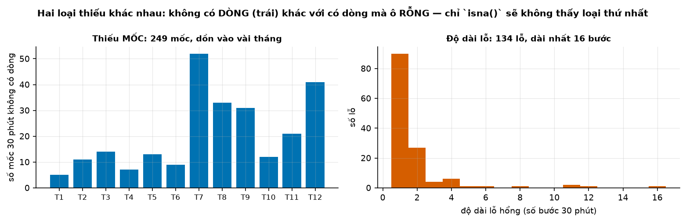
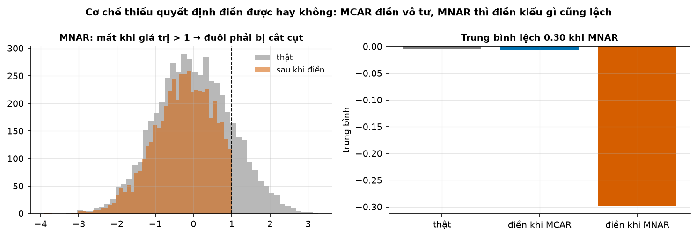
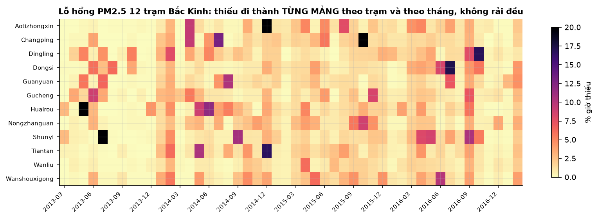
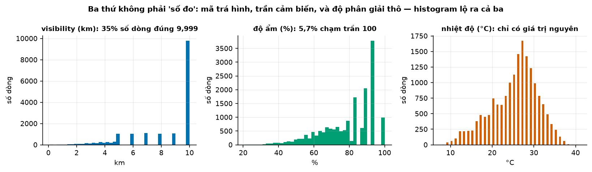
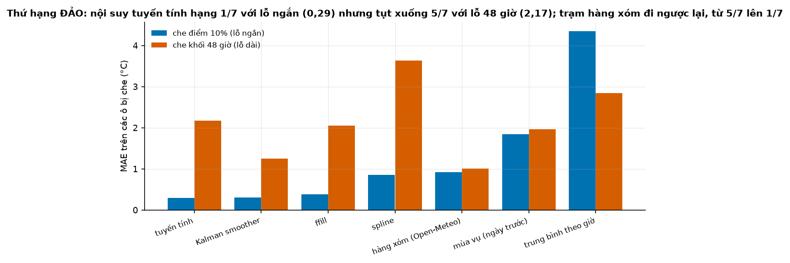
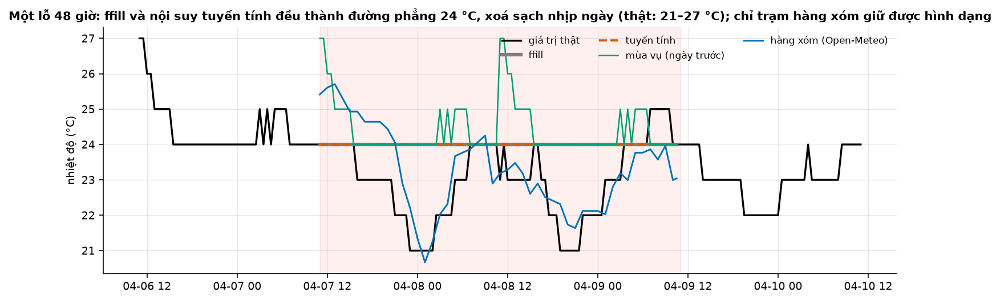

# Buổi 10 — Làm sạch và dữ liệu thiếu

## 1. Mục tiêu

Sau buổi này bạn:

- Phân biệt **thiếu mốc** (không có dòng) với **thiếu giá trị** (có dòng, ô rỗng), và biết vì sao `isna()` không thấy loại thứ nhất.
- Gọi tên cơ chế thiếu **MCAR, MAR, MNAR**, và chỉ ra bằng số vì sao MNAR làm lệch kết quả dù điền kiểu gì.
- Nhận ra những giá trị trông như số đo mà không phải: **mã trá hình**, **trần cảm biến**, **độ phân giải thô**, **cảm biến đứng yên**, cột
  số lưu dạng chữ; đọc **cờ chất lượng** của nguồn thay vì tự đoán.
- Chọn cách điền trong **7 cách** theo độ dài lỗ và theo việc cách đó có dùng tương lai không.
- Đánh giá cách điền bằng **che nhân tạo hai kiểu**, và thấy thứ hạng đảo giữa lỗ ngắn và lỗ dài.
- Viết pipeline làm sạch **chỉ điền lỗ ngắn, có cột cờ truy vết**, qua được bài kiểm rò rỉ tương lai.

## 2. Nhắc lại buổi trước

Từ buổi 1–3:

- **Lưới thời gian đầy đủ**: dựng đủ mọi mốc rồi `reindex`; mốc không có số liệu thành **NaN** ("không biết"), không phải 0 ("đo được,
  bằng không"). Làm việc trên giờ **UTC**.
- **Rò rỉ tương lai**: dùng thông tin chưa có ở thời điểm ra dự báo. Kết quả đánh giá đẹp giả tạo.
- **MAE**: trung bình |thực tế − dự báo|.

Từ buổi 8–9:

- **Hồi quy đơn** $y = a + b x$: đường thẳng khớp dữ liệu nhất. **Tương quan** $r$ gần 1 là hai chuỗi lên xuống cùng nhau.
- **Chuỗi hằng** làm KPSS vỡ; **đoạn phẳng** (nhiều điểm cùng một giá trị) là dấu hiệu chuỗi bậc thang. Hôm nay tìm hiểu vì sao dữ liệu có
  những dấu hiệu đó.

## 3. Trạng thái đầu buổi

Sau `python lab.py up` (trong thư mục `lab/`):

| Hạng mục | Trạng thái |
|---|---|
| Dữ liệu 1 | `du-lieu/raw/ghcnh-noi-bai-2024/GHCNh_VMI0000VVNB_2024.parquet` — trạm khí tượng sân bay Nội Bài, 17.319 dòng mốc 30 phút, cả năm 2024, sha256 `1c67048928d4` |
| Dữ liệu 2 | `uci-beijing-air/` — bụi mịn PM2.5 ở 12 trạm Bắc Kinh, 35.064 giờ, 3/2013 → 2/2017 |
| Dữ liệu 3 | `open-meteo-ha-noi-2023-2024.csv` — nhiệt độ mô hình thời tiết cho Hà Nội theo giờ UTC, dùng làm "trạm hàng xóm" |
| Nguồn | NOAA GHCNh (CC0, trạm Việt Nam thật); UCI Beijing Multi-Site Air Quality (CC BY 4.0); Open-Meteo (CC BY 4.0) |
| Môi trường | Python 3.12; numpy 2.5.3, pandas 3.0.5, scipy 1.18.1, statsmodels 0.15.0, pyarrow |
| `code/lam_sach.py` | đọc dữ liệu, `luoi_day_du`, `thong_ke_thieu`, `do_phan_giai`, `doan_mac_ket`, `doan_tra_hinh`, `co_nghi_ngo`, `bao_cao_chat_luong`, 7 hàm `dien_*`, `che_diem`, `che_khoi`, `so_sanh_dien`, `lam_sach`, `mo_phong_mnar`, `bang_chung_mnar` |
| `code/lab.ipynb` | notebook của Lab, bước 1–5 |
| **Đang cố tình sai** | `doc_noi_bai` giữ nguyên kiểu dữ liệu của tệp; `so_sanh_dien` chỉ che ngẫu nhiên từng điểm; `lam_sach` điền **mọi** lỗ bằng nội suy hai phía |
| **Triệu chứng** | báo cáo ghi độ ẩm `min = 100, max = 94`; bảng kết luận "nội suy tuyến tính luôn tốt nhất"; sau làm sạch "còn thiếu: 0", sạch một cách đáng ngờ |
| `python lab.py check` lúc này | ĐỎ: 5/12 test hỏng |

## 4. Lý thuyết

Chuỗi chính: nhiệt độ trạm Nội Bài 2024, mỗi 30 phút một mốc. GHCNh là kho dữ liệu khí tượng theo giờ của NOAA (cơ quan khí quyển Mỹ),
gom từ bản tin thời tiết sân bay và nhiều nguồn khác.

### Từ mới trong buổi

| Thuật ngữ | Nghĩa một câu | Ví dụ |
|---|---|---|
| thiếu mốc / thiếu giá trị | Thiếu mốc: cả dòng không tồn tại. Thiếu giá trị: có dòng, ô rỗng (NaN). | Mục 4.1. |
| lỗ hổng, độ dài lỗ | Một đoạn liền các mốc không có số; độ dài là số bước. | 3 mốc NaN liền nhau = lỗ dài 3 bước. |
| MCAR / MAR / MNAR | Ba cơ chế thiếu: do may rủi; do một thứ khác đã đo được; do chính giá trị bị thiếu. | Mục 4.2. |
| mã trá hình (sentinel) | Một con số quy ước đặt vào ô dữ liệu để báo điều gì đó, không phải số đo. | Tầm nhìn 9.999 km nghĩa là "từ 10 km trở lên". |
| trần cảm biến | Giá trị lớn nhất cảm biến ghi được; thật có thể cao hơn. | Độ ẩm dừng ở 100%. |
| độ phân giải | Bước nhỏ nhất giữa hai giá trị cảm biến ghi được. | Nhiệt độ chỉ có số nguyên: độ phân giải 1 °C. |
| cảm biến đứng yên (stuck sensor) | Cảm biến kẹt, ghi lặp một giá trị nhiều giờ liền. | 26,0; 26,0; … suốt 33 giờ. |
| cờ chất lượng | Mã nguồn dữ liệu gắn kèm mỗi số đo để nói nó qua kiểm tra hay đáng ngờ. | GHCNh: mã `2` = đáng ngờ. |
| điền dữ liệu (imputation) | Ước lượng rồi điền vào chỗ thiếu. | 10, (thiếu), 14 → nội suy điền 12. |
| nhân quả (cách điền) | Chỉ dùng dữ liệu trước chỗ đang điền. | `ffill` nhân quả; nội suy hai phía thì không. |
| spline | Đường cong trơn bậc 3 nối qua các điểm lân cận. | Mục 4.4. |
| Kalman smoother | Ước lượng giá trị ẩn từ một mô hình chuỗi (mức + nhịp ngày), dùng cả quá khứ lẫn tương lai. | Mục 4.4. |
| che nhân tạo | Xoá những ô đang có số rồi điền lại, để có đáp án mà chấm cách điền. | Mục 4.5. |
| cột cờ | Cột thêm vào để đánh dấu ô nào đã bị điền hay bị loại. | `da_dien = True`: số này là số điền. |
| pipeline | Chuỗi bước chạy tự động từ dữ liệu thô tới dữ liệu sạch. | Đọc → lưới → cờ → điền → báo cáo. |
| PM2.5 | Bụi mịn đường kính dưới 2,5 micromet, đo bằng microgam trên mét khối không khí (µg/m³). | 80 µg/m³: ô nhiễm nặng. |
| SAITS, BRITS | Hai mô hình deep learning để điền dữ liệu thiếu, học từ nhiều chuỗi cùng lúc. | Hộp Nâng cao mục 4.6. |

### 4.1 Thiếu mốc, thiếu giá trị, và số 0 trá hình

**Vấn đề.** Câu lệnh đầu tiên hầu như ai cũng chạy là `df.isna().sum()`. Nó chỉ đếm ô rỗng trong những dòng **có mặt**. Dòng không tồn
tại thì nó không thấy.

**Ví dụ số nhỏ — tự tính tay.** Năm dòng nhiệt độ, mỗi 30 phút một mốc:

| Thời điểm | 00:00 | 00:30 | 01:30 | 02:00 | 02:30 |
|---|---|---|---|---|---|
| Nhiệt độ (°C) | 25 | 25 | 26 | NaN | 26 |

**Đọc bảng.** `isna()` báo 1 ô thiếu (02:00). Nhưng từ 00:00 tới 02:30 phải có 6 mốc: mốc 01:00 không có dòng nào. Dựng lưới 6 mốc rồi
`reindex` thì mốc đó hiện ra thành NaN: thiếu thật là **2**.

```python
luoi = pd.date_range(bang.index.min(), bang.index.max(), freq="30min")
day_du = bang.reindex(luoi)          # thiếu mốc → dòng NaN
```

Trước `reindex` phải kiểm **mốc trùng** (hai dòng cùng thời điểm, hay gặp khi ghép hai nguồn): `reindex` báo lỗi nếu chỉ số có giá trị
trùng. Trạm Nội Bài có 0 mốc trùng, nhưng phải kiểm, không được giả định.



**Cách đọc hình.**

1. **Trục ngang**: ô trái là tháng 1 → 12 của năm 2024; ô phải là độ dài lỗ, tính bằng số bước 30 phút.
2. **Trục dọc**: ô trái là số mốc 30 phút không có dòng; ô phải là số lỗ.
3. **Ký hiệu**: mỗi cột xanh là một tháng; mỗi cột cam là một độ dài lỗ.
4. **Nhìn vào đâu**: cột tháng 7 ở ô trái; cột đầu tiên ở ô phải.
5. **Kết luận**: mốc thiếu dồn vào vài tháng (nhiều nhất tháng 7), dấu hiệu sự cố hệ thống; hai phần ba số lỗ chỉ dài một bước, lỗ dài
   nhất 8 giờ.

**Đọc số đo.** Cả năm 2024 có 17.568 mốc, tệp chỉ có 17.319 dòng: 249 mốc không hề tồn tại. Trong những dòng có mặt, `isna()` chỉ
thấy vài ô rỗng và kết luận "gần như hoàn hảo".

**Số 0 trá hình.** Doanh số bằng 0 vì cửa hàng đóng cửa, hay vì hết hàng? Ngày hết hàng, nhu cầu thật cao hơn số bán ghi được. Mô hình học
từ những số 0 đó sẽ dự báo thấp, càng dự báo thấp càng nhập ít, càng hết hàng: một vòng lặp tự củng cố. Ngày hết hàng phải đánh dấu là
**thiếu**, không phải bằng 0.

**Tóm lại.** **Thiếu mốc là cả dòng không có; `isna()` không thấy. Luôn dựng lưới đầy đủ rồi `reindex` trước mọi việc khác, sau khi kiểm
mốc trùng. Số 0 do hết hàng là thiếu, không phải số đo.**

**Tự kiểm tra.** Tệp đo mỗi giờ từ 00:00 tới 23:00 có 21 dòng, trong đó 1 dòng có ô NaN. Thiếu bao nhiêu giờ?

<details>
<summary>Đáp án</summary>

Từ 00:00 tới 23:00 có 24 mốc giờ. Thiếu mốc 24 − 21 = 3, cộng 1 ô NaN: thiếu **4** giờ. `isna()` chỉ báo 1. Nhầm hay gặp: đếm 23 mốc (quên
tính cả mốc 00:00), hay chỉ tin `isna()`.

</details>

### 4.2 Cơ chế thiếu: MCAR, MAR, MNAR

**Vấn đề.** Điền được hay không, không phụ thuộc cách điền giỏi tới đâu, mà phụ thuộc **vì sao** số bị mất (Rubin, 1976).

**Trực giác.**

- **MCAR** (thiếu hoàn toàn ngẫu nhiên): việc mất không liên quan tới gì cả. Mất mạng vài phút. Phần còn lại vẫn đại diện cho toàn bộ.
- **MAR** (thiếu ngẫu nhiên khi đã biết thứ khác): việc mất phụ thuộc một thứ **đã đo được**, như trạm hay hỏng vào mùa mưa. Tên gây hiểu
  lầm: không phải "ngẫu nhiên", mà là "ngẫu nhiên **sau khi** biết mùa". Điền được nếu cách điền dùng thông tin đó.
- **MNAR** (thiếu không ngẫu nhiên): việc mất phụ thuộc **chính giá trị bị mất**. Cảm biến bụi quá tải và tắt khi ô nhiễm cực cao. Không
  cách điền nào dựa trên dữ liệu còn lại cứu được, vì phần còn lại đã bị lọc lệch.

**Ví dụ số nhỏ — tự tính tay.** Bốn giờ PM2.5 thật $(10, 20, 30, 40)$, trung bình 25. Cảm biến tắt khi giá trị trên 30 (MNAR).

- Còn lại $(10, 20, 30)$, trung bình 20. Điền giờ mất bằng trung bình phần còn lại thì chuỗi thành $(10, 20, 30, 20)$, trung bình vẫn 20:
  lệch 5. Không cách điền nào dựa trên ba số còn lại biết được số mất là 40.
- Nếu mất một giờ bất kỳ do may rủi (MCAR), trung bình phần còn lại lúc cao lúc thấp hơn thật; tính qua nhiều lần mất thì không lệch.



**Cách đọc hình.**

1. **Trục ngang**: ô trái là giá trị (mô phỏng 5.000 điểm hình chuông tâm 0, seed 0); ô phải là ba trường hợp.
2. **Trục dọc**: ô trái là số điểm mỗi khoảng giá trị; ô phải là trung bình.
3. **Ký hiệu**: ô trái, xám là dữ liệu thật, cam là sau khi điền, vạch đứt là ngưỡng 1 mà cảm biến tắt; ô phải, mỗi cột một trung bình.
4. **Nhìn vào đâu**: phần bên phải vạch đứt ở ô trái; cột cam ở ô phải.
5. **Kết luận**: MNAR mất 16,2% số điểm, toàn ở phía cao; sau khi điền (nội suy), trung bình là −0,30 so với −0,005 thật, còn MCAR chỉ lệch
   một phần nghìn.

**Kiểm MNAR trên dữ liệu thật: đo, đừng đoán.** Khi trạm Dongsi (Bắc Kinh) mất số liệu, bụi mịn ở 11 trạm còn lại cao hay thấp hơn bình
thường? Nếu cao hẳn thì trạm có vẻ mất số đúng lúc ô nhiễm nặng.

| Trạm Dongsi | Giá trị |
|---|---|
| Tỷ lệ giờ thiếu | 2,14% |
| PM2.5 các trạm khác khi Dongsi thiếu | 76,8 µg/m³ |
| PM2.5 các trạm khác khi Dongsi có số | 79,2 µg/m³ |

**Đọc bảng.** Khi Dongsi thiếu, các trạm khác còn **thấp hơn** 3,0%: không có bằng chứng MNAR ở đây. Đây là kết quả thật, và bài học là
phải kiểm theo cả hai chiều, không giả định.



**Cách đọc hình.**

1. **Trục ngang**: tháng, 3/2013 → 2/2017.
2. **Trục dọc**: 12 trạm Bắc Kinh.
3. **Ký hiệu**: mỗi ô là phần trăm giờ thiếu của một trạm trong một tháng; vàng nhạt gần 0, đen từ 20% trở lên.
4. **Nhìn vào đâu**: các ô đen và tím lẻ loi.
5. **Kết luận**: thiếu trung bình chỉ 2,08%, nhưng có tháng một trạm mất tới 48% số giờ: một con số "thiếu 2%" che mất chuyện một trạm
   chết nửa tháng.

**Tóm lại.** **MCAR điền được thoải mái; MAR điền được nếu cách điền dùng thứ giải thích việc thiếu; MNAR thì điền kiểu gì cũng lệch. Kiểm
cơ chế bằng số, và báo tỷ lệ thiếu theo trạm, theo tháng, không chỉ một con số chung.**

**Tự kiểm tra.** Cửa hàng không ghi doanh số những ngày mất điện; mất điện hay xảy ra vào ngày mưa bão, mà ngày mưa bão thì ít khách. Ta có
dữ liệu thời tiết. Đây là cơ chế nào, và điền thế nào?

<details>
<summary>Đáp án</summary>

**MAR**: việc thiếu phụ thuộc thời tiết, một thứ **đã đo được**. Điền bằng cách có dùng thời tiết (ví dụ trung bình doanh số của những ngày
mưa bão khác). Điền bằng trung bình mọi ngày thì lệch lên, vì ngày thiếu vốn là ngày ít khách. Nhầm hay gặp: gọi là MNAR; nó chỉ là MNAR nếu
việc mất phụ thuộc chính doanh số mà không có biến nào giải thích được.

</details>

### 4.3 Những giá trị trông như số đo mà không phải

**Vấn đề.** Không có NaN nào, không có lỗi nào, mà con số vẫn sai. Bốn thủ phạm hay gặp, cộng một bẫy kiểu dữ liệu.

**Ví dụ số nhỏ — tự tính tay.**

- **Mã trá hình.** Tầm nhìn $(5;\ 8;\ 9{,}999;\ 9{,}999;\ 6)$ km, trung bình 7,8 km. Nhưng 9,999 là mã của bản tin thời tiết sân bay,
  nghĩa là "từ 10 km trở lên": hai giá trị đó có thể lớn hơn nhiều, nên trung bình thật **không tính được**.
- **Độ phân giải thô.** Nhiệt độ thật $(25{,}6;\ 25{,}8;\ 26{,}1;\ 26{,}3;\ 26{,}4)$ °C, ghi làm tròn tới số nguyên thành
  $(26, 26, 26, 26, 26)$. Trông như cảm biến đứng yên, dù nhiệt độ thật đổi gần 1 °C.



**Cách đọc hình.**

1. **Trục ngang**: ô trái là tầm nhìn (km); ô giữa là độ ẩm (%); ô phải là nhiệt độ (°C).
2. **Trục dọc**: số dòng rơi vào mỗi khoảng giá trị.
3. **Ký hiệu**: mỗi cột một khoảng giá trị (histogram).
4. **Nhìn vào đâu**: cột cao vọt ở mép phải của ô trái; cột ở 100% của ô giữa; các khe trống đều đặn ở ô phải.
5. **Kết luận**: hơn một phần ba số dòng tầm nhìn đúng bằng 9,999 (mã, không phải số đo); 5,7% số dòng độ ẩm chạm trần; nhiệt độ chỉ có
   số nguyên.

Chuỗi nhiệt độ có một đoạn **67 bước liên tiếp** (33,5 giờ) đúng 26,0 °C, bắt đầu ngày 8/6/2024. Cảm biến chết? Có thể.

Nhưng đặt ngưỡng "đứng yên" 12 giờ thì có tới 24 đoạn, quá nhiều để đều là hỏng. Với độ phân giải một độ, một đêm nhiệt độ thật chỉ đổi
vài phần mười độ vẫn hiện ra thành giá trị lặp. Quy tắc: **đo độ phân giải trước**, rồi mới đặt ngưỡng; buổi này dùng 18 giờ.

**Cờ chất lượng: đọc tài liệu nguồn, đừng đoán.** Theo tài liệu GHCNh (bảng 3):

| Mã | Nghĩa |
|---|---|
| `1` | qua mọi bước kiểm tra chất lượng |
| `2`, `3` | đáng ngờ, sai |
| `4` | mới qua bước kiểm giới hạn thô (dữ liệu từ nguồn của NOAA) |
| `6`, `7` | đáng ngờ, sai (từ nguồn của NOAA) |
| `o`, `f` | ngoài phạm vi; một trong các số đo đầu vào bị gắn cờ (cho đại lượng tính từ số khác, như độ ẩm) |

**Đọc bảng.** Nhiều người coi mã `4` là lỗi; không phải. Nhóm cần loại là `2, 3, 6, 7, o, f`. Ở trạm này có 7 dòng nhiệt độ mã `2`.

**Bẫy kiểu dữ liệu.** Trong tệp parquet gốc, độ ẩm và tầm nhìn lưu dạng **chữ**. Không có lỗi nào báo ra, chỉ có kết quả sai: `min()` và
`max()` so theo thứ tự chữ cái, nên độ ẩm ra `min = '100'`, `max = '94'` ("1" đứng trước "9"). Sửa: `pd.to_numeric(..., errors="coerce")`
cho mọi cột đo. Việc đầu tiên sau khi đọc dữ liệu: in `dtypes` và bảng min/max.

Hai lỗi nữa không tạo NaN, kiểm bằng min/max theo năm và giờ nóng nhất theo từng giai đoạn:

- **đổi đơn vị** giữa chừng: nhiệt độ ghi ×10 (260 là 26,0 °C), mức nhảy bậc đúng vào một mốc tròn;
- **đổi múi giờ**: nhịp ngày lệch pha, giờ nóng nhất dời từ 13h sang 6h.

Dải nhiệt độ Nội Bài là 8–40 °C, và GHCNh lẫn Open-Meteo đều ghi giờ UTC, nên không có hai lỗi này.

**Tóm lại.** **Trước khi tin một con số: ép kiểu số, xem histogram tìm mã trá hình và trần, đo độ phân giải trước khi gọi một đoạn lặp là
cảm biến chết, và tra bảng cờ chất lượng của nguồn.**

**Tự kiểm tra.** Cảm biến $A$ ghi nhiệt độ tới 0,1 °C, cảm biến $B$ tới 1 °C. Mỗi cái có một đoạn lặp đúng một giá trị suốt 20 giờ, cả ngày
lẫn đêm. Đoạn của cảm biến nào đáng ngờ hơn?

<details>
<summary>Đáp án</summary>

**Cảm biến $A$.** Với độ phân giải 0,1 °C, chỉ cần nhiệt độ đổi 0,1 °C là số đã khác; ngày đêm chênh vài độ mà 20 giờ không đổi một
số thì gần như chắc cảm biến kẹt. Với cảm biến $B$ (1 °C), đoạn lặp dài có thể chỉ là nhiệt độ đổi ít (mục 4.3). Nhầm hay gặp: dùng một ngưỡng
"đứng yên" cho mọi cảm biến.

</details>

### 4.4 Bảy cách điền: khi nào dùng, khi nào không

**Vấn đề.** Có nhiều cách điền một lỗ. Cách nào đúng tuỳ lỗ dài hay ngắn, chuỗi có nhịp ngày không, có nguồn tương quan không, và **có
được dùng tương lai không**.

**Ví dụ số nhỏ — tự tính tay.** Sáu giờ liền, giá trị thật của hai ô thiếu là 26 và 28:

- Hôm nay: $(21, 23, ?, ?, 27, 25)$.
- Hôm qua cùng giờ: $(20, 22, 25, 27, 26, 24)$.
- Trạm hàng xóm hôm nay: $(20, 22, 25, 27, 26, 24)$; trên những giờ cả hai có số, trạm ta luôn cao hơn hàng xóm 1 °C.

| Cách điền | Điền được | \|sai số\| | Dùng tương lai? |
|---|---|---|---|
| `ffill` (giữ số gần nhất) | 23; 23 | 3; 5 | không |
| tuyến tính (nối 23 với 27) | 24,33; 25,67 | 1,67; 2,33 | có |
| spline (tính bằng máy) | 25,2; 26,8 | 0,8; 1,2 | có |
| mùa vụ (cùng giờ hôm qua) | 25; 27 | 1; 1 | không |
| hàng xóm (số hàng xóm + 1) | 26; 28 | 0; 0 | không, nếu hệ số học từ quá khứ |

**Đọc bảng.** Lỗ này nằm đúng lúc nhiệt độ lên đỉnh. `ffill` giữ nguyên 23 nên sai nhiều nhất. Tuyến tính và spline chỉ biết hai đầu lỗ.
Mùa vụ và hàng xóm mang thêm thông tin về **hình dạng** của đoạn bị mất. Hai cách còn lại cần nhiều ngày dữ liệu: trung bình theo giờ lấy
trung bình cùng giờ của mọi ngày trong chuỗi; Kalman smoother khớp một mô hình (mức đổi dần + nhịp ngày) rồi ước lượng ô thiếu từ cả hai
phía.

| Cách | Dùng khi | KHÔNG dùng khi | Nhân quả |
|---|---|---|---|
| `ffill` | lỗ rất ngắn; dữ liệu bậc thang (giá niêm yết, tồn kho) | lỗ dài: tạo đoạn phẳng giả | có |
| tuyến tính | lỗ ngắn trên chuỗi trơn, khi được dùng cả hai phía | lỗ dài: xoá nhịp ngày; khi dự báo thật (dùng tương lai) | không |
| spline | lỗ ngắn trên chuỗi rất trơn | lỗ dài: đường cong vọt lố | không |
| mùa vụ (hôm trước) | nhịp ngày hoặc tuần mạnh, lỗ dài | chuỗi không có nhịp; ngày hôm trước cũng thiếu | có |
| trung bình theo giờ | thiếu rất nhiều, chỉ cần một giá trị "điển hình" | cần đúng diễn biến của ngày đó | không |
| Kalman smoother | mọi độ dài lỗ, khi đã có mô hình hợp với chuỗi | khi cần nhân quả; khi chưa hiểu mô hình | không |
| trạm hàng xóm | có nguồn tương quan cao, đo cùng lúc | hàng xóm cũng thiếu; tương quan thấp (bơm nhiễu của nó vào) | có, nếu hệ số học từ quá khứ |

**Đọc bảng.** Cột "Nhân quả" quyết định dùng được trong dự báo thật hay không (mục 4.6). Trước khi dùng hàng xóm, đo tương quan trên
phần hai bên cùng có số: nhiệt độ Nội Bài và Open-Meteo Hà Nội có $r$ = 0,976 trên 8.716 giờ.

Kalman smoother trong code lấy từ `smoother_results.smoothed_forecasts`; đừng dùng `fittedvalues`, đó là dự báo một bước, chỉ dùng quá khứ.

**Tóm lại.** **Lỗ ngắn: `ffill` hay tuyến tính đều ổn. Lỗ dài: cần cách mang theo hình dạng (mùa vụ, hàng xóm). Luôn biết cách điền của
mình có dùng tương lai không.**

**Tự kiểm tra.** Giá niêm yết một món hàng đổi vài tháng một lần; chuỗi thiếu 2 ngày giữa hai ngày cùng giá 50.000 đ. Điền bằng gì? Nếu hai
đầu lỗ là 50.000 và 55.000 đ thì sao?

<details>
<summary>Đáp án</summary>

Hai đầu cùng 50.000: `ffill`, vì giá là bậc thang, ngày thiếu gần như chắc vẫn 50.000. Hai đầu 50.000 và 55.000: vẫn `ffill` (giá đổi một
lần, vào ngày nào đó trong lỗ), không dùng tuyến tính: giá 51.667 đ không bao giờ tồn tại. Ghi cờ `da_dien` vì không biết giá đổi đúng
ngày nào. Nhầm hay gặp: nội suy tuyến tính cho mọi chuỗi.

</details>

### 4.5 Đánh giá cách điền: che nhân tạo, và phải che hai kiểu

**Vấn đề.** Ô thật sự thiếu thì không có đáp án để chấm. Muốn biết cách điền nào tốt, **che những ô đang có số**, điền lại, so với số
thật. Nhưng che thế nào?

**Trực giác.** Kiểu che phải giống cách dữ liệu thật bị mất. Che rải rác từng điểm là thi "lỗ một bước", nơi hai điểm hai bên gần như luôn
đủ để đoán. Cảm biến chết hai ngày là bài thi khác hẳn.

**Ví dụ số nhỏ — tự tính tay.** Một ngày nhiệt độ: 20, 21, 23, 25, 26, 25, 23, 21; ngày hôm trước y hệt.

- **Che một điểm** (số 25 thứ tư): tuyến tính điền (23 + 26) / 2 = 24,5, sai 0,5. Mùa vụ (hôm trước) điền 25, sai 0.
- **Che khối** bốn điểm $(23, 25, 26, 25)$: tuyến tính nối 21 với 23, điền $(21{,}4;\ 21{,}8;\ 22{,}2;\ 22{,}6)$, MAE 2,75: xoá mất
  cái đỉnh. Mùa vụ vẫn điền đúng.

Tuyến tính gần như hoà ở lỗ ngắn, thua xa ở lỗ dài.



**Cách đọc hình.**

1. **Trục ngang**: 7 cách điền.
2. **Trục dọc**: MAE trên các ô bị che (°C).
3. **Ký hiệu**: cột xanh là che ngẫu nhiên 10% số điểm (lỗ ngắn); cột cam là che mấy khối 48 giờ (lỗ dài); seed 0.
4. **Nhìn vào đâu**: cặp cột của tuyến tính và của hàng xóm.
5. **Kết luận**: tuyến tính tốt nhất khi che điểm nhưng xếp thứ năm khi che khối; trạm hàng xóm đi ngược lại, từ thứ năm lên thứ nhất.

| Cách điền | Che điểm 10% | Che khối 48 giờ |
|---|---|---|
| tuyến tính | **0,291** (hạng 1) | 2,171 (hạng 5) |
| Kalman smoother | 0,308 | 1,256 |
| `ffill` | 0,378 | 2,052 |
| spline | 0,857 | 3,636 |
| hàng xóm | 0,922 (hạng 5) | **1,006** (hạng 1) |
| mùa vụ (hôm trước) | 1,845 | 1,965 |
| trung bình theo giờ | 4,350 | 2,839 |

**Đọc bảng.** So hai cột: cùng 7 cách, cùng chuỗi, chỉ đổi kiểu che, thứ hạng đảo. Spline tệ nhất ở lỗ dài vì đường cong vọt lố. Trung bình
theo giờ tệ ở lỗ ngắn vì bỏ qua hẳn diễn biến của ngày đó.



**Cách đọc hình.**

1. **Trục ngang**: thời gian UTC, 6/4 → 10/4/2024.
2. **Trục dọc**: nhiệt độ (°C).
3. **Ký hiệu**: đen là giá trị thật; nền hồng là 48 giờ bị che; mỗi màu còn lại là một cách điền.
4. **Nhìn vào đâu**: bên trong vùng hồng.
5. **Kết luận**: nhiệt độ thật dao động 21–27 °C theo nhịp ngày; `ffill` và tuyến tính cho một đường phẳng 24 °C (hai đầu lỗ tình cờ bằng
   nhau), xoá sạch nhịp ngày; đường hàng xóm bám theo hình dạng thật.

Mô hình học trên chuỗi đã điền phẳng như vậy sẽ học rằng có những lúc nhiệt độ đứng yên hai ngày liền.

**Tóm lại.** **Chấm cách điền bằng cách che ô đang có số rồi điền lại. Nội Bài có cả lỗ một bước lẫn lỗ 8 giờ, nên báo cả che điểm và che
khối: cách tốt nhất ở lỗ ngắn có thể tệ ở lỗ dài.**

**Tự kiểm tra.** Đồng nghiệp che ngẫu nhiên 20% số điểm, thấy tuyến tính tốt nhất, rồi dùng nó lấp một lỗ 5 ngày của trạm. Rủi ro gì?

<details>
<summary>Đáp án</summary>

Che ngẫu nhiên chỉ thi lỗ ngắn; kết quả không chuyển sang lỗ dài. Trên lỗ nhiều ngày, tuyến tính nối thẳng hai đầu, xoá mọi chu kỳ ngày;
ở Nội Bài, với lỗ 48 giờ nó đã tụt xuống hạng 5. Phải che thêm khối dài cỡ lỗ thật, và cân nhắc không điền lỗ đó (mục 4.6). Nhầm hay gặp:
tăng tỷ lệ che mà vẫn che rải rác; lỗ vẫn chủ yếu dài một bước.

</details>

### 4.6 Điền là một dạng rò rỉ; lỗ dài thì đánh dấu, đừng điền

**Vấn đề.** Điền xong, kết quả chấm trên đoạn giữ lại (backtest) đẹp bất thường; hoặc chuỗi có những đoạn hai ngày được "bịa" ra mà sáu tháng sau không ai biết.

**Trực giác.** Nội suy hai phía điền 12:00 bằng cách nhìn cả 14:00. Nếu 12:00 nằm trong tập học và 14:00 nằm trong tập kiểm, thông tin từ tập
kiểm đã chảy vào tập học.

**Ví dụ số nhỏ — tự tính tay.** Chuỗi 20, NaN, 30. Đứng ở mốc thứ hai (giả sử cắt dữ liệu ở đây), chỉ biết 20:

- `ffill` điền **20**, cắt hay không cắt đều ra 20: nhân quả.
- Tuyến tính điền **25** khi có số 30 phía sau. Cắt dữ liệu tại mốc thứ hai thì không còn 30, nó không điền được (hoặc điền khác). Kết quả
  trước mốc cắt **đổi** khi thêm tương lai: rò rỉ.

**Bài kiểm tự động** (khung `tv.ro_ri`, buổi 12 dựng kỹ): chạy hàm làm sạch trên dữ liệu đầy đủ và trên dữ liệu bị cắt tại một mốc, rồi so
phần trước mốc cắt. Khác nhau là rò rỉ. **Mốc cắt phải nằm trong một lỗ**: cắt ở chỗ dữ liệu liền thì cách điền dùng tương lai vẫn cho kết
quả y hệt, và bài kiểm im lặng.

**Pipeline đúng.** Chỉ điền lỗ ngắn (ở đây ≤ 6 bước = 3 giờ) bằng cách nhân quả; lỗ dài để NaN; xuất cột cờ cùng dữ liệu:

```python
sach = lam_sach(tho, gioi_han=6, cach=dien_mua_vu, hang_xom=hx)
# cột: temperature | da_dien | nghi_ngo | lo_dai_bo_trong
```

| Sau làm sạch (Nội Bài 2024) | Số ô |
|---|---|
| mốc trên lưới | 17.568 |
| bị loại vì nghi ngờ (cờ chất lượng, đứng yên quá lâu) | 130 |
| đã điền (lỗ ≤ 3 giờ) | 198 |
| để trống có chủ ý (lỗ dài) | 181 |

**Đọc bảng.** Số ô bị loại cộng với số mốc thiếu tạo ra các lỗ; lỗ ngắn được điền, lỗ dài giữ nguyên. Loại giá trị nghi ngờ **trước** rồi mới
đo độ dài lỗ, vì biến số nghi ngờ thành NaN có thể nối hai lỗ ngắn thành một lỗ dài.

Cột `da_dien` cho phép: huấn luyện với trọng số thấp hơn ở ô đã điền; bỏ ô đã điền khỏi tập chấm; và trả lời "số này từ đâu ra" sáu tháng
sau. Đừng `dropna()` cả dòng khi chỉ một cột có vấn đề: dòng có tầm nhìn 9,999 vẫn có nhiệt độ hợp lệ, xoá dòng là vứt 35% dữ liệu nhiệt độ.

**Thứ tự làm sạch.**

1. Đọc, ép kiểu, xem min/max.
2. Kiểm mốc trùng, múi giờ; dựng lưới.
3. Bỏ cột rỗng (ở đây 30 trên 64 cột không có một số nào).
4. Tra cờ chất lượng.
5. Mã trá hình, trần cảm biến → NaN + cờ.
6. Đo độ phân giải, loại đoạn đứng yên.
7. Đo lại độ dài lỗ, điền lỗ ngắn bằng cách nhân quả.
8. Xuất dữ liệu, cờ, báo cáo trong một lần chạy.

> **Nâng cao — có thể bỏ qua lần đọc đầu.** SAITS, BRITS (thư viện PyPOTS) và bộ so sánh TSI-Bench cho thấy deep learning có lợi khi có
> **nhiều chuỗi tương quan** và tỷ lệ thiếu cao. Với một trạm và thiếu vài phần trăm, hồi quy theo trạm hàng xóm đã đạt MAE 1,006 °C ở lỗ
> 48 giờ.

**Tóm lại.** **Cách điền dùng tương lai là rò rỉ: chia tập trước, rồi điền bằng cách nhân quả. Chỉ điền lỗ ngắn, lỗ dài để trống, và luôn xuất
cột cờ để truy vết.**

**Tự kiểm tra.** Bài kiểm rò rỉ cắt dữ liệu tại 10:00, nhưng quanh 10:00 không có ô nào thiếu. Hàm làm sạch dùng nội suy hai phía. Bài kiểm
báo gì, và vì sao?

<details>
<summary>Đáp án</summary>

Báo **sạch**, dù hàm có rò rỉ. Không có ô thiếu trước mốc cắt ở gần đó thì nội suy chẳng điền gì bằng số của tương lai; kết quả trước mốc cắt
giống hệt. Phải đặt mốc cắt **trong một lỗ** (mục 4.6). Nhầm hay gặp: tin bài kiểm xanh là đủ, không nhìn mốc cắt nằm ở đâu.

</details>

## 5. Lab từng bước

Lệnh gõ trong terminal ở thư mục `lab/`. Code các bước nằm sẵn trong `code/lab.ipynb` (mở bằng `python lab.py notebook` hoặc VS Code),
chạy từng ô từ trên xuống. Bạn sửa `code/lam_sach.py`; notebook tự nạp lại bản mới.

### Bước 1 — Nhìn lỗ hổng trước khi làm gì khác

**Mục đích:** thấy hai loại thiếu và báo cáo chất lượng hiện tại sai ở đâu.

```bash
python lab.py up           # một lần: môi trường + dữ liệu (GHCNh Nội Bài, Bắc Kinh, Open-Meteo), kiểm sha256
python lab.py check        # 5/12 test đỏ
python lab.py notebook     # chạy ô bước 1
```

**Đọc kết quả:**

- `thieu_moc` 249, `thieu_gia_tri` 2: `isna()` gần như không thấy gì.
- Bảng chất lượng: dòng `relative_humidity` có `min` 100 và `max` 94. Heatmap thiếu của 12 trạm Bắc Kinh như hình mục 4.2.

### Bước 2 — Ép kiểu và báo cáo chất lượng

**Mục đích:** sửa `doc_noi_bai` theo mục 4.3: `pd.to_numeric(tho[cot], errors="coerce")` cho mọi cột đo. Chạy lại ô bước 1 và ô bước 2.

**Đọc kết quả:**

- Độ ẩm từ 21 tới 100%; tầm nhìn 9,999 chiếm hơn một phần ba số dòng.
- Nhiệt độ có 33 giá trị khác nhau, bước nhỏ nhất 1,0 °C.
- Ô in số đoạn đứng yên với hai ngưỡng (tính bằng bước 30 phút): viết một câu vì sao chọn 36 bước = 18 giờ.

### Bước 3 — MNAR: mô phỏng và dữ liệu thật

**Mục đích:** nối mục 4.2 với số. Ô bước 3 chạy `mo_phong_mnar` và `bang_chung_mnar` cho ba trạm (không cần sửa code).

**Đọc kết quả:** mô phỏng như hình mục 4.2. Ba trạm Bắc Kinh đều cho chênh âm: không trạm nào có dấu hiệu mất số lúc ô nhiễm nặng.

### Bước 4 — Che hai kiểu, so 7 cách điền

**Mục đích:** sửa `so_sanh_dien` theo mục 4.5: thêm kiểu `"che khối 48 giờ": che_khoi(that, 96, 5, seed)` bên cạnh che điểm. Chạy lại ô
bước 4.

**Đọc kết quả:** bảng hai cột như mục 4.5; cột `đổi hạng` chỉ ra cách nào đổi chỗ nhiều nhất.

### Bước 5 — Pipeline có giới hạn và có cờ

**Mục đích:** sửa `lam_sach` theo mục 4.6: đo độ dài từng lỗ, chỉ điền lỗ ≤ `gioi_han` bằng `cach` (mặc định `dien_mua_vu`, nhân quả), sinh
ba cột cờ. Chạy lại ô bước 5, rồi:

```bash
python lab.py check        # 12/12 xanh
```

**Đọc kết quả:** báo cáo sau làm sạch như bảng mục 4.6; bài kiểm rò rỉ (mốc cắt nằm trong một lỗ 20 bước) in `Không phát hiện rò rỉ.` thay cho `PHÁT HIỆN RÒ RỈ`. Xanh 12/12 là xong;
`test_lam_sach_khong_dung_tuong_lai` còn đỏ thì `lam_sach` vẫn dùng nội suy hai phía.

## 6. Lỗi thường gặp & cách chẩn đoán

| Triệu chứng | Nguyên nhân | Chẩn đoán | Sửa |
|---|---|---|---|
| `isna()` báo gần đủ mà mô hình vẫn lạ | thiếu **mốc** | so số dòng với số mốc của lưới | `reindex` lên lưới đầy đủ trước mọi việc |
| `reindex` báo lỗi chỉ số trùng | mốc trùng (ghép nguồn, đổi giờ) | `index.duplicated().sum()` | chọn dòng giữ lại, ghi quyết định |
| `min` lớn hơn `max` | cột số lưu dạng chữ | `df.dtypes` | `pd.to_numeric(..., errors="coerce")` |
| Một giá trị chiếm 35% số dòng | mã trá hình | `value_counts().head()` | tra tài liệu nguồn; đổi thành NaN + cờ |
| Rất nhiều "cảm biến đứng yên" | độ phân giải thô | `do_phan_giai` | đặt ngưỡng theo độ phân giải |
| Loại quá nhiều dòng theo cờ | hiểu sai bảng mã (coi `4` là lỗi) | đọc bảng cờ của nguồn | chỉ loại `2, 3, 6, 7, o, f` |
| Mức nhảy bậc đúng một mốc tròn | đổi đơn vị giữa chừng | min/max theo năm | đổi về một đơn vị, ghi rõ |
| Giờ nóng nhất dời giữa hai giai đoạn | đổi múi giờ | giờ đỉnh trung bình theo giai đoạn | đưa về UTC |
| Trung bình lệch sau khi điền | thiếu MNAR | so hàng xóm khi thiếu / khi có | không điền; báo giới hạn |
| Đoạn phẳng dài bất thường | `ffill`/tuyến tính lấp lỗ dài | vẽ chuỗi quanh lỗ | `gioi_han`; để lỗ dài là NaN |
| Backtest đẹp bất thường sau làm sạch | điền trước khi chia tập, dùng tương lai | `kiem_ro_ri` với mốc cắt **trong lỗ** | chia tập trước; cách điền nhân quả |
| "Cách X luôn tốt nhất" | chỉ che một kiểu | che thêm khối | báo cả hai kiểu che |
| Dự báo thấp mãi cho hàng hay hết | số 0 do hết hàng | so ngày tồn kho bằng 0 | đánh dấu ngày hết hàng là thiếu |
| Không giải thích được một số 6 tháng sau | không có cột cờ | tìm cột `da_dien` | luôn xuất cột cờ cùng dữ liệu |

## 7. Bài tập về nhà

1. **Che theo đúng phân bố thật.** Đo phân bố độ dài lỗ của trạm Nội Bài, rồi sinh mặt nạ che theo đúng phân bố đó. Bảng xếp hạng đổi thế
   nào so với hai kiểu che trong bài?
2. **MAR có cứu được không.** Trên dữ liệu Bắc Kinh, xoá PM2.5 khi tốc độ gió cao (cột `WSPM`). So sai số điền khi cách điền **có** và
   **không** dùng cột gió.
3. **Giá của việc điền sai.** Dự báo nhiệt độ 1 giờ tới bằng naive trên chuỗi đã điền theo (a) nội suy mọi lỗ, (b) chỉ điền lỗ ≤ 3 giờ. So
   MAE trên những giờ **không** có ô nào bị điền.

## 8. Tiêu chí "Xong khi"

- [ ] `python lab.py check` xanh 12/12.
- [ ] Nộp báo cáo chất lượng tự sinh cho trạm Nội Bài: thiếu mốc, cột rỗng, mã trá hình, độ phân giải, cờ chất lượng.
- [ ] Bảng 7 cách điền trên **hai** kiểu che, kèm một câu giải thích vì sao thứ hạng đảo.
- [ ] Pipeline có `da_dien`, `nghi_ngo`, `lo_dai_bo_trong`; lỗ trên 3 giờ vẫn là NaN; bài kiểm rò rỉ xanh với mốc cắt nằm trong lỗ.
- [ ] Trả lời bằng số: nếu cảm biến tắt khi giá trị cao, việc điền làm trung bình lệch bao nhiêu?

## 9. Đọc thêm

- Rubin, D.B. (1976). Inference and missing data. *Biometrika* 63(3), 581–592.
- van Buuren, S. *Flexible Imputation of Missing Data*, 2nd ed. — https://stefvanbuuren.name/fimd/
- NOAA GHCNh documentation — https://www.ncei.noaa.gov/oa/global-historical-climatology-network/hourly/doc/ghcnh_DOCUMENTATION.pdf
- Du, W. et al. PyPOTS; TSI-Bench (2024), arXiv:2406.12747 — https://github.com/WenjieDu/PyPOTS
- pandas — *Working with missing data*: https://pandas.pydata.org/docs/user_guide/missing_data.html
- statsmodels — `UnobservedComponents`, `smoother_results`: https://www.statsmodels.org/stable/statespace.html
- Tầm nhìn 9999 trong bản tin sân bay (METAR): https://skybrary.aero/articles/meteorological-aerodrome-report-metar
- Chen, S.X. (2019). Beijing Multi-Site Air-Quality Data. UCI ML Repository. https://doi.org/10.24432/C5RK5G
