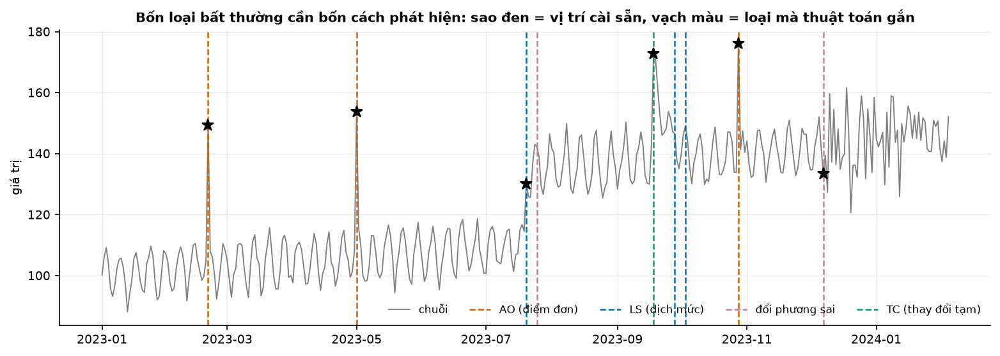
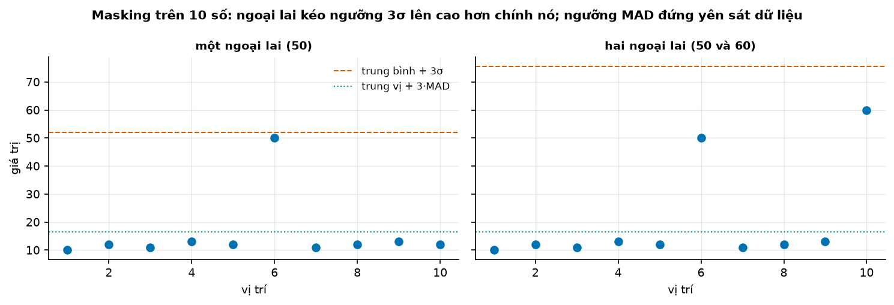
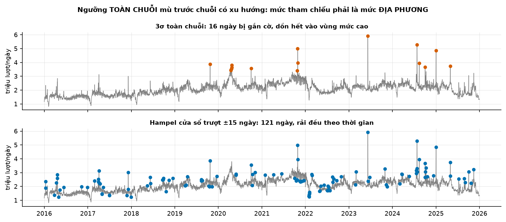
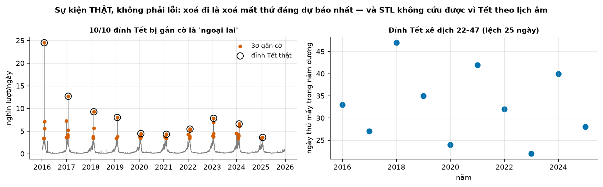
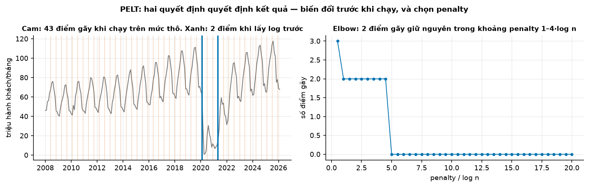
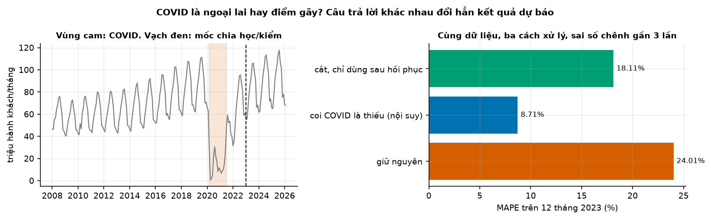

# Buổi 11 — Ngoại lai và điểm gãy

## 1. Mục tiêu

Sau buổi này bạn:

- Phân biệt **bốn loại bất thường**: điểm đơn, dịch mức, thay đổi tạm, đổi phương sai; mỗi loại cần một cách phát hiện và một cách xử lý.
- Chỉ ra bằng 10 số tính tay vì sao ngưỡng **3σ** tự mù trước ngoại lai (**masking**), và vì sao **MAD** thì không.
- Dùng **bộ lọc Hampel** (MAD trên cửa sổ trượt) cho chuỗi có xu hướng.
- Chấp nhận một điều khó chịu: không ngưỡng thống kê nào phân biệt được "lỗi đo" với "sự kiện thật" như Tết; cần **nhật ký sự kiện**.
- Tìm **điểm gãy** bằng PELT, hiểu **penalty** bằng ví dụ tính tay, và tự quét penalty để chọn kết quả ổn định.
- So ba cách xử lý giai đoạn COVID trên dữ liệu thật, và nói được cách nào hợp cho mục đích nào.

## 2. Nhắc lại buổi trước

Từ buổi 2–6:

- **Độ lệch chuẩn** $s$ (hay $\sigma$): khoảng cách điển hình tới trung bình. **Trung vị**: số đứng giữa khi xếp tăng dần; vài số cực lớn
  không kéo được nó.
- **STL robust** (buổi 6): tách xu hướng + mùa vụ + phần dư, và giảm trọng số điểm có phần dư lớn; điểm lạ nằm lại trong phần dư.
- **Log** (buổi 5): biến "tăng gấp mấy lần" thành "cộng thêm bao nhiêu", nên dao động tỷ lệ với mức thành dao động đều.

Từ buổi 10:

- **Cột cờ**: mọi lần sửa dữ liệu phải để lại dấu vết (`da_dien`, `nghi_ngo`). Hôm nay thêm `da_sua`.
- **Giữ đủ mốc**: xoá dòng làm thủng lưới thời gian; thiếu mốc là loại thiếu khó thấy nhất.
- **MAE**: trung bình |thực tế − dự báo|; sai số = thực tế − dự báo, dương là dự báo thấp hơn thực tế.

## 3. Trạng thái đầu buổi

Sau `python lab.py up` (trong thư mục `lab/`):

| Hạng mục | Trạng thái |
|---|---|
| Dữ liệu 1 | `du-lieu/raw/wikipedia-vi-tong/` — 3.653 ngày tổng lượt xem Wikipedia tiếng Việt, 2016–2025, sha256 `481d604d1b58` |
| Dữ liệu 2 | `wikipedia-vi-tet/` — 3.653 ngày lượt xem bài "Tết Nguyên Đán", sha256 `8f9e15ea3055` |
| Dữ liệu 3 | `eurostat-hanh-khach-hang-khong/` — 218 tháng hành khách hàng không 27 nước EU, 1/2008 → 2/2026, sha256 `6ce5178cf876` |
| Nguồn | Wikimedia Pageviews (CC0 1.0); Eurostat `avia_paoc` (CC BY 4.0) |
| Môi trường | Python 3.12; numpy 2.5.3, pandas 3.0.5, scipy 1.18.1, statsmodels 0.15.0, ruptures 1.1.10 |
| `code/bat_thuong.py` | đọc dữ liệu, `z_score`, `iqr`, `mad_score`, `hampel`, `stl_robust`, `so_sanh_bat`, `masking`, `sinh_chuoi_co_loi`, `dan_nhan`, `doi_phuong_sai`, `diem_gay`, `quet_penalty`, `ba_cach_xu_ly_covid`, `xu_ly_ngoai_lai` |
| `code/lab.ipynb` | notebook của Lab, bước 1–5 |
| **Đang cố tình sai** | `xu_ly_ngoai_lai` **xoá** mọi điểm vượt 3σ và không biết nhật ký sự kiện; `diem_gay` chạy PELT trên mức gốc, không lấy log; `doi_phuong_sai` đo trên chuỗi gốc bằng độ lệch chuẩn |
| **Triệu chứng** | chuỗi Tết mất cả 10 đỉnh và thủng mốc; hàng không EU ra 43 điểm gãy không ai giải thích được; không thấy đoạn "đổi phương sai" cài sẵn trong chuỗi mô phỏng |
| `python lab.py check` lúc này | ĐỎ: 4/12 test hỏng |

## 4. Lý thuyết

### Từ mới trong buổi

| Thuật ngữ | Nghĩa một câu | Ví dụ |
|---|---|---|
| ngoại lai (outlier) | Giá trị lệch hẳn khỏi phần còn lại, do lỗi đo hay do sự kiện thật. | 10, 12, 11, **50**, 12. |
| AO (điểm đơn) | Một điểm lệch, trước và sau vẫn như cũ. | Gõ nhầm thêm một số 0. |
| dịch mức (LS, level shift) | Mức trung bình đổi đột ngột rồi giữ luôn ở mức mới. | Từ tháng 3 mở thêm quầy, bán quanh 130 thay vì 100. |
| thay đổi tạm (TC) | Mức nhảy rồi hồi dần về như cũ. | Khuyến mãi một tuần. |
| đổi phương sai | Mức giữ nguyên, độ dao động đổi. | Thay cảm biến kém chính xác hơn. |
| z-score | Khoảng cách tới trung bình tính bằng số lần độ lệch chuẩn. | Trung bình 10, $s$ = 2, giá trị 16 → $z$ = 3. |
| MAD | Trung vị của \|khoảng cách tới trung vị\|, nhân 1,4826 để cùng thang với độ lệch chuẩn. | Mục 4.3. |
| masking / swamping | Masking: ngoại lai che chính nó và các ngoại lai khác. Swamping: ngoại lai làm điểm bình thường bị gắn cờ oan. | Mục 4.2. |
| bộ lọc Hampel | MAD tính trên cửa sổ trượt quanh mỗi điểm, so với trung vị địa phương. | Cửa sổ ±15 ngày. |
| winsorize | Kéo giá trị bị gắn cờ về một mức hợp lý (ở đây: trung vị địa phương), không xoá. | 50 → 12. |
| nhật ký sự kiện | Danh sách mốc đã biết có sự kiện thật, không được sửa như lỗi. | Các ngày Tết, đợt COVID. |
| biến giả (dummy) | Cột 0/1 báo mốc nào nằm trong một sự kiện, để mô hình học riêng ảnh hưởng của nó. | `covid` = 1 từ 3/2020 tới 6/2021. |
| điểm gãy (change point) | Mốc mà tính chất của chuỗi (mức, độ dao động) đổi. | Tháng 2/2020 với hàng không. |
| hàm chi phí | Con số đo một đoạn chuỗi "không đều" tới đâu; ở đây là tổng bình phương khoảng cách tới trung bình đoạn. | Mục 4.5. |
| PELT | Thuật toán tìm bộ điểm gãy làm tổng chi phí + phạt nhỏ nhất, nhanh nhờ loại bớt phương án. | `ruptures.Pelt`. |
| penalty (phạt) | Chi phí cộng thêm cho mỗi điểm gãy; phạt lớn thì ít điểm gãy. | $3 \ln n$. |
| nhân quả / không nhân quả | Nhân quả: kết quả tại $t$ chỉ dùng dữ liệu tới $t$. Không nhân quả: nhìn cả dữ liệu sau $t$. | Trung vị cửa sổ ±15 ngày là không nhân quả. |
| CUSUM, CROPS | CUSUM: cộng dồn độ lệch để báo động sớm. CROPS: thuật toán quét cả dải penalty. | Hộp Nâng cao mục 4.5. |
| MAPE | Trung bình của \|sai số\| / \|thực tế\|, tính bằng %. | Thực tế 100, dự báo 90 → 10%. |

### 4.1 Bốn loại bất thường

**Vấn đề.** "Ngoại lai" không phải một thứ. Một điểm lệch, một bậc thang, một cú nhảy rồi hồi, một đoạn dao động mạnh lên: mỗi thứ cần cách
phát hiện khác và cách xử lý khác (Chen & Liu, 1993).

**Ví dụ số nhỏ — tự tính tay.** Bốn chuỗi 8 điểm, mức nền 10:

| Loại | Chuỗi | Dấu hiệu |
|---|---|---|
| AO (điểm đơn) | 10, 10, 10, **25**, 10, 10, 10, 10 | một điểm lệch, rồi như cũ |
| dịch mức | 10, 10, 10, **20**, 20, 20, 20, 20 | lệch và ở lại |
| thay đổi tạm | 10, 10, 10, **20**, 15, 12, 11, 10 | lệch rồi hồi dần |
| đổi phương sai | 10, 10, 10, **14**, 6, 13, 7, 14 | mức vẫn quanh 10, dao động to hơn |

**Đọc bảng.** Nhìn điểm thứ tư thì ba dòng đầu giống nhau; chỉ **những điểm sau** cho biết loại. Vì vậy một ngưỡng nhìn từng điểm riêng lẻ
chỉ bắt được AO; muốn thấy dịch mức và thay đổi tạm phải tìm điểm gãy (mục 4.5); muốn thấy đổi phương sai phải nhìn độ dao động của phần dư.



**Cách đọc hình.**

1. **Trục ngang**: ngày, 1/2023 → 2/2024 (chuỗi mô phỏng 400 ngày, seed 0).
2. **Trục dọc**: giá trị của chuỗi.
3. **Ký hiệu**: xám là chuỗi; sao đen là vị trí bất thường cài sẵn; mỗi vạch màu là một nhãn thuật toán gắn, màu theo loại (chú giải).
4. **Nhìn vào đâu**: mỗi sao đen có vạch cùng chỗ không, vạch đó màu gì.
5. **Kết luận**: cả 6 bất thường cài sẵn được gắn đúng loại, kèm 3 cảnh báo giả; dịch mức tháng 7 được thấy nhờ tìm điểm gãy, không nhờ
   ngưỡng từng điểm.

**Tóm lại.** **Bốn loại: điểm đơn, dịch mức, thay đổi tạm, đổi phương sai. Loại quyết định cách phát hiện và cách xử lý, không phải độ lớn.**

**Tự kiểm tra.** Doanh số: 50, 52, 49, 90, 88, 91, 89, 90. Loại gì? Ngưỡng nhìn từng điểm có đủ không?

<details>
<summary>Đáp án</summary>

**Dịch mức**: từ điểm thứ tư mức lên quanh 90 và ở lại. Ngưỡng từng điểm thấy điểm 90 đầu tiên lạ, nhưng sau đó mức địa phương đã thành 90,
nên các điểm sau trông bình thường; nó không nói được "mức đã đổi hẳn". Cần tìm điểm gãy. Nhầm hay gặp: sửa điểm 90 đầu tiên như lỗi đo.

</details>

### 4.2 z-score và masking: ngưỡng tự mù

**Vấn đề.** Cách quen thuộc nhất: tính $z = (y - \bar y)/s$, gắn cờ khi $|z| > 3$. Nhưng chính ngoại lai kéo $\bar y$ và $s$ lên.

**Ví dụ số nhỏ — tự tính tay.** Mười số $(10, 12, 11, 13, 12, 50, 11, 12, 13, 12)$:

- Trung bình 156 / 10 = 15,6; độ lệch chuẩn $s$ ≈ 12,1 (số 50 làm nó phình ra; bỏ số 50 thì chỉ khoảng 1).
- $z$ của 50 = (50 − 15,6) / 12,1 ≈ **2,84**: **không** vượt 3, không bị gắn cờ.
- Thay số 12 cuối bằng 60: $s \approx 18{,}4$, $z$ của 50 còn $1{,}61$, của 60 chỉ $2{,}15$. Hai ngoại lai che nhau, không cái nào bị bắt.

Tệ hơn: với 10 số, $|z|$ không bao giờ vượt được $(n-1)/\sqrt n = 9/\sqrt{10} \approx 2{,}85$, dù ngoại lai lớn tới đâu. Ngưỡng 3 ở đây
không bao giờ gắn cờ gì.



**Cách đọc hình.**

1. **Trục ngang**: vị trí 1 → 10.
2. **Trục dọc**: giá trị.
3. **Ký hiệu**: ô trái là dãy của ví dụ, ô phải là dãy có thêm ngoại lai thứ hai; chấm xanh là các số; vạch cam đứt là trung bình + 3σ; vạch xanh lá chấm là trung vị + 3·MAD (mục 4.3).
4. **Nhìn vào đâu**: vị trí vạch cam so với các chấm lẻ ở hai ô.
5. **Kết luận**: một ngoại lai đẩy ngưỡng 3σ lên 52, cao hơn chính nó; thêm ngoại lai thứ hai, ngưỡng lên gần 76; ngưỡng MAD đứng yên sát
   dữ liệu và bắt được cả hai.

**Trên dữ liệu thật.** Trên 3.653 ngày lượt xem Wikipedia tiếng Việt, $3\sigma$ gắn cờ 16 ngày. Thêm **một** ngày giả thật lớn, số ngày bị gắn cờ
tụt còn **5**: mười một ngày "bất thường" biến mất chỉ vì thước đo đổi (hình `hinh/masking.png`, ô bước 1). Chiều ngược lại gọi là
**swamping**: ngoại lai làm điểm bình thường bị gắn cờ oan.

**Khi nào dùng, khi nào không.** Dùng z-score khi dữ liệu gần hình chuông, không có xu hướng, và ngoại lai rất ít so với số điểm. Không dùng
khi mẫu nhỏ, khi có nhiều ngoại lai, hay khi chuỗi có xu hướng (mục 4.3).

**Tóm lại.** **z-score dùng trung bình và độ lệch chuẩn, mà cả hai đều bị ngoại lai kéo: ngoại lai tự che mình và che nhau. Với mẫu nhỏ, ngưỡng
3 có thể không bao giờ vượt được.**

**Tự kiểm tra.** Năm số $(5, 5, 5, 5, 100)$. Tính $z$ của 100. Có bị gắn cờ ở ngưỡng 3 không?

<details>
<summary>Đáp án</summary>

Trung bình $24$; độ lệch $(-19, -19, -19, -19, 76)$; tổng bình phương $4 \times 361 + 5.776 = 7.220$; chia $n - 1$ ra $1.805$, căn
$\approx 42{,}5$. Vậy $z = 76 / 42{,}5 \approx 1{,}79$: **không** bị gắn cờ, dù 100 lớn hơn hẳn các số kia. Với năm số, $|z|$ tối đa chỉ là
$4/\sqrt 5 \approx 1{,}79$. Nhầm hay gặp: tin "không vượt 3σ" nghĩa là "không có ngoại lai".

</details>

### 4.3 MAD và bộ lọc Hampel

**Vấn đề.** Cần một thước đo mức và độ dao động mà vài điểm cực lớn không kéo được. Và cần so mỗi điểm với **mức quanh nó**, vì chuỗi có
xu hướng thì "trung bình cả chuỗi" không có ý nghĩa.

**Trực giác.** Trung vị không quan tâm số lớn nhất lớn cỡ nào, chỉ quan tâm nó nằm ở nửa trên. Lấy trung vị cho cả mức lẫn độ dao động thì
một nửa dữ liệu phải hỏng mới kéo lệch được.

**Ví dụ số nhỏ — tự tính tay.** Cùng 10 số:

- Trung vị: xếp tăng dần, hai số giữa là 12 và 12 → **12**.
- Khoảng cách tới 12: $(2, 0, 1, 1, 0, 38, 1, 0, 1, 0)$; xếp tăng $(0, 0, 0, 0, 1, 1, 1, 1, 2, 38)$; trung vị **1**.
- MAD = 1,4826 × 1 ≈ 1,48. Điểm của 50: 38 / 1,48 ≈ **25,6**, vượt xa 3: bị gắn cờ. Điểm của 10: 2 / 1,48 ≈ 1,35: bình thường.

$$
\text{điểm}_t = \frac{\lvert y_t - \operatorname{median}(y)\rvert}{1{,}4826 \cdot \operatorname{median}\lvert y - \operatorname{median}(y)\rvert}
$$

- Tử số: điểm cách trung vị bao xa. Mẫu số: MAD, độ dao động điển hình tính bằng trung vị. 1,4826 đưa MAD về cùng thang với độ lệch chuẩn khi
  dữ liệu hình chuông.

**Nói bằng lời.** Chia khoảng cách tới trung vị cho độ dao động điển hình; lớn hơn 3 là ngoại lai. Ở ví dụ: $38 / 1{,}48 \approx 25{,}6$.

**Hampel** là đúng công thức đó trên **cửa sổ trượt** ±$k$ điểm quanh mỗi điểm (`hampel` trong code):

```python
trung_vi = y.rolling(2 * k + 1, center=True, min_periods=k).median()
mad = (y - trung_vi).abs().rolling(2 * k + 1, center=True, min_periods=k).median()
co = (y - trung_vi).abs() / (1.4826 * mad) > 3
```

Cửa sổ phải dài hơn các dao động bình thường và ngắn hơn các thay đổi cấu trúc. `center=True` nhìn cả hai phía. Vì vậy Hampel **không
nhân quả** (buổi 12): dùng được để làm sạch lịch sử, không dùng được làm đặc trưng đầu vào cho dự báo.



**Cách đọc hình.**

1. **Trục ngang** (cả hai ô): năm, 2016 → 2026.
2. **Trục dọc**: lượt xem mỗi ngày (triệu).
3. **Ký hiệu**: xám là chuỗi; chấm cam (trên) là ngày 3σ gắn cờ; chấm xanh (dưới) là ngày Hampel ±15 ngày gắn cờ.
4. **Nhìn vào đâu**: chấm cam dồn ở đâu; chấm xanh rải ra sao.
5. **Kết luận**: 3σ chỉ gắn cờ những ngày mức cao, tức nó đang nói "những ngày này đông"; Hampel gắn cờ rải đều mười năm, vì so với mức địa
   phương.

| Cách (lượt xem Wikipedia, 3.653 ngày) | Số ngày gắn cờ | Tỷ lệ |
|---|---|---|
| 3σ toàn chuỗi | 16 | 0,44% |
| IQR 1,5 (ngoài khoảng quantile 0,25 → 0,75, nới mỗi phía 1,5 lần độ rộng khoảng đó) | 27 | 0,74% |
| MAD 3, toàn chuỗi | 15 | 0,41% |
| Hampel ±15 ngày | 121 | 3,31% |
| STL robust, mùa vụ tuần | 616 | 16,86% |

**Đọc bảng.** Ba cách toàn chuỗi gắn cờ quá ít; STL robust gắn cờ một phần sáu số ngày, quá nhiều, vì phần dư của nó còn cả mùa vụ năm mà
mùa vụ tuần không giải thích được. Trước khi tin một ngưỡng, xem nó gắn cờ bao nhiêu phần trăm dữ liệu.

**Khi nào dùng, khi nào không.** Dùng MAD thay độ lệch chuẩn gần như mọi lúc tìm ngoại lai; dùng Hampel khi chuỗi có xu hướng hay mức đổi dần.
Không dùng Hampel khi ngoại lai chiếm gần nửa cửa sổ (trung vị cũng hỏng), và không dùng bản `center=True` cho đặc trưng đầu vào của dự báo.

**Tóm lại.** **MAD đo độ dao động bằng trung vị nên ngoại lai không kéo được. Hampel so mỗi điểm với trung vị và MAD của cửa sổ quanh nó, nên
xu hướng không làm nó mù.**

**Tự kiểm tra.** Tính điểm MAD của 100 trong $(5, 5, 5, 6, 100)$.

<details>
<summary>Đáp án</summary>

Trung vị 5. Khoảng cách $(0, 0, 0, 1, 95)$, trung vị 0 → MAD = 0: không chia được. Khi hơn nửa số điểm bằng nhau, MAD bằng 0; trong code, `hampel` bỏ
qua cửa sổ có MAD bằng 0, còn `mad_score` trả điểm 0. Chuỗi bậc thang (buổi 9) hay gặp chuyện này. Nhầm hay gặp: chia cho 0 rồi gắn cờ mọi điểm
khác trung vị.

</details>

### 4.4 Tết không phải ngoại lai: nhật ký sự kiện và cách xử lý

**Vấn đề.** Ngưỡng thống kê chỉ nói "điểm này khác". Nó không biết "khác" là lỗi đo hay là điều ta đang muốn dự báo.



**Cách đọc hình.**

1. **Trục ngang**: ô trái là năm 2016 → 2026; ô phải là năm.
2. **Trục dọc**: ô trái là lượt xem bài "Tết Nguyên Đán" mỗi ngày (nghìn); ô phải là ngày thứ mấy trong năm dương lịch của đỉnh Tết.
3. **Ký hiệu**: ô trái, vòng đen là đỉnh Tết thật, chấm cam là ngày 3σ gắn cờ; ô phải, mỗi chấm xanh là đỉnh Tết của một năm.
4. **Nhìn vào đâu**: vòng đen có chấm cam không; độ cao các chấm xanh ở ô phải.
5. **Kết luận**: cả 10 đỉnh Tết bị gắn cờ "ngoại lai"; ngày dương lịch của đỉnh xê dịch tới 25 ngày giữa các năm.

Cả năm cách ở mục 4.3, kể cả Hampel và STL robust, đều gắn cờ 10/10 đỉnh. Về thống kê, một đỉnh gấp 10 lần nền **đúng là** bất thường. STL
cũng không học được đỉnh này làm mùa vụ, vì Tết theo lịch âm, ngày dương xê dịch. Cách sửa đúng là **nhật ký sự kiện**: danh sách mốc đã biết,
không được sửa (buổi 13 biến nó thành biến giả lịch âm).

**Ví dụ số nhỏ — tự tính tay.** Chuỗi $(12, 11, 13, 90, 12)$, trung vị địa phương 12, điểm 90 bị gắn cờ:

- **Xoá**: $(12, 11, 13, \text{—}, 12)$: mất một mốc, lưới thời gian thủng.
- **Winsorize**: $(12, 11, 13, 12, 12)$: giữ mốc, giá trị kéo về trung vị địa phương, cột `da_sua` = 1.
- Nếu ngày đó có trong nhật ký sự kiện (Tết): **giữ nguyên 90**.

Năm cách xử lý sau khi phát hiện, từ nhẹ tới nặng:

| Cách | Làm gì | Hợp với | Rủi ro |
|---|---|---|---|
| giữ + gắn cờ | không sửa, thêm cột cờ | sự kiện thật; khi chưa chắc | mô hình nhạy với ngoại lai bị kéo lệch |
| winsorize | kéo về trung vị địa phương | điểm đơn do lỗi đo | mất biên độ thật nếu gắn nhầm |
| coi là thiếu | đặt NaN, xử lý như buổi 10 | đoạn dữ liệu hỏng dài | tạo lỗ, phải chọn cách điền |
| biến giả | thêm cột 0/1 | dịch mức, thay đổi tạm, sự kiện lặp lại | phải biết mốc; nhiều biến giả dễ học thuộc |
| cắt dữ liệu cũ | chỉ dùng phần sau điểm gãy | cấu trúc đổi hẳn | mất mẫu (mục 4.6) |

**Đọc bảng.** Cột "Hợp với" đi theo **loại** bất thường: một điểm đơn rất lớn vẫn chỉ cần winsorize; một dịch mức nhỏ vẫn cần biến giả, vì nó
ảnh hưởng mọi dự báo về sau. Và luôn giữ đủ số mốc.

**Tóm lại.** **Ngưỡng không phân biệt được lỗi đo với sự kiện thật; nhật ký sự kiện thì làm được. Sửa bằng winsorize hay biến giả, không xoá mốc.**

**Tự kiểm tra.** Một cửa hàng có ngày doanh số gấp 8 lần bình thường vì Black Friday, lặp mỗi năm. Hampel gắn cờ ngày đó. Xử lý thế nào?

<details>
<summary>Đáp án</summary>

Đưa Black Friday vào nhật ký sự kiện và **giữ nguyên**; khi dự báo, thêm biến giả cho ngày đó (sự kiện lặp lại, biết trước). Winsorize sẽ xoá
chính cái đỉnh mà cửa hàng cần dự báo để chuẩn bị hàng. Nhầm hay gặp: tin nhãn "ngoại lai" của thuật toán.

</details>

### 4.5 Điểm gãy: PELT và penalty

**Vấn đề.** Dịch mức và thay đổi tạm không lộ ra ở một điểm, mà ở chỗ **chuỗi trước và sau một mốc khác nhau**. Cần tìm những mốc đó.

**Trực giác.** Chia chuỗi thành các đoạn, mỗi đoạn tả bằng trung bình riêng. Càng chia nhiều đoạn, mỗi đoạn càng khớp, tới mức mỗi điểm một
đoạn thì khớp hoàn hảo mà vô nghĩa. Vì vậy mỗi điểm gãy phải "trả phí": chỉ cắt khi cắt làm chi phí giảm nhiều hơn phí phải trả.

**Ví dụ số nhỏ — tự tính tay.** Mười số $(10, 11, 10, 9, 10, 20, 21, 19, 20, 20)$. Chi phí một đoạn = tổng bình phương khoảng cách tới trung
bình đoạn.

| Cách chia | Chi phí | Số điểm gãy |
|---|---|---|
| không cắt (trung bình 15) | 127 + 127 = **254** | 0 |
| cắt trước điểm thứ 6 (trung bình 10 và 20) | 2 + 2 = **4** | 1 |
| cắt thêm trước điểm thứ 4 | 0,67 + 0,5 + 2 = **3,17** | 2 |

**Đọc bảng.** Đặt penalty $\beta = 3 \ln 10 \approx 6{,}9$ cho mỗi điểm gãy. Cắt lần đầu giảm chi phí 250, lớn hơn $\beta$: **đáng** cắt.
Cắt thêm chỉ giảm 0,83: **không** đáng. PELT trả đúng một điểm gãy, trước điểm thứ sáu (`ruptures` in `[5, 10]`: đoạn đầu kết thúc ở vị trí năm).

$$
\min_{K,\ \tau_1 < \dots < \tau_K} \ \sum_{k=0}^{K} c\left(y_{\tau_k : \tau_{k+1}}\right) + \beta K
$$

- $K$: số điểm gãy; $\tau_k$: vị trí điểm gãy; $c(\cdot)$: chi phí một đoạn; $\beta$: penalty cho mỗi điểm gãy.

**Nói bằng lời.** Chọn số điểm gãy và vị trí sao cho tổng chi phí các đoạn cộng penalty nhỏ nhất. Ở ví dụ: một điểm gãy cho 4 + 6,9 = 10,9;
không cắt cho 254; hai điểm gãy cho 3,17 + 13,8 = 17,0. Một điểm gãy thắng.

**PELT** (Killick và cộng sự, 2012) tìm đúng lời giải tốt nhất, nhưng bỏ sớm những vị trí chắc chắn không thắng, nên chạy gần tuyến tính theo
độ dài chuỗi.

**Hai quyết định quan trọng hơn cả thuật toán.**

1. **Biến đổi trước khi chạy.** Chi phí trên cộng bình phương, nên đo bằng **đơn vị của chuỗi**. Chuỗi tăng trưởng có dao động tỷ lệ với mức:
   năm đông khách thì mỗi dao động mùa vụ cũng "đắt", và PELT cắt ở mỗi mùa. Lấy log trước.
2. **Chọn penalty.** Quy ước hay dùng: khoảng $2 \ln n$ tới $3 \ln n$. Đừng tin một con số: **quét** nhiều penalty và giữ kết quả không đổi
   trong một khoảng rộng. Số điểm gãy phải **giảm dần** khi penalty tăng; không giảm là gọi sai API.



**Cách đọc hình.**

1. **Trục ngang**: ô trái là năm 2008 → 2026; ô phải là penalty chia $\ln n$.
2. **Trục dọc**: ô trái là hành khách mỗi tháng (triệu); ô phải là số điểm gãy tìm được.
3. **Ký hiệu**: ô trái, xám là chuỗi, vạch cam mờ là điểm gãy trên mức gốc, vạch xanh đậm là điểm gãy trên log; ô phải, mỗi chấm một penalty.
4. **Nhìn vào đâu**: số vạch cam so với vạch xanh; đoạn nằm ngang ở ô phải.
5. **Kết luận**: mức gốc cho 43 điểm gãy, gần như mỗi mùa hè một cái; log chỉ cho 2, và giữ nguyên trong cả khoảng penalty từ $1 \ln n$
   tới $4 \ln n$; penalty lớn hơn nữa thì không còn điểm gãy nào.

| Điểm gãy (trên log) | 12 tháng trước (triệu khách/tháng) | 12 tháng sau | Đổi |
|---|---|---|---|
| 2/2020 | 86,4 | 18,4 | −78,7% |
| 5/2021 | 12,8 | 43,2 | +238,2% |

**Đọc bảng.** Hai điểm gãy là sụt COVID và hồi phục; độ lớn nói rõ đây là dịch mức cỡ lớn, không phải vài tháng lạ.

**Khi nào dùng, khi nào không.** Dùng PELT khi đã có cả chuỗi (làm sạch lịch sử, giải thích quá khứ). Không dùng nó để báo động khi dữ liệu
đang về từng ngày: nó cần cả chuỗi và kết quả cũ có thể đổi khi thêm điểm mới.

> **Nâng cao — có thể bỏ qua lần đọc đầu.** **CUSUM** cộng dồn độ lệch so với mức tham chiếu, $S_t = \max(0, S_{t-1} + y_t - \mu_0 - k)$.
> Nó báo động khi $S_t$ vượt ngưỡng $h$, và chạy được trong lúc dữ liệu đang về, nên hợp để theo dõi mô hình đang chạy (buổi 42). **Binary
> Segmentation** tìm một điểm gãy tốt nhất, cắt đôi, lặp lại: nhanh nhưng tham lam. `ruptures` chưa có CROPS (thuật toán quét toàn bộ dải
> penalty của Haynes và cộng sự, 2017), nên buổi này tự quét.

**Tóm lại.** **Điểm gãy là mốc mà trước và sau khác nhau. PELT cắt chuỗi sao cho chi phí các đoạn cộng penalty nhỏ nhất: mỗi điểm gãy phải giảm
chi phí nhiều hơn penalty. Lấy log trước với chuỗi tăng trưởng, và quét penalty.**

**Tự kiểm tra.** Ở ví dụ 10 số, penalty phải lớn cỡ nào thì PELT không cắt lần nào?

<details>
<summary>Đáp án</summary>

Cắt một lần giảm chi phí 254 − 4 = 250. Penalty **trên 250** thì cắt không còn lợi: PELT trả 0 điểm gãy. Nhầm hay gặp: nghĩ penalty là "số
điểm gãy tối đa"; penalty là giá của mỗi điểm gãy, tính cùng đơn vị với chi phí.

</details>

### 4.6 COVID: coi là gì thì dự báo ra thế đó

**Vấn đề.** Giai đoạn 3/2020 – 6/2021 của hàng không EU là ngoại lai, dịch mức, hay "bình thường mới"? Mỗi câu trả lời dẫn tới một cách xử lý
dữ liệu, và một dự báo khác.

**Cách đo.** Học tới hết 2022, dự báo 12 tháng 2023. Mô hình cố định: mùa vụ nhân (mỗi tháng là một tỷ lệ của xu hướng) + xu hướng thẳng, ước
lượng trên **toàn bộ** phần học. Chỉ đổi cách xử lý giai đoạn COVID.



**Cách đọc hình.**

1. **Trục ngang**: ô trái là năm 2008 → 2026; ô phải là MAPE trên 12 tháng 2023 (%).
2. **Trục dọc**: ô trái là chuỗi hành khách (triệu mỗi tháng); ô phải là ba cách xử lý.
3. **Ký hiệu**: ô trái, vùng cam là giai đoạn COVID, vạch đen là mốc chia học/kiểm; ô phải, mỗi thanh một cách.
4. **Nhìn vào đâu**: độ dài ba thanh.
5. **Kết luận**: coi COVID là thiếu rồi nội suy cho sai số nhỏ nhất (8,71%); giữ nguyên tệ nhất (24,01%).

| Cách xử lý | Số tháng học | MAPE 2023 | Sai số trung bình (triệu khách/tháng) |
|---|---|---|---|
| giữ nguyên | 180 | 24,01% | +19,7 |
| coi là thiếu, nội suy | 180 | 8,71% | +7,6 |
| cắt, chỉ dùng sau hồi phục | 18 | 18,11% | −12,9 |

**Đọc bảng.** Giữ nguyên: mười lăm tháng sụt kéo cả đường xu hướng xuống, dự báo thấp hơn thực tế gần 20 triệu mỗi tháng (sai số dương).
Cắt: chỉ còn một năm rưỡi dữ liệu, hệ số mùa vụ ước lượng thô, và đà hồi phục bị kéo dài quá tay (sai số âm, dự báo cao hơn thực tế).
Hyndman & Rostami-Tabar (2024) cũng khuyên coi giai đoạn gián đoạn là thiếu khi chỉ cần dự báo **sau** gián đoạn.

**Khi nào dùng, khi nào không.** Coi là thiếu khi sự kiện đã qua và hành vi quay về như cũ. Không dùng khi cần dự báo **trong** lúc gián đoạn,
hay khi hành vi sau đó đổi hẳn: khi ấy dùng biến giả cho giai đoạn đó hoặc chỉ học phần sau, và cân nhắc gộp nhiều cách (ensemble).

**Tóm lại.** **Cách xử lý một đoạn bất thường là một giả định về tương lai. Đo nó bằng dự báo thật trên kỳ chấm, và ghi giả định vào báo cáo.**

**Tự kiểm tra.** Một chuỗi bán hàng có dịch mức lên vĩnh viễn từ tháng 6 (mở thêm chi nhánh). Coi đoạn sau tháng 6 là "thiếu rồi nội suy" có
hợp không?

<details>
<summary>Đáp án</summary>

**Không.** Mức mới là thật và kéo dài; nội suy sẽ xoá nó, và dự báo quay về mức cũ. Dùng biến giả dịch mức, hoặc chỉ học phần sau tháng 6 nếu
đủ dài. Nhầm hay gặp: thấy cách "coi là thiếu" thắng ở COVID rồi dùng cho mọi đoạn lạ; nó chỉ hợp khi hành vi quay về như cũ.

</details>

## 5. Lab từng bước

Lệnh gõ trong terminal ở thư mục `lab/`. Code các bước nằm sẵn trong `code/lab.ipynb` (mở bằng `python lab.py notebook` hoặc VS Code),
chạy từng ô từ trên xuống. Bạn sửa `code/bat_thuong.py`; notebook tự nạp lại bản mới.

### Bước 1 — Ngưỡng toàn chuỗi so với cửa sổ trượt

**Mục đích:** thấy masking trên dữ liệu thật và so năm cách bắt ngoại lai.

```bash
python lab.py up           # một lần: môi trường + dữ liệu (Wikipedia, Eurostat), kiểm sha256
python lab.py check        # 4/12 test đỏ
python lab.py notebook     # chạy ô bước 1
```

**Đọc kết quả:** bảng năm cách như mục 4.3; phép thử masking in 16 → 5 cho 3σ và 121 → 123 cho Hampel. Viết một câu: bạn chọn cách nào để
làm sạch chuỗi này, vì sao.

### Bước 2 — Tết: sự kiện thật

**Mục đích:** sửa `xu_ly_ngoai_lai` theo mục 4.4: (a) gắn cờ bằng `hampel`, (b) winsorize (`y.where(~co, trung_vi)`) thay vì xoá, (c) bỏ qua
các mốc trong `bo_qua_su_kien`. Chạy lại ô bước 2.

**Đọc kết quả:** 10 đỉnh Tết giữ nguyên giá trị; `bi_xoa` toàn `False`; số mốc không đổi.

### Bước 3 — PELT và penalty

**Mục đích:** sửa `diem_gay` để lấy log khi `log=True` (mục 4.5). Chạy lại ô bước 3; ô chạy cả ví dụ 10 số.

**Đọc kết quả:** ví dụ 10 số in `[5, 10]`; hàng không EU: 43 điểm gãy trên mức gốc, 2 trên log (2/2020 và 5/2021); hình quét penalty giảm dần và nằm ngang ở 2 như hình mục 4.5.

### Bước 4 — Đổi phương sai trên phần dư

**Mục đích:** sửa `doi_phuong_sai`: tính trên phần dư STL robust, đo độ dao động bằng MAD thay độ lệch chuẩn (mục 4.3). Chạy lại ô bước 4.

**Đọc kết quả:** trước khi sửa, `doi_phuong_sai` trả danh sách rỗng: trên chuỗi gốc, dao động mùa vụ tuần lớn hơn hẳn phần dao động bị đổi,
nên không thấy gì. Sau khi sửa, nó chỉ ra đúng đoạn cài sẵn, và `danh_gia_nhan` cho đủ 6/6 đúng loại, như hình mục 4.1.

### Bước 5 — Ba cách xử lý COVID

**Mục đích:** chạy `ba_cach_xu_ly_covid` (mục 4.6), không cần sửa. Rồi:

```bash
python lab.py check        # 12/12 xanh
```

**Đọc kết quả:** bảng như mục 4.6. Viết ba câu khuyến nghị, mỗi câu kèm điều kiện áp dụng. Xanh 12/12 là xong.

## 6. Lỗi thường gặp & cách chẩn đoán

| Triệu chứng | Nguyên nhân | Chẩn đoán | Sửa |
|---|---|---|---|
| 3σ gần như không bắt được gì | masking; mẫu nhỏ; chuỗi có xu hướng | thêm một điểm cực lớn, xem số cờ có giảm không | MAD, Hampel |
| Mất đỉnh lễ sau khi làm sạch | coi sự kiện thật là lỗi | vẽ chuỗi quanh mốc bị sửa | nhật ký sự kiện |
| Chuỗi thủng mốc sau khi làm sạch | xoá thay vì winsorize | đếm số mốc trước/sau | `y.where(~co, trung_vi)` |
| STL không học được đỉnh Tết | Tết theo lịch âm | ngày trong năm của đỉnh theo năm | biến giả lịch âm (buổi 13) |
| PELT ra hàng chục điểm gãy | chuỗi tăng trưởng chạy trên mức gốc | so số điểm gãy trên log và trên mức gốc | lấy log trước |
| Số điểm gãy tăng khi penalty tăng | gọi sai API | quét và kiểm tính giảm dần | `predict(pen=...)` |
| Không tìm thấy điểm gãy nào | penalty quá lớn | quét từ $0{,}5 \ln n$ | chọn trong khoảng ổn định |
| Bắt hụt "đổi phương sai" | đo trên chuỗi gốc: biên độ mùa vụ át mất; độ lệch chuẩn bị điểm đơn kéo | đo lại bằng MAD trên phần dư | phần dư STL + MAD |
| "Cắt dữ liệu cũ" làm sai số tăng | phần còn lại quá ngắn để ước lượng mùa vụ | đếm số năm còn lại | giữ dữ liệu + biến giả |
| MAD bằng 0 | hơn nửa số điểm bằng nhau | `(y - y.median()).abs().median()` | bỏ qua điểm, hoặc cửa sổ dài hơn |

## 7. Bài tập về nhà

1. **Cửa sổ Hampel.** Quét cửa sổ 5, 10, 15, 30, 60 ngày trên lượt xem Wikipedia; vẽ số ngày gắn cờ theo cửa sổ. Cửa sổ nào hợp lý, dựa vào đâu?
2. **Isolation Forest.** Chạy `sklearn.ensemble.IsolationForest` trên chuỗi mô phỏng; so số nhãn đúng với `dan_nhan`. Nó thiếu thông tin gì mà
   các cách của buổi này có?
3. **Nhật ký sự kiện thật.** Tìm 5 ngày lượt xem Wikipedia cao nhất **không** phải Tết, tra xem hôm đó có sự kiện gì, và quyết định giữ hay
   sửa từng ngày. Ghi lý do.

## 8. Tiêu chí "Xong khi"

- [ ] `python lab.py check` xanh 12/12.
- [ ] Tính tay được z-score, điểm MAD và quyết định cắt của PELT trên một dãy 10 số.
- [ ] Nộp bằng chứng masking bằng số (16 → 5 và 121 → 123) và giải thích bằng lời.
- [ ] Giải thích vì sao 10/10 đỉnh Tết bị gắn cờ mà không được sửa.
- [ ] Nộp hai điểm gãy COVID kèm độ lớn và khoảng penalty mà chúng ổn định.
- [ ] Ba cách xử lý COVID với MAPE thật, và khuyến nghị kèm điều kiện áp dụng.

## 9. Đọc thêm

- Killick, R., Fearnhead, P. & Eckley, I.A. (2012). Optimal detection of changepoints with a linear computational cost. *JASA* 107(500).
- Truong, C., Oudre, L. & Vayatis, N. (2020). Selective review of offline change point detection methods. *Signal Processing* 167.
- `ruptures` 1.1.10 — https://centre-borelli.github.io/ruptures-docs/
- Romano, G. — MATH337 *Changepoint detection: PELT, WBS and penalty choices* (Lancaster):
  https://www.lancaster.ac.uk/~romano/teaching/2425MATH337/4_algos_and_penalties.html
- Haynes, K., Eckley, I.A. & Fearnhead, P. (2017). Computationally efficient changepoint detection for a range of penalties (CROPS). *JCGS* 26(1).
- Hyndman, R.J. & Rostami-Tabar, B. (2024). Forecasting interrupted time series. *JORS* — https://robjhyndman.com/papers/fits.pdf
- Chen, C. & Liu, L.-M. (1993). Joint estimation of model parameters and outlier effects in time series. *JASA* 88(421).
- Rousseeuw, P.J. & Hubert, M. (2018). Anomaly detection by robust statistics. *WIREs Data Mining and Knowledge Discovery* 8(2).
- Wikimedia Pageviews API; Eurostat `avia_paoc`.
