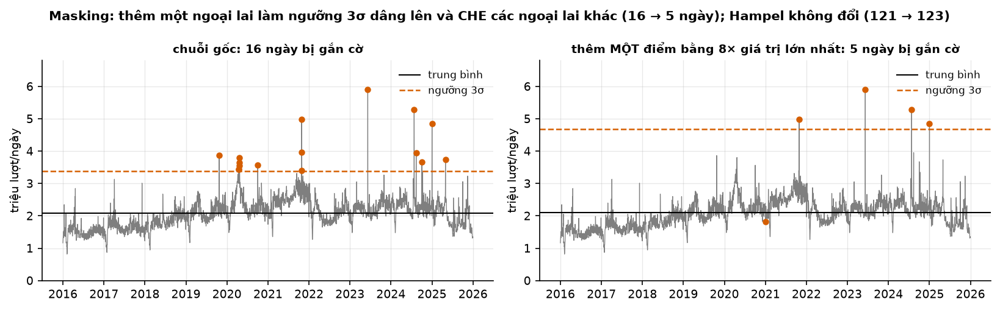

# Buổi 11 — Ngoại lai và điểm gãy

## 1. Mục tiêu

Sau buổi này bạn:

- Phân biệt **bốn loại bất thường**: điểm đơn (AO), đổi mức (LS), thay đổi tạm (TC), đổi phương sai — và biết mỗi loại cần cách phát hiện
  khác nhau.
- Hiểu **masking**: vì sao chính ngoại lai làm ngưỡng 3σ mù, và chứng minh bằng số.
- Dùng **MAD** và **bộ lọc Hampel** (cửa sổ trượt) thay cho ngưỡng toàn chuỗi.
- Chấp nhận một sự thật khó chịu: **không có ngưỡng thống kê nào phân biệt được "lỗi đo" với "sự kiện thật"** — Tết là ví dụ.
- Chạy **PELT** để tìm điểm gãy, tự **quét penalty** và đọc elbow (vì `ruptures` không có CROPS).
- So ba cách xử lý COVID trên dữ liệu thật, và nói được cách nào tốt **cho mục đích nào**.

## 2. Nhắc lại buổi trước

- **Cờ truy vết** (buổi 10): mọi can thiệp vào dữ liệu phải để lại dấu vết (`da_dien`, `nghi_ngo`). Hôm nay thêm `da_sua`.
- **Che nhân tạo để đánh giá**: muốn biết cách xử lý nào đúng thì phải có đáp án. Hôm nay dùng **chuỗi mô phỏng có nhãn** để chấm chính
  thuật toán phát hiện.
- **MAD** $= 1{,}4826 \cdot \operatorname{median}\lvert y - \operatorname{median}(y)\rvert$ — buổi 10 dùng để ước lượng độ phân giải,
  hôm nay là nền của mọi ngưỡng bền vững.
- **Đừng trộn lỗi với tín hiệu**: dữ liệu "sạch" không phải dữ liệu "mượt".

## 3. Trạng thái đầu buổi

Sau `cd lab && python lab.py up`:

| Hạng mục | Trạng thái |
|---|---|
| Dữ liệu 1 | `wikipedia-vi-tong/` — **3.653 ngày** tổng lượt xem vi.wikipedia, 2016-01-01 → 2025-12-31, sha256 `481d604d1b58` |
| Dữ liệu 2 | `wikipedia-vi-tet/` — 3.653 ngày lượt xem bài "Tết Nguyên Đán", sha256 `8f9e15ea3055` |
| Dữ liệu 3 | `eurostat-hanh-khach-hang-khong/` — **218 tháng** hành khách hàng không EU27, 2008-01 → 2026-02, sha256 `6ce5178cf876` |
| Nguồn/giấy phép | Wikimedia Pageviews (CC0 1.0); Eurostat avia_paoc (CC BY 4.0) |
| Môi trường | Python 3.12.14; numpy 2.5.3, pandas 3.0.5, scipy 1.18.1, statsmodels 0.15.0, **ruptures 1.1.10** |
| `code/bat_thuong.py` | `z_score`, `iqr`, `mad_score`, `hampel`, `stl_robust`, `so_sanh_bat`, `masking`, `sinh_chuoi_co_loi`, `dan_nhan`, `doi_phuong_sai`, `diem_gay`, `quet_penalty`, `xu_ly_ngoai_lai`, `ba_cach_xu_ly_covid` |
| **Đang cố tình sai** | `xu_ly_ngoai_lai` **xoá** mọi điểm > 3σ và không biết tới nhật ký sự kiện; `diem_gay` chạy PELT trên **mức thô**; `doi_phuong_sai` đo trên chuỗi gốc bằng `std` |
| **Triệu chứng** | Chuỗi Tết mất sạch 10 đỉnh và thủng 54 mốc; hàng không EU27 ra **43 điểm gãy** không ai giải thích nổi; cảnh báo "đổi phương sai" rải khắp nơi |
| `python lab.py check` lúc này | ĐỎ: 8/12 test qua, 4 test hỏng |

## 4. Lý thuyết

### 4.1 Bốn loại bất thường

Phân loại của Chen & Liu (1993), viết lại cho dễ nhớ:

| Loại | Dấu hiệu | Ví dụ | Xử lý |
|---|---|---|---|
| **AO** — outlier cộng | một điểm lệch, trước sau như cũ | lỗi nhập liệu, sự cố đo | winsorize hoặc đánh dấu; **không xoá mốc** |
| **LS** — level shift | mức đổi và **ở lại** | đổi cách đo, mở thêm nhà máy, COVID | biến giả, hoặc cắt dữ liệu cũ |
| **TC** — thay đổi tạm | mức nhảy rồi **hồi dần** | khuyến mãi, bão, tin tức | biến giả có phân rã |
| **đổi phương sai** | mức giữ nguyên, **biên độ** đổi | đổi thiết bị, thị trường bất ổn | biến đổi Box-Cox, mô hình phương sai |


**Đọc hình.** Chuỗi mô phỏng (seed 0) có 6 bất thường cài sẵn — sao đen là vị trí thật, vạch màu là nhãn thuật toán gắn. Kết quả: **6/6
đúng loại**, kèm 3 cảnh báo giả. Chú ý điểm quan trọng: **Hampel một mình chỉ thấy AO** (nó so với mức địa phương, mà sau level shift thì
mức địa phương cũng đổi theo). Muốn thấy LS/TC phải chạy **phát hiện điểm gãy**; muốn thấy đổi phương sai phải nhìn **phần dư**.

### 4.2 Vì sao ngưỡng toàn chuỗi hỏng

$z_t = (y_t - \bar y)/s$ có hai vấn đề.

**Vấn đề 1 — masking.** Chính ngoại lai kéo $\bar y$ và $s$ lên, nên nó tự che mình và che các ngoại lai khác. Đo được trên lượt xem
vi.wikipedia: thêm **một** điểm bằng 8× giá trị lớn nhất → số ngày bị 3σ gắn cờ tụt từ **16 xuống 5**. Cùng phép thử, Hampel đi từ 121
lên 123 — không bị ảnh hưởng. (Chiều ngược lại là **swamping**: ngoại lai làm các điểm bình thường bị gắn cờ oan.)



**Đọc hình.** Cùng một chuỗi, cùng công thức 3σ. Trái: ngưỡng nằm ở mức hợp lý, 16 ngày vượt. Phải: sau khi thêm **một** điểm rất lớn
(điểm đó nằm ngoài khung hình), trung bình nhích lên và σ phình ra, kéo ngưỡng 3σ lên cao đến mức chỉ còn **5 ngày** vượt qua. Mười một
ngày "bất thường" vừa biến mất — không phải vì dữ liệu đổi, mà vì thước đo đổi.

**Vấn đề 2 — chuỗi có xu hướng thì "trung bình toàn chuỗi" vô nghĩa.**


**Đọc hình.** Trên: 3σ gắn cờ **16/3.653 ngày**, dồn hết vào vùng mức cao — nó chỉ đang nói "những ngày này đông", không phải "những ngày
này bất thường". Dưới: Hampel với cửa sổ trượt ±15 ngày gắn **121 ngày**, rải đều suốt 10 năm, vì mức tham chiếu là **mức địa phương**.

Bảng đầy đủ:

| Cách | Số ngày gắn cờ | Tỷ lệ |
|---|---|---|
| 3σ toàn chuỗi | 16 | 0,44% |
| IQR 1,5 | 27 | 0,74% |
| MAD 3 (toàn chuỗi) | 15 | 0,41% |
| **Hampel k = 15** | **121** | 3,31% |
| STL robust (mùa vụ tuần) | 616 | 16,86% |

STL robust gắn cờ 16,86% — quá nhiều, vì phần dư của nó còn chứa cả mùa vụ năm mà mô hình chu kỳ tuần không giải thích được. Bài học:
**ngưỡng nào cũng phải xem nó gắn cờ bao nhiêu phần trăm dữ liệu trước khi tin.**

### 4.3 MAD và bộ lọc Hampel

$$
\text{MAD} = 1{,}4826 \cdot \operatorname{median}_t \lvert y_t - \operatorname{median}(y)\rvert
$$

Hệ số 1,4826 đưa MAD về cùng thang với $\sigma$ khi dữ liệu chuẩn. Điểm bền vững: $\lvert y_t - \text{median}\rvert / \text{MAD}$.

**Hampel** = đúng công thức đó nhưng trên **cửa sổ trượt**:

```python
k = 2 * cua_so + 1
trung_vi = y.rolling(k, center=True, min_periods=cua_so).median()
mad = (y - trung_vi).abs().rolling(k, center=True, min_periods=cua_so).median()
co_co = (y - trung_vi).abs() / (1.4826 * mad) > 3
```

Hai tham số: **cửa sổ** (phải dài hơn biến động bình thường, ngắn hơn thay đổi cấu trúc) và **ngưỡng** (3 là quy ước, không thiêng liêng).
Lưu ý `center=True` — bộ lọc này **không nhân quả** (buổi 12 sẽ đo). Với việc làm sạch lịch sử thì được; với feature dự báo thì phải dùng
cửa sổ chỉ nhìn về quá khứ.

### 4.4 Sự thật khó chịu: Tết không phải ngoại lai


**Đọc hình.** Trái: lượt xem bài "Tết Nguyên Đán" 10 năm; vòng tròn đen là 10 đỉnh Tết thật, chấm cam là những ngày 3σ gắn cờ — **cả 10
đỉnh đều bị gắn cờ**. Phải: mỗi đỉnh rơi vào ngày thứ 22–47 của năm dương lịch, **xê dịch 25 ngày** giữa các năm.

Đây là phần quan trọng nhất của buổi. Đo hết cả năm phương pháp:

| Cách | Số đỉnh Tết bị gắn cờ |
|---|---|
| 3σ toàn chuỗi | 10/10 |
| IQR 1,5 | 10/10 |
| MAD 3 | 10/10 |
| Hampel k = 15 | 10/10 |
| STL robust (tuần) | 10/10 |

**Không phương pháp nào cứu được.** Lý do rất đơn giản: xét về mặt thống kê, một đỉnh gấp 10 lần nền **đúng là** bất thường. Máy không thể
biết đỉnh đó có ý nghĩa hay không.

Vì sao STL không cứu: Tết theo **lịch âm**, ngày dương xê dịch tới 25 ngày, nên mọi mô hình mùa vụ theo chu kỳ dương lịch cố định (365
ngày, 52 tuần) đều không khớp được. Cách sửa đúng là **nhật ký sự kiện**: một danh sách mốc "biết trước, không được động vào", và ở buổi
13 sẽ thành **biến giả lịch âm**.

```python
dinh = dinh_tet(tet)                                   # nhật ký sự kiện
xl = xu_ly_ngoai_lai(tet, bo_qua_su_kien=dinh)         # đỉnh Tết được giữ nguyên
```

Và chú ý cách xử lý: **winsorize** (kéo về mức địa phương) chứ không **xoá**. Xoá mốc làm thủng lịch thời gian, và buổi 10 đã cho thấy
một chuỗi thiếu mốc nguy hiểm thế nào.

### 4.5 Điểm gãy: PELT

Bài toán: chia chuỗi thành $K+1$ đoạn sao cho tổng chi phí nội đoạn cộng phạt là nhỏ nhất:

$$
\min_{K,\ \tau_1 < \dots < \tau_K} \ \sum_{k=0}^{K} c(y_{\tau_k : \tau_{k+1}}) + \beta K
$$

với $c$ là hàm chi phí (`l2` = phương sai quanh trung bình đoạn; `normal` = chi phí Gaussian, nhìn cả trung bình lẫn phương sai; `rbf` =
phi tham số). **PELT** (Killick et al. 2012) giải tối ưu nhờ cắt tỉa: tài liệu `ruptures` viết "The algorithm relies on a pruning rule.
Many indexes are discarded, greatly reducing the computational cost while retaining the ability to find the optimal segmentation", với độ
phức tạp trung bình $\mathcal{O}(CKn)$.

**Ba thuật toán hay gặp, ba đánh đổi:**

| Thuật toán | Cách làm | Ưu | Nhược |
|---|---|---|---|
| **CUSUM** | cộng dồn độ lệch so với mức tham chiếu, báo động khi tổng vượt ngưỡng | trực tuyến (online), rẻ, một dòng code | chỉ một điểm gãy mỗi lần chạy; cần biết mức tham chiếu |
| **Binary Segmentation** | tìm điểm gãy tốt nhất, cắt đôi, lặp lại | nhanh $\mathcal{O}(n\log n)$, dễ hiểu | **tham lam** — điểm gãy tìm trước có thể sai khi biết điểm sau |
| **PELT** | tối ưu toàn cục có cắt tỉa | tối ưu thật sự, vẫn tuyến tính | cần chọn penalty; offline (phải có cả chuỗi) |

CUSUM đáng nhớ vì nó là thứ chạy được **trong lúc dữ liệu đang chảy về**: $S_t = \max(0,\ S_{t-1} + (y_t - \mu_0) - k)$, báo động khi
$S_t > h$. Trong giám sát mô hình sản xuất (buổi 42) ta sẽ dùng lại đúng ý tưởng này để phát hiện drift.

**Hai quyết định quan trọng hơn cả thuật toán:**

1. **Biến đổi trước khi chạy.** Chuỗi tăng trưởng nhân tính có phương sai tỷ lệ với mức; `l2` sẽ coi mỗi lần biên độ đổi là một điểm gãy
   mức.
2. **Chọn penalty $\beta$.** Quy ước: BIC $= 2\log n$, MBIC $\approx 3\log n$. Nhưng đừng tin một con số — hãy **quét**.


**Đọc hình.** Trái: hành khách hàng không EU27. Vạch cam mờ = **43 điểm gãy** khi chạy PELT trên mức thô; vạch xanh đậm = **2 điểm gãy**
khi lấy log trước. Phải: quét penalty — số điểm gãy giữ nguyên bằng 2 trong suốt khoảng **1–4·log n**, đó là "elbow" ổn định. (Từ 5·log n
trở lên PELT trả **0** điểm gãy — đừng quét quá tay.)

Hai mốc tìm được và độ lớn thật của chúng:

| Mốc | Trung bình 12 tháng trước | Trung bình 12 tháng sau | Đổi |
|---|---|---|---|
| 2020-02 | 86,4 triệu | 18,4 triệu | **−78,7%** |
| 2021-05 | 12,8 triệu | 43,2 triệu | **+238,2%** |

Tháng đáy là 2020-04 với **890.607** khách so với 66.046.231 của 2020-01 — giảm **98,65%**.

`ruptures` **không có CROPS** (thuật toán quét toàn bộ dải penalty của Haynes et al. 2017), nên ta tự quét:

```python
def diem_gay_on_dinh(y, khoang=(1.0, 4.0)):
    """Mốc nào xuất hiện ở MỌI penalty trong khoảng → đáng tin."""
```

Một phép kiểm rẻ để bắt lỗi cài đặt: **số điểm gãy phải giảm đơn điệu khi penalty tăng.** Nếu không, bạn đang gọi sai API.

### 4.6 COVID: ngoại lai, điểm gãy, hay bình thường mới?

Hyndman & Rostami-Tabar (2024) liệt kê các chiến lược cho chuỗi bị gián đoạn: "highly adaptable models, intervention models, **marking
interrupted periods as missing**, forecasting what may have been, downweighting the interruption period, and ensemble models". Ta thử ba
cách phổ biến nhất trên dữ liệu thật: học tới hết 2022, dự báo 12 tháng 2023.


**Đọc hình.** Cùng chuỗi, cùng baseline (mùa vụ nhân + xu hướng tuyến tính ước lượng trên toàn bộ phần học):

| Cách xử lý | Số kỳ học | MAPE 2023 | Sai số trung bình |
|---|---|---|---|
| giữ nguyên | 180 | **24,01%** | −19,7 triệu khách/tháng |
| coi COVID là thiếu rồi nội suy | 180 | **8,71%** | −7,6 triệu |
| cắt, chỉ dùng sau hồi phục | 18 | **18,11%** | +12,9 triệu |

Chênh nhau gần 3 lần chỉ vì một quyết định xử lý dữ liệu. Giải thích: giữ nguyên thì 15 tháng COVID kéo cả đường xu hướng xuống; cắt thì
chỉ còn 18 tháng nên hệ số mùa vụ ước lượng rất thô và xu hướng phục hồi bị ngoại suy quá đà.

Kết quả này khớp đúng khuyến nghị của bài báo: "**The missing value approach is particularly useful when only post-interruption forecasts
are required** and forecasts during the interruption period are not needed". Nhưng đừng đọc thành "luôn dùng cách 2": nếu cần dự báo
*trong* giai đoạn gián đoạn, hoặc nếu hành vi sau gián đoạn thật sự khác hẳn, thì mô hình can thiệp hoặc mô hình thích nghi nhanh mới
đúng. Bài báo cũng gợi ý **ensemble** khi không chắc chọn cách nào.

### 4.7 Sau khi tìm thấy thì làm gì — năm lựa chọn

Phát hiện mới là nửa việc. Năm cách xử lý, xếp từ nhẹ tới nặng:

| Cách | Làm gì | Hợp với | Rủi ro |
|---|---|---|---|
| **Giữ nguyên + đánh cờ** | không sửa giá trị, chỉ thêm cột `nghi_ngo` | sự kiện thật; khi chưa chắc | mô hình không bền vững sẽ bị kéo lệch |
| **Winsorize** | kéo về mức địa phương (hoặc phân vị 1%/99%) | AO do lỗi đo | mất biên độ thật nếu gắn cờ nhầm |
| **Coi là thiếu** | đặt NaN rồi xử lý như buổi 10 | đoạn dữ liệu hỏng dài | tạo lỗ; phải chọn cách điền |
| **Biến giả** | thêm cột 0/1 (hoặc có phân rã cho TC) | LS, TC, sự kiện lặp lại | cần biết mốc; nhiều biến giả dễ overfit |
| **Cắt dữ liệu cũ** | chỉ dùng phần sau điểm gãy | đổi cấu trúc thật sự | mất mẫu — đo được ở mục 4.6: 18 kỳ không đủ ước lượng mùa vụ |

Quy tắc chọn: **loại bất thường quyết định cách xử lý, không phải độ lớn của nó.** Một AO lớn vẫn chỉ cần winsorize; một LS nhỏ vẫn cần
biến giả, vì nó ảnh hưởng tới **mọi** dự báo về sau.

Và một nguyên tắc chung cho cả buổi: **luôn giữ số mốc.** Xoá dòng làm thủng lịch thời gian, phá `resample`, phá lag, và buổi 10 đã cho
thấy loại lỗi đó khó thấy thế nào.

```python
xl = xu_ly_ngoai_lai(tet, cach="hampel_winsorize", bo_qua_su_kien=dinh_tet(tet))
xl[["y", "sach", "da_sua", "bi_xoa"]]   # bi_xoa phải toàn False
```

### 4.8 Nhật ký sự kiện — thứ rẻ nhất và bị bỏ qua nhiều nhất

Mọi thứ trong buổi này quy về một việc: **ghi lại chuyện gì đã xảy ra**. Một bảng ba cột (mốc bắt đầu, mốc kết thúc, mô tả) cạnh dữ liệu
cho phép bạn: giữ sự kiện thật, tạo biến giả đúng chỗ, giải thích điểm gãy thay vì đoán, và trả lời được "vì sao tháng đó lạ" khi sếp hỏi.

Cái máy không biết, và sẽ không bao giờ đoán được từ dữ liệu, là **ý nghĩa**. Đó là phần việc của bạn.

## 5. Lab từng bước

### Bước 1 — Ngưỡng toàn chuỗi so với cửa sổ trượt

```bash
cd lab && python lab.py up
python lab.py chay ../code/bat_thuong.py
python lab.py check                 # 4/12 đỏ
```

Chạy `so_sanh_bat(tong)` và `masking(tong)`. Giải thích vì sao 3σ chỉ bắt 16 ngày, và vì sao thêm một điểm làm con số đó **giảm**.

Bảng cần nộp có ba cột: tên cách bắt, số điểm gắn cờ, tỷ lệ %. Một cách gắn cờ **16 ngày** và một cách gắn cờ **616 ngày** đều đáng ngờ —
cái đầu quá ít để hữu ích, cái sau nhiều tới mức "bất thường" trở thành "bình thường". Hãy nói rõ bạn chọn cách nào và vì sao.

### Bước 2 — Tết: sự kiện thật

Chạy `mat_bao_nhieu_dinh_tet(tet)`. Sửa `xu_ly_ngoai_lai` để (a) winsorize thay vì xoá, (b) nhận `bo_qua_su_kien`. Kiểm: 10 đỉnh Tết giữ
nguyên giá trị, số mốc không đổi.

Sau đó thử một việc nữa để tự thuyết phục mình: vẽ **ngày-trong-năm dương** của 10 đỉnh Tết theo năm (kết quả: 22–47, xê dịch 25 ngày), rồi
chạy `stl_robust` với `chu_ky=365`. Mùa vụ dương lịch có học được đỉnh đó không? Ghi lại câu trả lời — buổi 13 sẽ dựng biến giả lịch âm để
xử lý đúng chuyện này.

### Bước 3 — PELT và penalty

Sửa `diem_gay` để lấy log trước khi chạy. Chạy `quet_penalty(hk)` và vẽ elbow. Báo cáo: hai mốc, độ lớn %, và khoảng penalty mà kết quả
ổn định.

### Bước 4 — Đổi phương sai, và ba cách xử lý COVID

Sửa `doi_phuong_sai` (phần dư STL + MAD + `model="normal"`). Chạy `dan_nhan` trên chuỗi mô phỏng, đối chiếu `danh_gia_nhan` — phải đúng
≥ 4/5 loại. Cuối cùng chạy `ba_cach_xu_ly_covid(hk)` và viết ba câu khuyến nghị.

```bash
python lab.py check                 # 12/12 xanh
```

## 6. Lỗi thường gặp & cách chẩn đoán

| Triệu chứng | Nguyên nhân | Chẩn đoán | Sửa |
|---|---|---|---|
| 3σ gần như không bắt được gì | masking + chuỗi có xu hướng | thêm một điểm cực lớn, xem số cờ có giảm không | Hampel / MAD trên cửa sổ trượt |
| Ngoại lai "biến mất" sau khi thêm một điểm lớn | masking | như trên | ngưỡng bền vững |
| Mất đỉnh lễ Tết sau khi làm sạch | coi sự kiện thật là lỗi | vẽ chuỗi quanh mốc bị xoá | nhật ký sự kiện + winsorize |
| Chuỗi thủng mốc sau khi làm sạch | `xoá` thay vì winsorize | đếm số mốc trước/sau | `y.where(~co, trung_vi)` |
| STL không học được đỉnh Tết | Tết theo lịch âm, ngày dương xê dịch 25 ngày | vẽ ngày-trong-năm của đỉnh theo năm | biến giả lịch âm (buổi 13) |
| PELT ra hàng chục điểm gãy | chuỗi nhân tính chạy với `l2` | so số điểm gãy trên log và trên mức thô | lấy log (hoặc Box-Cox) trước |
| Số điểm gãy tăng khi penalty tăng | gọi sai API / nhầm đơn vị penalty | quét và kiểm tính đơn điệu | sửa lời gọi `predict(pen=...)` |
| Không tìm thấy điểm gãy nào | penalty quá lớn | quét từ 0,5·log n | chọn trong vùng elbow |
| Bắt hụt "đổi phương sai" | đo trên chuỗi gốc, biên độ mùa vụ át σ | so σ hai bên trên phần dư STL | phần dư + MAD + `model="normal"` |
| Cảnh báo "đổi phương sai" khắp nơi | dùng `std` — một AO làm σ phình gấp 4 | thay bằng MAD và xem còn lại bao nhiêu | MAD, ngưỡng tỷ lệ ≥ 2 |
| Ba cách xử lý COVID cho kết quả y hệt | baseline chỉ dùng vài kỳ cuối | in số kỳ học và hệ số | ước lượng trên toàn bộ phần học |
| "Cắt bỏ dữ liệu cũ" làm sai số tăng | phần còn lại quá ngắn để ước lượng mùa vụ | đếm số chu kỳ còn lại | giữ dữ liệu + biến giả, hoặc ensemble |

## 7. Bài tập về nhà

1. **Cửa sổ Hampel.** Quét `cua_so ∈ {5, 10, 15, 30, 60}` trên lượt xem vi.wikipedia; vẽ số ngày gắn cờ theo cửa sổ. Cửa sổ nào hợp lý,
   và bạn dựa vào đâu để nói vậy?
2. **Isolation Forest.** Chạy `sklearn.ensemble.IsolationForest` trên chuỗi mô phỏng; so số nhãn đúng với `dan_nhan`. Nó thiếu thông tin
   gì mà các phương pháp chuỗi thời gian có?
3. **Nhật ký sự kiện thật.** Lập nhật ký cho lượt xem vi.wikipedia: tìm 5 ngày có đỉnh lớn nhất **không** phải Tết, tra xem hôm đó có sự
   kiện gì, và quyết định giữ hay sửa từng cái. Ghi lý do.

## 8. Tiêu chí "Xong khi"

- [ ] `python lab.py check` xanh 12/12.
- [ ] Trên chuỗi mô phỏng, gắn đúng loại cho **≥ 4/5** bất thường cài sẵn và bảo vệ được cách xử lý từng loại.
- [ ] Nộp bằng chứng masking bằng số (16 → 5 và 121 → 123).
- [ ] Nộp bảng "10/10 đỉnh Tết bị gắn cờ" kèm một đoạn giải thích vì sao **không** phương pháp thống kê nào sửa được.
- [ ] Nộp hai điểm gãy COVID kèm độ lớn % và khoảng penalty mà chúng ổn định.
- [ ] Ba cách xử lý COVID với MAPE thật, và khuyến nghị kèm điều kiện áp dụng.

## 9. Đọc thêm

- Killick, R., Fearnhead, P. & Eckley, I.A. (2012). Optimal detection of changepoints with a linear computational cost. *JASA* 107(500).
- Truong, C., Oudre, L. & Vayatis, N. (2020). Selective review of offline change point detection methods. *Signal Processing* 167.
- `ruptures` 1.1.10 — https://centre-borelli.github.io/ruptures-docs/
- Haynes, K., Eckley, I.A. & Fearnhead, P. (2017). CROPS. *JCGS* 26(1) — thuật toán quét dải penalty, chưa có trong `ruptures`.
- Hyndman, R.J. & Rostami-Tabar, B. (2024). Forecasting interrupted time series. *JORS* — https://robjhyndman.com/papers/fits.pdf
- Chen, C. & Liu, L.-M. (1993). Joint estimation of model parameters and outlier effects in time series. *JASA* 88(421).
- Hampel, F.R. (1974). The influence curve and its role in robust estimation. *JASA* 69(346).
- Wikimedia Pageviews API — https://doc.wikimedia.org/generated-data-platform/aqs/analytics-api/
- Eurostat `avia_paoc` — https://ec.europa.eu/eurostat/databrowser/view/avia_paoc
