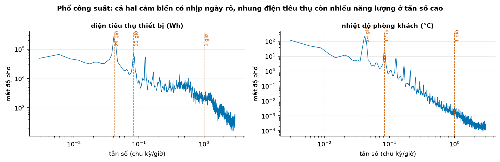
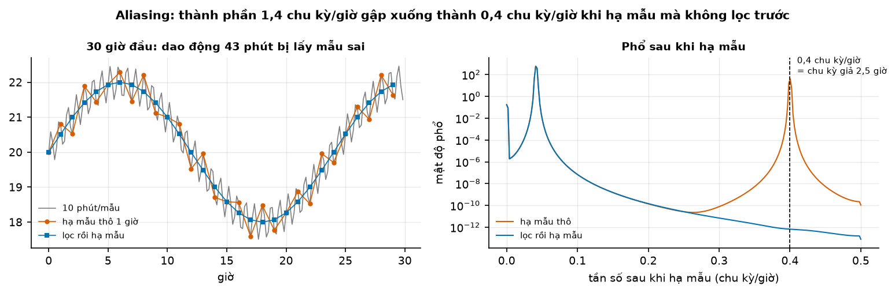
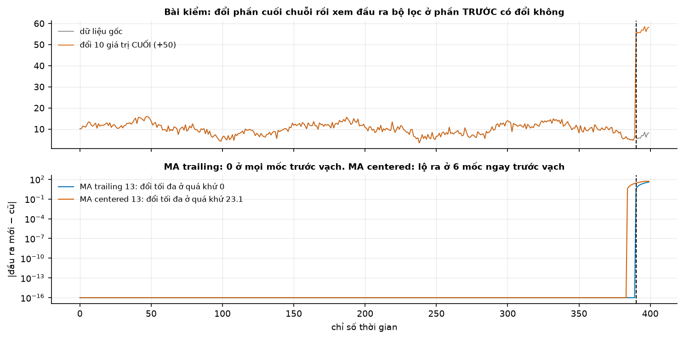
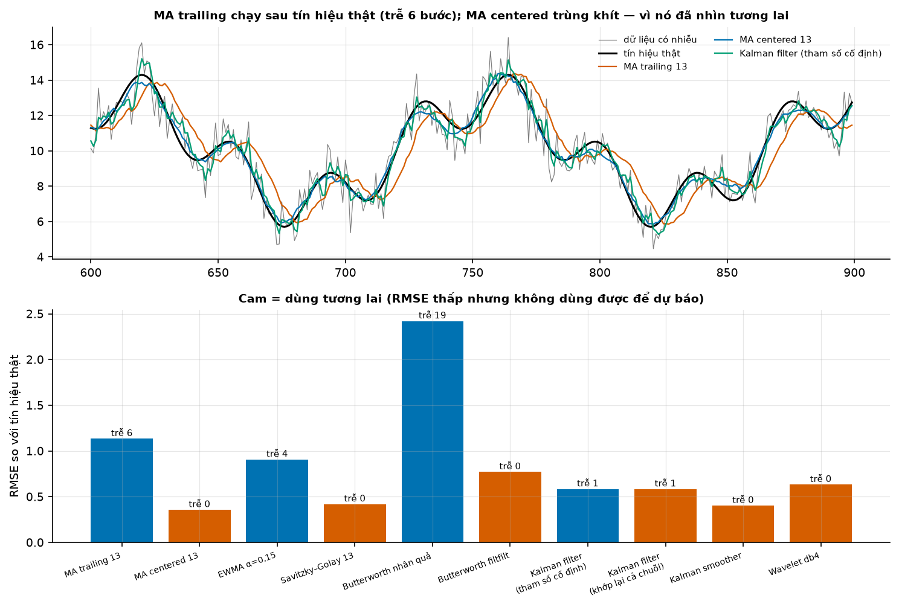
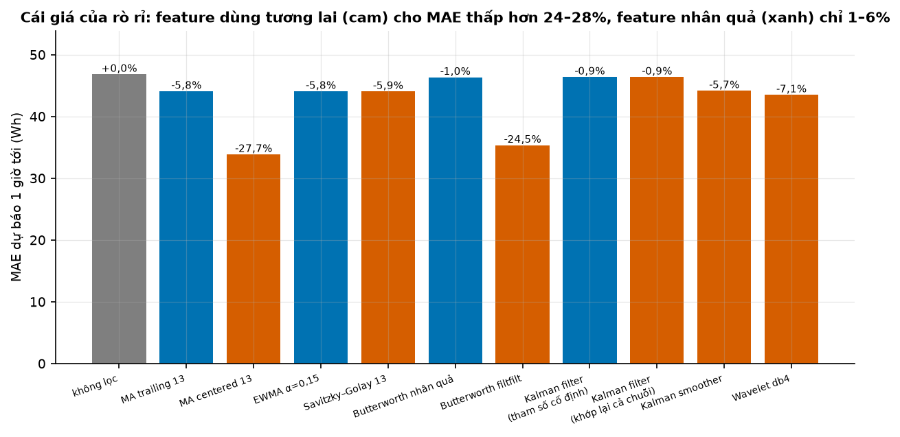
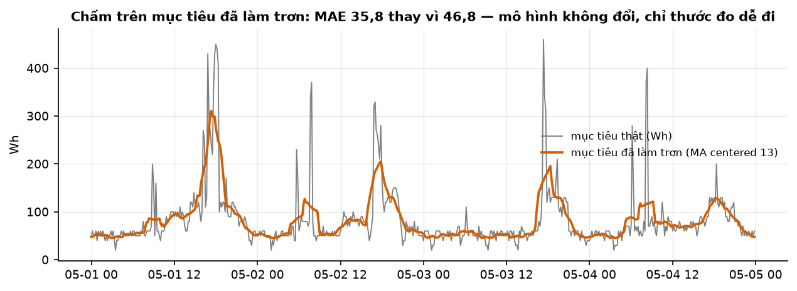

# Buổi 12 — Khử nhiễu và miền tần số

## 1. Mục tiêu

Sau buổi này bạn:

- Đọc được **phổ công suất** (Welch) và nói được chuỗi có nhịp gì, năng lượng nhiễu nằm ở đâu.
- Hiểu **Nyquist** và **aliasing**: vì sao hạ mẫu mà không lọc trước lại **tạo ra** chu kỳ không có thật, chứng minh bằng số.
- Dùng được 6 họ bộ lọc: MA (trailing/centered), EWMA, Savitzky–Golay, Butterworth (`lfilter`/`filtfilt`), Kalman (filter/smoother),
  wavelet — kèm **khi nào dùng, khi nào KHÔNG**.
- Viết **bài kiểm nhân quả tự động**: đổi phần cuối chuỗi, xem đầu ra ở phần trước có đổi không.
- Đo **cái giá của rò rỉ**: feature dùng tương lai cho MAE đẹp giả tạo bao nhiêu phần trăm.
- Nhận ra hai kênh rò rỉ ít người để ý: **tham số bộ lọc ước lượng trên toàn chuỗi**, và **làm trơn mục tiêu**.

## 2. Nhắc lại buổi trước

- **Chuỗi thời gian có ba nhóm bất thường** (buổi 11): additive outlier (một điểm), level shift (đổi mức vĩnh viễn), transient change
  (đổi rồi trở lại). Khử nhiễu **không** phải để xoá chúng — level shift là tín hiệu, không phải nhiễu.
- **MAD** $= 1{,}4826 \cdot \operatorname{median}\lvert y - \operatorname{median}(y)\rvert$ là ước lượng độ lệch chuẩn bền vững; buổi này
  dùng lại để ước lượng $\sigma$ cho ngưỡng wavelet.
- **Rolling window** (buổi 6): `rolling(k).mean()` mặc định lấy cửa sổ **kết thúc** tại điểm hiện tại; `center=True` lấy cửa sổ **quanh**
  điểm hiện tại — nửa cửa sổ nằm ở tương lai.
- **Backtest rolling origin** (sẽ dựng kỹ ở buổi 15): huấn luyện trên quá khứ, chấm trên tương lai, không bao giờ trộn.

## 3. Trạng thái đầu buổi

Sau `cd lab && make up`:

| Hạng mục | Trạng thái |
|---|---|
| Dữ liệu | `du-lieu/raw/uci-appliances-energy/energydata_complete.csv` — **19.735 dòng**, mẫu **10 phút**, 2016-01-11 17:00 → 2016-05-27 18:00, sha256 `2fccf3544458` |
| Nguồn | UCI Appliances Energy Prediction (ID 374), CC BY 4.0 |
| Cột dùng | `Appliances` (Wh, rất nhiễu), `T2` (°C, rất mượt) |
| Môi trường | Python 3.12.14; numpy 2.5.3, pandas 3.0.5, scipy 1.18.1, statsmodels 0.15.0, PyWavelets 1.8.0 |
| `code/khu_nhieu.py` | `doc_cam_bien`, `pho`, `ha_mau`, 10 cấu hình bộ lọc, `kiem_nhan_qua`, `tre_pha`, `bang_bo_loc`, `danh_gia_feature`, `gia_cua_ro_ri`, `cham_tren_muc_tieu_lam_tron` |
| **Đang cố tình sai** | `kiem_nhan_qua` **bỏ qua 200 điểm cuối**; `ha_mau` **bỏ qua** cờ `loc_truoc`; `danh_gia_feature` mặc định dùng MA centered và `cham_tren_muc_tieu_lam_tron` chỉ trả MAE trên mục tiêu **đã làm trơn** |
| **Triệu chứng** | Bảng bộ lọc báo MA centered / SavGol / Kalman smoother là "nhân quả"; phổ sau hạ mẫu có đỉnh 2,5 giờ không ai giải thích được; báo cáo khoe MAE 35,8 thay vì 46,8 |
| `make check` lúc này | ĐỎ: 6/8 test qua, 2 test hỏng |

## 4. Lý thuyết

### 4.1 Nhiễu là gì, và vì sao "khử nhiễu" là con dao hai lưỡi

Mô hình thô: $y_t = s_t + \varepsilon_t$ — phần **tín hiệu** (cái ta muốn dự báo) cộng phần **nhiễu** (cái không dự báo được). Khử nhiễu
là ước lượng $s_t$. Vấn đề: ranh giới giữa $s$ và $\varepsilon$ **do bạn định nghĩa**, thường bằng một ngưỡng tần số. Đặt sai ngưỡng thì
bạn vứt mất tín hiệu, hoặc giữ lại nhiễu.

Nguy hiểm hơn: nhiều bộ lọc tốt nhất lại **nhìn vào tương lai**. Dùng chúng để mô tả lịch sử thì không sao; dùng làm feature dự báo thì
kết quả backtest đẹp mà sản xuất thì sập.

### 4.2 Miền tần số: đọc phổ

Bất kỳ chuỗi nào cũng viết được thành tổng các sóng sin. **Phổ công suất** cho biết mỗi tần số đóng góp bao nhiêu phương sai. Ước lượng
bằng **Welch**: cắt chuỗi thành các đoạn chồng nhau, lấy periodogram từng đoạn rồi trung bình — đánh đổi độ phân giải tần số lấy phương
sai nhỏ hơn.

```python
f, P = signal.welch(y - y.mean(), fs=6.0, nperseg=2048)   # fs = 6 mẫu/giờ
chu_ky_gio = 1 / f[np.argmax(P)]
```



**Đọc hình.** Cả hai cảm biến có đỉnh ở **24,38 giờ** — nhịp sinh hoạt trong nhà. Khác biệt nằm ở đuôi phải: `Appliances` có **17,8%**
công suất ở chu kỳ dưới 1 giờ (bật/tắt thiết bị), `T2` có **0,0%** — nhiệt độ phòng không thể nhảy trong vài phút. Kết luận thực hành:
`Appliances` có chỗ để khử nhiễu, `T2` thì lọc gần như chỉ làm trễ tín hiệu.

### 4.3 Nyquist và aliasing

Với tần số lấy mẫu $f_s$, ta chỉ phân biệt được các tần số tới $f_{\text{Nyq}} = f_s/2$. Thành phần có tần số $f > f_{\text{Nyq}}$ không
biến mất — nó **gập** xuống và giả dạng một tần số thấp:

$$
f_{\text{alias}} = \lvert f - k f_s \rvert, \quad k = \operatorname{round}(f/f_s)
$$



**Đọc hình.** Dữ liệu 10 phút ($f_s = 6$/giờ, Nyquist 3 chu kỳ/giờ) chứa một dao động **1,4 chu kỳ/giờ** (chu kỳ 43 phút, công suất
21,33). Hạ mẫu về 1 giờ đưa Nyquist xuống 0,5 → thành phần này gập thành 0,4 chu kỳ/giờ, tức **chu kỳ 2,5 giờ**. Đo được: công suất tại
2,5 giờ là **64,0** khi hạ mẫu thô, **0,0** khi lọc chống alias trước. Con số 64,0 là **hiện vật hoàn toàn** — nếu bạn đi tìm lời giải
thích kinh doanh cho "chu kỳ 2,5 giờ" thì bạn đang giải thích một thứ không tồn tại.

**Quy tắc:** trước mọi phép hạ mẫu (resample sang giờ/ngày/tuần), lọc thông thấp ở khoảng 0,8 × Nyquist mới. `pandas.resample().mean()`
đã là một bộ lọc trung bình (tốt hơn `.first()`), nhưng là bộ lọc kém sắc; khi tần số cao mạnh thì vẫn phải lọc tử tế.

### 4.4 Sáu họ bộ lọc — và câu hỏi duy nhất quan trọng

| Bộ lọc | Ý tưởng | Khi nào dùng | Khi nào KHÔNG dùng |
|---|---|---|---|
| **MA trailing** $k$ | trung bình $k$ điểm gần nhất | feature dự báo; báo cáo vận hành | khi cần định vị chính xác thời điểm đỉnh (trễ $\approx (k-1)/2$) |
| **MA centered** $k$ | trung bình quanh điểm | mô tả lịch sử, tách xu hướng (buổi 6) | **mọi feature dự báo** |
| **EWMA** $\alpha$ | $z_t = \alpha y_t + (1-\alpha) z_{t-1}$ | streaming, bộ nhớ O(1), trễ nhỏ hơn MA cùng độ trơn | khi cần cắt sắc một dải tần |
| **Savitzky–Golay** | fit đa thức bậc $p$ trên cửa sổ trượt | giữ chiều cao đỉnh, giữ đạo hàm (phổ học, cảm biến) | feature dự báo — kể cả ở biên (xem dưới) |
| **Butterworth** | bộ lọc IIR, đáp ứng phẳng trong dải qua | cần cắt đúng một ngưỡng tần số | `filtfilt` cho feature dự báo |
| **Kalman** | mô hình không gian trạng thái | có mô hình vật lý/cấu trúc; xử lý khuyết tự nhiên | smoother cho feature dự báo |
| **Wavelet** | ngưỡng hệ số ở nhiều thang | tín hiệu có bước nhảy + nhiễu trắng | khi nhiễu có tương quan; feature dự báo |

Câu hỏi duy nhất quan trọng: **đầu ra tại thời điểm $t$ có phụ thuộc $y_{t+1}, y_{t+2}, \dots$ không?**

- `lfilter` chạy tiến theo thời gian → **nhân quả**, nhưng **có trễ pha**.
- `filtfilt` — scipy nói rõ: "This function applies a linear digital filter twice, once forward and once backwards" và "The combined
  filter has zero phase". Zero phase đạt được **bằng cách chạy ngược thời gian** → **không nhân quả**.
- `savgol_filter` mode mặc định `interp`: "a degree *polyorder* polynomial is fit to the last *window_length* values of the edges" — tức
  ngay ở biên nó vẫn dùng các điểm sau $t$.
- **Kalman filter** dùng thông tin tới $t$ → nhân quả. **Kalman smoother** (`smoothed_forecasts`) dùng cả chuỗi → không nhân quả.

**Vấn đề đầu–cuối mẫu.** Hamilton (2018) về bộ lọc HP: "Filtered values at the end of the sample are very different from those in the
middle and are also characterized by spurious dynamics." Moura (2024) phản biện kết luận "never use", nhưng **không** phản biện điểm này.
Mà cuối mẫu chính là nơi dự báo bắt đầu — nên với ta, đó là điểm quyết định.

**Kênh rò rỉ thứ hai.** Một bộ lọc nhân quả vẫn rò rỉ nếu **tham số** của nó ước lượng từ toàn chuỗi: ngưỡng wavelet $\sigma$ tính bằng
MAD trên cả chuỗi, tần số cắt Butterworth chọn theo phổ toàn chuỗi, tham số Kalman khớp lại mỗi lần chạy. Đo được: Kalman filter với tham
số cố định (ước lượng trên phần học) đổi quá khứ **0,000**; cùng bộ lọc nhưng khớp lại cả chuỗi đổi **1,134**.

### 4.5 Trễ pha: đo, đừng đoán

Bộ lọc nhân quả nào cũng làm tín hiệu **chạy sau** sự thật. Đo trễ bằng cách dịch đầu ra và tìm độ dịch cho tương quan lớn nhất:

```python
def tre_pha(z, that, toi_da=40):
    tuong_quan = [np.corrcoef(z[k:], that[:that.size - k])[0, 1] for k in range(toi_da)]
    return int(np.argmax(tuong_quan))
```

Với MA cửa sổ $k$, lý thuyết cho trễ $(k-1)/2$; đo được trên tín hiệu tổng hợp: MA trailing 13 → **6 bước**, đúng bằng $(13-1)/2$. EWMA
với hệ số $\alpha$ có trễ xấp xỉ $(1-\alpha)/\alpha$: với $\alpha = 0{,}15$ lý thuyết cho 5,7 và đo được **4 bước** — sát, và luôn nhỏ hơn
MA cùng mức độ trơn. Butterworth nhân quả đo được **19 bước**, lớn nhất trong nhóm: đó là cái giá của một bộ lọc cắt sắc.

Ba tham số tương đương của EWMA hay bị lẫn trong pandas:

$$
\alpha = \frac{2}{\text{span}+1} = \frac{1}{1+\text{com}} = 1 - e^{-\ln 2/\text{halflife}}
$$

Nên **luôn ghi rõ đang dùng tham số nào** khi báo cáo, nếu không người khác sẽ tái lập ra một bộ lọc khác hẳn.

### 4.6 Wavelet denoising

Phân rã chuỗi thành các thang (`wavedec`), cắt các hệ số nhỏ, rồi dựng lại (`waverec`). Ngưỡng phổ quát (Donoho–Johnstone):

$$
\lambda = \sigma \sqrt{2 \ln n}, \qquad \hat\sigma = \frac{\operatorname{median}\lvert d_J \rvert}{0{,}6745}
$$

với $d_J$ là hệ số chi tiết ở thang mịn nhất. Ngưỡng **mềm** (PyWavelets: giá trị nhỏ hơn ngưỡng bị thay bằng 0, phần còn lại "shrunk
toward zero by value") cho kết quả liên tục; ngưỡng cứng giữ nguyên hệ số lớn nhưng sinh giật.

Ưu điểm thật của wavelet: giữ được **bước nhảy** trong khi MA sẽ bôi nhoè chúng. Nhược điểm: `waverec` dùng cả chuỗi và $\sigma$ tính
trên cả chuỗi → không nhân quả, đo được 7,733.

### 4.7 Bài kiểm nhân quả — thí nghiệm rẻ nhất trong cả khoá

Đừng đọc tài liệu để đoán bộ lọc có nhân quả không. **Thử:**

```python
goc = ham_loc(y)
y2 = y.copy(); y2[-10:] += 50.0          # chỉ đổi 10 điểm CUỐI
moi = ham_loc(y2)
lech = np.abs(moi[:-10] - goc[:-10])     # so ở MỌI mốc trước đó
nhan_qua = lech.max() <= max(1e-9, 1e-7 * np.max(np.abs(y)))
```

Ba chi tiết dễ làm sai:
1. Phải so **mọi mốc trước điểm đổi**, không được bỏ qua một đoạn cuối "cho chắc" — đúng đoạn đó mới lộ vi phạm.
2. Dung sai phải **theo thang dữ liệu** ($10^{-7} \times \max\lvert y\rvert$); hằng số tuyệt đối sẽ báo động giả vì sai số dấu phẩy động.
3. `nan_to_num` trước khi so, vì MA sinh NaN ở đầu chuỗi.



**Đọc hình.** Vạch đứng là điểm bắt đầu đổi. MA trailing: lệch **0,000** ở mọi mốc trước vạch. MA centered: lộ ra ở 6 mốc ngay trước vạch
(mốc đầu tiên bị đổi = 384/400). Đáng chú ý nhất là `filtfilt`: mốc đầu tiên bị đổi là **126/400** — nó làm bẩn ngược **274 bước** về quá
khứ, vì IIR chạy ngược có đuôi rất dài.



**Đọc hình.** Trên tín hiệu tổng hợp (biết trước sự thật, seed 0): RMSE thấp nhất thuộc về MA centered (0,357), SavGol (0,418), Kalman
smoother (0,402) — **cả ba đều dùng tương lai**. Trong nhóm nhân quả, tốt nhất là Kalman filter tham số cố định (0,584), rồi EWMA (0,906),
MA trailing (1,133); Butterworth nhân quả tệ nhất (2,419) vì trễ 19 bước. Bài học: **bảng xếp hạng RMSE mà không có cột "dùng tương lai?"
là bảng xếp hạng vô nghĩa cho dự báo.**

### 4.8 Cái giá của rò rỉ, đo bằng tiền

Dùng từng bộ lọc làm feature dự báo `Appliances` một bước, hồi quy tuyến tính, học 70% đầu, chấm 30% sau **trên chuỗi gốc**:



**Đọc hình.** Không lọc: MAE **46,84**. Nhóm nhân quả cải thiện 0,9–5,9%. Nhóm dùng tương lai: MA centered **33,88 (−27,67%)**,
`filtfilt` **35,37 (−24,48%)**. Con số −27,67% đó chính là "phần thưởng" mà mô hình sẽ **mất sạch** khi lên sản xuất.

Chú ý hai dòng nguy hiểm hơn cả: Savitzky–Golay **−5,92%** và wavelet **−7,09%**. Chúng cũng rò rỉ, nhưng mức cải thiện nhỏ đến mức trông
**hợp lý** — không ai nghi ngờ một feature engineering giúp 6%. Chỉ có bài kiểm nhân quả tự động mới bắt được.

### 4.9 Làm trơn mục tiêu — dạng rò rỉ nặng nhất



**Đọc hình.** Cùng một mô hình, chấm trên hai mục tiêu: chuỗi gốc MAE **46,84**, chuỗi đã làm trơn bằng MA centered MAE **35,78** — giảm
23,6%. Mô hình **không hề tốt hơn một chút nào**; nó chỉ được chấm trên một đại lượng dễ hơn và **không tồn tại trong thực tế** (không ai
trả tiền cho "điện tiêu thụ đã làm trơn").

Quy tắc: **được phép làm trơn feature (nếu bộ lọc nhân quả), không bao giờ được làm trơn mục tiêu chấm điểm.** Nếu nghiệp vụ thật sự
quan tâm tới đại lượng trung bình (ví dụ tổng theo tuần) thì phải định nghĩa mục tiêu đó **bằng phép cộng dồn nhân quả**, và nói rõ trong
báo cáo.

### 4.10 Quy trình chọn bộ lọc — năm câu hỏi theo thứ tự

1. **Đầu ra dùng làm gì?** Mô tả/báo cáo lịch sử → mọi bộ lọc đều được. Feature dự báo hoặc mục tiêu → chỉ bộ lọc nhân quả.
2. **Phổ nói gì?** Nếu năng lượng tần số cao gần bằng 0 (như `T2`: 0,0% dưới 1 giờ) thì lọc chỉ thêm trễ, không thêm thông tin.
3. **Chấp nhận trễ bao nhiêu?** Trễ và độ trơn đánh đổi trực tiếp: MA trailing 13 trễ 6 bước, Butterworth nhân quả trơn hơn nhưng trễ 19
   bước. Với dự báo tầm 1 bước mà bộ lọc trễ 19 bước thì feature gần như vô dụng (đo được: cải thiện chỉ 1,02%).
4. **Chuỗi có bước nhảy không?** Có → wavelet hoặc phát hiện đổi mức trước rồi mới lọc từng đoạn; đừng để MA bôi nhoè level shift thành
   một con dốc kéo dài $k$ bước.
5. **Tham số lấy từ đâu?** Mọi hằng số (tần số cắt, $\sigma$, $\alpha$, tham số Kalman) phải ước lượng **chỉ trên phần học** rồi cố định,
   và phải ghi vào tài liệu để tái lập.

Câu 1 và câu 5 là hai câu bị bỏ qua nhiều nhất — và cũng là hai câu tạo ra rò rỉ.

**Một mẹo vận hành.** Khi đã có bài kiểm nhân quả, hãy biến nó thành **test tự động trong CI**: mọi hàm sinh feature phải qua
`kiem_nhan_qua` trước khi được dùng. Từ buổi 13 trở đi, `lab/cham/` của mọi buổi đều có một test loại này; đây là buổi bạn tự viết nó.

## 5. Lab từng bước

### Bước 1 — Nhìn phổ trước khi lọc

```bash
cd lab && make up
env -u VIRTUAL_ENV uv run --no-sync --project 00-nen python ../code/khu_nhieu.py
make check        # 2/8 đỏ
```

Vẽ phổ của `Appliances` và `T2` bằng `pho(y, fs=6.0, nperseg=2048)`. Trả lời: chuỗi nào đáng khử nhiễu, ngưỡng tần số nào hợp lý? Dùng
`cong_suat_quanh(f, P, chu_ky_gio=24)` để kiểm nhịp ngày chiếm bao nhiêu phần công suất.

### Bước 2 — Aliasing

Sửa `ha_mau` để cờ `loc_truoc` có tác dụng (Butterworth bậc 8 tại 0,8 × Nyquist mới), rồi so phổ sau hạ mẫu có/không lọc. Báo công suất
tại chu kỳ 2,5 giờ trong hai trường hợp.

Thí nghiệm kiểm chứng: tiêm một sin 1,4 chu kỳ/giờ biên độ biết trước vào chuỗi, hạ mẫu hai cách, đo `cong_suat_quanh(..., 2.5)`. Kết quả
đúng phải là **64,0** (thô) và **0,0** (có lọc). Nếu bạn tiêm 1,5 chu kỳ/giờ thì sẽ thấy… không có gì: tần số đó rơi đúng Nyquist mới nên
mọi mẫu lấy được đều bằng 0 — một cái bẫy hay gặp khi tự dựng demo aliasing.

### Bước 3 — Bài kiểm nhân quả

Sửa `kiem_nhan_qua` để so **mọi** mốc trước điểm đổi. Chạy `bang_bo_loc` trên tín hiệu tổng hợp; xác nhận đúng 4 bộ lọc nhân quả (MA
trailing, EWMA, Butterworth nhân quả, Kalman filter tham số cố định) và 6 bộ lọc dùng tương lai.

### Bước 4 — Đo giá của rò rỉ, chấm đúng mục tiêu

Sửa `danh_gia_feature` (mặc định phải là bộ lọc nhân quả) và `cham_tren_muc_tieu_lam_tron` (trả **cả hai** MAE). Viết ba câu kết luận cho
sếp: nên dùng feature nào, vì sao không dùng feature "tốt nhất".

```bash
make check        # 8/8 xanh
```

## 6. Lỗi thường gặp & cách chẩn đoán

| Triệu chứng | Nguyên nhân | Chẩn đoán | Sửa |
|---|---|---|---|
| Backtest đẹp bất thường sau khi thêm feature làm trơn | bộ lọc không nhân quả | bài kiểm sửa-đuôi | dùng `rolling()` mặc định, `lfilter`, EWMA |
| "filtfilt không trễ nên tốt hơn" | zero-phase = chạy ngược thời gian | `moc_dau_tien_bi_doi` | `lfilter` cho feature; `filtfilt` chỉ để mô tả |
| SavGol "chắc nhân quả ở biên" | mode `interp` fit đa thức trên cửa sổ cuối | bài kiểm sửa-đuôi | không dùng SavGol làm feature |
| Xuất hiện chu kỳ lạ sau khi resample | aliasing | so phổ trước/sau; tính $\lvert f - k f_s\rvert$ | lọc thông thấp trước khi hạ mẫu |
| Bộ lọc nhân quả nhưng vẫn rò rỉ | tham số ($\sigma$, tần số cắt, tham số Kalman) ước lượng trên cả chuỗi | bài kiểm sửa-đuôi vẫn đỏ | ước lượng tham số **chỉ trên phần học** rồi cố định |
| MAE giảm mạnh mà dự báo trông không khác | chấm trên mục tiêu đã làm trơn | in MAE trên cả mục tiêu gốc | luôn chấm trên chuỗi gốc |
| Khử nhiễu làm mất level shift | bộ lọc tuyến tính bôi nhoè bước nhảy | so chuỗi lọc với chuỗi gốc quanh mốc biến cố | wavelet, hoặc phát hiện đổi mức trước (buổi 11) |
| Kalman smoother "tốt hơn hẳn" | smoother dùng cả chuỗi | so `filtered_state` với `smoothed_state` | dùng filter cho dự báo |
| Lọc mạnh làm mô hình tệ đi | cắt mất cả tín hiệu | quét ngưỡng tần số, vẽ MAE theo ngưỡng | giảm độ mạnh bộ lọc |
| Bài kiểm nhân quả báo động giả | dung sai tuyệt đối quá chặt | in `doi_qua_khu` | dung sai theo thang dữ liệu |
| NaN ở đầu chuỗi sau khi lọc | cửa sổ chưa đủ dữ liệu | `isna().sum()` | `nan_to_num` khi so, và bỏ phần đầu khi huấn luyện |

## 7. Bài tập về nhà

1. **Quét ngưỡng.** Với EWMA, quét $\alpha \in \{0{,}05; 0{,}1; \dots; 0{,}9\}$; vẽ MAE dự báo theo $\alpha$. Có điểm tối ưu trong không?
   Giải thích bằng đánh đổi nhiễu–trễ.
2. **HP filter.** Chạy `statsmodels.tsa.filters.hpfilter` trên `T2`, rồi áp bài kiểm nhân quả. Sau đó cắt bỏ 100 điểm cuối, chạy lại, và
   so thành phần xu hướng ở 100 điểm **trước đó** — đúng điều Hamilton (2018) mô tả.
3. **Wavelet với bước nhảy.** Thêm một level shift +100 vào tín hiệu tổng hợp. So RMSE của wavelet db4 và MA trailing 13 quanh mốc nhảy
   (±20 điểm) và ở phần còn lại. Kết luận khi nào wavelet thật sự đáng dùng.

## 8. Tiêu chí "Xong khi"

- [ ] `make check` xanh 8/8.
- [ ] Nộp bảng 10 bộ lọc có cột **"dùng tương lai?"** do bài kiểm tự động điền, không phải bạn tự gõ.
- [ ] Nêu được con số aliasing: công suất tại chu kỳ 2,5 h là 64,0 (hạ mẫu thô) so với 0,0 (có lọc trước).
- [ ] Giải thích được vì sao Kalman filter "tham số cố định" và "khớp lại cả chuỗi" cho RMSE gần y hệt (0,584 vs 0,583) nhưng chỉ một cái
      nhân quả.
- [ ] Viết một đoạn ngắn: vì sao MAE 35,78 trên mục tiêu đã làm trơn **không** được đưa vào báo cáo.

## 9. Đọc thêm

- scipy.signal: `welch`, `lfilter`, `filtfilt`, `savgol_filter`, `butter` — https://docs.scipy.org/doc/scipy/reference/signal.html
- PyWavelets — thresholding: https://pywavelets.readthedocs.io/en/latest/ref/thresholding-functions.html
- Hamilton, J.D. (2018). Why You Should Never Use the Hodrick-Prescott Filter. *REStat* 100(5), 831–843.
- Moura, A. (2024). …A Comment on Hamilton (2018). *Journal of Comments and Replications in Economics* 3, 1–17.
- Donoho, D.L. & Johnstone, I.M. (1994). Ideal spatial adaptation by wavelet shrinkage. *Biometrika* 81(3), 425–455.
- Savitzky, A. & Golay, M.J.E. (1964). Smoothing and Differentiation of Data by Simplified Least Squares Procedures. *Analytical
  Chemistry* 36(8), 1627–1639.
- Welch, P. (1967). The use of FFT for the estimation of power spectra. *IEEE Trans. Audio Electroacoust.* 15(2), 70–73.
- statsmodels `UnobservedComponents` — `filtered_state` vs `smoothed_state`: https://www.statsmodels.org/stable/statespace.html
- Candanedo, L. (2017). Appliances Energy Prediction. UCI ML Repository. https://doi.org/10.24432/C5VC8G
