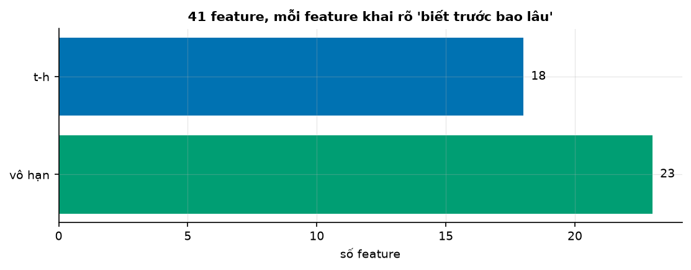
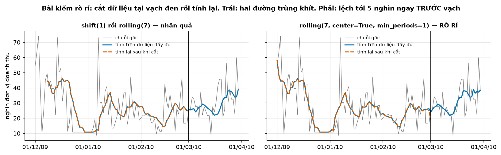
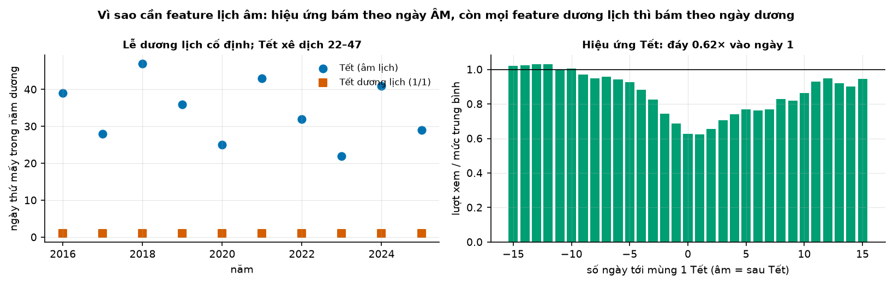
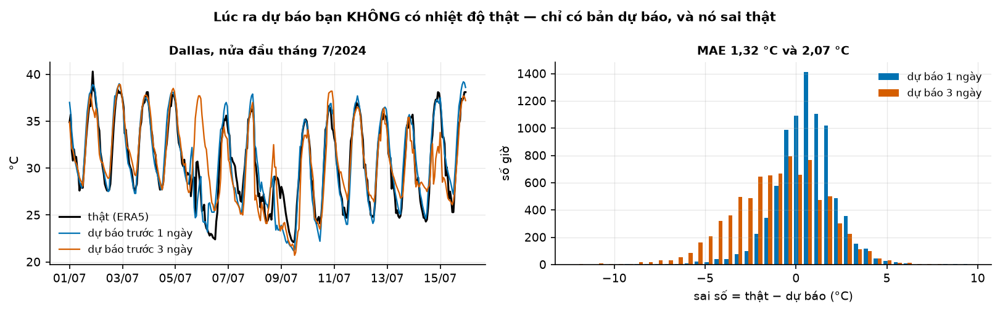
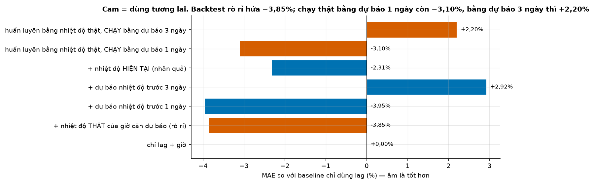

# Buổi 13 — Feature engineering và chống rò rỉ

## 1. Mục tiêu

Sau buổi này bạn:

- Xây bộ **41 feature** mà mọi giá trị đều có trong tay lúc ra dự báo, và khai được mỗi feature "biết trước bao lâu".
- Viết đúng **lag** và **rolling**: vì sao `shift` trước rồi mới `rolling`, và vì sao lag nhỏ nhất phải ≥ tầm dự báo.
- Mã hoá thứ, tháng bằng **cặp sin/cos**, mùa vụ dài bằng **Fourier**, và tạo feature **Tết âm lịch** đúng cho mọi năm.
- Nhận ra năm kiểu **rò rỉ** trên bảng 6 dòng: chỉ đúng ô nào đã nhìn trộm tương lai.
- Tự viết **`kiem_ro_ri`** (cắt tương lai rồi tính lại) và biết vì sao phải có thêm bài kiểm thứ hai.
- Đo **cái giá của rò rỉ** khi dùng nhiệt độ thật thay cho nhiệt độ dự báo.

## 2. Nhắc lại buổi trước

Từ buổi 8–9:

- **Feature** (đặc trưng) là một cột số làm đầu vào cho mô hình. **Hồi quy tuyến tính** trên nhiều feature là tổng có trọng số của chúng.
- **Ex-ante / ex-post** (buổi 8): dự báo thật chỉ dùng thông tin đã có lúc ra dự báo; dùng giá trị thật về sau của biến giải thích là ex-post.
- **z-score** (buổi 9): trừ trung bình rồi chia độ lệch chuẩn.

Từ buổi 10–12:

- **Rò rỉ tương lai**: dùng thông tin chưa có lúc ra dự báo; điền hai phía (`interpolate(limit_direction="both")`) là một ví dụ.
- **Nhân quả**: kết quả tại $t$ chỉ dùng dữ liệu tới $t$. `rolling(center=True)` không nhân quả.
- **Bài kiểm đổi đuôi** (buổi 12): đổi phần cuối chuỗi, xem kết quả ở phần trước có đổi không.
- **Nhật ký sự kiện, biến giả** (buổi 11): Tết là sự kiện thật; biến giả là cột 0/1 báo mốc nào thuộc sự kiện.

## 3. Trạng thái đầu buổi

Sau `python lab.py up` (trong thư mục `lab/`):

| Hạng mục | Trạng thái |
|---|---|
| Dữ liệu 1 | `du-lieu/raw/uci-online-retail-ii/` → 739 ngày doanh thu một cửa hàng trực tuyến, 12/2009 → 12/2011, sha256 `572e362708e6` |
| Dữ liệu 2 | `wikipedia-vi-tong/` — 3.653 ngày lượt xem Wikipedia tiếng Việt (10 mùa Tết) |
| Dữ liệu 3 | `eia930-balance-2024-h1`, `-h2` — tải điện ERCOT (Texas) theo giờ, 2024 |
| Dữ liệu 4 | `open-meteo-dallas-du-bao-luu-2024` — 8.784 giờ ở Dallas: nhiệt độ thật (ERA5) và bản dự báo đã lưu từ 1 ngày, 3 ngày trước |
| Nguồn | UCI (CC BY 4.0); Wikimedia (CC0); U.S. EIA (public domain); Open-Meteo (CC BY 4.0) |
| Môi trường | Python 3.12; numpy 2.5.3, pandas 3.0.5, scikit-learn 1.9.1, holidays 0.104 |
| `code/feature.py` | lịch âm (`tet`, `so_ngay_toi_tet`, `gio_to`), `feature_lich`, `feature_fourier`, `feature_tre`, `bo_feature`, `bang_biet_truoc`, `kiem_ro_ri`, `kiem_nhieu_muc_tieu`, `gia_cua_ro_ri`, `gia_tri_feature_tet` |
| `code/lab.ipynb` | notebook của Lab, bước 1–5 |
| **Đang cố tình sai** | `feature_tre` có 4 feature rò rỉ (`tb_7` có tâm, `z_score` toàn chuỗi, `tb_theo_thu` toàn chuỗi, `y_dien_hai_chieu`); feature Tết ghi cứng ngày Tết 2011; `kiem_ro_ri` chỉ cắt một mốc và bỏ 10 dòng cuối |
| **Triệu chứng** | bài kiểm rò rỉ báo "sạch" cho `tb_7`; mô hình có sai số đẹp bất thường; feature Tết chỉ đúng năm 2011 |
| `python lab.py check` lúc này | ĐỎ: 4/13 test hỏng |
| Lưu ý | Buổi này thư viện `tv` **không có** `ro_ri`: bạn tự viết bài kiểm |

## 4. Lý thuyết

### Từ mới trong buổi

| Thuật ngữ | Nghĩa một câu | Ví dụ |
|---|---|---|
| tầm dự báo $h$ | Dự báo cho bao nhiêu bước sau thời điểm ra dự báo. | Chiều nay dự báo trưa mai: $h$ = 1 ngày. |
| lag | Giá trị của chuỗi $k$ bước trước: `y.shift(k)`. | `lag_7` của thứ Hai là doanh thu thứ Hai tuần trước. |
| rolling | Thống kê trên cửa sổ $w$ điểm gần nhất: `y.rolling(w).mean()`. | Trung bình 7 ngày gần nhất. |
| biết trước bao lâu | Feature có trong tay trước thời điểm cần dự báo bao lâu. | Thứ trong tuần: biết trước mãi mãi. |
| mã hoá tuần hoàn | Thay số thứ tự (0–6) bằng cặp sin, cos để hai đầu vòng nằm gần nhau. | Chủ nhật và thứ Hai. |
| Fourier term | Cặp sin, cos theo chu kỳ dài, thay cho hàng trăm biến giả mùa vụ. | 3 cặp thay 365 biến giả ngày trong năm. |
| lịch âm, sóc | Lịch theo tuần trăng; sóc là thời điểm trăng mới, ngày đầu tháng âm. | Mùng 1 Tết là ngày sóc của tháng Giêng. |
| rò rỉ (leakage) | Feature chứa thông tin mà lúc ra dự báo chưa có. | Trung bình có tâm chứa ngày mai. |
| target encoding | Thay một nhóm (thứ, mã hàng) bằng trung bình mục tiêu của nhóm đó. | Thứ Bảy → doanh thu trung bình các thứ Bảy. |
| kiểm nhiễu mục tiêu | Đổi mục tiêu ở phần sau chuỗi, xem feature ở phần trước có đổi không. | Mục 4.5. |
| biến ngoại sinh | Biến ngoài chuỗi cần dự báo, dùng làm feature. | Nhiệt độ khi dự báo tải điện. |
| `merge_asof` | Ghép hai bảng theo mốc thời gian gần nhất (không cần trùng khít). | Mục 4.6. |
| point-in-time | Dùng số liệu đúng như nó có ở thời điểm đó, không phải bản đã sửa về sau. | Mục 4.6. |

### 4.1 Nguyên tắc duy nhất: biết trước bao lâu

**Vấn đề.** Mô hình dự báo được huấn luyện trên lịch sử, nơi mọi thứ đều đã biết. Rất dễ đưa vào một feature mà **lúc dự báo thật** chưa có:
chấm trên lịch sử (backtest) đẹp, dùng thật thì sập.

> Feature cho $y_{t+h}$ chỉ được dùng thông tin **có thật trong tay tại thời điểm $t$**.

**Ví dụ số nhỏ — tự tính tay.** Tối thứ Hai dự báo doanh thu thứ Ba ($h$ = 1 ngày). Có trong tay: thứ trong tuần của thứ Ba (lịch); khuyến mãi đã
lên lịch cho thứ Ba (kế hoạch); doanh thu tới hết thứ Hai (quá khứ). **Không** có: doanh thu thứ Ba, nhiệt độ thật của thứ Ba, trung bình
doanh thu của cả năm (vì năm chưa hết).

| Nhóm | Ví dụ | Biết trước bao lâu |
|---|---|---|
| lịch | thứ, tháng, Tết, Fourier | mãi mãi: không bao giờ rò rỉ |
| kế hoạch, dự báo của người khác | khuyến mãi đã lên lịch, dự báo thời tiết | từ lúc được công bố |
| quá khứ của chính chuỗi | lag, rolling | chỉ tới $t$, tức $h$ bước trước mục tiêu |

**Đọc bảng.** Mọi feature phải xếp được vào một trong ba nhóm. Cột nào không xếp được là cột đáng ngờ.



**Cách đọc hình.**

1. **Trục ngang**: số feature.
2. **Trục dọc**: hai nhóm "biết trước": mãi mãi (lịch) và $t - h$ (quá khứ của chuỗi).
3. **Ký hiệu**: mỗi thanh là số feature trong nhóm.
4. **Nhìn vào đâu**: độ dài hai thanh.
5. **Kết luận**: 23 trong 41 feature là lịch, biết trước mãi mãi; 18 lấy từ quá khứ của chuỗi; không feature nào nằm ngoài ba nhóm.

Bảng "biết trước bao lâu" (`bang_biet_truoc`) nộp **kèm mô hình**: người xem lại phát hiện rò rỉ mà không cần đọc code.

**Tóm lại.** **Mỗi feature phải xếp được vào một trong ba nhóm: lịch, kế hoạch đã công bố, quá khứ của chuỗi. Không xếp được là đáng ngờ; bảng
"biết trước bao lâu" nộp kèm mô hình.**

**Tự kiểm tra.** Dự báo lượng khách quán cà phê ngày mai. Feature nào hợp lệ: (a) ngày mai có phải ngày lễ; (b) số khách ngày mai của quán bên
cạnh; (c) số khách hôm nay; (d) dự báo mưa ngày mai của đài khí tượng?

<details>
<summary>Đáp án</summary>

Hợp lệ: (a) lịch; (c) quá khứ; (d) dự báo đã công bố. **Không** hợp lệ: (b), vì số khách ngày mai của quán bên cạnh chưa ai biết. Nhầm hay gặp:
loại (d) vì "thời tiết là tương lai"; bản dự báo thời tiết đã có trong tay, chỉ nhiệt độ **thật** mới chưa có.

</details>

### 4.2 Lag và rolling: shift trước, rolling sau

**Vấn đề.** Lag và rolling là feature mạnh nhất, và cũng là chỗ rò rỉ hay gặp nhất, vì một dòng code thiếu `shift` trông y hệt dòng đúng.

**Ví dụ số nhỏ — tự tính tay.** Doanh thu 6 ngày, dự báo trước 1 ngày ($h$ = 1). Feature "trung bình 3 ngày" cho ngày $t$ theo ba cách viết:

| Ngày | $y$ | `y.rolling(3, center=True)` | `y.rolling(3)` | `y.shift(1).rolling(3)` |
|---|---|---|---|---|
| 1 | 10 | — | — | — |
| 2 | 12 | **10** (dùng ngày 2, 3) | — | — |
| 3 | 8 | **11,33** (dùng ngày 3, 4) | **10** (dùng ngày 3) | — |
| 4 | 14 | **14** (dùng ngày 4, 5) | **11,33** (dùng ngày 4) | 10 |
| 5 | 20 | **16,67** (dùng ngày 5, 6) | **14** (dùng ngày 5) | 11,33 |
| 6 | 16 | — | **16,67** (dùng ngày 6) | 14 |

**Đọc bảng.** Ô in đậm là ô nhìn trộm: feature cho ngày $t$ đã chứa chính $y_t$ (cột giữa) hoặc cả ngày sau (cột có tâm). Chỉ cột cuối, cửa
sổ kết thúc ở ngày $t - 1$, là hợp lệ: ngày 4 dùng $(10 + 12 + 8)/3 = 10$, toàn số đã biết tối ngày 3.

**Lag nhỏ hơn tầm dự báo.** Nếu dự báo trước **2** ngày ($h$ = 2), tối ngày 3 phải đoán ngày 5:

| Ngày cần dự báo | $y$ | `lag_1` (= ngày trước đó) | `lag_2` |
|---|---|---|---|
| 3 | 8 | **12** | 10 |
| 4 | 14 | **8** | 12 |
| 5 | 20 | **14** (ngày 4, chưa có lúc dự báo) | 8 |
| 6 | 16 | **20** | 14 |

**Đọc bảng.** Lúc ra dự báo cho ngày 5 (tức ngày 3), chưa có số ngày 4: `lag_1` nhìn trộm. Quy tắc: lag nhỏ nhất ≥ $h$, và rolling tính trên
`y.shift(h)`.

```python
tre = y.shift(h)                  # đúng: mọi thứ tính từ chuỗi đã lùi h bước
f["tb_7"] = tre.rolling(7).mean()
f["lag_1"] = y.shift(max(1, h))
```



**Cách đọc hình.**

1. **Trục ngang** (cả hai ô): ngày, 12/2009 → 3/2010.
2. **Trục dọc**: doanh thu mỗi ngày (nghìn).
3. **Ký hiệu**: xám là chuỗi gốc; xanh là feature tính trên dữ liệu đầy đủ; cam đứt là feature tính lại sau khi cắt dữ liệu ở vạch đen.
4. **Nhìn vào đâu**: xanh và cam ngay bên trái vạch đen.
5. **Kết luận**: bản `shift(1).rolling(7)` trùng khít (lệch 0); bản có tâm tách ra ngay trước vạch, lệch tới 5.113: đó là phần nó đã biết
   về sau vạch.

**Khi nào dùng, khi nào không.** Lag và rolling đã shift dùng cho mọi mô hình dự báo. Không dùng `rolling` không shift, `center=True`, hay lag
nhỏ hơn tầm dự báo làm feature; chúng chỉ dùng được để mô tả lịch sử.

**Tóm lại.** **Lag nhỏ nhất ≥ tầm dự báo; rolling tính trên chuỗi đã `shift(h)`. Thiếu `shift` thì cửa sổ chứa chính ngày cần dự báo.**

**Tự kiểm tra.** Dự báo trước 7 ngày. Hai feature `y.shift(7).rolling(28).mean()` và `y.shift(1).rolling(28).mean()`: cái nào hợp lệ?

<details>
<summary>Đáp án</summary>

Chỉ cái đầu. Cái sau chứa 6 ngày gần nhất trước ngày cần dự báo mà lúc dự báo (7 ngày trước) chưa có. Nhầm hay gặp: thấy có `shift` là yên
tâm; phải `shift` **đúng bằng tầm dự báo** trở lên.

</details>

### 4.3 Feature lịch: sin/cos, Fourier, và Tết âm lịch

**Vấn đề.** Lịch là nhóm feature an toàn nhất (biết trước mãi mãi), nhưng mã hoá sai thì mô hình không học được: Chủ nhật và thứ Hai kề nhau mà
số thứ tự là 6 và 0; Tết thì mỗi năm một ngày dương khác.

**Ví dụ số nhỏ — tự tính tay.** Thứ theo pandas: thứ Hai = 0 … Chủ nhật = 6. Đặt góc $2\pi \cdot \text{thứ}/7$:

| Thứ | Số | sin | cos |
|---|---|---|---|
| thứ Bảy | 5 | −0,975 | −0,223 |
| Chủ nhật | 6 | −0,782 | 0,623 |
| thứ Hai | 0 | 0 | 1 |

**Đọc bảng.** Theo số thứ tự, Chủ nhật cách thứ Hai 6, cách thứ Bảy 1. Theo cặp (sin, cos), cả hai khoảng cách đều bằng 0,87: bảy ngày nằm đều
trên một vòng tròn. Phải dùng **cả cặp**: chỉ sin thì hai thời điểm khác nhau có cùng giá trị.

**Fourier term.** Mùa vụ năm trên dữ liệu ngày cần 365 biến giả; thay bằng $K$ cặp sin/cos chu kỳ 365,25 ngày:

$$
\text{sin}_i(t) = \sin\left(\frac{2\pi i t}{365{,}25}\right), \quad \text{cos}_i(t) = \cos\left(\frac{2\pi i t}{365{,}25}\right), \quad i = 1, \dots, K
$$

- $t$: số ngày tính từ đầu chuỗi; $i$: bậc, $i$ = 1 là một nhịp mỗi năm, $i$ = 2 là hai nhịp mỗi năm.

**Nói bằng lời.** Mỗi cặp là một sóng lặp $i$ lần mỗi năm. Cộng vài sóng có trọng số thì vẽ được mọi hình dạng mùa vụ trơn. Ba cặp (6 cột)
thay cho 365 biến giả; nhiều cặp hơn thì bắt được đỉnh hẹp nhưng dễ học thuộc nhiễu.

**Tết âm lịch.** Tết mỗi năm rơi vào một ngày dương khác. Vì vậy biến giả ghi cứng một năm, như code đầu buổi, sai ngay năm sau.
Hàm `tet` trong code tự tính lịch âm theo thuật toán thiên văn của Meeus: tìm các ngày sóc, xác định tháng 11 âm là tháng chứa đông chí, rồi đếm
tháng.

Múi giờ là tham số, vì ngày sóc tính theo giờ địa phương:

- Việt Nam tính ở UTC+7, Trung Quốc ở UTC+8.
- Từ 2000 tới 2035 có hai năm Tết hai nước lệch nhau một ngày.
- Đó là năm 2007 và 2030: không dùng được thư viện lịch Trung Quốc cho dữ liệu Việt Nam.
- Bản tự viết khớp thư viện `holidays` ở mọi năm trong khoảng đó.



**Cách đọc hình.**

1. **Trục ngang**: ô trái là năm 2016 → 2025; ô phải là số ngày tới mùng 1 Tết (âm là sau Tết).
2. **Trục dọc**: ô trái là ngày thứ mấy trong năm dương; ô phải là lượt xem chia mức trung bình.
3. **Ký hiệu**: ô trái, chấm xanh là Tết âm lịch, vuông cam là Tết dương lịch; ô phải, mỗi cột một ngày.
4. **Nhìn vào đâu**: độ cao chấm xanh qua các năm; đáy ở ô phải.
5. **Kết luận**: Tết âm lịch xê dịch gần một tháng giữa các năm; xếp theo số ngày tới Tết thì hiệu ứng rõ: lượt xem còn 0,62 lần mức thường vào
   mùng 1.

| Dự báo lượt xem 1 ngày tới | MAE cả năm | MAE quanh Tết (±10 ngày) |
|---|---|---|
| lag + lịch dương (36 feature) | 132.137 | 167.769 |
| + 5 feature Tết âm lịch (41 feature) | 129.680 | 139.478 |

**Đọc bảng.** Cả năm chỉ tốt hơn 1,9%, vì Tết chỉ chiếm vài phần trăm số ngày; quanh Tết tốt hơn 16,9%. Báo cáo cải thiện ở vùng feature có tác
dụng, nếu không một feature quan trọng bị loại oan.

**Tóm lại.** **Lịch biết trước mãi mãi: thứ và tháng mã hoá bằng cặp sin/cos, mùa vụ dài bằng vài cặp Fourier, Tết tính từ lịch âm ở múi giờ
Việt Nam, không ghi cứng.**

**Tự kiểm tra.** Tháng mã hoá bằng góc $2\pi \cdot \text{tháng}/12$. Tháng 12 và tháng 1 có cos lần lượt là bao nhiêu? Vì sao cần thêm sin?

<details>
<summary>Đáp án</summary>

$\cos(2\pi \cdot 12/12) = \cos 2\pi = 1$; $\cos(2\pi/12) \approx 0{,}866$: gần nhau, đúng ý. Nhưng cos của tháng 1 và tháng 11 bằng nhau, vì cos
đối xứng; thêm sin ($0{,}5$ và $-0{,}5$) mới tách được. Nhầm hay gặp: chỉ dùng một trong hai.

</details>

### 4.4 Ba kiểu rò rỉ dùng số liệu của cả chuỗi

**Vấn đề.** Ngoài rolling và lag, ba kiểu rò rỉ nữa rất hay gặp. Chung một gốc: tính một con số trên **toàn bộ** dữ liệu, kể cả phần tương lai,
rồi đưa vào feature của từng ngày.

**Ví dụ số nhỏ — tự tính tay.** Cùng 6 ngày doanh thu $(10, 12, 8, 14, 20, 16)$; ngày lẻ thuộc nhóm A, ngày chẵn thuộc nhóm B (như "ngày
thường / cuối tuần").

**(a) Chuẩn hoá toàn chuỗi.** Trung bình cả 6 ngày là 13,33, độ lệch chuẩn 4,32.

| Ngày | $y$ | z toàn chuỗi | trung bình đã biết (tới $t-1$) |
|---|---|---|---|
| 1 | 10 | **−0,77** | — |
| 2 | 12 | **−0,31** | 10 |
| 3 | 8 | **−1,23** | 11 |
| 4 | 14 | **0,15** | 10 |
| 5 | 20 | **1,54** | 11 |
| 6 | 16 | **0,62** | 12,8 |

**Đọc bảng.** Mọi ô z đều nhìn trộm: 13,33 đã chứa hai ngày cuối. Ngày đầu mà biết "mình thấp hơn trung bình" tức là biết các ngày sau cao. Bản
đúng dùng trung bình của những ngày đã qua (cột cuối), hoặc tính trung bình, độ lệch chuẩn **chỉ trên phần học** rồi cố định.

**(b) Target encoding toàn chuỗi.** Trung bình nhóm A trên cả chuỗi = (10 + 8 + 20)/3 = 12,67; nhóm B = 14.

| Ngày | Nhóm | $y$ | trung bình nhóm, toàn chuỗi | trung bình nhóm, chỉ ngày đã qua |
|---|---|---|---|---|
| 1 | A | 10 | **12,67** | — |
| 2 | B | 12 | **14** | — |
| 3 | A | 8 | **12,67** | 10 |
| 4 | B | 14 | **14** | 12 |
| 5 | A | 20 | **12,67** | 9 |
| 6 | B | 16 | **14** | 13 |

**Đọc bảng.** Ngày 1 đã "biết" trung bình nhóm A gồm cả ngày 5 (20). Bản đúng: trung bình nhóm của các ngày **trước** $t$
(`groupby` rồi `shift(1).expanding().mean()`).

**(c) Điền hai phía.** Ngày 3 bị mất số:

| Ngày | $y$ | `interpolate(limit_direction="both")` | `ffill` |
|---|---|---|---|
| 1 | 10 | 10 | 10 |
| 2 | 12 | 12 | 12 |
| 3 | thiếu | **13** (dùng ngày 4) | 12 |
| 4 | 14 | 14 | 14 |
| 5 | 20 | 20 | 20 |
| 6 | 16 | 16 | 16 |

**Đọc bảng.** Nội suy lấy $(12 + 14)/2 = 13$, trong đó 14 là số của ngày 4. `ffill` chỉ dùng quá khứ. Rò rỉ này chỉ lộ ra **ở mép lỗ**: ở những
ngày không thiếu, hai cột giống hệt nhau.

**Khi nào dùng, khi nào không.** Chuẩn hoá và target encoding dùng được nếu tham số (trung bình, độ lệch chuẩn, trung bình nhóm) **chỉ học từ phần
học** hoặc từ quá khứ của từng dòng. Không bao giờ tính chúng trên cả tập rồi mới chia học/kiểm.

**Tóm lại.** **Con số nào tính trên cả chuỗi (trung bình, độ lệch chuẩn, trung bình nhóm, nội suy hai phía) mà đưa vào feature từng ngày thì
mang tương lai vào quá khứ. Tính chúng chỉ từ dữ liệu trước thời điểm dự báo.**

**Tự kiểm tra.** `StandardScaler().fit(X)` trên cả tập, rồi chia 70% học, 30% kiểm. Rò rỉ ở đâu, sửa thế nào?

<details>
<summary>Đáp án</summary>

Trung bình và độ lệch chuẩn của scaler đã tính cả 30% tập kiểm, nên mỗi dòng học mang thông tin tập kiểm. Sửa: chia trước, `fit` chỉ trên phần
học, rồi `transform` cả hai (mục 4.4a). Nhầm hay gặp: nghĩ scaler "chỉ đổi thang nên vô hại".

</details>

### 4.5 Bài kiểm rò rỉ tự động

**Vấn đề.** Không ai đọc hết từng dòng code của 41 feature. Cần phép thử chạy được trên mọi hàm tạo feature, như bài kiểm đổi đuôi của buổi 12.

**Trực giác.** Tính feature trên dữ liệu đầy đủ; cắt dữ liệu tại một mốc rồi tính lại; so mọi dòng trước mốc. Feature hợp lệ cho kết quả y hệt;
feature rò rỉ đổi, vì nó từng nhìn thấy phần đã bị cắt. Ở bảng mục 4.2, cắt sau ngày thứ tư thì cột có tâm ở ngày đó đổi từ 14 thành NaN (thiếu
ngày sau), còn cột đã shift giữ nguyên.

```python
day_du = ham_feature(y)
for moc in cac_moc:
    cat = ham_feature(y[y.index <= moc])
    chung = day_du.index[day_du.index <= moc]
    # so TỪNG cột trên MỌI dòng ≤ moc; NaN so với số cũng là khác nhau
```

Bốn chi tiết quyết định bài kiểm có tác dụng:

1. **So mọi dòng ≤ mốc cắt**, không bỏ "vài dòng cuối cho chắc": đúng vùng đó mới lộ vi phạm (code đầu buổi bỏ 10 dòng cuối, nên báo `tb_7` sạch).
2. **NaN so với số là khác nhau** (`np.isclose(..., equal_nan=True)`): cột có tâm cho NaN ở mép, bỏ qua NaN thì bỏ lọt.
3. **Chọn mốc cắt có chủ đích**, và nhiều mốc: điền hai phía chỉ lộ khi mốc cắt rơi vào một lỗ (mục 4.4c).
4. **Có bài kiểm thứ hai.** Cắt tương lai không bắt được lag nhỏ hơn tầm dự báo: cắt ở đâu thì `lag_1` vẫn tính y như nhau. **Kiểm nhiễu mục
   tiêu** (`kiem_nhieu_muc_tieu`): cộng nhiễu lớn vào $y$ từ 70% chuỗi trở đi; dòng nào có thời điểm ra dự báo $t - h$ còn trước mốc đó thì
   feature không được đổi.

| Bài kiểm | Bắt được | Bỏ sót |
|---|---|---|
| cắt tương lai | rolling không shift hay có tâm; chuẩn hoá, target encoding toàn chuỗi; điền hai phía | lag < tầm dự báo; dùng sai nguồn ngoại sinh |
| nhiễu mục tiêu theo tầm $h$ | lag < $h$; rolling chứa $y_t$ | feature ngoại sinh dùng nhầm giá trị thật |
| bảng "biết trước bao lâu" | nhiệt độ thật, số liệu đã sửa về sau | lỗi bên trong cách tính một feature |

**Đọc bảng.** Ba bài bắt ba nhóm lỗi khác nhau, không thay nhau được; cả ba chạy trong vài giây. Từ buổi này, mọi `lab/cham/` của khoá có ít
nhất một bài kiểm loại này.

**Khi nào dùng, khi nào không.** Chạy cả ba cho mọi bộ feature trước khi backtest. Bài kiểm xanh không chứng minh "không rò rỉ": nó chỉ nói
không thấy rò rỉ ở những mốc đã cắt.

**Tóm lại.** **Cắt tương lai, tính lại, so mọi dòng trước mốc (kể cả NaN), ở nhiều mốc chọn có chủ đích. Thêm kiểm nhiễu mục tiêu để bắt lag nhỏ
hơn tầm dự báo, và bảng biết trước để bắt nguồn sai.**

**Tự kiểm tra.** Bộ feature có `lag_1` cho bài dự báo trước 24 giờ. Bài kiểm cắt tương lai báo "sạch". Có tin được không? Chạy thêm gì?

<details>
<summary>Đáp án</summary>

Không. `lag_1` là giá trị của 1 giờ trước, không phụ thuộc chuyện dữ liệu bị cắt ở đâu, nên bài cắt tương lai không thấy. Chạy **kiểm nhiễu mục
tiêu** với $h$ = 24: đổi $y$ từ một mốc trở đi thì `lag_1` của 23 dòng ngay sau mốc đổi theo, dù lúc ra dự báo cho các dòng đó
(24 giờ trước) phần bị đổi chưa xảy ra. Nhầm hay gặp: tin một bài kiểm xanh là đủ.

</details>

### 4.6 Biến ngoại sinh: dùng thứ bạn thật sự có

**Vấn đề.** Dự báo tải điện ERCOT 24 giờ tới. Nhiệt độ quyết định tải (buổi 8), nhưng lúc ra dự báo ta chỉ có **bản dự báo** nhiệt độ, không có
nhiệt độ thật.

**Ví dụ số nhỏ — tự tính tay.** Ba ngày, dự báo tối hôm trước cho trưa hôm sau:

| Ngày | Nhiệt độ thật trưa mai | Bản dự báo có tối nay | Feature đưa vào mô hình |
|---|---|---|---|
| 1 | 35 °C | 33 °C | rò rỉ: **35**; đúng: 33 |
| 2 | 38 °C | 36 °C | rò rỉ: **38**; đúng: 36 |
| 3 | 30 °C | 34 °C | rò rỉ: **30**; đúng: 34 |

**Đọc bảng.** Cột "thật" có sẵn trong lịch sử nên rất dễ dùng nhầm; lúc chạy thật, mô hình chỉ nhận cột "dự báo", sai 2–4 °C. Backtest bằng cột
thật hứa hẹn một mô hình biết trước thời tiết.



**Cách đọc hình.**

1. **Trục ngang**: ô trái là ngày 1/7 → 15/7/2024; ô phải là sai số = thật − dự báo (°C).
2. **Trục dọc**: ô trái là nhiệt độ Dallas (°C); ô phải là số giờ.
3. **Ký hiệu**: đen là nhiệt độ thật; xanh là bản dự báo trước 1 ngày; cam là trước 3 ngày.
4. **Nhìn vào đâu**: ô phải, độ rộng hai phân phối sai số.
5. **Kết luận**: dự báo trước một ngày bám khá sát (MAE 1,32 °C); trước ba ngày lệch rõ hơn (2,07 °C).



**Cách đọc hình.**

1. **Trục ngang**: MAE so với mô hình chỉ dùng lag và giờ (%); âm là tốt hơn.
2. **Trục dọc**: 7 cách dùng nhiệt độ.
3. **Ký hiệu**: cam là có dùng nhiệt độ thật (rò rỉ); xanh là chỉ dùng thông tin có thật lúc dự báo.
4. **Nhìn vào đâu**: thanh "nhiệt độ THẬT" so với hai thanh "huấn luyện bằng thật, CHẠY bằng dự báo".
5. **Kết luận**: backtest rò rỉ hứa giảm 3,85% sai số; chạy thật bằng dự báo trước một ngày chỉ còn giảm 3,10%, bằng dự báo trước ba ngày
   thì sai số **tăng** 2,20%.

| Bộ feature (tải ERCOT, 24 giờ tới) | MAE (MW) | So với chỉ lag |
|---|---|---|
| chỉ lag + giờ | 1.909,68 | 0 |
| + nhiệt độ **thật** của giờ cần dự báo (rò rỉ) | 1.836,16 | −3,85% |
| + dự báo nhiệt độ trước 1 ngày | 1.834,29 | −3,95% |
| + dự báo nhiệt độ trước 3 ngày | 1.965,47 | +2,92% |
| + nhiệt độ hiện tại (nhân quả) | 1.865,56 | −2,31% |

**Đọc bảng.** Cái giá của rò rỉ bằng khoảng cách chất lượng giữa sự thật và thứ bạn thật sự có. Dự báo trước 1 ngày đủ tốt nên dùng nó còn hơn
dùng sự thật một chút, vì mô hình học đúng loại đầu vào sẽ gặp. Dự báo trước 3 ngày kém tới mức feature làm hại, huấn luyện bằng nó cũng
không cứu được. Hai dòng có dự báo thời tiết
chấm trên ít giờ hơn một chút, vì các giờ thiếu bản dự báo bị bỏ.

**Ghép dữ liệu ngoại sinh: `merge_asof`.** Biến ngoại sinh hay đến ở tần suất khác, mốc lệch nhau:

```python
ghep = pd.merge_asof(trai.sort_index(), phai.sort_index(), left_index=True, right_index=True,
                     direction="backward", tolerance=pd.Timedelta("3h"))
```

`direction="backward"` chỉ ghép với bản ghi có mốc **trước hoặc bằng**; `"nearest"` lấy cả bản ghi sau, tức rò rỉ. Không đặt `tolerance` thì khi
nguồn phải thiếu một tuần, nó vẫn kéo số cũ xuống mà không báo. Và chú ý mốc: EIA-930 ghi mốc **cuối** giờ, Open-Meteo ghi mốc **đầu** giờ;
lệch một giờ đủ biến "nhiệt độ cùng giờ" thành "nhiệt độ giờ sau".

**Point-in-time.** Nhiều số liệu được **sửa lại** sau khi công bố (GDP, doanh số bán lẻ). Backtest bằng bản đã sửa là rò rỉ: năm 2019 bạn chưa có
con số sửa năm 2021. Cách xử lý: dùng dữ liệu lưu theo từng lần công bố nếu có. Không có thì lùi mốc dùng số liệu đúng bằng độ trễ công bố. Tối
thiểu, ghi vào báo cáo rằng backtest lạc quan hơn thực tế.

**Khi nào dùng, khi nào không.** Dùng biến ngoại sinh khi bạn có **bản dự báo** của nó lúc chạy thật, và huấn luyện bằng chính loại bản dự báo
đó. Không dùng giá trị thật về sau của nó, kể cả chỉ để huấn luyện.

**Tóm lại.** **Biến ngoại sinh phải là thứ có trong tay lúc dự báo: bản dự báo, không phải giá trị thật. Huấn luyện bằng đúng loại dữ liệu sẽ gặp
lúc chạy; ghép bằng `merge_asof(direction="backward", tolerance=...)`.**

**Tự kiểm tra.** Bạn huấn luyện bằng nhiệt độ thật, rồi chạy thật bằng bản dự báo trước 3 ngày. Theo bảng, mô hình tốt lên hay tệ đi so với chỉ
dùng lag, vì sao?

<details>
<summary>Đáp án</summary>

**Tệ đi**, +2,20% (hình mục 4.6). Mô hình học từ nhiệt độ thật nên tin nhiệt độ gần như tuyệt đối; lúc chạy nó
nhận bản dự báo, với sai số nó chưa từng gặp khi học. Bản dự báo trước 3 ngày kém tới mức huấn luyện bằng chính nó cũng tệ hơn chỉ dùng lag (+2,92%): bỏ
feature này. Nhầm hay gặp: nghĩ "thêm biến giải thích thì không thể tệ hơn".

</details>

## 5. Lab từng bước

Lệnh gõ trong terminal ở thư mục `lab/`. Code các bước nằm sẵn trong `code/lab.ipynb` (mở bằng `python lab.py notebook` hoặc VS Code),
chạy từng ô từ trên xuống. Bạn sửa `code/feature.py`; notebook tự nạp lại bản mới.

### Bước 1 — Bộ feature và bảng biết trước

**Mục đích:** xem bộ feature đầu buổi và phân loại từng cột (mục 4.1).

```bash
python lab.py up           # một lần: môi trường + dữ liệu, kiểm sha256
python lab.py check        # 4/13 test đỏ
python lab.py notebook     # chạy ô bước 1
```

**Đọc kết quả:** bộ đầu buổi có 44 cột. Bảng biết trước (cột "biết trước" ghi `vô hạn` cho nhóm mãi mãi) xếp `z_score` và `y_dien_hai_chieu`
vào `vô hạn`, `tb_theo_thu` vào `t-h`: bảng chỉ đọc tên cột, nên tên cột sai là bảng sai. Ô cũng in lại các bảng 6 dòng của mục 4.2, 4.4.

### Bước 2 — Tự viết `kiem_ro_ri`

**Mục đích:** sửa `kiem_ro_ri` theo mục 4.5: cắt tại nhiều mốc (50%, 70%, 90% chuỗi), so **mọi** dòng ≤ mốc, coi NaN khác số. Chạy lại ô bước 2.

**Đọc kết quả:** trên bộ feature đầu buổi, bài kiểm bắt `tb_7`, `tb_28`, `ty_le_tb7_tb28` (tính từ hai cột kia), `z_score`, `tb_theo_thu`.
Nó **không** bắt `y_dien_hai_chieu`: chuỗi bán lẻ đã `ffill` nên không còn lỗ nào (chi tiết 3, mục 4.5). Bộ chấm khoét sẵn một ngày rồi cắt đúng
vào đó, nên bắt được.

### Bước 3 — Sửa bốn feature rò rỉ

**Mục đích:** sửa `feature_tre` (mục 4.2, 4.4): `tb_{w}` tính trên `tre = y.shift(tam)`; bỏ `z_score`, `tb_theo_thu`, `y_dien_hai_chieu`. Chạy lại ô
bước 3.

**Đọc kết quả:** `kiem_ro_ri` trả bảng rỗng; `kiem_nhieu_muc_tieu` trả danh sách rỗng; bộ feature còn 41 cột.

### Bước 4 — Tết cho mọi năm

**Mục đích:** sửa `feature_lich` để `so_ngay_toi_tet` tính từ lịch âm (`so_ngay_toi_tet(moc)`), không ghi cứng ngày Tết 2011 (mục 4.3). Chạy lại
ô bước 4.

**Đọc kết quả:** ngày Tết 2000–2035 khớp `holidays` cả 36 năm; `tet(2007, 7)` là 17/2/2007, `tet(2007, 8)` là 18/2/2007; bảng MAE quanh Tết như mục
4.3.

### Bước 5 — Giá của rò rỉ

**Mục đích:** chạy `gia_cua_ro_ri` (mục 4.6), không cần sửa. Rồi:

```bash
python lab.py check        # 13/13 xanh
```

**Đọc kết quả:** bảng như mục 4.6. Viết ba câu cho sếp: backtest rò rỉ hứa bao nhiêu, chạy thật được bao nhiêu, vì sao chênh. Xanh 13/13 là xong.

## 6. Lỗi thường gặp & cách chẩn đoán

| Triệu chứng | Nguyên nhân | Chẩn đoán | Sửa |
|---|---|---|---|
| Backtest đẹp, dùng thật tệ | rò rỉ | `kiem_ro_ri` nhiều mốc | sửa feature, chạy lại backtest |
| Bài kiểm báo "sạch" mà vẫn nghi | bỏ dòng cuối, bỏ qua NaN, mốc cắt sai chỗ | in số dòng được so | so mọi dòng ≤ mốc, `equal_nan=True`, cắt vào lỗ |
| `rolling` chứa ngày cần dự báo | quên `shift(h)` | xem cửa sổ có chứa $y_t$ | `y.shift(h).rolling(w)` |
| Mô hình 24 giờ dùng `lag_1` | lag < tầm dự báo | `kiem_nhieu_muc_tieu` | lag nhỏ nhất ≥ $h$ |
| Scaler "biết" tập kiểm | `fit` trên cả tập | so `scaler.mean_` với trung bình phần học | `fit` chỉ trên phần học |
| Target encoding quá tốt | tính trên cả chuỗi | `kiem_ro_ri` | trung bình nhóm của các ngày trước |
| Feature Tết chỉ đúng một năm | ghi cứng ngày | kiểm `so_ngay_toi_tet` mọi năm | tính từ lịch âm |
| Tết lệch một ngày | thư viện lịch Trung Quốc (UTC+8) | so `tet(n, 7)` với `tet(n, 8)` | tính ở UTC+7 |
| Feature "chỉ giúp 1%" bị loại oan | báo trung bình cả năm | tách vùng có tác dụng | báo sai số quanh Tết riêng |
| Mô hình tin dự báo thời tiết quá mức | huấn luyện bằng giá trị thật | so sai số khi chạy bằng dự báo | huấn luyện bằng bản dự báo |
| Ghép ngoại sinh "không thiếu gì" đáng ngờ | `merge_asof` không `tolerance` | tỷ lệ NaN cột vừa ghép | đặt `tolerance`, `direction="backward"` |

## 7. Bài tập về nhà

1. **Quét $K$ Fourier.** Với $K$ = 1, 2, 3, 5, 10, đo MAE trên tập kiểm của chuỗi lượt xem. $K$ nào tốt nhất; vì sao $K$ lớn làm sai số tăng?
2. **Rò rỉ tinh vi.** Thêm feature "doanh thu trung bình 7 ngày của cùng mã hàng trên toàn bộ dữ liệu" rồi chạy `kiem_ro_ri`. Có bị bắt không?
   Nếu không, vì sao, và bài kiểm nào bắt được?
3. **Point-in-time.** EIA-930 có cột `Demand (MW)` (bản thô) và `Demand (MW) (Imputed)` (bản đã sửa về sau). So backtest dùng hai cột. Chênh bao
   nhiêu, và bạn báo cáo con số nào?

## 8. Tiêu chí "Xong khi"

- [ ] `python lab.py check` xanh 13/13.
- [ ] Chỉ ra được ô nhìn trộm tương lai trên bảng 6 dòng của từng kiểu rò rỉ.
- [ ] Bộ feature ≥ 40 cột qua cả bài kiểm cắt tương lai lẫn kiểm nhiễu mục tiêu.
- [ ] Feature Tết đúng cho mọi năm 2000–2035, và giải thích được vì sao 2007, 2030 khác Trung Quốc.
- [ ] Nộp bảng "biết trước bao lâu" và bảng giá của rò rỉ, trả lời: backtest hứa bao nhiêu, chạy thật được bao nhiêu, vì sao.

## 9. Đọc thêm

- Kaufman, S., Rosset, S., Perlich, C. & Stitelman, O. (2012). Leakage in Data Mining. *ACM TKDD* 6(4).
- Kapoor, S. & Narayanan, A. (2023). Leakage and the reproducibility crisis in machine-learning-based science. *Patterns* 4(9).
- Hyndman & Athanasopoulos, *FPP3* §7.4 "Useful predictors" — https://otexts.com/fpp3/useful-predictors.html
- Meeus, J. (1998). *Astronomical Algorithms*, 2nd ed. — chương 25 (mặt trời), 49 (pha mặt trăng).
- Hồ Ngọc Đức — Âm lịch Việt Nam: http://www.informatik.uni-leipzig.de/~duc/amlich
- `holidays` — https://github.com/vacanza/holidays
- Open-Meteo Previous Runs API — https://open-meteo.com/en/docs/previous-runs-api
- pandas `merge_asof`, windowing — https://pandas.pydata.org/docs/
