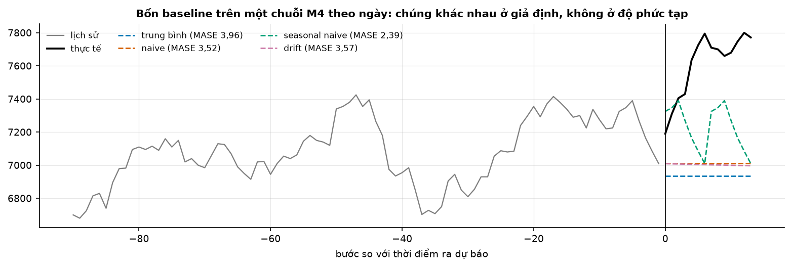
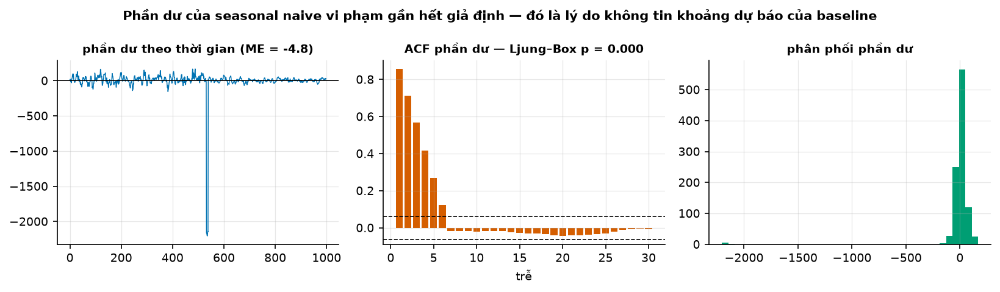
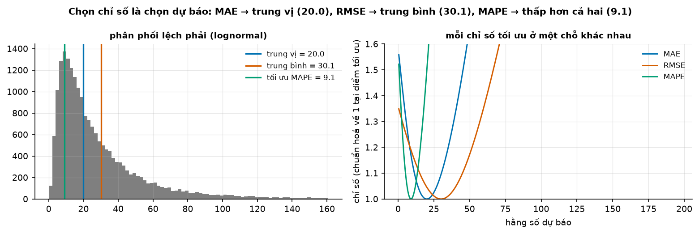
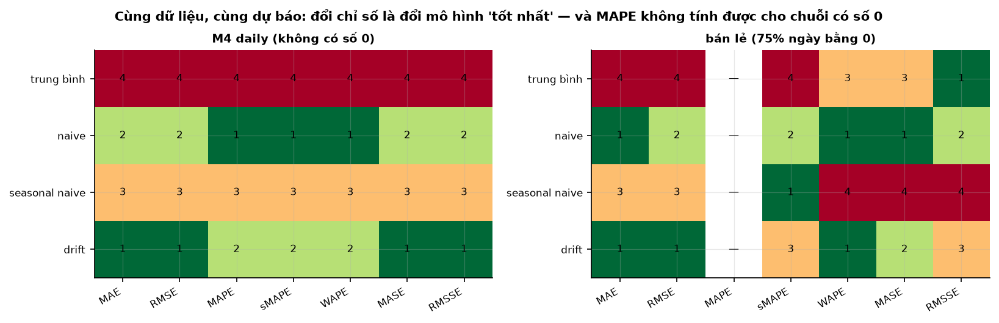

# Buổi 14 — Baseline và chỉ số đánh giá

## 1. Mục tiêu

Sau buổi này bạn:

- Viết bốn **baseline** (trung bình, naive, seasonal naive, drift) và nói mỗi cái giả định gì về tương lai.
- Phân biệt **phần dư** với **sai số dự báo**, và đọc được bốn phép chẩn đoán phần dư.
- Tự viết MAE, RMSE, ME, MAPE, sMAPE, WAPE, MASE, RMSSE bằng NumPy, khớp `utilsforecast` và nói chỗ quy ước khác nhau.
- Giải thích bằng ví dụ số vì sao **chọn chỉ số là chọn dự báo**: MAE ưa trung vị, RMSE ưa trung bình, MAPE ưa số thấp.
- Chỉ ra bằng bảng xếp hạng thật vì sao đổi chỉ số làm đổi mô hình "tốt nhất", nhất là khi chuỗi có số 0.

## 2. Nhắc lại buổi trước

Từ buổi 1–3:

- **Sai số** = thực tế − dự báo; dương là dự báo **thấp** hơn thực tế. **MAE** là trung bình của |sai số|.
- **Naive** dự báo mọi bước tới bằng giá trị cuối; **seasonal naive** lặp lại vòng mùa vụ gần nhất (thứ Hai tới = thứ Hai vừa rồi).
- **Trung vị**: số đứng giữa khi xếp tăng dần; vài số cực lớn không kéo được nó. Trung bình thì bị kéo.
- Muốn biết dự báo tốt tới đâu thì giữ **đoạn cuối** làm kỳ chấm, chỉ học trên phần trước nó.

Từ buổi 7–13:

- **ACF** $r_k$: chuỗi giống chính nó dời $k$ bước tới đâu. Vạch nằm ngoài hai đường đứt ($\pm 1{,}96/\sqrt n$) là tự tương quan đáng kể.
- **p-value** (buổi 7): xác suất thấy kết quả lệch cỡ này nếu giả thuyết "không có gì" đúng; p < 0,05 là có bằng chứng bác giả thuyết đó.
- **MASE** và **sMAPE** (buổi 9) đã dùng để đo độ khó. Hôm nay học kỹ cùng năm chỉ số khác.
- **Nhu cầu gián đoạn** (buổi 9): chuỗi nhiều kỳ bằng 0, thỉnh thoảng mới có số dương.

## 3. Trạng thái đầu buổi

Sau `python lab.py up` (trong thư mục `lab/`):

| Hạng mục | Trạng thái |
|---|---|
| Dữ liệu 1 | `du-lieu/raw/monash-m4-daily/m4_daily_dataset.tsf` — 4.227 chuỗi theo ngày của cuộc thi M4, sha256 `d4d70b66ab46` |
| Dữ liệu 2 | `uci-online-retail-ii/online_retail_II.xlsx` (`bcbe73b35f5b`) — hoá đơn một cửa hàng trực tuyến 12/2009 → 12/2011 |
| Nguồn | Monash Time Series Forecasting Repository (CC BY 4.0); UCI Online Retail II (CC BY 4.0) |
| Môi trường | Python 3.12; numpy 2.5.3, pandas 2.3.3, scipy 1.18.1, statsmodels 0.15.0, statsforecast 2.1.1, utilsforecast 0.2.16 |
| `code/danh_gia.py` | đọc dữ liệu, 4 hàm baseline + `BASELINE`, 8 hàm chỉ số, `danh_gia`, `xep_hang`, `so_voi_utilsforecast`, chẩn đoán phần dư, `toi_uu_theo_chi_so` |
| `code/lab.ipynb` | notebook của Lab, bước 1–5 |
| **Đang cố tình sai** | `BASELINE` thiếu seasonal naive; `mase`, `rmsse` lấy mẫu số trên đoạn đang chấm; `danh_gia` âm thầm bỏ giá trị vô hạn |
| **Triệu chứng** | bảng M4 chỉ có 3 baseline; MASE của naive 0,972 thay vì 0,835; bảng bán lẻ ghi MAPE `NaN` mà không nói vì sao |
| `python lab.py check` lúc này | ĐỎ: 5/13 test hỏng |

## 4. Lý thuyết

Dữ liệu chính:

- 1.000 chuỗi M4 theo ngày lấy ngẫu nhiên (seed 42), đủ dài để có phần học.
- **14 ngày cuối** của mỗi chuỗi là kỳ chấm, như M4 chấm.
- 300 mã hàng bán lẻ (seed 0), mỗi mã một chuỗi ngày đầy đủ 12/2009 → 12/2011, ngày không bán ghi 0: **75,4%** số ngày bằng 0.

### Từ mới trong buổi

| Thuật ngữ | Nghĩa một câu | Ví dụ |
|---|---|---|
| baseline | Phương pháp dự báo đơn giản nhất, làm mốc cho mọi mô hình khác phải vượt. | Seasonal naive. |
| drift | Nối điểm đầu với điểm cuối của lịch sử rồi kéo dài đường thẳng đó. | 10 → 18 trong 5 bước: mỗi bước +1,6. |
| giá trị khớp (fitted) | "Dự báo" cho chính các điểm trong phần học, mô hình đã thấy chúng. | Seasonal naive khớp thứ Ba bằng thứ Ba tuần trước. |
| phần dư | Thực tế − giá trị khớp, trên phần học. | 12 − 10 = 2. |
| Ljung–Box | Kiểm định gộp ACF của nhiều trễ; p nhỏ là phần dư còn tự tương quan. | p < 0,05 ở 99,8% chuỗi. |
| Jarque–Bera | Kiểm định phân phối có gần hình chuông không; p nhỏ là không. | Phần dư có vài cú rơi lớn. |
| MAE, RMSE | Trung bình của \|sai số\|; căn của trung bình (sai số²). | Sai số 1, −3: MAE 2, RMSE 2,24. |
| ME (độ chệch) | Trung bình của sai số có dấu. | 2 và −1 → 0,5: dự báo hơi thấp. |
| MAPE, sMAPE | Sai số chia cho thực tế (hoặc cho trung bình thực tế và dự báo), tính bằng %. | Thật 100, dự báo 90: MAPE 10%. |
| WAPE | Tổng \|sai số\| chia tổng \|thực tế\|. | 8 / 60 = 13,3%. |
| MASE, RMSSE | MAE (hoặc RMSE) chia cho sai số của seasonal naive trên phần học. | 0,8: sai bằng 80% mức baseline. |
| gộp (aggregate) | Tóm chỉ số của nhiều chuỗi thành một con số. | Trung vị MASE của 1.000 chuỗi. |

### 4.1 Bốn baseline

**Vấn đề.** Một mô hình có MAE 98 là tốt hay tệ? Không so với gì thì không trả lời được. Baseline là cái mốc đó. Thiếu nó, một
mô hình phức tạp có thể thua cả "lặp lại hôm qua" mà không ai biết.

**Trực giác.** Mỗi baseline là một câu đoán về tương lai:

- **trung bình**: tương lai giống mức trung bình cả lịch sử;
- **naive**: tương lai giống giá trị cuối;
- **seasonal naive**: tương lai lặp lại vòng mùa vụ vừa qua;
- **drift**: tương lai đi tiếp theo đường thẳng từ điểm đầu tới điểm cuối.

**Ví dụ số nhỏ — tự tính tay.** Chuỗi $(10, 14, 12, 16, 14, 18)$, chu kỳ $m$ = 2, dự báo 2 bước:

| Baseline | Tính | Dự báo |
|---|---|---|
| trung bình | 84 / 6 | 14; 14 |
| naive | giá trị cuối | 18; 18 |
| seasonal naive | lặp 2 giá trị cuối (14, 18) | 14; 18 |
| drift | độ dốc (18 − 10) / 5 = 1,6 | 19,6; 21,2 |

**Đọc bảng.** Bốn con số khác hẳn nhau từ cùng một lịch sử. Chuỗi này vừa lên xuống theo cặp, vừa tăng dần: seasonal naive bắt nhịp,
drift bắt xu hướng, không cái nào bắt cả hai.



**Cách đọc hình.**

1. **Trục ngang**: bước so với lúc ra dự báo; âm là 90 ngày lịch sử, 0 → 13 là 14 ngày chấm.
2. **Trục dọc**: giá trị của chuỗi (đơn vị gốc của M4).
3. **Ký hiệu**: xám là lịch sử, đen là thực tế, bốn đường đứt là bốn baseline; MASE ghi trong chú giải (mục 4.5, nhỏ hơn là tốt hơn).
4. **Nhìn vào đâu**: đường xanh lá (seasonal naive) so với ba đường phẳng.
5. **Kết luận**: seasonal naive (MASE 2,39) lên xuống theo nhịp tuần nên gần thực tế nhất; naive và drift gần như trùng nhau; cả bốn đều
   hụt vì chuỗi tăng vọt sau lúc ra dự báo.

**Dữ liệu thật.** Trên 1.000 chuỗi M4 theo ngày:

| Baseline | trung bình | naive | seasonal naive | drift |
|---|---|---|---|---|
| MASE trung vị | 8,85 | 0,835 | 1,077 | 0,810 |

**Đọc bảng.** Dữ liệu ngày của M4 có nhịp tuần yếu, nên naive và drift thắng seasonal naive. Seasonal naive là baseline **bắt buộc** của khoá (mọi mô hình phải
so với nó), nhưng không phải lúc nào cũng mạnh nhất: một mô hình mới phải vượt **mọi** baseline.

**Tóm lại.** **Baseline là dự báo đơn giản nhất cho một giả định về tương lai. Mọi mô hình phải thắng tất cả chúng, và luôn có seasonal
naive trong bảng.**

**Tự kiểm tra.** Chuỗi $(5, 7, 9, 11)$, dự báo 1 bước. Naive và drift cho bao nhiêu? Nếu chuỗi thật tăng đều 2 mỗi bước, cái nào đúng?

<details>
<summary>Đáp án</summary>

Naive: 11. Drift: độ dốc (11 − 5) / 3 = 2, dự báo 13. Chuỗi tăng đều nên drift đúng. Nhầm hay gặp: nghĩ baseline "đơn giản" thì luôn thua;
khi giả định của nó khớp dữ liệu, nó khó thắng.

</details>

### 4.2 Phần dư và chẩn đoán phần dư

**Vấn đề.** Sai số trên phần học (mô hình đã thấy dữ liệu) và sai số trên kỳ chấm (chưa thấy) là hai thứ khác nhau. Lẫn chúng thì báo
độ chính xác đẹp giả tạo. Nhưng phần dư vẫn có ích: nó cho biết mô hình còn bỏ sót gì.

**Trực giác.** Giá trị khớp là mô hình "trả bài" trên đề đã xem, nên phần dư thường nhỏ hơn sai số dự báo thật. Nếu mô hình đã lấy hết
quy luật của chuỗi, phần còn lại (phần dư) chỉ là nhiễu: không đoán được từ chính nó.

**Ví dụ số nhỏ — tự tính tay.** Seasonal naive $m$ = 2 trên $(10, 14, 12, 16, 14, 18)$ khớp mỗi điểm bằng điểm cách 2 bước trước:

- phần dư: 12 − 10 = 2; 16 − 14 = 2; 14 − 12 = 2; 18 − 16 = 2;
- trung bình phần dư là **2**, không phải 0: mô hình bỏ sót xu hướng tăng, nên dự báo thấp có hệ thống.

Phần dư của một mô hình "đã lấy hết quy luật" phải qua bốn phép kiểm (FPP §5.4):

| Tính chất | Kiểm bằng | Vi phạm thì |
|---|---|---|
| trung bình gần 0 | ME của phần dư | dự báo lệch một phía; cộng thêm độ lệch đó |
| không tự tương quan | ACF phần dư, Ljung–Box | còn quy luật chưa dùng; mô hình tốt hơn được |
| phương sai đều | so phương sai nửa đầu và nửa sau | khoảng dự báo sai độ rộng |
| gần hình chuông | histogram, Jarque–Bera | khoảng dự báo tính theo hình chuông sai |

**Đọc bảng.** Hai dòng đầu nói điểm dự báo còn cải thiện được; hai dòng sau chỉ ảnh hưởng **khoảng dự báo**: dải mà giá trị thật rơi vào với xác suất cho trước, ví dụ 80% (buổi 25).



**Cách đọc hình.**

1. **Trục ngang**: ô trái là thời gian (ngày); ô giữa là trễ 1 → 30; ô phải là giá trị phần dư.
2. **Trục dọc**: ô trái là phần dư (đơn vị gốc); ô giữa là ACF; ô phải là số ngày.
3. **Ký hiệu**: hai đường đứt ở ô giữa là $\pm 1{,}96/\sqrt n$.
4. **Nhìn vào đâu**: sáu cột ACF đầu ở ô giữa; cú rơi quanh ngày 530 ở ô trái.
5. **Kết luận**: ACF trễ 1 là 0,86 và Ljung–Box p gần 0: còn quy luật chưa dùng; một cú rơi rất lớn làm phân phối lệch hẳn khỏi hình
   chuông.

**Dữ liệu thật.** Phần dư seasonal naive trên phần học của 1.000 chuỗi:

| Vi phạm | Tỷ lệ chuỗi |
|---|---|
| còn tự tương quan (Ljung–Box p < 0,05) | 99,8% |
| không hình chuông (Jarque–Bera p < 0,05) | 92,5% |
| phương sai nửa sau gấp hơn 2 lần hoặc dưới một nửa nửa đầu | 46,4% |

**Đọc bảng.** Seasonal naive bỏ sót quy luật ở gần như mọi chuỗi: mô hình tốt hơn có chỗ để thắng.

**Tóm lại.** **Phần dư đo trên phần học, sai số dự báo đo trên kỳ chấm; chỉ số chính xác luôn tính trên kỳ chấm. Phần dư còn tự tương
quan nghĩa là mô hình còn bỏ sót quy luật.**

**Tự kiểm tra.** Báo cáo mô hình nào tốt hơn?

- Mô hình A: MAE phần dư 50, MAE kỳ chấm 120.
- Mô hình B: MAE phần dư 90, MAE kỳ chấm 95.

<details>
<summary>Đáp án</summary>

**B**: kỳ chấm mới là thước đo (95 < 120). Phần dư 50 của A chỉ nói A khớp tốt dữ liệu đã thấy, có thể là học thuộc. Nhầm hay gặp: chọn
mô hình theo sai số trên phần học.

</details>

### 4.3 MAE, RMSE, ME: chọn chỉ số là chọn dự báo

**Vấn đề.** MAE và RMSE đều đo "sai bao nhiêu", nhưng mỗi cái thưởng cho một con số dự báo khác nhau. Chấm bằng chỉ số không khớp với
chi phí thật thì chọn nhầm mô hình (Gneiting 2011).

**Ví dụ số nhỏ — tự tính tay.** Năm ngày kiểm, sai số = thực tế − dự báo:

| Ngày | 1 | 2 | 3 | 4 | 5 |
|---|---|---|---|---|---|
| thực tế | 10 | 12 | 8 | 14 | 16 |
| dự báo | 11 | 10 | 9 | 14 | 12 |
| sai số | −1 | 2 | −1 | 0 | 4 |

**Đọc bảng.** Tính ba chỉ số từ dòng sai số:

- MAE = (1 + 2 + 1 + 0 + 4) / 5 = **1,6**.
- RMSE = $\sqrt{(1 + 4 + 1 + 0 + 16)/5} = \sqrt{4{,}4} \approx$ **2,10**: bình phương phóng to sai số 4 của ngày 5.
- ME = (−1 + 2 − 1 + 0 + 4) / 5 = **0,8**: dương, dự báo thấp hơn thực tế 0,8 đơn vị mỗi ngày.

**Công thức.**

$$
\text{MAE} = \frac{1}{h}\sum_{t} \lvert e_t\rvert, \qquad \text{RMSE} = \sqrt{\frac{1}{h}\sum_{t} e_t^2}, \qquad \text{ME} = \frac{1}{h}\sum_t e_t,
\qquad e_t = y_t - \hat y_t
$$

- $h$: số điểm chấm; $y_t$: thực tế; $\hat y_t$: dự báo; $e_t$: sai số.

**Nói bằng lời.** MAE lấy trung bình độ lớn sai số; RMSE bình phương trước rồi mới lấy trung bình và căn, nên sai lớn nặng hơn nhiều;
ME giữ dấu nên sai dương và âm triệt tiêu. Ở ví dụ: 1,6; 2,10; 0,8.

**Mỗi chỉ số ưa một con số.** Giả sử chỉ được dự báo **một hằng số** $c$ cho dãy $(1, 2, 3, 4, 20)$:

| Hằng số $c$ | MAE | RMSE |
|---|---|---|
| 3 (trung vị) | **4,2** = (2 + 1 + 0 + 1 + 17) / 5 | 7,68 |
| 6 (trung bình) | 5,6 | **7,07** |

**Đọc bảng.** MAE nhỏ nhất ở trung vị, RMSE nhỏ nhất ở trung bình. Số 20 kéo trung bình lên nhưng không kéo được trung vị. Mất mát thật tăng
đều theo độ lệch thì dự báo trung vị và chấm bằng MAE. Một lần sai lớn gây hại gấp nhiều lần (quá tải lưới điện) thì dự báo trung bình và
chấm bằng RMSE.



**Cách đọc hình.**

1. **Trục ngang**: ô trái là giá trị (20.000 số mô phỏng lệch phải như doanh số, seed 0); ô phải là hằng số dự báo $c$.
2. **Trục dọc**: ô trái là số lần gặp mỗi khoảng giá trị; ô phải là chỉ số, chia cho giá trị nhỏ nhất của chính nó (1 là tối ưu).
3. **Ký hiệu**: xanh là trung vị / MAE, cam là trung bình / RMSE, xanh lá là MAPE (mục 4.4).
4. **Nhìn vào đâu**: đáy của ba đường cong ở ô phải.
5. **Kết luận**: MAE đáy ở 20,0 (trung vị), RMSE đáy ở 30,1 (trung bình), MAPE đáy ở 9,1: thấp hơn cả hai.

**ME.** ME không đo độ chính xác: sai +10 và −10 cho ME = 0. Nó đo **độ chệch**: luôn báo kèm MAE. Theo dõi ME cộng dồn theo thời gian
(tracking signal) để phát hiện mô hình bắt đầu lệch một phía.

**Tóm lại.** **MAE ưa trung vị, RMSE ưa trung bình: chọn chỉ số theo chi phí thật của sai lệch. ME đo độ chệch, không đo độ chính xác.**

**Tự kiểm tra.** Sai số 3 ngày là $(2, -2, 5)$. Tính MAE, RMSE, ME. Nếu bỏ ngày cuối, chỉ số nào giảm nhiều nhất?

<details>
<summary>Đáp án</summary>

MAE = 9/3 = 3; RMSE = $\sqrt{33/3} \approx 3{,}32$; ME = 5/3 ≈ 1,67. Bỏ ngày cuối: MAE 2, RMSE 2, ME **0**. ME giảm hết vì $+2$ và $-2$ triệt
tiêu; RMSE giảm nhiều hơn MAE (3,32 → 2 so với 3 → 2) vì số 5 bị bình phương. Nhầm hay gặp: đọc ME = 0 là "dự báo hoàn hảo".

</details>

### 4.4 MAPE, sMAPE, WAPE: chỉ số phần trăm

**Vấn đề.** Người đọc báo cáo thích phần trăm: "sai 5%" dễ hiểu hơn "sai 98 đơn vị". Nhưng chia cho thực tế sinh ra hai bẫy: số 0 và bất đối
xứng.

**Ví dụ số nhỏ — tự tính tay.** Cùng bảng 5 ngày ở mục 4.3:

- MAPE = (10 + 16,7 + 12,5 + 0 + 25) / 5 = **12,8%**, mỗi số hạng là |sai số| / thực tế × 100 của một ngày.
- sMAPE: mỗi ngày 200 × |sai số| / (thực tế + dự báo), trung bình **13,6** (thang 0–200).
- WAPE: tổng |sai số| / tổng thực tế = 8 / 60 = **13,3%**.
- **Bẫy số 0**: thêm một ngày thực tế 0, dự báo 1: MAPE của ngày đó là 1/0, vô hạn, và cả trung bình thành vô hạn.
- **Bẫy bất đối xứng**: cùng lệch 50 đơn vị, dự báo cao hơn bị phạt nặng hơn:

| Thực tế | Dự báo | MAPE |
|---|---|---|
| 100 | 150 | 50% |
| 150 | 100 | 33,3% |

**Đọc bảng.** Hai dòng chỉ đổi chỗ thực tế và dự báo; MAPE chia cho thực tế, nên dòng có thực tế nhỏ hơn (dự báo cao) bị phạt nặng hơn.

**Công thức.**

$$
\text{MAPE} = \frac{100}{h}\sum_t \left\lvert \frac{e_t}{y_t}\right\rvert, \qquad
\text{sMAPE} = \frac{200}{h}\sum_t \frac{\lvert e_t\rvert}{\lvert y_t\rvert + \lvert \hat y_t\rvert}, \qquad
\text{WAPE} = 100\,\frac{\sum_t \lvert e_t\rvert}{\sum_t \lvert y_t\rvert}
$$

**Nói bằng lời.** MAPE chia **từng** sai số cho **từng** thực tế; sMAPE chia cho trung bình của thực tế và dự báo; WAPE chia **tổng** sai
số cho **tổng** thực tế. Ở ví dụ: 12,8%; 13,6; 13,3%.

**Vì sao MAPE ưa số thấp.** Dự báo thấp sai nhiều nhất là 100% (dự báo 0), còn dự báo cao thì sai bao nhiêu phần trăm cũng được. Tối ưu
MAPE vì thế kéo dự báo xuống dưới cả trung vị: đường xanh lá ở hình mục 4.3. sMAPE mang tên "đối xứng" nhưng cũng không đối xứng
(Hyndman & Koehler 2006).

**Khi nào dùng, khi nào không.**

- WAPE: gộp nhiều mặt hàng thành một phần trăm, sống được với ngày có số 0 (miễn tổng thực tế khác 0). Mặt hàng bán chạy chiếm gần hết con số.
- MAPE: chỉ khi chuỗi luôn dương và xa 0, người đọc chỉ hiểu phần trăm. Không dùng cho nhiệt độ °C (0 °C không có nghĩa "không có gì").
- sMAPE: để so với kết quả cuộc thi M4 dùng nó; luôn ghi thang đang dùng (mục 4.6).

**Tóm lại.** **Chỉ số phần trăm dễ đọc nhưng vỡ khi thực tế bằng 0, và MAPE kéo dự báo xuống thấp. Chuỗi có số 0 thì dùng WAPE hoặc chỉ số
chia thang (mục 4.5).**

**Tự kiểm tra.** Hai ngày thực tế $(0, 50)$, dự báo $(2, 40)$. Tính MAPE và WAPE.

<details>
<summary>Đáp án</summary>

MAPE: ngày 1 là 2/0, **vô hạn**, nên MAPE vô hạn. WAPE = (2 + 10) / (0 + 50) = 24%. Nhầm hay gặp: bỏ qua ngày có thực tế 0 rồi báo MAPE
20% như không có chuyện gì; đó chính là "âm thầm bỏ giá trị vô hạn".

</details>

### 4.5 MASE, RMSSE: chia cho baseline trên phần học

**Vấn đề.** MAE 98 của một chuỗi và MAE 3 của chuỗi khác không so được: khác đơn vị, khác cỡ. Chia phần trăm thì vỡ với số 0. Cần một
thước đo không đơn vị, không chia cho thực tế.

**Trực giác.** Chia MAE của mô hình cho MAE của seasonal naive **trên phần học**. Kết quả là "mô hình sai bằng bao nhiêu lần mức sai quen
thuộc của baseline trên chuỗi này". Mẫu số là con số của **quá khứ**, cố định trước khi chấm.

**Ví dụ số nhỏ — tự tính tay.** Phần học $(9, 11, 10, 12, 13)$, $m$ = 1 (naive thường); kỳ chấm là bảng 5 ngày mục 4.3.

- Bước nhảy giữa hai ngày liền trên phần học: 2, 1, 2, 1 → trung bình **1,5**.
- MASE = 1,6 / 1,5 ≈ **1,07**: mô hình sai hơn mức naive quen thuộc một chút.
- RMSSE: bình phương bước nhảy trung bình (4 + 1 + 4 + 1) / 4 = 2,5; RMSSE = $\sqrt{4{,}4 / 2{,}5} \approx$ **1,33**.

**Công thức.**

$$
\text{MASE} = \frac{\text{MAE}}{\frac{1}{T-m}\sum_{t=m+1}^{T} \lvert y_t - y_{t-m}\rvert}, \qquad
\text{RMSSE} = \sqrt{\frac{\frac{1}{h}\sum_t e_t^2}{\frac{1}{T-m}\sum_{t=m+1}^{T} (y_t - y_{t-m})^2}}
$$

- $T$: số điểm của phần học; $m$: chu kỳ mùa vụ (M4 theo ngày: $m$ = 7); tổng ở mẫu số chạy trên phần học.

**Nói bằng lời.** MASE: MAE của kỳ chấm chia MAE của seasonal naive trong phần học. Dưới 1 là sai ít hơn mức baseline quen thuộc; ở ví
dụ 1,6 / 1,5 = 1,07. RMSSE làm tương tự với bình phương, dùng trong cuộc thi M5.

**Hai bẫy.**

- **Mẫu số lấy trên đoạn đang chấm**: sai định nghĩa, và còn dùng thông tin tương lai để chuẩn hoá. Code đầu buổi làm vậy; MASE của naive
  trên M4 ra 0,972 thay vì 0,835.
- **MASE < 1 không có nghĩa là thắng seasonal naive trên kỳ chấm**: mẫu số là sai số của seasonal naive **trên phần học**, mỗi điểm đoán
  bằng điểm cách một chu kỳ trước. Dự báo 14 ngày tới, càng xa điểm cuối càng khó, thường sai nhiều hơn thế. Muốn biết thắng baseline thì
  chạy baseline trên cùng kỳ chấm.

Chuỗi phần học tuần hoàn hoàn hảo cho mẫu số bằng 0: MASE không tính được, hàm phải trả `NaN`, không trả 0.

**Tóm lại.** **MASE và RMSSE chia sai số cho sai số của seasonal naive trên phần học, nên so được giữa các chuỗi và sống được với số 0. Mẫu
số luôn lấy từ phần học.**

**Tự kiểm tra.** Phần học có bước nhảy mùa vụ trung bình 4. Mô hình có MAE 3 trên kỳ chấm. Seasonal naive có MAE 5 trên cùng kỳ chấm. MASE
của mỗi cái? Mô hình thắng seasonal naive không?

<details>
<summary>Đáp án</summary>

MASE mô hình = 3/4 = 0,75; seasonal naive = 5/4 = 1,25. Cùng kỳ chấm, 3 < 5: mô hình thắng. Chú ý seasonal naive có MASE 1,25, không phải 1:
kỳ chấm khó hơn phần học. Nhầm hay gặp: nghĩ seasonal naive luôn có MASE bằng 1.

</details>

### 4.6 Đổi chỉ số, đổi hạng

**Vấn đề.** Có tám chỉ số và hàng nghìn chuỗi. Báo cáo con số nào? Và thư viện có tính giống mình không?

**Gộp qua nhiều chuỗi.** Mỗi chuỗi cho một con số; gộp bằng **trung vị** thì vài chuỗi cực đoan không kéo được kết quả, gộp bằng
**trung bình** (cách M4 dùng) thì kết quả nhạy với chúng. Báo cả hai khi chúng xếp hạng khác nhau. Chỉ số không tính được ở chuỗi nào
(vô hạn, NaN) thì bảng phải đếm và nói ra, không âm thầm bỏ.



**Cách đọc hình.**

1. **Trục ngang** (cả hai ô): bảy chỉ số (tám chỉ số trừ ME, vì ME không đo độ chính xác).
2. **Trục dọc**: bốn baseline.
3. **Ký hiệu**: số trong ô là hạng (1 tốt nhất), xanh đậm là hạng 1, đỏ là hạng 4; "—" là không tính được.
4. **Nhìn vào đâu**: ô trái (M4, không có số 0) so với ô phải (bán lẻ).
5. **Kết luận**: M4 gần như cùng thứ hạng ở mọi chỉ số; bán lẻ thì hạng nhất đổi theo chỉ số: naive/drift theo MAE, seasonal naive theo
   sMAPE, trung bình theo RMSSE, còn MAPE không tính được ở cả 300 chuỗi.

**Dữ liệu thật: bán lẻ.** Trung vị qua 300 mã hàng:

| Baseline | MAE | sMAPE | WAPE | MASE | RMSSE |
|---|---|---|---|---|---|
| trung bình | 3,63 | 163,9 | 112,6 | 0,795 | 0,303 |
| naive | 2,75 | 91,2 | 100,0 | 0,635 | 0,327 |
| seasonal naive | 3,29 | 80,9 | 116,9 | 0,840 | 0,442 |
| drift | 2,75 | 125,5 | 100,0 | 0,639 | 0,328 |

**Đọc bảng.** So từng cột: mỗi cột có một hạng nhất khác. WAPE trung vị của naive đúng 100: hơn nửa số mã hàng có ngày cuối của phần học
bằng 0, nên naive dự báo toàn 0 và sai đúng bằng tổng thực tế. MAE vẫn xếp nó hạng nhất: dự báo toàn 0 cho MAE thấp trên chuỗi thưa, nhưng
vô dụng cho việc nhập hàng. Mã hàng nào có kỳ chấm toàn 0 thì WAPE không tính được (76 mã).

**Quy ước thư viện.** So với `utilsforecast.losses` trên 1.000 chuỗi M4, seasonal naive:

| Chỉ số | Tự viết | utilsforecast | Tỷ lệ |
|---|---|---|---|
| MAE, RMSE, MASE, RMSSE | 231,24; 270,59; 1,398; 1,105 | như nhau | 1 |
| MAPE | 4,90 | 0,049 | 100 |
| sMAPE | 3,59 | 0,0179 | 200 |

**Đọc bảng.** Bốn chỉ số khớp tuyệt đối; MAPE và sMAPE của thư viện là tỷ lệ (thang 0–1), không phải phần trăm. Dán thẳng số của thư viện
vào báo cáo cạnh số M4 sẽ lệch 200 lần. (Bảng này gộp bằng trung bình, như `utilsforecast`.)

**Tóm lại.** **Chọn chỉ số theo quyết định trước khi xem kết quả, báo cách gộp và số chuỗi không tính được, và đọc quy ước của thư viện
trước khi dán số vào báo cáo.**

**Tự kiểm tra.** Bảng báo cáo ghi "sMAPE 0,05" từ `utilsforecast` và "sMAPE 12" từ một bài báo M4. Mô hình nào tốt hơn?

<details>
<summary>Đáp án</summary>

Chưa so được. Con số của thư viện là tỷ lệ; nhân 200 để về thang của M4 thì được 10, nhỏ hơn con số của bài báo. Nhưng chỉ có nghĩa nếu hai bên chấm
trên cùng dữ liệu, cùng kỳ chấm. Nhầm hay gặp: so thẳng hai con số của hai thang.

</details>

## 5. Lab từng bước

Lệnh gõ trong terminal ở thư mục `lab/`. Code các bước nằm sẵn trong `code/lab.ipynb` (mở bằng `python lab.py notebook` hoặc VS Code),
chạy từng ô từ trên xuống. Bạn sửa `code/danh_gia.py`; notebook tự nạp lại bản mới.

### Bước 1 — Bảng chỉ số đầu buổi

**Mục đích:** thấy bảng đang thiếu gì trước khi sửa.

```bash
python lab.py up           # một lần: môi trường + dữ liệu M4 và Online Retail II, kiểm sha256
python lab.py check        # 5/13 test đỏ
python lab.py notebook     # chạy ô bước 1
```

**Đọc kết quả:** `BASELINE` chỉ có 3 tên; MASE của naive 0,972 và drift 0,979. Chưa sửa gì ở bước này.

### Bước 2 — Seasonal naive và phần dư

**Mục đích:** thêm `"seasonal naive": bl_naive_mua_vu` vào `BASELINE` (mục 4.1). Chạy lại ô bước 1 và ô bước 2.

**Đọc kết quả:** ví dụ 6 số in đúng bảng mục 4.1, phần dư toàn 2 (mục 4.2); tóm tắt chẩn đoán như bảng mục 4.2. Bảng bước 1 có đủ
bốn baseline.

### Bước 3 — MAE, RMSE, ME

**Mục đích:** nối mục 4.3–4.4 với code, không cần sửa.

**Đọc kết quả:** sáu chỉ số khớp ví dụ tay mục 4.3–4.4 (RMSE in 2,098, tài liệu làm tròn 2,10). Hằng số tối ưu của dãy $(1, 2, 3, 4, 20)$
và của mẫu lệch phải như mục 4.3.

### Bước 4 — Mẫu số của MASE

**Mục đích:** sửa `mase` và `rmsse` để mẫu số lấy từ `hoc` thay vì `y` (mục 4.5). Chạy lại ô bước 4 và ô bước 1.

**Đọc kết quả:** MASE và RMSSE như ví dụ tay mục 4.5; bảng đối chiếu như bảng quy ước mục 4.6. Ô bước 1: MASE của naive thành 0,835.

### Bước 5 — Chuỗi có số 0

**Mục đích:** sửa `danh_gia` để với mỗi chỉ số thêm cột `<chỉ số>_vô hạn` đếm số chuỗi không tính được (mục 4.6). Chạy lại ô bước 5, rồi:

```bash
python lab.py check        # 13/13 xanh
```

**Đọc kết quả:** bảng có thêm `MAPE_vô hạn` (300: mọi mã hàng) và `WAPE_vô hạn`; bảng xếp hạng đổi hạng nhất theo chỉ số như hình mục 4.6. Xanh 13/13 là xong; `test_bao_cao_so_gia_tri_vo_han` còn đỏ thì bảng vẫn chưa có cột đếm.

## 6. Lỗi thường gặp & cách chẩn đoán

| Triệu chứng | Nguyên nhân | Chẩn đoán | Sửa |
|---|---|---|---|
| Mô hình "tốt" mà không ai biết tốt hơn cái gì | không có baseline | bảng có seasonal naive không | luôn chấm cùng 4 baseline |
| MAE trên phần học rất đẹp | lẫn phần dư với sai số dự báo | chỉ số tính trên đoạn nào | chỉ báo sai số trên kỳ chấm |
| MAPE `inf` hoặc `NaN` | thực tế bằng 0 | đếm số 0 trong kỳ chấm | WAPE, MASE; đếm và báo số chuỗi không tính được |
| Tối ưu MAPE ra dự báo thấp có hệ thống | MAPE phạt dự báo cao nặng hơn | ME âm lớn | đổi chỉ số theo chi phí thật |
| MASE lệch thư viện | mẫu số lấy trên kỳ chấm | so với `utilsforecast.mase` | mẫu số từ phần học |
| MASE `inf`/0 trên chuỗi phẳng | mẫu số bằng 0 | `np.mean(np.abs(hoc[m:] - hoc[:-m]))` | trả `NaN`, báo riêng |
| sMAPE lệch 200 lần | quy ước thang khác | đọc tài liệu hàm | ghi thang cạnh mọi con số |
| Dấu ME ngược với đồng nghiệp | ME = ŷ − y ở thư viện khác (`utilsforecast.bias`) | tính tay một ví dụ | ghi rõ quy ước sai số |
| Hạng nhất đổi khi đổi cách gộp | vài chuỗi cực đoan | so trung vị với trung bình | báo cả hai |
| Dự báo toàn 0 thắng MAE | chuỗi thưa, MAE ưa trung vị bằng 0 | tỷ lệ số 0 | xem thêm WAPE, RMSSE, chi phí thật |

## 7. Bài tập về nhà

1. **Theo tầm dự báo.** Tính MAE của seasonal naive riêng cho từng bước 1 → 14 trên M4. Sai số tăng thế nào theo bước?
2. **Tracking signal.** Với một mã hàng bán lẻ, tính ME cộng dồn qua 14 ngày chấm chia cho MAE. Khi nào con số này báo động?
3. **Chi phí lệch.** Giả sử thiếu hàng mất 4 đồng, thừa mất 1 đồng mỗi đơn vị. Hằng số nào tối thiểu chi phí trên mẫu lệch phải của bước 3 (buổi 1: quantile $4/(4+1)$ = 0,8)?
   So với trung vị và trung bình.

## 8. Tiêu chí "Xong khi"

- [ ] `python lab.py check` xanh 13/13.
- [ ] Có hàm `danh_gia()` trả bảng 8 chỉ số × 4 baseline, kèm cột đếm giá trị không tính được.
- [ ] Tính tay được MAE, RMSE, ME, MAPE, WAPE, MASE trên một bảng 5 ngày.
- [ ] Giải thích bằng ví dụ số vì sao MAE ưa trung vị, RMSE ưa trung bình.
- [ ] Chỉ ra trên bảng bán lẻ ba chỉ số cho ba hạng nhất khác nhau, và nói nên dùng chỉ số nào cho việc nhập hàng.

## 9. Đọc thêm

- Hyndman, R.J. & Athanasopoulos, G. *Forecasting: Principles and Practice* (3rd ed.), chương 5: https://otexts.com/fpp3/toolbox.html
- Hyndman, R.J. & Koehler, A.B. (2006). Another look at measures of forecast accuracy. *International Journal of Forecasting* 22(4).
- Gneiting, T. (2011). Making and evaluating point forecasts. *JASA* 106(494).
- Makridakis, S. et al. *M5 Competitors' Guide* (RMSSE, WRMSSE).
- Hewamalage, H., Ackermann, K. & Bergmeir, C. (2023). Forecast evaluation for data scientists: common pitfalls and best practices.
  *Data Mining and Knowledge Discovery*; arXiv:2203.10716.
- Phụ lục D của khoá: bảng công thức mọi chỉ số, CRPS, Winkler, Diebold–Mariano.
- `utilsforecast.losses`: https://nixtlaverse.nixtla.io/utilsforecast/losses.html
