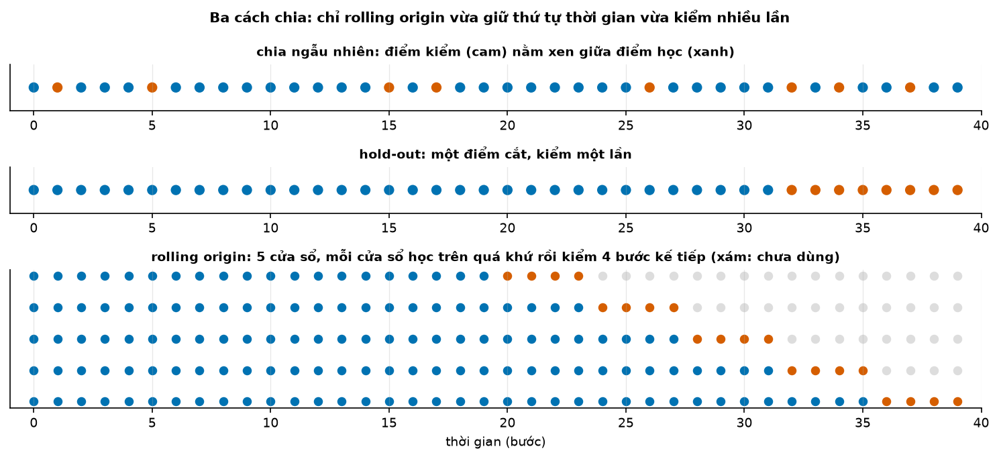
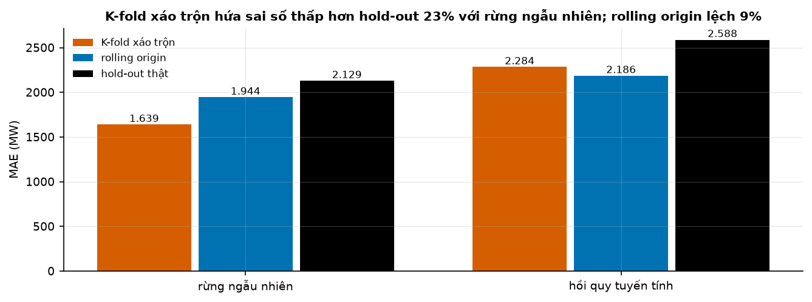
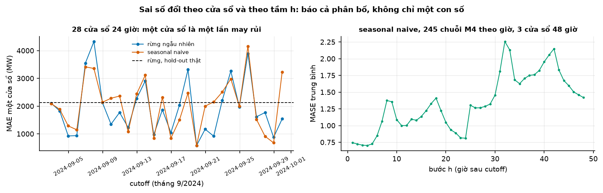
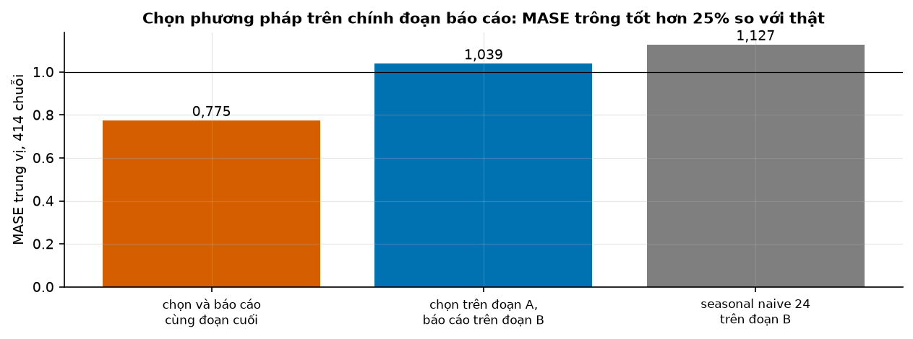
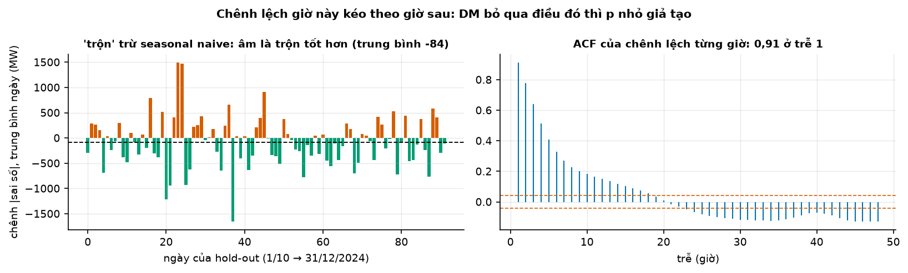

# Buổi 15 — Backtesting đúng cách

## 1. Mục tiêu

Sau buổi này bạn:

- Chứng minh bằng số trên dữ liệu thật rằng chia ngẫu nhiên hứa sai số thấp hơn thực tế, và nói khi nào nó không sai nhiều.
- Tự viết bộ **backtest rolling origin** (`chia_cua_so`, `backtest`) có `gap` và sliding window, khớp `statsforecast.cross_validation`.
- Đọc sai số theo **từng cửa sổ** và theo **từng bước h**, thay vì tin một con số.
- Tách **ba tập**: tune, chọn mô hình, báo cáo; đo được báo cáo trên đoạn đã dùng để chọn lạc quan bao nhiêu.
- Chạy kiểm định **Diebold–Mariano** bản hiệu chỉnh cho dự báo nhiều bước, và giải thích vì sao bản bỏ tự tương quan cho p nhỏ giả tạo.

## 2. Nhắc lại buổi trước

Từ buổi 1–3 và 13:

- **Sai số** = thực tế − dự báo. **Hold-out**: giữ đoạn cuối làm kỳ chấm, chỉ học trên phần trước nó.
- **Rò rỉ tương lai**: dùng thông tin chưa có lúc ra dự báo. Feature cho $y_t$ khi dự báo trước $h$ bước chỉ được dùng $y$ tới $t - h$.
- **Feature / mục tiêu**: cột đầu vào của mô hình / con số cần dự báo. **Hồi quy tuyến tính**: tổng có trọng số của các feature.

Từ buổi 7 và 14:

- **Tự tương quan**, **ACF** $r_k$: chuỗi giống chính nó dời $k$ bước tới đâu. **p-value**: p < 0,05 là có bằng chứng bác giả thuyết "không có
  gì khác nhau".
- **MAE**; **MASE** = MAE chia MAE của seasonal naive trên phần học. **Seasonal naive** là baseline mọi mô hình phải so.
- **Phương sai**: trung bình bình phương độ lệch khỏi trung bình; **độ lệch chuẩn** là căn của nó. **Sai số chuẩn** (buổi 8) của một trung bình
  $n$ số: độ lệch chuẩn của chính trung bình đó, bằng $\sqrt{\text{phương sai} / n}$ khi $n$ số độc lập nhau.
- **Phần dư** (buổi 14): thực tế − giá trị mô hình khớp trên phần học; mô hình tốt để lại phần dư không tự tương quan.

## 3. Trạng thái đầu buổi

Sau `python lab.py up` (trong thư mục `lab/`):

| Hạng mục | Trạng thái |
|---|---|
| Dữ liệu 1 | `du-lieu/raw/eia930-balance-2024-h1/EIA930_BALANCE_2024_Jan_Jun.csv` (266.398 dòng, sha256 `26768c495c3b`) và `-h2/…_Jul_Dec.csv` (269.426 dòng, `a602a8e577cf`): tải điện theo giờ mọi vùng điều độ Mỹ năm 2024; buổi này dùng vùng ERCOT (Texas), 8.784 giờ |
| Dữ liệu 2 | `monash-m4-hourly/m4_hourly_dataset.tsf` (`f3c0112e09ce`) — 414 chuỗi theo giờ của cuộc thi M4, dài 748–1.008 giờ |
| Nguồn | U.S. EIA Form 930 (public domain); Monash Time Series Forecasting Repository (CC BY 4.0) |
| Môi trường | Python 3.12; numpy 2.5.3, pandas 2.3.3, scipy 1.18.1, scikit-learn 1.9.1, statsforecast 2.1.1 |
| `code/backtest.py` | đọc dữ liệu, `bang_feature`, hai mô hình, `chia_cua_so`, `backtest`, `uoc_luong_sai_so`, `uoc_luong_kfold`, `sai_so_hold_out`, `chon_va_bao_cao`, `diebold_mariano`, đối chiếu statsforecast |
| `code/lab.ipynb` | notebook của Lab, bước 1–5 |
| **Đang cố tình sai** | `uoc_luong_sai_so` chia ngẫu nhiên 80/20; `chon_va_bao_cao` tune, chọn và báo cáo trên cùng đoạn cuối; `diebold_mariano` bỏ qua tầm h |
| **Triệu chứng** | cột "rolling origin" hứa MAE 1.617 MW, thấp hơn hold-out 24%; chọn theo chuỗi báo MASE 0,775; một mô hình hơn seasonal naive 4% có p = 0,0000012 |
| `python lab.py check` lúc này | ĐỎ: 3/9 test hỏng |

## 4. Lý thuyết

Bài toán chính: **dự báo tải điện ERCOT cho 24 giờ của ngày mai**. Ba tháng cuối năm (1/10 → 31/12/2024) để riêng làm **hold-out thật**:
chỉ mở một lần, ở cuối, để kiểm xem mọi cách ước lượng trước đó có nói thật không.

### Từ mới trong buổi

| Thuật ngữ | Nghĩa một câu | Ví dụ |
|---|---|---|
| backtest | Chạy lại mô hình trên quá khứ như thể đang dự báo thật, để đo sai số. | Đứng ở 1/9, dự báo 2/9, rồi mở đáp án. |
| K-fold xáo trộn | Chia ngẫu nhiên dữ liệu thành $K$ phần; lần lượt lấy một phần làm tập kiểm, học trên phần còn lại. | $K$ = 5: mỗi lần kiểm 20% số giờ. |
| cutoff (mốc cắt) | Thời điểm cuối cùng mô hình được thấy khi ra một dự báo. | 23:00 ngày 1/9. |
| rolling origin | Nhiều cutoff nối tiếp; ở mỗi cutoff học trên quá khứ, dự báo đoạn ngay sau. | 28 cutoff, mỗi ngày một. |
| expanding / sliding window | Học trên toàn bộ quá khứ / chỉ trên $L$ bước gần nhất. | Sliding $L$ = 90 ngày. |
| gap | Số bước bỏ trống giữa cutoff và đoạn dự báo, khi dữ liệu về trễ. | Số liệu về trễ 1 ngày: gap = 24 giờ. |
| refit | Học lại mô hình ở mỗi cửa sổ. | Rừng ngẫu nhiên học lại 28 lần. |
| rừng ngẫu nhiên (random forest) | Mô hình gồm nhiều bộ quy tắc dạng "nếu giờ ≥ 17 và là ngày thường thì…" (mỗi bộ gọi là một cây), dự báo bằng trung bình của chúng; rất giỏi nhớ các dòng giống nhau. | 200 cây. |
| tune | Thử nhiều cách đặt tham số, giữ cách cho sai số thấp nhất. | Thử 11 giá trị $w$. |
| Diebold–Mariano (DM) | Kiểm định: chênh sai số giữa hai dự báo có lớn hơn mức dao động ngẫu nhiên không. | p = 0,45: chưa có bằng chứng. |
| tự hiệp phương sai | Như tự tương quan nhưng chưa chia phương sai: đo $d_t$ và $d_{t+k}$ cùng lên xuống cỡ nào. | $\hat\gamma_1$. |
| phân phối t | Hình chuông có đuôi dày hơn, dùng thay hình chuông chuẩn khi số quan sát ít. | 4 bậc tự do. |

### 4.1 Vì sao không chia ngẫu nhiên

**Vấn đề.** Trong học máy thông thường, người ta chia ngẫu nhiên dữ liệu thành tập học và tập kiểm. Với chuỗi thời gian, điểm kiểm nằm xen
giữa các điểm học: mô hình được "nhìn" giờ trước **và giờ sau** của chính điểm nó phải đoán.

**Trực giác.** Như làm bài thi mà đề đã lộ một nửa: câu hỏi giờ 10 dễ trả lời khi đã biết đáp án giờ 9 và giờ 11. Lúc dự báo thật, bạn chỉ
có giờ 9.

**Ví dụ số nhỏ — tự tính tay.** Chuỗi tăng đều $(10, 12, 14, 16, 18, 20)$.

- **Chia ngẫu nhiên**, số 14 (vị trí 3) rơi vào tập kiểm. Mô hình đoán bằng trung bình hai hàng xóm trong tập học: (12 + 16) / 2 = 14. Sai **0**.
- **Hold-out**, hai điểm cuối làm tập kiểm, dự báo cả hai bằng giá trị cuối đã biết (16): sai 18 − 16 = 2 và 20 − 16 = 4, MAE **3**.

Chia ngẫu nhiên hứa sai số 0 cho một việc mà lúc chạy thật sai trung bình 3.



**Cách đọc hình.**

1. **Trục ngang** (cả ba ô): thời gian, bước 0 → 39.
2. **Trục dọc**: không có đơn vị; ô dưới mỗi hàng là một cửa sổ.
3. **Ký hiệu**: xanh là điểm học, cam là điểm kiểm, xám là điểm cửa sổ đó chưa dùng.
4. **Nhìn vào đâu**: vị trí các chấm cam so với chấm xanh ở từng ô.
5. **Kết luận**: chia ngẫu nhiên đặt điểm kiểm giữa điểm học; hold-out chỉ kiểm một lần; rolling origin kiểm 5 lần, lần nào cũng chỉ học trên
   quá khứ (mục 4.2).

**Dữ liệu thật.** Rừng ngẫu nhiên và hồi quy tuyến tính dự báo tải ngày mai từ feature lag ≥ 24 giờ và giờ, thứ, ngày trong năm. Học trên
1/1 → 30/9, ước lượng sai số bằng K-fold xáo trộn ($K$ = 5, seed 0), rồi mở hold-out:

| Mô hình | K-fold xáo trộn | Hold-out thật | K-fold lệch |
|---|---|---|---|
| rừng ngẫu nhiên | 1.639 MW | 2.129 MW | −23,0% |
| hồi quy tuyến tính | 2.284 MW | 2.588 MW | −11,8% |

**Đọc bảng.** So hai cột MAE: K-fold hứa sai số thấp hơn thật ở cả hai mô hình, nhưng rừng ngẫu nhiên lạc quan gấp đôi. Rừng ngẫu nhiên nhớ
rất giỏi: với feature "ngày trong năm" và "giờ", nó tìm thấy trong tập học chính ngày đó, giờ bên cạnh.

**Khi nào dùng, khi nào không.** K-fold không phải lúc nào cũng sai. Bergmeir, Hyndman & Koo (2018) chứng minh: với mô hình chỉ dùng lag
và phần dư không tự tương quan (buổi 14), K-fold ước lượng tốt. Hồi quy tuyến tính ở đây gần trường hợp đó. Nhưng mô hình nhớ giỏi, có feature
thời gian, hay chuỗi đổi chế độ thì K-fold lạc quan nặng. Mặc định cho dự báo: không chia ngẫu nhiên.

**Tóm lại.** **Chia ngẫu nhiên cho mô hình thấy hàng xóm tương lai của điểm kiểm, nên hứa sai số thấp hơn thật; mô hình càng giỏi nhớ thì
càng lạc quan. Đo sai số chỉ bằng cách học trên quá khứ, kiểm trên tương lai.**

**Tự kiểm tra.** Chuỗi $(5, 6, 7, 8, 9, 10)$. Chia ngẫu nhiên, số 8 vào tập kiểm, đoán bằng trung bình hai hàng xóm. Hold-out hai điểm cuối,
đoán bằng giá trị cuối đã biết. MAE mỗi cách?

<details>
<summary>Đáp án</summary>

Chia ngẫu nhiên: (7 + 9) / 2 = 8, sai **0**. Hold-out: giá trị cuối đã biết là 8, đoán 8 cho cả 9 và 10, sai 1 và 2, MAE **1,5**. Nhầm hay
gặp: nghĩ chia ngẫu nhiên "công bằng hơn" vì trộn đều; chính việc trộn cho mô hình thấy tương lai.

</details>

### 4.2 Rolling origin: bộ backtest của khoá

**Vấn đề.** Hold-out chỉ kiểm một lần: một điểm cắt duy nhất là một lần may rủi. Cần kiểm nhiều lần mà lần nào cũng chỉ học trên quá khứ.

**Trực giác.** Đứng ở một ngày trong quá khứ, giả vờ không biết gì sau đó, dự báo, rồi mở đáp án. Dời ngày đứng lên, làm lại. Mỗi lần là
một **cửa sổ**.

**Ví dụ số nhỏ — tự tính tay.** 10 bước (vị trí 0 → 9), tầm $h$ = 2, 3 cửa sổ, cutoff cách nhau 2 bước. Cửa sổ cuối phải kết thúc đúng ở
bước 9, nên cutoff cuối là 9 − 2 = 7; lùi hai bước mỗi lần:

| Cửa sổ | Học trên | Cutoff | Dự báo |
|---|---|---|---|
| 1 | 0 → 3 | 3 | 4, 5 |
| 2 | 0 → 5 | 5 | 6, 7 |
| 3 | 0 → 7 | 7 | 8, 9 |

**Đọc bảng.** Phần học lớn dần (expanding). Thêm `gap` = 1 (số liệu về trễ một bước) thì mỗi cutoff lùi thêm một bước và bước ngay sau
cutoff bị bỏ trống: đoạn dự báo giữ nguyên, nhưng mô hình biết ít hơn một bước.

**Công thức.**

$$
c_{\text{cuối}} = n - 1 - \text{gap} - h, \qquad c_k = c_{\text{cuối}} - \text{buoc} \times (K - k), \quad k = 1, \dots, K
$$

- $n$: số mốc thời gian; $h$: tầm dự báo; $\text{buoc}$: khoảng cách giữa hai cutoff; $K$: số cửa sổ; $c_k$: vị trí cutoff của cửa sổ $k$.

**Nói bằng lời.** Đặt cửa sổ cuối sát đuôi dữ liệu, rồi lùi đều từng bước. Ở ví dụ: 10 − 1 − 0 − 2 = 7, rồi 5, rồi 3.

Bốn quyết định khi thiết kế backtest:

| Tham số | Chọn thế nào |
|---|---|
| `buoc` | = $h$ thì các đoạn kiểm nối nhau không chồng; nhỏ hơn thì chồng nhau, nhiều cửa sổ hơn nhưng các cửa sổ gần như lặp lại |
| số cửa sổ | đủ để thấy độ dao động (mục 4.3), phủ đúng giai đoạn giống tương lai cần dự báo |
| `cua_so_train` | `None` (expanding) mặc định; sliding khi quá khứ xa không còn giống hiện tại |
| `gap` | bằng độ trễ thật của dữ liệu lúc chạy thật |

Mỗi cửa sổ học lại mô hình (**refit**): tốn thời gian hơn nhưng giống cách chạy thật nhất.

**Thư viện.** `backtest(df, ham_du_bao, h, so_cua_so, buoc, gap, cua_so_train)` nhận bảng dạng dài `unique_id, ds, y` và hàm
`ham_du_bao(lich_su, ds_can_du_bao)`. Hàm dự báo chỉ nhận các dòng có `ds` ≤ cutoff. Kết quả có cột `cutoff` và `buoc_h` (bước thứ mấy sau
cutoff). `statsforecast.cross_validation(h, n_windows, step_size, input_size, refit)` làm cùng việc nhưng **không có gap**. Trên 245 chuỗi M4
theo giờ, seasonal naive của hai bộ khớp tuyệt đối (chênh 0,0).

**Dữ liệu thật.** Rolling origin cho tải ERCOT: 28 cửa sổ, mỗi cửa sổ là 24 giờ của một ngày, cutoff từ 2/9 tới 29/9:

| Mô hình | Rolling origin | Hold-out thật | Lệch |
|---|---|---|---|
| rừng ngẫu nhiên | 1.944 MW | 2.129 MW | −8,7% |
| hồi quy tuyến tính | 2.186 MW | 2.588 MW | −15,5% |

**Đọc bảng.** Rolling origin không tiên tri: nó chỉ đo sai số trên giai đoạn nó phủ. Tháng 9 còn nóng, quý 4 mát hơn và có đợt rét, nên hồi
quy tuyến tính sai nhiều hơn ở hold-out mà không backtest nào trên tháng 9 đoán được.



**Cách đọc hình.**

1. **Trục ngang**: hai mô hình.
2. **Trục dọc**: MAE (MW).
3. **Ký hiệu**: cam là K-fold xáo trộn, xanh là rolling origin, đen là hold-out thật; số trên cột là MAE.
4. **Nhìn vào đâu**: độ cao cột cam và cột xanh so với cột đen trong từng nhóm.
5. **Kết luận**: với rừng ngẫu nhiên, rolling origin sát hold-out hơn hẳn K-fold; với hồi quy tuyến tính, cả hai cách đều hứa thấp
   hơn thật 12–16%.

**Tóm lại.** **Rolling origin đặt nhiều cutoff trong quá khứ, ở mỗi cutoff học trên quá khứ và dự báo đoạn ngay sau. Chọn `buoc`, số cửa sổ,
`gap` giống cách chạy thật; kết quả chỉ đúng khi giai đoạn backtest giống tương lai.**

**Tự kiểm tra.** 30 mốc (0 → 29), $h$ = 4, 3 cửa sổ, `buoc` = 4, gap = 2. Tính ba cutoff và đoạn dự báo của cửa sổ cuối.

<details>
<summary>Đáp án</summary>

Cutoff cuối = 30 − 1 − 2 − 4 = **23**; lùi 4: **19, 15**. Cửa sổ cuối học tới 23, bỏ trống 24, 25, dự báo **26 → 29**. Nhầm hay gặp: quên trừ
gap, đặt cutoff cuối ở 25; khi đó mô hình thấy số liệu mà lúc chạy thật chưa về.

</details>

### 4.3 Sai số theo cửa sổ và theo tầm h

**Vấn đề.** Backtest cho ra rất nhiều con số: mỗi cửa sổ, mỗi bước h. Gộp thành một MAE thì mất mất độ dao động, mà độ dao động mới cho biết
một con số đáng tin tới đâu.

**Ví dụ số nhỏ — tự tính tay.** Bốn cửa sổ có MAE $(2, 9, 3, 2)$. Trung bình là 4. Nếu chỉ chạy hold-out một lần và rơi vào cửa sổ thứ hai,
bạn báo 9; rơi vào cửa sổ đầu, bạn báo 2. Cùng một mô hình, hai kết luận cách nhau hơn bốn lần.



**Cách đọc hình.**

1. **Trục ngang**: ô trái là cutoff (tháng 9/2024); ô phải là bước h, 1 → 48 giờ sau cutoff.
2. **Trục dọc**: ô trái là MAE của một cửa sổ (MW); ô phải là MASE trung bình trên các chuỗi M4 theo giờ.
3. **Ký hiệu**: ô trái, xanh là rừng ngẫu nhiên, cam là seasonal naive, đứt đen là MAE hold-out của rừng; ô phải, một đường cho seasonal naive.
4. **Nhìn vào đâu**: biên độ lên xuống của đường xanh ở ô trái; chỗ nhảy ở bước 25 ở ô phải.
5. **Kết luận**: MAE một ngày của rừng ngẫu nhiên đi từ 583 tới 4.328 MW, gấp bảy lần nhau. Seasonal naive 24 giờ sai ít hơn trong ngày đầu, rồi nhảy
   lên từ bước 25, vì ngày thứ hai nó lặp lại một ngày đã cũ hơn.

**Khi nào dùng, khi nào không.** Luôn báo kèm độ dao động giữa các cửa sổ (trung vị, khoảng từ nhỏ nhất tới lớn nhất) và sai số theo bước h.
Tầm dự báo thật là 24 giờ thì chấm đúng 24 giờ; sai số trung bình của 48 giờ không nói gì về 24 giờ đầu.

**Tóm lại.** **Một MAE gộp che mất độ dao động giữa các cửa sổ và giữa các bước h. Báo cả phân bố; một cửa sổ là một lần may rủi.**

**Tự kiểm tra.** Mô hình A có MAE 5 cửa sổ là $(3, 3, 3, 3, 3)$, mô hình B là $(1, 1, 1, 1, 11)$. Trung bình bằng nhau không? Nên chọn cái nào
cho vận hành lưới điện?

<details>
<summary>Đáp án</summary>

Cả hai trung bình **3**. B thường tốt hơn nhưng có một ngày sai 11: với lưới điện, một ngày sai lớn có thể gây mất điện, nên A an toàn hơn.
Chỉ nhìn trung bình thì không thấy khác biệt này. Nhầm hay gặp: báo mỗi MAE trung bình rồi coi hai mô hình như nhau.

</details>

### 4.4 Ba tập: tune, chọn, báo cáo

**Vấn đề.** Thử nhiều cấu hình, giữ cái tốt nhất, rồi báo sai số của nó trên chính đoạn đã dùng để chọn: con số đó luôn đẹp hơn thật. Cái
tốt nhất một phần là nhờ may trên đúng đoạn ấy.

**Trực giác.** Ba loại đề: đề luyện (tune tham số), đề thi thử (chọn mô hình), đề thi thật (báo cáo). Học sinh luyện đúng đề thi thật thì
điểm cao mà không biết gì thêm. Đề thi thật chỉ mở một lần.

**Ví dụ số nhỏ — tự tính tay.** Ba mô hình, MAE trên đoạn A (dùng để chọn) và đoạn B (sau A, chưa dùng):

| Mô hình | Đoạn A | Đoạn B |
|---|---|---|
| X | 5 | 8 |
| Y | 6 | 6 |
| Z | 7 | 7 |

**Đọc bảng.** Chọn trên A được X. Báo trên A: MAE **5**. Sai số thật của X (trên B) là **8**, tệ nhất trong ba. X thắng ở A nhờ may; chọn nhiều
ứng viên thì cái thắng gần như chắc có phần may.

**Dữ liệu thật: M4 theo giờ.** Mỗi chuỗi tự chọn phương pháp tốt nhất trong sáu phương pháp đơn giản:

- naive; seasonal naive lặp ngày trước; seasonal naive lặp tuần trước; trung bình ba ngày trước cùng giờ; trung bình tuần;
- "trộn" = $w \times$ (cùng giờ hôm qua) + $(1-w) \times$ (cùng giờ tuần trước), với trọng số $w$ phải tune.

Ba đoạn 48 giờ cuối mỗi chuỗi: T để tune $w$, A để chọn phương pháp, B để báo cáo.



**Cách đọc hình.**

1. **Trục ngang**: ba cách đo.
2. **Trục dọc**: MASE trung vị của 414 chuỗi; vạch đen là 1.
3. **Ký hiệu**: cam là tune, chọn, báo cáo trên cùng đoạn B; xanh là ba đoạn riêng; xám là seasonal naive 24 trên B.
4. **Nhìn vào đâu**: cột cam so với cột xanh; cột xanh so với cột xám.
5. **Kết luận**: cùng đoạn báo 0,775, ba đoạn riêng cho 1,039: lạc quan 25%. Chọn theo chuỗi vẫn thắng seasonal naive (cột xám), nhưng
   ít hơn nhiều so với con số cam hứa.

**Dữ liệu thật: ERCOT.** "Trộn" cho tải điện, $w$ chọn trong lưới 0; 0,1; …; 1:

| Tune $w$ trên | $w$ | So với seasonal naive trên hold-out |
|---|---|---|
| chính hold-out (sai) | 0,8 | hứa tốt hơn 4,3% |
| 3 tháng trước mốc (đúng) | 1,0 | chính là seasonal naive, không hơn gì |

**Đọc bảng.** Con số 4,3% chỉ có khi nhìn trộm đoạn báo cáo.

**Khi nào dùng, khi nào không.** Mọi quyết định dựa trên dữ liệu (chọn feature, tune, chọn mô hình, chọn ngưỡng) phải dùng đoạn **trước** đoạn
báo cáo. Ít dữ liệu thì gộp tune và chọn vào rolling origin trên phần học, nhưng hold-out cuối vẫn để riêng. Đã mở hold-out rồi quay lại
chỉnh thì hold-out thành tập chọn, cần một hold-out mới.

**Tóm lại.** **Tune trên đoạn luyện, chọn trên đoạn thi thử, báo cáo trên đoạn thi thật chưa từng dùng. Báo sai số của cái thắng trên chính
đoạn đã chọn nó thì luôn lạc quan.**

**Tự kiểm tra.** Bạn thử 50 cấu hình trên tháng 12 và báo MAE tốt nhất là 120. Sếp hỏi "tháng sau sẽ sai khoảng bao nhiêu?". Trả lời
120 được không?

<details>
<summary>Đáp án</summary>

Không. 120 là số nhỏ nhất trong 50 lần đo trên cùng tháng 12, có phần may. Phải đo cấu hình đã chọn trên một đoạn chưa dùng (hoặc rolling
origin trên nhiều tháng trước đó) rồi mới báo; kỳ vọng số đó lớn hơn 120. Nhầm hay gặp: nghĩ chỉ "học" trên tập kiểm mới là rò rỉ; chọn
trên tập kiểm cũng là.

</details>

### 4.5 Diebold–Mariano: chênh lệch có thật không

**Vấn đề.** Trên hold-out, "trộn" (tune ra $w$ = 0,8) có MAE thấp hơn seasonal naive 4,3%. Chênh đó là thật, hay là may trên 92 ngày này?

**Trực giác.** Tính chênh mất mát từng giờ $d_t$ = |sai số trộn| − |sai số seasonal naive|. Nếu trung bình của $d_t$ lệch khỏi 0 nhiều so với
độ dao động của chính nó, chênh là thật. Nhưng giờ này sai lệch thì giờ sau cũng sai lệch theo: 2.215 giờ không phải 2.215 lần bốc thăm độc lập.

**Ví dụ số nhỏ — tự tính tay.** Năm ngày, mất mát bình phương, $h$ = 1. Mô hình A có sai số $(-1, 2, -1, 0, 4)$, mô hình B (luôn dự báo 13)
có sai số $(-3, -1, -5, 1, 3)$.

- $d$ = A² − B² = $(1 - 9, 4 - 1, 1 - 25, 0 - 1, 16 - 9) = (-8, 3, -24, -1, 7)$, trung bình $\bar d$ = −4,6.
- Phương sai của $d$ (chia $n$ = 5): 118,64. Sai số chuẩn của $\bar d$: $\sqrt{118{,}64 / 5} \approx 4{,}87$.
- Thống kê $S_1$ = −4,6 / 4,87 ≈ −0,94.
- Hiệu chỉnh cho mẫu nhỏ: nhân $\sqrt{(5 + 1 - 2)/5} \approx 0{,}894$ → $S_1^*$ ≈ −0,84.
- So với phân phối t 4 bậc tự do: p ≈ 0,45.

A có tổng bình phương sai số nhỏ hơn, nhưng 5 ngày không đủ để nói chắc.

**Công thức.**

$$
S_1^* = \sqrt{\frac{n + 1 - 2h + h(h-1)/n}{n}} \cdot \frac{\bar d}{\sqrt{\frac{1}{n}\left(\hat\gamma_0 + 2\sum_{k=1}^{h-1}\hat\gamma_k\right)}}
$$

- $d_t = g(e_{1t}) - g(e_{2t})$, $g$ là $|\cdot|$ hoặc bình phương; $\bar d$: trung bình của $d_t$; $n$: số mốc; $h$: tầm dự báo.
- $\hat\gamma_0$: phương sai của $d_t$; $\hat\gamma_k$: tự hiệp phương sai trễ $k$ (chia $n$).
- $S_1^*$ so với phân phối t $n - 1$ bậc tự do (Harvey, Leybourne & Newbold 1997).

**Nói bằng lời.** Chia chênh trung bình cho sai số chuẩn của nó. Dự báo $h$ bước tới thì sai số của các mốc cách nhau dưới $h$ dùng chung
thông tin, nên sai số chuẩn phải cộng thêm các tự hiệp phương sai tới trễ $h - 1$. Hệ số đầu công thức sửa cho mẫu nhỏ; ở ví dụ $h$ = 1:
$\sqrt{0{,}8}$ ≈ 0,894.



**Cách đọc hình.**

1. **Trục ngang**: ô trái là 92 ngày của hold-out; ô phải là trễ 1 → 48 giờ.
2. **Trục dọc**: ô trái là chênh |sai số| trung bình mỗi ngày (MW); ô phải là ACF của $d_t$ từng giờ.
3. **Ký hiệu**: ô trái, xanh lá là ngày trộn thắng, cam là ngày thua, đứt đen là trung bình −84 MW; ô phải, hai đường đứt cam là $\pm 1{,}96/\sqrt n$.
4. **Nhìn vào đâu**: số cột xanh so với cột cam; độ cao các vạch ACF đầu tiên.
5. **Kết luận**: trộn thắng 53 trên 92 ngày, thua nhiều ngày khác; ACF của $d_t$ là 0,91 ở trễ 1, giảm dần và còn vượt đường đứt tới
   khoảng trễ 18.

**Dữ liệu thật.**

| Kiểm định (trộn so với seasonal naive, 2.215 giờ) | Thống kê | p |
|---|---|---|
| bỏ tự tương quan, phân phối chuẩn | −4,86 | 0,0000012 |
| Harvey–Leybourne–Newbold, $h$ = 24 | −1,41 | 0,16 |

**Đọc bảng.** Cùng dữ liệu, bản bỏ tự tương quan kết luận "chắc chắn tốt hơn"; bản đúng nói "chưa có bằng chứng". Và $w$ = 0,8 còn được tune
trên chính hold-out (mục 4.4).

Trường hợp thứ hai, rừng ngẫu nhiên so với seasonal naive:

| Đo trên | Rừng ngẫu nhiên | Seasonal naive | DM-HLN |
|---|---|---|---|
| backtest 28 ngày | 1.944 MW | 2.049 MW | p = 0,45 |
| hold-out | 2.129 MW | 1.944 MW | — |

**Đọc bảng.** Trên backtest rừng ngẫu nhiên hơn 5%, nhưng DM nói chưa đủ bằng chứng; hold-out xác nhận nó thua. (Hai số 1.944 trùng nhau là
tình cờ: 1.944,39 và 1.944,43.)

**Khi nào dùng, khi nào không.** Dùng DM để so hai **dự báo** trên cùng các mốc, cùng tầm $h$, với mất mát khớp quyết định (mục 4.3 buổi
14). Theo Diebold (2015), nó được thiết kế để so dự báo, không để chứng minh mô hình nào đúng hơn. Nhiều chuỗi thì chạy trên từng chuỗi hoặc
trên chuỗi chênh lệch gộp, và cẩn thận khi so nhiều cặp: thử 20 cặp thì có một cặp p < 0,05 do may.

**Tóm lại.** **DM chia chênh mất mát trung bình cho sai số chuẩn của nó. Dự báo nhiều bước thì phải cộng tự hiệp phương sai tới trễ $h - 1$
và dùng bản hiệu chỉnh; bỏ qua thì p nhỏ giả tạo.**

**Tự kiểm tra.** $n$ = 10, $h$ = 1. Hệ số hiệu chỉnh bằng bao nhiêu? Với $h$ = 3?

<details>
<summary>Đáp án</summary>

- $h$ = 1: $\sqrt{(10 + 1 - 2 + 0)/10} = \sqrt{0{,}9} \approx$ **0,949**.
- $h$ = 3: $\sqrt{(10 + 1 - 6 + 3 \times 2 / 10)/10} = \sqrt{0{,}56} \approx$ **0,748**.

Tầm càng xa thì thống kê càng bị kéo nhỏ lại, vì mỗi mốc mang ít thông tin mới hơn. Nhầm hay gặp: dùng $h$ = 1 cho
dự báo ngày tới theo giờ.

</details>

## 5. Lab từng bước

Lệnh gõ trong terminal ở thư mục `lab/`. Code các bước nằm sẵn trong `code/lab.ipynb` (mở bằng `python lab.py notebook` hoặc VS Code),
chạy từng ô từ trên xuống. Bạn sửa `code/backtest.py`; notebook tự nạp lại bản mới.

### Bước 1 — Ba cách ước lượng sai số

**Mục đích:** thấy cả ba triệu chứng trước khi sửa.

```bash
python lab.py up           # một lần: môi trường + dữ liệu EIA-930 và M4 theo giờ, kiểm sha256
python lab.py check        # 3/9 test đỏ
python lab.py notebook     # chạy ô bước 1 (khoảng nửa phút)
```

**Đọc kết quả:** cột `rolling origin` ra 1.617 và 2.282, gần bằng K-fold: nó chưa phải rolling origin.

### Bước 2 — Bộ backtest

**Mục đích:** đọc `chia_cua_so` và `backtest` (mục 4.2), không cần sửa.

**Đọc kết quả:** ví dụ 20 mốc in hai cửa sổ cutoff 13 và 15, dự báo 15–17 và 17–19 (gap 1); 245 chuỗi M4 dài nhất khớp statsforecast (chênh
0,0); mỗi cutoff có 245 × 48 dòng.

### Bước 3 — Rolling origin

**Mục đích:** sửa `uoc_luong_sai_so` để dùng `backtest(dang_dai(y), ham_du_bao_ml(tao_mo_hinh), h=H_DIEN, so_cua_so=so_cua_so,
buoc=buoc)` thay cho chia ngẫu nhiên (mục 4.2). Chạy lại ô bước 3.

**Đọc kết quả:** bảng như mục 4.2 (rừng 1.944, hồi quy 2.186); MAE từng cửa sổ như hình mục 4.3.

### Bước 4 — Ba đoạn riêng

**Mục đích:** sửa `chon_va_bao_cao`: tune $w$ trên đoạn T = `n − 3h`, chọn trên A = `n − 2h`, báo cáo trên B = `n − h` (mục 4.4). Chạy lại ô
bước 4.

**Đọc kết quả:** ba trung vị như hình mục 4.4 (lúc chọn 0,870); dòng "cùng đoạn" vẫn in 0,775 để so.

### Bước 5 — Diebold–Mariano

**Mục đích:** sửa `diebold_mariano`: phương sai của $\bar d$ cộng $\hat\gamma_k$ tới trễ $h - 1$, nhân hệ số hiệu chỉnh, dùng phân phối t (mục
4.5). Chạy lại ô bước 5, rồi:

```bash
python lab.py check        # 9/9 xanh
```

**Đọc kết quả:** hai giá trị $w$ như bảng ERCOT mục 4.4; DM như hai bảng mục 4.5.
Xanh 9/9 là xong; `test_diebold_mariano_hieu_chinh` còn đỏ thì chưa cộng tự hiệp phương sai.

## 6. Lỗi thường gặp & cách chẩn đoán

| Triệu chứng | Nguyên nhân | Chẩn đoán | Sửa |
|---|---|---|---|
| Sai số kiểm đẹp, chạy thật tệ | chia ngẫu nhiên (`shuffle=True`, `KFold`) | xem điểm kiểm có nằm giữa điểm học | rolling origin |
| Backtest lệch hold-out nhiều | cửa sổ phủ giai đoạn khác tương lai | so mức, mùa của hai giai đoạn | phủ giai đoạn giống, nhiều cửa sổ hơn |
| Cửa sổ cách nhau 7 ngày cho kết quả lạ | mọi cửa sổ rơi cùng một thứ trong tuần | in `cutoff.dayofweek` | `buoc` = $h$ hoặc không chia hết cho chu kỳ tuần |
| Mô hình thấy số liệu chưa về | quên `gap` | so độ trễ dữ liệu thật với gap | `gap` = độ trễ |
| Báo cáo đẹp hơn mọi lần chạy sau | tune hoặc chọn trên đoạn báo cáo | đoạn nào dùng cho quyết định nào | ba đoạn riêng |
| "Hơn baseline, p gần 0" với dự báo nhiều bước | DM bỏ tự tương quan | ACF của $d_t$ | DM-HLN với đúng $h$ |
| Hai bộ backtest ra khác nhau | cutoff khác (có/không gap, cửa sổ cuối) | so cột `cutoff` | thống nhất quy ước, đối chiếu statsforecast |
| Chuẩn hoá, chọn feature "trên toàn bộ dữ liệu" rồi mới backtest | rò rỉ qua tiền xử lý (buổi 13) | chạy bài kiểm rò rỉ | làm mọi bước trong hàm dự báo, trên `lich_su` |
| Backtest chạy quá lâu | refit mô hình nặng ở mỗi cửa sổ | đo thời gian một cửa sổ | ít cửa sổ hơn, refit mỗi vài cửa sổ |

## 7. Bài tập về nhà

1. **Sliding window.** Chạy lại rolling origin cho rừng ngẫu nhiên với `cua_so_train` = 90 × 24 (90 ngày tính bằng giờ). Sai số tăng hay giảm? Vì sao?
2. **Bẫy thứ trong tuần.** Chạy 13 cửa sổ cách nhau 168 giờ. In thứ trong tuần của các cutoff. So MAE với 28 cửa sổ liền nhau.
3. **Nhiều chuỗi.** Trên mọi chuỗi M4, chạy DM-HLN giữa "chọn theo chuỗi" và seasonal naive cho từng chuỗi. Bao nhiêu chuỗi có p < 0,05?
   Nếu hai phương pháp như nhau, bạn chờ khoảng bao nhiêu chuỗi như vậy chỉ do may?

## 8. Tiêu chí "Xong khi"

- [ ] `python lab.py check` xanh 9/9.
- [ ] Bảng ba cách ước lượng: chứng minh bằng số K-fold xáo trộn lạc quan, và backtest của mình cho rừng ngẫu nhiên lệch hold-out dưới 10%.
- [ ] Tính tay được cutoff của mọi cửa sổ khi biết $n$, $h$, `buoc`, gap.
- [ ] Nêu MASE "chọn và báo cáo cùng đoạn" so với "ba đoạn riêng", và giải thích chênh lệch.
- [ ] Chạy DM-HLN giữa một mô hình và seasonal naive, đọc đúng p, và nói vì sao bản bỏ tự tương quan sai.

## 9. Đọc thêm

- Hyndman, R.J. & Athanasopoulos, G. *FPP3* §5.10 Time series cross-validation: https://otexts.com/fpp3/tscv.html
- Bergmeir, C. & Benítez, J.M. (2012). On the use of cross-validation for time series predictor evaluation. *Information Sciences* 191.
- Bergmeir, C., Hyndman, R.J. & Koo, B. (2018). A note on the validity of cross-validation for evaluating autoregressive time series
  prediction. *Computational Statistics & Data Analysis* 120.
- Harvey, D., Leybourne, S. & Newbold, P. (1997). Testing the equality of prediction mean squared errors. *IJF* 13.
- Diebold, F.X. (2015). Comparing predictive accuracy, twenty years later. *JBES* 33(1).
- Hewamalage, H., Ackermann, K. & Bergmeir, C. (2023). Forecast evaluation for data scientists. *DMKD*; arXiv:2203.10716.
- So nhiều mô hình trên nhiều chuỗi: kiểm định Wilcoxon, biểu đồ critical difference (Demšar 2006, *JMLR* 7).
- `statsforecast` `cross_validation`: https://nixtlaverse.nixtla.io/statsforecast/
- Phụ lục D của khoá: công thức Diebold–Mariano và ví dụ.
