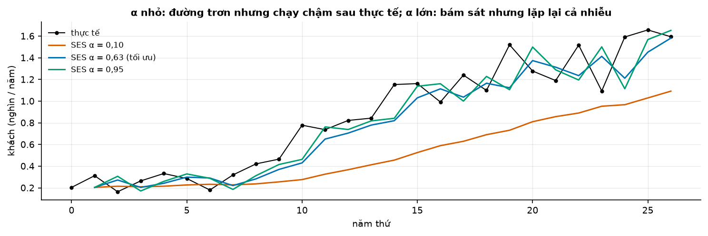
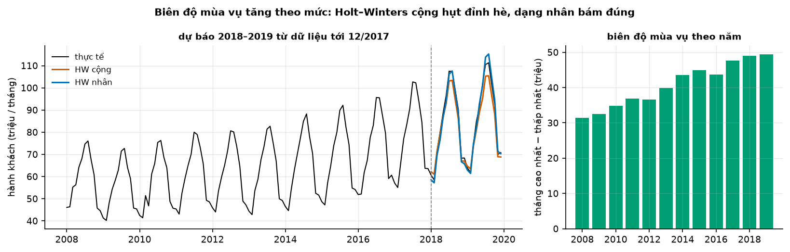
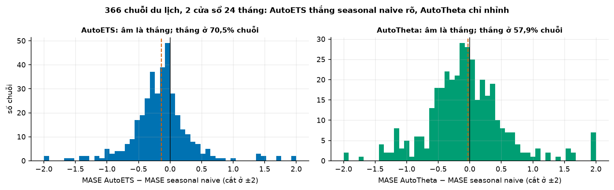
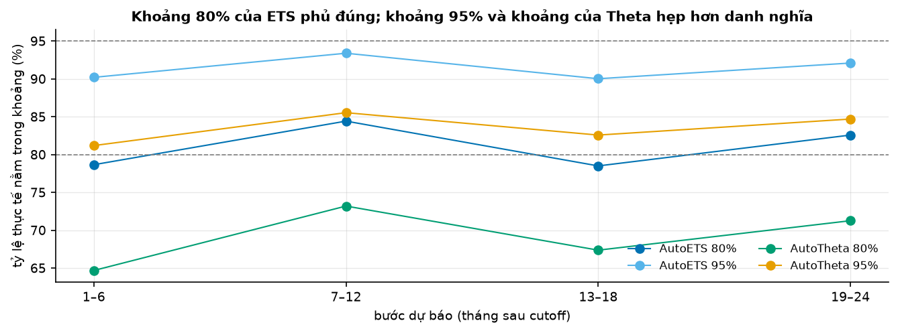

# Buổi 16 — Exponential smoothing và Theta

## 1. Mục tiêu

Sau buổi này bạn:

- Tự viết **SES** và **Holt** bằng NumPy, tìm α, β bằng `scipy.optimize`, và khớp statsforecast.
- Chọn **Holt–Winters cộng hay nhân** bằng cách nhìn biên độ mùa vụ, và chứng minh bằng sai số thật.
- Đọc tên một mô hình **ETS** (ví dụ ETS(M,A,M)) và nói vì sao mô hình state space cho được khoảng dự báo.
- Giải thích **Theta** bằng một câu và một ví dụ số.
- So AutoETS, AutoTheta với seasonal naive trên 366 chuỗi bằng bộ backtest buổi 15, có kiểm định, và đo **tỷ lệ phủ** thật của khoảng dự báo.

## 2. Nhắc lại buổi trước

Từ buổi 5–6 và 14:

- **Mùa vụ cộng**: mỗi tháng lệch khỏi mức một lượng cố định. **Mùa vụ nhân**: lệch một tỷ lệ cố định, nên biên độ lớn dần khi mức lớn dần.
- **Seasonal naive**, **MASE** (MAE chia MAE của seasonal naive trên phần học), **phần dư** = thực tế − giá trị khớp trên phần học.
- **Giá trị khớp một bước**: "dự báo" cho $y_t$ chỉ dùng số liệu tới $t - 1$. Dùng cả $y_t$ là nhìn trộm (buổi 13).
- **Khoảng dự báo 80%**: khoảng được làm ra để chứa giá trị thật 80% số lần. **Tỷ lệ phủ** là tỷ lệ thật sự nằm trong.

Từ buổi 15:

- **Backtest rolling origin**: nhiều cutoff, ở mỗi cutoff học trên quá khứ, dự báo đoạn sau. Hàm `backtest` và `diebold_mariano` có sẵn
  trong `tv.backtest`.
- **Diebold–Mariano (DM)**: chênh mất mát trung bình chia sai số chuẩn của nó; p < 0,05 là chênh có thật.

## 3. Trạng thái đầu buổi

Sau `python lab.py up` (trong thư mục `lab/`):

| Hạng mục | Trạng thái |
|---|---|
| Dữ liệu 1 | `du-lieu/raw/monash-tourism-monthly/tourism_monthly_dataset.tsf` — 366 chuỗi khách du lịch theo tháng của cuộc thi Tourism, dài 91–333 tháng, sha256 `fba16c20b9c4` |
| Dữ liệu 2 | `eurostat-hanh-khach-hang-khong/eurostat-avia-paoc-eu27.csv` (`6ce5178cf876`) — hành khách hàng không EU27 theo tháng; buổi này dùng 1/2008 → 12/2019 |
| Nguồn | Monash Time Series Forecasting Repository (CC BY 4.0); Eurostat `avia_paoc` (CC BY 4.0) |
| Môi trường | Python 3.12; numpy 2.5.3, pandas 2.3.3, scipy 1.18.1, statsforecast 2.1.1 |
| `code/ets.py` | đọc dữ liệu, SES và Holt tự viết, `holt_winters`, `theta_du_bao`, `backtest_tourism`, `mase_theo_chuoi`, `kiem_dinh_so_snaive`, `ty_le_phu` |
| `code/lab.ipynb` | notebook của Lab, bước 1–5 |
| **Đang cố tình sai** | `ses_loc` cập nhật mức bằng $y_t$ rồi mới lấy làm giá trị khớp cho $y_t$; `holt_winters` mặc định mùa vụ cộng |
| **Triệu chứng** | SES tối ưu ra α = 1,000 và tổng bình phương sai số 0; dự báo hành khách 2018–2019 hụt đỉnh hè, MAPE 3,23% |
| `python lab.py check` lúc này | ĐỎ: 4/8 test hỏng |

## 4. Lý thuyết

### Từ mới trong buổi

| Thuật ngữ | Nghĩa một câu | Ví dụ |
|---|---|---|
| SES (simple exponential smoothing) | Dự báo bằng một mức, cập nhật mỗi kỳ bằng cách trộn số mới với mức cũ. | α = 0,5: mức mới = nửa số mới + nửa mức cũ. |
| α (alpha) | Trọng số cho số mới, từ 0 tới 1. | α lớn: phản ứng nhanh. |
| Holt | SES cộng thêm một độ dốc cũng được cập nhật mỗi kỳ. | Tăng 2 mỗi tháng. |
| β (beta) | Trọng số cập nhật độ dốc. | β nhỏ: độ dốc đổi chậm. |
| damped trend | Độ dốc tắt dần theo hệ số $\phi$ < 1, dự báo cong dần về nằm ngang. | $\phi$ = 0,8. |
| Holt–Winters | Holt cộng thêm một thành phần mùa vụ, cộng hoặc nhân. | Tháng 7 = mức × 1,2. |
| ETS | Họ mô hình đặt tên theo ba chữ: sai số (Error), xu hướng (Trend), mùa vụ (Seasonal); mỗi chữ là N (không có), A (cộng), M (nhân), Ad (cộng tắt dần). | ETS(M,A,M) = Holt–Winters nhân. |
| state space | Viết mô hình thành phương trình quan sát + phương trình cập nhật trạng thái (mức, độ dốc, mùa vụ). | ETS(A,N,N). |
| likelihood | Xác suất (mật độ) mô hình gán cho dữ liệu đã thấy; tham số tốt làm nó lớn. | So hai bộ α. |
| AICc | Chỉ số chọn mô hình: khớp dữ liệu tốt (likelihood cao) nhưng bị phạt theo số tham số; nhỏ hơn là tốt hơn. | AutoETS chọn AICc nhỏ nhất. |
| Theta | SES cộng một đường xu hướng bằng nửa độ dốc của đường thẳng khớp cả chuỗi. | Thắng cuộc thi M3. |
| tỷ lệ phủ (coverage) | Tỷ lệ giá trị thật nằm trong khoảng dự báo. | 81% cho khoảng 80%. |
| SSE | Tổng bình phương sai số khớp một bước (sum of squared errors). | 2² + 0² + 2² = 8. |
| ME, DM | Sai số trung bình có dấu (buổi 14); kiểm định Diebold–Mariano (buổi 15). | ME dương: dự báo thấp. |

### 4.1 SES: trung bình có trọng số giảm dần

**Vấn đề.** Chuỗi không có xu hướng rõ, không có mùa vụ. Naive chỉ nhìn số cuối (quá nhạy với nhiễu), trung bình nhìn cả lịch sử như nhau
(quá chậm khi mức đổi). Cần một cách ở giữa.

**Trực giác.** Nhớ quá khứ nhưng quên dần: số mới nặng nhất, số cũ nhẹ dần. Với α = 0,5, số cuối có trọng số 0,5, số trước đó 0,25, rồi
0,125: mỗi bước lùi về quá khứ, trọng số nhân thêm $(1 - \alpha)$.

**Ví dụ số nhỏ — tự tính tay.** $y = (10, 12, 11, 13)$, α = 0,5, mức ban đầu $\ell_0 = y_0$ = 10.

| $t$ | $y_t$ | Giá trị khớp = mức cũ | Sai số | Mức mới = 0,5 × $y_t$ + 0,5 × mức cũ |
|---|---|---|---|---|
| 1 | 12 | 10 | 2 | 11 |
| 2 | 11 | 11 | 0 | 11 |
| 3 | 13 | 11 | 2 | 12 |

**Đọc bảng.** Giá trị khớp cho $y_t$ là mức **trước khi** thấy $y_t$. Tổng bình phương sai số (SSE) = 4 + 0 + 4 = 8. Dự báo mọi bước tới
là mức cuối, **12**: SES cho một đường phẳng.

**Công thức.**

$$
\ell_t = \alpha\, y_t + (1 - \alpha)\, \ell_{t-1}, \qquad \hat y_{T+h} = \ell_T
$$

- $\ell_t$: mức tại $t$; $\alpha$: trọng số cho số mới, $0 \le \alpha \le 1$; $T$: điểm cuối của phần học; $h$: số bước tới.

**Nói bằng lời.** Mức mới là trộn số vừa quan sát với mức cũ theo tỷ lệ α; dự báo là mức cuối. Ở ví dụ: 0,5 × 13 + 0,5 × 11 = 12.

**Tìm α.** Chọn α làm SSE của giá trị khớp một bước nhỏ nhất, bằng `scipy.optimize.minimize` với ràng buộc 0 ≤ α ≤ 1. Nếu giá trị khớp dùng
luôn $y_t$ (cập nhật mức trước rồi mới lấy), α = 1 cho mức = $y_t$, sai số 0: tối ưu "hoàn hảo" mà vô nghĩa. Đó là chỗ hở của code đầu buổi.



**Cách đọc hình.**

1. **Trục ngang**: năm thứ 0 → 26 của chuỗi du lịch T249 cộng theo năm.
2. **Trục dọc**: số khách mỗi năm (nghìn, đơn vị gốc của bộ dữ liệu).
3. **Ký hiệu**: đen là thực tế; ba đường màu là giá trị khớp một bước của SES với α = 0,10; 0,63 (tối ưu); 0,95.
4. **Nhìn vào đâu**: đường cam (α nhỏ) so với đường đen từ năm 10.
5. **Kết luận**: α = 0,10 chạy chậm hẳn sau thực tế khi chuỗi tăng; α = 0,95 gần như lặp lại năm trước; α tối ưu 0,63 nằm giữa.

**Thư viện.** Trên T249, SES tự viết (α = 0,632) dự báo 1.589,5, đúng bằng `SimpleExponentialSmoothingOptimized` của statsforecast.

**Khi nào dùng, khi nào không.** Dùng SES cho chuỗi dao động quanh một mức đổi chậm (tồn kho một mặt hàng ổn định, số liệu năm đã khử xu
hướng). Không dùng khi chuỗi có xu hướng rõ (dự báo phẳng sẽ thấp dần so với thực tế, mục 4.2) hay có mùa vụ (mục 4.3).

**Tóm lại.** **SES dự báo phẳng bằng mức cuối; mỗi kỳ mức được trộn thêm số mới theo tỷ lệ α. Tìm α bằng sai số khớp một bước, không bao
giờ bằng khớp có nhìn chính số đang khớp.**

**Tự kiểm tra.** $y = (20, 24, 22)$, α = 0,25, mức ban đầu 20. Tính các giá trị khớp và dự báo bước tới.

<details>
<summary>Đáp án</summary>

Khớp $y_1$: 20; mức mới 0,25 × 24 + 0,75 × 20 = 21. Khớp $y_2$: 21; mức mới 0,25 × 22 + 0,75 × 21 = 21,25. Dự báo: **21,25**. Nhầm hay gặp:
khớp $y_2$ bằng mức sau khi đã trộn $y_2$ vào (21,25): đó là nhìn trộm.

</details>

### 4.2 Holt và xu hướng tắt dần

**Vấn đề.** Chuỗi đang tăng đều. SES dự báo phẳng, nên luôn thấp hơn thực tế và thấp dần.

**Trực giác.** Theo dõi thêm một con số thứ hai: mỗi kỳ chuỗi tăng bao nhiêu (độ dốc). Dự báo = mức + độ dốc × số bước.

**Ví dụ số nhỏ — tự tính tay.** $y = (10, 12, 14, 16)$, α = β = 0,5, mức ban đầu 10, độ dốc ban đầu 12 − 10 = 2. Chuỗi tăng đúng 2 mỗi
bước nên mỗi giá trị khớp (mức + độ dốc) trúng khít; mức cuối 16, độ dốc 2. Dự báo: 16 + 2 = **18**, 16 + 2 × 2 = **20**.

**Công thức.**

$$
\ell_t = \alpha\, y_t + (1-\alpha)(\ell_{t-1} + b_{t-1}), \qquad b_t = \beta(\ell_t - \ell_{t-1}) + (1-\beta)\, b_{t-1}, \qquad \hat y_{T+h} = \ell_T + h\, b_T
$$

- $b_t$: độ dốc tại $t$; $\beta$: trọng số cập nhật độ dốc, $0 \le \beta \le 1$.

**Nói bằng lời.** Mức mới trộn số mới với "mức cũ cộng một bước dốc"; độ dốc mới trộn mức vừa tăng thêm bao nhiêu với độ dốc cũ. Dự báo
kéo dài đường thẳng: 16 + 2h.

**Damped trend.** Kéo dài một đường thẳng mãi thường quá tay. Bản tắt dần nhân độ dốc với $\phi$ mỗi bước: $\hat y_{T+h} = \ell_T + (\phi +
\phi^2 + \dots + \phi^h)\, b_T$. Ở ví dụ với $\phi$ = 0,8: bước 1 là 16 + 1,6 = 17,6; bước 2 là 16 + 1,44 × 2 = 18,88. Sách FPP của Hyndman & Athanasopoulos (§8.2) ghi nhận
damped trend thường là một trong những phương pháp dự báo tốt nhất khi dự báo tự động nhiều chuỗi.

**Thư viện.** Trên T249, Holt tự viết tìm ra α = 0,464, β = 0,099:

| Bước | Holt tự viết | `Holt` của statsforecast |
|---|---|---|
| 1 | 1.681,6 | 1.709,4 |
| 2 | 1.740,6 | 1.770,1 |
| 3 | 1.799,7 | 1.830,8 |

**Đọc bảng.** Hai bên lệch dưới 1,7% vì khác cách bắt đầu: ta cố định mức và độ dốc ban đầu, statsforecast tối ưu cả chúng và tối đa
likelihood thay vì tối thiểu SSE. Trên chuỗi có năm bất thường, hai cách có thể lệch rất xa.

**Khi nào dùng, khi nào không.** Dùng Holt khi chuỗi có xu hướng gần tuyến tính trong đoạn cần dự báo; dự báo xa thì dùng bản tắt dần. Không
dùng khi xu hướng vừa đổi chiều gần đây: độ dốc cũ còn kéo dự báo đi sai hướng vài kỳ.

**Tóm lại.** **Holt thêm độ dốc vào SES, dự báo là một đường thẳng; damped trend làm đường đó cong dần về nằm ngang.**

**Tự kiểm tra.** Mức cuối 50, độ dốc cuối 4, hệ số tắt dần $\phi$ = 0,5. Dự báo hai bước của Holt thường và của Holt tắt dần?

<details>
<summary>Đáp án</summary>

Holt: 54, 58. Tắt dần: 50 + 0,5 × 4 = **52**; 50 + (0,5 + 0,25) × 4 = **53**. Nhầm hay gặp: nhân $\phi$ một lần cho mọi bước; mỗi bước thêm một
lũy thừa của $\phi$.

</details>

### 4.3 Holt–Winters: mùa vụ cộng hay nhân

**Vấn đề.** Hành khách hàng không EU đông vào hè, vắng vào đông. Mùa vụ đó là "hè đông hơn một số khách cố định" hay "hè đông hơn một tỷ lệ
cố định"? Chọn sai thì dự báo sai ở chính các đỉnh.

**Ví dụ số nhỏ — tự tính tay.** Tháng 7 hiện cao hơn mức 20% khi mức là 100. Mức tăng lên 200:

| Dạng mùa vụ | Mức 100 | Mức 200 |
|---|---|---|
| cộng (+20) | 120 | 220 |
| nhân (× 1,2) | 120 | 240 |

**Đọc bảng.** Dạng cộng giữ biên độ 20 dù mức gấp đôi; dạng nhân để biên độ lớn theo mức. Biên độ thật của chuỗi lớn theo mức thì dạng cộng
hụt đỉnh.



**Cách đọc hình.**

1. **Trục ngang**: ô trái là tháng 1/2008 → 12/2019; ô phải là năm.
2. **Trục dọc**: ô trái là hành khách (triệu mỗi tháng); ô phải là tháng cao nhất trừ tháng thấp nhất của năm (triệu).
3. **Ký hiệu**: đen là thực tế, cam là Holt–Winters cộng, xanh là Holt–Winters nhân; vạch đứt là mốc học tới 12/2017.
4. **Nhìn vào đâu**: hai đỉnh hè 2018, 2019 ở ô trái; độ cao các cột ở ô phải.
5. **Kết luận**: biên độ tăng khoảng một nửa trong mười năm (31,4 lên 47,6 triệu); đường cam thấp hơn thực tế ở cả hai đỉnh hè, đường xanh
   bám sát.

**Dữ liệu thật.** Học tới 12/2017, chấm 24 tháng 2018–2019:

| Mô hình | MAPE | ME (triệu) |
|---|---|---|
| Holt–Winters cộng, ETS(A,A,A) | 3,23% | +2,37 |
| Holt–Winters nhân, ETS(M,A,M) | 2,13% | +0,50 |
| AutoETS (chọn theo AICc) → ETS(A,N,A) | 5,60% | +4,78 |
| seasonal naive | 7,69% | +6,40 |

**Đọc bảng.** Dạng nhân sai ít hơn dạng cộng một phần ba, và gần như không chệch (ME dương là dự báo thấp hơn thực tế). AutoETS chọn một mô
hình không xu hướng, cộng, vì nó có AICc nhỏ nhất trên phần học; trên kỳ chấm nó thua cả hai. AICc đo độ khớp có phạt, không phải sai số
dự báo: kiểm lại bằng backtest.

**Khi nào dùng, khi nào không.** Vẽ biên độ mùa vụ theo năm (hoặc chuỗi theo tháng, từng năm một đường): biên độ lớn theo mức thì dùng nhân,
hoặc lấy log rồi dùng cộng (buổi 5). Dạng nhân cần dữ liệu **dương**: chuỗi có số 0 thì không dùng được.

**Tóm lại.** **Biên độ mùa vụ giữ nguyên khi mức đổi thì mùa vụ cộng; biên độ lớn theo mức thì mùa vụ nhân. Chọn sai thì hụt đúng những
đỉnh quan trọng nhất.**

**Tự kiểm tra.** Mức dự báo tháng cuối năm là 300. Mùa vụ nhân cho tháng đó hệ số 0,9; mùa vụ cộng cho trừ 30. Hai dạng dự báo bao nhiêu? Khi mức
lên gấp đôi thì sao?

<details>
<summary>Đáp án</summary>

Nhân: 300 × 0,9 = **270**; cộng: 300 − 30 = **270**, như nhau ở mức 300. Mức 600: nhân 540, cộng 570; lệch 30. Nhầm hay gặp: kiểm hai dạng ở
đúng mức nơi chúng được ước lượng rồi kết luận "như nhau".

</details>

### 4.4 ETS: mô hình state space và khoảng dự báo

**Vấn đề.** SES, Holt, Holt–Winters mới chỉ là công thức cập nhật: cho dự báo điểm, không cho khoảng. Và có nhiều biến thể; chọn cái nào?

**Trực giác.** Viết mỗi phương pháp thành một mô hình mô tả cách dữ liệu được tạo ra. Mỗi kỳ, giá trị quan sát = dự báo từ trạng thái cũ +
một cú nhiễu ngẫu nhiên. Trạng thái (mức, độ dốc, mùa vụ) được cập nhật bằng chính cú nhiễu đó. Có mô hình như vậy thì tính được xác suất của dữ liệu
(likelihood), độ rộng khoảng dự báo, và so các mô hình.

**Ví dụ số nhỏ — tự tính tay.** ETS(A,N,N) là SES viết lại:

- quan sát: $y_t = \ell_{t-1} + \varepsilon_t$ (số thật = mức cũ + nhiễu);
- cập nhật: $\ell_t = \ell_{t-1} + \alpha\, \varepsilon_t$.

Với $\ell$ = 11, $y$ = 13: nhiễu $\varepsilon$ = 2; α = 0,5 → mức mới 11 + 1 = 12, đúng bảng mục 4.1.

Độ rộng khoảng dự báo: phương sai sai số $h$ bước tới của ETS(A,N,N) là $\sigma^2[1 + (h-1)\alpha^2]$. Với $\sigma$ = 10, α = 0,5, $h$ = 3:
100 × (1 + 2 × 0,25) = 150, độ lệch chuẩn 12,25, khoảng 95% là dự báo ± 1,96 × 12,25 ≈ **± 24**.

**Công thức.**

$$
\operatorname{Var}(y_{T+h} - \hat y_{T+h}) = \sigma^2\left[1 + (h-1)\,\alpha^2\right] \quad \text{(ETS(A,N,N))}
$$

- $\sigma^2$: phương sai của nhiễu $\varepsilon_t$ (ước lượng từ phần dư); $h$: số bước tới.

**Nói bằng lời.** Càng dự báo xa, càng nhiều cú nhiễu chưa xảy ra cộng dồn vào mức, nên khoảng nở ra; α lớn thì mỗi cú nhiễu dời mức nhiều,
khoảng nở nhanh. Ở ví dụ bước 3: độ lệch chuẩn từ 10 lên 12,25.

**Họ ETS.** Ba chữ: sai số (A, M), xu hướng (N, A, Ad), mùa vụ (N, A, M): 2 × 3 × 3 = 18 tổ hợp (FPP §8.4, bản 3). Sách Hyndman và cộng sự (2008)
đếm thêm xu hướng nhân nên có 30; FPP bản 3 bỏ chúng vì hay dự báo quá tay. Ba tổ hợp sai số cộng, mùa vụ nhân (như ETS(A,N,M)) dễ không ổn định
về số học (FPP §8.7). Sai số nhân (M) chỉ dùng cho dữ liệu dương. `AutoETS(season_length=12)` thử
các tổ hợp hợp lệ, ước lượng mỗi cái bằng likelihood, giữ cái có **AICc** nhỏ nhất (FPP §8.6).

**Tóm lại.** **ETS viết mỗi phương pháp làm trơn thành mô hình quan sát + cập nhật trạng thái; nhờ đó có likelihood để chọn mô hình bằng AICc
và có khoảng dự báo. Khoảng nở theo tầm dự báo.**

**Tự kiểm tra.** ETS(A,N,N) với $\sigma$ = 4, α = 0,2. Độ lệch chuẩn sai số dự báo một bước và hai mươi sáu bước tới?

<details>
<summary>Đáp án</summary>

Bước 1: $\sqrt{16 \times 1}$ = **4**. Bước 26: $\sqrt{16 \times (1 + 25 \times 0{,}04)} = \sqrt{32} \approx$ **5,66**. Nhầm hay gặp: nghĩ SES dự báo
phẳng thì khoảng cũng rộng như nhau mọi bước.

</details>

### 4.5 Theta

**Vấn đề.** Cuộc thi M3 (2000) có 3.003 chuỗi; một phương pháp rất đơn giản tên Theta thắng. Nó là gì?

**Trực giác.** Theta ban đầu mô tả bằng hai "đường theta" (một đường thẳng xu hướng, một đường phóng to độ cong). Hyndman & Billah (2003)
chỉ ra dạng chuẩn của nó tương đương: **SES + drift bằng một nửa độ dốc của đường thẳng khớp cả chuỗi**. SES lo mức hiện tại, nửa độ dốc lo
xu hướng dài hạn một cách dè dặt.

**Ví dụ số nhỏ — tự tính tay.** $y = (10, 12, 14, 16)$: đường thẳng khớp có độ dốc 2, nửa là 1. SES với α = 1 cho mức cuối 16. Theta: 16 + 1 =
**17**, 16 + 2 = **18**. Holt dự báo 18, 20: Theta dè dặt hơn.

**Thư viện.** `AutoTheta(season_length=12)` khử mùa vụ (dạng nhân), chọn giữa Theta chuẩn và các bản tối ưu (Fiorucci và cộng sự 2016), rồi
cộng mùa vụ lại.

**Khi nào dùng, khi nào không.** Theta là một baseline mạnh, rẻ cho nhiều chuỗi có xu hướng vừa phải (dữ liệu năm, quý, tháng kiểu M3).
Không nên kỳ vọng nó hơn ETS trên chuỗi mùa vụ mạnh như du lịch (mục 4.6), và khoảng dự báo của nó cần kiểm tỷ lệ phủ.

**Tóm lại.** **Theta chuẩn = SES + drift bằng nửa độ dốc cả chuỗi: dự báo mức hiện tại cộng một xu hướng dè dặt.**

**Tự kiểm tra.** Mức SES cuối 100, đường thẳng khớp cả chuỗi dốc 6 mỗi kỳ. Theta dự báo 3 bước?

<details>
<summary>Đáp án</summary>

Nửa độ dốc là 3: **103, 106, 109**. Nhầm hay gặp: cộng cả độ dốc 6; Theta chuẩn chỉ cộng một nửa.

</details>

### 4.6 So seasonal naive trên 366 chuỗi, và tỷ lệ phủ thật

**Vấn đề.** Mô hình nào thắng seasonal naive thật, và khoảng dự báo của nó có giữ lời không?

**Cách đo.** Bộ backtest buổi 15 trên 366 chuỗi du lịch: 2 cửa sổ, mỗi cửa sổ dự báo 24 tháng, cutoff cách nhau 12 tháng. Mỗi chuỗi một
MASE (trung bình hai cửa sổ). Các chuỗi độc lập với nhau, nên DM chạy trên chênh MASE của 366 chuỗi với $h$ = 1.

| So với seasonal naive (MASE trung bình 1,720) | MASE trung bình | Chuỗi thắng | DM | p |
|---|---|---|---|---|
| AutoETS | 1,581 | 70,5% | −5,23 | < 0,0001 |
| AutoTheta | 1,691 | 57,9% | −0,70 | 0,49 |

**Đọc bảng.** AutoETS thắng seasonal naive ở 7 trên 10 chuỗi, và DM xác nhận chênh là thật. AutoTheta thắng ở hơn nửa số chuỗi nhưng chênh
trung bình nhỏ so với dao động giữa các chuỗi: chưa có bằng chứng.



**Cách đọc hình.**

1. **Trục ngang** (cả hai ô): MASE mô hình trừ MASE seasonal naive của từng chuỗi, cắt ở ±2.
2. **Trục dọc**: số chuỗi.
3. **Ký hiệu**: vạch đen là 0 (hoà); vạch đứt cam là chênh trung bình.
4. **Nhìn vào đâu**: phần cột bên trái vạch đen so với bên phải.
5. **Kết luận**: AutoETS dồn rõ về bên trái (thắng); AutoTheta trải gần đều hai bên, chênh trung bình sát 0.



**Cách đọc hình.**

1. **Trục ngang**: nhóm bước dự báo (tháng sau cutoff).
2. **Trục dọc**: tỷ lệ thực tế nằm trong khoảng (%).
3. **Ký hiệu**: bốn đường cho hai mô hình và hai mức khoảng; hai vạch xám đứt là hai mức danh nghĩa (mức khoảng hứa phủ:
   80%, 95%).
4. **Nhìn vào đâu**: mỗi đường so với vạch xám của mức của nó.
5. **Kết luận**: khoảng 80% của AutoETS phủ đúng; khoảng 95% và cả hai khoảng của AutoTheta nằm dưới vạch của chúng, tức hẹp quá.

| Tỷ lệ phủ trên backtest | Khoảng 80% | Khoảng 95% |
|---|---|---|
| AutoETS | 81,0% | 91,4% |
| AutoTheta | 69,1% | 83,5% |

**Đọc bảng.** So mỗi ô với mức danh nghĩa ở tiêu đề cột: chỉ ô khoảng 80% của AutoETS đạt.

**Khi nào dùng, khi nào không.** Luôn kiểm tỷ lệ phủ trên backtest trước khi dùng khoảng dự báo để quyết định (dự trữ, công suất). Khoảng dựa
trên mô hình không tính bất định của việc chọn mô hình và ước lượng tham số, nên thường hẹp hơn danh nghĩa (buổi 25 học cách sửa). ETS thất
bại khi chuỗi có nhiều mùa vụ (giờ trong ngày và ngày trong tuần), chu kỳ rất dài, hay phụ thuộc biến ngoài (nhiệt độ): buổi 18.

**Tóm lại.** **So mọi mô hình với seasonal naive trên cùng backtest, có DM. Trên 366 chuỗi du lịch, AutoETS thắng có ý nghĩa, AutoTheta thì
không; khoảng 95% của cả hai hẹp hơn lời hứa.**

**Tự kiểm tra.** Khoảng 90% của một mô hình phủ 72% trên backtest. Đặt mức dự trữ bằng cận trên của khoảng đó thì thiếu hàng bao nhiêu phần
trăm số tháng, so với dự tính?

<details>
<summary>Đáp án</summary>

Thực tế rơi ra ngoài khoảng 28% số tháng. Nếu lệch đều hai phía, khoảng 14% số tháng vượt cận trên (thiếu hàng), gần gấp ba mức dự tính
của khoảng 90% (một nửa phần nằm ngoài danh nghĩa). Phải nới khoảng (buổi 25) hoặc đặt mức dự trữ theo tỷ lệ phủ đo được. Nhầm hay gặp: tin con số danh nghĩa "90%" mà không đo.

</details>

## 5. Lab từng bước

Lệnh gõ trong terminal ở thư mục `lab/`. Code các bước nằm sẵn trong `code/lab.ipynb` (mở bằng `python lab.py notebook` hoặc VS Code),
chạy từng ô từ trên xuống. Bạn sửa `code/ets.py`; notebook tự nạp lại bản mới.

### Bước 1 — SES tự viết

**Mục đích:** thấy triệu chứng α = 1.

```bash
python lab.py up           # một lần: môi trường + dữ liệu Tourism và Eurostat, kiểm sha256
python lab.py check        # 4/8 test đỏ
python lab.py notebook     # chạy ô bước 1
```

**Đọc kết quả:** ví dụ 4 số in giá trị khớp lệch so với bảng mục 4.1; α tối ưu của T249 là 1,000 với SSE bằng 0.

### Bước 2 — Sửa SES, so với statsforecast

**Mục đích:** sửa `ses_loc` để ghi giá trị khớp **trước** khi cập nhật mức (mục 4.1). Chạy lại ô bước 1 và ô bước 2.

**Đọc kết quả:** giá trị khớp như bảng mục 4.1; α = 0,632; bảng so sánh như mục 4.1–4.2 (SES trùng, Holt lệch dưới 1,7%).

### Bước 3 — Holt–Winters cộng hay nhân

**Mục đích:** đổi mặc định `kieu` của `holt_winters` thành `"nhan"` (mục 4.3). Chạy lại ô bước 3.

**Đọc kết quả:** biên độ theo năm như hình mục 4.3; MAPE mặc định từ 3,23% xuống 2,13%; bảng bốn mô hình như mục 4.3.

### Bước 4 — Theta

**Mục đích:** nối ví dụ tay mục 4.5 với code, không cần sửa.

**Đọc kết quả:** ví dụ 4 số in 17 và 18.

### Bước 5 — 366 chuỗi

**Mục đích:** so seasonal naive có kiểm định và đo tỷ lệ phủ (mục 4.6), không cần sửa. Khoảng nửa phút. Rồi:

```bash
python lab.py check        # 8/8 xanh
```

**Đọc kết quả:** bảng và tỷ lệ phủ như mục 4.6. Xanh 8/8 là xong; `test_ses_khop_khong_ro_ri` còn đỏ thì giá trị khớp vẫn dùng $y_t$.

## 6. Lỗi thường gặp & cách chẩn đoán

| Triệu chứng | Nguyên nhân | Chẩn đoán | Sửa |
|---|---|---|---|
| α tối ưu = 1, SSE = 0 | giá trị khớp dùng chính $y_t$ | tính tay 3 bước | ghi giá trị khớp trước khi cập nhật mức |
| Hụt các đỉnh mùa vụ, ME dương lớn | mùa vụ cộng cho chuỗi có biên độ tăng | vẽ biên độ theo năm | mùa vụ nhân hoặc lấy log |
| ETS nhân báo lỗi | chuỗi có số 0 hoặc âm | `y.min()` | mô hình cộng, hoặc cộng hằng số rồi log |
| Holt tự viết lệch thư viện | khác khởi tạo và hàm mục tiêu | so tham số và trạng thái ban đầu | chấp nhận; ghi rõ cách ước lượng |
| AutoETS chọn mô hình dự báo kém | AICc đo khớp trên phần học | backtest so vài mô hình | chọn bằng backtest khi đủ dữ liệu |
| Holt dự báo tăng mãi | xu hướng tuyến tính kéo dài vô hạn | vẽ dự báo dài hạn | damped trend |
| Khoảng 95% chỉ phủ 80–90% | khoảng không tính bất định mô hình | tỷ lệ phủ trên backtest | nới khoảng, conformal (buổi 25) |
| ETS kém trên dữ liệu giờ | nhiều mùa vụ (ngày, tuần) | ACF có đỉnh ở 24 và 168 | MSTL, Fourier (buổi 18) |

## 7. Bài tập về nhà

1. **Trọng số của SES.** Với α = 0,3, tính trọng số của 6 quan sát gần nhất. Tổng của chúng là bao nhiêu, phần còn lại thuộc về đâu?
2. **Damped.** Chạy `AutoETS(season_length=12, damped=True)` trên hành khách EU. So MAPE 2018–2019 với ETS(M,A,M).
3. **Log + cộng.** Lấy log hành khách, chạy Holt–Winters cộng, mũ ngược dự báo. So MAPE với Holt–Winters nhân.

## 8. Tiêu chí "Xong khi"

- [ ] `python lab.py check` xanh 8/8.
- [ ] Tính tay SES, Holt, Theta trên một chuỗi 4 số; SES tự viết khớp statsforecast.
- [ ] Giải thích bằng hình biên độ mùa vụ vì sao Holt–Winters cộng sai trên hành khách EU.
- [ ] AutoETS thắng seasonal naive có ý nghĩa (DM) trên 366 chuỗi; nói được vì sao AutoTheta chưa.
- [ ] Báo tỷ lệ phủ thật của khoảng 80% và 95%, và hệ quả khi dùng chúng để quyết định.

## 9. Đọc thêm

- Hyndman, R.J. & Athanasopoulos, G. *FPP3*, chương 8: https://otexts.com/fpp3/expsmooth.html
- Hyndman, R.J., Koehler, A.B., Ord, J.K. & Snyder, R.D. (2008). *Forecasting with Exponential Smoothing: The State Space Approach*. Springer.
- Assimakopoulos, V. & Nikolopoulos, K. (2000). The theta model. *IJF* 16; Hyndman, R.J. & Billah, B. (2003). Unmasking the Theta method. *IJF* 19.
- Fiorucci, J.A. và cộng sự (2016). Models for optimising the theta method. *IJF* 32.
- Athanasopoulos, G., Hyndman, R.J., Song, H. & Wu, D.C. (2011). The tourism forecasting competition. *IJF* 27.
- statsforecast: `AutoETS`, `AutoTheta` — https://nixtlaverse.nixtla.io/statsforecast/
