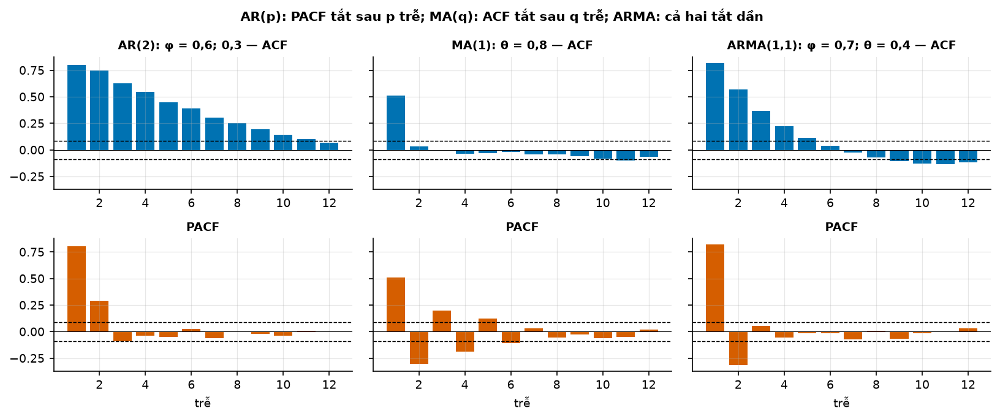
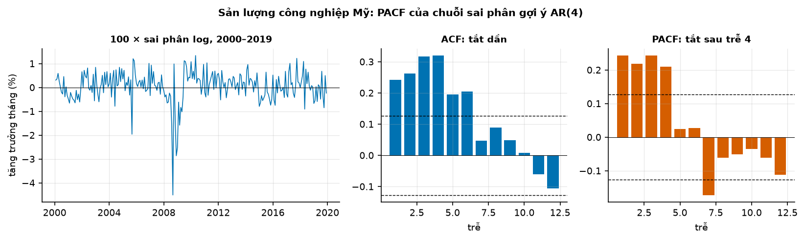
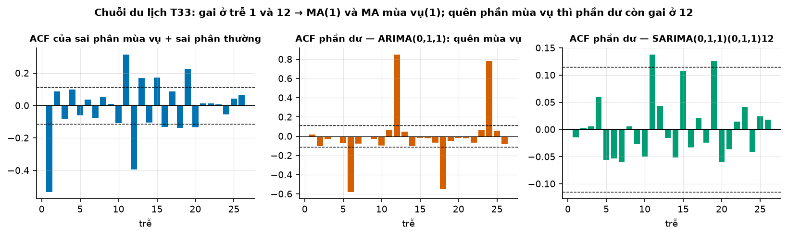
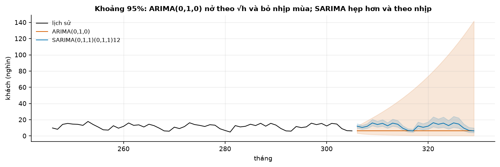
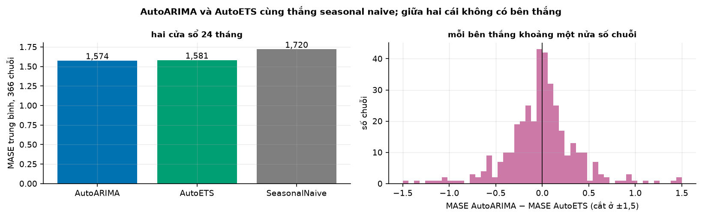

# Buổi 17 — ARIMA và SARIMA

## 1. Mục tiêu

Sau buổi này bạn:

- Nhận ra **AR(p)**, **MA(q)**, **ARMA** qua ACF và PACF, và nói giới hạn của cách đọc này.
- Tự chọn bậc **ARIMA** cho một chuỗi kinh tế tháng và **SARIMA** cho một chuỗi du lịch tháng, so AICc với auto-ARIMA.
- Kiểm phần dư bằng **Ljung–Box** (tính tay được), và nhận ra mô hình quên phần mùa vụ.
- Giải thích vì sao khoảng dự báo của ARIMA(0,1,0) nở theo $\sqrt h$.
- So AutoARIMA với AutoETS và seasonal naive trên 366 chuỗi bằng bộ backtest buổi 15, có kiểm định.

## 2. Nhắc lại buổi trước

Từ buổi 7 và 14:

- **Tính dừng**: trung bình, độ dao động và tự tương quan không đổi theo thời gian. **Sai phân** $y_t - y_{t-1}$ khử xu hướng; **sai phân mùa
  vụ** $y_t - y_{t-12}$ khử mùa vụ tháng. KPSS: p nhỏ là không dừng.
- **ACF** $r_k$: tương quan giữa chuỗi và chính nó dời $k$ bước; vạch ngoài hai đường đứt $\pm 1{,}96/\sqrt n$ là đáng kể.
- **Phần dư**: thực tế − giá trị khớp trên phần học. Mô hình đã lấy hết quy luật thì phần dư không tự tương quan.
- **Ljung–Box** (buổi 14): kiểm định gộp ACF của nhiều trễ; p nhỏ là phần dư còn tự tương quan.

Từ buổi 15–16:

- **Backtest**, **Diebold–Mariano (DM)**, **MASE** như buổi 15; các chuỗi độc lập nên DM trên chênh MASE của nhiều chuỗi dùng $h$ = 1.
- **AICc**: chọn mô hình theo độ khớp có phạt số tham số; nhỏ hơn là tốt hơn. **AutoETS** trên 366 chuỗi du lịch: MASE 1,581, thắng
  seasonal naive (1,720) có ý nghĩa.

## 3. Trạng thái đầu buổi

Sau `python lab.py up` (trong thư mục `lab/`):

| Hạng mục | Trạng thái |
|---|---|
| Dữ liệu 1 | `du-lieu/raw/frb-g17-san-luong-cong-nghiep/g17-2000-2024.csv` — chỉ số sản lượng công nghiệp Mỹ theo tháng, đã khử mùa vụ, 1/2000 → 12/2024, sha256 `3956c6626866`; buổi này dùng tới 12/2019 |
| Dữ liệu 2 | `monash-tourism-monthly/tourism_monthly_dataset.tsf` (`fba16c20b9c4`) — 366 chuỗi khách du lịch theo tháng |
| Nguồn | Federal Reserve Board G.17 (public domain); Monash Time Series Forecasting Repository (CC BY 4.0) |
| Môi trường | Python 3.12; numpy 2.5.3, pandas 2.3.3, statsmodels 0.15.0, statsforecast 2.1.1 |
| `code/arima.py` | đọc dữ liệu, `mo_phong`, `acf_pacf`, `arima`, `auto_arima`, `ljung_box`, `kiem_phan_du`, `mo_hinh_tu_chon`, `bang_ung_vien`, `du_bao`, `backtest_tourism`, `so_sanh` |
| `code/lab.ipynb` | notebook của Lab, bước 1–5 |
| **Đang cố tình sai** | `MUA_VU_ARIMA = 1` (auto-ARIMA không biết chu kỳ 12); `kiem_phan_du` không kiểm gì, luôn báo "ổn"; `mo_hinh_tu_chon` mặc định không có phần mùa vụ |
| **Triệu chứng** | auto-ARIMA chọn mô hình không mùa vụ cho chuỗi du lịch; mọi mô hình đều "phần dư ổn"; backtest: AutoARIMA thua cả seasonal naive |
| `python lab.py check` lúc này | ĐỎ: 3/6 test hỏng |

## 4. Lý thuyết

### Từ mới trong buổi

| Thuật ngữ | Nghĩa một câu | Ví dụ |
|---|---|---|
| AR(p) (tự hồi quy) | Giá trị hôm nay = tổng có trọng số của $p$ giá trị trước + nhiễu. | AR(1): $y_t = 0{,}5\,y_{t-1} + \varepsilon_t$. |
| MA(q) (trung bình trượt của nhiễu) | Giá trị hôm nay = nhiễu hôm nay + tổng có trọng số của $q$ cú nhiễu trước. | MA(1): $y_t = \varepsilon_t + 0{,}8\,\varepsilon_{t-1}$. |
| ARMA(p, q) | Có cả phần AR và phần MA. | ARMA(1,1). |
| nhiễu trắng | Dãy cú nhiễu độc lập, trung bình 0, không tự tương quan. | $\varepsilon_t$. |
| PACF (tự tương quan riêng phần) | Tương quan giữa $y_t$ và $y_{t-k}$ sau khi đã trừ phần giải thích được bởi các trễ 1 tới $k - 1$. | AR(2): PACF tắt sau trễ 2. |
| ARIMA(p, d, q) | ARMA trên chuỗi đã sai phân $d$ lần. | ARIMA(0,1,1). |
| drift | Hằng số trong mô hình có $d$ = 1: chuỗi tăng trung bình một lượng cố định mỗi kỳ. | +0,026% mỗi tháng. |
| SARIMA(p,d,q)(P,D,Q)m | ARIMA thêm phần AR, MA, sai phân ở trễ bội của chu kỳ $m$. | (0,1,1)(0,1,1)12. |
| auto-ARIMA | Thuật toán Hyndman–Khandakar: chọn $d$, $D$ bằng kiểm định, rồi dò các bậc lân cận theo AICc. | `AutoARIMA(season_length=12)`. |
| bậc tự do (Ljung–Box) | Số trễ gộp trừ số tham số AR, MA đã ước lượng. | 24 − 2 = 22. |
| SES, DM | Làm trơn hàm mũ đơn (buổi 16); kiểm định Diebold–Mariano (buổi 15). | SES = ARIMA(0,1,1). |

### 4.1 AR, MA, ARMA và dấu vân tay trên ACF/PACF

**Vấn đề.** ETS mô tả chuỗi bằng mức, xu hướng, mùa vụ. Có cách thứ hai: mô tả trực tiếp **tự tương quan** của chuỗi, tức hôm nay phụ thuộc
hôm qua thế nào. Cần biết mô hình nào sinh ra dạng tự tương quan nào, để nhìn ACF mà đoán.

**Trực giác.** AR: chuỗi "nhớ" giá trị của chính nó, nên một cú sốc tắt dần qua nhiều kỳ. MA: chuỗi chỉ nhớ **cú nhiễu** trong $q$ kỳ, sau đó
quên hẳn.

**Ví dụ số nhỏ — tự tính tay.**

- AR(1), $y_t = 0{,}5\,y_{t-1} + \varepsilon_t$, trung bình 0, hôm nay $y$ = 8. Dự báo nhân 0,5 mỗi bước: 8 × 0,5 = 4, rồi 4 × 0,5 = 2.
- ACF của AR(1) là $r_k = 0{,}5^k$, tắt dần. PACF bằng 0,5 ở trễ 1 rồi bằng 0, vì khi đã biết $y_{t-1}$ thì $y_{t-2}$ không thêm gì.
- MA(1), $y_t = \varepsilon_t + 0{,}8\,\varepsilon_{t-1}$: $y_t$ và $y_{t-1}$ chung cú nhiễu $\varepsilon_{t-1}$, còn $y_t$ và $y_{t-2}$ không chung gì. ACF:
  $r_1 = 0{,}8 / (1 + 0{,}8^2) \approx 0{,}49$, $r_2$ = 0 (tắt hẳn sau trễ 1).

| Mô hình | ACF | PACF |
|---|---|---|
| AR(p) | tắt dần | tắt hẳn sau trễ $p$ |
| MA(q) | tắt hẳn sau trễ $q$ | tắt dần |
| ARMA(p, q) | tắt dần | tắt dần |

**Đọc bảng.** Nhìn cái nào tắt hẳn: PACF tắt hẳn → AR, bậc bằng trễ cuối còn đáng kể; ACF tắt hẳn → MA. Cả hai tắt dần → ARMA, và bảng không
cho biết bậc.

**Công thức.**

$$
y_t = c + \phi_1 y_{t-1} + \dots + \phi_p y_{t-p} + \varepsilon_t + \theta_1 \varepsilon_{t-1} + \dots + \theta_q \varepsilon_{t-q}
$$

- $\phi_i$: hệ số AR; $\theta_j$: hệ số MA; $\varepsilon_t$: nhiễu trắng; $c$: hằng số.

**Nói bằng lời.** Hôm nay = hằng số + phần nhớ các giá trị trước + cú nhiễu hôm nay + phần nhớ các cú nhiễu trước. Ở AR(1) trên: 0 + 0,5 × 8 =
4 là dự báo bước tới. AR(1) chỉ **dừng** khi $|\phi_1|$ < 1 (nếu không, cú sốc không tắt); MA(1) cần $|\theta_1|$ < 1 để ước lượng được duy nhất
(khả nghịch).



**Cách đọc hình.**

1. **Trục ngang** (mọi ô): trễ 1 → 12.
2. **Trục dọc**: hàng trên là ACF, hàng dưới là PACF, từ −1 tới 1.
3. **Ký hiệu**: mỗi cột một mô hình mô phỏng 500 điểm (seed 1); đường đứt đen là $\pm 1{,}96/\sqrt n$.
4. **Nhìn vào đâu**: ô nào có cột rơi hẳn vào trong hai đường đứt sau vài trễ đầu.
5. **Kết luận**: AR(2) có hai cột PACF đáng kể rồi tắt; MA(1) có một cột ACF (gần giá trị tính tay) rồi tắt; ARMA(1,1) tắt dần ở cả hai hàng.

**Khi nào dùng, khi nào không.** Đọc ACF/PACF để có điểm xuất phát và kiểm lại mô hình auto-ARIMA chọn có hợp lý không. Không dùng nó làm
công cụ chọn duy nhất: với ARMA, hay khi mẫu ngắn (dưới khoảng 100 điểm, các cột dao động nhiều), dấu vân tay mờ đi.

**Tóm lại.** **AR nhớ giá trị cũ (PACF tắt sau $p$), MA nhớ cú nhiễu cũ (ACF tắt sau $q$). ARMA tắt dần ở cả hai, nên ACF/PACF không đọc được
bậc: khi đó để AICc chọn.**

**Tự kiểm tra.** ACF chỉ có trễ 1 đáng kể (0,4), các trễ sau gần 0. PACF tắt dần và đổi dấu. Mô hình gì?

<details>
<summary>Đáp án</summary>

**MA(1)**: ACF tắt hẳn sau trễ đầu, PACF tắt dần (đổi dấu). Nhầm hay gặp: thấy PACF trễ 1 lớn rồi đoán AR(1); với AR(1) có $\phi$ = 0,4 thì ACF
phải tắt dần theo lũy thừa của 0,4, không rơi về 0 ngay. Và MA(1) không bao giờ cho ACF đầu tiên quá một nửa.

</details>

### 4.2 ARIMA: sai phân rồi ARMA

**Vấn đề.** Chuỗi kinh tế thường có xu hướng, không dừng; ARMA chỉ dùng cho chuỗi dừng. Sai phân (buổi 7) biến nó thành dừng; "I" trong ARIMA
là số lần sai phân $d$.

**Ví dụ số nhỏ — tự tính tay.** Chỉ số $(100, 102, 103, 105, 106)$. Sai phân một lần: $(2, 1, 2, 1)$, dao động quanh 1,5: dừng. Nếu phần sai phân
là AR(1) với hằng số, dự báo tăng trưởng tháng sau rồi cộng dồn vào mức cuối 106.

**Dữ liệu thật.** Chỉ số sản lượng công nghiệp Mỹ 1/2000 → 12/2019 (240 tháng, đã khử mùa vụ). Lấy $100 \times \ln$ để sai phân thành tăng
trưởng tháng tính bằng %.



**Cách đọc hình.**

1. **Trục ngang**: ô trái là thời gian 2000 → 2019; hai ô phải là trễ 1 → 12.
2. **Trục dọc**: ô trái là tăng trưởng tháng (%); hai ô phải là ACF và PACF.
3. **Ký hiệu**: đường đứt là $\pm 1{,}96/\sqrt n$ ≈ 0,13.
4. **Nhìn vào đâu**: vị trí trễ cuối cùng mà PACF còn vượt đường đứt.
5. **Kết luận**: ACF tắt dần; PACF còn đáng kể tới trễ 4 (0,21) rồi rơi về 0,02: đọc ra AR(4) trên chuỗi sai phân, tức ARIMA(4,1,0).

| Mô hình (cùng $d$ = 1, có drift) | AICc | Ljung–Box p |
|---|---|---|
| ARIMA(1,1,0) | 466,9 | 0,000 |
| ARIMA(4,1,0), đọc từ PACF | 437,2 | 0,44 |
| ARIMA(1,1,1) | 445,0 | 0,15 |
| ARIMA(2,1,2) | 433,6 | 0,78 |
| auto-ARIMA → ARIMA(2,1,2) | 431,8 | 0,78 |

**Đọc bảng.** AR(4) đọc từ PACF qua được Ljung–Box, nhưng AICc kém auto-ARIMA 5,4 đơn vị: auto-ARIMA tìm ra một ARMA(2,2), loại mô hình mà
PACF không đọc được bậc (mục 4.1). Hai dòng cuối cùng bậc; auto-ARIMA bỏ drift nên AICc thấp hơn một chút.

**Khi nào dùng, khi nào không.** Chỉ so AICc giữa các mô hình có **cùng** $d$ (và $D$): sai phân khác nhau là dữ liệu khác nhau, likelihood không
so được (sách FPP của Hyndman & Athanasopoulos, §9.6). Đọc ACF/PACF để có điểm xuất phát và hiểu mô hình; để AICc và Ljung–Box quyết định.

**Tóm lại.** **ARIMA(p,d,q) = sai phân $d$ lần rồi ARMA(p,q). ACF/PACF cho điểm xuất phát; AICc chọn trong các mô hình cùng $d$; Ljung–Box xác
nhận phần dư sạch.**

**Tự kiểm tra.** Hai mô hình: ARIMA(1,1,1) AICc 300 và ARIMA(1,0,1) AICc 280. Kết luận ARIMA(1,0,1) tốt hơn được không?

<details>
<summary>Đáp án</summary>

**Không**: khác $d$ nên hai AICc tính trên hai dữ liệu khác nhau (chuỗi gốc và chuỗi sai phân). Chọn $d$ trước bằng kiểm định (KPSS, buổi 7),
rồi mới so AICc. Nhầm hay gặp: so AICc của mọi mô hình trong một bảng.

</details>

### 4.3 SARIMA và auto-ARIMA

**Vấn đề.** Chuỗi du lịch theo tháng có mùa vụ năm: tháng này giống tháng này năm ngoái. ARIMA thường chỉ nhìn vài tháng gần; cần thêm phần nhìn
cách 12, 24 tháng.

**Trực giác.** SARIMA là hai ARIMA lồng nhau: một cho quan hệ giữa các tháng liền nhau (p, d, q), một cho quan hệ giữa cùng tháng các năm (P,
D, Q) với chu kỳ $m$ = 12. Sai phân mùa vụ $D$ = 1 là trừ cùng tháng năm trước.

**Ví dụ số nhỏ — tự tính tay.** Chuỗi $(10, 20, 11, 21, 12, 22)$ với $m$ = 2: sai phân mùa vụ $y_t - y_{t-2}$ = $(1, 1, 1, 1)$: mùa vụ biến mất, còn
lại mức tăng 1 mỗi vòng. Mô hình (0,1,1)(0,1,1)m: sai phân thường và sai phân mùa vụ, rồi một MA ở trễ 1 và một MA ở trễ $m$.

**Dữ liệu thật: chuỗi du lịch T33.** 306 tháng (bỏ 24 tháng cuối), lấy log, rồi sai phân mùa vụ và sai phân thường. ACF của chuỗi đó:

| Trễ | 1 | 2 | 11 | 12 | 13 | 24 |
|---|---|---|---|---|---|---|
| ACF | −0,53 | 0,09 | 0,31 | −0,39 | 0,17 | −0,06 |

**Đọc bảng.** Hai gai âm ở trễ đầu và trễ bằng chu kỳ. Hai trễ kề bên gai chu kỳ là "vệt" của hai gai: một gai nối các tháng liền nhau, gai kia nối
cùng tháng năm trước, gộp lại nối cả các tháng cách một năm cộng trừ một tháng. Trễ hai chu kỳ đã về 0. Gai ACF tắt hẳn → MA: MA(1) và MA mùa vụ(1), tức SARIMA(0,1,1)(0,1,1)12, mô hình "airline" kinh điển.



**Cách đọc hình.**

1. **Trục ngang** (ba ô): trễ 1 → 26.
2. **Trục dọc**: ACF.
3. **Ký hiệu**: ô trái là chuỗi sau hai lần sai phân; ô giữa là phần dư của ARIMA(0,1,1) (quên mùa vụ); ô phải là phần dư của SARIMA(0,1,1)(0,1,1)12.
4. **Nhìn vào đâu**: cột ở trễ 12 và 24 của từng ô.
5. **Kết luận**: quên mùa vụ, phần dư có ACF 0,84 ở trễ 12: quy luật mùa vụ còn nguyên; thêm phần mùa vụ thì mọi cột nằm gần hai đường đứt.

| Mô hình trên log T33 | AICc | Ljung–Box p (24 trễ) |
|---|---|---|
| ARIMA(0,1,1), quên mùa vụ | 181,0 | ≈ 0 |
| SARIMA(0,1,1)(0,1,1)12, đọc từ ACF | −435,2 | 0,34 |
| auto-ARIMA → SARIMA(0,1,1)(0,1,2)12 | −436,1 | 0,31 |

**Đọc bảng.** Mô hình đọc tay qua Ljung–Box và AICc chỉ cách auto-ARIMA dưới 1 đơn vị (cùng $d$, cùng $D$): gần như tương đương. Dòng đầu khác
$D$ nên AICc không so được; Ljung–Box một mình đã đủ loại nó. Hệ số mô hình đọc tay: MA(1) −0,735, MA mùa vụ −0,531.

**auto-ARIMA** (Hyndman & Khandakar 2008; FPP §9.7): chọn $D$ theo độ mạnh mùa vụ, chọn $d$ bằng các kiểm định KPSS lặp lại, rồi bắt đầu từ vài
mô hình nhỏ và dò các bậc lân cận (±1) theo AICc tới khi không tốt hơn. Trong statsforecast, `AutoARIMA` mặc định `season_length=1`: nếu không
khai chu kỳ 12, nó không bao giờ thử phần mùa vụ.

**Tóm lại.** **SARIMA thêm sai phân và AR/MA ở các trễ bội của chu kỳ. Gai ACF ở trễ 12 của chuỗi đã sai phân là dấu hiệu cần MA mùa vụ; quên
phần mùa vụ thì phần dư còn gai đó. Với auto-ARIMA, luôn khai `season_length`.**

**Tự kiểm tra.** Chuỗi theo quý ($m$ = 4) sau sai phân thường và sai phân mùa vụ có ACF đáng kể ở trễ 1 và trễ 4, các trễ khác gần 0. Đề xuất mô
hình.

<details>
<summary>Đáp án</summary>

SARIMA(0,1,1)(0,1,1)4: MA(1) cho gai ở trễ 1, MA mùa vụ(1) cho gai ở trễ 4. Nhầm hay gặp: viết (0,1,4) để "bắt" trễ 4 bằng MA thường, tốn 4 tham
số thay vì 1.

</details>

### 4.4 Kiểm tra phần dư: Ljung–Box

**Vấn đề.** Một mô hình có AICc đẹp vẫn có thể bỏ sót quy luật. Cần một phép kiểm gộp: phần dư còn tự tương quan ở bất kỳ trễ nào không?

**Ví dụ số nhỏ — tự tính tay.** $n$ = 100 phần dư, gộp hai trễ, mô hình không có tham số AR/MA:

| Trễ $k$ | 1 | 2 |
|---|---|---|
| ACF phần dư $r_k$ | 0,3 | 0,1 |

**Đọc bảng.** Thay vào công thức dưới đây:

- $Q = 100 \times 102 \times (0{,}09/99 + 0{,}01/98) \approx 10{,}3$.
- So với phân phối chi-bình-phương hai bậc tự do (ngưỡng 5% là 5,99): p ≈ 0,006.
- Phần dư còn tự tương quan.

**Công thức.**

$$
Q = n(n+2)\sum_{k=1}^{K} \frac{r_k^2}{n-k}, \qquad \text{bậc tự do} = K - (p + q + P + Q_m)
$$

- $n$: số phần dư; $r_k$: ACF của phần dư ở trễ $k$; $K$: số trễ gộp (dữ liệu tháng thường 24); $p, q, P, Q_m$: số hệ số AR, MA, AR mùa vụ, MA mùa
  vụ đã ước lượng.

**Nói bằng lời.** Cộng bình phương các ACF của phần dư (trễ xa được nhân nặng hơn một chút), nhân với cỡ mẫu. Phần dư là nhiễu trắng thì $Q$ nhỏ
cỡ số bậc tự do; lớn hơn nhiều thì còn quy luật. Ở ví dụ: 10,3 so với ngưỡng 5,99.

**Thư viện.** Hàm `ljung_box` tự viết khớp `statsmodels.stats.diagnostic.acorr_ljungbox(..., model_df=...)`. Bỏ $d + D \times m$ phần dư đầu (sai phân
chưa đủ dữ liệu) trước khi kiểm.

**Khi nào dùng, khi nào không.** Chạy Ljung–Box cho mọi mô hình trước khi dùng nó, kèm nhìn ACF phần dư để biết gai nằm ở đâu. Không coi p ≥ 0,05
là chứng minh mô hình đúng: nó chỉ nói không thấy tự tương quan; mẫu ngắn thì phép kiểm yếu.

**Tóm lại.** **Ljung–Box gộp ACF của phần dư qua nhiều trễ thành một con số; p < 0,05 là mô hình còn bỏ sót quy luật. Trừ số tham số AR/MA khỏi
bậc tự do.**

**Tự kiểm tra.** Mô hình SARIMA có một hệ số AR, một hệ số MA, một hệ số MA mùa vụ; gộp hai mươi bốn trễ. Bậc tự do bao nhiêu? Ngưỡng 5% với
số bậc tự do đó là 32,7; $Q$ = 40 thì kết luận gì?

<details>
<summary>Đáp án</summary>

24 − 3 = **21**. $Q$ = 40 vượt 32,7: p < 0,05, phần dư còn tự tương quan, mô hình chưa đủ. Nhầm hay gặp: quên trừ số tham số, dùng 24 bậc tự do,
p lớn hơn thật.

</details>

### 4.5 Khoảng dự báo của ARIMA

**Vấn đề.** ARIMA cho khoảng dự báo; khoảng đó nở ra thế nào theo tầm $h$, và vì sao?

**Ví dụ số nhỏ — tự tính tay.** ARIMA(0,1,0) là bước ngẫu nhiên: $y_t = y_{t-1} + \varepsilon_t$, dự báo mọi bước bằng giá trị cuối. Sai số $h$
bước tới là tổng $h$ cú nhiễu độc lập, phương sai $h\sigma^2$, độ lệch chuẩn $\sigma\sqrt h$. Với $\sigma$ = 2:

- bước 1: ± 1,96 × 2 = ± 3,92;
- bước 4: ± 1,96 × 2 × $\sqrt 4$ = ± 7,84, gấp đôi bước 1.

**Công thức.**

$$
\hat y_{T+h} \pm 1{,}96\, \sigma \sqrt h \quad \text{(ARIMA(0,1,0))}
$$

- $\hat y_{T+h}$: dự báo $h$ bước tới (bằng giá trị cuối); $\sigma$: độ lệch chuẩn của một cú nhiễu.

**Nói bằng lời.** Muốn khoảng rộng gấp đôi thì phải nhìn xa gấp bốn: bước 4 rộng gấp đôi bước 1, bước 16 gấp bốn.



**Cách đọc hình.**

1. **Trục ngang**: tháng của chuỗi T33 (60 tháng cuối và 24 tháng dự báo).
2. **Trục dọc**: số khách (nghìn), đổi ngược từ log.
3. **Ký hiệu**: đen là lịch sử; cam là ARIMA(0,1,0), xanh là SARIMA(0,1,1)(0,1,1)12; vùng mờ là khoảng 95%.
4. **Nhìn vào đâu**: độ rộng vùng cam ở đầu và cuối 24 tháng; dạng của đường xanh.
5. **Kết luận**: vùng cam rộng hơn hẳn và nở mãi; trên log, độ rộng ở bước 4 và 16 đúng gấp 2 và 4 lần bước 1. SARIMA hẹp hơn nhiều vì nó
   giải thích được nhịp mùa, phần còn lại nhỏ.

**Khi nào dùng, khi nào không.** Dùng khoảng của ARIMA khi phần dư đã qua Ljung–Box và gần hình chuông; nếu không, độ rộng tính theo công thức sẽ
sai. Trên chuỗi đã lấy log, đổi ngược bằng hàm mũ thì khoảng lệch về phía trên, không còn đối xứng quanh dự báo.

**Tóm lại.** **Khoảng dự báo của ARIMA nở theo tầm vì các cú nhiễu tương lai cộng dồn; với bước ngẫu nhiên, độ rộng tỷ lệ $\sqrt h$. Mô hình
giải thích được nhiều hơn thì khoảng hẹp hơn, nhưng vẫn phải kiểm tỷ lệ phủ (buổi 16).**

**Tự kiểm tra.** Bước ngẫu nhiên có khoảng 95% ở bước 1 là ± 5. Khoảng ở bước 9 là bao nhiêu?

<details>
<summary>Đáp án</summary>

Nhân căn của 9: **± 15**. Nhầm hay gặp: nhân thẳng với 9; độ rộng nở theo căn của tầm, không theo tầm.

</details>

### 4.6 ARIMA hay ETS: so trên 366 chuỗi

**Vấn đề.** ETS và ARIMA là hai cách mô tả khác nhau; vài mô hình trùng nhau (SES là ARIMA(0,1,1)), đa số thì không. Cái nào tốt hơn?

**Cách đo.** Như buổi 16: bộ backtest buổi 15 trên 366 chuỗi du lịch, hai cửa sổ dự báo 24 tháng, MASE mỗi chuỗi, DM trên chênh MASE.

| Mô hình | MASE trung bình | MASE trung vị |
|---|---|---|
| AutoARIMA (`season_length=12`) | 1,574 | 1,430 |
| AutoETS | 1,581 | 1,392 |
| seasonal naive | 1,720 | 1,534 |
| AutoARIMA quên mùa vụ (`season_length=1`) | 2,791 | 2,284 |

| So sánh | Chuỗi thắng | DM | p |
|---|---|---|---|
| AutoARIMA so với seasonal naive | 68,6% | −7,26 | < 0,0001 |
| AutoETS so với seasonal naive | 70,5% | −5,23 | < 0,0001 |
| AutoARIMA so với AutoETS | 50,3% | −0,33 | 0,74 |

**Đọc bảng.** Cả hai thắng seasonal naive có ý nghĩa; giữa chúng thì không có bên thắng. Quên chu kỳ 12, AutoARIMA thua cả seasonal naive
(2,791 so với 1,720).



**Cách đọc hình.**

1. **Trục ngang**: ô trái là ba mô hình; ô phải là MASE AutoARIMA trừ MASE AutoETS của từng chuỗi, cắt ở ±1,5.
2. **Trục dọc**: ô trái là MASE trung bình; ô phải là số chuỗi.
3. **Ký hiệu**: vạch đen ở ô phải là 0 (hoà).
4. **Nhìn vào đâu**: độ cao hai cột đầu ở ô trái; hai bên vạch 0 ở ô phải.
5. **Kết luận**: hai cột đầu gần bằng nhau và thấp hơn seasonal naive; ở ô phải, chuỗi chia gần đều hai bên: mỗi mô hình thắng ở khoảng một nửa.

**Khi nào dùng, khi nào không.** Chạy cả hai và chọn bằng backtest cho dữ liệu của bạn, hoặc lấy trung bình hai dự báo (buổi 24). SARIMA chậm
và khó với chu kỳ dài (dữ liệu giờ có $m$ = 168): dùng hồi quy Fourier (buổi 18).

**Tóm lại.** **Trên 366 chuỗi du lịch, AutoARIMA và AutoETS cùng thắng seasonal naive có ý nghĩa, và hoà nhau. Quên khai chu kỳ mùa vụ làm
AutoARIMA thua cả baseline.**

**Tự kiểm tra.** Bạn chạy `AutoARIMA()` trên doanh số tuần có mùa vụ năm và thấy nó thua seasonal naive. Kiểm gì đầu tiên?

<details>
<summary>Đáp án</summary>

Tham số `season_length`: mặc định 1 là không có mùa vụ; dữ liệu tuần với mùa vụ năm cần 52. Rồi kiểm phần dư: ACF còn gai ở trễ 52 là dấu hiệu
quên mùa vụ. Nhầm hay gặp: kết luận "ARIMA kém" mà không xem mô hình nó đã chọn.

</details>

## 5. Lab từng bước

Lệnh gõ trong terminal ở thư mục `lab/`. Code các bước nằm sẵn trong `code/lab.ipynb` (mở bằng `python lab.py notebook` hoặc VS Code),
chạy từng ô từ trên xuống. Bạn sửa `code/arima.py`; notebook tự nạp lại bản mới.

### Bước 1 — Mô phỏng và ACF/PACF

**Mục đích:** nối mục 4.1 với số, không cần sửa.

```bash
python lab.py up           # một lần: môi trường + dữ liệu G.17 và Tourism, kiểm sha256
python lab.py check        # 3/6 test đỏ
python lab.py notebook     # chạy ô bước 1
```

**Đọc kết quả:** bảng ACF/PACF của ba mô hình mô phỏng như hình mục 4.1. Đoán bậc từng mô hình trước khi nhìn tên.

### Bước 2 — Sản lượng công nghiệp

**Mục đích:** đọc PACF, chọn bậc, so AICc với auto-ARIMA (mục 4.2). Ô in bảng ứng viên.

**Đọc kết quả:** PACF như hình mục 4.2. Cột kiểm phần dư ghi "ổn" ở mọi dòng, kể cả ARIMA(1,1,0): đáng ngờ. Sửa `kiem_phan_du` để gọi
`ljung_box` trên phần dư (bỏ $d + D \times m$ điểm đầu, bậc tự do trừ $p + q + P + Q_m$) và trả `dat` = p ≥ 0,05 (mục 4.4). Chạy lại: bảng như mục 4.2.

### Bước 3 — Chuỗi du lịch T33

**Mục đích:** nhận ra phần mùa vụ bị quên (mục 4.3).

**Đọc kết quả:** mô hình mặc định là ARIMA(0,1,1), phần dư không đạt, ACF phần dư ở trễ 12 lớn. Sửa mặc định `seasonal_order` của
`mo_hinh_tu_chon` thành `(0, 1, 1)`. Chạy lại: bảng như mục 4.3. Tiếp theo, auto-ARIMA vẫn chọn mô hình không mùa vụ: sửa `MUA_VU_ARIMA = 12`, chạy
lại ô: auto → SARIMA(0,1,1)(0,1,2)12, cách mô hình tự chọn 0,9 đơn vị AICc.

### Bước 4 — Khoảng dự báo

**Mục đích:** kiểm quy tắc $\sqrt h$ (mục 4.5), không cần sửa.

**Đọc kết quả:** độ rộng khoảng 95% trên log nở đúng theo căn của tầm, như hình mục 4.5.

### Bước 5 — 366 chuỗi

**Mục đích:** so với AutoETS và seasonal naive (mục 4.6). Lần chạy đầu mất khoảng 6 phút, kết quả được lưu vào `du-lieu/cache/` cho lần sau.
Rồi:

```bash
python lab.py check        # 6/6 xanh
```

**Đọc kết quả:** hai bảng như mục 4.6. Xanh 6/6 là xong; `test_auto_arima_co_mua_vu` còn đỏ thì `MUA_VU_ARIMA` vẫn là 1.

## 6. Lỗi thường gặp & cách chẩn đoán

| Triệu chứng | Nguyên nhân | Chẩn đoán | Sửa |
|---|---|---|---|
| auto-ARIMA thua seasonal naive trên dữ liệu mùa vụ | quên `season_length` | in mô hình được chọn | khai chu kỳ đúng |
| Phần dư có gai ở trễ 12 | thiếu phần mùa vụ | ACF phần dư | thêm $D$ = 1 và MA mùa vụ |
| Mọi mô hình "phần dư ổn" | không thật sự kiểm | tính Ljung–Box tay một lần | Ljung–Box với đúng bậc tự do |
| AICc "tốt hơn nhiều" khi đổi $d$ | so AICc giữa hai mức sai phân | xem $d$, $D$ của hai mô hình | chọn $d$ trước, chỉ so cùng $d$ |
| Đọc PACF ra AR bậc cao mà AICc vẫn kém | chuỗi thật là ARMA | cả ACF và PACF tắt dần | để auto-ARIMA dò ARMA |
| Hệ số AR gần 1, dự báo trôi | chuỗi chưa dừng, thiếu sai phân | KPSS | thêm $d$ = 1 |
| Khoảng dự báo nở rất nhanh | mô hình gần bước ngẫu nhiên | dạng mô hình | chấp nhận, hoặc mô hình có nhiều cấu trúc hơn |
| SARIMA chạy rất lâu | chu kỳ dài ($m$ = 168) | độ dài chu kỳ | Fourier (buổi 18), MSTL |

## 7. Bài tập về nhà

1. **Mô phỏng.** Mô phỏng AR(1) với $\phi$ = 0,95 và 0,3, mỗi cái 200 điểm. So ACF. Cái nào khó phân biệt với chuỗi không dừng?
2. **COVID.** Chạy auto-ARIMA trên sản lượng công nghiệp tới 12/2024. Mô hình và phần dư đổi thế nào? Nhớ lại buổi 11.
3. **Log hay không.** Chạy SARIMA(0,1,1)(0,1,1)12 trên T33 không lấy log. Phần dư có còn đạt không, vì sao?

## 8. Tiêu chí "Xong khi"

- [ ] `python lab.py check` xanh 6/6.
- [ ] Đoán đúng bậc ba mô hình mô phỏng từ ACF/PACF.
- [ ] Mô hình tự chọn cho T33 qua Ljung–Box và AICc cách auto-ARIMA không quá 2 đơn vị; giải thích từng hệ số.
- [ ] Tính tay Ljung–Box trên hai trễ và khoảng dự báo của bước ngẫu nhiên.
- [ ] So AutoARIMA, AutoETS, seasonal naive trên 366 chuỗi có DM, và nói kết luận.

## 9. Đọc thêm

- Hyndman, R.J. & Athanasopoulos, G. *FPP3*, chương 9: https://otexts.com/fpp3/arima.html
- Hyndman, R.J. & Khandakar, Y. (2008). Automatic time series forecasting: the forecast package for R. *Journal of Statistical Software* 27(3).
- Box, G.E.P., Jenkins, G.M., Reinsel, G.C. & Ljung, G.M. (2015). *Time Series Analysis: Forecasting and Control*, 5th ed. Wiley.
- Ljung, G.M. & Box, G.E.P. (1978). On a measure of lack of fit in time series models. *Biometrika* 65(2).
- statsforecast: `ARIMA`, `AutoARIMA` — https://nixtlaverse.nixtla.io/statsforecast/
