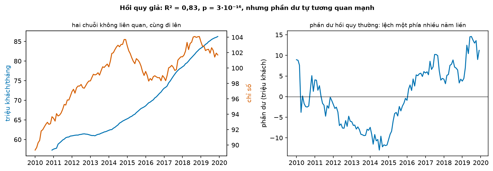
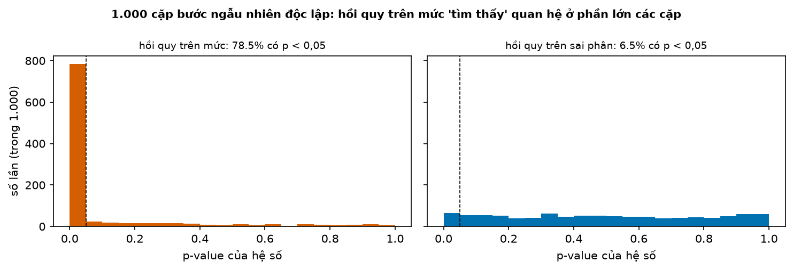
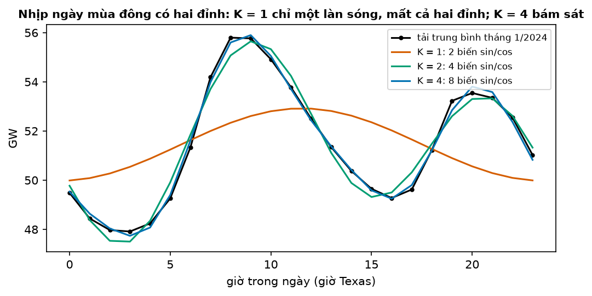
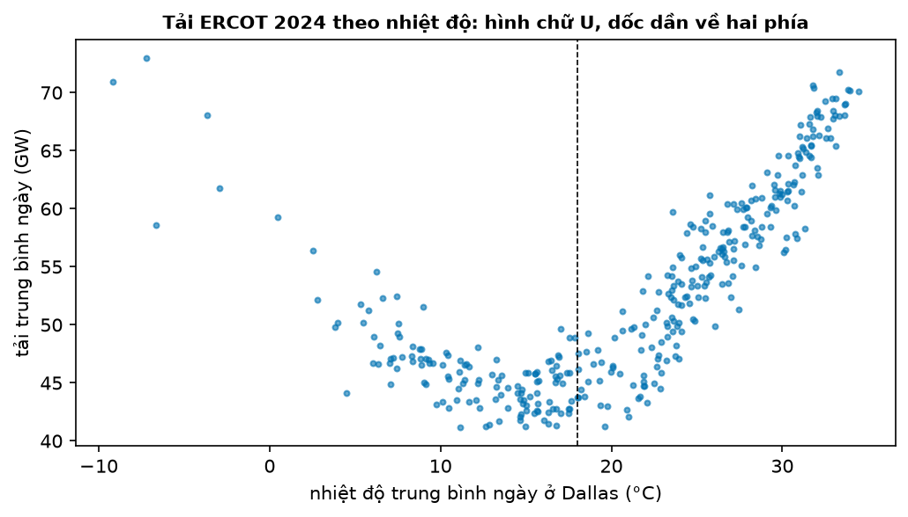
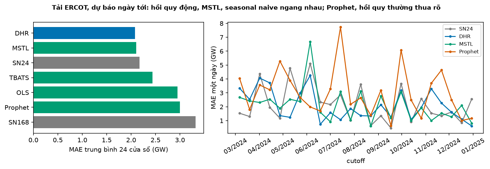
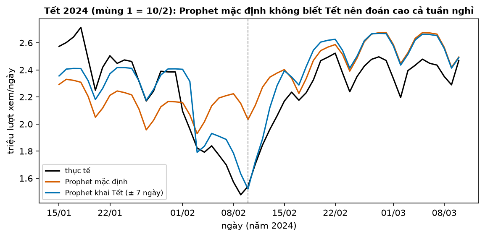

# Buổi 18 — Hồi quy chuỗi thời gian và hồi quy động

## 1. Mục tiêu

Sau buổi này bạn:

- Viết một hồi quy chuỗi thời gian có xu hướng, biến giả mùa vụ và biến ngoài, và đọc được hệ số của nó.
- Nhận ra **hồi quy giả**: p-value "đẹp" giữa hai chuỗi không liên quan, và giải thích vì sao nó vô nghĩa.
- Sửa bằng **hồi quy động** (sai số ARIMA), và biết biến giải thích phải được dự báo trước.
- So bốn cách xử lý **nhiều mùa vụ** (Fourier + ARIMA, MSTL, TBATS, Prophet) với seasonal naive trên cùng backtest.
- Khai **biến can thiệp** và lễ âm lịch (Tết) cho mô hình, và nói vì sao Prophet thường thua baseline.

## 2. Nhắc lại buổi trước

Từ buổi 7–8 và 11–13:

- **Tự tương quan**, **ACF**: chuỗi giống chính nó dời $k$ bước tới đâu. **Ljung–Box**: gộp ACF nhiều trễ; p < 0,05 là còn tự tương quan.
- **Tính dừng**: trung bình và độ dao động không đổi theo thời gian. **Sai phân** $y_t - y_{t-1}$ bỏ xu hướng. **Bước ngẫu nhiên**: mỗi kỳ
  cộng thêm một cú nhiễu, $y_t = y_{t-1} + \varepsilon_t$; không dừng.
- **Hồi quy tuyến tính**: $y$ bằng tổng có trọng số của các biến $x$; **R²**: phần dao động của $y$ mà các $x$ giải thích được (0 → 1).
  **Sai số chuẩn** của một hệ số: độ lệch chuẩn của chính ước lượng đó; **p-value** tính từ hệ số chia sai số chuẩn, p < 0,05 thường được đọc
  là "hệ số khác 0 thật".
- **Biến giả**: cột 0/1 báo mốc nào thuộc một nhóm (tháng 7, ngày lễ). **Fourier term**: cặp sin, cos theo một chu kỳ, thay cho nhiều biến giả.
- **Ex-ante / ex-post**: dự báo thật chỉ dùng thông tin có lúc ra dự báo; dùng giá trị thật về sau của biến giải thích là ex-post (không được dùng khi chấm dự báo).

Từ buổi 15–17:

- **Backtest rolling origin** (`tv.backtest`), **Diebold–Mariano (DM)**: p < 0,05 là chênh sai số có thật. Cutoff cách nhau đúng 7 hay 14
  ngày thì mọi cửa sổ rơi cùng một thứ trong tuần (bẫy thứ trong tuần).
- **ARIMA**, **AICc** (chọn mô hình: nhỏ hơn là tốt hơn, chỉ so khi cùng số lần sai phân), **SARIMA** có phần mùa vụ.

## 3. Trạng thái đầu buổi

Sau `python lab.py up` (trong thư mục `lab/`):

| Hạng mục | Trạng thái |
|---|---|
| Dữ liệu 1 | `du-lieu/raw/eurostat-hanh-khach-hang-khong/` (`6ce5178cf876`) — hành khách hàng không EU theo tháng; `frb-g17-san-luong-cong-nghiep/` (`3956c6626866`) — sản lượng công nghiệp Mỹ theo tháng |
| Dữ liệu 2 | `eia930-balance-2024-h1`, `-h2` (`26768c495c3b`, `a602a8e577cf`) — tải điện theo giờ 2024, dùng vùng ERCOT (Texas); `open-meteo-dallas-du-bao-luu-2024` (`5c7b56f9f713`) — nhiệt độ Dallas theo giờ: đo sau và đã dự báo từ hôm trước |
| Dữ liệu 3 | `wikipedia-vi-tong` (`481d604d1b58`) — tổng lượt xem Wikipedia tiếng Việt theo ngày, 2016–2025 |
| Nguồn | Eurostat (CC BY 4.0), Federal Reserve (public domain), U.S. EIA (public domain), Open-Meteo (CC BY 4.0), Wikimedia (CC0) |
| Môi trường | Python 3.12; pandas 2.3.3, statsmodels 0.15.0, statsforecast 2.1.1, prophet 1.4.0, holidays 0.104 |
| `code/hoi_quy.py` | đọc dữ liệu; `hoi_quy_ols`, `he_so_ip`, `mo_phong_hoi_quy_gia`; `fourier`, `bien_giai_thich`, `du_bao_dhr`, `backtest_dien`; `prophet_wiki`, `backtest_wiki` |
| `code/lab.ipynb` | notebook của Lab, bước 1–5 |
| **Đang cố tình sai** | `he_so_ip` dùng hồi quy thường; `KHAI_TET = False` |
| **Triệu chứng** | hành khách EU "phụ thuộc" sản lượng công nghiệp Mỹ với p = 3·10⁻¹⁶; Prophet đoán cao cả tuần Tết |
| `python lab.py check` lúc này | ĐỎ: 2/5 test hỏng |

## 4. Lý thuyết

### Từ mới trong buổi

| Thuật ngữ | Nghĩa một câu | Ví dụ |
|---|---|---|
| biến giải thích (predictor) | Cột $x$ dùng để dự báo $y$. | Nhiệt độ để dự báo tải điện. |
| hồi quy giả (spurious regression) | Hồi quy cho quan hệ "có ý nghĩa" giữa hai chuỗi không liên quan, chỉ vì cả hai cùng trôi theo thời gian. | Hành khách EU ~ sản lượng Mỹ, p = 3·10⁻¹⁶. |
| hồi quy động (dynamic regression) | Hồi quy mà phần sai số được mô hình bằng ARIMA thay vì coi là độc lập. | Tải ~ nhiệt độ, sai số ARIMA(1,1,0). |
| nhiều mùa vụ | Chuỗi có hai nhịp lặp trở lên. | Tải điện: nhịp 24 giờ và nhịp 168 giờ (tuần). |
| CDD, HDD | Số độ trên (CDD) hay dưới (HDD) một mức nhiệt thoải mái; đo nhu cầu làm mát, sưởi. | Mức 18 °C, trời 30 °C: CDD 12, HDD 0. |
| MSTL | Tách chuỗi thành xu hướng + nhiều thành phần mùa vụ (buổi 6: STL cho một mùa vụ), dự báo từng phần. | Mùa vụ ngày + tuần + phần còn lại. |
| TBATS | Mô hình state space có Fourier cho nhiều mùa vụ, biến đổi Box–Cox và sai số ARMA. | `AutoTBATS([24, 168])`. |
| biến can thiệp | Biến giả mô tả một sự kiện: xung (một kỳ), bậc (từ một mốc trở đi), dốc (đổi độ dốc từ một mốc). | Nhà máy đóng cửa từ tháng 3: biến bậc. |
| Prophet | Thư viện của Meta: xu hướng gãy khúc + Fourier + lễ. | `Prophet().fit(df)`. |
| DM, ARMA | Kiểm định Diebold–Mariano (buổi 15); ARMA là ARIMA không sai phân (buổi 17). | ARMA(1,1). |

### 4.1 Hồi quy chuỗi thời gian

**Vấn đề.** Doanh số tăng dần, quý 4 luôn cao, và phụ thuộc giá. Một phương trình nào gom được cả ba?

**Trực giác.** Viết $y$ thành tổng: một mức ban đầu, cộng xu hướng theo thời gian, cộng "phần thưởng" của từng quý, cộng ảnh hưởng của biến
ngoài. Mỗi phần có một hệ số, hồi quy tìm hệ số làm tổng bình phương sai lệch nhỏ nhất.

**Ví dụ số nhỏ — tự tính tay.** Một mô hình doanh số theo quý đã khớp xong:

$$
\hat y_t = 20 + 0{,}5\,t + 3\,Q2_t + 6\,Q3_t - 2\,Q4_t
$$

- $t$: số thứ tự quý (1, 2, 3…); $Q2_t, Q3_t, Q4_t$: biến giả, bằng 1 nếu quý $t$ là quý 2, 3, 4; quý 1 là mốc so sánh nên không có biến.

**Nói bằng lời.** Doanh số bắt đầu quanh 20, mỗi quý tăng 0,5; ngoài phần xu hướng đó, quý 3 cao hơn quý 1 6 đơn vị, quý 4 thấp hơn 2. Quý thứ 9 là quý 1:
20 + 0,5 × 9 = 24,5. Quý thứ 11 là quý 3: 20 + 5,5 + 6 = 31,5.

Chỉ dùng ba biến giả cho bốn quý. Thêm $Q1$ nữa thì bốn cột cộng lại luôn bằng 1 ở mọi dòng, trùng với **hệ số chặn** (số 20, đi với
một cột hằng bằng 1). Khi đó hồi quy không có lời giải duy nhất (FPP §7.4). Với tháng: mười một biến giả.

**Chọn biến.** Không bỏ biến vì p-value lớn, không giữ biến vì p-value nhỏ: p-value trả lời "hệ số có khác 0 không", còn câu hỏi của dự báo là
"thêm biến này có dự báo tốt hơn không". Chọn bằng AICc hoặc backtest (FPP §7.5).

**Tóm lại.** **Hồi quy chuỗi thời gian = mức + xu hướng + biến giả mùa vụ ($m - 1$ cột) + biến ngoài. Chọn biến bằng AICc hay backtest, không
bằng p-value.**

**Tự kiểm tra.** Cùng mô hình trên, dự báo quý thứ 12. Và nếu dùng 12 biến giả tháng cùng hệ số chặn thì sao?

<details>
<summary>Đáp án</summary>

Quý 12 là quý 4: 20 + 0,5 × 12 − 2 = **24**. Mười hai biến giả tháng cộng lại luôn bằng 1, trùng hệ số chặn: không có lời giải duy nhất;
phải bỏ một tháng làm mốc. Nhầm hay gặp: nghĩ "thêm biến thì không mất gì".

</details>

### 4.2 Hồi quy giả: p-value đẹp mà vô nghĩa

**Vấn đề.** Hồi quy hành khách hàng không EU theo sản lượng công nghiệp Mỹ (kèm biến giả tháng, mười năm tới 2019) cho R² = 0,83 và p của hệ
số nhỏ tới $3 \cdot 10^{-16}$. Hai thứ gần như không liên quan. Chuyện gì xảy ra?

**Trực giác.** Chiều cao của một đứa trẻ và giá nhà trong thành phố cùng tăng theo năm. Vẽ cái này theo cái kia thì thành một đường thẳng
đẹp, nhưng không cái nào gây ra cái nào: cả hai chỉ cùng trôi theo thời gian.

**Ví dụ số nhỏ — tự tính tay.** $a = (0, -1, 1, 2, 4, 6)$, $b = (1, 2, 3, 4, 6, 6)$:

| | Độ lệch khỏi trung bình | Tích từng cặp |
|---|---|---|
| mức: $a$ (TB 2), $b$ (TB 3,67) | $a$: −2, −3, −1, 0, 2, 4; $b$: −2,67; −1,67; −0,67; 0,33; 2,33; 2,33 | gần như đều dương |
| sai phân: $a'$ = −1, 2, 1, 2, 2 (TB 1,2); $b'$ = 1, 1, 1, 2, 0 (TB 1) | $a'$: −2,2; 0,8; −0,2; 0,8; 0,8; $b'$: 0, 0, 0, 1, −1 | 0, 0, 0, 0,8, −0,8: tổng 0 |

**Đọc bảng.** Trên mức, $a$ thấp thì $b$ thấp, $a$ cao thì $b$ cao: tương quan 0,93. Trên sai phân, tích cộng lại bằng 0: tương quan 0. Quan hệ
"mạnh" chỉ đến từ việc cả hai cùng đi lên.



**Cách đọc hình.**

1. **Trục ngang**: năm, 2010 → 2019.
2. **Trục dọc**: ô trái, hành khách (triệu mỗi tháng, trung bình 12 tháng, trục trái) và chỉ số sản lượng (trục phải); ô phải, phần dư của
   hồi quy thường (triệu khách).
3. **Ký hiệu**: xanh là hành khách, cam là sản lượng; ô phải một đường phần dư, vạch đen là 0.
4. **Nhìn vào đâu**: ô phải, những đoạn dài nằm hẳn một phía vạch 0.
5. **Kết luận**: phần dư nằm dưới 0 nhiều năm liền rồi trên 0 nhiều năm liền (dài nhất 47 tháng): nó tự tương quan mạnh, không phải nhiễu.

**Vì sao p-value sai.** Công thức p-value của hồi quy thường giả định mỗi phần dư độc lập với phần dư trước. Ở đây phần dư nằm một phía cả
năm liền, nên 120 tháng chỉ mang thông tin của vài lần quan sát độc lập. Công thức vẫn tính như 120 lần, nên sai số chuẩn nhỏ đi và p nhỏ giả
tạo (FPP §10). Thêm biến xu hướng $t$ thì hệ số của sản lượng **đổi dấu** thành −0,68 mà p vẫn rất nhỏ ($3 \cdot 10^{-7}$): một con số tin
được thì không lật như vậy.



**Cách đọc hình.**

1. **Trục ngang**: p-value của hệ số, 0 → 1.
2. **Trục dọc**: số lần trong 1.000 cặp.
3. **Ký hiệu**: ô trái hồi quy trên mức, ô phải trên sai phân; vạch đứt là 0,05.
4. **Nhìn vào đâu**: cột sát trái vạch 0,05.
5. **Kết luận**: hai chuỗi độc lập mà hồi quy trên mức báo "có quan hệ" ở 78,5% số cặp; trên sai phân chỉ 6,5%, gần mức 5% lẽ ra phải có.

**Tóm lại.** **Hai chuỗi cùng trôi theo thời gian cho R² cao và p nhỏ dù không liên quan. Dấu hiệu: phần dư tự tương quan mạnh (Ljung–Box p
≈ 0). Khi đó p-value của hồi quy thường vô nghĩa.**

**Tự kiểm tra.** Một bài báo cáo: "Số người dùng app và doanh thu cửa hàng đối thủ tương quan 0,95, p < 0,001, trên 36 tháng". Hỏi gì trước khi
tin?

<details>
<summary>Đáp án</summary>

Cả hai có cùng tăng theo thời gian không? Phần dư có tự tương quan không (Ljung–Box)? Làm lại trên sai phân (tăng thêm mỗi tháng) hoặc bằng
hồi quy động; nếu quan hệ biến mất thì đó là hồi quy giả. Nhầm hay gặp: nghĩ p rất nhỏ thì chắc chắn có quan hệ.

</details>

### 4.3 Hồi quy động: cho sai số một mô hình ARIMA

**Vấn đề.** Hồi quy thường coi sai số là nhiễu độc lập. Trên chuỗi thời gian, phần mô hình chưa giải thích được hôm nay thường còn kéo sang
ngày mai. Bỏ qua điều đó thì p-value sai (mục 4.2) và dự báo bỏ phí thông tin.

**Trực giác.** Tách làm hai tầng: tầng hồi quy giải thích $y$ bằng $x$; phần còn lại $\eta_t$ không phải nhiễu mà là một chuỗi có quy luật,
nên mô hình nó bằng ARIMA (buổi 17).

**Ví dụ số nhỏ — tự tính tay.** $y_t = 2 x_t + \eta_t$, với $\eta_t = 0{,}8\,\eta_{t-1} + \varepsilon_t$ (AR(1), buổi 17). Hôm nay $\eta$ = 3
(thực tế cao hơn phần hồi quy 3 đơn vị). Ngày mai $x$ dự báo là 5:

- phần hồi quy: 2 × 5 = 10;
- phần sai số: 0,8 × 3 = 2,4 (độ lệch hôm nay còn kéo sang mai);
- dự báo: 10 + 2,4 = **12,4**. Hồi quy thường chỉ dự báo 10.

**Công thức.**

$$
y_t = \beta_0 + \beta_1 x_{1,t} + \dots + \beta_k x_{k,t} + \eta_t, \qquad \eta_t \sim \text{ARIMA}
$$

- $\beta_j$: hệ số của biến giải thích $x_j$; $\eta_t$: phần hồi quy chưa giải thích, được mô hình bằng ARIMA; phần dư của ARIMA đó mới là
  nhiễu $\varepsilon_t$ và phải trắng (qua Ljung–Box).

**Nói bằng lời.** Dự báo = phần do biến giải thích + phần sai số ARIMA dự báo được. Ở ví dụ: 10 + 2,4 = 12,4. Nếu $y$ hoặc $x$ không dừng,
ARIMA lấy sai phân của cả hai trước (FPP §10.2), như ở dữ liệu hành khách.

**Dữ liệu thật.** Hành khách ~ sản lượng công nghiệp, sai số SARIMA(0,1,1)(0,1,1)12:

| Mô hình | Hệ số của sản lượng | p | Ljung–Box p của phần dư |
|---|---|---|---|
| hồi quy thường + 11 biến giả tháng | 1,89 | 3·10⁻¹⁶ | ≈ 0 |
| hồi quy động | 0,10 | 0,59 | 0,64 |

**Đọc bảng.** Phần dư của hồi quy động đã trắng, nên p-value lần này tin được: không có bằng chứng sản lượng Mỹ giải thích hành khách EU.

**Dự báo biến giải thích.** Muốn dự báo tải điện ngày mai bằng nhiệt độ ngày mai thì phải có nhiệt độ ngày mai: dùng **dự báo** nhiệt độ ra
từ hôm nay (ex-ante). Dùng nhiệt độ đo thật về sau là ex-post: được phép khi phân tích quá khứ, không được phép khi chấm dự báo. Code của
buổi học trên nhiệt độ đo thật của quá khứ, rồi dự báo bằng nhiệt độ đã dự báo; bộ chấm kiểm điều này tự động. Trên 24 ngày chấm ở mục 4.4,
đổi sang nhiệt độ đo thật không làm MAE tốt hơn (đo thật 2.235 MW, dự báo 2.082 MW): dự báo nhiệt độ một ngày tới đã khá sát.

**Tóm lại.** **Hồi quy động = hồi quy + sai số ARIMA. Phần dư ARIMA phải trắng thì p-value mới tin được. Dự báo cần dự báo của biến giải thích,
không được dùng giá trị thật về sau.**

**Tự kiểm tra.** $y_t = 3 x_t + \eta_t$, $\eta_t = 0{,}5\,\eta_{t-1} + \varepsilon_t$. Hôm nay $\eta$ = −4. Dự báo 2 ngày tới, biết $x$ dự báo là
10 cả hai ngày.

<details>
<summary>Đáp án</summary>

Ngày 1: 30 + 0,5 × (−4) = **28**. Ngày 2: $\eta$ dự báo 0,5 × (−2) = −1, nên 30 − 1 = **29**. Độ lệch tắt dần về 0. Nhầm hay gặp: dùng $\eta$ =
−4 cho cả hai ngày.

</details>

### 4.4 Nhiều mùa vụ: Fourier + ARIMA, MSTL, TBATS

**Vấn đề.** Tải điện theo giờ có nhịp ngày (24 giờ) và nhịp tuần (168 giờ), lại phụ thuộc nhiệt độ. SARIMA với chu kỳ 168 rất chậm và chỉ nhận
một chu kỳ.

**Trực giác.** Vẽ lại nhịp ngày bằng cách cộng vài làn sóng sin, cos: một làn sóng cho hình dáng thô, thêm làn sóng nhanh hơn để bắt chi tiết.

**Ví dụ số nhỏ — tự tính tay.** Một cặp ($K = 1$), chu kỳ 24 giờ: $s(t) = a \sin(2\pi t/24) + b\cos(2\pi t/24)$, với $a = 10$, $b = -5$:

- $t$ = 6: $\sin(\pi/2) = 1$, $\cos(\pi/2) = 0$ → $s$ = **10**;
- $t$ = 0: $\sin 0 = 0$, $\cos 0 = 1$ → $s$ = **−5**;
- $t$ = 24: như $t$ = 0. Hai cột sin, cos thay cho 23 biến giả giờ.



**Cách đọc hình.**

1. **Trục ngang**: giờ trong ngày (giờ Texas), 0 → 23.
2. **Trục dọc**: tải trung bình theo giờ của tháng 1/2024 (GW).
3. **Ký hiệu**: đen là tải thật; cam, xanh lá, xanh dương là tổng Fourier với $K$ = 1, 2, 4 cặp.
4. **Nhìn vào đâu**: đỉnh sáng (8–9 giờ) và đỉnh tối (20 giờ).
5. **Kết luận**: $K$ = 1 chỉ là một làn sóng tròn, mất cả hai đỉnh; $K$ = 2 đã có hai đỉnh; $K$ = 4 gần như trùng đường thật.

**Công thức.**

$$
y_t = \sum_{k=1}^{K_1}\Big[a_k \sin\tfrac{2\pi k t}{24} + b_k \cos\tfrac{2\pi k t}{24}\Big] + \sum_{k=1}^{K_2}\Big[c_k \sin\tfrac{2\pi k t}{168} +
d_k \cos\tfrac{2\pi k t}{168}\Big] + \beta\,\text{(nhiệt độ, lễ)} + \eta_t
$$

- $K_1$, $K_2$: số cặp sin/cos cho nhịp ngày và nhịp tuần; $a_k, b_k, c_k, d_k$: hệ số hồi quy tìm được; $\eta_t$: sai số ARIMA.

**Nói bằng lời.** Tải = nhịp ngày + nhịp tuần + ảnh hưởng nhiệt độ và lễ + sai số ARIMA (dynamic harmonic regression, FPP §10.5). Nhiều
cặp hơn thì bắt được chi tiết hơn nhưng thêm tham số; chọn $K$ bằng AICc. Trên 8 tuần học cuối tháng 8, AICc nhỏ nhất ở $K_1 = 10$, $K_2 = 6$
trong bốn cặp đã thử (bước 3 của Lab).



**Cách đọc hình.**

1. **Trục ngang**: nhiệt độ trung bình ngày ở Dallas (°C).
2. **Trục dọc**: tải trung bình ngày của ERCOT (GW).
3. **Ký hiệu**: mỗi chấm một ngày năm 2024; vạch đứt là 18 °C.
4. **Nhìn vào đâu**: hai nhánh hai bên vạch đứt.
5. **Kết luận**: xa 18 °C về phía nào tải cũng tăng, và tăng nhanh dần; nên dùng CDD, HDD và cả bình phương của chúng.

**Hai cách khác.** **MSTL** tách chuỗi thành xu hướng + mùa vụ ngày + mùa vụ tuần + phần còn lại, dự báo xu hướng bằng ETS (làm trơn hàm mũ, buổi 16) và lặp lại các
mùa vụ. **TBATS** là mô hình state space dùng Fourier cho từng mùa vụ, có Box–Cox (buổi 5) và sai số ARMA; không nhận biến ngoài và chạy chậm
(khoảng 9 giây mỗi cửa sổ ở đây).

**Dữ liệu thật.** 24 cửa sổ năm 2024, mỗi cửa sổ học 8 tuần gần nhất, dự báo 24 giờ tới; cutoff cách nhau 13 ngày để xoay qua mọi thứ trong
tuần:

| Cách | MAE trung bình (MW) | MAE trung vị (MW) | DM so với hồi quy động |
|---|---|---|---|
| hồi quy động (Fourier + nhiệt độ + lễ, sai số ARIMA) | **2.082** | **1.738** | — |
| MSTL + ETS | 2.104 | 2.009 | p = 0,93 |
| seasonal naive 24 giờ | 2.173 | 1.790 | p = 0,76 |
| TBATS | 2.438 | 2.132 | |
| hồi quy thường, cùng biến | 2.951 | 2.789 | p = 0,010 |
| Prophet mặc định | 2.998 | 2.657 | p = 0,017 |
| seasonal naive 168 giờ | 3.319 | 2.473 | |

**Đọc bảng.** Ba dòng đầu gần bằng nhau và DM không phân biệt được: hồi quy động chưa thắng seasonal naive một cách chắc chắn. Nó thắng rõ
hồi quy thường cùng biến (sai số ARIMA có ích) và Prophet mặc định.



**Cách đọc hình.**

1. **Trục ngang**: ô trái, MAE trung bình (GW); ô phải, ngày cutoff.
2. **Trục dọc**: ô trái, từng cách; ô phải, MAE của một ngày (GW).
3. **Ký hiệu**: xanh dương là hồi quy động, xanh lá là cách khác, xám là seasonal naive; ô phải thêm cam là Prophet.
4. **Nhìn vào đâu**: ô phải, đường cam so với các đường còn lại.
5. **Kết luận**: không cách nào thắng mọi ngày; Prophet có nhiều ngày sai gấp đôi các cách khác.

**Khi nào dùng, khi nào không.** Phần dư của hồi quy động theo giờ ở đây vẫn tự tương quan (Ljung–Box p ≈ 0): mô hình còn thô, như ví dụ tải
điện của FPP §12.1. Có biến ngoài quan trọng (nhiệt độ) thì dùng hồi quy động; không có thì MSTL là baseline mạnh, nhanh. TBATS hợp khi chu kỳ
dài và không có biến ngoài.

**Tóm lại.** **Nhiều mùa vụ: dùng Fourier cho từng chu kỳ ($K$ chọn bằng AICc) kèm sai số ARIMA, hoặc MSTL, hoặc TBATS. Trên tải ERCOT, ba cách
tốt nhất ngang seasonal naive; luôn kiểm bằng DM.**

**Tự kiểm tra.** Chuỗi theo giờ có nhịp năm (8.766 giờ). Dùng biến giả thì cần bao nhiêu cột, Fourier $K$ = 5 thì bao nhiêu?

<details>
<summary>Đáp án</summary>

Biến giả: gần chín nghìn cột, mỗi giờ trong năm một cột. Fourier $K = 5$: **10** cột, năm sin và năm cos. Nhầm hay gặp: nghĩ Fourier chỉ
dùng được cho chu kỳ nguyên; chu kỳ 8.766 hay 365,25 vẫn được.

</details>

### 4.5 Biến can thiệp và lễ

**Vấn đề.** Một nhà máy đóng cửa từ tháng 3, một ngày khuyến mãi, một kỳ nghỉ Tết: mô hình không tự biết, và sẽ coi chúng là nhiễu.

**Trực giác.** Mô tả sự kiện bằng một cột số rồi cho hồi quy tự học ảnh hưởng của nó.

**Ví dụ số nhỏ — tự tính tay.** Sáu tháng, sự kiện ở tháng 3:

| Tháng | 1 | 2 | 3 | 4 | 5 | 6 |
|---|---|---|---|---|---|---|
| xung (chỉ tháng 3) | 0 | 0 | 1 | 0 | 0 | 0 |
| bậc (từ tháng 3) | 0 | 0 | 1 | 1 | 1 | 1 |
| dốc (từ tháng 3) | 0 | 0 | 0 | 1 | 2 | 3 |

**Đọc bảng.** Xung cho sự kiện một kỳ (khuyến mãi), bậc cho thay đổi lâu dài (nhà máy đóng cửa), dốc cho xu hướng đổi độ dốc từ một mốc (xu
hướng theo khúc, FPP §7.7). Hệ số −5 của cột bậc nghĩa là từ tháng 3 mọi tháng thấp hơn 5.

**Lễ âm lịch.** Tết Nguyên Đán rơi vào ngày dương khác nhau mỗi năm, nên nhịp năm (Fourier, biến giả tháng) không bắt được. Ảnh hưởng còn kéo
dài nhiều ngày: năm 2024 (mùng 1 là 10/2), lượt xem Wikipedia tiếng Việt từ 3/2 đã còn 74% mức bình thường, ngày 9/2 còn 60%.

Vì vậy khai Tết bằng một biến giả **có cửa sổ**: bằng 1 từ một tuần trước tới một tuần sau mùng 1. Ảnh hưởng kéo dài sau một sự kiện
(quảng cáo tuần này, bán hàng còn tăng tuần sau) thì thêm cột trễ của biến đó (distributed lag).

**Tóm lại.** **Sự kiện mô tả bằng cột xung, bậc hay dốc; lễ âm lịch khai bằng ngày thật mỗi năm, kèm cửa sổ trước và sau.**

**Tự kiểm tra.** Từ tháng 7, cửa hàng thứ hai mở cạnh bên và doanh số giảm hẳn. Cột nào? Nếu doanh số giảm dần mỗi tháng thêm một chút thì sao?

<details>
<summary>Đáp án</summary>

Giảm hẳn một mức và giữ nguyên: cột **bậc**, bằng 0 trước tháng 7 và bằng 1 từ tháng 7. Giảm dần: cột **dốc**, bằng 0 trước tháng 7 rồi
tăng thêm 1 mỗi tháng. Nhầm hay gặp: dùng xung cho thay đổi lâu dài; xung chỉ tác động đúng một tháng.

</details>

### 4.6 Prophet: dễ dùng, nhưng không tự biết Tết

**Vấn đề.** Prophet chạy bằng hai dòng lệnh và cho đồ thị đẹp, nên được dùng rất nhiều. Nó tốt tới đâu?

**Trực giác.** Prophet là một hồi quy như mục 4.1–4.5: xu hướng gãy khúc (tự chọn các điểm gãy), Fourier cho nhịp năm và tuần, biến giả cho lễ.
Nó **không** mô hình sai số tự tương quan như hồi quy động.

**Ví dụ số nhỏ — tự tính tay.** Các thành phần Prophet tính cho ngày 9/2/2024, ngay trước Tết (triệu lượt xem; học trên 2016–2023):

| | Xu hướng | Nhịp tuần | Nhịp năm | Tết | Dự báo |
|---|---|---|---|---|---|
| không khai Tết | 2,425 | −0,018 | −0,255 | — | 2,425 − 0,018 − 0,255 = **2,152** |
| khai Tết | 2,444 | −0,018 | −0,066 | −0,726 | 2,444 − 0,018 − 0,066 − 0,726 = **1,634** |

**Đọc bảng.** Thực tế là 1,48. Không khai Tết, nhịp năm cố "học" cú sụt Tết nhưng Tết mỗi năm một ngày dương khác, nên cú sụt bị trải mỏng
(−0,26). Khai Tết thì cú sụt nằm đúng chỗ (−0,73) và nhịp năm trở lại nhỏ.

**Công thức.**

$$
y_t = g(t) + s(t) + h(t) + \varepsilon_t
$$

- $g(t)$: xu hướng tuyến tính gãy khúc; $s(t)$: tổng Fourier cho nhịp năm và tuần; $h(t)$: ảnh hưởng của lễ đã khai; $\varepsilon_t$: sai số,
  coi như độc lập.

**Nói bằng lời.** Dự báo = xu hướng + mùa vụ + lễ. Ở ví dụ khai Tết: 2,444 − 0,018 − 0,066 − 0,726 = 1,634. Mặc định $h(t)$ = 0: Prophet không có
lễ nào.

**Dữ liệu thật.** Học tới hết năm trước, dự báo cả năm sau; MAE theo triệu lượt xem mỗi ngày:

| | Quanh Tết 2024 | Quanh Tết 2025 | Cả năm 2024 | Cả năm 2025 |
|---|---|---|---|---|
| Prophet mặc định | 0,355 | 0,234 | 0,304 | 0,486 |
| Prophet khai Tết (± 7 ngày) | **0,118** | **0,153** | 0,290 | 0,484 |
| seasonal naive 364 ngày | 0,442 | 0,440 | **0,260** | **0,459** |

**Đọc bảng.** Khai Tết giảm sai số quanh Tết khoảng ba lần năm 2024. Nhưng cả năm, seasonal naive (cùng thứ, năm trước) vẫn thắng Prophet ở
cả hai năm. Trên tải ERCOT (mục 4.4), Prophet thua cả hồi quy động lẫn seasonal naive.



**Cách đọc hình.**

1. **Trục ngang**: ngày, 15/1 → 10/3/2024.
2. **Trục dọc**: lượt xem mỗi ngày (triệu).
3. **Ký hiệu**: đen là thực tế, cam là Prophet mặc định, xanh là Prophet khai Tết; vạch đứt là mùng 1 (10/2).
4. **Nhìn vào đâu**: hai tuần quanh vạch đứt.
5. **Kết luận**: đường cam đi ngang ở mức 2,0–2,2 trong khi thực tế sụt xuống 1,5; đường xanh sụt theo.

**Khi nào dùng, khi nào không.** Prophet hợp khi cần một mô hình tự động có thể giải thích từng thành phần cho người không chuyên, và luôn phải
so với seasonal naive. Hai bẫy mặc định: xu hướng gãy khúc quá linh hoạt, bám theo những thay đổi ở cuối lịch sử; không biết lễ âm lịch. FPP §12.2
nhận xét Prophet hiếm khi chính xác hơn các cách khác.

**Tóm lại.** **Prophet = xu hướng gãy khúc + Fourier + lễ, sai số coi như độc lập. Phải tự khai Tết kèm cửa sổ; khai rồi vẫn thường thua
seasonal naive.**

**Tự kiểm tra.** Một báo cáo: "Prophet dự báo lượt xem 2025 với MAE 0,48; mô hình tự động, đẹp, nên dùng." Thiếu gì?

<details>
<summary>Đáp án</summary>

Thiếu baseline: seasonal naive 364 ngày có MAE 0,46, tốt hơn. Cũng không nói đã khai Tết chưa. Nhầm hay gặp: coi mô hình phức tạp, tự động là
tốt hơn mà không so với baseline.

</details>

## 5. Lab từng bước

Lệnh gõ trong terminal ở thư mục `lab/`. Code các bước nằm sẵn trong `code/lab.ipynb` (mở bằng `python lab.py notebook` hoặc VS Code),
chạy từng ô từ trên xuống. Bạn sửa `code/hoi_quy.py`; notebook tự nạp lại bản mới.

### Bước 1 — Hồi quy giả

**Mục đích:** thấy p-value "đẹp" giữa hai chuỗi không liên quan.

```bash
python lab.py up           # một lần: môi trường + 6 bộ dữ liệu, kiểm sha256
python lab.py check        # 2/5 test đỏ
python lab.py notebook     # chạy ô bước 1
```

**Đọc kết quả:** hồi quy thường cho p rất nhỏ và Ljung–Box p ≈ 0; mô phỏng cho tỷ lệ "có ý nghĩa" trên mức cao hơn nhiều so với trên sai
phân (mục 4.2).

### Bước 2 — Hồi quy động

**Mục đích:** sửa `he_so_ip` để dùng sai số SARIMA(0,1,1)(0,1,1)12. Chỉ đưa cột `ip`, vì sai phân mùa vụ đã lo mùa vụ:

```python
from statsmodels.tsa.statespace.sarimax import SARIMAX
kq = SARIMAX(y, exog=X[["ip"]], order=(0, 1, 1), seasonal_order=(0, 1, 1, 12)).fit(disp=False)
e = kq.resid.to_numpy()[13:]   # 13 điểm đầu chưa đủ dữ liệu cho sai phân 1 + 12 nên phần dư vô nghĩa
```

Ljung–Box tính trên `e`, không trên `kq.resid`. Chạy lại ô bước 2.

**Đọc kết quả:** hệ số, p và Ljung–Box p như dòng hồi quy động ở bảng mục 4.3. Ljung–Box p còn dưới 0,05 thì phần sai số chưa đủ.

### Bước 3 — Tải ERCOT: Fourier và nhiệt độ

**Mục đích:** xem biến giải thích, chọn $K$ bằng AICc, kiểm phần dư (mục 4.4). Không cần sửa.

**Đọc kết quả:** bảng AICc giảm dần tới $K$ = 10 và 6; Ljung–Box của phần dư theo giờ vẫn ≈ 0.

### Bước 4 — So bốn cách đa mùa vụ

**Mục đích:** chạy backtest 24 cửa sổ (lần đầu khoảng 7 phút, lưu vào `du-lieu/cache/`), rồi bảng MAE và DM. Không cần sửa.

**Đọc kết quả:** bảng MAE và DM như mục 4.4; thứ của các cutoff trải đều qua cả tuần.

### Bước 5 — Prophet và Tết

**Mục đích:** so Prophet không khai và có khai Tết (mục 4.6). Đổi `KHAI_TET = True`. Chạy lại ô bước 5, rồi:

```bash
python lab.py check        # 5/5 xanh
```

**Đọc kết quả:** MAE quanh Tết 2024 từ 0,355 xuống 0,118. Xanh 5/5 là xong; `test_prophet_khai_tet` còn đỏ thì Prophet chưa nhận bảng lễ.

## 6. Lỗi thường gặp & cách chẩn đoán

| Triệu chứng | Nguyên nhân | Chẩn đoán | Sửa |
|---|---|---|---|
| R² cao, p rất nhỏ giữa hai chuỗi có xu hướng | hồi quy giả | Ljung–Box phần dư; làm lại trên sai phân | hồi quy động, hoặc sai phân cả hai |
| Hệ số đổi dấu khi thêm một biến | phần dư tự tương quan, biến tương quan nhau | so hai lần chạy | không đọc p-value; chọn biến bằng AICc/backtest |
| Hồi quy báo lỗi "không giải được" | đủ 12 biến giả tháng cùng hệ số chặn; hoặc một cột toàn 0 | đếm biến giả, tìm cột hằng | bỏ một tháng làm mốc; bỏ cột hằng |
| Backtest đẹp bất thường với biến thời tiết | dùng nhiệt độ đo thật của ngày dự báo (ex-post) | cột nào dùng cho đoạn dự báo | dùng dự báo nhiệt độ |
| Dự báo NaN ở cuối | biến giải thích không có cho đoạn dự báo | `isna()` trên X tương lai | cắt đoạn chấm cho khớp dữ liệu biến |
| Một cách thắng/thua bất thường ở mọi cửa sổ | cutoff cách nhau bội số của 7 ngày | in thứ của các cutoff | bước 13 hoặc 15 ngày |
| Prophet đoán cao cả tuần Tết | không khai lễ âm lịch | xem dự báo quanh mùng 1 | bảng lễ với `lower_window`, `upper_window` |
| Prophet bám xu hướng cuối quá mạnh | điểm gãy quá linh hoạt | vẽ `g(t)` | giảm `changepoint_prior_scale`; so seasonal naive |
| TBATS chạy rất lâu | nhiều chu kỳ dài | đo thời gian một cửa sổ | ít cửa sổ hơn, hoặc MSTL |

## 7. Bài tập về nhà

1. **Chọn biến bằng AICc.** Bỏ CDD², HDD² khỏi `bien_giai_thich`, chạy lại bước 4. MAE hồi quy động đổi thế nào? AICc nói gì?
2. **Sai phân.** Hồi quy sai phân tháng (so với 12 tháng trước) của hành khách theo sai phân tháng của sản lượng công nghiệp. Hệ số và p ra sao?
3. **Prophet điều chỉnh.** Chạy Prophet trên tải ERCOT với nhiệt độ làm biến ngoài (`add_regressor`, dùng nhiệt độ dự báo cho đoạn dự báo). Có
   thắng hồi quy động không?

## 8. Tiêu chí "Xong khi"

- [ ] `python lab.py check` xanh 5/5.
- [ ] Giải thích được bằng phần dư vì sao p = 3·10⁻¹⁶ ở bước 1 là ảo, và hồi quy động có phần dư trắng.
- [ ] Bảng 24 cửa sổ: hồi quy động, MSTL, TBATS, Prophet, seasonal naive, kèm DM; nói được cách nào thắng có ý nghĩa và cách nào không.
- [ ] Tính tay một dự báo hồi quy động có sai số AR(1).
- [ ] Prophet có khai Tết, và so với seasonal naive.

## 9. Đọc thêm

- Hyndman, R.J. & Athanasopoulos, G. *FPP3* ch. 7 (hồi quy), ch. 10 (hồi quy động), §12.1–12.2 (nhiều mùa vụ, Prophet): https://otexts.com/fpp3/
- Granger, C.W.J. & Newbold, P. (1974). Spurious regressions in econometrics. *Journal of Econometrics* 2.
- Taylor, S.J. & Letham, B. (2018). Forecasting at scale. *The American Statistician* 72(1).
- statsforecast: `AutoARIMA` với biến ngoài, `MSTL`, `AutoTBATS` — https://nixtlaverse.nixtla.io/statsforecast/
- Prophet: https://facebook.github.io/prophet/
