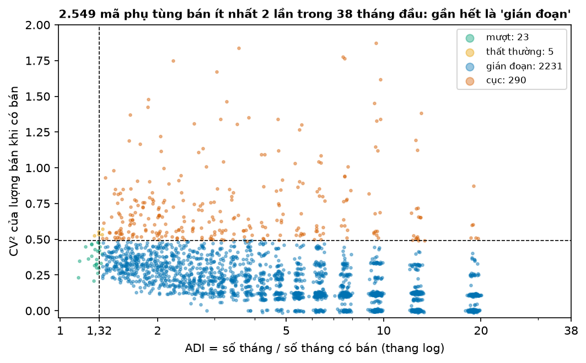
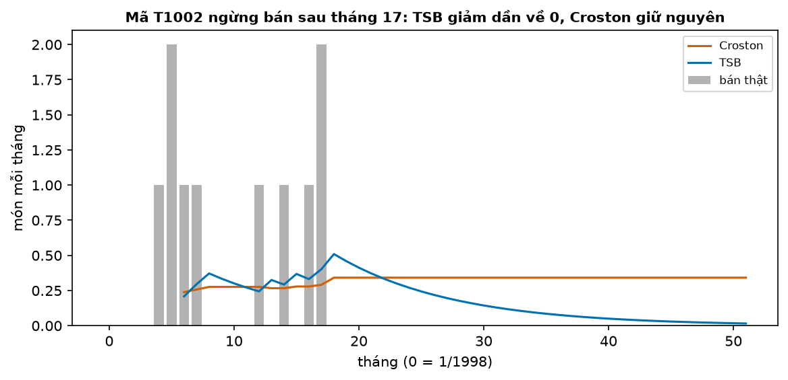
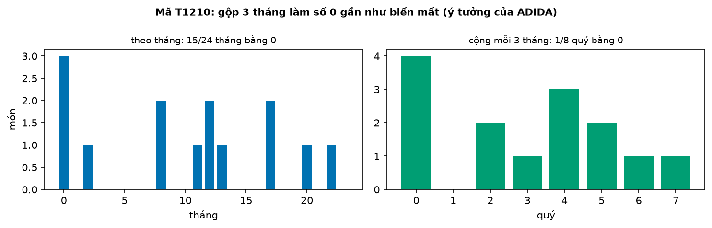
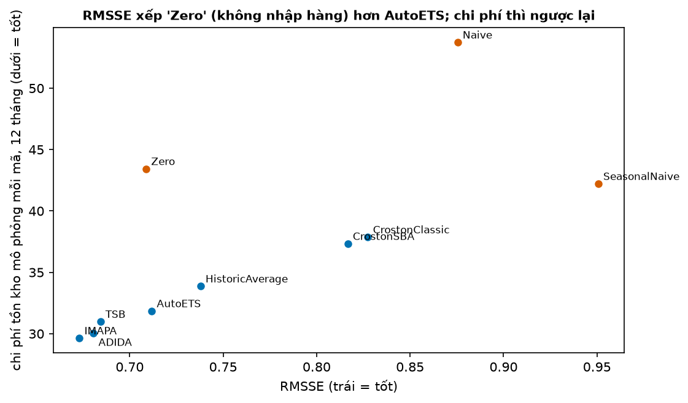

# Buổi 19 — Nhu cầu gián đoạn

## 1. Mục tiêu

Sau buổi này bạn:

- Phân loại một chuỗi bán hàng bằng **ADI** và **CV²**, và nói giới hạn của cách phân loại này.
- Giải thích vì sao dự báo "0,3 món mỗi tháng" vẫn có nghĩa, và vì sao MAE, MAPE chọn nhầm trên chuỗi nhiều số 0.
- Tự viết **Croston**, **SBA**, **TSB** bằng NumPy, khớp statsforecast; chỉ ra khi nào TSB hơn Croston.
- Giải thích ý tưởng **gộp thời gian** (ADIDA, IMAPA).
- Chấm mô hình bằng **mô phỏng tồn kho**, và chỉ ra một trường hợp RMSSE và chi phí tồn kho chọn hai mô hình khác nhau.

## 2. Nhắc lại buổi trước

Từ buổi 1 và 14:

- **Sai số** = thực tế − dự báo. **MAE** ưa trung vị, **RMSE** ưa trung bình: dự báo một hằng số cho nhiều ngày, MAE nhỏ nhất khi hằng số là
  trung vị, RMSE nhỏ nhất khi là trung bình.
- **MAPE** chia sai số cho thực tế nên vỡ khi thực tế bằng 0. **RMSSE**: căn của (trung bình sai số² chia trung bình bình phương bước nhảy
  $y_t - y_{t-1}$ trên phần học); dưới 1 là sai ít hơn mức nhảy quen thuộc của chuỗi. **MASE** tương tự nhưng dùng trị tuyệt đối.
- **Quantile** mức $p$: giá trị mà ít nhất $p$ phần số lần nhỏ hơn hoặc bằng nó. Thiếu hàng mất $C_u$ mỗi món, thừa mất $C_o$ mỗi món thì
  lượng tốt nhất là quantile mức $C_u / (C_u + C_o)$ (bài toán người bán báo, buổi 1).

Từ buổi 15–16:

- **Backtest rolling origin**: nhiều cutoff, ở mỗi cutoff chỉ học trên quá khứ rồi dự báo đoạn sau. Hàm `backtest` có sẵn trong `tv.backtest`.
- **SES** (làm trơn hàm mũ đơn) với trọng số α: mức mới = α × số mới + (1 − α) × mức cũ; dự báo mọi bước tới là mức cuối.

## 3. Trạng thái đầu buổi

Sau `python lab.py up` (trong thư mục `lab/`):

| Hạng mục | Trạng thái |
|---|---|
| Dữ liệu | `du-lieu/raw/monash-car-parts-khong-thieu/car_parts_dataset_without_missing_values.tsf` — 2.674 mã phụ tùng ô tô, số món bán mỗi tháng 1/1998 → 3/2002 (51 tháng), sha256 `a0b1e87e2329` |
| Nguồn | Monash Time Series Forecasting Repository (CC BY 4.0), gốc từ gói R expsmooth |
| Môi trường | Python 3.12; numpy 2.5.3, pandas 2.3.3, scipy 1.18.1, statsforecast 2.1.1 |
| `code/gian_doan.py` | đọc dữ liệu, `phan_loai`, `croston`, `tsb`, `backtest_car_parts`, `danh_gia`, `muc_dat_len`, `mo_phong_ton_kho`, `chi_phi_ton_kho`, `chon_mo_hinh` |
| `code/lab.ipynb` | notebook của Lab, bước 1–5 |
| **Đang cố tình sai** | `danh_gia` chấm bằng MAE và MAPE bỏ tháng 0; `chon_mo_hinh` chọn theo MAE; `tsb` chỉ cập nhật xác suất ở tháng có bán |
| **Triệu chứng** | mô hình được chọn là "Zero" (không bao giờ nhập hàng); `tsb` ra 3,01 cho ví dụ 12 tháng, statsforecast ra 0,51 |
| `python lab.py check` lúc này | ĐỎ: 4/8 test hỏng |

## 4. Lý thuyết

Dữ liệu: 76% số ô bằng 0. Kỳ chấm là 12 tháng cuối (4/2001 → 3/2002); mỗi tháng là một cutoff, mô hình học lại trên mọi tháng trước đó.

### Từ mới trong buổi

| Thuật ngữ | Nghĩa một câu | Ví dụ |
|---|---|---|
| nhu cầu gián đoạn (intermittent demand) | Chuỗi mà phần lớn kỳ bằng 0, thỉnh thoảng mới có số dương. | Phụ tùng xe: 9 tháng không ai mua, tháng thứ 10 bán 3 cái. |
| ADI | Số kỳ trung bình cho mỗi lần có bán: số kỳ chia số kỳ có bán. | 12 tháng, 3 tháng có bán → ADI = 4. |
| phân loại SBC | Bảng bốn nhóm theo ADI và CV² của Syntetos, Boylan, Croston (chữ đầu tên ba tác giả). | ADI 2,67, CV² 0,04: nhóm gián đoạn. |
| CV² | Bình phương của (độ lệch chuẩn ÷ trung bình) của các lượng bán khác 0: lượng mỗi lần bán dao động nhiều hay ít. | Lượng 2, 2, 2 → CV² = 0. |
| Croston | Dự báo bằng "mỗi lần bán bao nhiêu" chia "bao lâu bán một lần", mỗi phần làm trơn bằng SES riêng. | 3 món mỗi lần, 4 tháng một lần → 0,75 món/tháng. |
| SBA | Croston nhân thêm (1 − α/2) để bỏ phần dự báo cao có hệ thống. | α = 0,1: nhân 0,95. |
| TSB | Dự báo bằng "xác suất tháng này có bán" nhân "bán thì bao nhiêu"; xác suất cập nhật mọi tháng. | 0,25 × 3 = 0,75. |
| lỗi thời (obsolescence) | Mặt hàng ngừng có người mua hẳn. | Phụ tùng của đời xe đã ngừng sản xuất. |
| gộp thời gian (ADIDA, IMAPA) | Cộng nhiều kỳ thành một kỳ lớn để bớt số 0, dự báo trên đó rồi chia lại. | 3 tháng thành 1 quý. |
| thời gian dẫn (lead time) | Thời gian từ lúc đặt hàng tới lúc hàng về. | Đặt cuối tháng 3, hàng về cuối tháng 4: 1 tháng. |
| order-up-to | Chính sách: mỗi kỳ đặt thêm cho đủ lên một mức $S$. | $S$ = 5, kho còn 2, không có hàng đang về → đặt 3. |
| tỷ lệ đáp ứng (fill rate) | Phần nhu cầu bán được ngay từ kho. | Khách hỏi 10 món, có sẵn 8 → 80%. |
| SES | Làm trơn hàm mũ đơn (buổi 16): mức mới trộn số mới với mức cũ theo tỷ lệ α. | α = 0,5: mức 3, số mới 5 → 4. |
| phân phối Poisson | Phân phối của số lần một việc hiếm xảy ra trong một khoảng, khi biết số lần trung bình. | Trung bình 0,8 món/2 tháng: 45% khả năng không bán món nào. |

### 4.1 Nhu cầu gián đoạn và phân loại ADI × CV²

**Vấn đề.** Một cửa hàng phụ tùng có hàng nghìn mã; phần lớn tháng nào cũng bán 0. Cần một cách mô tả nhanh mỗi mã "thưa tới đâu" và "lượng bán
thất thường tới đâu".

**Ví dụ số nhỏ — tự tính tay.** Tám tháng $(0, 3, 0, 0, 5, 0, 4, 0)$:

- Có bán 3 tháng: ADI = 8 / 3 ≈ **2,67**. Trung bình cứ 2,67 tháng mới có một lần bán.
- Lượng khi có bán: 3, 5, 4. Trung bình 4; độ lệch chuẩn $\sqrt{(1 + 1 + 0)/3} \approx 0{,}816$; CV² = $(0{,}816 / 4)^2 \approx$ **0,042**.

Syntetos, Boylan & Croston (2005) chia bốn nhóm theo hai ngưỡng (**phân loại SBC**):

| | CV² < 0,49 | CV² ≥ 0,49 |
|---|---|---|
| **ADI < 1,32** | mượt | thất thường |
| **ADI ≥ 1,32** | gián đoạn | cục (lumpy) |

**Đọc bảng.** Ví dụ trên thưa (ADI trên ngưỡng) mà lượng bán đều (CV² dưới ngưỡng), nên thuộc nhóm **gián đoạn**. Nhóm "cục" vừa thưa vừa
lúc bán ít, lúc bán rất nhiều.



**Cách đọc hình.**

1. **Trục ngang**: ADI, thang log (1, 2, 5, 10… cách đều nhau).
2. **Trục dọc**: CV² của lượng bán khi có bán.
3. **Ký hiệu**: mỗi chấm một mã phụ tùng, màu theo nhóm; hai đường đứt là ngưỡng 1,32 và 0,49.
4. **Nhìn vào đâu**: góc dưới bên phải, nơi dày chấm nhất.
5. **Kết luận**: gần hết (2.231 mã) là gián đoạn, rồi tới cục; mượt và thất thường rất hiếm. Mã bán dưới 2 lần không tính được CV².

**Khi nào dùng, khi nào không.** Ngưỡng 1,32 và 0,49 được tính ra để chọn giữa **hai** phương pháp Croston và SBA (Svetunkov 2024). Dùng bảng
để mô tả dữ liệu thì tốt; dùng nó để chọn mô hình khác thì không có căn cứ. Mục 4.6 cho thấy trên dữ liệu này Croston thua dù gần hết mã là
"gián đoạn". Chọn mô hình bằng backtest.

**Tóm lại.** **ADI đo thưa, CV² đo lượng bán thất thường. Bảng bốn nhóm để mô tả; chọn mô hình thì chấm trực tiếp.**

**Tự kiểm tra.** Mười tháng $(2, 0, 2, 2, 0, 2, 2, 0, 2, 2)$. ADI, CV², nhóm nào?

<details>
<summary>Đáp án</summary>

Có bán 7 tháng: ADI là 10/7 = 1,43. Lượng luôn là 2 nên CV² = 0. Nhóm **gián đoạn** vì ADI vượt 1,32. Nhầm hay gặp: tính ADI bằng số tháng 0
chia số tháng có bán (3/7); ADI đếm cả tháng có bán.

</details>

### 4.2 Vì sao cách thường hỏng: dự báo 0,3 và chỉ số chọn nhầm

**Vấn đề.** Chạy ETS (buổi 16) trên mã phụ tùng T1002 thì được dự báo 0,035 món mỗi tháng, và cận dưới của khoảng dự báo 80% (dải chứa
giá trị thật 80% số lần, buổi 14) là −0,70. Không ai bán
được 0,035 cái, càng không bán được số âm. Mô hình có sai không, và chấm thế nào?

**Trực giác.** Dự báo 0,3 món/tháng là **tốc độ bán trung bình**, không phải "tháng sau bán 0,3 món". Mười tháng bán tổng 3 món thì tốc độ
0,3. Quyết định nhập hàng dùng tổng qua nhiều tháng (mục 4.6), nên tốc độ là con số đúng cần dự báo. Cận dưới âm thì sai: ETS giả định sai số
hình chuông quanh dự báo, không biết số món không thể âm.

**Ví dụ số nhỏ — tự tính tay.** Mười tháng $(0, 0, 2, 0, 0, 0, 1, 0, 0, 3)$, trung bình 0,6. So hai dự báo hằng số:

| Dự báo mỗi tháng | MAE | RMSE | MAPE |
|---|---|---|---|
| 0 | 6 / 10 = **0,60** | $\sqrt{14 / 10} \approx$ 1,18 | chia cho 0: vô hạn |
| 0,6 (tốc độ bán) | 8,4 / 10 = 0,84 | $\sqrt{10{,}4 / 10} \approx$ **1,02** | chia cho 0: vô hạn |

**Đọc bảng.** MAE chọn "không bao giờ bán": trung vị của dãy là 0, và MAE ưa trung vị (buổi 14). RMSE chọn tốc độ bán 0,6 vì RMSE ưa trung
bình. MAPE không tính được; nếu âm thầm bỏ các tháng 0 thì nó chỉ chấm 3 trên 10 tháng.

Trên 2.674 mã (mục 4.6), dự báo "Zero" có MASE tốt nhất cả bảng. Với nó, cửa hàng không bao giờ nhập hàng và không bán được món nào.

**Khi nào dùng, khi nào không.** Chuỗi nhiều số 0: dùng RMSSE (cuộc thi dự báo bán lẻ M5 chọn nó vì lẽ này), không dùng MAPE, cẩn thận với MAE và MASE. Tốt nhất là
chấm bằng chính quyết định: chi phí tồn kho (mục 4.6).

**Tóm lại.** **Dự báo chuỗi gián đoạn là tốc độ bán, không phải số món tháng sau. MAE, MASE ưa dự báo 0; MAPE vỡ; RMSSE ưa tốc độ trung bình.**

**Tự kiểm tra.** Mã hàng có 12 tháng: một tháng bán 6, mọi tháng khác bán 0. Dự báo hằng số nào làm MAE nhỏ nhất, hằng số nào làm RMSE nhỏ
nhất?

<details>
<summary>Đáp án</summary>

MAE nhỏ nhất ở trung vị = **0** (MAE 6/12 = 0,5). RMSE nhỏ nhất ở trung bình = 6/12 = **0,5**. Nhầm hay gặp: nghĩ MAE nhỏ là dự báo tốt;
dự báo 0 thì không bao giờ có hàng cho tháng bán 6 món.

</details>

### 4.3 Croston và SBA

**Vấn đề.** SES trên chuỗi nhiều số 0 hạ mức xuống sau mỗi tháng 0 rồi nhảy lên khi có bán; dự báo lên xuống theo nhiễu. Croston (1972)
tách hai câu hỏi ổn định hơn.

**Trực giác.** Hỏi riêng "mỗi lần bán bao nhiêu" và "bao lâu bán một lần". Bán 3 món mỗi lần, 4 tháng một lần thì tốc độ 3/4 = 0,75 món
mỗi tháng.

**Ví dụ số nhỏ — tự tính tay.** $y = (0, 0, 3, 0, 0, 0, 2, 0, 4, 0, 0, 0)$, α = 0,5 cho dễ tính:

| Lần bán | Tháng | Lượng | Khoảng cách từ lần trước | SES lượng | SES khoảng |
|---|---|---|---|---|---|
| 1 | 3 | 3 | 3 (tính từ đầu chuỗi) | 3 | 3 |
| 2 | 7 | 2 | 4 | 0,5 × 2 + 0,5 × 3 = 2,5 | 0,5 × 4 + 0,5 × 3 = 3,5 |
| 3 | 9 | 4 | 2 | 0,5 × 4 + 0,5 × 2,5 = 3,25 | 0,5 × 2 + 0,5 × 3,5 = 2,75 |

**Đọc bảng.** Dự báo Croston: 3,25 / 2,75 = 1,18 món mỗi tháng. Ba tháng 0 ở cuối không đổi gì: Croston chỉ cập nhật khi có bán.

**Công thức.**

$$
\hat y = \frac{\hat z}{\hat p}, \qquad \hat y_{\text{SBA}} = \left(1 - \frac{\alpha}{2}\right)\frac{\hat z}{\hat p}
$$

- $\hat z$: SES của các lượng bán khác 0; $\hat p$: SES của các khoảng cách giữa hai lần bán; α: trọng số của SES (bản gốc dùng 0,1).

**Nói bằng lời.** Tốc độ bán = lượng mỗi lần ÷ số tháng mỗi lần. Syntetos & Boylan (2005) chứng minh phép chia này cho dự báo cao hơn thực
tế một chút có hệ thống, nên SBA nhân thêm $1 - \alpha/2$: ở ví dụ 1,18 × 0,75 ≈ 0,886; với α = 0,1 thì nhân 0,95.

**NumPy và thư viện.** `croston(y)` trong `code/gian_doan.py` làm đúng bảng trên với α = 0,1: ra 1,007, khớp `CrostonClassic` của
statsforecast; `croston(y, sba=True)` ra 0,956, khớp `CrostonSBA`. Croston không phải một mô hình thống kê, nên không có khoảng dự báo đi kèm
(FPP §13.2).

**Tóm lại.** **Croston = SES lượng bán ÷ SES khoảng cách, chỉ cập nhật khi có bán. SBA nhân 1 − α/2 để bớt dự báo cao.**

**Tự kiểm tra.** Chuỗi $(0, 4, 0, 0, 0, 0, 0, 2)$, $\alpha = 0{,}5$. Dự báo Croston và SBA bằng bao nhiêu?

<details>
<summary>Đáp án</summary>

Lượng 4 rồi 2: 4 → 0,5 × 2 + 0,5 × 4 = 3. Khoảng 2 (tính từ đầu chuỗi) rồi 6: 2 → 0,5 × 6 + 0,5 × 2 = 4. Croston 3/4 = **0,75**; SBA 0,75 × 0,75 ≈ **0,56**. Nhầm hay gặp:
làm trơn lượng và khoảng rồi chia từng tháng một; phép chia chỉ làm một lần ở cuối.

</details>

### 4.4 TSB: khi mặt hàng ngừng bán

**Vấn đề.** Hãng xe ngừng một đời xe; phụ tùng của nó không ai mua nữa. Croston chỉ cập nhật khi có bán, nên sau lần bán cuối nó giữ nguyên
dự báo mãi. Cửa hàng tiếp tục nhập một món không bao giờ bán được.

**Trực giác.** Teunter, Syntetos & Babai (2011) hỏi "tháng này có bán không" **mỗi tháng**, kể cả tháng bán 0. Mỗi tháng không bán kéo xác
suất xuống một chút.

**Ví dụ số nhỏ — tự tính tay.** Cùng $y$ ở mục 4.3, α = 0,5. Dãy "có bán" là $(0, 0, 1, 0, 0, 0, 1, 0, 1, 0, 0, 0)$; SES trên dãy này (mức đầu
= số đầu = 0):

- tháng 3 có bán: 0,5 × 1 + 0,5 × 0 = 0,5; ba tháng 0: 0,25 → 0,125 → 0,0625; tháng 7: 0,53 → 0,27; tháng 9: 0,63; ba tháng 0 cuối:
  0,32 → 0,16 → **0,079**.
- lượng khi có bán: 3,25 như Croston.
- TSB = 0,079 × 3,25 ≈ **0,26** món/tháng, so với 1,18 của Croston.

**Công thức.**

$$
\hat y = \hat d \cdot \hat z, \qquad \hat d_t = \alpha_p\, \mathbb{1}\{y_t > 0\} + (1 - \alpha_p)\, \hat d_{t-1}
$$

- $\hat d$: xác suất có bán, làm trơn **mọi** tháng; $\mathbb{1}\{y_t > 0\}$ bằng 1 nếu tháng $t$ có bán, 0 nếu không; $\hat z$: SES của lượng
  bán (như Croston); $\alpha_p$: trọng số của xác suất.

**Nói bằng lời.** Tốc độ bán = xác suất có bán × lượng khi có bán. Mỗi tháng 0 nhân xác suất với $1 - \alpha_p$: ở ví dụ ba tháng 0 cuối đưa
0,63 xuống 0,079.



**Cách đọc hình.**

1. **Trục ngang**: tháng, 0 là 1/1998.
2. **Trục dọc**: món mỗi tháng.
3. **Ký hiệu**: cột xám là bán thật; cam là dự báo Croston, xanh là TSB (α = 0,1), mỗi tháng tính lại trên các tháng trước đó.
4. **Nhìn vào đâu**: từ tháng 18 trở đi, khi không còn cột xám.
5. **Kết luận**: Croston đứng ở 0,34 món/tháng tới tận tháng 50; TSB giảm dần còn 0,016.

**Thư viện.** `TSB(alpha_d=0.1, alpha_p=0.1)` của statsforecast; `tsb(y)` tự viết phải khớp nó (0,514 ở ví dụ với α = 0,1).

**Tóm lại.** **TSB = xác suất có bán × lượng khi có bán, xác suất cập nhật mọi tháng. Mặt hàng ngừng bán thì dự báo TSB giảm về 0; Croston
thì không.**

**Tự kiểm tra.** Hiện xác suất có bán là 0,4 và lượng khi có bán là 5; $\alpha_p = 0{,}2$. Hai tháng tới đều bán 0. Dự báo TSB sau hai tháng?

<details>
<summary>Đáp án</summary>

Xác suất: 0,8 × 0,4 = 0,32, rồi 0,8 × 0,32 = 0,256. Lượng không đổi (không có bán). Dự báo 0,256 × 5 = **1,28**, từ 2,0 lúc đầu. Nhầm
hay gặp: cập nhật cả lượng bằng số 0; lượng chỉ cập nhật khi có bán.

</details>

### 4.5 Gộp thời gian: ADIDA và IMAPA

**Vấn đề.** Theo tháng thì toàn số 0; theo quý thì ít số 0 hơn, và phương pháp thường (SES) chạy tốt trên đó.

**Ví dụ số nhỏ — tự tính tay.** Sáu tháng $(0, 2, 0, 0, 1, 0)$: 4 trên 6 tháng bằng 0. Cộng mỗi 3 tháng: $(2, 1)$, không còn số 0. Dự báo quý
tới bằng trung bình 1,5 (ADIDA thật dùng SES; ở đây lấy trung bình cho dễ tính), chia lại cho 3 tháng: **0,5** món mỗi tháng.



**Cách đọc hình.**

1. **Trục ngang**: trái là tháng 0 → 23, phải là quý 0 → 7 của cùng 24 tháng.
2. **Trục dọc**: món bán.
3. **Ký hiệu**: xanh dương là theo tháng, xanh lá là tổng mỗi quý.
4. **Nhìn vào đâu**: số cột bằng 0 ở hai ô.
5. **Kết luận**: 15 trên 24 tháng bằng 0, nhưng chỉ 1 trên 8 quý bằng 0.

**Thư viện.** `ADIDA()` (Nikolopoulos et al. 2011) chọn độ dài gộp bằng khoảng cách trung bình giữa hai lần bán, làm tròn; `IMAPA()`
(Petropoulos & Kourentzes 2015) dự báo ở mọi độ dài gộp từ 1 tới đó rồi lấy trung bình.

**Tóm lại.** **Gộp thời gian bớt số 0: dự báo trên chuỗi gộp rồi chia lại. IMAPA lấy trung bình nhiều mức gộp.**

**Tự kiểm tra.** Chín tháng $(1, 0, 0, 0, 0, 2, 0, 3, 0)$. Gộp mỗi 3 tháng, dự báo bằng trung bình các quý, rồi chia lại. Mỗi tháng bao nhiêu?

<details>
<summary>Đáp án</summary>

Quý: 1, 2, 3; trung bình 2; chia 3: **0,67** món/tháng. Nhầm hay gặp: quên chia lại cho 3, dự báo 2 món mỗi tháng.

</details>

### 4.6 Chấm bằng tồn kho: RMSSE hay chi phí

**Vấn đề.** Dự báo để làm gì? Để quyết định mỗi tháng nhập bao nhiêu. Mô hình tốt là mô hình cho chi phí kho thấp, không phải chỉ số đẹp.

**Trực giác.** Cuối mỗi tháng, xem kho rồi đặt thêm cho đủ lên mức $S$. Hàng về sau 1 tháng. Vì vậy $S$ phải đủ cho nhu cầu của **2 tháng**:
tháng chờ hàng về và tháng tới lượt đặt kế. Tồn một món qua tháng mất 1 đồng; khách hỏi mà hết hàng mất 9 đồng (mất đơn). Như bài người bán
báo ở buổi 1, $S$ tốt nhất là quantile mức 9 / (9 + 1) = **0,9** của nhu cầu 2 tháng.

**Từ dự báo tới $S$.** Tốc độ dự báo 0,4 món/tháng → trung bình 0,8 món trong 2 tháng. Giả định số món bán theo **phân phối Poisson** với
trung bình 0,8:

| Số món bán trong 2 tháng $k$ | 0 | 1 | 2 | 3 |
|---|---|---|---|---|
| Xác suất bán tối đa $k$ món | 0,449 | 0,809 | 0,953 | 0,991 |

**Đọc bảng.** Cột đầu tiên đạt ít nhất 0,9 là $k$ = 2, nên $S$ = 2. Dự báo 0 thì $S$ = 0: không nhập gì.

**Ví dụ số nhỏ — tự tính tay.** $S$ = 3 mọi tháng, đầu kỳ có sẵn 3 món, nhu cầu 3 tháng là (1, 2, 2). Hàng đặt cuối tháng 1 về đầu tháng 3.
"Đang về" là hàng đã đặt mà chưa tới; lượng đặt = $S$ − (tồn + đang về):

| Tháng | Hàng về | Có | Khách hỏi | Bán | Thiếu | Tồn cuối tháng | Đang về | Đặt thêm |
|---|---|---|---|---|---|---|---|---|
| 1 | 0 | 3 | 1 | 1 | 0 | 2 | 0 | 3 − 2 − 0 = 1 |
| 2 | 0 | 2 | 2 | 2 | 0 | 0 | 1 | 3 − 0 − 1 = 2 |
| 3 | 1 | 1 | 2 | 1 | 1 | 0 | 2 | — |

**Đọc bảng.** Tồn cộng lại 2 + 0 + 0 = 2 món-tháng, thiếu 1 món: chi phí 2 × 1 + 1 × 9 = **11**. Tỷ lệ đáp ứng 4 / 5 = 80%. Tháng 3 thiếu
vì món đặt ở tháng 2 chưa kịp về.

**Công thức.**

$$
\text{chi phí} = C_o \sum_t \text{tồn}_t + C_u \sum_t \text{thiếu}_t, \qquad S_t = Q_{0{,}9}\big(\text{Poisson}(2\,\hat y_t)\big)
$$

- $C_o$ = 1: chi phí tồn một món qua một tháng; $C_u$ = 9: chi phí thiếu một món; $\hat y_t$: tốc độ bán dự báo ở cutoff $t$; $Q_{0,9}$:
  quantile mức 0,9.

**Nói bằng lời.** Mỗi tháng đặt $S$ bằng quantile 0,9 của nhu cầu 2 tháng theo dự báo, rồi cộng chi phí tồn và chi phí thiếu trên nhu cầu
thật. Ở ví dụ: 1 × 2 + 9 × 1 = 11.

**Dữ liệu thật.** 12 cutoff, 2.674 mã; RMSSE và MASE của dự báo 1 tháng tới, chi phí của 12 tháng mô phỏng (trung bình mỗi mã):

| Mô hình | RMSSE | MASE | Tỷ lệ đáp ứng | Chi phí mỗi mã |
|---|---|---|---|---|
| IMAPA | **0,673** | 1,100 | 74,7% | **29,6** |
| ADIDA | 0,681 | 1,090 | 72,8% | 30,1 |
| TSB | 0,684 | 1,147 | 76,7% | 31,0 |
| Zero (không nhập hàng) | 0,709 | **0,820** | 0% | 43,4 |
| AutoETS | 0,712 | 1,199 | 76,4% | 31,9 |
| trung bình lịch sử | 0,738 | 1,202 | 69,9% | 33,9 |
| CrostonSBA | 0,817 | 1,405 | 61,8% | 37,3 |
| Croston | 0,827 | 1,437 | 62,8% | 37,9 |
| naive | 0,875 | 1,234 | 69,8% | 53,7 |
| seasonal naive (12 tháng) | 0,951 | 1,208 | 66,0% | 42,2 |

**Đọc bảng.** Ba cặp chỉ số và chi phí chọn ngược nhau:

- MASE chọn Zero; chi phí của Zero cao gấp rưỡi IMAPA, và nó không bán được món nào.
- RMSSE xếp Zero trên AutoETS; chi phí thì AutoETS rẻ hơn gần 12 đồng mỗi mã.
- RMSSE xếp naive trên seasonal naive; chi phí thì ngược lại.

Croston và SBA thua cả trung bình lịch sử: nhiều mã ngừng bán giữa chừng (mục 4.4). IMAPA đứng đầu cả RMSSE lẫn chi phí, nên trên dữ liệu này
ta chọn nó.



**Cách đọc hình.**

1. **Trục ngang**: RMSSE, bên trái là tốt.
2. **Trục dọc**: chi phí tồn kho mô phỏng mỗi mã, 12 tháng; bên dưới là tốt.
3. **Ký hiệu**: mỗi chấm một mô hình; cam là ba baseline ngây thơ (Zero, naive, seasonal naive).
4. **Nhìn vào đâu**: chấm Zero so với chấm AutoETS.
5. **Kết luận**: Zero nằm trái AutoETS (RMSSE tốt hơn) nhưng cao hơn gần 12 đồng (chi phí tệ hơn); các mô hình xanh thì gần như xếp cùng thứ tự.

**Khi nào dùng, khi nào không.** Có chi phí tồn và thiếu thật thì chọn mô hình bằng mô phỏng này. Kết quả phụ thuộc giả định: tỷ lệ 9 : 1,
thời gian dẫn, Poisson. Đổi tỷ lệ thì chạy lại. Chưa có chi phí thì báo RMSSE kèm tỷ lệ đáp ứng và tồn kho trung bình.

> **Nâng cao — có thể bỏ qua lần đọc đầu.** Thay vì dự báo tốc độ rồi giả định Poisson, có thể dự báo thẳng cả phân phối số món. Mô hình
> đếm âm nhị thức cho phương sai lớn hơn trung bình. Mô hình zero-inflated thêm xác suất "chắc chắn 0" cho mặt hàng đã chết. Buổi 25
> học cách chấm dự báo phân phối.

**Tóm lại.** **Chấm mô hình bằng quyết định nó phục vụ: đặt $S$ = quantile 0,9 của nhu cầu qua thời gian dẫn, mô phỏng kho, cộng chi phí.
Chỉ số thống kê và chi phí có thể chọn hai mô hình khác nhau.**

**Tự kiểm tra.** $S$ = 3 mọi tháng, đầu kỳ có 3 món, hàng về sau 1 tháng, nhu cầu (1, 4, 0). Chi phí với $C_o$ = 1, $C_u$ = 9?

<details>
<summary>Đáp án</summary>

Tháng 1: bán 1, tồn 2, đặt 3 − 2 = 1. Tháng 2: chưa có hàng về, có 2 món, khách hỏi 4: bán 2, thiếu 2, tồn 0; đang về 1 nên đặt 3 − 0 − 1 = 2.
Tháng 3: về 1, không ai hỏi, tồn 1. Tồn 2 + 0 + 1 = 3, thiếu 2: chi phí 3 + 18 = **21**. Nhầm hay gặp: cho món đặt cuối tháng 1 về kịp bán
trong tháng 2, hoặc quên trừ hàng đang về khi đặt.

</details>

## 5. Lab từng bước

Lệnh gõ trong terminal ở thư mục `lab/`. Code các bước nằm sẵn trong `code/lab.ipynb` (mở bằng `python lab.py notebook` hoặc VS Code),
chạy từng ô từ trên xuống. Bạn sửa `code/gian_doan.py`; notebook tự nạp lại bản mới.

### Bước 1 — Dữ liệu và phân loại

**Mục đích:** thấy chuỗi thưa tới đâu, không cần sửa.

```bash
python lab.py up           # một lần: môi trường + dữ liệu Car Parts, kiểm sha256
python lab.py check        # 4/8 test đỏ
python lab.py notebook     # chạy ô bước 1
```

**Đọc kết quả:** 76% ô bằng 0; bảng đếm nhóm như hình mục 4.1.

### Bước 2 — Croston và TSB tự viết

**Mục đích:** so `croston`, `tsb` với statsforecast trên ví dụ 12 tháng (mục 4.3–4.4).

**Đọc kết quả:** Croston và SBA khớp thư viện; `tsb` ra 3,01, thư viện ra 0,514. Sửa `tsb` để xác suất làm trơn trên dãy 0/1 của **mọi**
tháng (mục 4.4). Chạy lại: khớp 0,514, và hình Croston–TSB như mục 4.4.

### Bước 3 — Backtest và bảng chỉ số

**Mục đích:** chạy 10 mô hình trên 12 cutoff (khoảng 15 giây, kết quả lưu vào `du-lieu/cache/`), rồi chấm.

**Đọc kết quả:** bảng có MAE và MAPE; MAPE của Zero là 100%, của mọi mô hình khác quanh 56–85%; `chon_mo_hinh` in "Zero". Sửa `danh_gia`: bỏ
MAPE và MAE, tính RMSSE và MASE với mẫu số trên phần học (định nghĩa ở mục 2).

### Bước 4 — Mô phỏng tồn kho

**Mục đích:** kiểm `mo_phong_ton_kho` trên ví dụ tay (mục 4.6), rồi tính chi phí của 10 mô hình.

**Đọc kết quả:** ví dụ ra 11 và 0,8 như bảng mục 4.6. Bảng gộp như bảng mục 4.6. Sửa `chon_mo_hinh` để chọn theo cột `chi phí mỗi mã`. Chạy lại: in "IMAPA".

### Bước 5 — Kiểm tra

**Mục đích:** chấm toàn bộ.

```bash
python lab.py check        # 8/8 xanh
```

**Đọc kết quả:** xanh 8/8 là xong; `test_tsb_giam_khi_ngung_ban` còn đỏ thì `tsb` vẫn chỉ cập nhật ở tháng có bán.

## 6. Lỗi thường gặp & cách chẩn đoán

| Triệu chứng | Nguyên nhân | Chẩn đoán | Sửa |
|---|---|---|---|
| MAPE `inf` hoặc chỉ chấm vài tháng | chia cho thực tế 0 | đếm tháng 0 trong kỳ chấm | RMSSE, chi phí tồn kho |
| Mô hình tốt nhất là "không nhập hàng" | chọn bằng MAE/MASE trên chuỗi thưa | tỷ lệ đáp ứng | chọn bằng chi phí |
| Kho đầy hàng không ai mua | Croston/SBA với mặt hàng ngừng bán | dự báo sau 12 tháng 0 liên tiếp | TSB |
| Khoảng dự báo âm | ETS giả định sai số hình chuông | cận dưới < 0 | phân phối đếm (Poisson), không dùng khoảng của ETS |
| Tổng dự báo 2 tháng lệch | cộng tròn từng tháng trước khi cộng | làm tròn ở đâu | cộng tốc độ rồi mới lấy quantile |
| Mô phỏng quá đẹp | đặt hàng về ngay, quên thời gian dẫn | đọc thứ tự nhận–bán–đặt | hàng đặt cuối tháng $t$ về đầu tháng $t$ + 1 + lead |
| Nhu cầu thật cao hơn số liệu | tháng hết hàng ghi 0; bộ dữ liệu này còn thay ô thiếu bằng 0 | so tồn kho với số bán 0 | đánh dấu tháng hết hàng, không coi là nhu cầu 0 (buổi 10) |
| Phân loại SBC chọn Croston mà Croston thua | ngưỡng chỉ để chọn Croston hay SBA | backtest | chọn bằng backtest và chi phí |

## 7. Bài tập về nhà

1. **Đổi tỷ lệ chi phí.** Chạy lại mô phỏng với $C_u$ = 3 (quantile 0,75) và $C_u$ = 19 (quantile 0,95). Mô hình rẻ nhất có đổi không?
2. **Thời gian dẫn 2 tháng.** Đặt `LEAD = 2`. Chi phí và tỷ lệ đáp ứng của TSB và AutoETS đổi thế nào? Vì sao dài hơn thì khó hơn?
3. **Theo nhóm.** Tính chi phí riêng cho nhóm "gián đoạn" và nhóm "cục". Mô hình rẻ nhất có giống nhau ở hai nhóm không?

## 8. Tiêu chí "Xong khi"

- [ ] `python lab.py check` xanh 8/8.
- [ ] Tính tay được ADI, CV², Croston, SBA, TSB trên một chuỗi 12 tháng.
- [ ] Bảng so sánh cả RMSSE lẫn chi phí tồn kho mô phỏng cho 10 mô hình.
- [ ] Chỉ ra ít nhất một cặp mô hình mà RMSSE (hoặc MASE) và chi phí xếp ngược nhau, và nói nên tin cái nào.
- [ ] Giải thích bằng hình vì sao Croston thua TSB trên mặt hàng ngừng bán.

## 9. Đọc thêm

- Hyndman, R.J. & Athanasopoulos, G. *FPP3* §13.2 Time series of counts: https://otexts.com/fpp3/counts.html
- Syntetos, A.A., Boylan, J.E. & Croston, J.D. (2005). On the categorization of demand patterns. *JORS* 56.
- Svetunkov, I. (2024). Intermittent demand classifications: is that what you need? https://openforecast.org/2024/07/16/intermittent-demand-classifications-is-that-what-you-need/
- Teunter, R.H., Syntetos, A.A. & Babai, M.Z. (2011). Intermittent demand: linking forecasting to inventory obsolescence. *EJOR* 214(3).
- Nikolopoulos, K. et al. (2011). An aggregate–disaggregate intermittent demand approach (ADIDA). *JORS* 62(3).
- Kourentzes, N. (2014). On intermittent demand model optimisation and selection. *IJPE* 156.
- statsforecast: `CrostonClassic`, `CrostonSBA`, `TSB`, `ADIDA`, `IMAPA` — https://nixtlaverse.nixtla.io/statsforecast/
