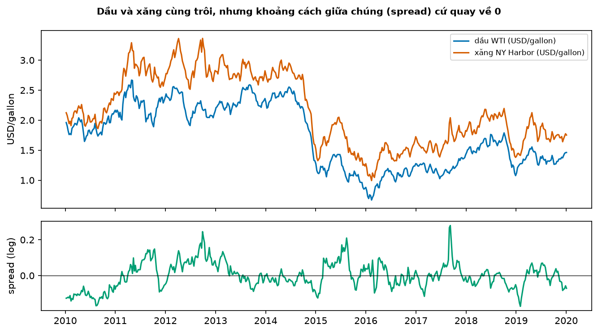
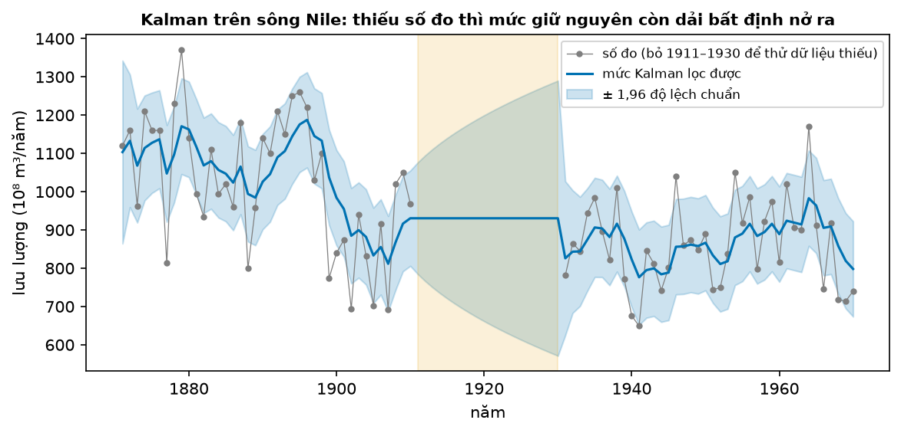
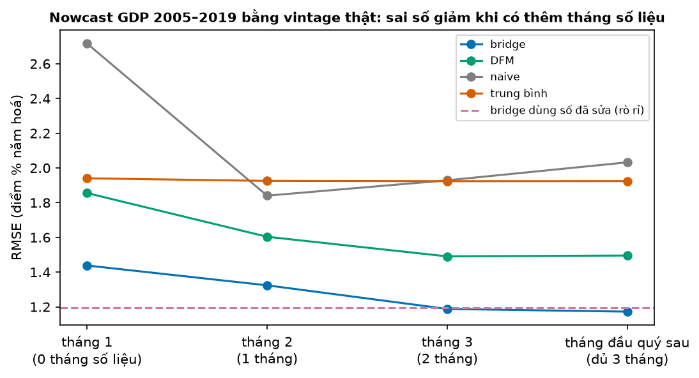
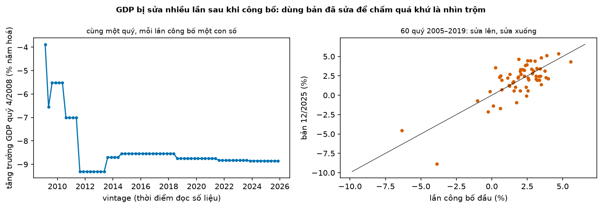

# Buổi 20 — Đa biến, state space và nowcasting

## 1. Mục tiêu

Sau buổi này bạn:

- Viết một **VAR** hai biến và nói vì sao số tham số bùng nổ khi thêm biến.
- Kiểm **cointegration** giữa giá dầu và giá xăng, dùng **VECM**, và so với VAR trên sai phân bằng backtest.
- Tự viết **bộ lọc Kalman** cho mô hình local level, khớp statsmodels, và xử lý được dữ liệu thiếu.
- Giải thích **dynamic factor model** và **nowcasting**: dự báo quý hiện tại khi số liệu tháng về dần, mỗi chuỗi dừng ở một tháng khác nhau.
- Nowcast GDP Mỹ bằng **vintage thật**, và chỉ ra vì sao dùng số liệu đã sửa là rò rỉ.

## 2. Nhắc lại buổi trước

Từ buổi 7, 10, 14, 16–18:

- **Tính dừng**: trung bình và độ dao động không đổi theo thời gian. **ADF**: p nhỏ là dừng; **KPSS**: p nhỏ là không dừng. **Sai phân** bỏ xu
  hướng; **bước ngẫu nhiên** $y_t = y_{t-1} + \varepsilon_t$ không dừng.
- **Hồi quy giả** (buổi 18): hai chuỗi cùng trôi theo thời gian cho quan hệ "có ý nghĩa" dù không liên quan.
- **State space** (buổi 16): mô hình = phương trình quan sát + phương trình cập nhật trạng thái (mức, độ dốc). **Kalman smoother** (buổi 10) đã
  dùng để điền ô thiếu.
- **AR(1)** (buổi 17): giá trị hôm nay = hệ số × giá trị hôm qua + nhiễu. **AICc**: chọn mô hình, nhỏ là tốt.
- **RMSE**, **MAE** (buổi 14); **backtest rolling origin** và **Diebold–Mariano (DM)** (buổi 15): p < 0,05 là chênh sai số có thật.
- **Rò rỉ** (buổi 13): dùng thông tin chưa có lúc ra dự báo.

## 3. Trạng thái đầu buổi

Sau `python lab.py up` (trong thư mục `lab/`):

| Hạng mục | Trạng thái |
|---|---|
| Dữ liệu 1 | `du-lieu/raw/eia-gia-dau-wti/` (`00974b186543`), `eia-gia-xang-ny-harbor/` (`1305a8b32807`) — giá dầu WTI và giá xăng New York Harbor theo ngày |
| Dữ liệu 2 | `philly-fed-gdp-thuc-vintage-thang/` (`7d8c6ab78964`), `philly-fed-viec-lam-vintage/` (`ae954f940b62`), `philly-fed-san-luong-cn-vintage/` (`b4a6324162c8`), `philly-fed-nha-khoi-cong-vintage/` (`2c7527def217`) — GDP, việc làm, sản lượng công nghiệp, nhà khởi công Mỹ theo **từng lần công bố** |
| Dữ liệu 3 | lưu lượng sông Nile 1871–1970, có sẵn trong statsmodels |
| Nguồn | U.S. EIA (public domain); Federal Reserve Bank of Philadelphia, Real-Time Data Set (chỉ cho giáo dục, nghiên cứu; không phân phối lại) |
| Môi trường | Python 3.12; pandas 2.3.3, statsmodels 0.15.0, openpyxl 3.1.5, xlrd 2.0.2 |
| `code/da_bien.py` | đọc dữ liệu; `kiem_dung`, `engle_granger`, `hang_dong_lien_ket`, `du_bao_xang`, `backtest_dau_xang`; `kalman_local_level`; `doc_tat_ca`, `nowcast`, `nowcast_dfm`, `danh_gia_nowcast` |
| `code/lab.ipynb` | notebook của Lab, bước 1–5 |
| **Đang cố tình sai** | `hang_dong_lien_ket` không kiểm gì, luôn trả 0; `nowcast` luôn đọc lần công bố mới nhất |
| **Triệu chứng** | dự báo xăng dùng VAR trên sai phân; nowcast tháng đầu quý chính xác bằng tháng cuối quý |
| `python lab.py check` lúc này | ĐỎ: 3/6 test hỏng |

Philadelphia Fed thêm một cột mỗi tháng vào tệp nguồn, nên sha256 của tệp tải về sau này sẽ khác bản chốt: `lab.py up` cảnh báo và vẫn nhận.
Code chỉ dùng các lần công bố tới 12/2025, và bộ chấm kiểm phần đó y hệt bản của tác giả.

## 4. Lý thuyết

### Từ mới trong buổi

| Thuật ngữ | Nghĩa một câu | Ví dụ |
|---|---|---|
| VAR (vector autoregression) | Nhiều chuỗi, mỗi chuỗi hồi quy theo trễ của **mọi** chuỗi. | Giá xăng tuần này theo giá dầu và giá xăng tuần trước. |
| cointegration (đồng liên kết) | Hai chuỗi không dừng nhưng một tổ hợp tuyến tính của chúng dừng. | Dầu và xăng cùng trôi; khoảng cách giữa chúng thì quay về mức cũ. |
| spread | Phần chênh giữa hai chuỗi đồng liên kết, sau khi nhân hệ số. | log xăng − 0,845 × log dầu. |
| VECM | VAR trên sai phân cộng một số hạng kéo spread về mức cân bằng. | Spread cao hơn thường → xăng giảm, dầu tăng. |
| bộ lọc Kalman | Cách ước lượng trạng thái ẩn từng bước: dự báo, rồi trộn với số đo theo độ tin cậy. | Mức thật của sông mỗi năm. |
| local level | Mô hình state space đơn giản nhất: số đo = mức + nhiễu; mức trôi ngẫu nhiên. | Lưu lượng sông Nile. |
| dynamic factor model (DFM) | Vài nhân tố ẩn chung điều khiển nhiều chuỗi quan sát. | Một nhân tố "tình hình kinh tế" đẩy việc làm, sản lượng, GDP. |
| nowcasting | Dự báo quý **hiện tại** (hoặc vừa qua) khi số chính thức chưa công bố. | Tháng 2 ước lượng GDP quý 1. |
| ragged edge | Mỗi chuỗi kết thúc ở một tháng khác nhau vì công bố lệch ngày. | Giữa tháng 4: việc làm có tới tháng 3, GDP mới tới quý 4. |
| vintage | Toàn bộ số liệu như được biết tại một ngày công bố. | Vintage 5/2024: GDP 2024Q1 công bố lần đầu. |
| bridge equation | Hồi quy GDP quý theo trung bình quý của chỉ báo tháng. | GDP = 1 + 0,8 × việc làm quý. |
| DM, SES | Kiểm định Diebold–Mariano (buổi 15); làm trơn hàm mũ đơn (buổi 16). | SES α = 0,5. |
| IRF, MIDAS | Hàm phản ứng xung (một cú sốc lan qua các biến thế nào); hồi quy dữ liệu tần suất hỗn hợp theo từng tháng. | Hộp "Nâng cao" mục 4.1, 4.5. |

### 4.1 VAR: mỗi biến nhớ quá khứ của mọi biến

**Vấn đề.** Giá xăng tuần tới phụ thuộc giá xăng tuần này, nhưng cũng phụ thuộc giá dầu. Một mô hình AR chỉ nhìn một chuỗi.

**Trực giác.** Viết một phương trình AR cho mỗi chuỗi, nhưng cho mỗi phương trình nhìn trễ của **tất cả** các chuỗi.

**Ví dụ số nhỏ — tự tính tay.** VAR(1) hai biến $x$ (dầu), $y$ (xăng):

$$
x_t = 0{,}5\,x_{t-1} + 0{,}2\,y_{t-1} + \varepsilon_{x,t}, \qquad y_t = 0{,}1\,x_{t-1} + 0{,}6\,y_{t-1} + \varepsilon_{y,t}
$$

- $\varepsilon_{x,t}, \varepsilon_{y,t}$: nhiễu của mỗi phương trình; các hệ số là số giả định cho ví dụ.

**Nói bằng lời.** Mỗi biến tuần tới = một phần của chính nó + một phần của biến kia tuần này. Tuần này $x$ = 10, $y$ = 5: dự báo
$x$ = 0,5 × 10 + 0,2 × 5 = **6**, $y$ = 0,1 × 10 + 0,6 × 5 = **4**.

**Số tham số.** $k$ biến, $p$ trễ: mỗi phương trình có $k \times p$ hệ số, có $k$ phương trình, nên $k^2 p$ hệ số: 2 biến, 2 trễ thì 2² × 2 = 8;
10 biến, 4 trễ thì 10² × 4 = 400. Dữ liệu có hạn thì VAR lớn học thuộc nhiễu; chọn $p$ bằng AICc (FPP §12.3).

**Chuỗi không dừng.** VAR cần các chuỗi dừng. Giá không dừng, nên cách thường làm là VAR trên sai phân (thay đổi mỗi tuần). Mục 4.2 cho thấy
cách đó bỏ mất một thông tin quan trọng.

> **Nâng cao — có thể bỏ qua lần đọc đầu.** Hàm phản ứng xung (IRF) cho biết một cú sốc vào dầu hôm nay lan sang xăng các tuần sau thế nào.
> Phân rã phương sai sai số dự báo cho biết bao nhiêu phần bất định của xăng đến từ dầu. Cả hai tính từ hệ số VAR (`statsmodels` `irf()`,
> `fevd()`).

**Tóm lại.** **VAR = mỗi biến hồi quy theo trễ của mọi biến. Số hệ số tăng theo bình phương số biến; VAR cần chuỗi dừng.**

**Tự kiểm tra.** Cùng VAR(1) trên và cùng điểm xuất phát, dự báo tuần thứ hai (bỏ nhiễu). Và VAR 5 biến, 3 trễ có bao nhiêu hệ số?

<details>
<summary>Đáp án</summary>

Tuần 1: 6 và 4. Tuần 2: $x$ = 0,5 × 6 + 0,2 × 4 = **3,8**; $y$ = 0,1 × 6 + 0,6 × 4 = **3,0**. VAR 5 biến, 3 trễ: 5² × 3 = **75** hệ số (chưa kể hằng
số). Nhầm hay gặp: đếm $k \times p$ = 15, quên rằng có $k$ phương trình.

</details>

### 4.2 Cointegration và VECM

**Vấn đề.** Giá dầu và giá xăng 2010–2019 đều không dừng (ADF p 0,52 và 0,48). Hồi quy chuỗi không dừng dễ thành hồi quy giả (buổi 18). Nhưng
xăng làm từ dầu: quan hệ này là thật. Làm sao phân biệt, và dùng nó để dự báo?

**Trực giác.** Một người dắt chó đi lang thang trong công viên: cả hai không đi theo đường nào cố định, nhưng dây xích không cho chúng xa nhau
quá. Khoảng cách giữa hai bên thì dừng, dù từng bên thì không.

**Ví dụ số nhỏ — tự tính tay.** Giả sử quan hệ cân bằng là xăng = 0,5 + 1,0 × dầu. Tuần này dầu 2,0, xăng 2,8:

- mức cân bằng của xăng: 0,5 + 2,0 = 2,5; **spread** = 2,8 − 2,5 = **0,3** (xăng đang cao hơn mức cân bằng);
- VECM có số hạng kéo về, hệ số −0,2: tuần tới xăng thay đổi thêm −0,2 × 0,3 = **−0,06**;
- VAR trên sai phân không có số hạng này, nên không biết xăng đang "căng dây".

**Công thức.**

$$
\Delta y_t = \alpha\,(y_{t-1} - c - \beta x_{t-1}) + \gamma_1 \Delta y_{t-1} + \gamma_2 \Delta x_{t-1} + \varepsilon_t
$$

- $\Delta y_t$: thay đổi của xăng tuần $t$; $y_{t-1} - c - \beta x_{t-1}$: spread tuần trước; $\alpha$: tốc độ kéo về (âm); $\gamma$: hệ số
  VAR trên sai phân.

**Nói bằng lời.** Thay đổi của xăng = phần kéo spread về 0 + phần theo thay đổi gần đây. Ở ví dụ: −0,2 × 0,3 = −0,06 cộng phần VAR.

**Kiểm cointegration.** **Engle–Granger**: hồi quy log xăng theo log dầu, rồi kiểm phần dư (spread) có dừng không. **Johansen**: kiểm cùng lúc
số quan hệ đồng liên kết giữa nhiều chuỗi (hạng 0 là không có).

**Dữ liệu thật.** Log giá tuần 2010–2019 (USD/gallon): hệ số của dầu là 0,845; Engle–Granger bác giả thuyết "không đồng liên kết" rất mạnh;
Johansen tìm thấy đúng một quan hệ.



**Cách đọc hình.**

1. **Trục ngang**: tuần, 2010 → 2019.
2. **Trục dọc**: ô trên, giá (USD/gallon); ô dưới, spread (log).
3. **Ký hiệu**: xanh dương là dầu (giá thùng chia 42 gallon), cam là xăng; xanh lá là spread.
4. **Nhìn vào đâu**: năm 2014–2015, khi cả hai giá sụt một nửa.
5. **Kết luận**: giá trôi rất xa, còn spread chỉ dao động quanh 0; một lệch của spread mất khoảng 9,6 tuần để còn một nửa.

Backtest 104 tuần (2018–2019), mỗi tuần một cutoff, sai số tuyệt đối trên log giá xăng (%):

| Tầm | naive | VAR trên sai phân | VECM |
|---|---|---|---|
| 1 tuần | 2,89 | 2,75 | 2,74 |
| 4 tuần | 6,78 | 6,75 | **6,44** |

**Đọc bảng.** VECM nhỉnh hơn ở tầm xa, đúng như lý thuyết: số hạng kéo về có tác dụng khi spread có thời gian quay về. Nhưng DM so với naive ở tầm 4
tuần cho p = 0,17: chưa có bằng chứng chắc chắn. Giá gần như bước ngẫu nhiên; cointegration giúp một chút, không nhiều.

**Tóm lại.** **Hai chuỗi không dừng mà spread dừng là đồng liên kết (quan hệ thật, không phải hồi quy giả). VECM thêm số hạng kéo spread về
cân bằng; VAR trên sai phân bỏ mất nó.**

**Tự kiểm tra.** Cân bằng xăng = 0,3 + 0,9 × dầu, dầu = 2,0, xăng = 1,9, hệ số kéo về −0,25. Spread bằng bao nhiêu, và số hạng kéo về đẩy xăng
lên hay xuống?

<details>
<summary>Đáp án</summary>

Cân bằng: 0,3 + 1,8 = 2,1; spread = 1,9 − 2,1 = **−0,2** (xăng thấp hơn cân bằng). Kéo về: −0,25 × (−0,2) = **+0,05**, đẩy xăng **lên**. Nhầm
hay gặp: quên dấu âm của hệ số, kết luận xăng còn giảm thêm.

</details>

### 4.3 State space và bộ lọc Kalman

**Vấn đề.** Số đo nào cũng có nhiễu. Muốn biết **mức thật** đằng sau (lưu lượng sông thật, tình hình kinh tế thật) và dự báo nó, kể cả khi có
năm không đo được.

**Trực giác.** Mỗi năm có hai nguồn tin: dự đoán từ năm trước và số đo năm nay. Tin nguồn nào hơn thì nghiêng về nguồn đó. Kalman làm đúng việc
này, và tính luôn mức tin cậy.

**Ví dụ số nhỏ — tự tính tay.** Mô hình local level: số đo = mức + nhiễu (phương sai $\sigma^2_\varepsilon = 5$); mức năm sau = mức năm nay + cú
dời (phương sai $\sigma^2_\eta = 1$). Năm trước ước lượng mức $a = 100$ với phương sai $P = 4$; năm nay đo được $y = 110$.

- **Dự báo**: mức vẫn 100, phương sai 4 + 1 = **5** (mức có thể đã dời).
- **Hệ số Kalman** $K$ = 5 / (5 + 5) = **0,5**: tin dự đoán và số đo ngang nhau.
- **Cập nhật**: mức = 100 + 0,5 × (110 − 100) = **105**; phương sai = (1 − 0,5) × 5 = **2,5** (đã bớt bất định nhờ số đo).
- Năm sau không đo được: bỏ bước cập nhật; mức giữ 105, phương sai 2,5 + 1 = 3,5.

**Công thức.**

$$
P_{t|t-1} = P_{t-1} + \sigma^2_\eta, \quad K_t = \frac{P_{t|t-1}}{P_{t|t-1} + \sigma^2_\varepsilon}, \quad a_t = a_{t-1} + K_t (y_t - a_{t-1}),
\quad P_t = (1 - K_t) P_{t|t-1}
$$

- $a_t$: mức ước lượng; $P$: phương sai của ước lượng (độ không chắc); $\sigma^2_\eta$: phương sai cú dời của mức; $\sigma^2_\varepsilon$:
  phương sai nhiễu đo; $K_t$: hệ số Kalman, từ 0 (bỏ qua số đo) tới 1 (tin hoàn toàn số đo).

**Nói bằng lời.** Mức mới = mức cũ + $K$ × (số đo − mức cũ); $K$ lớn khi dự đoán kém chắc hơn số đo. Ở ví dụ: 100 + 0,5 × 10 = 105. Đây chính
là SES (buổi 16) với α thay đổi theo độ chắc chắn.

**NumPy và thư viện.** `kalman_local_level(y, s2_nhieu, s2_muc)` trong `code/da_bien.py` làm đúng bốn dòng trên. Với phương sai ước lượng bởi
`statsmodels` `UnobservedComponents(y, "local level")` trên sông Nile (nhiễu 15.078, cú dời 1.479), mức tự viết lệch thư viện tối đa 0,024.



**Cách đọc hình.**

1. **Trục ngang**: năm, 1871 → 1970.
2. **Trục dọc**: lưu lượng (10⁸ m³ mỗi năm).
3. **Ký hiệu**: chấm xám là số đo; xanh là mức Kalman; dải xanh nhạt là mức ± 1,96 độ lệch chuẩn; vùng vàng là 20 năm đã xoá số đo.
4. **Nhìn vào đâu**: vùng vàng.
5. **Kết luận**: không có số đo thì mức đi ngang và dải nở ra (độ lệch chuẩn từ 64 lên 183); có số đo lại thì dải co về ngay.

**Khi nào dùng, khi nào không.** Kalman cho dữ liệu thiếu và khoảng không đều một cách tự nhiên: bỏ bước cập nhật. Thêm độ dốc vào trạng thái
thì thành local linear trend; thêm mùa vụ thì thành mô hình cấu trúc (buổi 27 nối sang Bayes). Không dùng khi quan hệ phi tuyến mạnh (cần bộ
lọc khác).

**Tóm lại.** **Kalman: dự báo trạng thái, rồi trộn với số đo theo hệ số $K$ = độ không chắc của dự báo ÷ tổng độ không chắc. Thiếu số đo thì
chỉ dự báo, không cập nhật.**

**Tự kiểm tra.** Mức 50, phương sai 2; cú dời phương sai 2; nhiễu đo phương sai 12. Đo được 60. Mức và phương sai mới?

<details>
<summary>Đáp án</summary>

Dự báo phương sai 2 + 2 = 4; $K$ = 4 / 16 = 0,25; mức 50 + 0,25 × 10 = **52,5**; phương sai 0,75 × 4 = **3**. Nhầm hay gặp: dùng phương sai 2
(quên cộng cú dời) nên $K$ = 2/14.

</details>

### 4.4 Dynamic factor model: vài nhân tố cho nhiều chuỗi

**Vấn đề.** Có hàng chục chỉ báo tháng (việc làm, sản lượng, bán lẻ…) và GDP theo quý. Hồi quy GDP theo tất cả thì quá nhiều hệ số; các chỉ báo
lại tương quan mạnh với nhau.

**Trực giác.** Phần lớn các chỉ báo lên xuống cùng nhau vì một thứ chung: tình hình kinh tế. Coi thứ đó là một **nhân tố ẩn** $f_t$; mỗi chỉ
báo = hệ số riêng × nhân tố + phần riêng.

**Ví dụ số nhỏ — tự tính tay.** Một nhân tố, ba chuỗi; hệ số của việc làm, sản lượng, GDP lần lượt là $1{,}5$; $0{,}8$; $2{,}0$. Tháng
này nhân tố $f = 0{,}5$:

- việc làm ≈ 1,5 × 0,5 = 0,75; sản lượng ≈ 0,8 × 0,5 = 0,4; GDP ≈ 2,0 × 0,5 = **1,0**.
- Ngược lại, biết việc làm và sản lượng thì ước lượng được $f$, rồi suy ra GDP chưa công bố. Nhân tố ẩn được ước lượng bằng Kalman (mục 4.3).

**Tần suất hỗn hợp.** GDP theo quý, chỉ báo theo tháng. Coi GDP là một chuỗi tháng chỉ quan sát được ở tháng cuối quý; các tháng khác là "ô
thiếu", và Kalman xử lý ô thiếu tự nhiên. `DynamicFactorMQ` của statsmodels làm đúng điều này.

**Khi nào dùng, khi nào không.** DFM mạnh khi có nhiều chuỗi (các ngân hàng trung ương dùng hàng chục). Buổi này chỉ có ba chỉ báo tháng có
vintage thật; mục 4.5 cho thấy DFM một nhân tố thua một hồi quy đơn giản trên bộ nhỏ này.

**Tóm lại.** **DFM: vài nhân tố ẩn chung điều khiển nhiều chuỗi; ước lượng nhân tố bằng Kalman, nên xử lý được tần suất hỗn hợp và ô thiếu.**

**Tự kiểm tra.** Hệ số của việc làm 2,0, của GDP 1,2. Tháng này việc làm (đã chuẩn hoá) là 1,0, bỏ qua phần riêng. Ước lượng nhân tố và GDP?

<details>
<summary>Đáp án</summary>

$f$ ≈ 1,0 / 2,0 = **0,5**; GDP ≈ 1,2 × 0,5 = **0,6**. Nhầm hay gặp: nhân thẳng 1,0 × 1,2 mà không chia cho hệ số của việc làm.

</details>

### 4.5 Nowcasting: dự báo quý đang diễn ra

**Vấn đề.** GDP Mỹ quý 1 được công bố lần đầu cuối tháng 4. Nhưng việc làm, sản lượng công nghiệp của tháng 1, 2, 3 đã về từ tháng 2, 3, 4.
Dùng chúng để ước lượng GDP quý 1 trước khi nó được công bố.

**Trực giác.** Giữa mỗi tháng, xếp lại bảng những gì đã biết: mỗi chuỗi dừng ở một tháng khác nhau (**ragged edge**). Tháng nào chưa có thì dự
báo tạm, rồi tính GDP từ các chỉ báo.

**Ví dụ số nhỏ — tự tính tay.** Giữa tháng 3, việc làm quý 1 đã có tháng 1 và 2: tăng 0,2% và 0,1% mỗi tháng. Tháng 3 chưa có, dự báo bằng AR(1)
hệ số 0,5 quanh trung bình 0,1%: 0,1 + 0,5 × (0,1 − 0,1) = **0,1%**. Bridge equation đã học: GDP (% năm) = 1,0 + 1,5 × việc làm quý (% năm).
Việc làm quý tăng khoảng 0,2 + 0,1 + 0,1 = 0,4% so với quý trước; **năm hoá** (nhân 4: tốc độ nếu cả năm tăng như quý này) là 1,6%, nên
GDP ≈ 1,0 + 1,5 × 1,6 = **3,4%**.

**Công thức.**

$$
g_q = a + b_1 \bar x_{1,q} + b_2 \bar x_{2,q} + e_q
$$

- $g_q$: tăng trưởng GDP quý $q$ (% năm hoá); $\bar x_{j,q}$: tăng trưởng quý của chỉ báo $j$, năm hoá (tháng thiếu được dự báo trước); $a,
  b_j$: hệ số học trên các quý đã công bố.

**Nói bằng lời.** Tăng trưởng GDP = hằng số + hệ số × tăng trưởng quý của từng chỉ báo tháng. Ở ví dụ: 1,0 + 1,5 × 1,6 = 3,4.

**Dữ liệu thật.** 60 quý 2005–2019, nowcast giữa tháng 1, 2, 3 của quý và giữa tháng đầu quý sau (đủ 3 tháng chỉ báo); chấm so với lần công bố
đầu tiên của GDP. RMSE tính bằng **điểm %**.

Điểm % là hiệu của hai tỷ lệ: GDP thật tăng 2,0%, nowcast 3,0% thì sai 1 điểm %.

| Cách | Tháng 1 | Tháng 2 | Tháng 3 | Tháng đầu quý sau |
|---|---|---|---|---|
| bridge (việc làm + sản lượng công nghiệp) | 1,44 | 1,32 | 1,19 | **1,17** |
| DFM một nhân tố | 1,86 | 1,60 | 1,49 | 1,50 |
| naive (tăng trưởng quý gần nhất đã công bố) | 2,72 | 1,84 | 1,93 | 2,03 |
| trung bình lịch sử | 1,94 | 1,93 | 1,92 | 1,92 |

**Đọc bảng.** So theo hàng: bridge giảm dần khi có thêm tháng số liệu và thắng hai baseline ở mọi thời điểm. Naive tệ nhất ở tháng 1 vì lúc đó
quý gần nhất đã công bố cách hai quý.



**Cách đọc hình.**

1. **Trục ngang**: thời điểm nowcast, từ giữa tháng đầu quý tới giữa tháng đầu quý sau.
2. **Trục dọc**: RMSE (điểm % năm hoá).
3. **Ký hiệu**: bốn đường là bốn cách ở bảng trên; vạch đứt hồng là bridge dùng số đã sửa (mục 4.6).
4. **Nhìn vào đâu**: đường xanh dương từ trái sang phải.
5. **Kết luận**: sai số bridge giảm từ 1,44 xuống 1,17; vạch hồng nằm thấp ngay từ tháng 1 vì nó đã "biết" cả quý.

**Chia theo giai đoạn.** Tách hai giai đoạn thì bức tranh khác hẳn:

| RMSE (điểm %) | Tháng 1 | Tháng đầu quý sau |
|---|---|---|
| bridge, 2005–2009 (có suy thoái) | 1,98 | 1,27 |
| trung bình lịch sử, 2005–2009 | 3,03 | 3,00 |
| bridge, 2010–2019 (êm) | 1,07 | 1,12 |
| trung bình lịch sử, 2010–2019 | **1,03** | **1,03** |

**Đọc bảng.** Lợi ích đến từ giai đoạn suy thoái. Giai đoạn êm, bridge không giảm theo tháng và thua trung bình lịch sử: nowcast có giá trị lớn
nhất đúng lúc kinh tế đổi chiều; lúc bình thường, "như mọi khi" đã khó thắng.

> **Nâng cao — có thể bỏ qua lần đọc đầu.** **MIDAS** hồi quy thẳng GDP quý theo từng tháng của chỉ báo, với trọng số các tháng theo một hàm ít
> tham số, thay vì lấy trung bình quý như bridge. Ngân hàng Anh dùng tổ hợp nhiều MIDAS (Bank of England, 2025). **News**: DFM tách thay đổi của
> nowcast giữa hai vintage thành đóng góp của từng số liệu mới (`DynamicFactorMQ` … `news()`).

**Tóm lại.** **Nowcast = dự báo quý hiện tại từ chỉ báo tháng về sớm; tháng thiếu (ragged edge) dự báo tạm rồi gộp quý. Sai số giảm khi có thêm
tháng; lợi ích lớn nhất khi kinh tế đổi chiều.**

**Tự kiểm tra.** Bridge: GDP = 0,5 + 2,0 × sản lượng quý. Giữa tháng 2, sản lượng tháng 1 tăng 0,3% (tháng); tháng 2, 3 dự báo 0,1% mỗi tháng.
Nowcast GDP (% năm hoá)?

<details>
<summary>Đáp án</summary>

Sản lượng quý ≈ (0,3 + 0,1 + 0,1) × 4 = 2,0% năm hoá; GDP = 0,5 + 2,0 × 2,0 = **4,5%**. Nhầm hay gặp: quên năm hoá (× 4) nên ra 0,5 + 1,0 = 1,5.

</details>

### 4.6 Vintage: số đã sửa là số của tương lai

**Vấn đề.** GDP không công bố một lần là xong. Nó được sửa sau 1, 2 tháng, rồi sửa lại mỗi năm khi có số liệu đầy đủ hơn. Chấm nowcast trên bảng
số liệu mới nhất thì mô hình được "thấy" số chưa tồn tại lúc nowcast.

**Trực giác.** Như chấm bài thi bằng đáp án đã chỉnh sau khi thi xong, và cho thí sinh xem trước cả đề đã chỉnh.

**Ví dụ số nhỏ — tự tính tay.** Tăng trưởng GDP quý 4/2008 (% năm hoá):

| Vintage | 2/2009 (lần đầu) | 2011–2013 | 12/2025 |
|---|---|---|---|
| Con số | −3,88 | −9,31 | −8,85 |

**Đọc bảng.** Lần công bố đầu chỉ thấy một nửa cú sụt. Một nowcast chấm theo con số 12/2025 bị so với thứ mà không ai biết vào tháng 2/2009.



**Cách đọc hình.**

1. **Trục ngang**: ô trái, thời điểm đọc số liệu (vintage); ô phải, tăng trưởng lần công bố đầu (%).
2. **Trục dọc**: ô trái, tăng trưởng quý 4/2008 theo vintage đó; ô phải, tăng trưởng cùng quý theo bản 12/2025.
3. **Ký hiệu**: ô phải mỗi chấm một quý 2005–2019; đường chéo là "không sửa gì".
4. **Nhìn vào đâu**: độ xa của các chấm khỏi đường chéo.
5. **Kết luận**: quý nào cũng bị sửa; trung bình lệch 1,50 điểm %, lớn nhất 4,97 điểm, cỡ bằng chính sai số nowcast.

**Rò rỉ trong nowcast.** Dùng bản 12/2025 cho cả chỉ báo lẫn GDP học thì ngay tháng đầu quý, bảng số liệu đã có đủ ba tháng chỉ báo: RMSE "đo
được" là 1,19 thay vì 1,44 thật. Báo cáo sẽ nói "tháng đầu đã chính xác như tháng cuối" — điều không bao giờ xảy ra khi chạy thật. Vì vậy mỗi
nowcast chỉ đọc đúng vintage của ngày nó được làm, và chấm so với lần công bố mà người dùng thật nhận được. Philadelphia Fed Real-Time Data Set
lưu mọi vintage từ năm 1965 cho việc này.

**Tóm lại.** **Số liệu kinh tế bị sửa sau khi công bố; dữ liệu đã sửa chứa thông tin tương lai. Nowcast và backtest phải đọc đúng vintage của
ngày dự báo.**

**Tự kiểm tra.** Một mô hình dự báo lạm phát được backtest trên bảng CPI tải hôm nay, báo sai số 0,3 điểm. Hỏi gì trước khi tin?

<details>
<summary>Đáp án</summary>

CPI và các biến giải thích có bị sửa sau khi công bố không? Nếu có, bảng hôm nay chứa số đã sửa — mô hình được thấy thông tin chưa có lúc dự
báo. Phải chạy lại trên vintage của từng ngày dự báo (và chấm theo số được công bố lúc đó). Nhầm hay gặp: nghĩ "số liệu quá khứ thì cố định".

</details>

## 5. Lab từng bước

Lệnh gõ trong terminal ở thư mục `lab/`. Code các bước nằm sẵn trong `code/lab.ipynb` (mở bằng `python lab.py notebook` hoặc VS Code),
chạy từng ô từ trên xuống. Bạn sửa `code/da_bien.py`; notebook tự nạp lại bản mới.

### Bước 1 — Dầu và xăng: dừng hay không

**Mục đích:** kiểm dừng và cointegration (mục 4.2).

```bash
python lab.py up           # một lần: môi trường + 6 bộ dữ liệu (khoảng 8 MB)
python lab.py check        # 3/6 test đỏ
python lab.py notebook     # chạy ô bước 1
```

**Đọc kết quả:** ADF không bác "không dừng" trên mức, bác trên sai phân; Engle–Granger p ≈ 0,0001. Nhưng `hang_dong_lien_ket` in 0 và dự báo
đi theo VAR trên sai phân. Sửa `hang_dong_lien_ket` bằng kiểm định Johansen:

```python
from statsmodels.tsa.vector_ar.vecm import select_coint_rank
return int(select_coint_rank(L, det_order=0, k_ar_diff=k_ar_diff).rank)   # số quan hệ đồng liên kết, mức 5%
```

Chạy lại: hạng 1, VECM.

### Bước 2 — Backtest VAR và VECM

**Mục đích:** so ba cách trên 104 tuần (mục 4.2). Không cần sửa.

**Đọc kết quả:** bảng như mục 4.2 và p của DM. Thấy VECM "thắng" mà p lớn thì báo là chưa có bằng chứng.

### Bước 3 — Kalman

**Mục đích:** so `kalman_local_level` với statsmodels, rồi xoá 20 năm số đo (mục 4.3). Không cần sửa.

**Đọc kết quả:** lệch tối đa khoảng 0,02; dải bất định nở ra ở đoạn thiếu như hình mục 4.3.

### Bước 4 — Nowcast GDP

**Mục đích:** xem ragged edge của một vintage, rồi nowcast 60 quý (mục 4.5–4.6). Lần đầu đọc tệp xlsx mất khoảng 15 giây.

**Đọc kết quả:** bảng RMSE bốn cột **bằng nhau** giữa các tháng: nowcast tháng 1 chính xác như tháng cuối quý — đáng ngờ. Sửa `nowcast` để đọc
`vintage_cua(q, k)` thay cho `VINTAGE_CUOI`. Chạy lại: bảng như mục 4.5.

### Bước 5 — DFM và kiểm tra

**Mục đích:** so DFM với bridge (khoảng 40 giây), rồi:

```bash
python lab.py check        # 6/6 xanh
```

**Đọc kết quả:** DFM như bảng mục 4.5. Xanh 6/6 là xong; `test_nowcast_chi_dung_vintage_luc_do` còn đỏ thì nowcast vẫn đọc vintage sau
thời điểm dự báo.

## 6. Lỗi thường gặp & cách chẩn đoán

| Triệu chứng | Nguyên nhân | Chẩn đoán | Sửa |
|---|---|---|---|
| VAR trên mức giá cho hệ số "ý nghĩa" mọi chỗ | chuỗi không dừng, hồi quy giả | ADF/KPSS từng chuỗi | kiểm cointegration; VECM hoặc VAR trên sai phân |
| VAR trên sai phân dự báo tầm xa kém | bỏ số hạng kéo về | Engle–Granger, Johansen | VECM |
| VAR lớn dự báo tệ hơn AR | quá nhiều hệ số ($k^2 p$) | đếm hệ số so với số quan sát | ít biến, ít trễ, chọn bằng AICc |
| Kalman tự viết lệch thư viện ở vài điểm đầu | khởi tạo khác | so $P_0$ | $P_0$ lớn (10⁶) như "approximate diffuse" |
| Kalman ra NaN khi thiếu số đo | cập nhật bằng NaN | tìm NaN trong $y$ | bỏ bước cập nhật khi thiếu |
| Nowcast tháng đầu tốt như tháng cuối | đọc số liệu đã sửa / vintage mới nhất | in vintage dùng cho từng nowcast | đọc vintage của ngày nowcast |
| Nowcast tệ quanh 2021–2022 | quan hệ chỉ báo–GDP gãy sau COVID | sai số theo quý | bỏ giai đoạn đó khi học, báo riêng khi chấm |
| sha256 tệp Philadelphia Fed khác bản chốt | nguồn đã thêm vintage mới | cảnh báo của `lab.py up` | bình thường; bộ chấm kiểm phần tới 12/2025 |

## 7. Bài tập về nhà

1. **Chọn p.** Dùng `select_order` của statsmodels cho VAR trên sai phân dầu–xăng. AICc chọn bao nhiêu trễ? Backtest lại với p đó.
2. **Thêm chỉ báo.** Thêm nhà khởi công (`"hs"`) vào bridge. RMSE theo tháng đổi thế nào? Vì sao thêm chỉ báo không luôn tốt hơn?
3. **Chấm theo bản cuối.** Chấm cùng các nowcast so với bản 12/2025 thay vì lần công bố đầu. RMSE đổi thế nào, và nên chấm theo bản nào?

## 8. Tiêu chí "Xong khi"

- [ ] `python lab.py check` xanh 6/6.
- [ ] Nói được vì sao dầu và xăng là đồng liên kết, và VECM khác VAR trên sai phân ở đâu.
- [ ] Tính tay một bước Kalman (dự báo, $K$, cập nhật) và một bước khi thiếu số đo.
- [ ] Nowcast GDP bằng vintage thật: bảng sai số giảm theo tháng, có baseline.
- [ ] Giải thích bằng số của buổi vì sao dùng số liệu đã sửa là rò rỉ.

## 9. Đọc thêm

- Hyndman, R.J. & Athanasopoulos, G. *FPP3* §12.3 Vector autoregressions: https://otexts.com/fpp3/VAR.html
- Durbin, J. & Koopman, S.J. (2012). *Time Series Analysis by State Space Methods*, 2nd ed. Oxford.
- Croushore, D. & Stark, T. (2001). A real-time data set for macroeconomists. *Journal of Econometrics* 105.
- Philadelphia Fed, Real-Time Data Set for Macroeconomists: https://www.philadelphiafed.org/surveys-and-data/real-time-data-research
- Bank of England (2025). Nowcasting GDP at the Bank of England: a staggered-combination MIDAS approach. Macro Technical Paper No. 2.
- statsmodels: `VAR`, `VECM`, `UnobservedComponents`, `DynamicFactorMQ` — https://www.statsmodels.org/stable/
