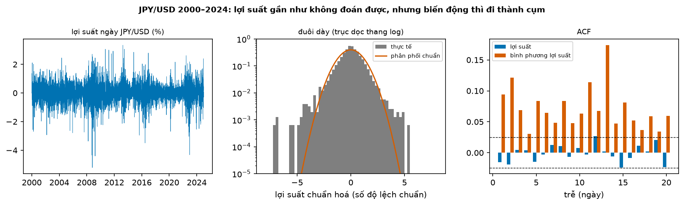
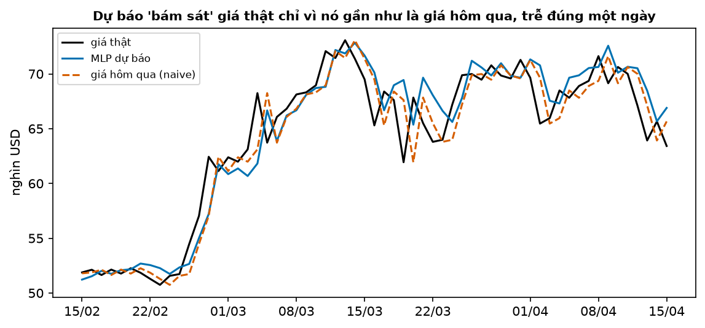
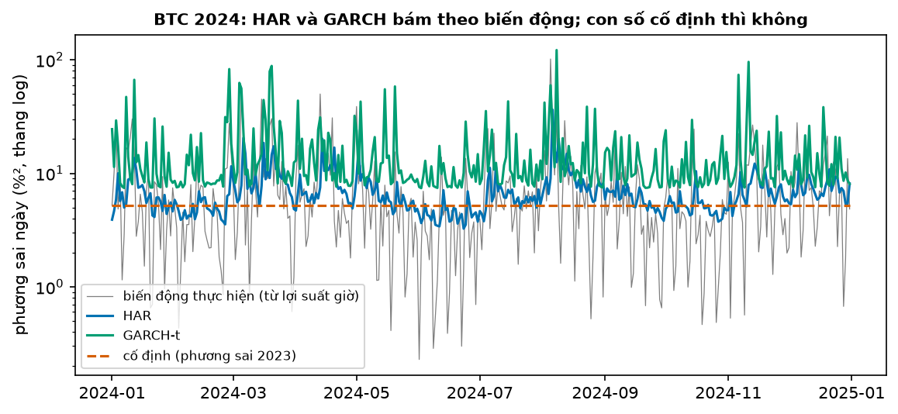
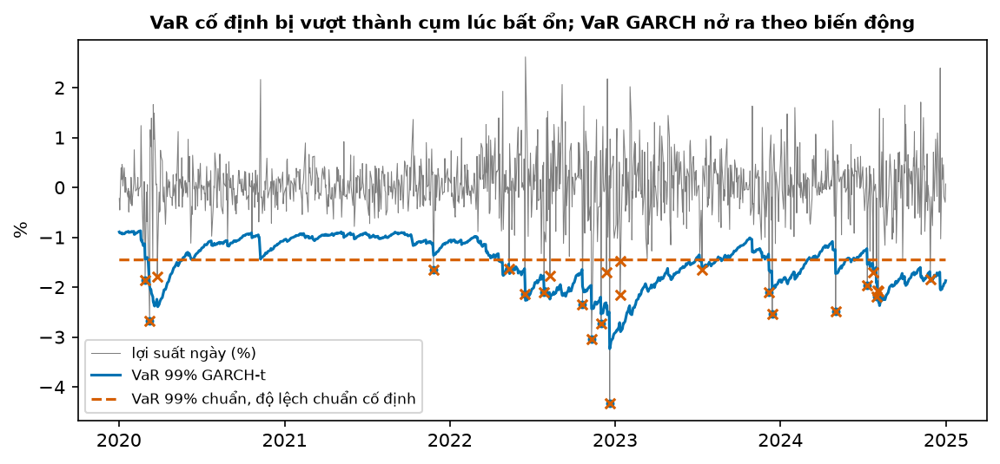

# Buổi 21 — Chuỗi tài chính và biến động

## 1. Mục tiêu

Sau buổi này bạn:

- Giải thích vì sao mô hình hoá **lợi suất** chứ không phải giá, và vì sao giá gần như không dự báo được.
- Kiểm các **sự thật cách điệu** của lợi suất bằng số: đuôi dày, cụm biến động.
- Mổ xẻ một demo "mạng nơ-ron đoán giá chính xác 99%" và chỉ ra nó thua cả "giá hôm qua".
- Dự báo **biến động** bằng GARCH và HAR, chấm đúng cách, thắng biến động lịch sử cố định.
- Tính **VaR** 99% và backtest bằng kiểm định Kupiec.
- Hoàn thành **cột mốc M2**: bậc thang mô hình thống kê trên backtest chuẩn, chọn chỉ số theo quyết định.

## 2. Nhắc lại buổi trước

Từ các buổi trước:

- **Phân phối chuẩn**: hình chuông; khoảng 99% giá trị cách trung bình không quá 2,33 độ lệch chuẩn về phía dưới. **Quantile** mức $p$: giá trị
  mà $p$ phần số lần nhỏ hơn hoặc bằng nó.
- **Bước ngẫu nhiên**: $y_t = y_{t-1} + \varepsilon_t$; dự báo tốt nhất là giá trị cuối (naive). **ACF**: vạch ngoài $\pm 1{,}96/\sqrt n$ là tự
  tương quan đáng kể.
- **Rò rỉ** (buổi 13): chuẩn hoá bằng thống kê của cả chuỗi là để thông tin tương lai lọt vào quá khứ. **Chia ngẫu nhiên** (buổi 15) cho mô hình
  thấy hàng xóm tương lai.
- **R²**: phần dao động của $y$ mà mô hình giải thích được. **MAE**, **DM** (buổi 14–15): p < 0,05 là chênh sai số có thật.
- **Kiểm định**: p nhỏ là bác giả thuyết. Thống kê **chi-bình-phương** một bậc tự do vượt 3,84 thì p < 0,05.

## 3. Trạng thái đầu buổi

Sau `python lab.py up` (trong thư mục `lab/`):

| Hạng mục | Trạng thái |
|---|---|
| Dữ liệu 1 | `du-lieu/raw/binance-btcusdt-1h-2023-01/` … `2024-12/` — 24 tệp giá BTC/USDT mỗi giờ, 17.543 giờ; sha256 từng tệp khớp tệp `.CHECKSUM` của Binance |
| Dữ liệu 2 | `frb-h10-ty-gia/` (`3464a2ae7db9`) — tỷ giá theo ngày 2000–2024; dùng số yên cho 1 USD (JPY/USD), 6.268 ngày |
| Nguồn | Binance Public Data (không có giấy phép dữ liệu; tự tải, không phân phối lại); Federal Reserve Board H.10 (public domain) |
| Môi trường | Python 3.12; pandas 2.3.3, statsmodels 0.15.0, arch 8.0.0, scikit-learn 1.9.1 |
| `code/tai_chinh.py` | đọc dữ liệu, `loi_suat`, `su_that_cach_dieu`; `du_bao_gia`, `danh_gia_gia`; `du_bao_garch`, `du_bao_har`, `qlike`; `var_99`, `kupiec`; `markov_2_trang_thai` |
| `code/lab.ipynb` | notebook của Lab, bước 1–5 |
| **Đang cố tình sai** | `du_bao_gia` chuẩn hoá bằng cả chuỗi và chia ngẫu nhiên; `danh_gia_gia` chỉ báo R²; `var_99` dùng phân phối chuẩn với độ lệch chuẩn cố định |
| **Triệu chứng** | "R² 0,988 — mô hình đoán giá chính xác 99%"; VaR bị vượt 25 lần trong 1.249 ngày thay vì khoảng 12 |
| `python lab.py check` lúc này | ĐỎ: 3/7 test hỏng |

## 4. Lý thuyết

### Từ mới trong buổi

| Thuật ngữ | Nghĩa một câu | Ví dụ |
|---|---|---|
| lợi suất log | 100 × (log giá hôm nay − log giá hôm trước), gần bằng % thay đổi. | 100 → 102: 1,98%. |
| thị trường hiệu quả | Giá đã phản ánh thông tin có sẵn, nên thay đổi ngày mai gần như không đoán được từ quá khứ. | Ai biết chắc giá mai tăng thì đã mua hôm nay. |
| biến động (volatility) | Độ lệch chuẩn của lợi suất trong một kỳ: sóng to hay nhỏ, không nói lên hay xuống. | 2,5% mỗi ngày. |
| sự thật cách điệu (stylized facts) | Các đặc điểm lặp lại ở hầu hết chuỗi tài chính. | Đuôi dày, cụm biến động. |
| đuôi dày | Ngày biến động cực lớn xảy ra thường hơn nhiều so với phân phối chuẩn. | Ngày lệch quá 4 độ lệch chuẩn: 0,5% số ngày thay vì 0,006%. |
| GARCH | Mô hình phương sai ngày mai theo cú sốc hôm nay và phương sai hôm nay. | Hôm nay sóng to thì mai dự báo sóng to. |
| biến động thực hiện (RV) | Tổng bình phương lợi suất trong ngày tính từ dữ liệu dày hơn (theo giờ). | 24 lợi suất giờ → một RV ngày. |
| HAR | Hồi quy RV ngày mai theo RV hôm qua, trung bình tuần, trung bình tháng. | RV mai = 2,4 + 0,23 × RV hôm qua + … |
| QLIKE | Hàm mất mát để chấm dự báo phương sai; nhỏ là tốt, ít bị vài ngày cực lớn chi phối hơn MSE. | Dự báo đúng thì QLIKE = 0. |
| VaR 99% | Mức lỗ một ngày mà 99% số ngày không tệ hơn. | VaR −2,3%: 1 ngày trên 100 lỗ hơn 2,3%. |
| ES (expected shortfall) | Lỗ trung bình trong những ngày tệ hơn VaR. | Lỗ trung bình của 1% ngày xấu nhất. |
| Kupiec | Kiểm định: số ngày lỗ vượt VaR có khớp tỷ lệ hứa (1%) không. | 25 lần trong 1.249 ngày: p 0,002, VaR sai. |
| MLP, LSTM, MSE | Mạng nơ-ron nhiều lớp; mạng nơ-ron hồi quy cho chuỗi (buổi 29–30 học kỹ); trung bình bình phương sai số (buổi 14). | MLP 2 lớp, 64 nút mỗi lớp. |
| BTC, JPY | Bitcoin (BTC/USDT: giá bitcoin tính bằng USDT, xấp xỉ USD); yên Nhật (JPY/USD: số yên cho 1 USD). | 1 USD = 150 JPY. |
| GJR, LR, DM | GJR-GARCH (mục 4.4); tỷ số hợp lý, thống kê của kiểm định Kupiec (mục 4.6); kiểm định Diebold–Mariano (buổi 15). | — |

### 4.1 Lợi suất thay cho giá; vì sao giá gần như không dự báo được

**Vấn đề.** Giá BTC năm 2024 đi từ 44 nghìn lên 94 nghìn USD. Dự báo giá ngày mai có ích không, và nên dự báo cái gì?

**Trực giác.** Nếu ai cũng thấy chắc chắn giá mai sẽ tăng, họ mua ngay hôm nay, và giá tăng ngay hôm nay. Vì vậy thay đổi ngày mai gần như không
đoán được từ những gì đã biết (**thị trường hiệu quả**). Giá gần như một bước ngẫu nhiên: dự báo tốt nhất cho giá mai là giá hôm nay.

**Ví dụ số nhỏ — tự tính tay.** Giá 100 → 102 → 99:

- lợi suất log ngày 2: $100 \times \ln(102/100) = 1{,}98\%$; ngày 3: $100 \times \ln(99/102) = -2{,}99\%$;
- cộng hai ngày ra $-1{,}01\% = 100 \times \ln(99/100)$: lợi suất log cộng được qua nhiều ngày.

**Công thức.**

$$
r_t = 100 \times \left(\ln P_t - \ln P_{t-1}\right)
$$

- $P_t$: giá ngày $t$; $r_t$: lợi suất log (%).

**Nói bằng lời.** Lợi suất = 100 × chênh log giá, gần bằng phần trăm thay đổi. Ở ví dụ: 100 × (ln 102 − ln 100) = 1,98.

Lợi suất không phụ thuộc mức giá (1% ở giá 40 nghìn hay 90 nghìn là như nhau) và gần như dừng, nên mô hình hoá được. Giá thì không dừng.

**Tóm lại.** **Mô hình hoá lợi suất, không phải giá. Thay đổi giá ngày mai gần như không đoán được; dự báo giá tốt nhất thường là giá hôm nay.**

**Tự kiểm tra.** Giá 50 → 55 → 50. Tính hai lợi suất log và tổng của chúng. Lợi suất phần trăm thường thì sao?

<details>
<summary>Đáp án</summary>

$100 \times \ln(55/50) = 9{,}53\%$ và $100 \times \ln(50/55) = -9{,}53\%$; tổng **0**, đúng vì giá quay về 50. Phần trăm thường: $+10\%$
rồi $-9{,}09\%$, cộng ra $+0{,}91\%$ dù giá không đổi. Nhầm hay gặp: cộng phần trăm thường qua nhiều ngày.

</details>

### 4.2 Sự thật cách điệu: đuôi dày, cụm biến động

**Vấn đề.** Nếu lợi suất không đoán được, còn gì để dự báo? Còn **độ lớn** của sóng.

**Trực giác.** Biển có ngày lặng, có tuần bão. Không biết con sóng tới đẩy tàu sang trái hay phải, nhưng biết tuần bão thì sóng to. Thị trường
cũng vậy: ngày dao động mạnh thường theo sau ngày dao động mạnh (**cụm biến động**).

**Ví dụ số nhỏ — tự tính tay.** Bảy ngày lợi suất (%): $0{,}2;\ -0{,}3;\ 2{,}5;\ -2{,}0;\ 1{,}8;\ 0{,}1;\ -0{,}2$.

- Dấu: +, −, +, −, +, +, −: không có nhịp nào, ngày mai lên hay xuống vẫn là may rủi.
- Độ lớn: $0{,}2;\ 0{,}3;\ \mathbf{2{,}5;\ 2{,}0;\ 1{,}8};\ 0{,}1;\ 0{,}2$: ba ngày lớn đứng liền nhau. Bình phương lợi suất hôm nay lớn thì hôm sau thường lớn.



**Cách đọc hình.**

1. **Trục ngang**: ô trái, năm; ô giữa, lợi suất chuẩn hoá (số độ lệch chuẩn); ô phải, trễ (ngày).
2. **Trục dọc**: ô trái, lợi suất ngày (%); ô giữa, mật độ (thang log); ô phải, ACF.
3. **Ký hiệu**: ô giữa, cột xám là thực tế, đường cam là phân phối chuẩn; ô phải, xanh là ACF của lợi suất, cam là ACF của bình phương lợi suất,
   vạch đứt là $\pm 1{,}96/\sqrt n$.
4. **Nhìn vào đâu**: hai đuôi ở ô giữa; cột cam so với cột xanh ở ô phải.
5. **Kết luận**: đuôi thực tế cao hơn đường chuẩn hàng chục lần; ACF lợi suất nằm trong vạch đứt, ACF bình phương vượt ra ở mọi trễ.

| Lợi suất ngày | BTC 2023–2024 | JPY/USD 2000–2024 |
|---|---|---|
| độ lệch chuẩn (%) | 2,53 | 0,62 |
| ACF trễ 1 của lợi suất | −0,03 | −0,02 |
| ACF trễ 1 của bình phương | 0,11 | 0,09 |
| tỷ lệ ngày lệch quá 4 độ lệch chuẩn (chuẩn: 0,006%) | 0,14% | 0,51% |

**Đọc bảng.** Hai tài sản rất khác nhau nhưng cùng một mẫu: lợi suất gần như không tự tương quan, bình phương thì có; ngày cực đoan gặp nhiều hơn
phân phối chuẩn từ 20 tới gần 100 lần.

**Tóm lại.** **Lợi suất gần như không đoán được, nhưng độ lớn của nó đi thành cụm; đuôi dày hơn phân phối chuẩn nhiều. Dự báo được là biến động,
không phải hướng.**

**Tự kiểm tra.** ACF trễ 1 của lợi suất là 0,01, của lợi suất bình phương là 0,20. Nói gì về khả năng dự báo hướng và độ lớn?

<details>
<summary>Đáp án</summary>

Hướng: gần như không dự báo được (0,01 ≈ 0). Độ lớn: dự báo được một phần (0,20: ngày sóng to kéo theo ngày sóng to). Nhầm hay gặp: nghĩ
"không tự tương quan" nghĩa là các ngày độc lập hoàn toàn; bình phương vẫn phụ thuộc nhau.

</details>

### 4.3 Mổ xẻ demo "đoán giá chính xác 99%"

**Vấn đề.** Trên mạng có nhiều bài "mạng nơ-ron LSTM dự báo giá cổ phiếu, chính xác 99%", kèm hình hai đường gần trùng nhau. Tin được không?

**Trực giác.** Giá hôm nay đã rất gần giá mai. Một mô hình chỉ cần "lặp lại giá hôm qua" là hai đường đã gần trùng, và R² trên giá gần 1.

**Ví dụ số nhỏ — tự tính tay.** R² ≈ 1 − (phương sai sai số) ÷ (phương sai giá). Năm 2024, giá BTC có độ lệch chuẩn 14,7 nghìn USD; sai số của
"giá hôm qua" có độ lệch chuẩn 1,84 nghìn. R² ≈ 1 − (1,84 / 14,7)² = 1 − 0,016 = **0,984**. Con số gần 1 đến từ việc giá nằm ở nhiều mức khác
nhau trong năm, không đến từ khả năng dự báo.

**Dữ liệu thật.** Mạng nơ-ron MLP (thay cho LSTM, hiện tượng giống hệt), nhìn 10 ngày giá BTC để đoán giá ngày mai:

| Cách làm và chấm | R² mô hình | R² naive | MAE mô hình (USD) | MAE naive (USD) |
|---|---|---|---|---|
| demo: chuẩn hoá bằng cả chuỗi, chia ngẫu nhiên 80/20 | **0,988** | 0,996 | 1.649 | 887 |
| trung thực: học 2023, chấm 366 ngày 2024 | 0,978 | 0,984 | 1.662 | 1.318 |

**Đọc bảng.** So cột mô hình với cột naive trên cùng dòng: ở cả hai cách, "giá hôm qua" thắng. Bản trung thực: DM p = 5·10⁻¹⁰ (naive tốt hơn có
ý nghĩa); mô hình đoán đúng chiều lên/xuống 52,5% số ngày, như tung đồng xu. Bài demo chỉ in cột thứ nhất.



**Cách đọc hình.**

1. **Trục ngang**: ngày, 15/2 → 15/4/2024.
2. **Trục dọc**: giá BTC (nghìn USD).
3. **Ký hiệu**: đen là giá thật, xanh là MLP, cam đứt là giá hôm qua.
4. **Nhìn vào đâu**: mỗi đỉnh của đường đen.
5. **Kết luận**: đường xanh và đường cam cùng tới đỉnh **sau** đường đen một ngày: mô hình chỉ lặp lại giá hôm qua.

**Ba lỗi của demo.** Chuẩn hoá bằng min, max của cả chuỗi và chia ngẫu nhiên là hai kiểu rò rỉ (buổi 13, 15). Lỗi lớn nhất là không có dòng
naive: R² trên giá không phân biệt nổi mô hình giỏi với mô hình chỉ lặp lại hôm qua. Chấm trên lợi suất, hoặc luôn so với naive bằng DM.

**Tóm lại.** **R² gần 1 trên giá là mặc nhiên; demo "đoán giá 99%" thường là naive ngụy trang, trễ đúng một ngày. Luôn so với giá hôm qua trên
cùng các ngày, theo thời gian, có kiểm định.**

**Tự kiểm tra.** Giá một cổ phiếu trong năm có độ lệch chuẩn 20; dự báo "giá hôm qua" sai trung bình cỡ 1 (độ lệch chuẩn). R² của naive xấp xỉ
bao nhiêu? Một mô hình báo R² 0,995 có tốt hơn không?

<details>
<summary>Đáp án</summary>

R² ≈ 1 − (1/20)² = **0,9975**. Mô hình R² 0,995 thì **kém hơn** naive (sai số lớn hơn). Nhầm hay gặp: thấy 0,995 gần 1 là khen, không tính
R² của naive.

</details>

### 4.4 GARCH: dự báo biến động ngày mai

**Vấn đề.** Biến động đi thành cụm (mục 4.2). Mô hình nào dùng điều đó để dự báo biến động ngày mai?

**Trực giác.** Phương sai ngày mai = một mức nền nhỏ + một phần cú sốc hôm nay + phần lớn phương sai hôm nay. Sóng to hôm nay thì mai dự báo sóng
to hơn; lặng lâu thì dần về mức nền.

**Ví dụ số nhỏ — tự tính tay.** $\omega = 0{,}02$, $\alpha = 0{,}05$, $\beta = 0{,}90$. Phương sai hôm nay $\sigma^2_t = 1$ (độ lệch chuẩn 1%),
hôm nay lợi suất lệch trung bình $\varepsilon_t = -3$ (cú sốc lớn):

- phương sai mai = 0,02 + 0,05 × 3² + 0,90 × 1,0 = **1,37**; độ lệch chuẩn √1,37 ≈ **1,17%**;
- không có cú sốc nào nữa thì dần về mức dài hạn $\omega / (1 - \alpha - \beta)$: 0,02 / 0,05 = 0,4 (độ lệch chuẩn √0,4 = 0,63%).

**Công thức.**

$$
\sigma^2_{t+1} = \omega + \alpha\,\varepsilon_t^2 + \beta\,\sigma^2_t
$$

- $\sigma^2_{t+1}$: phương sai dự báo cho ngày mai; $\varepsilon_t$: lợi suất hôm nay trừ trung bình (cú sốc); $\omega > 0$; $\alpha, \beta \ge 0$,
  $\alpha + \beta < 1$.

**Nói bằng lời.** Phương sai mai = nền + $\alpha$ × bình phương cú sốc + $\beta$ × phương sai hôm nay. Ở ví dụ: 0,02 + 0,45 + 0,90 = 1,37.

**Hai biến thể.** Đuôi dày (mục 4.2) nên cú sốc thường được coi theo **phân phối Student-t** thay vì chuẩn: đuôi dày hơn, có tham số bậc tự do
$\nu$ (nhỏ là đuôi dày; rất lớn là gần chuẩn). **GJR-GARCH** thêm một số hạng cho ngày giảm: với cổ phiếu, ngày giảm làm biến động tăng mạnh hơn
ngày tăng (hiệu ứng đòn bẩy).

**Thư viện.** `arch_model(r, vol="GARCH", p=1, q=1, dist="t")` của gói `arch`. Trên JPY/USD 2000–2019: $\alpha = 0{,}036$, $\beta = 0{,}958$
(cụm biến động kéo dài), $\nu = 5{,}8$ (đuôi dày). Số hạng GJR gần 0: tỷ giá không có hiệu ứng đòn bẩy.

**Tóm lại.** **GARCH dự báo phương sai từ cú sốc và phương sai hôm nay, nên theo được cụm biến động và quay dần về mức dài hạn. Chọn cú sốc
Student-t khi đuôi dày.**

**Tự kiểm tra.** $\omega = 0{,}01$, $\alpha = 0{,}1$, $\beta = 0{,}85$, $\sigma^2_t = 0{,}5$, $\varepsilon_t = 2$. Phương sai mai và mức dài hạn?

<details>
<summary>Đáp án</summary>

0,01 + 0,1 × 4 + 0,85 × 0,5 = **0,835**. Dài hạn 0,01 / (1 − 0,95) = **0,2**. Nhầm hay gặp: cộng $\alpha \times 2$ thay vì $\alpha \times 2^2$.

</details>

### 4.5 Biến động thực hiện và HAR

**Vấn đề.** Muốn chấm một dự báo biến động thì phải biết biến động **thật** của ngày đó. Bình phương lợi suất ngày là số đo rất nhiễu: ngày lên
xuống dữ dội nhưng đóng cửa gần giá mở vẫn cho bình phương gần 0.

**Trực giác.** Dùng dữ liệu dày hơn: cộng bình phương lợi suất từng giờ trong ngày. Ngày giằng co mạnh có tổng lớn dù cuối ngày về chỗ cũ.

**Ví dụ số nhỏ — tự tính tay.** Bốn khoảng trong một ngày có lợi suất $(0{,}5;\ -1{,}0;\ 0{,}8;\ -0{,}3)$ (%):

- lợi suất cả ngày = 0,5 − 1,0 + 0,8 − 0,3 = **0**: bình phương 0, như thể ngày lặng;
- **RV** = 0,25 + 1,0 + 0,64 + 0,09 = **1,98**: ngày thật ra khá sóng gió.

**HAR** (Corsi 2009): RV mai = hằng số + $b_1$ × RV hôm qua + $b_2$ × RV trung bình tuần + $b_3$ × RV trung bình tháng; ba tầm cho ba loại người
giao dịch (ngắn, vừa, dài). Hệ số học trên BTC tới cuối 2024: 2,43; 0,23; 0,26; 0,13. RV hôm qua 10, tuần 8, tháng 6: 2,43 + 2,3 + 2,08 + 0,78 = **7,59**.



**Cách đọc hình.**

1. **Trục ngang**: ngày năm 2024.
2. **Trục dọc**: phương sai ngày (%², thang log).
3. **Ký hiệu**: xám là RV tính từ lợi suất giờ; xanh dương là HAR, xanh lá là GARCH-t, cam đứt là phương sai cố định của năm 2023.
4. **Nhìn vào đâu**: tháng 3 và tháng 8, khi xám vọt lên.
5. **Kết luận**: HAR và GARCH đi lên theo cụm biến động, trễ vài ngày; đường cam đứng yên.

**Chấm dự báo phương sai.** MSE bị vài ngày cực lớn chi phối. QLIKE là trung bình của $h/\hat h - \ln(h/\hat h) - 1$, với $h$ là RV thật
và $\hat h$ là dự báo; nó bằng 0 khi dự báo đúng. Patton (2011) chứng minh cả hai xếp hạng đúng khi dùng RV thay cho biến động thật. BTC cả năm
2024, học lại mỗi ngày:

| Cách | QLIKE | MSE |
|---|---|---|
| HAR | **0,389** | **72** |
| GJR-t | 0,439 | 190 |
| GARCH-t | 0,477 | 195 |
| phương sai cố định (2023) | 0,530 | 84 |
| RV hôm qua | 0,765 | 111 |

**Đọc bảng.** Theo QLIKE: HAR tốt nhất, GARCH thắng con số cố định. Theo MSE, GARCH thua con số cố định: vài ngày GARCH dự báo quá cao sau cú
sốc làm bình phương sai số vọt lên. Hai thước đo không đồng ý thì báo cả hai và nói vì sao; ở đây QLIKE ổn định hơn.

**Tóm lại.** **RV = tổng bình phương lợi suất trong ngày, số đo biến động thật tốt hơn bình phương lợi suất ngày. HAR hồi quy RV theo ba tầm và
thường thắng GARCH; chấm dự báo phương sai bằng QLIKE (kèm MSE).**

**Tự kiểm tra.** Sáu khoảng trong ngày có lợi suất 1; −1; 1; −1; 1; −1 (%). Lợi suất cả ngày, bình phương của nó, và RV?

<details>
<summary>Đáp án</summary>

Lợi suất ngày 0, bình phương 0; RV = 6 × 1 = **6**. Nhầm hay gặp: kết luận ngày lặng vì đóng cửa bằng giá mở.

</details>

### 4.6 Value at Risk và backtest Kupiec

**Vấn đề.** Ngân hàng giữ một khoản USD tính bằng yên. Ngày tệ, lỗ bao nhiêu? Con số rủi ro đó có đáng tin không?

**Trực giác.** VaR 99% là "mức lỗ mà 99 trên 100 ngày không tệ hơn". Một VaR tốt bị vượt đúng khoảng 1% số ngày: ít hơn nhiều là quá thận trọng
(giữ vốn thừa), nhiều hơn là đánh giá thấp rủi ro.

**Ví dụ số nhỏ — tự tính tay.** Trung bình 0, độ lệch chuẩn dự báo cho mai 1%:

- phân phối chuẩn: quantile 1% là −2,33 độ lệch chuẩn → **VaR = −2,33%**;
- Student-t với $\nu$ = 5,8: quantile 1% là −3,18, nhưng phân phối này có độ lệch chuẩn lớn hơn 1; nhân $\sqrt{(\nu - 2)/\nu} \approx 0{,}81$ để đưa
  về độ lệch chuẩn 1: −3,18 × 0,81 ≈ **−2,57%** — đuôi dày làm VaR xa hơn;
- 250 ngày mà bị vượt 6 lần: tỷ lệ 6 / 250 = 2,4%, hơn gấp đôi 1%; nhưng Kupiec cho LR = 3,56, dưới ngưỡng 3,84: chưa bác được. 250 ngày
  quá ít để phân xử.

**Công thức.**

$$
\text{VaR}_{t+1} = \mu + q_{0{,}01}\,\sigma_{t+1}, \qquad
\text{LR} = -2\Big[(n - x)\ln(1 - p) + x \ln p - (n - x)\ln(1 - \hat p) - x \ln \hat p\Big]
$$

- $\sigma_{t+1}$: độ lệch chuẩn dự báo (GARCH); $q_{0,01}$: quantile 1% của phân phối cú sốc; $n$: số ngày; $x$: số ngày lỗ vượt VaR; $p$ = 0,01;
  $\hat p = x/n$. LR so với chi-bình-phương 1 bậc tự do.

**Nói bằng lời.** VaR = trung bình + quantile 1% × độ lệch chuẩn dự báo. Kupiec so tỷ lệ vượt thực tế $x/n$ với 1%: ở ví dụ 6/250 = 2,4%, LR
3,56, p 0,06.

**Dữ liệu thật.** JPY/USD, học 2000–2019, chấm 2020–2024; kỳ vọng số lần vượt là 1.249 × 0,01 = 12,5:

| VaR 99% | Số lần vượt | Kupiec p |
|---|---|---|
| chuẩn, độ lệch chuẩn cố định | 25 | 0,002 |
| GARCH, cú sốc chuẩn | 23 | 0,007 |
| GARCH, cú sốc Student-t | **14** | **0,67** |

**Đọc bảng.** Chỉ dòng cuối qua Kupiec. Dòng đầu sai vì bỏ qua cụm biến động; dòng giữa theo được cụm nhưng đuôi chuẩn quá mỏng.



**Cách đọc hình.**

1. **Trục ngang**: năm, 2020 → 2024.
2. **Trục dọc**: lợi suất ngày (%).
3. **Ký hiệu**: xám là lợi suất; xanh là VaR GARCH-t, cam đứt là VaR cố định; chấm xanh và dấu × cam là các ngày vượt VaR tương ứng.
4. **Nhìn vào đâu**: năm 2022, khi tỷ giá yên dao động mạnh nhất.
5. **Kết luận**: dấu × cam dồn thành cụm năm 2022; đường xanh hạ xuống đúng lúc đó nên bị vượt ít hơn nhiều.

**ES.** VaR không nói lỗ **bao nhiêu** trong những ngày xấu nhất; ES là lỗ trung bình của những ngày đó. Với phân phối chuẩn, ES 99% nằm ở
−2,67 độ lệch chuẩn, xa hơn VaR ở −2,33; đuôi dày thì khoảng cách còn lớn hơn.

> **Nâng cao — có thể bỏ qua lần đọc đầu.** **Markov switching** giả định thị trường ở một trong hai trạng thái (bình thường, bất ổn), mỗi
> trạng thái một phương sai, và chuyển qua lại với xác suất cố định. Trên JPY/USD, xác suất trạng thái bất ổn trung bình năm lên 0,81 và 0,83
> năm 2008, 2009, và 0,62 năm 2022 (hình `hinh/markov.png`, ô bước 5 của Lab).

**Tóm lại.** **VaR 99% = trung bình + quantile 1% × độ lệch chuẩn dự báo; phải theo cụm biến động (GARCH) và đuôi dày (Student-t). Backtest bằng
Kupiec: tỷ lệ vượt phải khớp 1%.**

**Tự kiểm tra.** Một nghìn ngày, VaR 99% bị vượt 20 lần. Tỷ lệ vượt và kết luận? Nếu không bị vượt lần nào thì sao?

<details>
<summary>Đáp án</summary>

Tỷ lệ 20 / 1.000 = 2%, gấp đôi 1%: Kupiec LR ≈ 7,8 trên ngưỡng 3,84, VaR **đánh giá thấp** rủi ro. Không bị vượt lần nào: VaR **quá
thận trọng** (giữ vốn thừa), Kupiec cũng bác (LR ≈ 20). Nhầm hay gặp: nghĩ càng ít lần vượt càng tốt.

</details>

## 5. Lab từng bước

Lệnh gõ trong terminal ở thư mục `lab/`. Code các bước nằm sẵn trong `code/lab.ipynb` (mở bằng `python lab.py notebook` hoặc VS Code),
chạy từng ô từ trên xuống. Bạn sửa `code/tai_chinh.py`; notebook tự nạp lại bản mới.

### Bước 1 — Sự thật cách điệu

**Mục đích:** kiểm đuôi dày và cụm biến động trên BTC và JPY (mục 4.2), không cần sửa.

```bash
python lab.py up           # một lần: môi trường + 25 tệp dữ liệu (khoảng 3 MB), kiểm sha256
python lab.py check        # 3/7 test đỏ
python lab.py notebook     # chạy ô bước 1
```

**Đọc kết quả:** bảng như mục 4.2.

### Bước 2 — Demo đoán giá

**Mục đích:** chạy demo, rồi chấm lại cho trung thực (mục 4.3).

**Đọc kết quả:** in "R² 0,988". Sửa `du_bao_gia`: học trước `MOC`, chấm từ `MOC` (không chia ngẫu nhiên), và chia mỗi cửa sổ cho giá cuối của
chính nó thay cho `MinMaxScaler` trên cả chuỗi. Sửa `danh_gia_gia` để trả thêm các khoá `R² naive`, `MAE MLP`, `MAE naive`, `DM p` (hàm `diebold_mariano` đã import sẵn) và tỷ lệ đúng chiều. Chạy lại: bảng như mục
4.3, dòng "trung thực".

### Bước 3 — GARCH và HAR

**Mục đích:** dự báo phương sai BTC 2024, chấm bằng QLIKE và MSE (mục 4.4–4.5), không cần sửa. Khoảng 5 giây.

**Đọc kết quả:** bảng như mục 4.5.

### Bước 4 — VaR và Kupiec

**Mục đích:** backtest VaR 99% trên JPY 2020–2024 (mục 4.6).

**Đọc kết quả:** số lần vượt gấp đôi kỳ vọng, Kupiec bác. Sửa `var_99` để dùng `du_bao_garch(r, moc, dist="t")` (trả các cột `trung bình`, `phương sai`, `nu`) và quantile Student-t đã
chuẩn hoá như ví dụ mục 4.6: `stats.t.ppf(0.01, nu) * np.sqrt((nu - 2) / nu)`. Chạy lại: số lần vượt và p như dòng Student-t ở bảng mục 4.6.

### Bước 5 — Markov switching và kiểm tra

**Mục đích:** xem xác suất trạng thái bất ổn theo năm (hộp "Nâng cao" mục 4.6), rồi:

```bash
python lab.py check        # 7/7 xanh
```

**Đọc kết quả:** xanh 7/7 là xong; `test_du_bao_gia_khong_nhin_tuong_lai` còn đỏ thì dự báo vẫn dùng giá tương lai (chuẩn hoá hoặc chia ngẫu
nhiên).

## 6. Lỗi thường gặp & cách chẩn đoán

| Triệu chứng | Nguyên nhân | Chẩn đoán | Sửa |
|---|---|---|---|
| R² 0,99 khi dự báo giá | giá gần giá hôm qua | tính R² của naive | chấm trên lợi suất; so với naive, có DM |
| Đường dự báo trùng giá thật, trễ một ngày | mô hình học lặp lại giá hôm qua | vẽ dự báo cạnh giá dịch một ngày | báo thẳng là naive |
| Kết quả đẹp khi chia ngẫu nhiên | hàng xóm tương lai lọt vào học (buổi 15) | kiểm cách chia | chia theo thời gian |
| Chuẩn hoá bằng min, max cả chuỗi | thông tin tương lai lọt vào (buổi 13) | scaler fit trên đoạn nào | fit trên đoạn học, hoặc chia cho giá cuối cửa sổ |
| Backtest chỉ trên cổ phiếu còn niêm yết hôm nay | survivorship bias: bỏ các mã đã phá sản | danh sách mã theo ngày | dùng danh sách mã tại từng ngày |
| Dùng giá đóng cửa để quyết định giao dịch trong phiên | look-ahead bias | giờ công bố của từng cột | chỉ dùng số đã có lúc ra quyết định |
| VaR bị vượt thành cụm | độ lệch chuẩn cố định | vẽ ngày vượt theo thời gian | GARCH |
| VaR bị vượt quá 1% dù có GARCH | đuôi chuẩn quá mỏng | Kupiec, đồ thị đuôi | Student-t |
| Xếp hạng dự báo biến động đổi theo chỉ số | MSE bị vài ngày cực lớn chi phối | so QLIKE và MSE | báo cả hai, nói rõ |

## 7. Bài tập về nhà

1. **Chấm trên lợi suất.** Đổi demo mục 4.3 sang dự báo lợi suất ngày mai. R² của MLP và của "lợi suất bằng 0" là bao nhiêu?
2. **ES.** Tính ES 99% của GARCH-t trên JPY 2020–2024 bằng trung bình các ngày vượt VaR. So với VaR.
3. **Bậc thang mô hình (cột mốc M2).** Chọn một chuỗi đã học (tải ERCOT buổi 18, du lịch buổi 16–17, hoặc phụ tùng buổi 19). Dựng bậc thang:
   seasonal naive → ETS → ARIMA → mô hình chuyên biệt của chuỗi đó (hồi quy động, Croston/TSB/IMAPA…), cùng một backtest rolling origin. Viết
   ra: quyết định mà dự báo phục vụ, chỉ số chọn theo quyết định đó (và vì sao), bảng sai số, DM so với seasonal naive, mô hình được chọn.

## 8. Tiêu chí "Xong khi"

- [ ] `python lab.py check` xanh 7/7.
- [ ] Trình bày trong 5 phút, bằng số tự chạy, vì sao demo "đoán giá 99%" là naive ngụy trang.
- [ ] GARCH (hoặc HAR) dự báo biến động thắng biến động lịch sử cố định theo QLIKE.
- [ ] VaR 99% qua Kupiec; nói được vì sao VaR cố định không qua.

**Cột mốc M2 — tự đánh giá sau buổi 14–21.** Đạt khi làm được cả năm việc, trên bài tập 3:

| Năng lực | Buổi |
|---|---|
| Luôn có seasonal naive (và naive, trung bình) trong bảng; chọn chỉ số theo chi phí của quyết định | 14, 19 |
| Backtest rolling origin đúng: gap, cutoff xoay qua mọi thứ trong tuần, không chia ngẫu nhiên, ba tập tune/chọn/báo cáo | 15, 18 |
| ETS, ARIMA, hồi quy động, Croston/TSB: biết mỗi cái giả định gì và kiểm phần dư | 16–19 |
| So mô hình bằng DM, không bằng chênh MAE trần | 15 |
| Không rò rỉ: vintage thật cho số liệu bị sửa, biến giải thích phải được dự báo trước | 13, 18, 20 |

## 9. Đọc thêm

- Cont, R. (2001). Empirical properties of asset returns: stylized facts and statistical issues. *Quantitative Finance* 1.
- Corsi, F. (2009). A simple approximate long-memory model of realized volatility. *Journal of Financial Econometrics* 7(2).
- Patton, A.J. (2011). Volatility forecast comparison using imperfect volatility proxies. *Journal of Econometrics* 160.
- Kupiec, P. (1995). Techniques for verifying the accuracy of risk measurement models. *Journal of Derivatives* 3.
- Stock market trend prediction using deep neural network via chart analysis: a practical method or a myth? *Humanities and Social Sciences
  Communications* (2025). https://www.nature.com/articles/s41599-025-04761-8
- Gói `arch`: https://arch.readthedocs.io/
