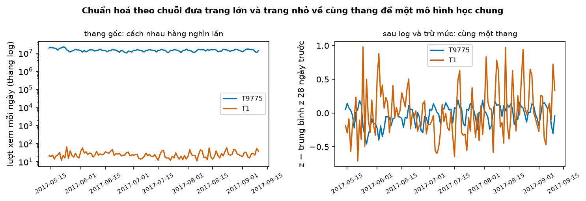
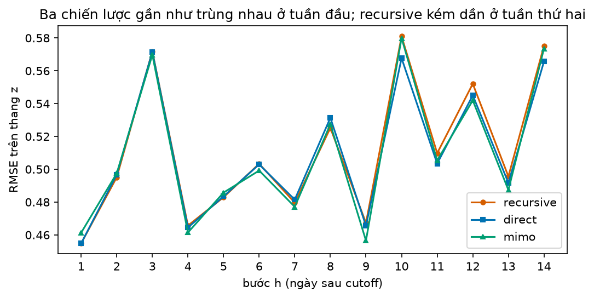
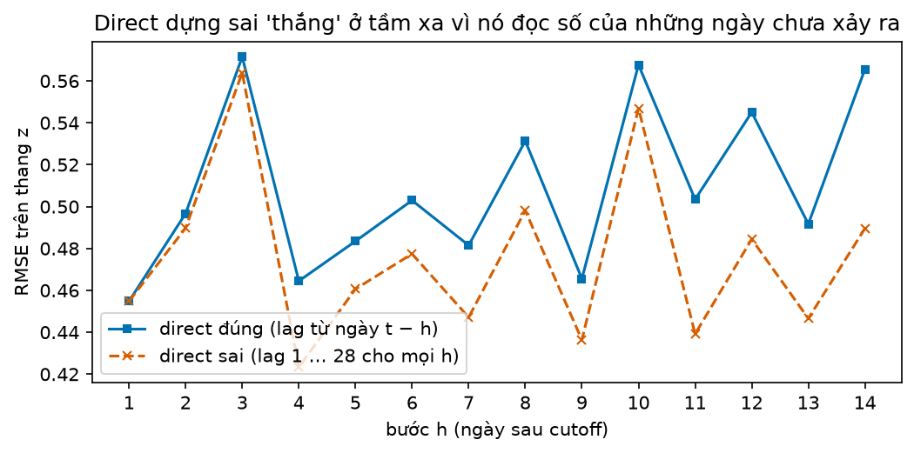
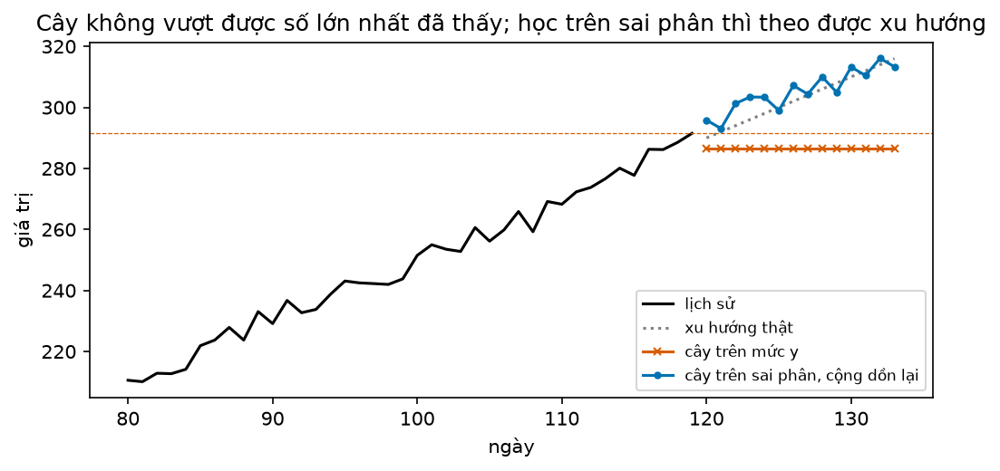
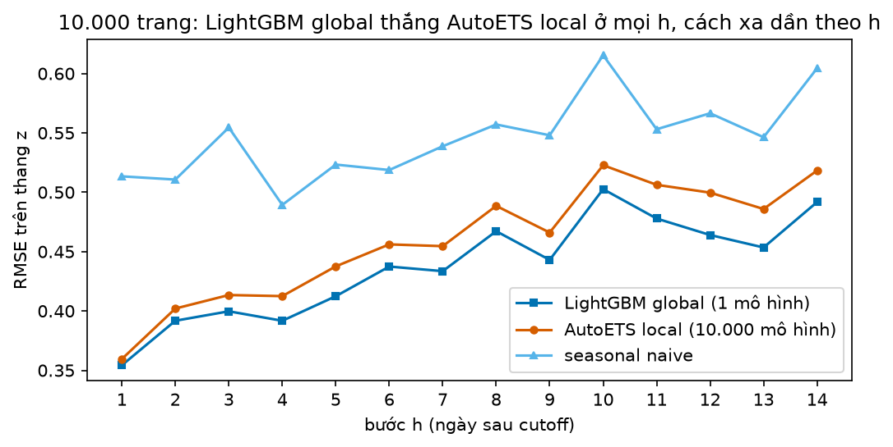

# Buổi 22 — Biến dự báo thành bài toán hồi quy

## 1. Mục tiêu

Sau buổi này bạn:

- Biến một chuỗi thời gian thành bảng (mỗi dòng: vài số quá khứ → số cần đoán) và tự viết dự báo **recursive** bằng scikit-learn.
- Giải thích vì sao **một** mô hình học chung 10.000 chuỗi (**global**) thắng 10.000 mô hình riêng (**local**), và vì sao phải chuẩn hoá
  từng chuỗi trước khi học chung.
- So ba chiến lược dự báo nhiều ngày tới (recursive, direct, MIMO) theo sai số từng bước $h$.
- Chỉ ra lỗi rò rỉ "lag nhỏ hơn tầm dự báo" trong chiến lược direct và bắt nó bằng test.
- Giải thích vì sao cây quyết định không đi theo được xu hướng, và sửa bằng sai phân.

Sản phẩm: LightGBM global cho 10.000 trang Wikipedia thắng AutoETS local và seasonal naive trên RMSSE, qua bài kiểm rò rỉ.

## 2. Nhắc lại buổi trước

- **Sai số** = thực tế − dự báo. **RMSE**: căn của trung bình sai số². **RMSSE** của một chuỗi: căn của (trung bình sai số² ÷ trung bình bình phương bước nhảy ngày-qua-ngày
  trên phần học). Dưới 1 nghĩa là sai ít hơn mức nhảy quen thuộc của chính chuỗi đó; nhờ chia như vậy nên cộng được RMSSE của chuỗi 20 lượt
  xem với chuỗi 20 triệu lượt xem.
- **Seasonal naive** chu kỳ 7: dự báo ngày mai bằng cùng thứ tuần trước. Mọi mô hình phải thắng nó mới đáng dùng.
- **Backtest rolling origin**: chọn vài **cutoff** (ngày cuối được thấy); ở mỗi cutoff chỉ học trên dữ liệu tới cutoff rồi dự báo đoạn sau.
- **Lag** $k$ của ngày $t$ là giá trị ngày $t - k$. **Rò rỉ tương lai**: đặc trưng dùng số mà lúc dự báo chưa có. Hàm `kiem_ro_ri` của
  `tv.ro_ri` tự bắt: nó đổi dữ liệu tương lai rồi xem đặc trưng quá khứ có đổi theo không.
- **Log**: $z = \log(1 + y)$ biến "gấp đôi" thành "cộng thêm 0,69", nên chuỗi 20 và chuỗi 20 triệu dao động cùng cỡ. Đổi ngược: $y = e^z - 1$.
- **Sai phân**: $d_t = y_t - y_{t-1}$, chuỗi các bước nhảy. Cộng dồn các $d$ từ số cuối thì ra lại $y$.
- **AutoETS**: làm trơn hàm mũ có mức và mùa vụ, tự chọn dạng theo dữ liệu; mỗi chuỗi một mô hình.

## 3. Trạng thái đầu buổi

Sau `python lab.py up` (trong thư mục `lab/`):

| Hạng mục | Trạng thái |
|---|---|
| Dữ liệu | `du-lieu/raw/monash-web-traffic/kaggle_web_traffic_dataset_without_missing_values.tsf` — 145.063 trang Wikipedia, lượt xem mỗi ngày 1/7/2015 → 10/9/2017 (803 ngày), sha256 `29912f202cb8` |
| Nguồn | Monash Time Series Forecasting Repository (CC BY 4.0), gốc từ cuộc thi Kaggle Web Traffic 2017; tên trang đã bị thay bằng T1, T2… |
| Buổi dùng | 10.000 trang đầu tệp có dưới 5% ngày bằng 0 trong phần học (Monash thay ô thiếu bằng 0) |
| Chấm | 3 cutoff 30/7, 13/8, 27/8/2017; mỗi cutoff dự báo 14 ngày → chấm 31/7 → 10/9/2017 |
| Môi trường | Python 3.12; pandas 2.3.3, scikit-learn 1.9.1, lightgbm 4.7.0, mlforecast 1.1.0, statsforecast 2.1.1 |
| `code/hoi_quy.py` | `doc_web_traffic`, `bang_lag`, `du_bao_de_quy`, `dac_trung`, `chien_luoc`, `du_bao_cay`, `backtest_toan_cuc`, `backtest_cuc_bo`, `rmsse_tung_chuoi` |
| `code/lab.ipynb` | notebook của Lab, bước 1–5 |
| **Đang cố tình sai** | `dac_trung` dùng lag 1 … 28 cho mọi tầm $h$; `du_bao_cay` học cây trên mức $y$ của chuỗi có xu hướng |
| **Triệu chứng** | direct thắng recursive xa ở tuần thứ hai (RMSE 0,479 so với 0,531); cây dự báo đứng ngang dưới số lớn nhất đã thấy |
| `python lab.py check` lúc này | ĐỎ: 4/10 test hỏng |

## 4. Lý thuyết

Mọi mô hình học và chấm trên $z = \log(1 + \text{lượt xem})$; sai số 0,1 trên thang $z$ gần bằng lệch 10%.

### Từ mới trong buổi

| Thuật ngữ | Nghĩa một câu | Ví dụ |
|---|---|---|
| hồi quy dạng bảng | Mô hình học từ bảng: mỗi dòng có các cột đầu vào và một cột số cần đoán. | Cột: lượt xem hôm qua, hôm kia; cần đoán: hôm nay. |
| cây quyết định | Mô hình hỏi liên tiếp các câu "có/không" về đầu vào; mỗi nhánh cuối (lá) trả trung bình các dòng học rơi vào đó. | "Hôm qua > 100?" → có: đoán 120; không: đoán 40. |
| rừng ngẫu nhiên (random forest) | Trung bình của nhiều cây, mỗi cây học trên một phần dữ liệu và một phần cột chọn ngẫu nhiên. | 50 cây đoán 118, 125, 121… → lấy trung bình. |
| mô hình local | Mỗi chuỗi một mô hình riêng, chỉ học từ chính chuỗi đó. | 10.000 trang → 10.000 AutoETS. |
| mô hình global | Một mô hình duy nhất học từ mọi chuỗi cùng lúc. | 10.000 trang → 1 LightGBM. |
| chuẩn hoá theo chuỗi | Đưa từng chuỗi về cùng thang trước khi học chung (log, trừ mức gần đây). | 20 triệu và 20 lượt xem đều thành "cao hơn mức tuần trước 0,1". |
| tầm dự báo $h$ | Số ngày từ cutoff tới ngày cần dự báo. | Cutoff 30/7, dự báo 6/8: $h$ = 7. |
| recursive | Một mô hình đoán 1 ngày tới, rồi dùng chính dự báo đó làm đầu vào để đoán ngày kế. | Đoán thứ Hai, coi như số thật để đoán thứ Ba. |
| direct | Mỗi tầm $h$ một mô hình riêng, học thẳng từ số đã biết tới ngày $t + h$. | 14 mô hình cho 14 ngày. |
| MIMO | Một mô hình ra cả dãy $H$ ngày một lúc (nhiều đầu vào, nhiều đầu ra). | Nhập 28 ngày, ra 14 ngày. |
| ngoại suy | Dự báo ra ngoài khoảng giá trị đã thấy khi học. | Doanh số luôn dưới 300, mô hình đoán 310. |
| mlforecast | Thư viện của Nixtla tự dựng bảng lag và chạy mô hình global cho nhiều chuỗi. | `MLForecast(models=..., lags=[1, 7])`. |

### 4.1 Chuỗi thành bảng

**Vấn đề.** Mô hình máy học quen thuộc (cây quyết định, rừng ngẫu nhiên, LightGBM) chỉ học từ bảng: cột đầu vào và cột cần đoán. Chuỗi thời
gian là một dãy số. Phải cắt dãy thành bảng mà không để mô hình nhìn thấy tương lai.

> **Mượn trước — LightGBM.** LightGBM ghép hàng trăm cây nhỏ: cây sau học phần sai còn lại của các cây trước, dự báo là tổng của mọi cây.
> Nó học nhanh trên hàng triệu dòng, nên là mô hình global phổ biến nhất. Buổi 23 học kỹ.

**Trực giác.** Trượt một khung dài $L$ ngày dọc chuỗi. Ở mỗi vị trí, $L$ số trong khung là đầu vào, số ngay sau khung là cái cần đoán (gọi là **nhãn**). Dãy
dài $T$ cho $T - L$ dòng.

**Ví dụ số nhỏ — tự tính tay.** Dãy $(10, 12, 11, 13, 15)$, $L$ = 2, số mới nhất đứng đầu:

| Dòng | lag 1 | lag 2 | Cần đoán |
|---|---|---|---|
| 1 | 12 | 10 | 11 |
| 2 | 11 | 12 | 13 |
| 3 | 13 | 11 | 15 |

**Đọc bảng.** Năm số cho ba dòng học. Dòng 1: biết hai ngày đầu (12 gần hơn, 10 xa hơn), cần đoán ngày thứ ba. Ngoài lag còn thêm được cột
lịch (thứ trong tuần), trung bình trượt của các lag, và đặc trưng tĩnh của chuỗi (ngôn ngữ của trang); miễn là mọi cột đều biết được lúc dự báo.

**Dự báo nhiều ngày bằng recursive.** Bảng trên dạy mô hình đoán **1** ngày. Muốn 3 ngày thì đoán ngày 1, nối dự báo vào cuối dãy như thể
nó là số thật, rồi đoán tiếp. Mô hình giả "trung bình 2 số gần nhất", lịch sử $(10, 20)$:

- ngày 1: (20 + 10) / 2 = **15**; dãy thành (10, 20, 15);
- ngày 2: (15 + 20) / 2 = **17,5**;
- ngày 3: (17,5 + 15) / 2 = **16,25**.

Từ ngày 2, đầu vào đã chứa dự báo. Dự báo ngày 1 sai thì ngày 2 mang theo cái sai đó.

**Thư viện.** `bang_lag(z, L)` trong `code/hoi_quy.py` dựng bảng lag bằng NumPy; `du_bao_de_quy(mo_hinh, z, h, L)` làm vòng lặp trên với
bất kỳ mô hình scikit-learn nào.

**Dữ liệu thật.** Trang T1, khung $L$ = 28, dựng bảng từ dữ liệu tới cutoff đầu. Rừng ngẫu nhiên học trên bảng đó, dự báo hai tuần được RMSE 0,466 trên thang
$z$; seasonal naive được 0,504.

**Tóm lại.** **Trượt khung $L$ ngày: $L$ số là đầu vào, số kế tiếp là nhãn. Recursive nối dự báo vào lịch sử để đoán tiếp, nên sai số ngày
đầu truyền sang các ngày sau.**

**Tự kiểm tra.** Dãy $(4, 6, 5, 7)$, $L$ = 2. Có mấy dòng học? Mô hình "lấy số hôm qua cộng 1" dự báo recursive 2 ngày tới được bao nhiêu?

<details>
<summary>Đáp án</summary>

Hai dòng: (6, 4) → 5 và (5, 6) → 7. Recursive: ngày 1 = 7 + 1 = **8**; ngày 2 dùng 8 làm "hôm qua": 8 + 1 = **9**. Nhầm hay gặp: cho dãy 4 số
ra 4 dòng; hai số đầu không đủ khung nên không thành dòng.

</details>

### 4.2 Local và global: một mô hình cho 10.000 chuỗi

**Vấn đề.** Có 10.000 trang. Local: 10.000 mô hình, mỗi cái chỉ thấy 760 ngày của một trang. Global: một mô hình thấy 7,6 triệu dòng của cả
10.000 trang. Mô hình chung có "cào bằng" các trang khác nhau không?

**Trực giác.** Mẫu hình "thứ Hai đông hơn Chủ nhật" hay "sau một ngày tăng vọt thì tụt dần" lặp lại ở rất nhiều trang. Mô hình local phải tự
học lại mẫu hình đó từ 760 ngày; mô hình global học một lần từ mọi trang, nên học được mẫu hình phức tạp hơn mà không học thuộc nhiễu.
Montero-Manso & Hyndman (2021) chứng minh global không hạn chế hơn local: mọi bộ dự báo local đều có một mô hình global cho ra đúng như thế.
Số con số mô hình phải học thì khác: local cần một bộ cho mỗi chuỗi, global chỉ một bộ cho tất cả.

**Điều kiện: cùng thang.** Trang Chính (T9775) có khoảng 14 triệu lượt xem mỗi ngày, trang T1 khoảng 26. Học chung trên số gốc thì mô hình
chỉ lo đoán đúng trang khổng lồ. Hai bước đưa về cùng thang:

1. Log: $z = \log(1 + y)$.
2. Trừ mức: lấy 28 giá trị $z$ gần nhất, trừ đi trung bình của chúng.

**Ví dụ số nhỏ — tự tính tay.** Hai trang, ba ngày gần nhất (dùng $\log_{10}$ cho dễ nhẩm):

| Trang | Lượt xem | $\log_{10}$ | Mức (trung bình) | Sau khi trừ mức |
|---|---|---|---|---|
| lớn | 1.000.000; 100.000; 1.000.000 | 6; 5; 6 | 5,67 | +0,33; −0,67; +0,33 |
| nhỏ | 100; 10; 100 | 2; 1; 2 | 1,67 | +0,33; −0,67; +0,33 |

**Đọc bảng.** Sau hai bước, hai trang cho cùng một dãy: "ngày giữa tụt 10 lần rồi hồi lại". Mô hình học mẫu hình này một lần cho cả hai. Dự
báo ra trên thang đã chuẩn hoá; cộng lại mức rồi đổi ngược log là về lượt xem của từng trang.



**Cách đọc hình.**

1. **Trục ngang**: ngày, 120 ngày cuối.
2. **Trục dọc**: trái là lượt xem (thang log, mỗi vạch gấp 10 lần); phải là $z$ trừ trung bình $z$ của 28 ngày trước đó.
3. **Màu**: xanh là trang Chính T9775, cam là trang T1.
4. **Nhìn vào đâu**: khoảng cách giữa hai đường ở ô trái và ô phải.
5. **Kết luận**: bên trái hai trang cách nhau khoảng 500.000 lần; bên phải chúng dao động quanh 0 trong cùng một dải, T1 chỉ ồn hơn.

**Thư viện.** `dac_trung(df, h)` trả các cột `lag_1` … `lag_28` đã trừ mức, cột `muc` và cột `thu` (thứ trong tuần) cho mọi chuỗi cùng lúc.
Mô hình học đoán $z - \text{muc}$; dự báo cộng lại `muc`.

**Tóm lại.** **Global = một mô hình học từ mọi chuỗi; nó không kém linh hoạt hơn local và học được mẫu hình chung. Điều kiện là chuẩn hoá
từng chuỗi về cùng thang (log, trừ mức) trước khi học.**

**Tự kiểm tra.** Ba ngày gần nhất, $\log_{10}$ của trang A là $(3;\ 3;\ 4{,}5)$, của trang B là $(0;\ 0;\ 1{,}5)$. Sau khi trừ mức, hai trang
có giống nhau không? Mô hình global dự báo "cao hơn mức 0,5" cho cả hai; đổi về lượt xem, mỗi trang được bao nhiêu?

<details>
<summary>Đáp án</summary>

Mức A = 3,5, mức B = 0,5; cả hai thành (−0,5; −0,5; +1). Giống nhau. Dự báo A: $\log_{10}$ = 3,5 + 0,5 = 4 → **10.000** lượt; B: 0,5 + 0,5 = 1
→ **10** lượt. Nhầm hay gặp: quên cộng lại mức, trả cùng một con số cho hai trang.

</details>

### 4.3 Ba chiến lược dự báo nhiều ngày

**Vấn đề.** Cần 14 ngày tới, mà bảng ở mục 4.1 chỉ dạy đoán một ngày. Có ba cách (Taieb et al. 2012):

| Chiến lược | Số mô hình | Đầu vào khi đoán ngày $t + h$ | Điểm yếu |
|---|---|---|---|
| recursive | 1 | 28 ngày gần nhất, trong đó có dự báo của các ngày $t + 1$ … $t + h - 1$ | sai số tích luỹ theo $h$ |
| direct | $H$ = 14 | 28 ngày tới cutoff $t$ (toàn số thật) | 14 lần học; các ngày học riêng nên có thể lệch nhau |
| MIMO | 1 | 28 ngày tới cutoff, ra cả dãy 14 ngày | mô hình phải hỗ trợ nhiều đầu ra |

**Đọc bảng.** Recursive chỉ cần một mô hình nhưng từ ngày thứ hai phải dựa vào dự báo của chính nó. Direct và MIMO chỉ dùng số thật, đổi lại
direct phải học 14 lần. Biến thể **DirRec** trộn hai ý: mô hình của tầm $h$ nhận thêm dự báo của các tầm trước.

**Ví dụ số nhỏ — tự tính tay.** Lịch sử $(10, 20)$, cần 2 ngày tới.

- Recursive với mô hình $f$ = "trung bình 2 số gần nhất": ngày 1 = 15; ngày 2 = $f(15, 20)$ = 17,5.
- Direct với hai mô hình: $f_1$ = "trung bình 2 số" cho ngày 1 = 15; $f_2$ = "số gần nhất + 1" (học riêng cho tầm 2) cho ngày 2 = 20 + 1 = 21.
  Ngày 2 không dùng số 15 đã đoán.
- MIMO: một mô hình trả thẳng cặp (15; 21).

**Công thức.**

$$
\text{recursive: } \hat z_{t+h} = f(\hat z_{t+h-1}, \dots, \hat z_{t+1}, z_t, \dots), \qquad
\text{direct: } \hat z_{t+h} = f_h(z_t, z_{t-1}, \dots, z_{t-L+1})
$$

- $t$: cutoff; $z_t$: số thật tới cutoff; $\hat z$: dự báo; $f$: một mô hình 1 bước dùng lại; $f_h$: mô hình riêng của tầm $h$; $L$ = 28.

**Nói bằng lời.** Recursive dùng lại một mô hình 1 bước, đầu vào gồm cả dự báo trước đó: để đoán ngày 14 nó dùng 13 dự báo, phần còn lại
của 28 đầu vào là số thật. Direct dùng mô hình riêng của ngày 14, đầu vào toàn số thật tới cutoff.

**Dữ liệu thật.** Cả ba chiến lược dùng cùng một loại mô hình: rừng ngẫu nhiên global học trên 300 trang, chấm ở 3 cutoff. MIMO dùng khả năng
nhiều đầu ra của rừng: mỗi cây chia dữ liệu một lần cho cả dãy 14 ngày.

| RMSE trên thang $z$ | recursive | direct | MIMO |
|---|---|---|---|
| tuần 1 ($h$ = 1 … 7) | 0,495 | 0,495 | 0,494 |
| tuần 2 ($h$ = 8 … 14) | 0,531 | 0,526 | 0,526 |

**Đọc bảng.** So tuần 1 với tuần 2 trong cùng cột: mọi chiến lược đều sai hơn khi đoán xa. So ba cột trong tuần 2: recursive sai hơn khoảng
1%, đúng dấu hiệu của sai số tích luỹ. Riêng ngày đầu tiên, recursive và direct cho kết quả y hệt, vì hai mô hình học cùng một bảng.



**Cách đọc hình.**

1. **Trục ngang**: $h$, số ngày sau cutoff.
2. **Trục dọc**: RMSE trên thang $z$, gộp 300 trang × 3 cutoff.
3. **Màu**: cam recursive, xanh dương direct, xanh lá MIMO.
4. **Nhìn vào đâu**: độ cao chung của các ngày, rồi khoảng hở cam–xanh từ $h$ = 10.
5. **Kết luận**: độ khó thay đổi theo ngày (ngày $h$ = 3 và 10 cùng rơi vào thứ Tư, khó hơn các ngày khác); ba chiến lược gần như trùng, recursive tách lên
   nhẹ ở tuần thứ hai.

**Khi nào dùng, khi nào không.** Trên dữ liệu này recursive (rẻ nhất) là lựa chọn hợp lý. Tầm dài hoặc mô hình
1 bước kém thì sai số tích luỹ lớn hơn, lúc đó direct hoặc MIMO đáng tiền hơn. Đội thắng cuộc thi M5 trộn cả recursive lẫn direct: recursive
chính xác hơn trung bình nhưng kém ổn định hơn. Kết luận nghiên cứu cũng trái chiều, nên chọn bằng backtest trên dữ liệu của bạn.

**Tóm lại.** **Recursive: 1 mô hình, dùng lại dự báo, sai số tích luỹ. Direct: mỗi $h$ một mô hình, chỉ dùng số thật. MIMO: 1 mô hình ra cả
dãy. Chọn bằng backtest; ở đây recursive kém nhẹ ở tuần 2.**

**Tự kiểm tra.** $H$ = 7. Direct cần bao nhiêu mô hình, recursive cần bao nhiêu? Khi recursive đoán ngày 7 với $L$ = 28, đầu vào có bao nhiêu
dự báo?

<details>
<summary>Đáp án</summary>

Direct **7** mô hình, recursive **1**. Ngày 7 dùng **6** dự báo (ngày 1 … 6); còn lại 28 − 6 = 22 số thật. Nhầm hay gặp: nghĩ recursive dùng
7 dự báo; ngày đang đoán chưa có trong đầu vào.

</details>

### 4.4 Rò rỉ trong direct: lag phải tính từ cutoff

**Vấn đề.** Cách nhanh để dựng bảng cho direct: tạo một lần các cột `lag_1` … `lag_28` bằng `shift(1)` … `shift(28)`, rồi dùng cho cả 14 mô
hình. Ở mô hình tầm $h$ = 7, dòng của ngày 6/8 có `lag_1` là số ngày 5/8. Nhưng lúc dự báo (cutoff 30/7) ta chỉ biết tới 30/7.

**Quy tắc.** Dự báo ngày $\tau$ với tầm $h$ nghĩa là cutoff là $\tau - h$. Mọi số dùng làm đầu vào phải cách ngày $\tau$ ít nhất $h$ ngày:

$$
\text{lag}_k(\tau) = z_{\tau - (h - 1) - k}, \quad k = 1, 2, \dots, L
$$

- $\tau$: ngày cần dự báo; $h$: tầm; $k$: số thứ tự lag; $L$ = 28.

**Nói bằng lời.** `lag_1` của mô hình tầm $h$ là số ngày $\tau - h$, tức đúng ngày cutoff. Với $h$ = 7, $\tau$ = 6/8: `lag_1` là 30/7, `lag_2`
là 29/7.

**Ví dụ số nhỏ — tự tính tay.** Cutoff là ngày 10, $h$ = 3, nên cần đoán ngày 10 + 3 = 13. Bảng dựng sai: `lag_1` = 13 − 1 = ngày 12, `lag_2` =
13 − 2 = ngày 11, hai số chưa xảy ra. Bảng đúng: `lag_1` = 13 − 3 = ngày 10, `lag_2` = ngày 9.

**Vì sao backtest không tự báo lỗi.** Backtest dựng bảng trên toàn bộ dữ liệu rồi lọc dòng theo ngày. Dòng cần đoán có sẵn số thật của những
ngày sau cutoff, nên mô hình tầm 3 thực chất là mô hình 1 bước chạy trên số thật: điểm rất đẹp. Khi dự báo thật sau ngày cuối của dữ liệu,
các ô đó trống, và mô hình không chạy được.



**Cách đọc hình.**

1. **Trục ngang**: $h$.
2. **Trục dọc**: RMSE trên thang $z$, 300 trang × 3 cutoff.
3. **Màu**: xanh là direct đúng; cam đứt là direct với `shift(1)` … `shift(28)` cho mọi $h$.
4. **Nhìn vào đâu**: khoảng hở giữa hai đường khi $h$ tăng.
5. **Kết luận**: hai đường trùng ở ngày đầu (lúc đó lag 1 hợp lệ) rồi tách dần; ở ngày cuối bản sai được 0,490, bản đúng 0,566. Mô hình
   không giỏi lên khi đoán xa; nó chỉ đọc được nhiều ngày tương lai hơn.

**Bắt bằng test.** `kiem_ro_ri(lambda d: dac_trung(d, 7), df, h=7)` đổi mạnh $z$ từ một ngày $p$ trở đi. Dòng cần đoán trước ngày $p + 7$ chỉ
được dùng số trước $p$, nên đặc trưng của nó không được đổi. Bản sai đổi ngay (`lag_1` … `lag_6` rơi vào vùng bị đổi); bản đúng giữ nguyên.

**Tóm lại.** **Mô hình tầm $h$ chỉ được dùng số cách ngày cần đoán ít nhất $h$ ngày: `lag_1` là chính ngày cutoff. Dựng bảng một lần bằng
`shift(1)` rồi dùng cho mọi $h$ là rò rỉ: backtest đẹp, dự báo thật không chạy.**

**Tự kiểm tra.** Cutoff 30/7, $h$ = 5. Ngày cần đoán là ngày nào? Trong bảng đúng, `lag_1` và `lag_3` là số của ngày nào?

<details>
<summary>Đáp án</summary>

Ngày cần đoán **4/8**. `lag_1` = 30/7 (chính cutoff), `lag_3` = **28/7**. Nhầm hay gặp: lấy `lag_1` = 3/8, tức ngày ngay trước ngày cần đoán,
chưa có lúc dự báo.

</details>

### 4.5 Cây quyết định không ngoại suy

**Vấn đề.** Chuỗi tăng đều, số lớn nhất đã thấy là 291,5. Cây quyết định dự báo hai tuần tới đứng yên ở 286,5, dù xu hướng thật đang đi lên.

**Trực giác.** Mỗi lá của cây trả **trung bình** các dòng học rơi vào lá đó. Trung bình của các số không thể lớn hơn số lớn nhất trong
chúng. Vì vậy cây, rừng ngẫu nhiên và LightGBM không bao giờ dự báo vượt khoảng giá trị đã thấy khi học.

**Ví dụ số nhỏ — tự tính tay.** Dãy 10, 20, 30, 40 cho bảng lag 1 ba dòng: 10 → 20, 20 → 30, 30 → 40. Cây một câu hỏi "lag 1 > 25?":

- không (hai dòng lag 1 = 10 và 20): lá trả (20 + 30) / 2 = 25;
- có (một dòng lag 1 = 30): lá trả 40.

Dự báo recursive: lag 1 = 40 → 40; lag 1 = 40 → 40… cây đứng ở **40** mãi. Trên sai phân thì khác: các bước nhảy đều là 10, cây học "bước nhảy
= 10" và ta cộng dồn: 40 + 10 = 50, rồi 60, 70.



**Cách đọc hình.**

1. **Trục ngang**: ngày; lịch sử tới ngày 119, dự báo ngày 120 → 133.
2. **Trục dọc**: giá trị của chuỗi tăng 2 mỗi ngày, cộng nhiễu.
3. **Màu**: đen lịch sử; chấm xám xu hướng thật; cam cây học trên mức $y$; xanh cây học trên sai phân rồi cộng dồn; gạch cam ngang là số lớn
   nhất đã thấy.
4. **Nhìn vào đâu**: đường cam so với gạch ngang.
5. **Kết luận**: cây trên mức nằm ngang dưới 291,5; cây trên sai phân tới 313,3 ở ngày cuối, gần xu hướng thật 316.

**Thư viện.** Trong mlforecast, `target_transforms=[Differences([1])]` học trên sai phân và tự cộng dồn khi dự báo. Chuẩn hoá theo mức ở mục
4.2 cũng giúp: mô hình đoán "cao hơn mức bao nhiêu", mức đi theo chuỗi.

**Dữ liệu thật.** Trên 10.000 trang (mục 4.6), thêm sai phân gần như không đổi kết quả: RMSSE 0,914 so với 0,916. Lượt xem Wikipedia ít có xu
hướng kéo dài; chuỗi bán hàng tăng trưởng thì khác.

**Tóm lại.** **Lá của cây trả trung bình nhãn đã thấy, nên cây không vượt được khoảng đã học. Chuỗi có xu hướng: học trên sai phân (hoặc
trên độ lệch so với mức gần đây) rồi cộng lại.**

**Tự kiểm tra.** Chuỗi 100, 110, 120, …, 200. Cây học trên mức dự báo 5 ngày tới tối đa được bao nhiêu? Học trên sai phân (luôn 10) thì dự báo ngày thứ 5 là bao nhiêu?

<details>
<summary>Đáp án</summary>

Trên mức: không quá **200**. Sai phân: 200 + 5 × 10 = **250**. Nhầm hay gặp: nghĩ thêm nhiều cây (rừng, LightGBM) sẽ ngoại suy được; trung bình
của nhiều cây vẫn không vượt số lớn nhất.

</details>

### 4.6 Global LightGBM với mlforecast, so với AutoETS local

**Vấn đề.** Tự viết bảng cho 10.000 chuỗi dễ sai và chậm. mlforecast làm hộ, đúng thứ tự thời gian:

- `lags=[1, …, 7, 14, 21, 28]`: số của 1 … 7 ngày trước và cùng thứ 2, 3, 4 tuần trước;
- `lag_transforms={1: [RollingMean(7), RollingMean(28)]}`: trung bình 7 và 28 ngày tính từ lag 1;
- `date_features=["dayofweek"]`: thứ trong tuần;
- học trên $z$ (đã log), không trừ mức riêng: cột trung bình 28 ngày đã cho mô hình biết mức của từng trang;
- `cross_validation(df, h=14, n_windows=3, step_size=14)`: backtest 3 cutoff; mỗi cutoff học lại một mô hình trên dữ liệu tới cutoff rồi dự
  báo recursive 14 ngày.

**Dữ liệu thật.** Cùng 3 cutoff, RMSSE của từng trang rồi lấy trung bình 10.000 trang:

| Mô hình | Số mô hình mỗi cutoff | RMSSE trung bình | RMSSE trung vị (trang đứng giữa) | % trang thắng seasonal naive |
|---|---|---|---|---|
| LightGBM global | 1 | **0,916** | **0,763** | 87,6% |
| AutoETS local | 10.000 | 0,951 | 0,776 | 81,3% |
| seasonal naive | — | 1,099 | 0,949 | — |
| naive (số hôm qua) | — | 1,163 | 1,004 | 45,7% |

**Đọc bảng.** So dòng LightGBM với AutoETS: global sai ít hơn khoảng 4% (RMSSE trung bình), thắng seasonal naive ở nhiều trang hơn. Cả hai
đều thắng seasonal naive xa; naive thua seasonal naive vì lượt xem có nhịp tuần rõ. AutoETS ở đây tắt xu hướng (`model="ZNA"`: chữ N ở giữa là không xu hướng): bật xu hướng
chậm gấp 6 lần mà trên 300 trang thử sai số gần như không đổi.

**Thắng ở đâu, thua ở đâu.** Tính riêng từng trang, LightGBM thắng AutoETS ở 58% số trang. Chia trang thành bốn nhóm theo lượt xem trung vị:

| Nhóm (lượt xem/ngày) | RMSSE LightGBM | RMSSE AutoETS | % trang LightGBM thắng |
|---|---|---|---|
| 3 – 14 | 0,707 | 0,714 | 52% |
| 15 – 159 | 0,886 | 0,937 | 62% |
| 160 – 613 | 1,029 | 1,098 | 62% |
| từ 614 | 1,048 | 1,061 | 56% |

**Đọc bảng.** So cột cuối giữa các dòng: ở trang rất ít lượt xem hai mô hình gần hoà (52%), vì chuỗi 3–14 lượt/ngày chủ yếu là nhiễu, không
có mẫu hình để học chung. Global lợi nhất ở trang cỡ vừa.



**Cách đọc hình.**

1. **Trục ngang**: $h$.
2. **Trục dọc**: RMSE trên thang $z$, gộp 10.000 trang × 3 cutoff.
3. **Màu**: xanh đậm LightGBM global; cam AutoETS local; xanh nhạt seasonal naive.
4. **Nhìn vào đâu**: khoảng hở xanh đậm–cam ở $h$ = 1 và $h$ = 14.
5. **Kết luận**: ở $h$ = 1 hai mô hình gần bằng (0,354 và 0,360); ở $h$ = 14 cách nhau rõ hơn (0,492 và 0,518). Global lợi hơn khi đoán xa.

**Tóm lại.** **mlforecast dựng bảng lag, trung bình trượt, lịch cho mọi chuỗi và backtest đúng thứ tự thời gian. Một LightGBM global thắng
10.000 AutoETS local (RMSSE 0,916 so với 0,951), lợi nhất ở trang cỡ vừa và ở tầm xa.**

**Tự kiểm tra.** Một bạn báo: "global thắng local 4%, vậy trang nào dùng global cũng tốt hơn". Bảng theo nhóm nói gì về câu này?

<details>
<summary>Đáp án</summary>

Sai. Global chỉ thắng ở 58% số trang; ở nhóm trang ít lượt xem nhất nó thắng 52%, gần như tung đồng xu. "Trung bình tốt hơn" không có nghĩa
"tốt hơn ở mọi chuỗi". Nhầm hay gặp: đọc trung bình như thể đúng cho từng chuỗi.

</details>

## 5. Lab từng bước

Lệnh gõ trong terminal ở thư mục `lab/`. Code các bước nằm sẵn trong `code/lab.ipynb` (mở bằng `python lab.py notebook` hoặc VS Code),
chạy từng ô từ trên xuống. Bạn sửa `code/hoi_quy.py`; notebook tự nạp lại bản mới.

### Bước 1 — Dữ liệu và một chuỗi

**Mục đích:** dựng bảng lag cho một trang và dự báo recursive (mục 4.1).

```bash
python lab.py up           # một lần: môi trường + dữ liệu (145 MB), kiểm sha256
python lab.py check        # 4/10 test đỏ
python lab.py notebook     # chạy ô bước 1
```

**Đọc kết quả:** 10.000 trang, 803 ngày mỗi trang. Trang T1: rừng ngẫu nhiên thắng seasonal naive như mục 4.1.

### Bước 2 — Ba chiến lược

**Mục đích:** so recursive, direct, MIMO trên 300 trang (ô bước 2, khoảng 1–3 phút).

**Đọc kết quả:** ở tuần 2, direct được 0,479, tốt hơn hẳn recursive (0,531). Đó là triệu chứng của mục 4.4. Sửa `dac_trung` để lag tính từ
cutoff: `shift(h - 1 + k)` thay cho `shift(k)`. Chạy lại: bảng và hình như mục 4.3.

### Bước 3 — Cây và xu hướng

**Mục đích:** thấy cây đứng ngang trên chuỗi tăng (mục 4.5).

**Đọc kết quả:** dự báo cuối 286,5, dưới số lớn nhất 291,5. Sửa `du_bao_cay`: học trên `np.diff(y)`, dự báo recursive trên sai phân, rồi
`y[-1] + np.cumsum(...)`. Chạy lại: 313,3.

### Bước 4 — Global và local trên 10.000 trang

**Mục đích:** chạy backtest LightGBM global và AutoETS local (mục 4.6). Lần đầu mất 5–15 phút tuỳ máy; kết quả lưu vào `du-lieu/cache/`.

**Đọc kết quả:** bảng như mục 4.6: LightGBM 0,916, AutoETS 0,951, seasonal naive 1,099. Thấy LightGBM thua seasonal naive thì kiểm lại
xem mô hình có học và chấm trên cùng thang $z$ không.

### Bước 5 — Kiểm tra

```bash
python lab.py check        # 10/10 xanh
```

**Mục đích:** chấm toàn bộ.

**Đọc kết quả:** xanh 10/10 là xong. `test_dac_trung_truc_tiep_khong_ro_ri[7]` còn đỏ thì `dac_trung` vẫn dùng lag nhỏ hơn $h$.

## 6. Lỗi thường gặp & cách chẩn đoán

| Triệu chứng | Nguyên nhân | Chẩn đoán | Sửa |
|---|---|---|---|
| Direct tốt lên ở tầm xa, hoặc bằng mô hình 1 bước | lag < $h$: bảng dựng một lần bằng `shift(1)` | `kiem_ro_ri(..., h=h)` | lag tính từ cutoff (mục 4.4) |
| Dự báo thật báo lỗi ô trống, backtest thì chạy | cùng nguyên nhân: lag của những ngày chưa có | in các lag của dòng dự báo | như trên |
| Cây/LightGBM dự báo đứng ngang dưới đỉnh cũ | cây không ngoại suy | so dự báo với số lớn nhất đã thấy | sai phân hoặc trừ mức (mục 4.5) |
| Mô hình global chỉ đúng với vài chuỗi lớn | học chung trên số gốc | sai số theo nhóm cỡ chuỗi | log + trừ mức (mục 4.2) |
| Kết quả tốt khó tin khi chia train/test | chia ngẫu nhiên theo dòng: dòng của tương lai lọt vào tập học | ngày lớn nhất của tập học so với ngày nhỏ nhất của tập kiểm | chia theo thời gian, backtest nhiều cutoff |
| Đổi ngược log ra số hơi thấp | trung bình trên thang log đổi ngược thành trung vị, thấp hơn trung bình | so tổng dự báo với tổng thực tế | nhân hệ số hiệu chỉnh nếu cần dự báo trung bình |
| mlforecast báo thiếu ngày | chuỗi có ngày trống | đếm số ngày mỗi chuỗi | điền ngày thiếu trước khi học |

## 7. Bài tập về nhà

1. **DirRec.** Sửa `chien_luoc` thêm chiến lược DirRec: mô hình tầm $h$ nhận thêm dự báo của các tầm 1 … $h - 1$. Nó có thắng direct ở tuần 2 không?
2. **Tầm 28 ngày.** Đặt `H = 28`. Khoảng cách recursive – direct ở tuần 4 lớn hơn tuần 2 không?
3. **Không chuẩn hoá.** Cho mlforecast học trên lượt xem gốc (không log). RMSSE của LightGBM đổi thế nào, ở nhóm trang nào tệ đi nhiều nhất?

## 8. Tiêu chí "Xong khi"

- [ ] `python lab.py check` xanh 10/10.
- [ ] Tính tay được bảng lag và dự báo recursive 3 bước của một dãy 5 số.
- [ ] Giải thích bằng hình vì sao direct dựng sai trông tốt hơn ở tầm xa, và viết đúng quy tắc lag cho tầm $h$.
- [ ] Bảng LightGBM global – AutoETS local – seasonal naive trên 10.000 trang, kèm một câu "global thắng ở đâu, thua ở đâu".

## 9. Đọc thêm

- Montero-Manso, P. & Hyndman, R.J. (2021). Principles and algorithms for forecasting groups of time series: locality and globality. *IJF* 37(4). https://arxiv.org/abs/2008.00444
- Taieb, S.B., Bontempi, G., Atiya, A.F. & Sorjamaa, A. (2012). A review and comparison of strategies for multi-step ahead time series forecasting based on the NN5 forecasting competition. *Expert Systems with Applications* 39(8). https://arxiv.org/abs/1108.3259
- Makridakis, S., Spiliotis, E. & Assimakopoulos, V. (2022). M5 accuracy competition: Results, findings, and conclusions. *IJF* 38(4) — mục 4.2–4.3.
- Hyndman, R.J. & Athanasopoulos, G. *FPP3* §12.4 (neural network autoregression — cũng là recursive): https://otexts.com/fpp3/nnetar.html
- mlforecast: https://nixtlaverse.nixtla.io/mlforecast/
