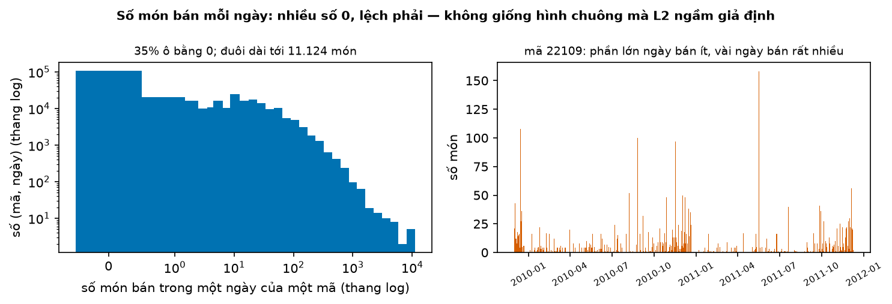
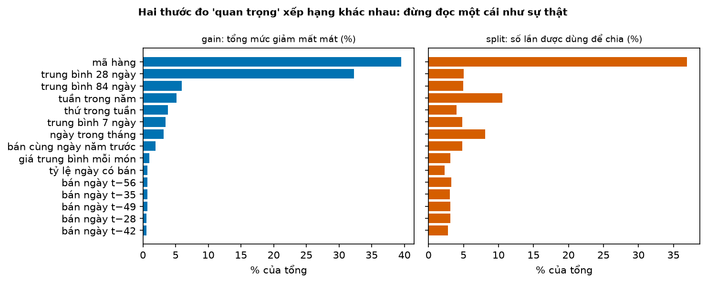
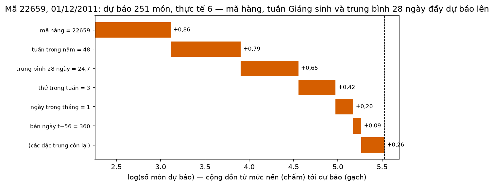
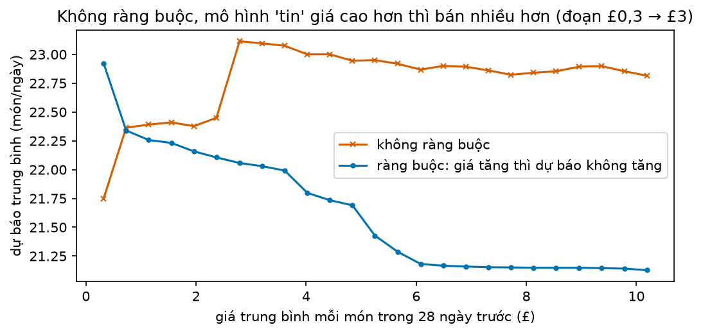

# Buổi 23 — Gradient boosting chuyên sâu

## 1. Mục tiêu

Sau buổi này bạn:

- Tính tay hai vòng **gradient boosting** và nói tham số nào của LightGBM điều khiển cái gì.
- Chấm dự báo bán lẻ bằng **WRMSSE** như cuộc thi M5, và chọn hàm mất mát hợp dữ liệu đếm (**Tweedie** thay cho bình phương).
- Tune tham số bằng **Optuna** trên CV theo thời gian, và giải thích vì sao KFold ngẫu nhiên chọn sai.
- Giải thích **một** dự báo cụ thể bằng SHAP cho người không biết máy học.
- Kiểm chiều ảnh hưởng của giá bằng **partial dependence**, và ép chiều đúng bằng ràng buộc đơn điệu.

Sản phẩm: LightGBM Tweedie cho 500 mã hàng thắng L2, thắng AutoETS và seasonal naive trên WRMSSE; một hình SHAP giải thích một dự báo.

## 2. Nhắc lại buổi trước

- **Sai số** = thực tế − dự báo. **RMSE**: căn của trung bình sai số². **RMSSE** của một chuỗi: RMSE chia cho căn của trung bình bình phương
  bước nhảy ngày-qua-ngày trên phần học; dưới 1 là sai ít hơn mức nhảy quen thuộc của chuỗi.
- **Backtest rolling origin**: vài **cutoff** (ngày cuối được thấy); ở mỗi cutoff chỉ học trên dữ liệu tới cutoff rồi dự báo đoạn sau.
  **Seasonal naive**: lặp lại tuần trước. **AutoETS**: làm trơn hàm mũ, mỗi chuỗi một mô hình.
- **Cây quyết định**: hỏi liên tiếp các câu có/không về đầu vào; mỗi lá trả trung bình nhãn của các dòng học rơi vào đó.
- **Mô hình global**: một mô hình học chung mọi chuỗi. **Direct** với tầm $h$: chỉ dùng số cách ngày cần đoán ít nhất $h$ ngày. Mọi lag
  $\ge$ 28 thì một mô hình dùng được cho cả 28 ngày tới.
- **Rò rỉ tương lai**: dùng số lúc dự báo chưa có. `kiem_ro_ri` (thư viện `tv`) tự bắt; `kiem_chia_tap` kiểm mọi ngày kiểm nằm sau mọi ngày học.
- **Log**: $\log$ biến "gấp $e$ lần" thành "cộng 1"; $e^{\log a} = a$.

## 3. Trạng thái đầu buổi

Sau `python lab.py up` (trong thư mục `lab/`):

| Hạng mục | Trạng thái |
|---|---|
| Dữ liệu | `du-lieu/raw/uci-online-retail-ii/online_retail_II.xlsx` — mọi hoá đơn của một cửa hàng bán buôn quà tặng ở Anh, 1/12/2009 → 9/12/2011, 1.067.371 dòng, sha256 `572e36277c23` |
| Nguồn | UCI Machine Learning Repository (CC BY 4.0). Là bộ dự phòng mở cho M5 (M5 cần tài khoản Kaggle và chấp nhận luật cuộc thi, không được phân phối lại) |
| Buổi dùng | 500 mã hàng bán nhiều ngày nhất trong phần học; số món bán mỗi **ngày bán hàng** (cửa hàng nghỉ thứ Bảy): 604 ngày |
| Chấm | 3 cutoff 2/9, 5/10, 7/11/2011; mỗi cutoff dự báo 28 ngày bán hàng → chấm tới 9/12/2011 |
| Môi trường | Python 3.12; pandas 2.3.3, lightgbm 4.7.0, optuna 5.0.0, scikit-learn 1.9.1, statsforecast 2.1.1 |
| `code/boosting.py` | `doc_ban_le`, `dac_trung`, `bang`, `huan_luyen`, `backtest`, `wrmsse`, `backtest_thong_ke`, `chia_cv`, `tune`, `shap_mot_dong`, `phu_thuoc_rieng`, `tham_so_don_dieu` |
| `code/lab.ipynb` | notebook của Lab, bước 1–6 |
| **Đang cố tình sai** | `THAM_SO` dùng hàm mất mát bình phương (`objective="regression"`) cho số đếm; `chia_cv` chia KFold xáo trộn |
| **Triệu chứng** | LightGBM thua cả "trung bình 28 ngày gần nhất" (WRMSSE 0,709 so với 0,697); tune xong vẫn thua AutoETS |
| `python lab.py check` lúc này | ĐỎ: 2/7 test hỏng |

## 4. Lý thuyết

Mọi đặc trưng của ngày $t$ chỉ dùng dữ liệu tới ngày $t - 28$, nên **một** mô hình dùng được cho cả 28 ngày tới. Đặc trưng gồm số bán của
vài ngày trước và của cùng ngày năm trước, trung bình trượt, tỷ lệ ngày có bán, giá trung bình mỗi món. Thêm các cột lịch và mã hàng.

### Từ mới trong buổi

| Thuật ngữ | Nghĩa một câu | Ví dụ |
|---|---|---|
| gradient boosting | Ghép nhiều cây nhỏ nối tiếp; mỗi cây học phần sai còn lại của các cây trước. | Cây 1 đoán 5, còn thiếu 4; cây 2 học "thêm 4". |
| phần dư | Nhãn trừ dự báo hiện tại: phần mô hình còn đoán sai. | Nhãn 9, đang đoán 7 → phần dư +2. |
| học suất (learning rate) | Tỷ lệ của mỗi cây mới được cộng vào dự báo. | Cây nói "+4", học suất 0,5 → cộng 2. |
| hàm mất mát | Công thức tính "sai bao nhiêu" mà mô hình cố làm nhỏ khi học. | Bình phương: sai 3 → mất 9. |
| hàm mất mát Tweedie | Hàm mất mát cho số không âm có nhiều số 0 và đuôi dài; mô hình đoán log của trung bình. | Số món bán mỗi ngày: 0, 0, 3, 0, 250. |
| WRMSSE | RMSSE của từng mã, cộng có trọng số theo doanh thu (cách chấm của M5). | Mã chiếm 75% doanh thu nặng gấp 3 mã chiếm 25%. |
| siêu tham số | Con số ta đặt trước khi học (số cây, số lá…), mô hình không tự học. | `num_leaves = 63`. |
| Optuna | Thư viện thử lần lượt các bộ siêu tham số, bộ sau chọn dựa trên kết quả các bộ trước. | 50 lần thử, giữ bộ có điểm CV tốt nhất. |
| dừng sớm (early stopping) | Ngừng thêm cây khi sai số trên một đoạn theo dõi thôi giảm. | Cây thứ 300 không còn giảm sai số → dừng. |
| CV theo thời gian | CV (cross-validation, kiểm định chéo) là chia dữ liệu để tự chấm; theo thời gian: mỗi phần kiểm là một đoạn liền, chỉ học trên các ngày trước nó. | Học tới tháng 5, kiểm tháng 6. |
| KFold ngẫu nhiên | Chia các dòng thành $k$ phần bằng cách xáo trộn, bất kể ngày. | Dòng 3/6 trong phần kiểm, dòng 4/6 trong phần học. |
| SHAP | Tách một dự báo thành phần đóng góp của từng đặc trưng; cộng lại đúng bằng dự báo. | Nền 9,6 món; "tuần 48" góp thêm, "mã hàng" góp thêm… |
| partial dependence | Dự báo trung bình khi đặt một đặc trưng bằng từng giá trị, giữ nguyên mọi thứ khác. | Đặt giá = £1 cho mọi dòng → trung bình 22 món. |
| ràng buộc đơn điệu | Lệnh cấm mô hình tăng (hoặc giảm) dự báo khi một đặc trưng tăng. | Giá tăng thì dự báo không được tăng. |

### 4.1 Gradient boosting: mỗi cây sửa phần sai của các cây trước

**Vấn đề.** Một cây quyết định nhỏ đoán thô; một cây rất sâu thì học thuộc cả nhiễu. Cách của LightGBM: nhiều cây nhỏ, cây sau chỉ học phần
còn sai.

**Ví dụ số nhỏ — tự tính tay.** Bốn ngày, nhãn $y = (2, 4, 9, 13)$; mỗi cây chỉ được một câu hỏi, tách hai ngày đầu và hai ngày sau; học suất 0,5.

| Bước | Dự báo | Phần dư $y$ − dự báo | Tổng bình phương phần dư |
|---|---|---|---|
| bắt đầu: trung bình | 7; 7; 7; 7 | −5; −3; +2; +6 | 74 |
| cây 1: lá trái −4, lá phải +4; cộng 0,5 × lá | 5; 5; 9; 9 | −3; −1; 0; +4 | 26 |
| cây 2: lá trái −2, lá phải +2; cộng 0,5 × lá | 4; 4; 10; 10 | −2; 0; −1; +3 | 14 |

**Đọc bảng.** Mỗi lá trả trung bình phần dư của các ngày rơi vào nó: lá trái của cây 1 là (−5 − 3) / 2 = −4. Mỗi vòng, tổng bình phương phần dư
giảm: 74 → 26 → 14. Học suất nhỏ làm mỗi cây sửa một chút, cần nhiều cây hơn nhưng ít học thuộc nhiễu hơn.

**Siêu tham số quan trọng của LightGBM.**

| Tham số | Điều khiển | Tăng lên thì |
|---|---|---|
| `n_estimators` | số cây | khớp dữ liệu học sát hơn |
| `learning_rate` | học suất | mỗi cây sửa mạnh hơn; thường giảm khi tăng số cây |
| `num_leaves` | số lá mỗi cây | cây phức tạp hơn, dễ học thuộc nhiễu |
| `min_child_samples` | số dòng tối thiểu trong một lá | cây thận trọng hơn, khó học thuộc |
| `colsample_bytree` | phần cột mỗi cây được xem | cây giống nhau hơn |

XGBoost và CatBoost cùng ý tưởng, khác cách dựng cây: LightGBM mọc lá tốt nhất trước nên nhanh trên bảng lớn; CatBoost xử lý cột phân loại
(như mã hàng) cẩn thận hơn; XGBoost chặt chẽ và phổ biến lâu nhất.

**Bài học từ M5** (Makridakis et al. 2022). Cuộc thi dự báo 42.840 chuỗi bán hàng của Walmart năm 2020: đội thắng dùng LightGBM hàm mất mát
Tweedie, học riêng theo cửa hàng và ngành hàng, trộn bản recursive với bản direct; top 50 đều học chung nhiều chuỗi. Ban tổ chức nhấn mạnh
hai thứ góp nhiều vào thứ hạng: biến ngoài chuỗi (giá, khuyến mãi, sự kiện) và cách chia dữ liệu để tự chấm trước khi nộp.

**Tóm lại.** **Gradient boosting cộng dần các cây nhỏ, cây sau học phần dư của các cây trước, mỗi cây nhân học suất. Số cây, học suất, số lá
và số dòng tối thiểu mỗi lá là bốn nút vặn chính.**

**Tự kiểm tra.** Tiếp bảng trên thêm cây 3 (cùng câu hỏi, học suất 0,5). Dự báo mới và tổng bình phương phần dư là bao nhiêu?

<details>
<summary>Đáp án</summary>

Phần dư (−2; 0; −1; +3): lá trái (−2 + 0) / 2 = −1, lá phải (−1 + 3) / 2 = +1. Cộng 0,5 × lá: dự báo (3,5; 3,5; 10,5; 10,5); phần dư (−1,5; 0,5;
−1,5; 2,5); tổng bình phương 2,25 + 0,25 + 2,25 + 6,25 = **11**. Nhầm hay gặp: cộng cả lá (không nhân học suất), dự báo nhảy thành 3; 3; 11; 11.

</details>

### 4.2 WRMSSE: chấm như M5

**Vấn đề.** 500 mã hàng; có mã bán 3 món/ngày, có mã 300. Cộng RMSE thì mã lớn át hết. Nhưng chia đều thì mã rẻ bán chậm nặng ngang mã
mang nhiều tiền về nhất.

**Trực giác.** Hai bước. RMSSE đưa mỗi mã về cùng thang (chia cho mức nhảy của chính nó). Rồi cộng có trọng số: mã mang nhiều doanh thu hơn
nặng hơn, vì đoán sai nó tốn nhiều tiền hơn.

**Ví dụ số nhỏ — tự tính tay.** Một cutoff, hai mã.

| Mã | Phần học | Trung bình bình phương bước nhảy | Sai số mỗi ngày kỳ chấm | RMSSE | Doanh thu 28 ngày trước | Trọng số |
|---|---|---|---|---|---|---|
| A | 0, 2, 0, 2 | (4 + 4 + 4) / 3 = 4 | 2 | $\sqrt{4 / 4}$ = 1 | 30 | 30 / 40 = 0,75 |
| B | 1, 2, 3, 4 | (1 + 1 + 1) / 3 = 1 | 0 | 0 | 10 | 0,25 |

**Đọc bảng.** WRMSSE = 0,75 × 1 + 0,25 × 0 = **0,75**. A đoán lệch 2 món, bằng đúng mức nhảy quen thuộc của nó, nên RMSSE = 1; A mang 3/4
doanh thu nên kéo điểm lên gần 1.

**Công thức.**

$$
\text{WRMSSE} = \sum_i w_i \,\text{RMSSE}_i, \qquad w_i = \frac{\text{doanh thu của mã } i \text{ trong 28 ngày trước cutoff}}{\text{tổng doanh thu mọi mã}}
$$

- $i$: mã hàng; $w_i$: trọng số, cộng lại bằng 1; $\text{RMSSE}_i$: tính từ ngày mã $i$ bán lần đầu (như M5).

**Nói bằng lời.** WRMSSE là trung bình có trọng số của RMSSE các mã, trọng số là phần doanh thu: ở ví dụ 0,75 × 1 + 0,25 × 0 = 0,75. M5 còn
cộng thêm 11 cấp tổng (cửa hàng, bang, ngành hàng…); ở đây chỉ có cấp mã hàng, rồi lấy trung bình 3 cutoff.

**Tóm lại.** **WRMSSE = trung bình RMSSE của các mã, trọng số theo doanh thu gần đây. Dưới 1 là tốt hơn mức nhảy ngày-qua-ngày; mã mang
nhiều tiền quyết định điểm.**

**Tự kiểm tra.** Đổi doanh thu của B thành 30 (bằng A). WRMSSE là bao nhiêu? Vì sao mô hình tune theo WRMSSE sẽ chú ý mã A hơn khi A mang
nhiều tiền hơn?

<details>
<summary>Đáp án</summary>

Trọng số 0,5 và 0,5: WRMSSE = 0,5 × 1 + 0,5 × 0 = **0,5**. Khi A mang 75% doanh thu, mỗi phần giảm RMSSE của A giảm WRMSSE gấp 3 lần phần
giảm tương tự ở B. Nhầm hay gặp: nghĩ trọng số theo số món bán; M5 dùng doanh thu (món × giá).

</details>

### 4.3 Hàm mất mát cho số đếm: Tweedie thay bình phương

**Vấn đề.** Số món bán mỗi ngày không giống một hình chuông quanh trung bình.



**Cách đọc hình.**

1. **Trục ngang**: trái là số món bán trong một ngày của một mã (thang log, cột đầu là số 0); phải là ngày.
2. **Trục dọc**: trái là số cặp (mã, ngày) (thang log); phải là số món của mã 22109.
3. **Màu**: một màu mỗi ô.
4. **Nhìn vào đâu**: cột số 0 ở ô trái, và các cọc cao ở ô phải.
5. **Kết luận**: hơn một phần ba số cặp (mã, ngày) bằng 0, mà có ngày một mã bán hơn 11.000 món. Một mã điển hình bán lai rai rồi thỉnh
   thoảng có đơn sỉ lớn.

**Trực giác.** Hàm mất mát bình phương (L2) phạt sai 10 món như nhau dù hôm đó thực tế là 0 hay 1.000. Với số đếm, lệch 10 khi thực tế 1.000
là rất tốt, lệch 10 khi thực tế 0 là rất tệ. Hàm mất mát cho số đếm (Poisson, Tweedie) chấm sai số **theo tỷ lệ với cỡ**, và đoán log của
trung bình nên dự báo luôn dương.

**Ví dụ số nhỏ — tự tính tay.** Mất mát Poisson của một ngày: $2\,[\,y \ln(y / \hat y) - (y - \hat y)\,]$ ($\ln$ là log cơ số $e$; với $y$ = 0 thì chỉ còn $2 \hat y$).

| Thực tế $y$ | Dự báo $\hat y$ | Bình phương | Poisson |
|---|---|---|---|
| 0 | 10 | 100 | 2 × 10 = 20 |
| 1.000 | 990 | 100 | 2 × (1.000 × 0,01005 − 10) ≈ 0,10 |

**Đọc bảng.** Cùng lệch 10 món, bình phương phạt hai ngày như nhau; Poisson phạt ngày thực tế 0 nặng gấp khoảng 200 lần.

Tweedie là một họ hàm mất mát có nút vặn `tweedie_variance_power`, từ 1 tới dưới 2: bằng 1 thì giống Poisson, càng gần 2 càng chịu được đuôi
dài. LightGBM mặc định 1,5. Đội thắng M5 dùng Tweedie.

**Công thức.** Mô hình Tweedie của LightGBM đoán $\log \hat y$:

$$
\hat y = e^{F(x)}, \qquad F(x) = F_0 + \text{cây}_1(x) + \text{cây}_2(x) + \dots
$$

- $F(x)$: tổng điểm của các cây cho dòng $x$ (gọi là điểm thô); $F_0$: điểm khởi đầu; $\hat y$: số món dự báo.

**Nói bằng lời.** Các cây cộng điểm trên thang log, rồi mũ lên ra số món: điểm thô 2,26 cho $e^{2{,}26}$ ≈ 9,6 món, không bao giờ âm. Một cây
cộng thêm 0,69 nghĩa là nhân dự báo với $e^{0{,}69}$ ≈ 2.

**Dữ liệu thật.** WRMSSE trung bình 3 cutoff, 500 mã:

| Mô hình | WRMSSE |
|---|---|
| seasonal naive (tuần 6 ngày) | 0,911 |
| LightGBM, hàm bình phương (L2) | 0,709 |
| trung bình 28 ngày gần nhất | 0,697 |
| LightGBM Poisson | 0,696 |
| LightGBM Tweedie | 0,680 |
| AutoETS (mỗi mã một mô hình) | **0,674** |

**Đọc bảng.** So hai dòng LightGBM L2 và Tweedie: cùng đặc trưng, cùng tham số, chỉ đổi hàm mất mát mà WRMSSE giảm từ 0,709 xuống 0,680.
L2 còn thua cả "trung bình 28 ngày". Nhưng Tweedie với tham số mặc định vẫn thua AutoETS một chút: cần tune (mục 4.4).

> **Mượn trước — dự báo quantile.** LightGBM còn có `objective="quantile"`: đoán mức mà, ví dụ, 90% ngày bán không vượt quá. Dùng khi cần
> biết nên nhập bao nhiêu để ít khi hết hàng. Buổi 25 học kỹ.

**Tóm lại.** **Số món bán: nhiều số 0, đuôi dài. Hàm bình phương phạt sai số như nhau bất kể cỡ; Tweedie (và Poisson) chấm theo tỷ lệ và đoán
trên thang log. Ở đây Tweedie giảm WRMSSE từ 0,709 xuống 0,680.**

**Tự kiểm tra.** Ngày thứ nhất thực tế 0, dự báo 3. Ngày thứ hai thực tế 300, dự báo thấp hơn thực tế 3 món. Tính mất mát bình phương và
Poisson của mỗi ngày. Cho sẵn $\ln(300/297) \approx 0{,}01005$.

<details>
<summary>Đáp án</summary>

Thực tế 0: bình phương 9, Poisson 2 × 3 = **6**. Thực tế 300: bình phương 9, Poisson 2 × (300 × 0,01005 − 3) = 2 × 0,015 ≈ **0,03**. Bình
phương như nhau; Poisson phạt ngày 0 nặng gấp khoảng 200 lần. Nhầm hay gặp: nghĩ Tweedie "bỏ qua" sai số ở ngày lớn; nó chấm theo tỷ lệ,
lệch 30% ở ngày 300 vẫn bị phạt nặng.

</details>

### 4.4 Tune bằng Optuna: CV theo thời gian, không KFold ngẫu nhiên

**Vấn đề.** Số lá, số dòng tối thiểu mỗi lá, học suất… đặt bao nhiêu? Thử nhiều bộ, chấm mỗi bộ bằng CV rồi giữ bộ tốt nhất. Cách chia để
chấm quyết định bộ nào "tốt nhất".

**Trực giác.** Mô hình sẽ được dùng để đoán **tương lai** từ quá khứ. Cách chấm phải giống vậy: học trên các ngày trước, kiểm trên đoạn sau.
KFold xáo trộn đặt ngày 3/6 vào phần kiểm mà ngày 2/6 và 4/6 nằm trong phần học. Với cột "tuần trong năm", "ngày trong tháng", mô hình nhận ra
đúng ngày đó và mượn những gì đã xảy ra ở ngày đó với các mã khác trong phần học. Điểm KFold thưởng cho khả năng nhớ ngày, thứ không có khi
dự báo thật.

**Ví dụ số nhỏ — tự tính tay.** Sáu tuần, 3 fold.

| Fold | CV theo thời gian: học | CV theo thời gian: kiểm | KFold xáo trộn: kiểm | KFold xáo trộn: học |
|---|---|---|---|---|
| 1 | tuần 1–3 | tuần 4 | tuần 2, 5 | 1, 3, 4, 6 |
| 2 | tuần 1–4 | tuần 5 | tuần 1, 4 | 2, 3, 5, 6 |
| 3 | tuần 1–5 | tuần 6 | tuần 3, 6 | 1, 2, 4, 5 |

**Đọc bảng.** Ở CV theo thời gian, mọi tuần kiểm nằm sau mọi tuần học. Ở KFold, fold 1 kiểm tuần 2 mà học cả tuần 3, 4, 6: mô hình được xem
tương lai của chính đoạn nó bị chấm.

**Optuna.** Mỗi lần thử, Optuna đề xuất một bộ tham số, ta trả về điểm CV (RMSE trung bình các fold). Cách đề xuất mặc định của nó nhìn các lần
thử trước để đề xuất bộ tiếp theo gần các vùng điểm tốt. Code (`tune` trong `code/boosting.py`):

```python
st = optuna.create_study(direction="minimize", sampler=optuna.samplers.TPESampler(seed=0))
st.optimize(muc_tieu, n_trials=50)      # muc_tieu(trial) trả RMSE trung bình trên các fold
```

**Dữ liệu thật.** 50 lần thử mỗi cách chia, trên phần học trước cutoff đầu. Rồi chấm cả hai bộ được chọn bằng **cả hai** cách chia, và trên
backtest thật:

| Bộ tham số | Số lá | Số dòng tối thiểu/lá | Học suất | RMSE KFold (món) | RMSE CV thời gian (món) | WRMSSE backtest |
|---|---|---|---|---|---|---|
| chọn bằng KFold | 70 | 103 | 0,051 | **69,26** | 51,94 | 0,678 |
| chọn bằng CV thời gian | 55 | 38 | 0,016 | 69,87 | **51,76** | **0,669** |

**Đọc bảng.** Hai cách chia bất đồng: KFold chấm bộ của nó tốt hơn, CV thời gian chấm bộ của nó tốt hơn. Backtest thật (chấm trên tương lai)
đứng về phía CV thời gian: 0,669 so với 0,678. Bộ chọn bằng CV thời gian thắng AutoETS (0,674); bộ chọn bằng KFold thì không. Hai cột RMSE
không so với nhau được: phần kiểm của chúng là những ngày khác nhau.

**Dừng sớm (early stopping).** Thay vì cố định số cây, có thể thêm cây tới khi sai số trên một đoạn theo dõi thôi giảm. Đoạn theo dõi cũng
phải là đoạn thời gian **sau** phần học, như fold cuối của CV thời gian.

> **Nâng cao — có thể bỏ qua lần đọc đầu.** Bergmeir, Hyndman & Koo (2018) chứng minh KFold dùng được cho mô hình chỉ gồm lag của chính chuỗi,
> khi phần dư không tự tương quan. Bảng ở đây có cột lịch và nhiều chuỗi cùng ngày, nên điều kiện đó không còn; dùng CV theo thời gian cho an toàn.

**Tóm lại.** **Tune bằng cách chia giống lúc dùng: học quá khứ, kiểm tương lai. KFold xáo trộn cho mô hình xem tương lai, nên chọn bộ tham số
khác; trên backtest, bộ của CV thời gian thắng (0,669 so với 0,678).**

**Tự kiểm tra.** Dữ liệu 10 tuần, bạn muốn 2 fold theo thời gian, mỗi fold kiểm 2 tuần, dùng hết dữ liệu. Viết ra tuần học và tuần kiểm của
từng fold.

<details>
<summary>Đáp án</summary>

Fold 1: học sáu tuần đầu, kiểm hai tuần kế tiếp. Fold 2: học tám tuần đầu, kiểm hai tuần cuối. Nhầm hay gặp: fold 2 vẫn chỉ học tới tuần 6, bỏ phí hai tuần gần nhất; hoặc để đoạn kiểm của fold 1 nằm sau đoạn kiểm của fold 2.

</details>

### 4.5 Mô hình dựa vào cái gì: tầm quan trọng và SHAP

**Vấn đề.** Mô hình đoán mã 22659 (hộp cơm trưa "I love London") bán **251** món ngày 1/12/2011; thực tế bán 6. Quản lý hỏi: vì sao con số
cao bất thường đó?

**Tầm quan trọng toàn cục — hai thước đo, hai câu trả lời.** LightGBM có sẵn hai thước đo: **gain** (tổng mức giảm mất mát nhờ các lần chia
bằng cột đó) và **split** (số lần cột đó được dùng để chia).



**Cách đọc hình.**

1. **Trục ngang**: phần trăm của tổng, trái là gain, phải là split.
2. **Trục dọc**: 15 đặc trưng, xếp theo gain.
3. **Màu**: xanh gain, cam split.
4. **Nhìn vào đâu**: dòng "trung bình 28 ngày" và dòng "tuần trong năm" ở hai ô.
5. **Kết luận**: trung bình 28 ngày chiếm 32% gain mà chỉ 5% split; tuần trong năm và ngày trong tháng được dùng để chia rất nhiều mà giảm mất mát ít.
   Hai thước đo cho hai thứ hạng; cả hai đều không nói chiều ảnh hưởng, và không nói gì về một dự báo cụ thể.

**SHAP: tách một dự báo.** SHAP bắt đầu từ **mức nền** (dự báo trung bình trên dữ liệu học) rồi chia phần chênh lệch cho từng đặc trưng; các
phần cộng lại đúng bằng dự báo.

**Ví dụ số nhỏ — tự tính tay.** Mô hình giả $f = 1 + 2a + b$, với $a, b$ chỉ nhận 0 hoặc 1; trên dữ liệu học, $a$ và $b$ đều bằng 1 ở một
nửa số dòng. Mức nền = 1 + 2 × 0,5 + 0,5 = 2,5. Dòng $a = 1, b = 1$ có $f$ = 4:

- đóng góp của $a$ = 2 × (1 − 0,5) = +1;
- đóng góp của $b$ = 1 × (1 − 0,5) = +0,5;
- 2,5 + 1 + 0,5 = 4, đúng bằng dự báo.

Với mô hình cộng đơn giản như vậy, đóng góp của một đặc trưng là "giá trị của nó so với trung bình, nhân tác dụng". Với cây, LightGBM tính
SHAP chính xác bằng thuật toán TreeSHAP: `mo_hinh.predict(X, pred_contrib=True)`.



**Cách đọc hình.**

1. **Trục ngang**: log của số món dự báo; chấm là mức nền, gạch là dự báo.
2. **Trục dọc**: 6 đặc trưng góp nhiều nhất và phần còn lại, kèm giá trị của chúng ở dòng này.
3. **Màu**: cam là đẩy lên (không có thanh nào đẩy xuống).
4. **Nhìn vào đâu**: độ dài từng thanh.
5. **Kết luận**: ba thanh dài nhất là mã hàng, tuần 48 và trung bình 28 ngày; mọi thanh cộng với mức nền ra điểm thô 5,527, tức
   $e^{5{,}527}$ ≈ 251 món.

**Nói với quản lý.** "Ba lý do đẩy dự báo lên. Đây là mã bán chạy. Tuần 48 là mùa Giáng sinh, cả cửa hàng bán mạnh hơn hẳn. Trước lúc dự báo,
mã này đang bán khoảng 25 món mỗi ngày. Mô hình không biết năm nay mùa cao điểm của riêng mã này yếu, nên dự báo lệch."

Vì Tweedie đoán trên thang log, mỗi thanh là một phép **nhân**: thanh +0,79 của tuần 48 nhân dự báo lên khoảng $e^{0{,}79}$ ≈ 2,2 lần.

**Tóm lại.** **gain và split là tầm quan trọng toàn cục, xếp hạng khác nhau và không nói chiều. SHAP tách một dự báo thành mức nền cộng đóng
góp từng đặc trưng; với Tweedie các đóng góp nằm trên thang log, tức là phép nhân.**

**Tự kiểm tra.** Mức nền trên thang log là 2; ba đóng góp là $+0{,}7$, $-0{,}3$, $+0{,}3$. Điểm thô và số món dự báo là bao nhiêu? (Cho sẵn
$e^{2{,}7} \approx 14{,}9$.)

<details>
<summary>Đáp án</summary>

Điểm thô 2,0 + 0,7 − 0,3 + 0,3 = **2,7**; dự báo $e^{2{,}7}$ ≈ **14,9** món. Nhầm hay gặp: cộng các đóng góp vào số món (7,4 + 0,7…); với
Tweedie phải cộng trên thang log rồi mới mũ lên.

</details>

### 4.6 Partial dependence và ràng buộc đơn điệu cho giá

**Vấn đề.** Giá cao hơn thì khách mua ít hơn — mô hình có học đúng chiều đó không? Đặc trưng `gia` là giá trung bình mỗi món khách đã trả
trong 28 ngày trước.

**Trực giác.** Lấy mọi dòng cần dự báo, đặt `gia` = £1 cho tất cả, lấy trung bình dự báo; rồi £2, £3… Đường nối các điểm là partial dependence
(viết tắt PD): ảnh hưởng trung bình của giá theo **mô hình**.

**Ví dụ số nhỏ — tự tính tay.** Mô hình giả $f$ = số món cơ sở − 2 × giá, ba dòng có số món cơ sở 10, 20, 30:

- giá = 1: dự báo 8, 18, 28 → PD = 18;
- giá = 2: dự báo 6, 16, 26 → PD = 16.

PD giảm 2 món mỗi £1: đúng chiều.



**Cách đọc hình.**

1. **Trục ngang**: giá trung bình mỗi món trong 28 ngày trước (£), từ £0,32 tới £10,19.
2. **Trục dọc**: số món dự báo trung bình trên các dòng của kỳ chấm cuối.
3. **Màu**: cam là mô hình Tweedie thường; xanh là cùng mô hình có ràng buộc "giá tăng thì dự báo không tăng".
4. **Nhìn vào đâu**: đường cam ở đoạn £0,3 → £3.
5. **Kết luận**: ở đoạn giá thấp, giá càng cao mô hình thường đoán càng **nhiều** (từ 21,75 lên 23,11 món): sai chiều. Có ràng buộc,
   đường giảm đều.

**Vì sao sai chiều.** `gia` khác nhau chủ yếu **giữa các mã**, không phải cùng một mã đổi giá. Mã giá £2–3 có thể là loại hàng bán chạy hơn mã
£0,3, và mô hình gán sự khác biệt về loại hàng cho giá. PD cho biết mô hình phản ứng thế nào, không cho biết khách phản ứng thế nào; tác động
thật của giá cần thí nghiệm hoặc phương pháp nhân quả (buổi 38–39).

**Ràng buộc đơn điệu.** Ta biết chắc chiều nghiệp vụ, nên ép mô hình theo:

```python
tham_so_don_dieu()   # {"monotone_constraints": [-1 ở cột gia, 0 ở cột khác], "monotone_constraints_method": "advanced"}
```

LightGBM cấm mọi phép chia làm dự báo tăng theo giá. WRMSSE với ràng buộc là 0,678, so với 0,680 không ràng buộc: không mất độ chính xác mà
mô hình hợp lý hơn khi ai đó hỏi "nếu tăng giá thì sao".

**Tóm lại.** **PD = dự báo trung bình khi đặt một đặc trưng bằng từng giá trị. Nó cho thấy mô hình tin giá cao bán nhiều hơn ở đoạn £0,3–£3. Ràng
buộc đơn điệu ép chiều đúng mà WRMSSE không kém đi.**

**Tự kiểm tra.** Ba dòng, mô hình giả $f$ = 5 + 3 × giá − (số món cơ sở)/10, số món cơ sở 10, 20, 30. Tính PD tại giá 1 và giá 2. Chiều có hợp
lý không, và bạn làm gì?

<details>
<summary>Đáp án</summary>

Giá 1: 5 + 3 − 1, 5 + 3 − 2, 5 + 3 − 3 = 7, 6, 5 → PD = **6**. Giá 2: 10, 9, 8 → PD = **9**. PD tăng 3 món mỗi £1: sai chiều nghiệp vụ; thêm
ràng buộc đơn điệu −1 cho giá rồi chấm lại bằng backtest. Nhầm hay gặp: kết luận "khách thích giá cao" từ PD; PD chỉ mô tả mô hình.

</details>

## 5. Lab từng bước

Lệnh gõ trong terminal ở thư mục `lab/`. Code các bước nằm sẵn trong `code/lab.ipynb` (mở bằng `python lab.py notebook` hoặc VS Code),
chạy từng ô từ trên xuống. Bạn sửa `code/boosting.py`; notebook tự nạp lại bản mới.

### Bước 1 — Dữ liệu

**Mục đích:** thấy số món bán thưa và lệch phải (mục 4.3).

```bash
python lab.py up           # một lần: môi trường + dữ liệu (46 MB), kiểm sha256
python lab.py check        # 2/7 test đỏ
python lab.py notebook     # chạy ô bước 1 (lần đầu đọc tệp Excel mất 1–2 phút, lưu bản gọn vào du-lieu/cache/)
```

**Đọc kết quả:** 500 mã, 604 ngày bán hàng; hình như mục 4.3.

### Bước 2 — L2 và Tweedie

**Mục đích:** backtest LightGBM và các mô hình thống kê, chấm bằng WRMSSE (khoảng 1–2 phút).

**Đọc kết quả:** LightGBM được 0,709, thua cả "trung bình 28 ngày" (0,697). Sửa `THAM_SO`: `"objective": "tweedie"`, thêm
`"tweedie_variance_power": 1.5`. Chạy lại: bảng như mục 4.3, AutoETS vẫn nhỉnh hơn.

### Bước 3 — Optuna

**Mục đích:** tune 50 lần thử (lần đầu 3–10 phút tuỳ máy; kết quả lưu vào `du-lieu/cache/`), rồi backtest bộ tham số được chọn.

**Đọc kết quả:** với `chia_cv` hiện tại, bộ được chọn cho WRMSSE 0,678, chưa thắng AutoETS. Sửa `chia_cv` thành ba fold theo thời gian, mỗi
fold kiểm 28 ngày liền và chỉ học trên các ngày trước (mục 4.4). Chạy lại: 0,669, thắng AutoETS.

### Bước 4 — SHAP cho một dự báo

**Mục đích:** tách dự báo 251 món của mã 22659 ngày 1/12/2011 (mục 4.5).

**Đọc kết quả:** tổng các đóng góp bằng điểm thô 5,527; mũ lên ra 251. Thấy tổng lệch điểm thô thì kiểm lại xem có quên phần tử cuối (mức nền) không.

### Bước 5 — Partial dependence của giá

**Mục đích:** vẽ PD của `gia` có và không có ràng buộc (mục 4.6).

**Đọc kết quả:** đường không ràng buộc đi lên ở đoạn £0,3–£3; đường có ràng buộc giảm đều.

### Bước 6 — Kiểm tra

```bash
python lab.py check        # 7/7 xanh
```

**Mục đích:** chấm toàn bộ.

**Đọc kết quả:** xanh 7/7 là xong. `test_cv_theo_thoi_gian` còn đỏ thì còn fold có ngày kiểm nằm trước ngày học.

## 6. Lỗi thường gặp & cách chẩn đoán

| Triệu chứng | Nguyên nhân | Chẩn đoán | Sửa |
|---|---|---|---|
| Dự báo âm, hoặc thua cả trung bình trượt trên dữ liệu đếm | hàm mất mát bình phương | đếm dự báo < 0; so với trung bình 28 ngày | Tweedie hoặc Poisson (mục 4.3) |
| Điểm CV rất đẹp, backtest thì không | KFold xáo trộn hoặc đặc trưng rò rỉ | `kiem_chia_tap` cho từng fold; `kiem_ro_ri` cho hàm đặc trưng | CV theo thời gian (mục 4.4) |
| Tune xong tệ hơn mặc định | tune và báo cáo trên cùng đoạn, hoặc CV không giống lúc dùng | đoạn tune có trùng đoạn chấm không | tune trên phần học trước cutoff đầu |
| Tổng SHAP không bằng dự báo | quên mức nền, hoặc so với số món thay vì điểm thô | `predict(raw_score=True)` | cộng cả phần tử cuối, so trên thang log |
| Kết luận "tăng giá bán chạy hơn" từ PD | PD mô tả mô hình, trộn khác biệt giữa các mã | PD theo từng nhóm mã | ràng buộc đơn điệu; tác động thật cần phương pháp nhân quả |
| "Cột X quan trọng nhất" mà hai thước đo bất đồng | gain và split đo hai thứ khác nhau | vẽ cả hai | dùng SHAP cho câu hỏi cụ thể |
| Mô hình không đổi dự báo theo mùa | thiếu cột lịch hoặc lag năm trước | SHAP của các dòng mùa cao điểm | thêm tuần trong năm, cùng ngày năm trước |

## 7. Bài tập về nhà

1. **Tweedie power.** Thử `tweedie_variance_power` 1,1, 1,3, 1,7, 1,9. WRMSSE đổi thế nào? Chọn bằng CV thời gian, không bằng backtest.
2. **Theo nhóm như M5.** Học riêng một mô hình cho mỗi nhóm mã (chia 500 mã thành 5 nhóm theo doanh thu), trộn trung bình với mô hình chung.
   Có thắng mô hình chung không?
3. **M5 thật (nếu có tài khoản Kaggle).** Chấp nhận luật cuộc thi M5, tải dữ liệu của bang California, chạy lại bước 2–3 trên khoảng 12.000 chuỗi
   mã × cửa hàng.

## 8. Tiêu chí "Xong khi"

- [ ] `python lab.py check` xanh 7/7.
- [ ] Tính tay được hai vòng boosting và một WRMSSE hai mã.
- [ ] Bảng WRMSSE có L2, Tweedie, Tweedie đã tune, AutoETS, seasonal naive; Tweedie đã tune thắng L2 và AutoETS.
- [ ] Một hình SHAP giải thích một dự báo, kèm ba câu nói với người không biết máy học.
- [ ] Hình PD của giá có và không có ràng buộc, kèm một câu vì sao PD không phải tác động thật của giá.

## 9. Đọc thêm

- Makridakis, S., Spiliotis, E. & Assimakopoulos, V. (2022). M5 accuracy competition: Results, findings, and conclusions. *IJF* 38(4).
- Ke, G. et al. (2017). LightGBM: A highly efficient gradient boosting decision tree. *NeurIPS*.
- Lundberg, S.M. et al. (2020). From local explanations to global understanding with explainable AI for trees. *Nature Machine Intelligence* 2.
- Bergmeir, C., Hyndman, R.J. & Koo, B. (2018). A note on the validity of cross-validation for evaluating autoregressive time series prediction. *CSDA* 120.
- Molnar, C. *Interpretable Machine Learning*, chương Partial Dependence và SHAP: https://christophm.github.io/interpretable-ml-book/
- LightGBM Parameters (objective, monotone_constraints): https://lightgbm.readthedocs.io/en/latest/Parameters.html
- Optuna: https://optuna.readthedocs.io/
