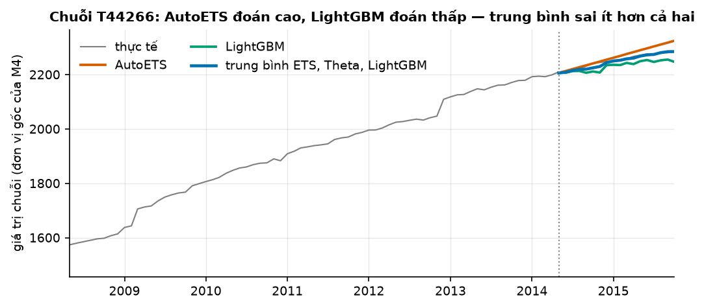
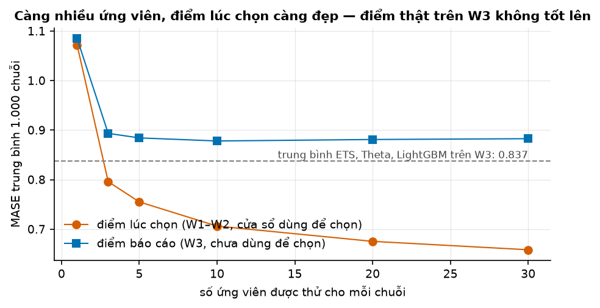
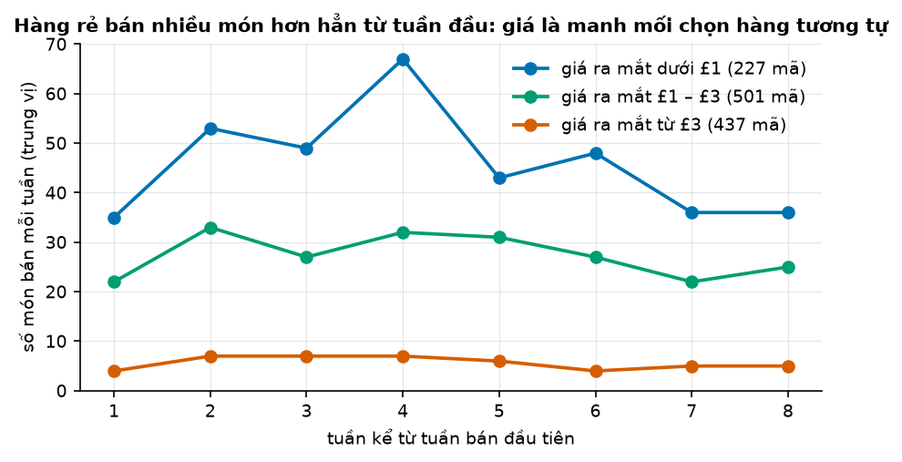

# Buổi 24 — Ensemble, AutoML và ca khó

## 1. Mục tiêu

Sau buổi này bạn:

- Kết hợp vài dự báo bằng **trung bình**, và giải thích vì sao trung bình thường thắng từng mô hình.
- Biết khi nào trọng số "tối ưu" thua trọng số đều (**combination puzzle**), và ước lượng trọng số mà không nhìn đoạn báo cáo.
- Đo **khoảng lạc quan** khi chọn mô hình tốt nhất trong nhiều ứng viên, và báo cáo trên đoạn chưa từng dùng để chọn.
- Chạy **AutoGluon-TimeSeries** có giới hạn thời gian, đọc bảng xếp hạng và trọng số ensemble của nó.
- Dự báo 8 tuần đầu của **sản phẩm mới** (cold start) bằng hàng tương tự, và chọn "tương tự theo cái gì" bằng backtest.

Sản phẩm: trên 1.000 chuỗi M4, ensemble trung bình ETS + Theta + LightGBM thắng mô hình đơn tốt nhất trên đoạn báo cáo chưa từng dùng để
chọn; dự báo cold start thắng "trung bình danh mục".

## 2. Nhắc lại buổi trước

- **Sai số** = thực tế − dự báo. **MAE**: trung bình trị tuyệt đối sai số. **MASE**: MAE chia cho MAE của một cách đoán ngây thơ trên phần
  học. Ở buổi này cách đoán đó là "lặp lại cùng tháng năm trước"; MASE dưới 1 nghĩa là sai ít hơn nó.
- **Backtest rolling origin**: vài **cutoff** (tháng cuối được thấy). Ở mỗi cutoff chỉ học trên dữ liệu tới cutoff, rồi dự báo đoạn ngay sau. Mỗi
  đoạn được chấm gọi là một **cửa sổ**.
- **Seasonal naive**: lặp lại mùa trước. **AutoETS**: làm trơn hàm mũ, tự chọn dạng xu hướng và mùa vụ. **Theta**: đường xu hướng thẳng cộng
  làm trơn hàm mũ, từng thắng cuộc thi M3; AutoTheta tự chọn biến thể Theta hợp nhất. Các mô hình này học riêng mỗi chuỗi một mô hình.
- **LightGBM global**: một mô hình cây học chung mọi chuỗi. Chiến lược **direct**: mỗi tầm $h$ một mô hình riêng; **recursive** (đệ quy): một
  mô hình đoán bước kế tiếp, lấy dự báo đó làm đầu vào cho bước sau.
- **Siêu tham số, tune**: con số đặt trước khi học; tune là thử nhiều bộ rồi giữ bộ có điểm CV tốt nhất. CV phải theo thời gian.
- **Rò rỉ tương lai**: dùng số lúc dự báo chưa có. `kiem_ro_ri` (thư viện `tv`) tự bắt.
- **Độ lệch chuẩn** $\sigma$: cỡ dao động điển hình quanh trung bình. **Hệ số tương quan** $\rho$ của hai dãy, từ −1 tới 1: gần 1 là hay lên
  xuống cùng lúc, 0 là không liên quan, gần −1 là cái này lên thì cái kia xuống.

## 3. Trạng thái đầu buổi

Sau `python lab.py up` (trong thư mục `lab/`):

| Hạng mục | Trạng thái |
|---|---|
| Dữ liệu 1 | `du-lieu/raw/monash-m4-monthly/m4_monthly_dataset.tsf` — 48.000 chuỗi theo tháng của cuộc thi M4 (kinh tế, tài chính, dân số…), sha256 `473aa4fc814b` |
| Buổi dùng | 1.000 chuỗi chọn ngẫu nhiên (seed 0) trong các chuỗi dài ít nhất 150 tháng; giữ 150 tháng cuối |
| Chấm M4 | 3 cửa sổ 18 tháng: W1 sau cutoff tháng 95, W2 sau tháng 113, W3 sau tháng 131 (đánh số tháng từ 0) |
| Dữ liệu 2 | `du-lieu/raw/uci-online-retail-ii/online_retail_II.xlsx` — mọi hoá đơn của một cửa hàng bán buôn quà tặng ở Anh, 12/2009 → 12/2011, sha256 `572e36277c23` |
| Nguồn | Monash Time Series Forecasting Repository và UCI Machine Learning Repository, đều CC BY 4.0 |
| Môi trường | Python 3.12; pandas 2.3.3, statsforecast 2.0.3, lightgbm 4.7.0, autogluon.timeseries 1.6.2, torch 2.10.0 (bản CPU) |
| `code/ensemble.py` | `doc_m4`, `du_bao_30`, `mase`, `chon_va_bao_cao`, `lac_quan_theo_so_ung_vien`, `trong_so`, `ap_trong_so`, `chay_autogluon` |
| `code/cold_start.py` | `doc_san_pham`, `chia_tap`, `nhom_tuong_tu`, `du_bao_mot_ma`, `danh_gia`, `chon_k` |
| `code/lab.ipynb` | notebook của Lab, bước 1–7 |
| **Đang cố tình sai** | `CUA_SO_CHON` và `CUA_SO_BAO_CAO` là cùng ba cửa sổ: chọn mô hình và ước lượng trọng số trên chính đoạn dùng để báo cáo |
| **Triệu chứng** | "chọn mô hình tốt nhất cho từng chuỗi" đạt MASE 0,694, bỏ xa mọi mô hình; trọng số "tối ưu" đạt 0,677 |
| `python lab.py check` lúc này | ĐỎ: 2/6 test hỏng |

## 4. Lý thuyết

Bối cảnh chung: 30 **ứng viên** (mô hình hoặc cách kết hợp được đem ra so) cho 1.000 chuỗi M4. Gồm các mô hình thống kê của statsforecast
(từ Naive tới AutoETS, Theta), hai LightGBM global và vài cách kết hợp định sẵn. Mọi ứng viên có dự báo ở cả ba cửa sổ.

### Từ mới trong buổi

| Thuật ngữ | Nghĩa một câu | Ví dụ |
|---|---|---|
| kết hợp dự báo (ensemble) | Dự báo cuối là trung bình (đều hoặc có trọng số) của vài dự báo. | ETS đoán 108, LightGBM đoán 96 → kết hợp 102. |
| đa dạng | Các thành phần sai theo những cách khác nhau, sai số ít đi cùng chiều. | Một mô hình hay đoán cao, một mô hình hay đoán thấp. |
| MSE | Sai số bình phương trung bình: trung bình của sai số². | Sai số 2 và 4 → MSE (4 + 16) / 2 = 10. |
| trọng số kết hợp | Phần đóng góp của mỗi thành phần, cộng lại bằng 1. | 0,8 × A + 0,2 × B. |
| combination puzzle | Hiện tượng trọng số "tối ưu" ước lượng từ dữ liệu thường thua trọng số đều. | Trọng số học trên 36 tháng tệ hơn chia đều. |
| stacking | Học trọng số (hoặc một mô hình tầng trên) từ dự báo backtest của các thành phần. | Tầng 1: ETS, Theta; tầng 2: trọng số cho chúng. |
| khoảng lạc quan | Điểm báo cáo trên đoạn mới trừ điểm lúc chọn, của ứng viên được chọn. | Lúc chọn 0,66, trên đoạn mới 0,88 → lạc quan 0,22. |
| AutoML | Công cụ tự thử nhiều mô hình, tự chọn và tự kết hợp trong một giới hạn thời gian. | AutoGluon-TimeSeries. |
| leaderboard | Bảng xếp hạng các mô hình AutoML đã thử, kèm điểm. | ETS 0,88, Theta 0,90… |
| cold start | Dự báo cho chuỗi chưa có (hoặc gần như chưa có) lịch sử. | Mã hàng mới lên kệ tuần này. |
| hàng tương tự (analog) | Sản phẩm đã bán, giống sản phẩm mới ở điểm nào đó, dùng đường bán của nó làm dự báo. | Mã mới giá £0,85 → xem các mã giá gần £0,85. |

### 4.1 Kết hợp dự báo: vì sao trung bình thường thắng

**Vấn đề.** Có sẵn dự báo của AutoETS, Theta và LightGBM. Chọn một cái, hay lấy trung bình?

**Trực giác.** Hai người đoán cân nặng một con bò: một người hay đoán dư, một người hay đoán thiếu. Lấy trung bình thì phần dư và phần thiếu
bù cho nhau.

**Ví dụ số nhỏ — tự tính tay.** Thực tế 100. A đoán 108, B đoán 96.

| | Dự báo | Sai số = thực tế − dự báo | Trị tuyệt đối |
|---|---|---|---|
| A | 108 | −8 | 8 |
| B | 96 | +4 | 4 |
| trung bình A, B | 102 | −2 | 2 |

**Đọc bảng.** Hai sai số trái dấu nên trung bình chỉ sai 2, ít hơn cả B là người đoán giỏi hơn. Nếu B đoán 104, cùng phía với A, thì trung
bình sai 6: nằm giữa hai mức sai. Trung bình không bao giờ sai nhiều hơn trung bình của các mức sai thành phần; nó thắng cả thành phần tốt
nhất khi các sai số hay trái dấu.

**Công thức.** Hai dự báo có sai số cùng độ lệch chuẩn $\sigma$, hệ số tương quan giữa hai sai số là $\rho$:

$$
\text{độ lệch chuẩn sai số của trung bình} = \sigma \sqrt{\frac{1 + \rho}{2}}
$$

- $\sigma$: độ lệch chuẩn sai số của mỗi dự báo; $\rho$: tương quan giữa hai sai số, từ −1 tới 1.

**Nói bằng lời.** Sai số hai mô hình càng ít đi cùng nhau ($\rho$ nhỏ), trung bình càng lợi. Ví dụ $\sigma$ = 10 và $\rho$ = 0,5: sai số của trung
bình còn $10 \times \sqrt{0{,}75}$ ≈ 8,7. Bảng dưới cho thêm hai mức $\rho$.

| Tương quan sai số $\rho$ | 1 (hai mô hình như nhau) | 0,5 | 0 |
|---|---|---|---|
| độ lệch chuẩn sai số của trung bình ($\sigma$ = 10) | 10 | 8,7 | 7,1 |

Vì vậy **đa dạng quan trọng hơn chất lượng từng thành phần**: thêm một mô hình hơi kém nhưng sai theo kiểu khác thường có lợi hơn thêm một bản
sao của mô hình giỏi.



**Cách đọc hình.**

1. **Trục ngang**: tháng, từ 2008 tới 2015; đường chấm là cutoff tháng 131.
2. **Trục dọc**: giá trị của chuỗi T44266 (đơn vị gốc của M4, không ghi rõ).
3. **Màu**: xám là thực tế; cam AutoETS; xanh lá LightGBM; xanh dương đậm là trung bình ETS, Theta, LightGBM.
4. **Nhìn vào đâu**: 18 tháng sau đường chấm.
5. **Kết luận**: AutoETS kéo xu hướng lên quá dốc, LightGBM đi ngang; trung bình nằm sát thực tế. MAE: AutoETS 15,2, LightGBM
   19,6, trung bình 4,5 (đơn vị gốc).

**Dữ liệu thật.** MASE trung bình 1.000 chuỗi trên cửa sổ báo cáo W3:

| Ứng viên | MASE W3 |
|---|---|
| seasonal naive | 1,174 |
| AutoETS | 0,892 |
| AutoTheta | 0,889 |
| LightGBM global | 0,855 |
| trung bình AutoETS, AutoTheta | 0,867 |
| **trung bình AutoETS, AutoTheta, LightGBM** | **0,837** |

**Đọc bảng.** So dòng cuối với ba dòng mô hình đơn: trung bình thắng cả LightGBM, thành phần tốt nhất. So hai dòng trung bình: thêm LightGBM
(một mô hình học kiểu khác hẳn ETS và Theta) giảm từ 0,867 xuống 0,837; trung bình chỉ hai mô hình thống kê, vốn sai giống nhau, lợi ít hơn.

**Tóm lại.** **Trung bình vài dự báo triệt tiêu một phần sai số trái dấu. Lợi càng nhiều khi các thành phần càng khác nhau. Trên M4, trung bình
ETS, Theta, LightGBM thắng từng mô hình.**

**Tự kiểm tra.** Thực tế 50. A đoán 56, B đoán 47, C đoán 50. Tính sai số của trung bình A, B, C và so với sai số của từng dự báo.

<details>
<summary>Đáp án</summary>

Trung bình (56 + 47 + 50) / 3 = 51, sai số 50 − 51 = **−1**. Sai số từng dự báo: A −6, B +3, C 0. Trung bình thắng A và B nhưng thua C, dự báo
đúng tuyệt đối ở lần này. Nhầm hay gặp: nghĩ trung bình luôn thắng mọi thành phần ở mọi lần. Nó chỉ không bao giờ tệ hơn **trung bình các mức
sai** (ở đây 3). Nó thắng thành phần tốt nhất khi tính trên nhiều lần dự báo, nếu sai số hay trái dấu.

</details>

### 4.2 Trọng số: combination puzzle và stacking

**Vấn đề.** LightGBM tốt hơn ETS trên backtest. Sao không cho nó trọng số lớn hơn? Còn cách "tối ưu" hơn: tìm trọng số làm sai số backtest nhỏ
nhất.

**Trực giác.** Trọng số tính từ dữ liệu cũng là một con số **ước lượng**, nên cũng có sai. Mỗi chuỗi chỉ có hai cửa sổ backtest (36 tháng) để
ước lượng. Với ít dữ liệu như vậy, trọng số "tối ưu" học cả nhiễu. Có chuỗi được gán trọng số 1,9 cho một mô hình (lấy gấp 1,9 lần dự báo của nó), vì
mô hình đó tình cờ đúng ở vài tháng backtest. Trọng số đều không cần ước lượng gì nên không có sai số ước lượng. Đó là **combination puzzle**: trong thực tế, trọng số đều rất khó thắng.

**Ví dụ số nhỏ — tự tính tay.** Trọng số tỷ lệ nghịch với sai số bình phương trung bình (MSE) trên backtest: MSE là trung bình của sai số².
A có MSE 4, B có MSE 16:

- nghịch đảo: 1/4 = 0,25 và 1/16 = 0,0625; tổng 0,3125;
- trọng số A = 0,25 / 0,3125 = **0,8**;
- trọng số B = 0,0625 / 0,3125 = **0,2**.

Mô hình sai bình phương gấp 4 lần thì nặng bằng 1/4. Cách này "co" về trọng số đều hơn cách tối ưu: không trọng số nào âm hay vượt 1.

**Công thức.**

$$
w_j = \frac{1 / \text{MSE}_j}{\sum_k 1 / \text{MSE}_k}, \qquad \hat y_{\text{kết hợp}} = \sum_j w_j \, \hat y_j
$$

- $j$: thành phần thứ $j$; $\text{MSE}_j$: sai số bình phương trung bình của nó **trên backtest trước đoạn báo cáo**; $\hat y_j$: dự báo của nó.

**Nói bằng lời.** Trọng số của mỗi mô hình tỷ lệ với 1/MSE của nó, rồi chia cho tổng để cộng lại bằng 1: MSE 4 và 16 cho trọng số 0,8 và 0,2.

**Stacking và rò rỉ tầng 2.** Ước lượng trọng số từ dự báo backtest của các thành phần gọi là stacking: tầng 1 là các mô hình, tầng 2 là cách
kết hợp chúng. Tầng 2 cũng là một mô hình, nên cũng phải học trên quá khứ và chấm trên đoạn nó chưa thấy. Ước lượng trọng số trên cả đoạn báo
cáo là **rò rỉ tầng 2**: kết quả đẹp giả tạo.

**Dữ liệu thật.** Trọng số riêng cho từng chuỗi, cho ba thành phần AutoETS, AutoTheta, LightGBM:

| Trọng số | Ước lượng trên | MASE W3 |
|---|---|---|
| đều (1/3 mỗi mô hình) | — | 0,837 |
| nghịch MSE | W1, W2 | **0,824** |
| "tối ưu" (bình phương tối thiểu, không âm) | W1, W2 | 0,965 |
| "tối ưu" — **sai**: rò rỉ tầng 2 | W1, W2, W3 | 0,677 |

**Đọc bảng.** Ba dòng đầu ước lượng trung thực. Trọng số "tối ưu" tệ hơn cả trung bình đều và tệ hơn từng thành phần: nó học nhiễu của 36
tháng. Nghịch MSE nhỉnh hơn đều vì nó chỉ lệch nhẹ khỏi 1/3. Dòng cuối nhìn như tuyệt vời vì trọng số đã được chỉnh theo chính W3.

> **Nâng cao — có thể bỏ qua lần đọc đầu.** Khi có nhiều dữ liệu để ước lượng, trọng số học được có thể thắng đều. Ví dụ: một bộ trọng số chung
> cho cả nghìn chuỗi. Puzzle là chuyện sai số ước lượng, không phải "trọng số vô dụng" (Claeskens et al. 2016; Frazier et al. 2023). FFORMA
> (Montero-Manso et al. 2020) đứng hạng nhì cuộc thi M4 theo hướng đó. Một mô hình gradient boosting học trọng số cho từng chuỗi từ các đặc
> trưng của chuỗi (độ mạnh xu hướng, mùa vụ, tự tương quan…), huấn luyện trên hàng chục nghìn chuỗi.

**Tóm lại.** **Trọng số ước lượng từ ít dữ liệu mang theo nhiễu, nên trọng số "tối ưu" thường thua trọng số đều. Nếu dùng trọng số, chọn cách co
về đều (nghịch MSE), và chỉ ước lượng trên backtest trước đoạn báo cáo.**

**Tự kiểm tra.** Ba mô hình có MSE backtest 2, 4, 4. Tính trọng số nghịch MSE.

<details>
<summary>Đáp án</summary>

Nghịch đảo là 1/2, 1/4, 1/4; tổng đúng bằng 1 nên trọng số chính là các nghịch đảo đó: **1/2, 1/4, 1/4**. Nhầm hay gặp: lấy trọng số tỷ lệ thuận với MSE (0,2; 0,4; 0,4), tức là cho mô
hình sai nhiều nhất trọng số lớn nhất.

</details>

### 4.3 Khoảng lạc quan khi chọn mô hình

**Vấn đề.** Thử 30 ứng viên, giữ cái có MASE nhỏ nhất, báo cáo con số đó. Sếp nhận con số, rồi thấy dự báo thật tệ hơn. Chuyện gì đã xảy ra?

**Trực giác.** Điểm backtest của mỗi ứng viên gồm hai phần: tài thật và **may rủi** của đúng những tháng đó. Khi chọn cái nhỏ nhất trong nhiều cái, ta
chọn cả tài lẫn may. Trên đoạn mới, may không lặp lại. Giống chọn cầu thủ ghi nhiều bàn nhất một mùa: mùa sau anh ta thường ghi ít hơn. Càng thử
nhiều ứng viên, cái thắng càng nhiều khả năng thắng nhờ may.

**Ví dụ số nhỏ — tự tính tay.** Năm mô hình giỏi ngang nhau: MASE thật của cả năm là 1,00. Trên một cửa sổ backtest, may rủi làm điểm thành
0,90; 1,05; 0,97; 1,10; 0,93. Ta chọn mô hình đạt **0,90**. Trên cửa sổ mới, nó ra khoảng 1,00 như mọi mô hình khác. Khoảng lạc quan =
1,00 − 0,90 = **0,10**, dù ta không làm gì sai về kỹ thuật ngoài việc tin điểm lúc chọn.

**Công thức.**

$$
\text{khoảng lạc quan} = \text{điểm báo cáo của ứng viên được chọn} - \text{điểm lúc chọn của nó}
$$

- Điểm lúc chọn: MASE trên các cửa sổ dùng để chọn; điểm báo cáo: MASE trên cửa sổ chưa từng dùng để chọn.

**Nói bằng lời.** Lạc quan là phần điểm đẹp lên chỉ vì ta chọn trên chính dữ liệu đó: ở ví dụ, 1,00 − 0,90 = 0,10. Cách đo duy nhất là giữ riêng một
đoạn, **không dùng nó cho bất kỳ quyết định nào**, rồi chấm trên đó. Buổi này: chọn trên W1, W2; báo cáo trên W3.



**Cách đọc hình.**

1. **Trục ngang**: số ứng viên được thử cho mỗi chuỗi (1, 3, 5, 10, 20, 30; mỗi mức rút ngẫu nhiên 50 lần rồi lấy trung bình).
2. **Trục dọc**: MASE trung bình 1.000 chuỗi.
3. **Màu**: cam là điểm lúc chọn (trên W1, W2); xanh là điểm báo cáo của cùng lựa chọn đó (trên W3); gạch ngang là trung bình ETS, Theta, LightGBM trên W3.
4. **Nhìn vào đâu**: khoảng cách giữa hai đường khi đi sang phải.
5. **Kết luận**: thêm ứng viên thì điểm lúc chọn giảm đều, còn điểm báo cáo dừng quanh 0,88 từ vài ứng viên trở đi. Với 30 ứng viên, khoảng
   lạc quan là 0,22. Chọn riêng cho từng chuỗi vẫn thua ensemble định sẵn.

**Dữ liệu thật.**

| Cách làm | Điểm lúc chọn | Điểm báo cáo |
|---|---|---|
| **sai**: chọn cho từng chuỗi và báo cáo trên cả W1, W2, W3 | 0,694 | 0,694 |
| chọn cho từng chuỗi trên W1, W2; báo cáo W3 | 0,658 | 0,883 |
| chọn một ứng viên chung trên W1, W2; báo cáo W3 | 0,828 | 0,840 |
| ensemble định sẵn (trung bình ETS, Theta, LightGBM) — không chọn gì | — | **0,837** |

**Đọc bảng.** Dòng đầu là cách `code/` đang làm: con số bỏ xa mọi thứ, nhưng là điểm lúc chọn đem đi báo cáo. Dòng hai là cùng cách chọn, chấm
trung thực: tệ hơn cả LightGBM đơn (0,855). Chọn một ứng viên chung cho cả nghìn chuỗi thì lạc quan chỉ khoảng 0,01: mỗi lựa chọn dựa trên dữ liệu của
nghìn chuỗi, may rủi gần như triệt tiêu. Chọn riêng từng chuỗi, mỗi lựa chọn chỉ dựa trên 36 tháng.

**Tóm lại.** **Điểm của ứng viên thắng trên dữ liệu đã dùng để chọn luôn lạc quan, càng lạc quan khi càng nhiều ứng viên và càng ít dữ liệu cho
mỗi lựa chọn. Chọn trên một đoạn, báo cáo trên đoạn sau chưa dùng cho quyết định nào.**

**Tự kiểm tra.** Bạn chọn mô hình theo từng chuỗi trên W1, W2, rồi thấy W3 kém, bèn đổi sang ensemble vì nó "tốt nhất trên W3". Con số 0,837 của
ensemble trên W3 còn là điểm báo cáo trung thực không?

<details>
<summary>Đáp án</summary>

**Không hẳn.** Quyết định "chọn ensemble" giờ đã dựa trên W3, nên W3 thành đoạn chọn. Với một lựa chọn giữa hai phương án, lạc quan nhỏ, nhưng
muốn con số sạch phải có một đoạn thứ tư chưa dùng, hoặc quyết định trước (như buổi này: ensemble định sẵn từ đầu). Nhầm hay gặp: nghĩ chỉ "tune
tham số" mới làm bẩn đoạn báo cáo; mọi quyết định dựa trên đoạn đó đều làm bẩn.

</details>

### 4.4 AutoGluon-TimeSeries: AutoML có kiểm soát

**Vấn đề.** Thay vì tự dựng 30 ứng viên, giao cho một công cụ tự thử, tự chọn, tự kết hợp. Được gì, và phải kiểm gì?

**Trực giác.** AutoGluon-TimeSeries tự động làm quy trình của mục 4.1–4.3. Nó học một danh sách mô hình và giữ **18 tháng cuối** của dữ liệu học
làm đoạn kiểm. Rồi nó xếp hạng trên đoạn đó và dựng một ensemble có trọng số. Preset (bộ cấu hình định sẵn) `medium_quality` học
SeasonalNaive, ETS, Theta, hai mô hình dạng bảng (LightGBM đệ quy và direct) và hai mô hình tiền huấn luyện Chronos-2, Toto-2. Mô hình tiền huấn luyện
đã học sẵn trên kho dữ liệu lớn, dùng ngay không cần học lại.

**Ba điều phải kiểm.**

1. **Mô hình tiền huấn luyện đã thấy dữ liệu chưa?** Kho dữ liệu học sẵn của Chronos-2 và Toto-2 có chứa M4. Chấm chúng trên
   M4 là chấm trên đề đã xem. Buổi này loại chúng bằng `excluded_model_types=["Chronos2", "Toto2"]`; buổi 34 học cách dùng đúng.
2. **Điểm trên đoạn kiểm là điểm lúc chọn.** AutoGluon chọn và ghép mô hình theo điểm trên đoạn kiểm (cột `score_val` của leaderboard, cột
   "MASE đoạn kiểm" trong bảng dưới), nên điểm này lạc quan như mục 4.3.
3. **Giới hạn thời gian.** `time_limit` (giây) là trần: hết giờ thì các mô hình chưa học bị bỏ. Ghi lại con số này thì mới chạy lại được.

**Ví dụ số nhỏ — tự tính tay: ensemble tham lam.** AutoGluon dựng ensemble bằng cách lặp. Mỗi lượt thêm **một** mô hình, được chọn lại mô hình
cũ, sao cho trung bình các mô hình đã thêm có điểm kiểm tốt nhất. Trọng số = số lượt được chọn / tổng số lượt. Ba lượt: lượt 1 chọn ETS; lượt
2 chọn Theta (trung bình ETS với Theta tốt hơn ETS với chính nó); lượt 3 chọn ETS. Trọng số ETS 2/3, Theta 1/3.

**Dữ liệu thật.** Học trên dữ liệu tới cutoff tháng 131 (`time_limit=300`, xong sau 43 giây), chấm trên W3. Ensemble của AutoGluon có tên
WeightedEnsemble:

| Mô hình | MASE đoạn kiểm (tháng 114–131) | MASE W3 |
|---|---|---|
| WeightedEnsemble | 0,858 | 0,882 |
| ETS | 0,882 | 0,902 |
| Theta | 0,898 | 0,900 |
| RecursiveTabular | 1,027 | 1,005 |
| SeasonalNaive | 1,162 | 1,174 |
| DirectTabular | 1,586 | 1,809 |

Trọng số của WeightedEnsemble: ETS 0,554 (36 trên 65 lượt), Theta 0,292, RecursiveTabular 0,108, DirectTabular 0,046.

**Đọc bảng.** Mô hình được chọn (WeightedEnsemble) đẹp nhất trên đoạn kiểm nhưng tệ đi trên W3 (0,858 → 0,882): lạc quan như mục 4.3. Ensemble của AutoGluon
thắng từng mô hình của nó, nhưng thua ensemble tự dựng (0,837): hai mô hình dạng bảng của preset này yếu trên M4. LightGBM direct của ta chia mỗi chuỗi cho mức trung bình 12 tháng gần nhất để mọi chuỗi
cùng thang, nên học chung tốt hơn. AutoML là điểm xuất phát nhanh và một baseline mạnh, không thay được việc chấm trên đoạn chưa dùng.

**Tóm lại.** **AutoGluon tự học nhiều mô hình, xếp hạng trên 18 tháng cuối của dữ liệu học, ghép bằng ensemble tham lam. Loại mô hình tiền huấn luyện
đã thấy dữ liệu chấm, ghi `time_limit`, và chấm lại trên đoạn chưa dùng.**

**Tự kiểm tra.** Ensemble tham lam chạy 4 lượt, chọn lần lượt ETS, Theta, ETS, RecursiveTabular. Trọng số mỗi mô hình là bao nhiêu?

<details>
<summary>Đáp án</summary>

ETS 2/4 = **0,5**; Theta **0,25**; RecursiveTabular **0,25**. Nhầm hay gặp: chia đều cho ba mô hình xuất hiện (1/3 mỗi cái); trọng số đếm số
lượt, mô hình được chọn hai lần nặng gấp đôi.

</details>

### 4.5 Chuỗi ngắn và cold start

**Vấn đề.** 200 mã hàng ra mắt gần nhất trong dữ liệu (1/8 → 10/10/2011). Cần biết nhập bao nhiêu cho 8 tuần đầu, khi mã chưa bán một món nào.

**Trực giác.** Không có lịch sử của chính nó thì mượn lịch sử của **hàng tương tự**: các mã đã ra mắt trước đó, giống mã mới ở điểm nào đó. Lấy
đường bán 8 tuần đầu của chúng, tính trung vị (giá trị đứng giữa khi xếp tăng dần) từng tuần, làm dự báo. Câu hỏi then chốt là "tương tự theo cái gì": cùng danh mục, cùng giá, cùng
nhà cung cấp? Đó cũng là một lựa chọn phải chấm bằng backtest.

**Chuỗi ngắn** (chưa tới hai chu kỳ mùa vụ, ví dụ dưới 24 tháng với mùa vụ năm) là trường hợp nhẹ hơn của cùng vấn đề: quá ít dữ liệu để học mùa vụ riêng. Cách chữa giống nhau: mô hình
đơn giản, hoặc **gộp** với chuỗi tương tự (mô hình global như LightGBM ở 4.1 học chung mọi chuỗi, nên chuỗi ngắn mượn được mùa vụ của chuỗi
dài). Mã hàng **đổi mã** thì nối lịch sử mã cũ vào mã mới trước khi dự báo; mã **ngừng bán** thì cắt khỏi tập, đừng để mô hình học đoạn 0 cuối như
nhu cầu thật.

**Luật không rò rỉ.** Lúc mã mới ra mắt ngày $T$, chỉ những mã đã **bán xong 8 tuần đầu trước $T$** mới dùng làm hàng tương tự. Mã ra mắt 3 tuần
trước $T$ chưa có tuần 4–8; dùng nó là mượn tương lai.

**Ví dụ số nhỏ — tự tính tay.** Mã mới giá £0,90. Ba mã đã bán xong có giá gần nhất và 4 tuần đầu (rút gọn từ 8):

| Mã tương tự | Giá ra mắt | Tuần 1 | Tuần 2 | Tuần 3 | Tuần 4 |
|---|---|---|---|---|---|
| P | £0,85 | 30 | 50 | 40 | 60 |
| Q | £0,95 | 20 | 40 | 60 | 30 |
| R | £0,79 | 100 | 10 | 50 | 40 |
| **trung vị** | | **30** | **40** | **50** | **40** |

**Đọc bảng.** Trung vị từng cột là dự báo, tổng 160 món. Dùng trung vị chứ không trung bình: tuần đầu của R có
đơn sỉ lớn, trung bình tuần đó sẽ bị kéo lên 50.



**Cách đọc hình.**

1. **Trục ngang**: tuần kể từ tuần bán đầu tiên, 1 tới 8.
2. **Trục dọc**: số món bán mỗi tuần, trung vị qua các mã (mã ra mắt 3/2010 → 7/2011).
3. **Màu**: xanh dương giá ra mắt dưới £1; xanh lá £1–£3; cam từ £3.
4. **Nhìn vào đâu**: khoảng cách giữa ba đường.
5. **Kết luận**: mã dưới £1 bán vài chục món mỗi tuần, mã từ £3 chỉ vài món. Giá phân biệt được mức bán rất rõ, nên là ứng viên tốt để chọn hàng
   tương tự.

**Dữ liệu thật.** 200 mã ra mắt 1/8 → 10/10/2011. Chấm trên **tổng 8 tuần** (lượng cần nhập); trung vị tổng thực tế 330 món. Số mã tương tự
theo giá, $k$ = 40, chọn trên 347 mã ra mắt sớm hơn (đầu 2011 tới trước tập 200), không chọn trên tập báo cáo.

| Cách dự báo | MAE tổng 8 tuần (món) | Tỷ lệ mã có dự báo trong khoảng nửa tới gấp đôi thực tế |
|---|---|---|
| đoán 0 | 509,0 | — |
| trung bình danh mục: mức bán mỗi tuần của các mã cùng danh mục, 8 tuần trước ra mắt | 446,6 | 31,5% |
| hàng tương tự cùng danh mục | 446,5 | 24,0% |
| **hàng tương tự theo giá gần nhất** ($k$ = 40) | **400,6** | **34,5%** |

"Danh mục" ở đây đoán từ tên hàng (tiếng Anh) bằng một danh sách từ khoá như "thiệp", "tranh treo tường", "ruy băng"; 16/200 mã không khớp từ
khoá nào.

**Đọc bảng.** So dòng cuối với dòng "trung bình danh mục": hàng tương tự theo giá giảm MAE khoảng 10%. Hàng tương tự cùng danh mục thì không hơn
gì: danh mục đoán từ tên quá thô (từ khoá "thiệp" gom cả thiệp chúc mừng, bộ bài lẫn ví đựng thẻ; chiếc ô in hình bánh rơi vào nhóm "bánh"). Cả bảng cũng cho thấy cold start khó: cách tốt nhất vẫn chỉ đưa được 1/3 số mã vào khoảng
nửa tới gấp đôi thực tế. Thực tế nên nhập thận trọng rồi cập nhật dự báo ngay khi có vài tuần bán đầu.

**Tóm lại.** **Cold start mượn đường bán đầu của hàng tương tự đã bán xong trước ngày ra mắt, lấy trung vị. "Tương tự theo gì" phải chọn bằng
backtest: ở đây giá thắng danh mục đoán từ tên.**

**Tự kiểm tra.** Mã mới ra mắt tuần 3/10/2011. Mã S ra mắt tuần 15/8/2011. Dùng S làm hàng tương tự cho 8 tuần được không?

<details>
<summary>Đáp án</summary>

**Không.** 8 tuần đầu của S là các tuần 15/8 → 3/10; tuần thứ 8 (bắt đầu 3/10) chưa xong lúc mã mới ra mắt. Chỉ mã ra mắt từ tuần 8/8 trở về
trước mới đủ. Nhầm hay gặp: chỉ kiểm "S ra mắt trước mã mới"; phải kiểm cả đường bán của S đã **kết thúc** trước đó.

</details>

## 5. Lab từng bước

Lệnh gõ trong terminal ở thư mục `lab/`. Code các bước nằm sẵn trong `code/lab.ipynb` (mở bằng `python lab.py notebook` hoặc VS Code), chạy
từng ô từ trên xuống. Bạn sửa `code/ensemble.py`; notebook tự nạp lại bản mới.

### Bước 1 — Dữ liệu và 30 ứng viên

**Mục đích:** dựng dự báo của 30 ứng viên ở ba cửa sổ cho 1.000 chuỗi M4.

```bash
python lab.py up           # một lần: môi trường (~2 GB, có AutoGluon và torch CPU) + dữ liệu, kiểm sha256
python lab.py check        # 2/6 test đỏ
python lab.py notebook     # chạy ô bước 1: lần đầu 3–6 phút, lưu vào du-lieu/cache/
```

**Đọc kết quả:** bảng MASE theo cửa sổ; dòng đầu (MASE W3 nhỏ nhất) là các trung bình có LightGBM, dòng cuối là HistoricAverage (trung bình toàn bộ lịch sử).

### Bước 2 — Ensemble định sẵn so với mô hình đơn

**Mục đích:** so trung bình ETS, Theta, LightGBM với từng thành phần trên W3 (mục 4.1).

**Đọc kết quả:** bảng như mục 4.1: 0,837 so với LightGBM 0,855. Thấy trung bình tệ hơn thành phần tốt nhất thì kiểm lại xem có lấy nhầm cột.

### Bước 3 — Chọn mô hình cho từng chuỗi

**Mục đích:** thấy triệu chứng của chỗ cố tình sai, sửa, đo lại (mục 4.3).

**Đọc kết quả:** lúc đầu "chọn cho từng chuỗi" in một con số thắng xa ensemble (mục 3). Sửa trong `code/ensemble.py`: `CUA_SO_CHON = [95, 113]`,
`CUA_SO_BAO_CAO = [131]`, và thêm vào đầu `chon_va_bao_cao` một dòng `assert` rằng hai nhóm cửa sổ không chung phần tử và mọi cửa sổ chọn nằm
trước cửa sổ báo cáo. Chạy lại: 0,658 lúc chọn, 0,883 báo cáo. Ô tiếp theo vẽ hình khoảng lạc quan theo số ứng viên (khoảng 30 giây).

### Bước 4 — Trọng số

**Mục đích:** so trọng số đều, nghịch MSE, "tối ưu" (mục 4.2).

**Đọc kết quả:** trước khi sửa bước 3, "tối ưu" in 0,677 (rò rỉ tầng 2); sau khi sửa, bảng như mục 4.2. `trong_so` dùng `CUA_SO_CHON`
làm mặc định, nên sửa ở bước 3 sửa luôn chỗ này.

### Bước 5 — AutoGluon

**Mục đích:** chạy `medium_quality` với giới hạn 300 giây, bỏ Chronos-2 và Toto-2 (mục 4.4).

**Đọc kết quả:** leaderboard sáu dòng như mục 4.4 và trọng số ensemble. Con số của máy bạn có thể lệch ở chữ số thứ ba nếu máy chậm tới mức chạm
giới hạn thời gian; khi đó leaderboard thiếu mô hình.

### Bước 6 — Cold start

**Mục đích:** so ba cách dự báo 8 tuần đầu cho 200 mã mới (mục 4.5).

**Đọc kết quả:** lần đầu đọc tệp Excel mất 1–2 phút. Ô in $k$ = 40 chọn trên tập ra mắt sớm hơn, rồi bảng như mục 4.5 và hình đường ra mắt theo giá.

### Bước 7 — Kiểm tra

```bash
python lab.py check        # 6/6 xanh
```

**Mục đích:** chấm toàn bộ.

**Đọc kết quả:** xanh 6/6 là xong. `test_bao_cao_tren_cua_so_chua_dung_de_chon` còn đỏ thì hai nhóm cửa sổ vẫn chung phần tử hoặc báo cáo nằm
trước chọn.

## 6. Lỗi thường gặp & cách chẩn đoán

| Triệu chứng | Nguyên nhân | Chẩn đoán | Sửa |
|---|---|---|---|
| "Mô hình tốt nhất" thắng xa mọi thứ trong báo cáo, dự báo thật thì thường | chọn và báo cáo trên cùng đoạn | điểm lúc chọn và điểm báo cáo có phải từ hai đoạn khác nhau không | giữ một đoạn chỉ để báo cáo (mục 4.3) |
| Trọng số "tối ưu" đẹp trên backtest, tệ khi dùng | ước lượng từ quá ít điểm, hoặc rò rỉ tầng 2 | trọng số có vượt 1, có âm, có đổi mạnh giữa các cửa sổ không | trọng số đều hoặc nghịch MSE, ước lượng trước đoạn báo cáo (mục 4.2) |
| Ensemble không hơn thành phần tốt nhất | các thành phần sai giống nhau | tương quan sai số giữa các thành phần | thêm mô hình khác loại (ML cạnh thống kê) |
| Mô hình tiền huấn luyện thắng áp đảo trên benchmark công khai | benchmark nằm trong dữ liệu tiền huấn luyện | đọc danh sách dữ liệu huấn luyện của mô hình | loại khỏi so sánh, hoặc chấm trên dữ liệu sau mốc cắt |
| Chạy AutoGluon hai lần ra hai leaderboard | chạm `time_limit`, máy khác tốc độ | cột `fit_time_marginal`, số mô hình trong leaderboard | tăng giới hạn hoặc cố định danh sách mô hình, ghi `random_seed` |
| Cold start đẹp giả tạo | dùng hàng tương tự chưa bán xong trước ngày ra mắt | ngày ra mắt + 8 tuần của hàng tương tự có ≤ ngày ra mắt mã mới không | lọc như `nhom_tuong_tu` (mục 4.5) |
| Dự báo sản phẩm mới quá cao | lấy trung bình đường bán, bị đơn sỉ lớn kéo lên | so trung bình và trung vị | dùng trung vị |
| Dự báo âm hoặc vượt sức chứa | mô hình không biết giới hạn | đếm dự báo ngoài khoảng | cắt về khoảng, hoặc biến đổi logit có tỷ lệ (bài tập 3) |

## 7. Bài tập về nhà

1. **AutoGluon `high_quality`.** Chạy với `time_limit=1200` (20 phút), vẫn loại Chronos-2 và Toto-2. Leaderboard có thêm những mô hình nào? MASE W3
   của ensemble có thắng 0,837 không? Ghi lại số mô hình bị bỏ vì hết giờ.
2. **Lạc quan và cỡ đoạn chọn.** Lặp bước 3 nhưng chỉ chọn trên W2, tức một nửa dữ liệu chọn. Khoảng lạc quan với 30 ứng viên lớn hơn hay nhỏ
   hơn lúc chọn trên W1, W2? Giải thích bằng mục 4.3.
3. **Dự báo trong khoảng.** Với chuỗi $0 \le y \le U$, biến đổi $z = \log\frac{y}{U - y}$ (logit có tỷ lệ), dự báo $z$, rồi đổi ngược
   $y = \frac{U e^z}{1 + e^z}$. Thử cho tỷ lệ ngày có bán của một mã (U = 1): dự báo có còn vượt 1 không?
4. **Cold start kết hợp.** Lấy trung vị của hàng tương tự **cùng danh mục và giá gần nhất** (20 mã). Chọn bằng tập ra mắt sớm hơn, rồi chấm trên 200 mã.

## 8. Tiêu chí "Xong khi"

- [ ] `python lab.py check` xanh 6/6.
- [ ] Tính tay được sai số của một trung bình, trọng số nghịch MSE, và trọng số của ensemble tham lam.
- [ ] Bảng MASE W3 có ensemble định sẵn thắng mô hình đơn tốt nhất; mọi con số báo cáo lấy từ W3, W3 không dùng cho quyết định nào.
- [ ] Hình khoảng lạc quan theo số ứng viên, kèm một câu giải thích cho người không làm dự báo.
- [ ] Leaderboard AutoGluon kèm `time_limit`, danh sách mô hình bị loại và lý do.
- [ ] Cold start: bảng ba cách, cách theo giá thắng "trung bình danh mục"; $k$ chọn trên tập ra mắt sớm hơn.

## 9. Đọc thêm

- Hyndman, R.J. & Athanasopoulos, G. *Forecasting: Principles and Practice* (3rd ed), §13.4 Forecast combinations: https://otexts.com/fpp3/combinations.html
- Wang, X., Hyndman, R.J., Li, F. & Kang, Y. (2023). Forecast combinations: an over 50-year review. *IJF* 39(4).
- Claeskens, G., Magnus, J.R., Vasnev, A.L. & Wang, W. (2016). The forecast combination puzzle: A simple theoretical explanation. *IJF* 32(3).
- Montero-Manso, P., Athanasopoulos, G., Hyndman, R.J. & Talagala, T.S. (2020). FFORMA: Feature-based forecast model averaging. *IJF* 36(1).
- Cawley, G.C. & Talbot, N.L.C. (2010). On over-fitting in model selection and subsequent selection bias in performance evaluation. *JMLR* 11.
- Caruana, R. et al. (2004). Ensemble selection from libraries of models. *ICML*.
- AutoGluon-TimeSeries: https://auto.gluon.ai/stable/tutorials/timeseries/index.html
- Goodwin, P., Dyussekeneva, K. & Meeran, S. (2013). The use of analogies in forecasting the annual sales of new electronics products. *IMA Journal of Management Mathematics* 24(4).
