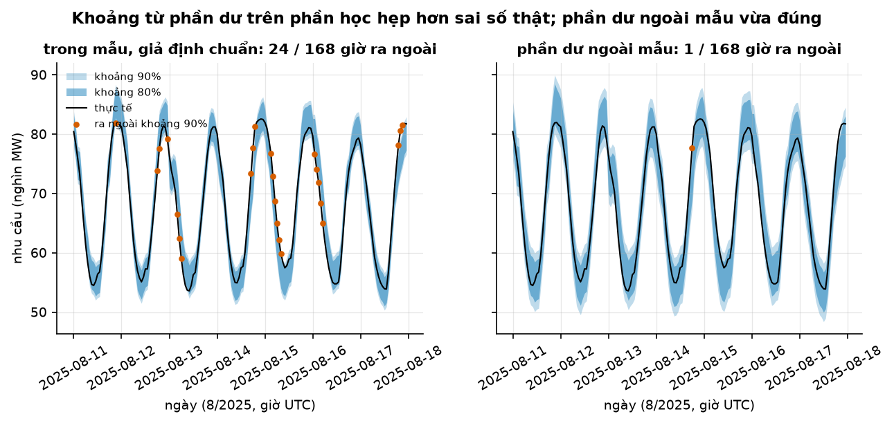
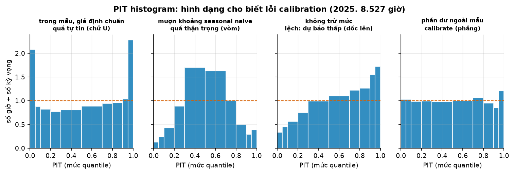
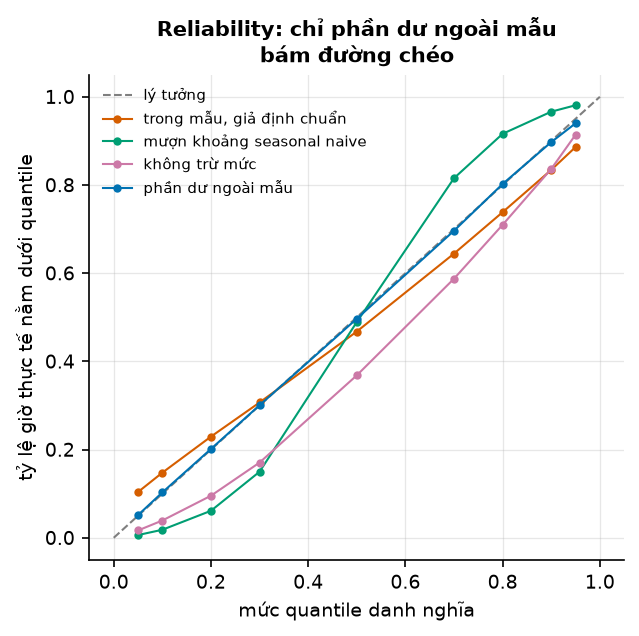
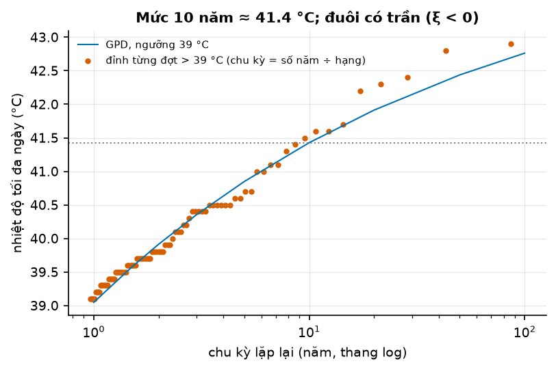

# Buổi 25 — Dự báo xác suất

## 1. Mục tiêu

Sau buổi này bạn:

- Dựng khoảng dự báo từ phần dư ngoài mẫu và giải thích bằng một con số vì sao phần dư trên phần học cho khoảng quá hẹp.
- Dự báo 9 quantile bằng LightGBM, sửa quantile cắt nhau, và giải thích vì sao tối thiểu **pinball loss** ra đúng quantile.
- Tự viết pinball loss, **CRPS** từ mẫu và **WIS**, và kiểm chúng khớp thư viện tới chữ số cuối.
- Đọc lỗi **calibration** của một mô hình từ PIT histogram và reliability diagram: quá tự tin, quá thận trọng, hay lệch.
- Ước lượng mức nhiệt độ "10 năm mới vượt một lần" bằng **peaks-over-threshold**.

Sản phẩm: dự báo 9 quantile nhu cầu điện ERCOT 24 giờ tới, cả năm 2025, mỗi mức lệch dưới 5 điểm phần trăm so với danh nghĩa.

## 2. Nhắc lại buổi trước

- **Sai số** = thực tế − dự báo. **MAE**: trung bình trị tuyệt đối sai số. **Phần dư**: sai số trên chính dữ liệu mô hình đã học (trong mẫu); sai số trên
  dữ liệu mô hình chưa học gọi là sai số, hay phần dư, **ngoài mẫu**.
- **Backtest rolling origin**: chọn vài mốc cắt; ở mỗi mốc chỉ học trên dữ liệu trước mốc rồi dự báo đoạn sau. Buổi này học lại mô hình
  đầu mỗi tháng rồi dự báo cả tháng đó. **Seasonal naive** tuần: giờ này tuần sau bằng giờ này tuần này.
- **Phân phối**: bức tranh "giá trị nào hay xảy ra, giá trị nào hiếm". **Quantile mức τ** (đọc "tau"): mốc mà tỷ lệ τ số giá trị nằm dưới.
  Ví dụ: mười số từ 1 tới 10 thì quantile 0,8 khoảng bằng 8. **Trung vị** là quantile 0,5.
- **Độ lệch chuẩn** σ: cỡ dao động điển hình quanh trung bình. Với **phân phối chuẩn** (hình chuông), khoảng trung bình $\pm 1{,}28\sigma$ chứa 80%
  giá trị, $\pm 1{,}645\sigma$ chứa 90%.
- **Khoảng dự báo 90%**: khoảng mà thực tế rơi vào 90% số lần. **Coverage** (tỷ lệ phủ): tỷ lệ số lần thực tế rơi vào khoảng, đo trên backtest.
- **LightGBM**: ghép nhiều cây nhỏ, cây sau học phần còn sai của cây trước; mỗi **lá** (nhánh cuối) trả trung bình các dòng rơi vào nó. **Cây không ngoại suy**: dự báo không vượt khoảng giá trị đã học,
  nên chuỗi tăng thì học trên độ lệch so với mức gần đây (trừ mức) rồi cộng lại.
- **Rò rỉ tương lai**: đặc trưng dùng số chưa có lúc dự báo. `kiem_ro_ri` (thư viện `tv`) tự bắt.

## 3. Trạng thái đầu buổi

Sau `python lab.py up` (trong thư mục `lab/`):

| Hạng mục | Trạng thái |
|---|---|
| Dữ liệu 1 | `du-lieu/raw/eia930-balance-*/EIA930_BALANCE_202{4,5}_*.csv` — 4 tệp nửa năm, nhu cầu điện theo giờ mọi vùng điều độ Mỹ 1/2024 → 12/2025; sha256 `26768c495c3b`, `a602a8e577cf`, `fac4bb991dfa`, `1146158b9724`. Buổi dùng vùng ERCO (Texas) |
| Dữ liệu 2 | `du-lieu/raw/open-meteo-du-bao-luu-erco-2024-2025/` — nhiệt độ Dallas đã được dự báo trước 24 giờ, 17.544 giờ, sha256 `ad8753a7ffe9` |
| Dữ liệu 3 | `du-lieu/raw/open-meteo-dallas-tmax-1940-2025/` — nhiệt độ tối đa mỗi ngày ở Dallas 1940–2025 (ERA5), 31.412 ngày, sha256 `15bc72f4d845` |
| Nguồn | EIA (public domain); Open-Meteo (CC BY 4.0) |
| Chấm | năm 2025: 8.527 giờ có đủ dữ liệu; dự báo 24 giờ tới, học lại đầu mỗi tháng |
| Môi trường | Python 3.12; pandas 3.0.5, lightgbm 4.7.0, scoringrules 0.11.0, scipy 1.18.1 |
| `code/xac_suat.py` | `doc_dien`, `dac_trung`, `backtest`, `quantile_tu_phan_du`, `sua_crossing`, `du_bao_quantile`, `pinball`, `crps_mau`, `wis`, `ty_le_duoi`, `pit_tu_quantile`, `pot`, `muc_lap_lai` |
| `code/lab.ipynb` | notebook của Lab, bước 1–6 |
| **Đang cố tình sai** | `quantile_tu_phan_du` dùng phần dư trên phần học và giả định chuẩn; `sua_crossing` không sửa gì; `crps_mau` thiếu một nửa công thức |
| **Triệu chứng** | khoảng 90% chỉ phủ 78,2% số giờ; 1.866 giờ có quantile cắt nhau; CRPS tự viết gấp đôi thư viện |
| `python lab.py check` lúc này | ĐỎ: 3/9 test hỏng |

## 4. Lý thuyết

Bài toán chung: mỗi nửa đêm, đoán nhu cầu điện ERCOT cho một ngày tới. Đặc trưng: nhu cầu cùng giờ một, hai và bảy ngày trước, giờ trong
ngày, thứ, nhiệt độ đã dự báo; tất cả trừ đi mức trung bình của tuần gần nhất. Dự báo điểm (một con số) đạt MAE 2.088 MW; seasonal naive 4.777 MW.
Người vận hành lưới còn cần biết: con số đó có thể lệch bao nhiêu?

### Từ mới trong buổi

| Thuật ngữ | Nghĩa một câu | Ví dụ |
|---|---|---|
| dự báo xác suất | Dự báo cả phân phối (hay nhiều quantile), không chỉ một con số. | "Trung vị 60.000 MW; 90% nằm trong 55.000–65.000." |
| phần dư ngoài mẫu | Sai số trên dữ liệu mô hình chưa học, lấy từ backtest. | Mô hình học tới 31/5, sai số của tháng 6. |
| sample path | Một kịch bản đầy đủ cho cả 24 giờ tới, rút ngẫu nhiên. | 200 đường 24 giờ; mỗi đường là một kịch bản. |
| pinball loss | Điểm phạt cho một dự báo quantile: đoán thấp bị phạt τ lần phần thiếu, đoán cao bị phạt (1 − τ) lần phần thừa. | τ = 0,9, thật 10, đoán 8: phạt 0,9 × 2 = 1,8. |
| quantile regression | Mô hình học thẳng một quantile bằng cách tối thiểu pinball loss. | LightGBM `objective="quantile"`, `alpha=0.9`. |
| quantile cắt nhau (crossing) | Quantile mức cao lại nhỏ hơn quantile mức thấp. | Quantile 0,8 là 105 mà quantile 0,9 là 103. |
| CRPS | Điểm chấm cả một phân phối so với thực tế; dự báo một con số thì bằng sai số tuyệt đối. Nhỏ là tốt. | Mẫu (2, 4, 6), thật 5: CRPS ≈ 0,78. |
| interval score, WIS | Điểm của một khoảng (rộng + phạt phần thực tế ra ngoài); WIS gộp trung vị và nhiều khoảng. Nhỏ là tốt. | Trung vị 8, khoảng 80% [5; 9], thật 10: WIS = 1,6. |
| proper | Cách chấm mà khai đúng phân phối mình tin luôn cho điểm kỳ vọng tốt nhất. | Chấm bằng coverage không proper: khai khoảng vô cùng rộng là được 100%. |
| calibration | Dự báo nói "90%" thì đúng khoảng 90% số lần. | 1.000 giờ, khoảng 90% phủ 782 giờ: calibration kém. |
| sharpness (độ sắc) | Khoảng hẹp cỡ nào. Hẹp là tốt, chỉ khi vẫn calibrate. | Hai khoảng cùng phủ 90%: rộng 9.000 MW sắc hơn rộng 21.000 MW. |
| PIT, PIT histogram | Mức quantile mà thực tế rơi vào; histogram đếm các mức đó. Calibrate tốt thì PIT trải đều từ 0 tới 1. | Thực tế nằm giữa quantile 0,8 và 0,9: PIT trong khoảng 0,8–0,9. |
| reliability diagram | Biểu đồ mức danh nghĩa (ngang) so với tỷ lệ thực tế (dọc); tốt thì nằm trên đường chéo. | Mức 0,95 mà chỉ 88,6% giờ nằm dưới: điểm nằm dưới đường chéo. |
| phân phối Pareto tổng quát (GPD) | Dạng phân phối chung của phần vượt một ngưỡng cao; tham số ξ quyết định đuôi có trần hay dày. | ξ = −0,25: nhiệt độ có trần. |
| peaks-over-threshold (POT) | Giữ các đợt vượt một ngưỡng cao rồi khớp phân phối cho phần vượt. | 89 đợt nóng trên 39 °C trong 86 năm. |
| mức lặp lại N năm | Mức trung bình N năm mới bị vượt một lần. | Mức 10 năm 41,4 °C: mỗi năm khoảng 10% khả năng vượt. |

### 4.1 Khoảng từ phần dư: trong mẫu hay ngoài mẫu

**Vấn đề.** Cách nhanh nhất để có khoảng: lấy độ lệch chuẩn σ của phần dư, rồi dự báo ± 1,645σ cho khoảng 90%. Phần dư lấy ở đâu?

**Trực giác.** Phần dư trên phần học giống điểm thi thử của học sinh đã xem đề. Mô hình linh hoạt khớp sát dữ liệu nó đã học, nên sai ít trên
đó. Sai số khi dự báo thật (ngoài mẫu) lớn hơn. Khoảng dựng từ phần dư trong mẫu vì thế quá hẹp.

**Ví dụ số nhỏ — tự tính tay.** Phần dư trên phần học có σ = 1,2 MW. Khoảng 80% giả định chuẩn: dự báo ± 1,28 × 1,2 ≈ ± 1,5. Mười một sai
số ngoài mẫu của tháng trước, xếp tăng dần: $-6, -4, -3, -2, -1, 0, 1, 2, 3, 5, 7$.

- Chỉ ba trong mười một sai số (−1, 0 và 1) nằm trong ± 1,5: khoảng "80%" phủ khoảng 27% số lần.
- Quantile τ của n số đã xếp (cách NumPy mặc định): đứng ở vị trí τ × (n − 1), đếm từ 0; rơi giữa hai số thì lấy điểm ở giữa theo tỷ lệ.
- Mười một số: τ = 0,1 cho vị trí $0{,}1 \times 10 = 1$, tức số thứ hai, $-4$; τ = 0,9 cho vị trí 9, tức số thứ mười, $5$.
- Khoảng 80% ngoài mẫu: dự báo $-4$ tới dự báo $+5$.

Khoảng ngoài mẫu không cần giả định chuẩn và tự lệch được về một phía (ở đây phía trên dài hơn).

**Công thức.**

$$
\hat q_\tau = \hat y + \text{quantile}_\tau\big(e_{\text{ngoài mẫu}}\big)
$$

- $\hat y$: dự báo điểm; $\tau$: mức quantile; $e_{\text{ngoài mẫu}}$: sai số (thực tế − dự báo) của 3 tháng backtest ngay trước tháng đang dự báo.

**Nói bằng lời.** Quantile mức τ của dự báo bằng dự báo điểm cộng quantile mức τ của các sai số thật gần đây. Ở ví dụ, dự báo 60.000 MW thì
quantile 0,9 là 60.005. Rút ngẫu nhiên (có hoàn lại) nhiều sai số cũ, cộng vào dự báo, được một mẫu (cách **bootstrap phần dư**); CRPS ở mục 4.3 chấm mẫu đó.



**Cách đọc hình.**

1. **Trục ngang**: giờ, tuần 11–17/8/2025 (UTC).
2. **Trục dọc**: nhu cầu điện, nghìn MW.
3. **Màu**: đường đen là thực tế; dải xanh nhạt là khoảng 90%, xanh đậm là khoảng 80%; chấm cam là giờ thực tế ra ngoài khoảng 90%.
4. **Nhìn vào đâu**: số chấm cam ở hai ô.
5. **Kết luận**: khoảng trong mẫu bỏ lỡ 24 trong 168 giờ, nhiều nhất ở sườn tăng và giảm mỗi ngày; khoảng ngoài mẫu rộng hơn và chỉ lỡ 1 giờ.

**Dữ liệu thật.** Cả năm 2025, 8.527 giờ:

| Khoảng | Độ lệch chuẩn phần dư (MW) | Phủ khoảng 80% | Phủ khoảng 90% |
|---|---|---|---|
| trong mẫu, giả định chuẩn | 1.852 | 68,7% | 78,2% |
| ngoài mẫu, quantile sai số 3 tháng trước | 2.905 | 79,4% | 88,8% |

**Đọc bảng.** So hai dòng: sai số thật lớn hơn phần dư trên phần học khoảng 1,6 lần, nên khoảng trong mẫu hụt khoảng 11 điểm phần trăm ở cả
hai mức. Khoảng ngoài mẫu hụt khoảng 1 điểm.

> **Nâng cao — có thể bỏ qua lần đọc đầu.** Câu hỏi "tổng điện cả ngày mai vượt X với xác suất bao nhiêu" không trả lời được bằng cách cộng
> quantile 0,9 của 24 giờ. Lý do: 24 giờ hiếm khi cùng lúc đều ở mức cao. Phải rút sample path (cả 24 giờ một lần, ví dụ lấy nguyên sai số
> của một ngày cũ) rồi tính quantile của tổng.

**Tóm lại.** **Khoảng phải dựng từ sai số ngoài mẫu. Phần dư trên phần học của mô hình linh hoạt nhỏ hơn sai số thật, nên khoảng 90% chỉ phủ
78%.**

**Tự kiểm tra.** Chín sai số ngoài mẫu: $-8, -5, -3, -1, 0, 2, 3, 6, 9$. Dự báo điểm 200. Khoảng 80% (quantile 0,1 và 0,9) là bao nhiêu?

<details>
<summary>Đáp án</summary>

Chín số, quantile 0,1 ở vị trí 0,1 × 8 = 0,8: giữa số đầu (−8) và số thứ hai (−5), cách số đầu 0,8 khoảng: −8 + 0,8 × 3 = −5,6. Quantile 0,9 ở vị trí
7,2, giữa 6 và 9: 6 + 0,2 × 3 = 6,6.
Khoảng: 194,4 tới 206,6. Nhầm hay gặp: lấy ± độ lệch chuẩn mà bỏ qua việc sai số lệch về một phía.

</details>

### 4.2 Pinball loss và quantile regression

**Vấn đề.** Cách ở mục 4.1 cho mọi giờ cùng một bộ sai số. Nhưng lúc nóng đỉnh, sai số lớn hơn lúc đêm mát. Muốn mô hình tự học khoảng rộng hẹp
theo từng giờ thì cần một hàm mất mát mà tối thiểu nó ra đúng quantile.

**Trực giác.** MAE phạt đoán thấp và đoán cao như nhau, nên tối thiểu nó ra trung vị. Muốn quantile 0,8 thì phạt đoán thấp nặng gấp bốn lần đoán
cao (hệ số 0,8 so với 0,2). Mô hình sẽ nhích lên tới khi chỉ còn một phần năm số lần thực tế vượt dự báo.

**Ví dụ số nhỏ — tự tính tay.** Thực tế là mười số từ 1 tới 10; τ = 0,8. Thử dự báo hằng số q và cộng điểm phạt của 10 số:

- q = 7: ba số trên 7 bị phạt 0,8 × (1 + 2 + 3) = 4,8; sáu số dưới bị phạt 0,2 × (6 + 5 + … + 1) = 4,2. Tổng **9,0**.
- q = 8: 0,8 × (1 + 2) = 2,4 cộng 0,2 × (7 + 6 + … + 1) = 5,6. Tổng **8,0**.
- q = 9 cũng ra 8,0; mọi q từ 8 tới 9 đều ra 8,0, là nhỏ nhất.

Giá trị tốt nhất nằm đúng ở mốc có 80% số liệu bên dưới: quantile 0,8.

**Công thức.**

$$
L_\tau(y, q) = \begin{cases} \tau\,(y - q) & y \ge q \\ (1 - \tau)\,(q - y) & y < q \end{cases}
$$

- $y$: thực tế; $q$: dự báo quantile mức $\tau$.

**Nói bằng lời.** Thực tế cao hơn dự báo thì phạt τ lần phần thiếu; thấp hơn thì phạt $(1-\tau)$ lần phần thừa. Ví dụ τ = 0,9, thực tế 10: đoán thấp 2 đơn vị
bị phạt $0{,}9 \times 2 = 1{,}8$; đoán cao 2 đơn vị chỉ bị $0{,}1 \times 2 = 0{,}2$.

**Thư viện.** LightGBM học quantile với `objective="quantile", alpha=τ`; buổi này học 9 mô hình cho 9 mức 0,05 … 0,95. Mỗi mô hình học riêng,
nên có giờ quantile 0,9 lại nhỏ hơn quantile 0,8: **crossing**. Cách sửa đơn giản và không làm tăng pinball loss: sắp xếp lại 9 số của mỗi giờ
theo thứ tự tăng (Chernozhukov et al. 2010). Ví dụ 0,8 → 105, 0,9 → 103 thành 0,8 → 103, 0,9 → 105.

**Dữ liệu thật.** 21,9% số giờ năm 2025 có ít nhất một cặp quantile cắt nhau. Sau khi sắp xếp, tỷ lệ giờ nằm dưới từng quantile:

| Mức | 0,05 | 0,1 | 0,2 | 0,3 | 0,5 | 0,7 | 0,8 | 0,9 | 0,95 |
|---|---|---|---|---|---|---|---|---|---|
| tỷ lệ thật | 0,055 | 0,11 | 0,216 | 0,312 | 0,502 | 0,685 | 0,775 | 0,875 | 0,928 |

**Đọc bảng.** So từng ô với mức ở hàng trên: lệch xa nhất 2,5 điểm phần trăm (ở mức 0,8 và mức 0,9), đạt tiêu chí của buổi. Hai đầu hơi hẹp: 7,2%
giờ vượt quantile 0,95 thay vì 5%.

Mô hình quantile dùng lá ít nhất 1.000 dòng. Lá nhỏ thì cây học thuộc đuôi của phần học, và khoảng hẹp đi.

**Tóm lại.** **Tối thiểu pinball loss mức τ ra quantile τ. LightGBM học từng quantile riêng nên cần sắp xếp lại để hết crossing.**

**Tự kiểm tra.** τ = 0,25. Dự báo cao hơn thực tế 4 đơn vị bị phạt bao nhiêu? Thấp hơn 4 đơn vị thì sao? Vì sao hai số khác nhau?

<details>
<summary>Đáp án</summary>

Cao hơn 4: phạt (1 − 0,25) × 4 = **3**. Thấp hơn 4: phạt 0,25 × 4 = **1**. Quantile 0,25 là mức thấp, nên đoán cao
bị phạt nặng hơn, kéo dự báo xuống. Nhầm hay gặp: đảo hai hệ số, nhân phần thiếu với (1 − τ).

</details>

### 4.3 Chấm cả phân phối: CRPS, WIS và "proper"

**Vấn đề.** Hai mô hình cho hai phân phối. Cần một con số để so, giống MAE cho dự báo điểm. Con số đó phải không cho phép "ăn gian".

**Trực giác.** Chấm bằng coverage thì khai khoảng rất rộng là được 100%. Chấm bằng độ rộng thì khai rất hẹp. Cách chấm **proper** buộc người dự
báo khai đúng điều mình tin: nói dối theo hướng nào cũng làm điểm kỳ vọng tệ đi (Gneiting & Raftery 2007).

**CRPS từ mẫu.** Có một mẫu dự báo $X_1, \dots, X_m$ (ví dụ 200 kịch bản) và thực tế $y$:

$$
\text{CRPS} = \frac{1}{m}\sum_i \lvert X_i - y\rvert - \frac{1}{2m^2}\sum_i\sum_j \lvert X_i - X_j\rvert
$$

- Vế đầu: mẫu cách thực tế bao xa. Vế sau: nửa độ cách nhau trung bình giữa các phần tử của mẫu, tính trên mọi cặp.

**Nói bằng lời.** CRPS bằng khoảng cách trung bình tới thực tế, trừ đi một nửa độ trải của chính mẫu. Vế sau thưởng cho độ trải vừa đủ; thiếu nó,
mẫu co cụm về một điểm luôn thắng.

**Ví dụ số nhỏ — tự tính tay.** Mẫu (2, 4, 6), thực tế 5.

- Vế đầu: (3 + 1 + 1) / 3 ≈ 1,667.
- Vế sau: chín cặp (kể cả cặp một số với chính nó), khoảng cách $0, 2, 4, 2, 0, 2, 4, 2, 0$, tổng 16; $16/9 \approx 1{,}778$, một nửa $\approx 0{,}889$.
- CRPS ≈ 1,667 − 0,889 ≈ **0,778**. Một dự báo chỉ là số 4 có CRPS = |4 − 5| = 1: mẫu có độ trải hợp lý thắng.

**WIS.** Khi dự báo là vài quantile thay vì mẫu, dùng interval score cho khoảng $[l, u]$ mức $1 - \alpha$:

$$
IS_\alpha = (u - l) + \tfrac{2}{\alpha}(l - y)\,\mathbb 1[y < l] + \tfrac{2}{\alpha}(y - u)\,\mathbb 1[y > u]
$$

$$
\text{WIS} = \frac{1}{K + \frac12}\Big(\tfrac12\lvert y - q_{0,5}\rvert + \sum_{k=1}^{K} \tfrac{\alpha_k}{2}\, IS_{\alpha_k}\Big)
$$

- $\alpha = 1 -$ mức khoảng (khoảng 80% thì α = 0,2); $\mathbb 1[\cdot]$ bằng một khi điều trong ngoặc đúng, bằng không khi sai; $q_{0,5}$: trung vị;
  $K$: số khoảng.

**Nói bằng lời.** Điểm một khoảng bằng độ rộng, cộng phạt $2/\alpha$ lần phần thực tế vượt ra ngoài. WIS lấy trung bình có trọng số của sai số trung vị
và điểm các khoảng (Bracher et al. 2021). Với chín quantile của buổi này, K = 4 khoảng; WIS bằng tổng pinball loss của chín mức chia cho 4,5.

**Ví dụ số nhỏ — tự tính tay.** Trung vị 8, khoảng 80% [5; 9], thực tế 10. $IS_{0,2}$ = 4 + 10 × 1 = 14. WIS = (0,5 × 2 + 0,1 × 14) / 1,5 = **1,6**; bằng tổng pinball ba mức (0,1 × 5 + 0,5 × 2 + 0,9 × 1 = 2,4) chia 1,5.

**Dữ liệu thật.** Trên năm 2025, CRPS của 200 kịch bản phần dư ngoài mẫu là 1.571 MW; WIS của cùng cách là 1.408 MW. Bảng mục 4.4 có WIS của
mọi cách.

**Đọc số.** WIS gần như không phân biệt khoảng trong mẫu (phủ 78% thay vì 90%, WIS 1.412) với khoảng ngoài mẫu. Proper nghĩa là "khai đúng phân phối thật thì
điểm kỳ vọng tốt nhất". Nhưng không mô hình nào khai đúng phân phối thật; giữa hai mô hình đều sai, mô hình hẹp mà lỡ nhiều vẫn có thể ngang điểm mô hình calibrate. Vì thế luôn kiểm calibration riêng (mục 4.4).

**Tóm lại.** **CRPS chấm một mẫu, WIS chấm một bộ quantile; cả hai proper và nhỏ là tốt. Điểm tổng gộp nhiều thứ nên không thay được bước kiểm calibration.**

**Tự kiểm tra.** Mẫu (1, 3), thực tế 3. Tính CRPS. So với dự báo chỉ một số 2.

<details>
<summary>Đáp án</summary>

Vế đầu (2 + 0) / 2 = 1. Vế sau: 4 cặp, khoảng cách 0, 2, 2, 0, trung bình 1, một nửa là 0,5. CRPS = 1 − 0,5 = **0,5**. Dự báo số 2: |2 − 3| = **1**.
Mẫu (1, 3) tốt hơn. Nhầm hay gặp: quên vế sau, ra 1 và kết luận hai dự báo ngang nhau.

</details>

### 4.4 Calibration và sharpness: đọc PIT và reliability diagram

**Vấn đề.** Một mô hình calibrate kém thì kém theo kiểu nào: quá hẹp, quá rộng hay lệch? Mỗi kiểu sửa một cách.

**Trực giác.** Calibration là "nói 90% thì đúng 90%". Sharpness là khoảng hẹp. Mục tiêu: hẹp nhất có thể, với điều kiện đã calibrate (Gneiting &
Raftery 2007). Ghi mức quantile mà thực tế rơi vào mỗi giờ (PIT), rồi đếm. Calibrate tốt thì mọi mức đều gặp như nhau.

**Ví dụ số nhỏ — tự tính tay.** Mười giờ, khoảng 80% từ quantile 0,1 tới quantile 0,9. Calibrate thì kỳ vọng một giờ dưới quantile 0,1 và một
giờ trên quantile 0,9. Thực tế: ba giờ dưới, bốn giờ trên, ba giờ ở giữa.

- Hai cột ngoài cao gấp 3–4 lần kỳ vọng, cột giữa thấp: PIT hình chữ U, khoảng quá hẹp (quá tự tin).
- Nếu 0 giờ dưới, 0 giờ trên: hình vòm, khoảng quá rộng (quá thận trọng).
- Nếu 0 giờ dưới, 4 giờ trên: dốc lên, dự báo thấp hơn thực tế (lệch).

**Cách dựng PIT từ 9 quantile.** Chín quantile chia trục mức thành mười ô, mỗi ô nằm giữa hai mức liền nhau. Đếm số giờ rơi vào mỗi ô, chia
cho số kỳ vọng (ô từ mức 0 tới mức 0,05 kỳ vọng 5% số giờ). Calibrate thì mọi cột bằng một.



**Cách đọc hình.**

1. **Trục ngang**: PIT, tức mức quantile mà thực tế rơi vào; các cột rộng hẹp theo khoảng cách giữa 9 mức.
2. **Trục dọc**: số giờ trong ô chia cho số kỳ vọng; 1 là đúng.
3. **Bốn ô**: khoảng trong mẫu; quantile sai số seasonal naive gắn quanh dự báo LightGBM (mượn khoảng của mô hình cũ); LightGBM quantile học
   trên nhu cầu gốc, không trừ mức; phần dư ngoài mẫu.
4. **Nhìn vào đâu**: hình dạng so với đường gạch ở 1.
5. **Kết luận**: bốn hình dạng ứng với bốn chẩn đoán. Chữ U: quá tự tin. Vòm: quá thận trọng, vì khoảng mượn từ mô hình kém hơn. Dốc lên: dự
   báo thấp, vì năm 2025 nhu cầu cao hơn 2024 mà cây không ngoại suy. Phẳng: calibrate.



**Cách đọc hình.**

1. **Trục ngang**: mức quantile danh nghĩa, 0,05 … 0,95.
2. **Trục dọc**: tỷ lệ giờ thực tế nằm dưới quantile đó.
3. **Màu**: bốn cách, cùng tên như hình PIT; gạch xám là đường chéo lý tưởng.
4. **Nhìn vào đâu**: độ dốc và độ cao so với đường chéo.
5. **Kết luận**: phần dư ngoài mẫu nằm trên đường chéo. Đường thoải hơn đường chéo là quá tự tin, dốc hơn là quá thận trọng, cả đường nằm dưới
   đường chéo là dự báo thấp.

**Dữ liệu thật.**

| Cách | Dưới q 0,05 | Dưới q 0,95 | Phủ khoảng 90% | Rộng khoảng 90% (MW) | WIS |
|---|---|---|---|---|---|
| trong mẫu, giả định chuẩn | 10,4% | 88,6% | 78,2% | 6.092 | 1.412 |
| mượn khoảng seasonal naive | 0,6% | 98,1% | 97,5% | 21.275 | 1.829 |
| không trừ mức | 1,7% | 91,4% | 89,7% | 9.183 | 1.387 |
| phần dư ngoài mẫu | 5,1% | 94,0% | 88,8% | 9.425 | 1.408 |
| LightGBM quantile (đã sắp) | 5,5% | 92,8% | 87,3% | 9.329 | 1.483 |

**Đọc bảng.** Dòng "không trừ mức" phủ gần đủ 90% mà cột đầu chỉ 1,7% thay vì 5%: cả phân phối nằm thấp. Chỉ nhìn coverage sẽ bỏ sót lỗi này.

Dòng "mượn khoảng" phủ nhiều nhất nhưng rộng gấp 2,3 lần dòng phần dư ngoài mẫu, nên WIS tệ nhất. LightGBM quantile sắc gần bằng phần dư ngoài
mẫu nhưng hai đầu hơi hẹp.

**Tóm lại.** **Kiểm calibration ở từng mức, không chỉ khoảng 90%. PIT chữ U: quá hẹp; vòm: quá rộng; dốc: lệch. Trong các mô hình đã calibrate, chọn mô hình sắc nhất.**

**Tự kiểm tra.** Một mô hình có 2% giờ nằm dưới quantile 0,05 và 98% giờ nằm dưới quantile 0,95. PIT histogram có hình gì, và cần sửa khoảng thế nào?

<details>
<summary>Đáp án</summary>

Hai ô ngoài chỉ có 2% thay vì 5% mỗi ô: cột ngoài thấp, cột giữa cao, **hình vòm**. Khoảng quá rộng (quá thận trọng); thu hẹp lại, ví dụ dùng sai
số ngoài mẫu của chính mô hình này. Nhầm hay gặp: coi coverage 96% là "an toàn hơn nên tốt hơn"; khoảng rộng quá thì người vận hành bỏ qua nó.

</details>

### 4.5 Đuôi: peaks-over-threshold

**Vấn đề.** Kế hoạch lưới điện cần mức tải đỉnh hiếm, kiểu "10 năm mới gặp một lần". Tải đỉnh do nắng nóng. Hai năm dữ liệu tải chỉ có 7 đợt nóng
đỉnh tách biệt, quá ít để nói gì về 10 năm. Nhiệt độ thì có 86 năm.

**Trực giác.** Giá trị cực đoan hiếm, nên phần giữa của phân phối không nói được gì về chúng. POT chỉ giữ những đợt vượt một ngưỡng cao (mỗi đợt nóng
lấy ngày nóng nhất, để các ngày liền nhau không bị đếm nhiều lần). Phần vượt ngưỡng theo một dạng phân phối chung: **phân phối Pareto tổng quát**
(GPD), có tham số hình dạng ξ (đọc "xi"). ξ < 0: đuôi có trần; ξ = 0: đuôi giảm nhanh; ξ > 0: đuôi dày, cực đoan rất xa vẫn có thể xảy ra (Coles 2001).

**Ví dụ số nhỏ — tự tính tay.** Với ξ = 0, mức N năm là $u + \sigma \ln(\lambda N)$. Ngưỡng u = 39 °C, σ = 1,4 °C (tham số cỡ của phần vượt, không phải độ lệch chuẩn), λ = 1 đợt mỗi năm.
Mức 10 năm = 39 + 1,4 × ln 10 = 39 + 1,4 × 2,30 ≈ **42,2 °C**.

**Công thức.**

$$
x_N = u + \frac{\sigma}{\xi}\Big[(\lambda N)^{\xi} - 1\Big]
$$

- $u$: ngưỡng; $\sigma$: tham số cỡ; $\xi$: tham số hình dạng; $\lambda$: số đợt vượt ngưỡng mỗi năm; $N$: số năm.

**Nói bằng lời.** Mức N năm bằng ngưỡng cộng một phần tăng theo số đợt kỳ vọng trong N năm (λN), cong theo ξ. Với số liệu thật bên dưới: 39 +
(1,373 / −0,251) × (10,35^−0,251 − 1) ≈ 41,4 °C.

**Dữ liệu thật.** Nhiệt độ tối đa ngày ở Dallas 1940–2025; hai đợt phải cách nhau ít nhất ba ngày dưới ngưỡng.

| Ngưỡng (°C) | Số đợt | ξ | Mức 10 năm (°C) |
|---|---|---|---|
| 38 | 162 | −0,255 | 41,35 |
| 39 | 89 | −0,251 | 41,43 |
| 40 | 39 | −0,369 | 41,55 |

**Đọc bảng.** Đổi ngưỡng, số đợt đổi gấp bốn lần mà mức 10 năm chỉ xê dịch 0,2 °C: kết quả vững.

Buổi dùng ngưỡng giữa: 1,035 đợt mỗi năm,
σ = 1,373, mức 50 năm 42,4 °C.



**Cách đọc hình.**

1. **Trục ngang**: chu kỳ lặp lại (năm), thang log: mỗi vạch gấp 10 lần.
2. **Trục dọc**: nhiệt độ tối đa ngày (°C).
3. **Màu**: đường xanh là mức lặp lại theo GPD; chấm cam là đỉnh của 89 đợt thật, đỉnh cao thứ k được gán chu kỳ 86 năm ÷ k.
4. **Nhìn vào đâu**: chấm cam so với đường xanh, nhất là bên phải.
5. **Kết luận**: đường khớp các đợt tới chu kỳ khoảng 15 năm. Năm đợt nóng nhất đều cao hơn đường 0,2–0,4 °C; bốn trong năm đợt xảy ra từ năm
   2011 trở lại đây. GPD giả định khí hậu không đổi, nên có thể đánh giá thấp nắng nóng hiện nay.

**Quy ra tải.** Khớp đường thẳng tải đỉnh theo nhiệt độ trên các ngày thứ Hai–thứ Sáu có nhiệt độ tối đa từ 32 °C, rồi đặt nhiệt độ bằng mức 10 năm:

| Năm | Số ngày | Tải tăng mỗi °C (MW) | Tải ở 41,4 °C (MW) | Tải đỉnh thật của năm (MW) |
|---|---|---|---|---|
| 2024 | 75 | 2.223 | 90.244 | 85.544 |
| 2025 | 70 | 1.247 | 86.896 | 83.597 |

**Đọc bảng.** Hai năm cho hai độ dốc khác nhau gần gấp đôi, nên phần quy ra tải kém chắc chắn hơn phần nhiệt độ. Cả hai đều cao hơn đỉnh đã gặp.

**Tóm lại.** **POT dùng các đợt vượt ngưỡng để ước lượng đuôi; cần dữ liệu dài, ở đây 86 năm. Mức N năm là mức trung bình N năm mới bị vượt một lần,
không phải hẹn đúng N năm.**

**Tự kiểm tra.** Mức 10 năm là 41,4 °C. Năm nay đã có một ngày 41,6 °C. Năm sau khả năng vượt 41,4 °C có còn khoảng 10% không?

<details>
<summary>Đáp án</summary>

**Vẫn khoảng 10%** (nếu khí hậu không đổi). Mức lặp lại là tần suất trung bình, các năm độc lập nhau; vượt năm nay không "dùng hết lượt" của 10 năm.
Nhầm hay gặp: nghĩ phải 10 năm nữa mới gặp lại. Còn nếu khí hậu nóng lên, xác suất thật cao hơn 10%.

</details>

## 5. Lab từng bước

Lệnh gõ trong terminal ở thư mục `lab/`. Code các bước nằm sẵn trong `code/lab.ipynb` (mở bằng `python lab.py notebook` hoặc VS Code), chạy từng ô
từ trên xuống. Bạn sửa `code/xac_suat.py`; notebook tự nạp lại bản mới.

### Bước 1 — Dữ liệu, backtest, khoảng từ phần dư

**Mục đích:** thấy khoảng từ phần dư trong mẫu quá hẹp (mục 4.1).

```bash
python lab.py up           # một lần: môi trường + dữ liệu (~180 MB), kiểm sha256
python lab.py check        # 3/9 test đỏ
python lab.py notebook     # chạy ô bước 1 (backtest khoảng 15 giây)
```

**Đọc kết quả:** MAE như mục 4; coverage 0,687 và 0,782, như dòng "trong mẫu" ở bảng mục 4.1. Sửa `quantile_tu_phan_du`: với mỗi tháng, lấy sai số `y − yhat`
của ba tháng backtest ngay trước, cộng quantile của chúng vào `yhat`.

Chạy lại: 0,794 và 0,888. Thấy phủ gần 100% thì kiểm lại xem có lấy nhầm sai số của chính tháng đang dự báo (rò rỉ) không.

### Bước 2 — LightGBM quantile và crossing

**Mục đích:** đếm crossing và sửa (mục 4.2).

**Đọc kết quả:** 1.866 giờ (21,9%) có crossing, vì `sua_crossing` chưa sửa gì. Sửa `sua_crossing`: `np.sort(Q, axis=1)`. Chạy lại: 0 giờ; dòng tỷ
lệ như bảng mục 4.2.

### Bước 3 — Pinball, CRPS, WIS tự viết

**Mục đích:** khớp ba hàm tự viết với thư viện (mục 4.3).

**Đọc kết quả:** pinball khớp `scoringrules`. CRPS tự viết 3.093,8, thư viện 1.571,2: `crps_mau` mới có vế đầu. Viết thêm vế sau (công thức mục 4.3) rồi
chạy lại: hai số bằng nhau. WIS tự viết bằng tổng pinball chia 4,5.

### Bước 4 — PIT và reliability của bốn mô hình

**Mục đích:** đọc bốn kiểu calibration (mục 4.4). Ô này học thêm mô hình không trừ mức, khoảng 15 giây.

**Đọc kết quả:** bốn histogram như hình mục 4.4 (trước khi sửa bước 1, ô thứ tư giống hệt ô đầu). Bảng in coverage 90% và WIS của từng cách.

### Bước 5 — Peaks-over-threshold

**Mục đích:** ước lượng mức 10 năm (mục 4.5).

**Đọc kết quả:** số đợt, ξ và mức lặp lại như dòng ngưỡng 39 °C ở mục 4.5; mức 10 năm 41,4 °C.

### Bước 6 — Kiểm tra

```bash
python lab.py check        # 9/9 xanh
```

**Mục đích:** chấm toàn bộ.

**Đọc kết quả:** xanh 9/9 là xong. `test_calibration_tung_muc[quantile_tu_phan_du]` còn đỏ thì khoảng vẫn lấy từ phần dư trên phần học.

## 6. Lỗi thường gặp & cách chẩn đoán

| Triệu chứng | Nguyên nhân | Chẩn đoán | Sửa |
|---|---|---|---|
| Khoảng 90% phủ 70–80% | phần dư trên phần học, mô hình khớp sát | so độ lệch chuẩn phần dư trong mẫu và ngoài mẫu | sai số ngoài mẫu từ backtest (mục 4.1) |
| Khoảng phủ gần 100%, hẹp bất thường | lấy sai số của chính đoạn đang dự báo | quantile tháng 6 có đổi khi đổi thực tế tháng 6 không | chỉ dùng sai số trước tháng dự báo |
| Quantile 0,9 nhỏ hơn quantile 0,8 | mỗi mức học một mô hình riêng | đếm giờ có `np.diff(Q) < 0` | sắp xếp lại từng giờ (mục 4.2) |
| Quantile đều quá hẹp ở hai đầu | lá cây nhỏ, học thuộc đuôi phần học | tỷ lệ dưới q 0,05 và trên q 0,95 | lá lớn hơn (`min_child_samples`), hoặc dùng sai số ngoài mẫu |
| Coverage 90% đạt mà PIT dốc | cả phân phối lệch một phía | tỷ lệ dưới từng mức, PIT | trừ mức hoặc học lại trên dữ liệu gần hơn (mục 4.4) |
| CRPS của mẫu co cụm lại tốt hơn | thiếu vế trừ nửa độ trải | so với `scoringrules.crps_ensemble` | thêm vế sau (mục 4.3) |
| WIS của `scoringrules` 0.11.0 lệch tự tính | lỗi thư viện: cộng trung vị thay vì sai số của trung vị | ví dụ tay mục 4.3: thư viện trả 3,6 thay vì 1,6 | tự viết, hoặc tổng `quantile_score` chia (K + ½) |
| Quantile tổng 24 giờ quá rộng | cộng quantile 0,9 của từng giờ | so với quantile của tổng trên sample path | rút sample path cả ngày rồi cộng |
| Mức 10 năm nhảy lung tung khi đổi ngưỡng | quá ít đợt vượt ngưỡng | số đợt, ξ theo từng ngưỡng | dữ liệu dài hơn, ngưỡng thấp hơn (mục 4.5) |

## 7. Bài tập về nhà

1. **Sai số theo giờ.** Làm lại mục 4.1 nhưng lấy quantile sai số riêng cho từng giờ trong ngày. Khoảng lúc 17–19 giờ (giờ Texas) rộng hơn lúc 3 giờ
   sáng bao nhiêu? WIS có giảm không?
2. **Tổng ngày.** Rút 200 sample path bằng cách lấy nguyên sai số 24 giờ của một ngày cũ. So quantile 0,9 của tổng điện cả ngày với tổng 24
   quantile 0,9 từng giờ.
3. **Ngưỡng POT.** Vẽ ξ và mức 10 năm theo ngưỡng từ 37 tới 41 °C. Từ ngưỡng nào hai số bắt đầu dao động mạnh? Vì sao?

## 8. Tiêu chí "Xong khi"

- [ ] `python lab.py check` xanh 9/9.
- [ ] 9 quantile năm 2025 lệch dưới 5 điểm phần trăm ở mọi mức, không còn crossing.
- [ ] Tính tay được pinball loss, CRPS của một mẫu 3 số, WIS của một khoảng.
- [ ] Nhìn một PIT histogram lạ, nói được quá tự tin / quá thận trọng / lệch, và cách sửa.
- [ ] Mức nhiệt độ 10 năm, kèm một câu giải thích "mức 10 năm" cho người không học thống kê.

## 9. Đọc thêm

- Gneiting, T. & Raftery, A.E. (2007). Strictly proper scoring rules, prediction, and estimation. *JASA* 102(477), 359–378.
- Gneiting, T., Balabdaoui, F. & Raftery, A.E. (2007). Probabilistic forecasts, calibration and sharpness. *JRSS B* 69(2), 243–268.
- Bracher, J., Ray, E.L., Gneiting, T. & Reich, N.G. (2021). Evaluating epidemic forecasts in an interval format. *PLOS Comput Biol* 17(2).
- Chernozhukov, V., Fernández-Val, I. & Galichon, A. (2010). Quantile and probability curves without crossing. *Econometrica* 78(3).
- Coles, S. (2001). *An Introduction to Statistical Modeling of Extreme Values*. Springer, chương 4.
- Hyndman, R.J. & Athanasopoulos, G. *FPP3* §5.5 (khoảng dự báo từ bootstrap): https://otexts.com/fpp3/prediction-intervals.html
- scoringrules: https://frazane.github.io/scoringrules/
