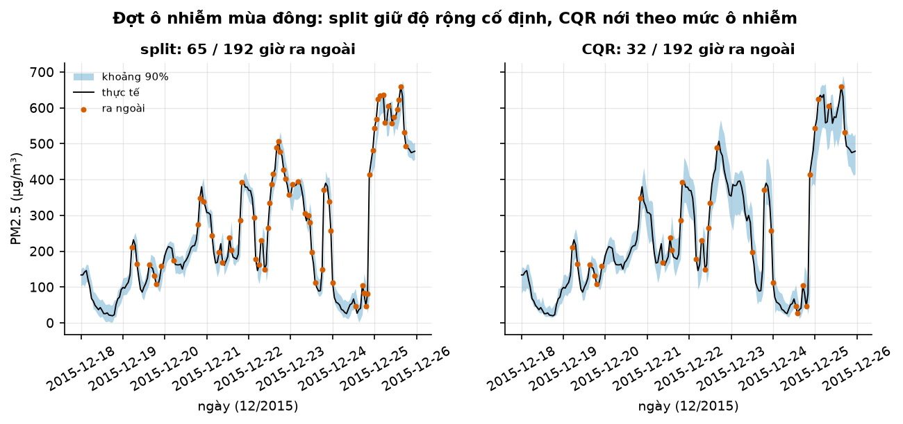
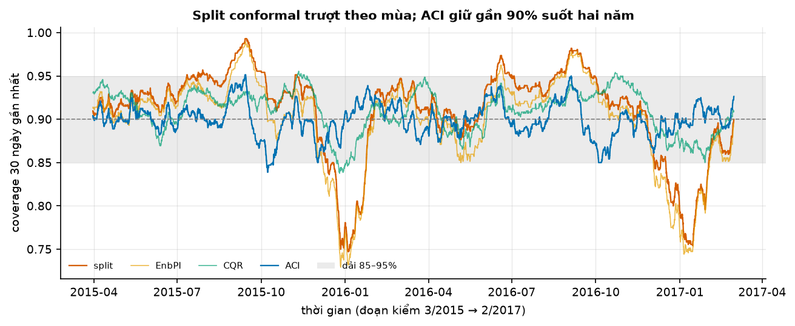
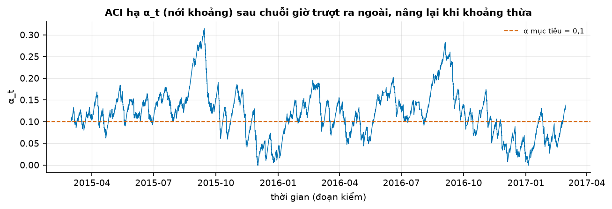

# Buổi 26 — Conformal prediction cho chuỗi thời gian

## 1. Mục tiêu

Sau buổi này bạn:

- Tự viết **split conformal**: từ các sai số cũ ra một khoảng có bảo đảm tỷ lệ phủ, không cần giả định phân phối.
- Giải thích bằng một bảng số vì sao chuỗi thời gian phá giả định của conformal, và đo coverage theo thời gian thay vì chỉ một con số.
- Dựng khoảng rộng hẹp theo độ khó bằng **CQR**, và khoảng không cần tách tập bằng **EnbPI**.
- Viết **ACI**: chỉnh mức α sau mỗi giờ theo lỗi vừa mắc, giữ coverage khi dữ liệu trôi.
- So bản tự viết với MAPIE (thư viện conformal cho scikit-learn), và nói được conformal **không** bảo đảm điều gì.

Sản phẩm: khoảng 90% cho bụi mịn PM2.5 (hạt nhỏ hơn 2,5 micromet, đo bằng µg/m³) giờ tới ở Bắc Kinh, giữ đúng mức đã hứa suốt hai năm, kể
cả những mùa đông split conformal lệch xa.

## 2. Nhắc lại buổi trước

- **Sai số** = thực tế − dự báo. **MAE**: trung bình trị tuyệt đối sai số. **Naive**: giờ tới bằng giờ này.
- **Quantile mức τ**: mốc mà tỷ lệ τ số giá trị nằm dưới. Mười số 1 … 10: quantile 0,8 khoảng 8. **Trung vị** là quantile 0,5.
- **Khoảng dự báo 90%**: khoảng mà thực tế rơi vào 90% số lần. **Coverage** (tỷ lệ phủ): tỷ lệ số lần thực tế rơi vào khoảng.
  **Calibration**: nói 90% thì đúng khoảng 90%.
- **Phần dư ngoài mẫu**: sai số trên dữ liệu mô hình chưa học. Khoảng dựng từ phần dư trên phần học thì quá hẹp, vì mô hình đã khớp sát phần học.
- **Quantile regression**: mô hình học thẳng một quantile, bằng cách tối thiểu pinball loss (đoán thấp bị phạt τ lần phần thiếu, đoán cao bị phạt
  $(1-\tau)$ lần phần thừa). LightGBM làm được với `objective="quantile"`.
- **Bootstrap**: tạo nhiều bộ dữ liệu mới bằng cách rút ngẫu nhiên có hoàn lại từ bộ cũ.
- **LightGBM**: ghép nhiều cây nhỏ. **Ensemble**: lấy trung bình dự báo của nhiều mô hình. **Học bước nhảy**: đoán $y_t - y_{t-1}$ rồi cộng lại $y_{t-1}$.
- **Rò rỉ tương lai**: dùng số chưa có lúc dự báo. **Drift**: quan hệ trong dữ liệu đổi theo thời gian.

## 3. Trạng thái đầu buổi

Sau `python lab.py up` (trong thư mục `lab/`):

| Hạng mục | Trạng thái |
|---|---|
| Dữ liệu | `du-lieu/raw/uci-beijing-air/PRSA_Data_20130301-20170228/` — 12 trạm quan trắc Bắc Kinh, 1/3/2013 → 28/2/2017, mỗi trạm 35.064 giờ; buổi dùng trạm Dongsi (sha256 `9c0020214425`) |
| Nguồn | UCI Machine Learning Repository, Beijing Multi-Site Air-Quality (CC BY 4.0) |
| Chia | học 3/2013 → 2/2014; hiệu chỉnh (calibration) 3/2014 → 2/2015, 8.720 giờ; kiểm 3/2015 → 2/2017, 17.067 giờ |
| Mô hình | LightGBM học bước nhảy PM2.5 giờ tới; đặc trưng: PM2.5 1, 2, 3 và 24 giờ trước, thời tiết đo giờ trước, giờ trong ngày |
| Môi trường | Python 3.12; pandas 3.0.5, lightgbm 4.7.0, mapie 1.5.0, scikit-learn 1.9.1 |
| `code/conformal.py` | `doc_pm25`, `dac_trung`, `du_bao`, `quantile_conformal`, `split_conformal`, `cqr`, `aci`, `enbpi`, `khoang_trien_khai`, `mapie_aci`, `coverage_truot`, `tom_tat` |
| `code/lab.ipynb` | notebook của Lab, bước 1–7 |
| **Đang cố tình sai** | `PHUONG_PHAP = "split"`: khoảng đem dùng tính một lần từ năm hiệu chỉnh; `aci` cập nhật α ngược chiều |
| **Triệu chứng** | coverage 30 ngày của khoảng đem dùng xuống 74,7% vào mùa đông; ACI cho khoảng vô hạn ở 16.797 / 17.067 giờ |
| `python lab.py check` lúc này | ĐỎ: 3/7 test hỏng |

## 4. Lý thuyết

Mô hình điểm dùng chung cả buổi: LightGBM học trên năm đầu, đoán PM2.5 của giờ tới. Trên hai năm kiểm, MAE 10,37, thắng naive 10,65 và
seasonal naive theo ngày 60,12. Câu hỏi hôm nay: khoảng quanh dự báo đó rộng bao nhiêu để phủ đúng chín phần mười số giờ, suốt hai năm?

### Từ mới trong buổi

| Thuật ngữ | Nghĩa một câu | Ví dụ |
|---|---|---|
| PM2.5 | Bụi mịn: hạt nhỏ hơn 2,5 micromet trong không khí, đo bằng µg/m³ (microgam mỗi mét khối). | Trời sạch dưới 35; ô nhiễm nặng trên 150. |
| MAPIE | Thư viện Python làm conformal cho mô hình scikit-learn, có sẵn EnbPI và ACI. | `TimeSeriesRegressor(mo_hinh, method="aci")`. |
| conformal prediction | Dựng khoảng từ "điểm" (độ sai) của các dự báo cũ trên một tập riêng, có bảo đảm tỷ lệ phủ. | 10 sai số cũ → khoảng 80% = dự báo ± sai số thứ 9 khi xếp tăng. |
| điểm conformal | Con số đo dự báo sai cỡ nào ở một giờ; hay dùng nhất là sai số bỏ dấu. | Thật 52, dự báo 47 → điểm 5. |
| tập hiệu chỉnh (calibration set) | Đoạn dữ liệu mô hình chưa học, dùng để lấy điểm conformal. | Năm thứ hai, 8.720 giờ. |
| split conformal | Conformal với một tập hiệu chỉnh cố định, tính quantile một lần. | Khoảng ± 24,2 µg/m³ dùng cho cả hai năm. |
| exchangeability (tính hoán đổi được) | Đảo thứ tự dữ liệu mà xác suất không đổi; giả định của conformal. | Tung xúc xắc: hoán đổi được. PM2.5 mùa đông và mùa hè: không. |
| coverage trượt | Coverage tính trên cửa sổ gần nhất (ở đây 720 giờ = 30 ngày), vẽ theo thời gian. | Tháng 12/2015 split chỉ phủ 75%. |
| CQR | Conformal trên quantile regression: nới hoặc co khoảng quantile một lượng tính từ tập hiệu chỉnh. | Khoảng [q 0,05 − 5; q 0,95 + 5]. |
| EnbPI | Ensemble bootstrap; sai số lấy từ các mô hình không thấy điểm đó; cửa sổ sai số trượt theo thời gian. | 20 LightGBM, giữ 8.760 sai số gần nhất. |
| ACI | Sau mỗi giờ, lỡ thì hạ α (nới khoảng), trúng thì nâng α nhẹ (co khoảng). | α = 0,1, γ = 0,005 → lỡ một giờ → 0,0955. |
| coverage có điều kiện | Coverage tính riêng trong một nhóm giờ (ô nhiễm nặng, mùa đông…). | Cả năm phủ 90% mà giờ PM2.5 > 150 chỉ phủ 72%. |

### 4.1 Split conformal: khoảng từ các sai số cũ

**Vấn đề.** Buổi trước lấy quantile sai số ngoài mẫu làm khoảng. Với bao nhiêu sai số thì đủ, và có bảo đảm gì không?

**Trực giác.** Giả sử giờ mới "giống" các giờ trong tập hiệu chỉnh: đảo thứ tự lẫn nhau mà không ai nhận ra. Khi đó sai số của giờ mới có cơ
hội ngang nhau rơi vào bất kỳ thứ hạng nào giữa các sai số cũ. Lấy sai số cũ đủ lớn thì giờ mới nằm dưới nó với xác suất biết trước.

**Ví dụ số nhỏ — tự tính tay.** Mười điểm (sai số bỏ dấu) trên tập hiệu chỉnh, xếp tăng: 1, 2, 2, 3, 3, 4, 5, 6, 8, 12. Muốn khoảng 80%, α = 0,2.

- Giờ mới là điểm thứ mười một; nó rơi vào một trong 11 thứ hạng với cơ hội như nhau.
- Lấy điểm thứ $k = \lceil 11 \times 0{,}8 \rceil = \lceil 8{,}8 \rceil = 9$ khi xếp tăng: số 8.
- Khả năng điểm mới không vượt 8 ít nhất là 9/11 ≈ 0,82 ≥ 0,8. Khoảng: dự báo ± 8.
- Muốn khoảng 95%: $k = \lceil 11 \times 0{,}95 \rceil = 11$ > 10 điểm. Không đủ dữ liệu: khoảng vô hạn.

**Công thức.**

$$
\hat q = \text{điểm thứ } \big\lceil (n+1)(1-\alpha) \big\rceil \text{ (xếp tăng)}, \qquad
\text{khoảng} = \big[\hat y - \hat q;\ \hat y + \hat q\big], \qquad
P(y \in \text{khoảng}) \ge 1 - \alpha
$$

- $n$: số điểm trong tập hiệu chỉnh; $\alpha$: phần được phép lỡ (0,1 cho khoảng 90%); $\hat y$: dự báo điểm; $\lceil x \rceil$: làm tròn lên.

**Nói bằng lời.** Xếp các sai số cũ tăng dần, lấy sai số ở vị trí $(n + 1)(1 - \alpha)$ làm tròn lên, rồi cộng trừ nó quanh dự báo. Dấu "+1" tính
cả giờ mới vào hàng. Bảo đảm này đúng với mọi mô hình và mọi phân phối, **nếu** dữ liệu hoán đổi được (Angelopoulos & Bates).

**Dữ liệu thật.** 8.720 điểm của năm hiệu chỉnh cho $\hat q$ ≈ 24,2 µg/m³. Trên hai năm kiểm, khoảng dự báo ± 24,2 phủ 90,9% số giờ.

**Tóm lại.** **Split conformal lấy sai số cũ thứ ⌈(n + 1)(1 − α)⌉ làm nửa độ rộng khoảng. Bảo đảm phủ ít nhất 1 − α, với điều kiện dữ liệu hoán đổi được.**

**Tự kiểm tra.** 19 điểm hiệu chỉnh, muốn khoảng 90%. Lấy điểm thứ mấy? Nếu chỉ có 8 điểm thì sao?

<details>
<summary>Đáp án</summary>

19 điểm: ⌈20 × 0,9⌉ = **18**, điểm lớn thứ hai. 8 điểm: ⌈9 × 0,9⌉ = ⌈8,1⌉ = 9 > 8, khoảng **vô hạn**. Nhầm hay gặp: lấy quantile 0,9 thường của 19
điểm (nằm giữa điểm thứ 17 và 18), hẹp hơn một chút và mất bảo đảm.

</details>

### 4.2 Chuỗi thời gian phá giả định: đo coverage theo thời gian

**Vấn đề.** 90,9% trên hai năm nghe đạt. Nhưng người dùng khoảng vào tháng 12 có được 90% không?

**Trực giác.** Hoán đổi được nghĩa là thứ tự không quan trọng. Chuỗi thời gian thì thứ tự là tất cả: mùa đông Bắc Kinh đốt sưởi, bụi dâng lên
hàng trăm µg/m³ và nhảy rất mạnh giữa các giờ; mùa hè bụi thấp, sai số nhỏ. Khoảng rộng cố định vừa cho "trung bình cả năm" sẽ thiếu vào mùa
đông, thừa vào mùa hè. Con số 90,9% là trung bình của hai cái sai bù nhau.

**Ví dụ số nhỏ — tự tính tay.** Một năm có hai mùa dài bằng nhau. Mùa đông khoảng phủ 80%, mùa hè phủ 100%. Coverage cả năm: (80 + 100) / 2 = **90%**.
Đúng "trung bình", sai ở từng mùa.

**Cách đo đúng.** Tính coverage trên 720 giờ gần nhất, trượt theo thời gian, và đếm bao nhiêu phần thời gian nó rơi ra ngoài **dải cho phép**
85–95%.

**Dữ liệu thật.** Split conformal trên hai năm kiểm, coverage theo quý:

| Quý | 1 (tháng 1–3) | 2 (tháng 4–6) | 3 (tháng 7–9) | 4 (tháng 10–12) |
|---|---|---|---|---|
| split conformal | 89,8% | 92,3% | 95,5% | 86,2% |

**Đọc bảng.** So hai quý cuối: mùa hè phủ thừa, cuối năm phủ thiếu. Coverage trượt còn xuống tới 74,7% và rơi ra ngoài dải cho phép ở 29,5% thời
gian (hình ở mục 4.5).

**Tóm lại.** **Chuỗi thời gian không hoán đổi được, nên bảo đảm của split conformal chỉ còn là trung bình dài hạn. Luôn vẽ coverage trượt theo
thời gian, không chỉ báo một con số.**

**Tự kiểm tra.** Một khoảng phủ 99% vào giữa hè và 72% vào giữa đông. Người vận hành nên tin khoảng này vào giữa đông không, dù cả năm phủ 90%?

<details>
<summary>Đáp án</summary>

**Không.** Giữa đông, cứ bốn giờ thì hơn một giờ ra ngoài khoảng, gần gấp ba mức đã hứa (10%). Coverage cả năm che mất điều đó vì giữa hè phủ thừa
bù lại. Nhầm hay gặp: thấy trung bình đạt là yên tâm.

</details>

### 4.3 CQR: khoảng rộng hẹp theo độ khó

**Vấn đề.** Split conformal cho mọi giờ cùng độ rộng. Giờ bụi 400 µg/m³ khó đoán hơn giờ bụi 20 µg/m³ rất nhiều.

**Trực giác.** Quantile regression (buổi 25) đã biết giờ nào khó: nó cho khoảng [quantile 0,05; quantile 0,95] rộng lúc ô nhiễm, hẹp lúc trời sạch.
Nhưng khoảng đó có thể không calibrate. CQR giữ hình dạng rộng hẹp của nó, chỉ nới (hoặc co) đều hai đầu một lượng tính từ tập hiệu chỉnh
(Romano et al. 2019).

**Công thức.**

$$
E_i = \max\big(\hat q_{lo}(x_i) - y_i,\; y_i - \hat q_{hi}(x_i)\big), \qquad
\text{khoảng} = \big[\hat q_{lo} - \hat q_E;\ \hat q_{hi} + \hat q_E\big]
$$

- $\hat q_{lo}, \hat q_{hi}$: quantile 0,05 và 0,95 của LightGBM; $E_i$: điểm CQR của giờ $i$ trong tập hiệu chỉnh; $\hat q_E$: điểm thứ
  $\lceil (n+1)(1-\alpha) \rceil$ của các $E_i$, như mục 4.1.

**Nói bằng lời.** Điểm CQR dương là thực tế nằm ngoài khoảng quantile bao xa; âm là nằm trong và còn cách mép bao xa. Nới khoảng quantile bằng điểm
đủ lớn thì phủ đúng 1 − α.

**Ví dụ số nhỏ — tự tính tay.** Bốn giờ hiệu chỉnh, α = 0,2:

| Giờ | Thực tế | Quantile thấp | Quantile cao | Điểm E |
|---|---|---|---|---|
| 1 | 20 | 15 | 30 | max(−5, −10) = −5 |
| 2 | 55 | 40 | 60 | max(−15, −5) = −5 |
| 3 | 90 | 70 | 85 | max(−20, 5) = 5 |
| 4 | 140 | 100 | 150 | max(−40, −10) = −10 |

**Đọc bảng.** Chỉ giờ 3 nằm ngoài khoảng quantile (vượt 5). Lấy điểm thứ ⌈5 × 0,8⌉ = 4 khi xếp tăng (−10, −5, −5, 5): số 5. Khoảng CQR là khoảng
quantile nới thêm 5 mỗi đầu.



**Cách đọc hình.**

1. **Trục ngang**: giờ, 18–25/12/2015.
2. **Trục dọc**: PM2.5 (µg/m³).
3. **Màu**: đường đen là thực tế; dải xanh là khoảng 90%; chấm cam là giờ thực tế ra ngoài khoảng.
4. **Nhìn vào đâu**: độ rộng dải khi bụi lên 400–600 µg/m³, và số chấm cam.
5. **Kết luận**: split giữ độ rộng như ngày trời sạch nên lỡ 65 trong 192 giờ; CQR nới rộng khi ô nhiễm nặng và lỡ 32 giờ.

**Dữ liệu thật.** Trên hai năm kiểm, CQR phủ 91,0% và khoảng hẹp hơn split (độ rộng trung vị 39,4 so với 48,4 µg/m³).

Coverage trượt của CQR rơi ra ngoài dải cho phép chỉ 2,8% thời gian.

**Tóm lại.** **CQR lấy hình dạng khoảng từ quantile regression và độ nới từ tập hiệu chỉnh: rộng khi khó, hẹp khi dễ, vẫn giữ bảo đảm của conformal.**

**Tự kiểm tra.** Một giờ hiệu chỉnh có thực tế 50, khoảng quantile [55; 80]. Điểm CQR là bao nhiêu, và nó nói gì?

<details>
<summary>Đáp án</summary>

max(55 − 50, 50 − 80) = max(5, −30) = **5**: thực tế nằm dưới mép thấp 5 µg/m³. Nhầm hay gặp: lấy trị tuyệt đối của cả hai hiệu rồi chọn lớn nhất
(ra 30); điểm CQR phải có dấu để phân biệt "ngoài" và "trong".

</details>

### 4.4 EnbPI: không cần tách tập, sai số trượt theo thời gian

**Vấn đề.** Split và CQR dành riêng một năm để hiệu chỉnh; mô hình không được học năm đó. Và tập điểm đứng yên trong khi dữ liệu trôi.

**Trực giác.** EnbPI (Xu & Xie 2021) làm ba việc.

1. Học nhiều mô hình, mỗi mô hình trên một mẫu bootstrap của toàn bộ dữ liệu. Rút theo **khối** 24 giờ liền để giữ quan hệ giữa các giờ gần nhau.
2. Sai số của một giờ đã học chỉ lấy từ các mô hình **không** thấy giờ đó (ngoài túi), nên vẫn là sai số ngoài mẫu.
3. Khi dự báo: khoảng = trung bình ensemble ± quantile 1 − α của các sai số gần nhất. Sau mỗi giờ bỏ sai số cũ nhất, thêm sai số mới; không học lại mô hình.

**Ví dụ số nhỏ — tự tính tay.** Ba mô hình. Giờ thứ năm có trong mẫu của mô hình một và mô hình ba, không có trong mẫu mô hình hai. Mô hình hai đoán
giờ đó 60, thực tế 64: sai số ngoài túi là 4.

Với hai mươi mô hình, mỗi giờ thường vắng mặt trong khoảng bảy mô hình; lấy trung bình dự báo của các mô hình đó.

**Dữ liệu thật.** Hai mươi LightGBM, học trên hai năm đầu. Ensemble đoán tốt hơn: MAE 10,07 so với 10,37.

Nhưng giữ đủ một năm sai số thì cửa sổ trôi quá chậm: coverage trượt rơi ra ngoài dải cho phép 24,6% thời gian, gần như split. Cửa sổ 30 ngày trôi
nhanh hơn: 13,2%.

**Đọc số.** EnbPI chỉ thích nghi nhanh bằng cửa sổ sai số của nó. Một benchmark năm 2026 trên hơn 3.000 chuỗi bán hàng cũng thấy EnbPI phủ thiếu
(Sabashvili 2026).

**Tóm lại.** **EnbPI dùng sai số ngoài túi của một ensemble bootstrap, không cần tách tập hiệu chỉnh, và cập nhật cửa sổ sai số mỗi giờ. Cửa sổ dài thì
thích nghi chậm.**

**Tự kiểm tra.** Vì sao EnbPI không lấy sai số của một giờ từ mô hình đã học giờ đó?

<details>
<summary>Đáp án</summary>

Mô hình đã học giờ đó thì sai số ở đó nhỏ hơn sai số thật khi dự báo, như phần dư trên phần học ở buổi 25. Khoảng dựng từ sai số đó sẽ quá hẹp.
Nhầm hay gặp: nghĩ lấy trung bình của cả 20 mô hình là đủ "ngoài mẫu".

</details>

### 4.5 ACI: chỉnh α theo lỗi vừa mắc

**Vấn đề.** Cần khoảng tự nới khi vừa lỡ liên tiếp (mùa đông) và tự co khi thừa (mùa hè), mà không cần biết trước dữ liệu trôi thế nào.

**Trực giác.** Như bộ điều nhiệt: phòng lạnh thì tăng sưởi, nóng thì giảm. ACI (Gibbs & Candès 2021) giữ một mức $\alpha_t$ thay đổi theo giờ. Giờ
vừa lỡ thì hạ $\alpha_t$ (khoảng rộng ra), giờ vừa trúng thì nâng $\alpha_t$ một chút (khoảng hẹp lại). Khoảng mỗi giờ lấy như split conformal,
nhưng ở mức $\alpha_t$, trên điểm conformal của mọi giờ đã qua.

**Công thức.**

$$
\alpha_{t+1} = \alpha_t + \gamma\,(\alpha - \text{lỗi}_t), \qquad \text{lỗi}_t = \begin{cases} 1 & \text{thực tế nằm ngoài khoảng giờ } t \\ 0 & \text{nằm trong} \end{cases}
$$

- $\alpha$: mục tiêu (0,1); $\alpha_t$: mức dùng ở giờ $t$; $\gamma$: bước chỉnh. $\alpha_t \le 0$ thì khoảng vô hạn.

**Nói bằng lời.** Trúng thì $\alpha_t$ tăng $\gamma \times 0{,}1$; lỡ thì giảm $\gamma \times 0{,}9$. Chín lần trúng bù đúng một lần lỡ, nên về lâu dài tỷ
lệ lỡ bị kéo về 10%.

**Ví dụ số nhỏ — tự tính tay.** γ = 0,05 (lớn cho dễ nhìn), năm giờ, lỗi lần lượt 0, 0, 1, 0, 0:

| Giờ | $\alpha_t$ | Lỗi | $\alpha_{t+1}$ |
|---|---|---|---|
| 1 | 0,100 | 0 | 0,100 + 0,05 × 0,1 = 0,105 |
| 2 | 0,105 | 0 | 0,110 |
| 3 | 0,110 | 1 | 0,110 − 0,05 × 0,9 = 0,065 |
| 4 | 0,065 | 0 | 0,070 |
| 5 | 0,070 | 0 | 0,075 |

**Đọc bảng.** Một lần lỡ hạ α_t mạnh gấp chín lần một lần trúng nâng nó. Sau lần lỡ, khoảng ở mức 1 − 0,065 = 93,5%, rộng hơn.

**Bảo đảm.** Với mọi dữ liệu, kể cả trôi tuỳ ý, tỷ lệ lỡ trung bình trên $T$ giờ cách α không quá $\frac{\max(\alpha_1, 1 - \alpha_1) + \gamma}{\gamma T}$, với $\alpha_1$ là mức
bắt đầu (ở đây bằng chính α).
Với γ = 0,005 và hai năm, $T$ = 17.067 giờ: $0{,}905 / 85{,}3 \approx 0{,}011$, tức lệch không quá khoảng 1 điểm phần trăm.



**Cách đọc hình.**

1. **Trục ngang**: thời gian, hai năm kiểm.
2. **Trục dọc**: coverage của 720 giờ gần nhất.
3. **Màu**: cam split, vàng EnbPI, xanh lá CQR, xanh dương ACI; dải xám là 85–95%.
4. **Nhìn vào đâu**: hai mùa đông (quanh tháng 1/2016 và 1/2017) và hai mùa hè.
5. **Kết luận**: split và EnbPI rơi xuống khoảng 75% mỗi mùa đông và lên gần 99% mỗi mùa hè; ACI ở gần 90% suốt hai năm.



**Cách đọc hình.**

1. **Trục ngang**: thời gian, hai năm kiểm. 2. **Trục dọc**: $\alpha_t$. 3. **Màu**: xanh là $\alpha_t$; gạch cam là mục tiêu 0,1.
4. **Nhìn vào đâu**: lúc $\alpha_t$ xuống gần 0 và lúc lên 0,3.
5. **Kết luận**: mùa đông $\alpha_t$ xuống gần 0, khoảng gần như phủ hết; cuối hè lên 0,3, khoảng chỉ còn 70% để bù những tuần phủ thừa.

**Chọn γ.** Bước γ lớn bám nhanh nhưng dễ đẩy $\alpha_t$ xuống dưới 0, cho khoảng vô hạn. Trên hai năm kiểm:

| γ | 0,002 | 0,005 | 0,01 | 0,02 |
|---|---|---|---|---|
| thời gian coverage 30 ngày ngoài 85–95% | 8,6% | 1,1% | 0% | 0% |
| số giờ khoảng vô hạn | 0 | 7 | 27 | 152 |

**Đọc bảng.** Không có γ tốt nhất; đổi độ bám lấy số giờ vô hạn. Buổi này dùng γ = 0,005, giá trị của bài gốc, định **trước** khi nhìn đoạn kiểm.
Chọn γ = 0,01 vì bảng này đẹp nhất là tune trên đoạn kiểm (buổi 24): con số báo cáo sẽ lạc quan.

**Tóm lại.** **ACI nâng α_t nhẹ khi trúng, hạ mạnh khi lỡ, nên tỷ lệ lỡ dài hạn luôn về α với mọi dữ liệu. Bước γ đổi độ bám lấy số giờ khoảng vô hạn;
chọn γ trước khi nhìn đoạn kiểm.**

**Tự kiểm tra.** α = 0,1, γ = 0,01, α_t = 0,1. Ba giờ liền lỡ. α_t sau ba giờ là bao nhiêu? Khoảng rộng ra hay hẹp lại?

<details>
<summary>Đáp án</summary>

Mỗi lần lỡ giảm 0,01 × 0,9 = 0,009. Sau ba giờ: 0,1 − 0,027 = **0,073**. Khoảng ở mức 92,7%, **rộng ra**. Nhầm hay gặp: cộng thay vì trừ (đảo dấu), khi
đó lỡ lại làm khoảng hẹp hơn và lỡ tiếp mãi.

</details>

### 4.6 Thư viện và giới hạn

**MAPIE.** `TimeSeriesRegressor` của MAPIE 1.5 có sẵn EnbPI và ACI; `BlockBootstrap` là cách rút mẫu theo khối như mục 4.4 (ở đây khối 168 giờ, một tuần):

```python
mp = TimeSeriesRegressor(mo_hinh, method="aci", cv=BlockBootstrap(n_resamplings=10, length=168, random_state=0))
mp.fit(X_hoc, y_hoc)
# mỗi 24 giờ: mp.update(X_moi, y_moi); mp.adapt_conformal_inference(X_moi, y_moi, gamma=0.005); mp.predict(...)
```

Trên sáu tháng đầu đoạn kiểm, MAPIE phủ 90,7%, bản tự viết 90,6%; coverage trượt của cả hai luôn trong dải cho phép. Hai bản dùng mô hình điểm hơi khác (MAPIE
dùng ensemble bootstrap), nên độ rộng khác nhau đôi chút.

**Nhiều bước.** Dự báo 24 giờ tới thì sai số tăng theo tầm, nên dựng điểm conformal riêng cho từng tầm $h$. `ConformalIntervals(h, n_windows)` của
statsforecast làm đúng việc này cho mô hình thống kê.

**Coverage có điều kiện.** Conformal bảo đảm coverage **trung bình**, không cho từng nhóm giờ. Chia giờ kiểm theo PM2.5 của giờ trước:

| PM2.5 giờ trước | ≤ 35 | 35–75 | 75–150 | > 150 |
|---|---|---|---|---|
| số giờ | 6.328 | 4.008 | 4.022 | 2.709 |
| split | 98,9% | 95,0% | 87,1% | 71,8% |
| CQR | 92,1% | 91,5% | 90,7% | 88,2% |
| ACI | 98,4% | 92,3% | 83,7% | 76,6% |

**Đọc bảng.** So cột "> 150" giữa ba dòng: ACI sửa được trượt theo **thời gian** nhưng vẫn phủ thiếu ở giờ ô nhiễm nặng, vì mọi giờ dùng chung một
bộ điểm. CQR đều nhất nhờ khoảng rộng theo độ khó. Hai cách bổ sung cho nhau: ACI chạy được trên nền CQR.

**Tóm lại.** **MAPIE cho kết quả khớp bản tự viết. Conformal chỉ bảo đảm coverage trung bình; muốn đúng trong từng nhóm thì khoảng phải rộng hẹp theo
độ khó (CQR) và phải kiểm từng nhóm.**

**Tự kiểm tra.** Một khoảng 90% có coverage trượt luôn trong dải cho phép. Có chắc những giờ ô nhiễm nặng nhất được phủ 90% không?

<details>
<summary>Đáp án</summary>

**Không.** Coverage 30 ngày là trung bình trên mọi giờ của cửa sổ. ACI ở buổi này đạt điều kiện đó mà chỉ phủ 76,6% giờ có PM2.5 giờ trước > 150.
Phải kiểm coverage trong từng nhóm. Nhầm hay gặp: coi bảo đảm conformal là bảo đảm cho từng giờ.

</details>

## 5. Lab từng bước

Lệnh gõ trong terminal ở thư mục `lab/`. Code các bước nằm sẵn trong `code/lab.ipynb` (mở bằng `python lab.py notebook` hoặc VS Code), chạy từng ô
từ trên xuống. Bạn sửa `code/conformal.py`; notebook tự nạp lại bản mới.

### Bước 1 — Dữ liệu và mô hình điểm

**Mục đích:** có dự báo điểm cho năm hiệu chỉnh và hai năm kiểm.

```bash
python lab.py up           # một lần: môi trường + dữ liệu (8 MB), kiểm sha256
python lab.py check        # 3/7 test đỏ
python lab.py notebook     # chạy ô bước 1
```

**Đọc kết quả:** 8.720 giờ hiệu chỉnh, 17.067 giờ kiểm; MAE như mục 4. LightGBM thua naive thì kiểm lại xem có học bước nhảy không.

### Bước 2 — Split conformal

**Mục đích:** đo coverage tổng và theo quý (mục 4.1–4.2).

**Đọc kết quả:** `tom_tat` in coverage, coverage trượt thấp nhất và cao nhất, `ngoai_85_95` (phần thời gian coverage trượt nằm ngoài dải cho
phép), độ rộng trung vị và `gio_vo_han` (số giờ khoảng vô hạn). Split: phủ 0,909, `ngoai_85_95` 0,295; bảng quý như mục 4.2.

### Bước 3 — CQR

**Mục đích:** so split và CQR ở giờ dễ và giờ khó (mục 4.3).

**Đọc kết quả:** CQR `ngoai_85_95` 0,028.

Giờ ô nhiễm nặng (PM2.5 giờ trước > 150): split 0,718, CQR 0,882.

### Bước 4 — EnbPI

**Mục đích:** thấy cửa sổ sai số một năm trôi chậm (mục 4.4). Khoảng 10 giây.

**Đọc kết quả:** `ngoai_85_95` 0,246.

### Bước 5 — ACI và khoảng triển khai

**Mục đích:** sửa ACI và chọn khoảng đem dùng (mục 4.5).

**Đọc kết quả:** lúc đầu ACI phủ 1,0 với `gio_vo_han` 16.797: $\alpha_t$ đi sai chiều và xuống dưới 0. Sửa dòng cập nhật trong `aci` theo công thức mục
4.5, rồi đặt `PHUONG_PHAP = "aci"`. Chạy lại: ACI phủ 0,900, `ngoai_85_95` 0,011, 7 giờ vô hạn; hình bốn đường như mục 4.5.

### Bước 6 — MAPIE

**Mục đích:** so ACI của MAPIE với bản tự viết trên sáu tháng (mục 4.6). Khoảng 1 phút.

**Đọc kết quả:** MAPIE 0,907, tự viết 0,906. Bản tự viết lệch xa thì kiểm lại bước 5.

### Bước 7 — Kiểm tra

```bash
python lab.py check        # 7/7 xanh
```

**Mục đích:** chấm toàn bộ.

**Đọc kết quả:** xanh 7/7 là xong. `test_khoang_chi_dung_qua_khu` đỏ thì khoảng của một giờ đã dùng thực tế của chính giờ đó: thêm điểm mới vào tập
**sau** khi tính khoảng.

## 6. Lỗi thường gặp & cách chẩn đoán

| Triệu chứng | Nguyên nhân | Chẩn đoán | Sửa |
|---|---|---|---|
| Coverage cả kỳ đạt, từng mùa lệch xa | split cố định trên chuỗi trôi | coverage trượt 30 ngày, coverage theo quý | ACI hoặc cửa sổ điểm trượt (mục 4.5) |
| Khoảng phủ hơi thiếu dù tập hiệu chỉnh "đúng" | lấy quantile thường thay vì hạng ⌈(n + 1)(1 − α)⌉ | so với `quantile_conformal` khi n nhỏ | dùng hạng có +1 (mục 4.1) |
| ACI cho khoảng vô hạn gần hết thời gian | cập nhật α ngược dấu | lỡ một giờ mà α_t tăng | α_t + γ(α − lỗi) (mục 4.5) |
| ACI có nhiều giờ vô hạn | γ lớn, hoặc tập điểm quá ít | đếm giờ α_t ≤ 0 | γ nhỏ hơn, định trước |
| Coverage quá đẹp, khoảng hẹp bất thường | điểm của giờ hiện tại vào tập trước khi tính khoảng | đổi thực tế giờ t, khoảng giờ t có đổi không | thêm điểm sau khi tính khoảng |
| EnbPI phủ thiếu nhiều tuần liền | cửa sổ sai số dài, trôi chậm | coverage trượt | cửa sổ ngắn hơn, hoặc ACI trên nền EnbPI |
| Giờ ô nhiễm nặng phủ thiếu dù tổng đạt | điểm dùng chung cho mọi giờ | coverage theo nhóm độ khó | CQR, kiểm coverage có điều kiện (mục 4.6) |
| Chọn γ theo kết quả đoạn kiểm | tune trên đoạn báo cáo | γ có được định trước không | định γ từ bài gốc hoặc từ đoạn hiệu chỉnh |

## 7. Bài tập về nhà

1. **ACI trên nền CQR.** Thay điểm |y − ŷ| trong `aci` bằng điểm CQR. Coverage theo nhóm PM2.5 và thời gian ngoài dải thay đổi thế nào?
2. **Chọn γ trung thực.** Chạy ACI trên nửa sau năm hiệu chỉnh với bốn giá trị γ, chọn γ tốt nhất ở đó, rồi mới chấm trên hai năm kiểm. Kết quả khác gì
   so với chọn trên đoạn kiểm?
3. **Trạm khác.** Chạy lại cả buổi cho trạm Dingling (ngoại ô). Split conformal trượt mạnh hơn hay nhẹ hơn Dongsi? Vì sao?

## 8. Tiêu chí "Xong khi"

- [ ] `python lab.py check` xanh 7/7.
- [ ] Tính tay được hạng ⌈(n + 1)(1 − α)⌉, điểm CQR, và năm bước cập nhật ACI.
- [ ] Hình coverage trượt của bốn phương pháp: ACI ra ngoài dải cho phép dưới 2% thời gian, split khoảng 30%; giải thích được vì sao.
- [ ] Bảng coverage theo nhóm PM2.5, kèm một câu conformal bảo đảm gì và không bảo đảm gì.

## 9. Đọc thêm

- Angelopoulos, A.N. & Bates, S. A Gentle Introduction to Conformal Prediction and Distribution-Free Uncertainty Quantification. https://arxiv.org/abs/2107.07511
- Gibbs, I. & Candès, E. (2021). Adaptive conformal inference under distribution shift. *NeurIPS*. https://arxiv.org/abs/2106.00170
- Romano, Y., Patterson, E. & Candès, E. (2019). Conformalized quantile regression. *NeurIPS*.
- Xu, C. & Xie, Y. (2021). Conformal prediction interval for dynamic time-series. *ICML*. https://arxiv.org/abs/2010.09107
- Zaffran, M. et al. (2022). Adaptive conformal predictions for time series (AgACI: gộp nhiều γ thay vì chọn một). *ICML*.
- Sabashvili, A. (2026). Conformal prediction algorithms for time series forecasting: methods and benchmarking. https://arxiv.org/abs/2601.18509
- MAPIE: https://mapie.readthedocs.io/ — có cả module kiểm định exchangeability (`mapie.exchangeability_testing`).
