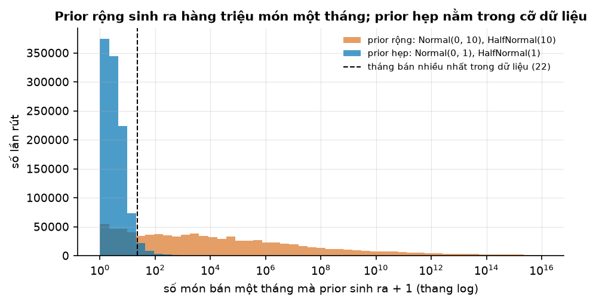
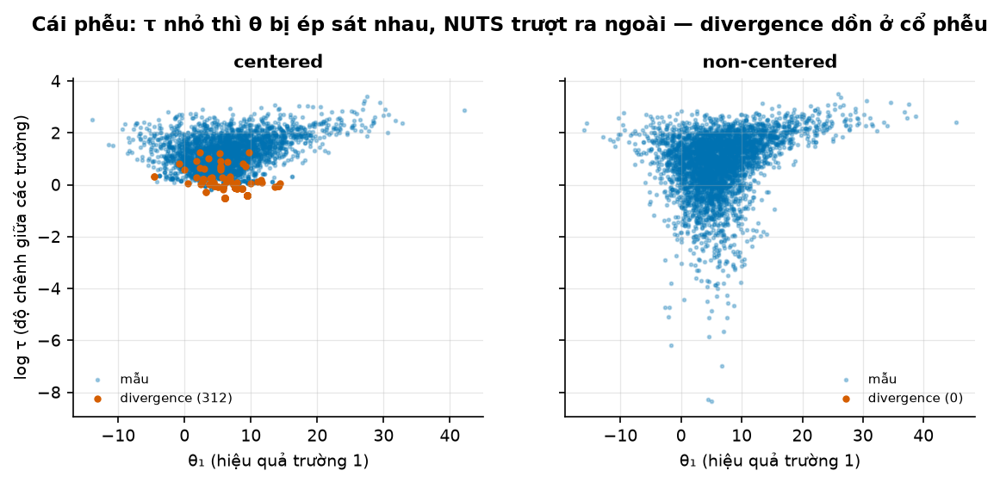
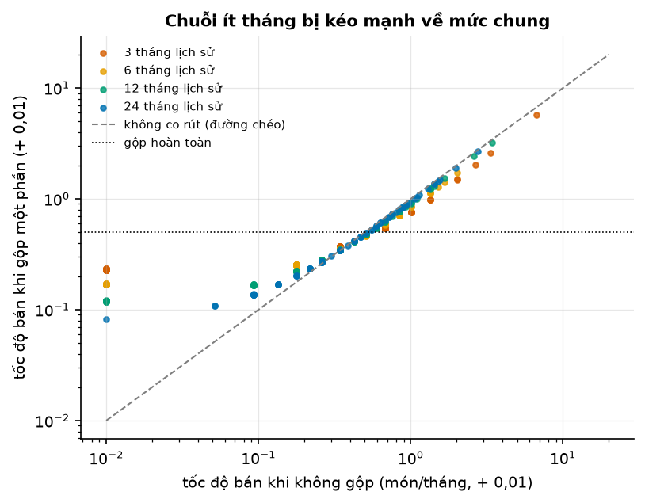
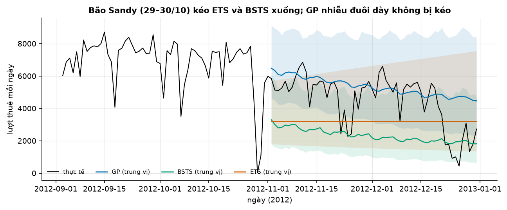

# Buổi 27 — Dự báo Bayes và Gaussian Process

## 1. Mục tiêu

Sau buổi này bạn:

- Cập nhật một prior bằng dữ liệu (tính tay được), và dự báo bằng posterior predictive.
- Dùng prior predictive check để bắt một prior vô lý trước khi xem dữ liệu.
- Đọc ba chẩn đoán r_hat, ESS, divergence, và từ chối một posterior chưa hội tụ.
- Dựng mô hình phân cấp (partial pooling) cho 300 mã phụ tùng bán chậm, giải thích bằng hình vì sao mã ít dữ liệu bị kéo về mức chung.
- Dự báo lượt thuê xe bằng BSTS và bằng Gaussian process, và kiểm coverage của khoảng dự báo.

Sản phẩm: mô hình phân cấp Bayes đã qua cổng chẩn đoán (r_hat, ESS, divergence), thắng cách "mỗi mã tự đoán" trên 12 tháng chấm.

## 2. Nhắc lại buổi trước

- **Sai số** = thực tế − dự báo. **RMSE**: căn của trung bình sai số². **MAE**: trung bình trị tuyệt đối sai số.
- **Phân phối**: bức tranh "giá trị nào hay xảy ra, giá trị nào hiếm". **Quantile mức τ**: mốc có tỷ lệ τ số giá trị nằm dưới. **Trung vị** là
  quantile 0,5. **Phương sai**: trung bình bình phương độ lệch khỏi trung bình; **độ lệch chuẩn** là căn của nó.
  **Phân phối chuẩn** (Gauss) $\text{Normal}(\mu, \sigma)$: hình chuông, trung bình $\mu$, độ lệch chuẩn $\sigma$, khoảng $\mu \pm 2\sigma$ chứa
  khoảng 95% giá trị. Viết $x \sim \text{Normal}(0, 1)$: $x$ được rút từ phân phối đó.
- **Khoảng dự báo 90%** và **coverage**: tỷ lệ số lần thực tế rơi vào khoảng; calibrate tốt thì khoảng 90% phủ khoảng 90%, kiểm trên dữ liệu
  chưa dùng để học.
- **ETS**: làm trơn hàm mũ, cập nhật mức, xu hướng, mùa vụ sau mỗi quan sát. **Seasonal naive**: lặp lại cùng ngày tuần trước.
- **Mô hình local / global**: mỗi chuỗi một mô hình riêng, hay một mô hình học chung mọi chuỗi.
- **Phân phối Student-t**: giống hình chuông nhưng đuôi dày hơn, nên một giá trị cực đoan không kéo lệch cả mô hình.
- **State space và bộ lọc Kalman**: trạng thái ẩn (mức, xu hướng, mùa vụ) đổi từng bước, quan sát sinh ra từ trạng thái. Bộ lọc Kalman
  cập nhật trạng thái sau mỗi quan sát và tự bỏ qua ngày thiếu.

## 3. Trạng thái đầu buổi

Sau `python lab.py up` (trong thư mục `lab/`):

| Hạng mục | Trạng thái |
|---|---|
| Dữ liệu 1 | `du-lieu/raw/monash-car-parts/car_parts_dataset_with_missing_values.tsf` — 2.674 mã phụ tùng ô tô, số bán mỗi tháng 1/1998 → 3/2002 (51 tháng), 4,5% ô thiếu |
| Dữ liệu 2 | `du-lieu/raw/uci-bike-sharing/day.csv` — lượt thuê xe đạp mỗi ngày ở Washington D.C. 2011–2012, 731 ngày |
| Nguồn | Monash Time Series Forecasting Repository; UCI Machine Learning Repository (cả hai CC BY 4.0) |
| Chấm | Car Parts: 300 mã, 12 tháng cuối; xe đạp: 60 ngày cuối (2/11 → 31/12/2012) |
| Môi trường | Python 3.12; pymc 6.3.2, pymc-extras 0.15.1, arviz 1.3.0, statsforecast 2.1.1, pandas 2.3.3 |
| `code/bayes.py` | `chia_car_parts`, `mo_hinh_phan_cap`, `tien_nghiem`, `lay_mau`, `chan_doan`, `dung_duoc`, `ba_cach_gop`, `mo_hinh_8_truong`, `bsts`, `mo_hinh_gp`, `du_bao_gp`, `ets` |
| `code/lab.ipynb` | notebook của Lab, bước 1–6 |
| **Đang cố tình sai** | `PRIOR` quá rộng và chưa kiểm; `dung_duoc` chỉ xét r_hat; `THANH_PHAN_GP` có ba thành phần tranh nhau |
| **Triệu chứng** | prior tin rằng một phụ tùng có thể bán 20 triệu món/tháng; GP có 27 divergence; cổng `dung_duoc` cho qua posterior có divergence nếu r_hat đẹp |
| `python lab.py check` lúc này | ĐỎ: 3/5 test hỏng (chạy mất khoảng 5 phút) |

## 4. Lý thuyết

Hai bài toán cả buổi. Thứ nhất: 300 mã phụ tùng bán rất chậm, mỗi mã chỉ có vài tháng tới hai năm lịch sử, cần đoán số bán 12 tháng tới.
Thứ hai: lượt thuê xe đạp mỗi ngày, cần đoán 60 ngày cuối năm 2012.

### Từ mới trong buổi

| Thuật ngữ | Nghĩa một câu | Ví dụ |
|---|---|---|
| prior | Niềm tin về tham số trước khi xem dữ liệu, viết thành một phân phối. | "Tốc độ bán quanh 2 món/tháng, có thể 0,5 tới 5." |
| likelihood | Mức dữ liệu đã thấy "hợp" với từng giá trị tham số. | Thấy 0, 1, 0 món thì tốc độ 0,3 hợp hơn tốc độ 5. |
| posterior | Niềm tin sau khi cập nhật prior bằng dữ liệu. | Sau 3 tháng, tốc độ quanh 0,75 món/tháng. |
| posterior predictive | Dự báo Bayes: rút tham số từ posterior rồi rút số liệu tương lai theo tham số đó. | 51% khả năng tháng tới bán 0 món. |
| prior predictive check | Rút tham số từ prior rồi sinh số liệu giả, xem có hợp lý không, trước khi học. | Prior sinh ra 20 triệu món/tháng → prior sai. |
| MCMC, NUTS | Cách rút mẫu từ posterior bằng nhiều bước đi ngẫu nhiên (chuỗi Markov); NUTS là cách đi PyMC dùng. | 4 chuỗi × 2.000 bước. |
| r_hat, ESS, divergence | Ba chẩn đoán MCMC: các chuỗi có khớp nhau không, bao nhiêu mẫu thật sự độc lập, NUTS có trượt khỏi posterior không. | r_hat 1,006, ESS 1.208, 0 divergence: dùng được. |
| no / complete / partial pooling | Mỗi mã tự đoán / mọi mã chung một số / mỗi mã một số nhưng bị kéo về mức chung. | Mã 3 tháng toàn 0: 0 / 0,5 / 0,22 món/tháng. |
| co rút (shrinkage) | Ước lượng của nhóm ít dữ liệu bị kéo về mức chung. | Càng ít tháng, càng bị kéo mạnh. |
| non-centered | Viết θ = μ + τ·z thay cho θ ~ Normal(μ, τ) để tránh "cái phễu". | 8 trường: divergence 312 → 0. |
| BSTS | Mô hình ghép từ các thành phần (mức, xu hướng, mùa vụ) ước lượng bằng Bayes. | Mức + xu hướng + mùa tuần + mùa năm. |
| Gaussian process (GP), kernel | Coi cả đường cong là ngẫu nhiên; kernel nói hai thời điểm giống nhau cỡ nào. | Kernel chu kỳ 7: thứ Hai tuần này giống thứ Hai tuần trước. |
| HSGP | Xấp xỉ GP bằng vài chục hàm sin, cos, để chạy nhanh trên nhiều điểm. | 671 ngày dùng 40 hàm thay cho ma trận 671 × 671. |

### 4.1 Suy nghĩ Bayes: prior + dữ liệu = posterior

**Vấn đề.** Một mã phụ tùng mới có 3 tháng bán 0, 1, 0 món. Trung bình 3 tháng là 0,33 món/tháng. Có tin con số đó cho cả năm tới không?

**Trực giác.** Ba tháng quá ít để tin hẳn. Nhưng ta biết thêm một điều: phụ tùng loại này thường bán vài món mỗi tháng. Bayes ghép hai nguồn:
kiến thức trước (prior) và dữ liệu (likelihood), theo tỷ lệ tin cậy của mỗi nguồn. Ít dữ liệu thì prior nặng; nhiều dữ liệu thì dữ liệu thắng.

> **Mượn trước — Poisson và Gamma.** Số món bán trong một tháng thường mô tả bằng **Poisson** với tốc độ λ: trung bình λ món, khả năng bán 0
> món là $e^{-\lambda}$ (λ = 0,5 → 61%). Tốc độ λ chưa biết, luôn dương, nên niềm tin về nó hay viết bằng **Gamma(a, b)**: trung bình a/b.

**Ví dụ số nhỏ — tự tính tay.** Prior Gamma(2, 1): tốc độ trung bình 2 món/tháng. Dữ liệu 0, 1, 0: tổng 1 món trong 3 tháng.

- Posterior là Gamma(2 + 1, 1 + 3) = Gamma(3, 4): trung bình 3/4 = **0,75** món/tháng.
- Viết lại: $0{,}75 = \tfrac14 \times 2 + \tfrac34 \times 0{,}33$ — trung bình có trọng số của prior và dữ liệu. Dữ liệu nặng ba phần tư vì có ba
  tháng, prior nặng một phần tư vì nó "đáng giá" như một tháng.
- Posterior predictive: rút λ từ posterior, rồi rút số bán ~ Poisson(λ). Mô phỏng cho 51% khả năng tháng tới bán 0 món.

**Công thức.**

$$
p(\theta \mid y) \propto p(y \mid \theta)\, p(\theta), \qquad
\lambda \sim \text{Gamma}(a, b),\ y_1..y_n \sim \text{Poisson}(\lambda) \Rightarrow \lambda \mid y \sim \text{Gamma}\Big(a + \sum y_i,\ b + n\Big)
$$

- $\theta$: tham số; $p(\theta)$: prior; $p(y \mid \theta)$: likelihood; $p(\theta \mid y)$: posterior; $\propto$: "tỷ lệ với"; $n$: số tháng.

**Nói bằng lời.** Posterior tỷ lệ với likelihood nhân prior. Với Poisson và Gamma chỉ cần cộng: tổng số bán vào a, số tháng vào b.

**Tóm lại.** **Bayes ghép prior với dữ liệu, ít dữ liệu thì prior nặng. Dự báo Bayes rút cả tham số lẫn số liệu, nên khoảng dự báo chứa
cả độ bất định của tham số.**

**Tự kiểm tra.** Cùng prior $\text{Gamma}(2, 1)$, một mã khác bán tổng cộng 4 món trong 12 tháng. Trung bình posterior là bao nhiêu? Nó gần
dữ liệu hơn hay xa hơn so với mã ở ví dụ trên?

<details>
<summary>Đáp án</summary>

Gamma(2 + 4, 1 + 12) = Gamma(6, 13): trung bình 6/13 ≈ **0,46**. Dữ liệu (4/12 ≈ 0,33) giờ nặng 12/13, nên posterior sát dữ liệu hơn nhiều so với mã
3 tháng (0,75). Nhầm hay gặp: cộng số tháng vào a và tổng số bán vào b (đảo), ra Gamma(14, 5), trung bình 2,8.

</details>

### 4.2 Prior predictive check: prior có sinh ra dữ liệu hợp lý không

**Vấn đề.** Không biết chọn prior nào, nhiều người đặt prior "thật rộng cho khách quan". Với mô hình có hàm mũ, "rộng" có thể nghĩa là "tin vào
điều vô lý".

**Trực giác.** Trước khi học, cho mô hình tự sinh dữ liệu giả từ prior. Nếu dữ liệu giả không giống thứ gì có thể xảy ra, prior sai, dù nó "rộng".

**Ví dụ số nhỏ — tự tính tay.** Mô hình của buổi đặt log tốc độ bán ~ $\text{Normal}(0, 10)$. Một lần rút được log λ = 9,2, tức $\lambda = e^{9{,}2}
\approx 9.900$ món/tháng cho một phụ tùng. Với $\text{Normal}(0, 1)$, log λ hiếm khi vượt 2, tức $\lambda < e^2 \approx 7$ món/tháng.



**Cách đọc hình.**

1. **Trục ngang**: số món một tháng mà prior sinh ra, cộng 1 (thang log, mỗi vạch gấp 100 lần).
2. **Trục dọc**: số lần rút.
3. **Màu**: cam là prior rộng; xanh là prior hẹp; gạch đứt là tháng bán nhiều nhất trong dữ liệu thật (22 món).
4. **Nhìn vào đâu**: phần cam nằm bên phải gạch đứt.
5. **Kết luận**: prior rộng trải tới $10^{16}$ món; prior hẹp nằm gần hết trong cỡ dữ liệu thật.

**Dữ liệu thật.** Quantile 0,9 của số món một tháng mà prior sinh ra: prior rộng 20 triệu, prior hẹp 6, dữ liệu thật 2. Ở bài này posterior gần như
không đổi (RMSE 1,181 và 1,182) vì dữ liệu đủ nhiều. Prior rộng vẫn là lỗi: với mã ít dữ liệu hơn hay mô hình phức tạp hơn, nó làm MCMC chậm và
kéo dự báo về vùng vô lý.

**Tóm lại.** **Luôn sinh dữ liệu giả từ prior và so với cỡ dữ liệu thật trước khi học. "Prior rộng" với log hay hàm mũ là prior sai.**

**Tự kiểm tra.** Prior log λ ~ Normal(0, 3). Khoảng ± 2 độ lệch chuẩn của log λ ứng với tốc độ từ đâu tới đâu? Có hợp với phụ tùng bán chậm không?

<details>
<summary>Đáp án</summary>

log λ từ $-6$ tới $6$, tức $\lambda$ từ $e^{-6} \approx 0{,}0025$ tới $e^6 \approx 400$ món/tháng. Đầu trên quá cao so với tháng bán nhiều nhất
(22 món). Hẹp prior lại, ví dụ $\text{Normal}(0, 1)$, rồi kiểm lại bằng prior predictive. Nhầm hay gặp: đọc ± 6 là "± 6 món".

</details>

### 4.3 MCMC và ba chẩn đoán: r_hat, ESS, divergence

**Vấn đề.** Posterior của mô hình thật không có công thức gọn như Gamma. PyMC rút mẫu bằng MCMC. Làm sao biết mẫu rút ra đúng là posterior?

**Trực giác.** Thả 4 người đi dạo ngẫu nhiên từ 4 điểm khác nhau trên cùng một vùng. Đi đủ lâu thì 4 người phải cùng quanh quẩn một vùng. Ba câu hỏi:
bốn người đã gặp nhau chưa (r_hat); đi bao nhiêu bước thì bằng bao nhiêu điểm độc lập (ESS); có ai trượt chân ở chỗ dốc (divergence).

**Ví dụ số nhỏ — tự tính tay.** Hai chuỗi, mỗi chuỗi ba mẫu: A là $1, 2, 3$; B là $5, 6, 7$. Phương sai (định nghĩa ở mục 2) trong mỗi chuỗi là
$(1 + 0 + 1)/3 \approx 0{,}67$. Hai trung bình $2$ và $6$ đều cách trung bình chung 2, nên phương sai giữa chúng là 4.

Gần đúng: $\hat R \approx \sqrt{1 + \text{phương sai giữa chuỗi} / \text{phương sai trong chuỗi}} = \sqrt{1 + 4/0{,}67} \approx 2{,}6$. Nếu B là $2, 3, 4$
thì phương sai giữa hai trung bình chỉ 0,25 và $\hat R \approx 1{,}17$. Các chuỗi khớp nhau hoàn toàn thì $\hat R = 1$.

**Ba ngưỡng** (Vehtari et al. 2021):

| Chẩn đoán | Nghĩa | Dùng được khi |
|---|---|---|
| r_hat | độ chênh giữa các chuỗi so với trong chuỗi | < 1,01 |
| ESS (bulk) | số mẫu độc lập tương đương | ≥ 400 (100 mỗi chuỗi) |
| divergence | số bước NUTS trượt khỏi posterior ở vùng cong gắt | 0 |

**Đọc bảng.** Thiếu một điều kiện là không dùng. r_hat đẹp mà có divergence vẫn nghĩa là có vùng posterior chưa được thăm.

**Cái phễu và non-centered.** Ví dụ kinh điển "8 trường" (Gelman, chương 5): mỗi trường một hiệu quả luyện thi θ, kéo về mức chung μ, độ chênh giữa
các trường τ; tức θ ~ Normal(μ, τ). Khi τ nhỏ, mọi θ bị ép sát μ: posterior hẹp như cổ phễu, NUTS trượt ở đó. Viết
lại θ = μ + τ·z, z ~ Normal(0, 1): cùng mô hình, nhưng z không bị ép, cổ phễu biến mất.



**Cách đọc hình.**

1. **Trục ngang**: θ₁, hiệu quả luyện thi ở trường 1.
2. **Trục dọc**: log τ, độ chênh giữa các trường.
3. **Màu**: xanh là mẫu; cam là mẫu ở bước divergence.
4. **Nhìn vào đâu**: phần dưới cùng của mỗi ô, nơi τ nhỏ.
5. **Kết luận**: centered không bao giờ xuống dưới log τ ≈ −0,5 và divergence dồn ở mép đó; non-centered đi xuống tới −8, không divergence.

**Dữ liệu thật.** Ví dụ 8 trường, 4 chuỗi × 1.000 mẫu; `target_accept` cao thì NUTS đi bước nhỏ hơn:

| Cách viết | target_accept | Divergence | r_hat | ESS nhỏ nhất |
|---|---|---|---|---|
| centered | 0,8 | 312 | 1,243 | 12 |
| centered | 0,95 | 64 | 1,019 | 150 |
| non-centered | 0,95 | 0 | 1,002 | 3.008 |

**Đọc bảng.** Nâng `target_accept` chỉ bớt divergence, không hết; đổi cách viết mới sửa được gốc. Mô hình Car Parts ở mục 4.4
có τ ≈ 1 nên centered cũng 0 divergence — không phải mô hình phân cấp nào cũng có phễu.

**Tóm lại.** **Chỉ dùng posterior khi r_hat < 1,01, ESS ≥ 400 và 0 divergence. Divergence ở mô hình phân cấp thường do cái phễu; sửa bằng non-centered,
không bằng tăng target_accept.**

**Tự kiểm tra.** Một lần lấy mẫu có r_hat 1,003, ESS 2.500, 14 divergence. Dùng được không? Nên làm gì?

<details>
<summary>Đáp án</summary>

**Không.** 14 divergence nghĩa là có vùng posterior NUTS không đi tới được; r_hat và ESS chỉ đo phần đã đi. Xem divergence nằm ở đâu (thường ở
τ nhỏ), đổi sang non-centered hoặc sửa cấu trúc mô hình, rồi chẩn đoán lại. Nhầm hay gặp: thấy r_hat đẹp là yên tâm.

</details>

### 4.4 Partial pooling: mượn sức giữa 300 mã bán chậm

**Vấn đề.** 300 mã, mỗi mã chỉ thấy $3, 6, 12$ hoặc $24$ tháng trước kỳ chấm; ba phần tư số tháng bán 0 món. Mỗi mã tự đoán thì mã 3 tháng
toàn 0 bị đoán "không bao giờ bán". Dùng chung một số cho mọi mã thì bỏ mất khác biệt thật.

**Trực giác.** Làm như mục 4.1, nhưng prior không tự đặt: nó học từ chính 300 mã. Mức chung và độ chênh giữa các mã được ước lượng cùng lúc; mỗi
mã là trung bình có trọng số giữa dữ liệu của nó và mức chung. Ít tháng thì nghiêng về mức chung (co rút mạnh), nhiều tháng thì nghiêng về dữ liệu.

**Ví dụ số nhỏ — tự tính tay.** Dùng lại công thức mục 4.1 với prior Gamma(2, 1) như "mức chung". Hai mã cùng bán trung bình 0,33 món/tháng:

- mã 3 tháng: (2 + 1) / (1 + 3) = 0,75 — bị kéo mạnh về 2;
- mã 24 tháng (tổng 8 món): (2 + 8) / (1 + 24) = 0,40 — gần dữ liệu 0,33.

**Công thức.**

$$
\log \lambda_j = \mu + \tau z_j,\quad z_j \sim \text{Normal}(0, 1),\quad \mu \sim \text{Normal}(0, 1),\quad \tau \sim \text{HalfNormal}(1),\quad y_{jt} \sim \text{Poisson}(\lambda_j)
$$

- $\lambda_j$: tốc độ bán của mã $j$; $\mu$: log mức chung; $\tau$: độ chênh giữa các mã; HalfNormal: nửa dương của hình chuông; $y_{jt}$: số bán tháng $t$.

**Nói bằng lời.** Log tốc độ mỗi mã bằng mức chung cộng một độ lệch riêng; độ lệch lớn cỡ τ. Dữ liệu cho μ ≈ −1,17, tức mức chung
$e^{-1{,}17} \approx 0{,}31$ món/tháng, và τ ≈ 0,98.

Chẩn đoán: r_hat 1,006, ESS 1.208, 0 divergence.



**Cách đọc hình.**

1. **Trục ngang**: tốc độ bán khi mỗi mã tự đoán (trung bình các tháng đã thấy), cộng 0,01 để vẽ được số 0 trên thang log.
2. **Trục dọc**: tốc độ bán khi gộp một phần.
3. **Màu**: số tháng lịch sử (cam, vàng, xanh lá, xanh dương là $3, 6, 12, 24$ tháng); gạch đứt là "không co rút"; chấm chấm là gộp hoàn toàn.
4. **Nhìn vào đâu**: cột điểm ở bên trái (mã tự đoán 0) và các điểm lệch khỏi đường chéo.
5. **Kết luận**: mã tự đoán 0 được nâng lên khoảng 0,07–0,23; mã bán nhiều bị kéo xuống. Điểm cam (ít tháng nhất) lệch khỏi đường chéo xa nhất.

**Dữ liệu thật.** RMSE số bán mỗi tháng trên 12 tháng chấm:

| Cách | Cả 300 mã | 3 tháng | 6 tháng | 12 tháng | 24 tháng |
|---|---|---|---|---|---|
| không gộp | 1,212 | 1,622 | 0,918 | 1,267 | 0,895 |
| gộp hoàn toàn | 1,191 | 1,568 | 0,875 | 1,296 | 0,879 |
| gộp một phần | **1,182** | 1,560 | 0,886 | **1,258** | 0,886 |

**Đọc bảng.** So dòng đầu với dòng cuối: gộp một phần thắng không gộp ở cả bốn nhóm, rõ nhất ở mã ít tháng nhất. Gộp hoàn toàn đôi khi
nhỉnh hơn ở nhóm 6 và 24 tháng, nhưng thua xa ở nhóm 12 tháng.

Rõ nhất là 35 mã chỉ có ba tháng, toàn 0 món. Không gộp đoán chúng không bao giờ bán; gộp một phần đoán 0,221 món/tháng, đúng bằng
trung bình thật của năm sau.

**Kiểm calibration.** Số bán là số nguyên nhỏ, nên kiểm bằng tần suất từng giá trị thay vì khoảng:

| Số món một tháng | 0 | 1 | 2 | ≥ 3 |
|---|---|---|---|---|
| mô hình dự báo | 67,6% | 22,1% | 6,7% | 3,6% |
| thực tế 12 tháng chấm | 78,7% | 12,7% | 4,9% | 3,7% |

**Đọc bảng.** Mô hình đoán thiếu số tháng bán 0 món khoảng 11 điểm phần trăm. Poisson với tốc độ cố định không tạo đủ số 0: cần mô hình có thêm
khả năng "tháng không ai mua" (bài tập 2).

**Tóm lại.** **Partial pooling học mức chung từ mọi mã rồi kéo mỗi mã về đó theo độ ít dữ liệu. Nó thắng không gộp trên 12 tháng chấm; calibration
theo tần suất cho thấy Poisson còn thiếu số 0.**

**Tự kiểm tra.** Vì sao mã 24 tháng gần như không bị co rút, còn mã 3 tháng thì bị kéo mạnh?

<details>
<summary>Đáp án</summary>

Trọng số của dữ liệu tăng theo số tháng (mục 4.1: 3 tháng nặng 3/4, 24 tháng nặng 24/25 với prior "đáng giá" 1 tháng). Mã 24 tháng tự có đủ bằng
chứng; mã 3 tháng thì chưa, nên mức chung quyết định nhiều hơn. Nhầm hay gặp: nghĩ mô hình co rút mọi mã như nhau.

</details>

### 4.5 BSTS: mô hình thành phần ước lượng bằng Bayes

**Vấn đề.** Muốn dự báo lượt thuê xe mà vẫn đọc được từng thành phần (mức, xu hướng, mùa tuần, mùa năm) kèm dải bất định.

**Trực giác.** Mỗi ngày, lượt thuê = mức hiện tại + hiệu ứng ngày trong tuần + hiệu ứng mùa trong năm + nhiễu. Mức trôi chậm theo xu hướng. BSTS
(Scott & Varian 2014) viết mỗi thành phần thành một "trạng thái" cập nhật từng ngày, rồi để MCMC ước lượng độ lớn nhiễu của từng thành phần.

**Ví dụ số nhỏ — tự tính tay.** Mức hôm nay 8,50 (log lượt thuê), xu hướng +0,002 mỗi ngày, hiệu ứng thứ Bảy +0,10. Dự báo thứ Bảy tuần sau (7 ngày):
8,50 + 7 × 0,002 + 0,10 = 8,614, tức $e^{8{,}614}$ ≈ 5.500 lượt.

**Thư viện.** pymc-extras ghép thành phần bằng dấu cộng rồi `.build()`, và in bảng tham số cần prior:

```python
mo = (st.LevelTrend(order=2, innovations_order=[1, 0]) + st.TimeSeasonality(season_length=7, name="tuan")
      + st.FrequencySeasonality(season_length=365.25, n=2, name="nam") + st.MeasurementError()).build()
```

**Dữ liệu thật.** Học trên log lượt thuê tới 1/11/2012: r_hat 1,002, 0 divergence.

Trên đoạn chấm, BSTS sai trung bình 2.325 lượt và khoảng 90% chỉ phủ 46,7%.

ETS còn tốt hơn: sai 1.885 lượt, phủ 85%.

**Đọc số.** Ngày 29/10/2012 bão Sandy làm lượt thuê rơi xuống 22. BSTS dùng nhiễu Gauss nên tin quan sát cuối, đường dự báo bắt đầu quanh 3.300 lượt,
thấp hơn thực tế khoảng 2.500 (hình ở mục 4.6). Mô hình đã hội tụ vẫn có thể sai: hội tụ chỉ nói MCMC tính đúng posterior của mô hình, không nói mô hình đúng.

**Tóm lại.** **BSTS là state space thành phần ước lượng bằng Bayes, đọc được từng thành phần. Một cú sốc ngay trước mốc dự báo kéo lệch mô hình nhiễu
Gauss; hội tụ không thay được bước kiểm coverage.**

**Tự kiểm tra.** BSTS ở trên có r_hat 1,002 và 0 divergence nhưng khoảng 90% chỉ phủ 46,7%. Hai con số này mâu thuẫn không?

<details>
<summary>Đáp án</summary>

**Không.** Chẩn đoán MCMC nói mẫu rút ra đúng là posterior của mô hình đã viết. Coverage nói mô hình đó có hợp với dữ liệu tương lai không. Ở đây mô hình
(nhiễu Gauss) sai trước cú sốc bão Sandy, nên posterior được tính đúng mà dự báo vẫn lệch. Nhầm hay gặp: coi "hội tụ" là "dự báo tốt".

</details>

### 4.6 Gaussian process: kernel là ngôn ngữ mô tả chuỗi

**Vấn đề.** Không muốn chọn trước dạng xu hướng hay mùa vụ, chỉ muốn nói "các ngày gần nhau thì giống nhau, các ngày cách nhau đúng một tuần cũng giống nhau".

**Trực giác.** GP coi cả đường cong là một biến ngẫu nhiên. Kernel k(t, t') là độ giống nhau giữa ngày t và ngày t'. Cộng hai kernel là cộng hai
thành phần: một đường mượt dài hạn cộng một nhịp tuần.

**Ví dụ số nhỏ — tự tính tay.** Kernel mượt dạng đơn giản nhất $k(d) = \eta^2 \exp(-d^2 / (2\ell^2))$, với $d$ là số ngày cách nhau, độ dài $\ell$ = 60 ngày, độ cao $\eta = 1$ (mô
hình của buổi dùng Matern 5/2, cùng ý nhưng kém mượt hơn một chút).

- Hai ngày cách 30 ngày: $\exp(-900/7.200) \approx 0{,}88$ — rất giống nhau.
- Cách 120 ngày: $\exp(-2) \approx 0{,}14$ — gần như độc lập.
- Kernel chu kỳ 7 ngày: hai ngày cách đúng một tuần có độ giống bằng 1.

**Công thức.**

$$
f \sim \text{GP}\big(0,\ k_{\text{mượt}} + k_{\text{tuần}}\big), \qquad y_t \sim \text{Student-t}_4\big(f(t), \sigma\big)
$$

- $f$: đường cong chưa biết; $k_{\text{mượt}}$: kernel Matern độ dài ~60 ngày (xu hướng và mùa năm gộp làm một); $k_{\text{tuần}}$: kernel chu kỳ 7 ngày;
  Student-t$_4$: nhiễu đuôi dày (số 4 là độ dày đuôi: càng nhỏ đuôi càng dày); $\sigma$: cỡ nhiễu.

**Nói bằng lời.** Đường cong là tổng của một phần trôi mượt và một nhịp tuần; quan sát bằng đường cong cộng nhiễu đuôi dày, nên một ngày bão
không kéo cả đường cong theo.

**Chi phí.** GP đầy đủ cần đảo ma trận n × n, chi phí tăng theo $n^3$: 671 ngày là khoảng 300 triệu phép tính mỗi lần. HSGP thay bằng
vài chục hàm cơ sở, chi phí tăng tuyến tính (Riutort-Mayol et al. 2023).

**Divergence thật.** Bản đầu có ba thành phần: xu hướng dài, chu kỳ năm, chu kỳ tuần. Hai năm dữ liệu không đủ để tách xu hướng khỏi mùa
năm: hai thành phần tranh nhau giải thích cùng một đường. Qua ba seed, số divergence từ vài chục tới hơn hai nghìn, r_hat tới 3,40.

Gộp thành một thành phần mượt và dùng target_accept 0,95 thì cả ba seed đều 0 divergence.



**Cách đọc hình.**

1. **Trục ngang**: ngày, 9–12/2012.
2. **Trục dọc**: lượt thuê mỗi ngày.
3. **Màu**: đen thực tế; xanh dương GP; xanh lá BSTS; cam ETS; dải nhạt là khoảng 90%.
4. **Nhìn vào đâu**: cú rơi ngày 29–30/10 và mức mà mỗi mô hình bắt đầu.
5. **Kết luận**: ETS và BSTS bắt đầu từ mức bị bão kéo xuống; GP bắt đầu gần mức trước bão và bám thực tế cho tới dịp lễ cuối năm.

**Dữ liệu thật.** 60 ngày chấm:

| Mô hình | Chẩn đoán | MAE (lượt) | Phủ khoảng 90% |
|---|---|---|---|
| seasonal naive 7 ngày | — | 2.631 | — |
| ETS | — | 1.885 | 85,0% |
| BSTS | 0 divergence, r_hat 1,002 | 2.325 | 46,7% |
| GP ba thành phần | **27 divergence**, r_hat 1,026 | 1.071 | 81,7% |
| GP hai thành phần | 0 divergence, r_hat 1,003 | **1.142** | 81,7% |

**Đọc bảng.** GP hai thành phần thắng ETS và seasonal naive xa. GP ba thành phần có MAE thấp hơn một chút nhưng không dùng được: đổi seed thì
divergence và coverage đổi hẳn (82–95% ở ba seed), nên con số đẹp đó là may. Cả hai GP phủ thiếu 8 điểm phần trăm ở dịp lễ cuối năm.

**Khi nào Bayes đáng công.** Dữ liệu ít và có nhiều nhóm để mượn sức (mục 4.4); có kiến thức nghiệp vụ để đặt prior; cần bất định của cả tham số. Nếu
có hàng nghìn điểm cho mỗi chuỗi và chỉ cần dự báo điểm, ETS hay LightGBM rẻ hơn nhiều.

**Tóm lại.** **Kernel mô tả chuỗi bằng độ giống nhau giữa các thời điểm; cộng kernel là cộng thành phần. Thành phần tranh nhau thì divergence: sửa
cấu trúc, và không dùng con số đẹp từ posterior chưa hội tụ.**

**Tự kiểm tra.** Kernel mượt $\ell$ = 60 ngày. Hai ngày cách 60 ngày có độ giống bao nhiêu? (Cho sẵn $e^{-0{,}5}$ ≈ 0,61.)

<details>
<summary>Đáp án</summary>

$\exp(-60^2 / (2 \times 60^2)) = \exp(-0{,}5)$ ≈ **0,61**: hai ngày cách đúng một độ dài vẫn còn khá giống nhau. Nhầm hay gặp: quên số 2 ở mẫu, ra
$e^{-1}$ ≈ 0,37.

</details>

## 5. Lab từng bước

Lệnh gõ trong terminal ở thư mục `lab/`. Code các bước nằm sẵn trong `code/lab.ipynb` (mở bằng `python lab.py notebook` hoặc VS Code), chạy từng ô
từ trên xuống. Bạn sửa `code/bayes.py`; notebook tự nạp lại bản mới. Các ô có MCMC mất từ vài giây tới vài phút.

### Bước 1 — Dữ liệu và prior predictive

**Mục đích:** bắt prior vô lý trước khi học (mục 4.2).

```bash
python lab.py up           # một lần: môi trường + dữ liệu, kiểm sha256
python lab.py check        # 3/5 test đỏ (khoảng 5 phút)
python lab.py notebook     # chạy ô bước 1
```

**Đọc kết quả:** ba phần tư số tháng học bằng 0; prior đang dùng cho quantile 0,9 khoảng 20 triệu món.

Sửa `PRIOR` thành `{"mu_sd": 1.0, "tau_sd": 1.0}` rồi chạy lại: quantile 0,9 còn 6.

### Bước 2 — Chẩn đoán trên ví dụ 8 trường

**Mục đích:** thấy divergence và cách non-centered sửa (mục 4.3).

**Đọc kết quả:** centered 64 divergence, "dùng được: False"; non-centered 0 divergence.

Dòng cuối thử cổng với một posterior r_hat đẹp nhưng có 27 divergence: `code/` trả `True`. Sửa `dung_duoc` để đòi đủ ba điều kiện của
mục 4.3; chạy lại phải ra `False`.

### Bước 3 — Poisson phân cấp

**Mục đích:** so ba cách gộp (mục 4.4). Khoảng 20 giây.

**Đọc kết quả:** chẩn đoán qua cổng; bảng RMSE như mục 4.4 (với prior rộng lúc đầu, gộp một phần 1,181 thay vì 1,182); bảng tần suất số đếm như mục 4.4.

### Bước 4 — BSTS

**Mục đích:** dự báo 60 ngày bằng mô hình thành phần (mục 4.5). Khoảng 3–5 phút.

**Đọc kết quả:** BSTS và ETS như mục 4.5 (MAE 2.325 và 1.885).

### Bước 5 — Gaussian process

**Mục đích:** sửa GP có divergence (mục 4.6). Khoảng 2–5 phút.

**Đọc kết quả:** `('xu_huong', 'nam', 'tuan')` cho 27 divergence, "dùng được: False". Đổi `THANH_PHAN_GP = ("muot", "tuan")` rồi chạy lại.

Kết quả đúng: không còn divergence, MAE 1.142, phủ 0,817.

Còn divergence thì kiểm lại xem `lay_mau` có dùng `target_accept` 0,95 không.

### Bước 6 — Kiểm tra

```bash
python lab.py check        # 5/5 xanh
```

**Mục đích:** chấm toàn bộ (khoảng 3–5 phút).

**Đọc kết quả:** xanh 5/5 là xong. `test_gp_hoi_tu` còn đỏ thì GP vẫn chưa qua cổng r_hat, ESS, divergence.

## 6. Lỗi thường gặp & cách chẩn đoán

| Triệu chứng | Nguyên nhân | Chẩn đoán | Sửa |
|---|---|---|---|
| Dự báo hay khoảng vô lý với ít dữ liệu | prior quá rộng trên thang log | prior predictive so với cỡ dữ liệu thật | thu hẹp prior (mục 4.2) |
| Có divergence dù r_hat đẹp | cái phễu, hoặc thành phần tranh nhau | vẽ mẫu theo τ; xem thành phần nào tương quan | non-centered (mục 4.3); gộp thành phần (mục 4.6) |
| r_hat 1,01–1,02 | chuỗi chưa đủ dài | ESS thấp | tăng số mẫu mỗi chuỗi (mô hình mục 4.4 dùng 2.000) |
| Tăng target_accept mà divergence không hết | lỗi ở cách viết mô hình | so centered và non-centered | viết lại mô hình |
| Khoảng Poisson phủ 96% thay vì 90% | đầu mút khoảng phải là số nguyên | tần suất từng giá trị 0, 1, 2… | kiểm bằng tần suất; mô hình có thêm số 0 |
| Mô hình đoán thiếu số tháng bán 0 | Poisson tốc độ cố định | tỷ lệ 0 dự báo so với thật | zero-inflated hoặc negative binomial |
| Dự báo lệch cả đợt sau một ngày bất thường | nhiễu Gauss tin quan sát cuối | xem vài ngày trước mốc dự báo | nhiễu Student-t; đánh dấu ngày bất thường là thiếu |
| GP chạy rất lâu hoặc hết bộ nhớ | GP đầy đủ tốn theo $n^3$ | số điểm n | HSGP (mục 4.6) |
| PyMC báo thiếu trình biên dịch, chạy chậm | pytensor cần trình biên dịch C | cảnh báo lúc import | cài g++ (Linux), Xcode Command Line Tools (macOS), hoặc chờ lâu hơn |

## 7. Bài tập về nhà

1. **Bão Sandy.** Đặt lượt thuê ngày 29 và 30/10/2012 thành thiếu (NaN) rồi chạy lại BSTS; state space bỏ qua ngày thiếu. MAE và coverage thay đổi thế nào?
2. **Nhiều số 0 hơn.** Thay Poisson bằng `pm.ZeroInflatedPoisson` trong mô hình phân cấp. Bảng tần suất số đếm có khớp hơn không? RMSE thay đổi thế nào?
3. **Prior nghiệp vụ.** Quản lý kho nói "mã loại này hiếm khi bán quá 5 món/tháng". Viết prior cho μ và τ thể hiện điều đó, kiểm bằng prior predictive.

## 8. Tiêu chí "Xong khi"

- [ ] `python lab.py check` xanh 5/5.
- [ ] Tính tay được posterior Gamma–Poisson và giải thích nó là trung bình có trọng số.
- [ ] Mô hình phân cấp qua cổng chẩn đoán và thắng không gộp; giải thích hình co rút bằng số tháng lịch sử.
- [ ] Nói được vì sao BSTS hội tụ mà vẫn phủ 46,7%, và vì sao không dùng GP ba thành phần dù MAE đẹp.

## 9. Đọc thêm

- Gelman, A. et al. *Bayesian Data Analysis* (3rd ed), chương 5 (mô hình phân cấp, ví dụ 8 trường).
- Gabry, J. et al. (2019). Visualization in Bayesian workflow. *JRSS A* 182(2).
- Vehtari, A. et al. (2021). Rank-normalization, folding, and localization: an improved R̂. *Bayesian Analysis* 16(2).
- Betancourt, M. & Girolami, M. (2015). Hamiltonian Monte Carlo for hierarchical models.
- Scott, S.L. & Varian, H. (2014). Predicting the present with Bayesian structural time series. *IJMMNO* 5.
- Rasmussen, C.E. & Williams, C.K.I. (2006). *Gaussian Processes for Machine Learning*, chương 4–5: https://gaussianprocess.org/gpml/
- Riutort-Mayol, G. et al. (2023). Practical Hilbert space approximate Bayesian Gaussian processes. *Statistics and Computing* 33.
- PyMC: https://www.pymc.io/ — pymc-extras statespace: https://www.pymc.io/projects/extras/
