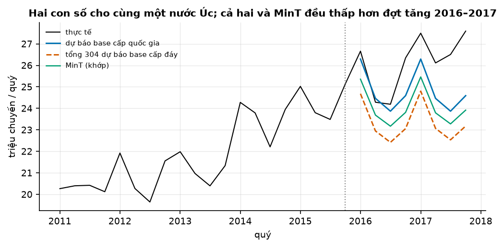
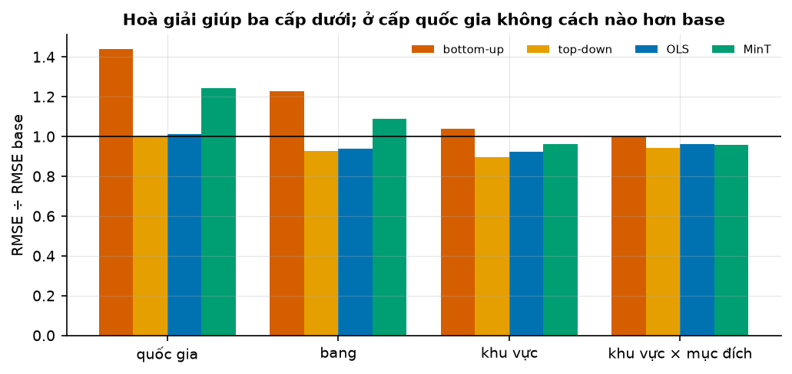
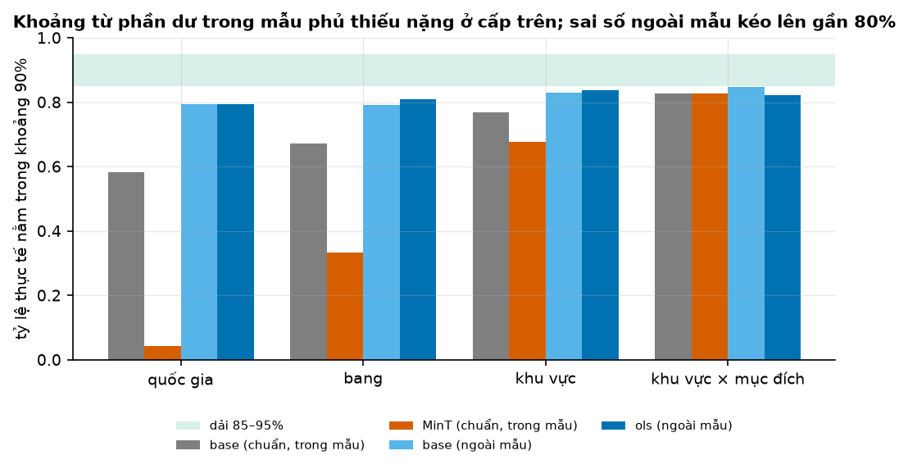

# Buổi 28 — Dự báo phân cấp và reconciliation

## 1. Mục tiêu

Sau buổi này bạn:

- Viết một cây phân cấp thành ma trận tổng $S$ và đo độ lệch cộng của các dự báo làm riêng từng cấp.
- Hoà giải (reconcile) dự báo bằng bottom-up, top-down, OLS (tự viết) và MinT, rồi so sai số ở từng cấp.
- Giải thích bằng sai số có dấu vì sao MinT có thể thua dự báo gốc ở cấp trên.
- Dựng khoảng dự báo khớp giữa các cấp và kiểm coverage của nó ở từng cấp.
- Tự đánh giá **cột mốc M4**: dự báo cộng khớp tuyệt đối, mọi khoảng được kiểm calibration.

Sản phẩm: dự báo 8 quý số chuyến du lịch trong nước của Úc cho 389 chuỗi, cộng khớp tuyệt đối giữa 4 cấp, kèm bảng sai số và coverage từng cấp.

## 2. Nhắc lại buổi trước

- **Sai số** = thực tế − dự báo. **Sai số có dấu trung bình** dương nghĩa là dự báo thường thấp hơn thực tế. **RMSE**: căn của trung bình sai số².
- **ETS** (AutoETS): làm trơn hàm mũ có mức, xu hướng, mùa vụ, tự chọn dạng. **Seasonal naive** theo quý: quý này bằng cùng quý năm trước.
- **Backtest rolling origin**: ở mỗi mốc cắt chỉ học trên dữ liệu trước mốc rồi dự báo đoạn sau; chấm trên nhiều mốc.
- **Khoảng dự báo 90%**, **coverage**: tỷ lệ số lần thực tế rơi vào khoảng. Khoảng lấy từ phần dư trong mẫu thường quá hẹp; khoảng lấy từ sai số
  ngoài mẫu (của các mốc cũ) mới phản ánh sai số thật.
- **Hạng conformal**: với n sai số cũ, cận trên của khoảng hai phía mức 1 − α là giá trị thứ ⌈(n + 1)(1 − α/2)⌉ khi xếp tăng.
- **Sample path** (kịch bản): một bộ giá trị tương lai rút cùng lúc, giữ quan hệ giữa các chuỗi và các bước.
- **Hiệp phương sai** của hai sai số: dương nếu chúng hay cùng lớn, cùng nhỏ; âm nếu cái này lớn thì cái kia nhỏ.

## 3. Trạng thái đầu buổi

Sau `python lab.py up` (trong thư mục `lab/`):

| Hạng mục | Trạng thái |
|---|---|
| Dữ liệu | `du-lieu/raw/tourism-australia-tsibble/tourism.rda` — số chuyến du lịch qua đêm trong nước (nghìn chuyến), 76 khu vực × 4 mục đích, 80 quý 1998Q1 → 2017Q4 |
| Nguồn | Tourism Research Australia (CC BY 4.0), qua gói R tsibble (GPL-3); đọc bằng thư viện `rdata` |
| Cây | quốc gia (1) → bang (8) → khu vực (76) → khu vực × mục đích (304): 389 chuỗi |
| Chấm | 3 mốc cắt 2013Q4, 2014Q4, 2015Q4, mỗi mốc dự báo 8 quý |
| Môi trường | Python 3.12; statsforecast 2.1.1, hierarchicalforecast 1.5.1, rdata 1.1.0, pandas 2.3.3 |
| `code/phan_cap.py` | `doc_du_lich`, `tong_hop`, `ma_tran_S`, `do_lech_cong`, `hoa_giai_ols`, `du_bao_mot_moc`, `du_bao_khop`, `backtest`, `bang_sai_so`, `coverage`, `sai_so_ngoai_mau`, `khoang_khop` |
| `code/lab.ipynb` | notebook của Lab, bước 1–7 |
| **Đang cố tình sai** | `PHUONG_PHAP = "AutoETS"`: dự báo đem dùng là dự báo làm riêng từng chuỗi |
| **Triệu chứng** | dự báo cả nước khác tổng 304 dự báo cấp đáy tới 1.613 nghìn chuyến một quý |
| `python lab.py check` lúc này | ĐỎ: 1/6 test hỏng |

## 4. Lý thuyết

Bộ du lịch Úc: mỗi quý có số chuyến qua đêm cho từng khu vực và mục đích (nghỉ lễ, thăm người thân, công tác, khác). Cộng lên thành khu vực, bang,
cả nước. Phòng kế hoạch mỗi cấp cần một con số, và các con số phải cộng khớp.

### Từ mới trong buổi

| Thuật ngữ | Nghĩa một câu | Ví dụ |
|---|---|---|
| chuỗi phân cấp | Nhiều chuỗi lồng nhau: chuỗi cấp trên bằng tổng các chuỗi cấp dưới. | Cả nước = tổng 8 bang. |
| ma trận tổng S | Bảng 0/1 cho biết mỗi chuỗi cộng từ những chuỗi đáy nào. | Cả nước, Bắc, Nam: S có ba dòng (1, 1), (1, 0), (0, 1). |
| khớp / không khớp | Dự báo khớp khi mỗi chuỗi cấp trên bằng đúng tổng dự báo bên dưới. | Bắc 4 + Nam 5 = 9 mà cả nước 10 → lệch 1. |
| dự báo base | Dự báo làm riêng từng chuỗi, chưa hoà giải. | 389 AutoETS riêng rẽ. |
| reconciliation (hoà giải) | Chỉnh dự báo base thành một bộ khớp. | Chia phần lệch 1 cho ba chuỗi. |
| bottom-up | Chỉ dự báo cấp đáy rồi cộng lên. | Cả nước = 4 + 5 = 9. |
| top-down | Chỉ dự báo cấp đỉnh rồi chia xuống theo tỷ lệ. | 10 chia theo tỷ lệ 4 : 5 → 4,44 và 5,56. |
| middle-out | Dự báo một cấp giữa, cộng lên và chia xuống. | Dự báo 8 bang. |
| OLS, MinT | Hoà giải tối ưu: OLS chia phần lệch đều; MinT chia theo độ lớn và tương quan sai số của từng chuỗi. | Chuỗi đoán kém bị sửa nhiều hơn. |
| reconciliation xác suất | Làm cho cả khoảng dự báo (hay kịch bản) khớp giữa các cấp. | Hoà giải từng kịch bản rồi mới tính khoảng. |
| phân cấp theo thời gian | Cùng một chuỗi ở nhiều tần suất phải khớp: năm = tổng 4 quý. | Dự báo năm 100 mà 4 quý cộng ra 103. |

### 4.1 Cây phân cấp, ma trận S và dự báo không khớp

**Vấn đề.** Dự báo riêng từng chuỗi thì mỗi chuỗi dùng hết thông tin của nó, nhưng các con số không cộng lại được. Phòng tài chính cả nước và phòng
kế hoạch từng bang sẽ cầm hai con số khác nhau cho cùng một thực tế.

**Trực giác.** Mỗi chuỗi trong cây là tổng của vài chuỗi đáy. Ghi điều đó thành một bảng 0/1, gọi là $S$. Bộ dự báo khớp là bộ mà mọi chuỗi đều
bằng $S$ nhân các chuỗi đáy: mỗi dòng của $S$ nói "cộng những chuỗi đáy có số 1".

**Ví dụ số nhỏ — tự tính tay.** Cả nước = Bắc + Nam. Dự báo base: cả nước 10, Bắc 4, Nam 5.

- $S$ có ba dòng: cả nước (1, 1), Bắc (1, 0), Nam (0, 1).
- Nhân $S$ với chuỗi đáy (4, 5): cả nước phải là 1 × 4 + 1 × 5 = 9. Dự báo base nói 10: lệch cộng **1**.

**Công thức.**

$$
\boldsymbol y_t = S\, \boldsymbol b_t
$$

- $\boldsymbol y_t$: mọi chuỗi ở thời điểm $t$ (389 số); $\boldsymbol b_t$: các chuỗi đáy (304 số); $S$: ma trận tổng 389 × 304.

**Nói bằng lời.** Mọi chuỗi đều là tổng có chọn lọc của các chuỗi đáy; dòng cả nước của $S$ toàn số 1, nên cả nước bằng tổng 304 chuỗi đáy.



**Cách đọc hình.**

1. **Trục ngang**: quý, 2011 → 2017; gạch chấm là mốc cắt 2015Q4.
2. **Trục dọc**: triệu chuyến mỗi quý.
3. **Màu**: đen thực tế; xanh dương dự báo base cấp quốc gia; cam đứt tổng 304 dự báo base cấp đáy; xanh lá MinT (đã khớp).
4. **Nhìn vào đâu**: khoảng cách giữa đường xanh dương và đường cam; và cả ba đường so với đường đen.
5. **Kết luận**: hai dự báo cho cùng nước Úc cách nhau khoảng 1,6 triệu chuyến mỗi quý. Cả ba đường đều nằm dưới đợt tăng 2016–2017.

**Dữ liệu thật.** Ở mốc cắt cuối, dự báo base lệch cộng lớn nhất 1.613 nghìn chuyến. Seasonal naive tự khớp (lệch 0): tổng của các "cùng quý năm
trước" chính là "cùng quý năm trước" của tổng.

**Phân cấp và nhóm chéo.** Cây du lịch ở đây là phân cấp thuần: mỗi khu vực thuộc đúng một bang. Thêm cấp "mục đích của cả nước" (tổng mọi khu vực
cùng mục đích) thì mục đích cắt ngang các bang, gọi là cấu trúc **nhóm chéo** (grouped). Ví dụ: Bắc nghỉ lễ, Bắc công tác, Nam nghỉ lễ, Nam công tác
là $(3, 1, 2, 3)$. Khi đó cả nước nghỉ lễ là 3 + 2 = 5, cả nước công tác là 1 + 3 = 4. $S$ chỉ thêm hai dòng; mọi cách hoà giải dùng y như cũ.

**Tóm lại.** **Ma trận S ghi cách cộng từ chuỗi đáy lên mọi chuỗi. Dự báo làm riêng từng chuỗi gần như không bao giờ khớp.**

**Tự kiểm tra.** Cây: cả nước = A + B + C. Dự báo base (cả nước, A, B, C) là $(30, 8, 12, 9)$. Viết dòng cả nước của $S$ và tính lệch cộng.

<details>
<summary>Đáp án</summary>

Dòng cả nước là (1, 1, 1). Tổng đáy 8 + 12 + 9 = 29; dự báo cả nước 30: lệch **1**. Nhầm hay gặp: viết dòng cả nước là (1, 0, 0), tức chỉ lấy A.

</details>

### 4.2 Bottom-up và top-down

**Vấn đề.** Cách đơn giản nhất để khớp: chỉ tin một cấp rồi suy ra các cấp khác.

**Trực giác.** Bottom-up tin cấp đáy và cộng lên: giữ chi tiết nhưng cấp đáy thường nhiễu. Top-down tin cấp đỉnh và chia xuống theo tỷ lệ: tận dụng
chuỗi tổng ít nhiễu nhưng mất khác biệt riêng của từng chuỗi đáy. Middle-out dự báo một cấp giữa (ví dụ 8 bang), cộng lên và chia xuống.

**Ví dụ số nhỏ — tự tính tay.** Dùng lại dự báo base của mục 4.1: $(10, 4, 5)$ cho (cả nước, Bắc, Nam).

- Bottom-up: cả nước = 4 + 5 = **9**; Bắc 4; Nam 5.
- Top-down theo tỷ lệ dự báo: Bắc chiếm 4/9, Nam 5/9. Cả nước giữ 10; Bắc = 10 × 4/9 ≈ **4,44**; Nam ≈ **5,56**.

**Tỷ lệ lấy từ đâu.** Tỷ lệ lịch sử (năm qua Bắc chiếm 40%) cho Bắc 4 và Nam 6: đơn giản nhưng giữ nguyên tỷ lệ cũ cho mọi quý, dù mỗi khu vực có mùa
vụ riêng. Tỷ lệ dự báo lấy từ chính dự báo base cấp đáy, nên theo được mùa vụ và xu hướng riêng của từng chuỗi.

**Dữ liệu thật.** Xem bảng mục 4.3: bottom-up tệ nhất ở cấp quốc gia và bang; top-down theo tỷ lệ dự báo tốt nhất ở ba cấp dưới.

**Tóm lại.** **Bottom-up tin cấp đáy, top-down tin cấp đỉnh; cả hai bỏ thông tin của các cấp còn lại.**

**Tự kiểm tra.** Dự báo base (cả nước, A, B, C) là $(30, 8, 12, 9)$. Tính dự báo của A theo bottom-up và theo top-down (tỷ lệ dự báo).

<details>
<summary>Đáp án</summary>

Bottom-up: A = **8** (cả nước thành 29). Top-down: A = 30 × 8/29 ≈ **8,28**. Nhầm hay gặp: chia 30 cho 3 cấp đáy đều nhau (10), bỏ mất tỷ lệ.

</details>

### 4.3 Hoà giải tối ưu: OLS và MinT

**Vấn đề.** Không tin riêng cấp nào: dùng dự báo base của mọi cấp, rồi chỉnh ít nhất có thể để chúng khớp.

**Trực giác.** Coi phần lệch cộng là sai số phải chia cho các chuỗi. OLS chia đều. MinT chia theo độ tin cậy: chuỗi nào dự báo base hay sai nhiều thì bị
sửa nhiều, chuỗi nào chắc chắn thì giữ gần nguyên. MinT cũng tính tới việc sai số các chuỗi đi cùng nhau (hiệp phương sai).

**Ví dụ số nhỏ — tự tính tay.** Vẫn dự báo base $(10, 4, 5)$, lệch cộng 1.

- OLS: chia đều cho ba chuỗi, mỗi chuỗi dịch 1/3. Cả nước 10 − 1/3 ≈ **9,67**; Bắc 4 + 1/3 ≈ **4,33**; Nam ≈ **5,33**. Kiểm: 4,33 + 5,33 = 9,67.
- MinT với phương sai sai số (trung bình bình phương sai số) $(4, 1, 1)$ cho (cả nước, Bắc, Nam), không có hiệp phương sai: chia phần lệch 1 theo
  tỷ lệ 4 : 1 : 1. Cả nước 10 − 4/6 ≈ **9,33**; Bắc 4 + 1/6 ≈ **4,17**; Nam ≈ **5,17**. Chuỗi cả nước kém chắc chắn nhất nên bị sửa nhiều nhất.

**Công thức.**

$$
\tilde{\boldsymbol y} = S G \hat{\boldsymbol y}, \qquad G_{\text{OLS}} = (S^\top S)^{-1} S^\top, \qquad G_{\text{MinT}} = (S^\top W^{-1} S)^{-1} S^\top W^{-1}
$$

- $\hat{\boldsymbol y}$: dự báo base mọi chuỗi; $G$: cách ghép dự báo base thành dự báo cấp đáy; $\tilde{\boldsymbol y}$: dự báo đã khớp.
- $W$: hiệp phương sai sai số một bước của các chuỗi; MinT "shrink" giảm bớt phần hiệp phương sai giữa các chuỗi cho ổn định. $^\top$: đảo hàng thành cột;
  $^{-1}$: nghịch đảo ma trận.

**Nói bằng lời.** Từ dự báo base mọi cấp, tính ra một bộ chuỗi đáy "hợp nhất" (bước $G$), rồi cộng lên bằng $S$, nên kết quả luôn khớp. OLS coi mọi chuỗi
tin như nhau; MinT tin chuỗi ít sai hơn (Wickramasuriya et al. 2019).

**Khi nào hoà giải không làm hỏng.** Nếu dự báo base không chệch (sai số có dấu trung bình bằng 0) và $G$ thoả $SGS = S$ (bottom-up, OLS, MinT đều thoả) thì dự báo đã khớp cũng không
chệch (FPP §11.3). Cấp trên ít nhiễu cho thông tin về tổng, cấp dưới cho thông tin về cách chia; MinT trộn cả hai theo độ tin cậy. Vì thế trên nhiều bộ
dữ liệu nó thắng ở mọi cấp (Wickramasuriya et al. 2019). Điều kiện "không chệch" là chỗ bộ dữ liệu của buổi này phá vỡ, như bảng dưới cho thấy.

**Thư viện.** `MinTrace(method="ols")` và `MinTrace(method="mint_shrink")` của hierarchicalforecast; hàm `hoa_giai_ols` trong `code/` tự viết công thức OLS
và khớp thư viện tới $3 \cdot 10^{-11}$.

**Chấm theo từng cấp.** Chuỗi cả nước lớn gấp hàng nghìn lần chuỗi đáy; gộp RMSE cả cây thì cấp quốc gia át hết. Vì vậy chấm riêng từng cấp, lấy trung bình
RMSE các chuỗi trong cấp. Muốn một con số cho cả cây thì dùng chỉ số không đơn vị như MASE (MAE chia MAE của seasonal naive trên phần
học) rồi lấy trung bình.

**Dữ liệu thật.** RMSE trung bình mỗi chuỗi (nghìn chuyến/quý), 3 mốc cắt × 8 quý:

| Cấp | base | seasonal naive | bottom-up | top-down | OLS | MinT |
|---|---|---|---|---|---|---|
| quốc gia | **2.071** | 2.191 | 2.983 | **2.071** | 2.101 | 2.572 |
| bang | 339 | 337 | 416 | **314** | 318 | 369 |
| khu vực | 52,8 | 54,7 | 54,9 | **47,4** | 48,8 | 50,8 |
| khu vực × mục đích | 19,3 | 21,5 | 19,3 | **18,2** | 18,6 | 18,5 |

**Đọc bảng.** So cột MinT với cột base: MinT thắng ở hai cấp dưới, thua ở cấp quốc gia và bang. OLS thắng base ở ba cấp dưới, gần bằng ở cấp quốc gia.
Ở cấp quốc gia không cách nào hơn base (top-down giữ nguyên base ở đó).

**Vì sao MinT thua ở cấp trên.** Sai số có dấu trung bình (thực tế − dự báo), nghìn chuyến/quý:

| Cấp | base | bottom-up | OLS | MinT |
|---|---|---|---|---|
| quốc gia | 1.745 | 2.847 | 1.791 | 2.391 |
| bang | 255 | 356 | 224 | 299 |

**Đọc bảng.** Mọi cách đều dương: 2016–2017 du lịch tăng mạnh, mọi dự báo đều thấp. Tổng các dự báo cấp đáy (bottom-up) thấp nhất. Chuỗi cả nước có phần
dư quá khứ lớn nhất (tính theo nghìn chuyến), nên MinT sửa nó nhiều nhất, như ví dụ tay, và kéo nó về phía tổng cấp đáy. MinT chỉ tối ưu khi dự báo base **không chệch**; khi cấp dưới cùng chệch một phía, nó
dồn phần chệch lên cấp trên. FPP §11.4 cũng thấy base thắng MinT ở cấp tổng trên chính bộ dữ liệu này.



**Cách đọc hình.**

1. **Trục ngang**: bốn cấp. 2. **Trục dọc**: RMSE chia RMSE của base; dưới 1 là tốt hơn base.
3. **Màu**: cam bottom-up, vàng top-down, xanh dương OLS, xanh lá MinT. 4. **Nhìn vào đâu**: cột nào vượt đường 1.
5. **Kết luận**: ở cấp quốc gia và bang, bottom-up và MinT vượt 1; ở hai cấp dưới, mọi cách trừ bottom-up đều dưới 1.

**Tóm lại.** **Hoà giải tối ưu gộp thông tin của mọi cấp thành một bộ khớp. MinT chỉ tối ưu khi dự báo base không chệch; luôn xem sai số có dấu
từng cấp trước khi tin nó.**

**Tự kiểm tra.** Dự báo base (cả nước, A, B, C) là $(30, 8, 12, 9)$, lệch 1. Cây một đỉnh nên OLS chia phần lệch đều cho mọi chuỗi, như ví dụ
trên. Tính dự báo OLS của từng chuỗi.

<details>
<summary>Đáp án</summary>

Bốn chuỗi, mỗi chuỗi dịch 1/4 = **0,25**: cả nước 29,75; A 8,25; B 12,25; C 9,25. Kiểm: 8,25 + 12,25 + 9,25 = 29,75. Nhầm hay gặp: dồn cả phần lệch vào
cả nước (thành 29, tức bottom-up) hoặc chỉ chia cho ba chuỗi đáy.

</details>

### 4.4 Khoảng dự báo khớp và kiểm calibration từng cấp

**Vấn đề.** Kế hoạch cần khoảng, không chỉ con số. Khoảng cũng phải khớp: không thể cộng các cận trên của từng bang để ra cận trên cả nước.

**Trực giác.** Cận trên 90% của mỗi bang là trường hợp "bang đó đông khách hiếm có". Tám bang hiếm khi cùng lúc hiếm có, nên tổng tám cận trên rộng quá
mức. Cách đúng: tạo nhiều kịch bản cho **cả cây cùng lúc**, hoà giải từng kịch bản, rồi mới lấy khoảng ở mỗi cấp (Panagiotelis et al. 2023).

**Ví dụ số nhỏ — tự tính tay.** Hai bang, ba kịch bản sai số: bang A (−2, 0, 2), bang B (2, 0, −2) — A lên thì B xuống.

- Cận trên của từng bang là 2; cộng lại: 4.
- Sai số của tổng trong ba kịch bản: 0, 0, 0. Cận trên của tổng: **0**. Cộng cận trên của từng bang sai tới 4.

**Hai cách lấy kịch bản.** Cách thứ nhất: giả định chuẩn với phần dư **trong mẫu** (mặc định `intervals_method="normality"`). Cách thứ hai: sai số
**ngoài mẫu** — backtest AutoETS mỗi quý, dự báo bốn quý tới; ở mỗi mốc lấy mọi vector sai số của các mốc cũ đã biết đủ thực tế, cộng vào dự báo base thành kịch bản, hoà giải từng
kịch bản, khoảng lấy theo hạng conformal. Lấy nguyên cả vector 389 sai số của cùng một mốc để giữ việc các chuỗi hay sai cùng chiều,
như ví dụ tính tay ở trên.

**Thư viện có sẵn gì.** hierarchicalforecast có bốn cách: `normality` (giả định chuẩn với hiệp phương sai $W$), `bootstrap` (kịch bản từ phần dư quá khứ, giữ
tương quan giữa các chuỗi), `permbu` (rút riêng cấp đáy rồi ghép theo thứ hạng để giữ tương quan; Ben Taieb et al. 2017) và `conformal` (Principato et al.
2024). Cả bốn mặc định dùng phần dư trong mẫu; muốn dùng sai số ngoài mẫu phải tự đưa vào, như cách thứ hai ở trên.

**Dữ liệu thật.** Coverage của khoảng 90%, theo cấp. Hai dòng trong mẫu chấm trên 3 mốc × 8 quý như mục 4.3; hai dòng ngoài mẫu cần các mốc cũ
để có sai số, nên chấm trên 17 mốc 2012Q4–2016Q4 × 4 quý:

| Cách | quốc gia | bang | khu vực | khu vực × mục đích |
|---|---|---|---|---|
| base, chuẩn, trong mẫu | 58,3% | 67,2% | 76,9% | 82,8% |
| MinT, chuẩn, trong mẫu | 4,2% | 33,3% | 67,7% | 82,7% |
| base, ngoài mẫu | 79,4% | 79,2% | 83,0% | 84,8% |
| OLS, ngoài mẫu (khớp) | 79,4% | 80,9% | 83,6% | 82,1% |

**Đọc bảng.** So dòng một với dòng ba (khác đoạn chấm, nên chỉ so gần đúng): sai số ngoài mẫu kéo coverage cấp quốc gia từ 58% lên 79%.

Khoảng MinT trong mẫu gần như vô dụng ở cấp quốc gia, vì nó hẹp mà dự báo điểm lại chệch thấp. Dòng cuối là khoảng khớp tốt nhất nhưng vẫn thiếu 6–11 điểm
phần trăm so với mức hứa.



**Cách đọc hình.**

1. **Trục ngang**: bốn cấp. 2. **Trục dọc**: tỷ lệ thực tế nằm trong khoảng 90%.
3. **Màu**: xám và cam là khoảng chuẩn trong mẫu (base, MinT); xanh nhạt và xanh đậm là khoảng ngoài mẫu (base, OLS); dải xanh lá là 85–95%.
4. **Nhìn vào đâu**: cột nào chạm dải xanh lá.
5. **Kết luận**: không cột nào vào dải; khoảng ngoài mẫu gần nhất, đều quanh 80%.

**Vì sao vẫn thiếu.** Đoạn chấm rơi vào đợt tăng du lịch: trên 17 mốc đó, sai số có dấu trung bình của base cấp quốc gia là +1.113 nghìn chuyến. Sai số tương lai lớn hơn và
lệch một phía hơn mọi sai số quá khứ — đúng kiểu trôi mà split conformal không theo kịp (buổi 26). Thêm nữa, 80 quý chỉ cho vài chục vector sai số để hiệu
chỉnh. Đây là giới hạn thật của dữ liệu, cần ghi vào báo cáo thay vì giấu.

> **Nâng cao — có thể bỏ qua lần đọc đầu: phân cấp theo thời gian.** Năm là tổng bốn quý. Có thể dự báo năm (ETS trên chuỗi năm) và dự báo bốn quý
> riêng rẽ, rồi hoà giải bằng $S = [1\ 1\ 1\ 1;\ I_4]$ (Athanasopoulos et al. 2017). Bảng dưới thử trên chuỗi cả nước.

| Năm 2016, cả nước | ETS năm | tổng 4 quý | sau hoà giải OLS | thực tế |
|---|---|---|---|---|
| cả năm (nghìn chuyến) | 97.448 | 99.221 | 97.803 | 101.485 |
| MAE quý | — | 656 | 921 | — |

**Đọc bảng.** Dự báo năm kém hơn tổng bốn quý, nên hoà giải kéo các quý đi sai. Hoà giải chỉ giúp khi cấp gộp mang thông tin tốt.

**Tóm lại.** **Hoà giải từng kịch bản của cả cây rồi mới lấy khoảng; không cộng các cận. Kiểm coverage ở từng cấp: khoảng trong mẫu thiếu nặng ở cấp trên,
sai số ngoài mẫu kéo lên gần 80%, phần còn thiếu phải được giải thích bằng số.**

**Tự kiểm tra.** Hai bang, bốn kịch bản sai số: A (1, 2, 3, 4), B (1, 2, 3, 4) — A và B luôn cùng chiều. Cận trên (giá trị lớn nhất) của tổng có bằng tổng
hai cận trên không?

<details>
<summary>Đáp án</summary>

Tổng trong bốn kịch bản: 2, 4, 6, 8; lớn nhất **8** = 4 + 4. **Có**, vì hai bang luôn cùng lúc lớn. Cộng cận trên chỉ đúng khi các chuỗi hoàn toàn đi cùng
nhau; thường thì chúng không, như ví dụ ở trên. Nhầm hay gặp: kết luận từ trường hợp này rằng lúc nào cũng cộng được.

</details>

## 5. Lab từng bước

Lệnh gõ trong terminal ở thư mục `lab/`. Code các bước nằm sẵn trong `code/lab.ipynb` (mở bằng `python lab.py notebook` hoặc VS Code), chạy từng ô
từ trên xuống. Bạn sửa `code/phan_cap.py`; notebook tự nạp lại bản mới.

### Bước 1 — Cây phân cấp và ma trận S

**Mục đích:** dựng cây 389 chuỗi (mục 4.1).

```bash
python lab.py up           # một lần: môi trường + dữ liệu, kiểm sha256
python lab.py check        # 1/6 test đỏ
python lab.py notebook     # chạy ô bước 1
```

**Đọc kết quả:** S 389 × 304; 1, 8, 76, 304 chuỗi; 80 quý.

### Bước 2 — Dự báo base và độ lệch cộng

**Mục đích:** thấy dự báo base không khớp (mục 4.1–4.3).

**Đọc kết quả:** AutoETS lệch 1.613; bottom-up, OLS, MinT lệch 0. Dòng cuối: dự báo đem dùng đang lệch 1.613. Sửa `PHUONG_PHAP` sang một cột đã hoà giải
(ví dụ `"AutoETS/MinTrace_method-mint_shrink"` hoặc `"AutoETS/MinTrace_method-ols"`); chạy lại phải ra 0.

### Bước 3 — OLS tự viết

**Mục đích:** kiểm công thức OLS mục 4.3 với thư viện.

**Đọc kết quả:** lệch lớn nhất cỡ $10^{-11}$. Lệch lớn thì kiểm lại thứ tự dòng của dự báo có khớp thứ tự dòng của $S$ không.

### Bước 4 — Backtest theo từng cấp

**Mục đích:** bảng RMSE và sai số có dấu (mục 4.3). Khoảng 15 giây.

**Đọc kết quả:** hai bảng như mục 4.3.

### Bước 5 — Khoảng khớp và calibration

**Mục đích:** coverage từng cấp của khoảng trong mẫu và ngoài mẫu (mục 4.4). Khoảng 1–2 phút.

**Đọc kết quả:** các dòng coverage như bảng mục 4.4.

### Bước 6 — Phân cấp theo thời gian

**Mục đích:** thử hoà giải năm và quý (hộp Nâng cao mục 4.4).

**Đọc kết quả:** MAE quý 656 → 921 (2016) và 1.102 → 1.466 (2017).

### Bước 7 — Kiểm tra

```bash
python lab.py check        # 6/6 xanh
```

**Mục đích:** chấm toàn bộ.

**Đọc kết quả:** xanh 6/6 là xong. `test_du_bao_dem_dung_cong_khop_moi_cap` còn đỏ thì dự báo đem dùng vẫn chưa hoà giải.

## 6. Lỗi thường gặp & cách chẩn đoán

| Triệu chứng | Nguyên nhân | Chẩn đoán | Sửa |
|---|---|---|---|
| Các phòng cầm số không cộng lại được | dự báo riêng từng cấp | lệch cộng giữa mỗi chuỗi và tổng bên dưới | hoà giải (mục 4.2–4.3) |
| MinT thua base ở cấp trên | dự báo base cấp dưới chệch cùng một phía | sai số có dấu theo cấp | kiểm và giảm chệch ở cấp dưới; cân nhắc OLS hoặc top-down |
| Bottom-up tệ ở cấp tổng | cộng dồn sai số và độ chệch của nhiều chuỗi đáy nhiễu | RMSE cấp tổng của bottom-up so với base | dùng hoà giải tối ưu |
| Khoảng cấp trên quá rộng | cộng cận trên của từng chuỗi | so với cận của tổng các kịch bản | hoà giải từng kịch bản (mục 4.4) |
| Khoảng phủ thiếu nặng ở cấp trên | phần dư trong mẫu, hoặc dự báo điểm chệch | coverage từng cấp trên backtest | sai số ngoài mẫu; báo phần còn thiếu |
| Kết quả OLS tự viết lệch thư viện | thứ tự chuỗi của dự báo khác thứ tự dòng của S | so tên chuỗi theo thứ tự | xếp lại theo `S_df["unique_id"]` |
| Top-down báo lỗi khi xin khoảng | `TopDown(forecast_proportions)` chỉ hỗ trợ khoảng bootstrap | thông báo lỗi của hierarchicalforecast | tách một lượt chỉ dự báo điểm |
| Hoà giải năm–quý làm quý tệ đi | dự báo năm kém (ít điểm) | MAE của dự báo năm so với tổng 4 quý | không hoà giải, hoặc cải thiện dự báo năm |

## 7. Bài tập về nhà

1. **Nhóm chéo.** Thêm cấp "mục đích" (cả nước × 4 mục đích) cắt ngang cây bang–khu vực, như FPP §11.4. Ma trận S mới có bao nhiêu dòng? MinT có đổi
   thứ hạng ở cấp quốc gia không?
2. **Giảm chệch trước khi hoà giải.** Thay AutoETS bằng ETS có xu hướng cho mọi chuỗi (`model="AAA"`), chạy lại bảng mục 4.3. Sai số có dấu cấp đáy giảm
   thì MinT ở cấp quốc gia thay đổi thế nào?
3. **Middle-out.** Dự báo 8 bang, cộng lên cả nước, chia xuống theo tỷ lệ dự báo. So RMSE với bảng mục 4.3.

## 8. Tiêu chí "Xong khi"

- [ ] `python lab.py check` xanh 6/6.
- [ ] Dự báo đem dùng lệch cộng bằng 0 ở mọi cấp.
- [ ] Bảng RMSE và sai số có dấu theo cấp; giải thích được vì sao MinT thua base ở cấp quốc gia.
- [ ] Bảng coverage khoảng 90% theo cấp, trước và sau hiệu chỉnh ngoài mẫu, kèm một câu nói phần còn thiếu do đâu.

**Cột mốc M4 — tự đánh giá sau buổi 25–28.** Đạt khi làm được cả bốn việc trên một bộ dữ liệu của mình:

| Năng lực | Buổi |
|---|---|
| Mọi khoảng lấy từ sai số ngoài mẫu và được kiểm coverage ở từng mức (PIT, reliability) | 25 |
| Khoảng giữ coverage theo thời gian khi dữ liệu trôi (ACI, coverage trượt) | 26 |
| Chẩn đoán hội tụ trước khi dùng posterior; kiểm calibration cả với số đếm | 27 |
| Dự báo cộng khớp tuyệt đối giữa các cấp; khoảng khớp; coverage từng cấp và giải thích phần chưa đạt | 28 |

## 9. Đọc thêm

- Hyndman, R.J. & Athanasopoulos, G. *FPP* (bản 3) chương 11 (§11.3 hoà giải, §11.4 du lịch Úc, §11.5 hoà giải phân phối): https://otexts.com/fpp3/hierarchical.html
- Wickramasuriya, S.L., Athanasopoulos, G. & Hyndman, R.J. (2019). Optimal forecast reconciliation for hierarchical and grouped time series through trace minimization. *JASA* 114(526).
- Panagiotelis, A., Gamakumara, P., Athanasopoulos, G. & Hyndman, R.J. (2023). Probabilistic forecast reconciliation: properties, evaluation and score optimisation. *EJOR* 306(2).
- Ben Taieb, S., Taylor, J.W. & Hyndman, R.J. (2017). Coherent probabilistic forecasts for hierarchical time series (PERMBU). *ICML*.
- Athanasopoulos, G., Hyndman, R.J., Kourentzes, N. & Petropoulos, F. (2017). Forecasting with temporal hierarchies. *EJOR* 262(1).
- hierarchicalforecast: https://nixtlaverse.nixtla.io/hierarchicalforecast/
