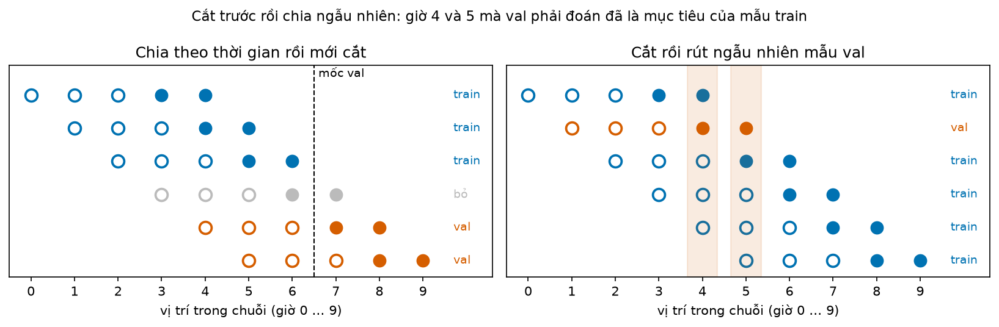
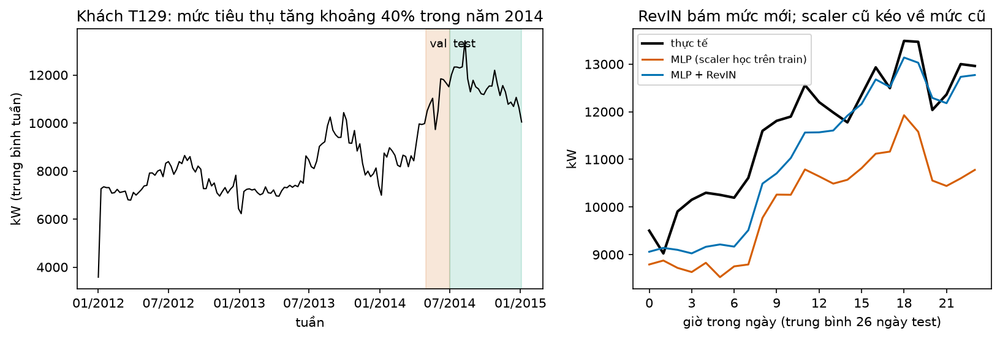
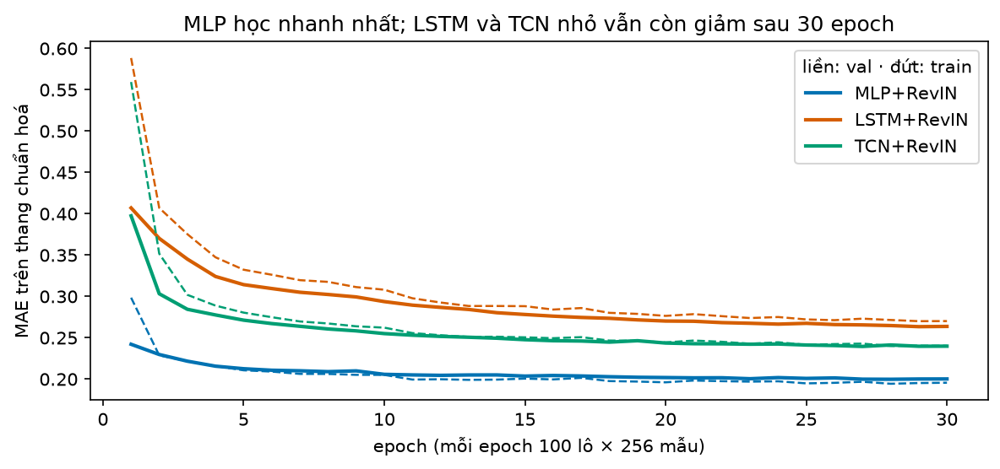

# Buổi 29 — Nền deep learning cho chuỗi thời gian

## 1. Mục tiêu

Sau buổi này bạn:

- Cắt một chuỗi thành các mẫu "168 giờ trước → 24 giờ tới". Chia train, validation và test theo thời gian **trước** khi cắt, và chứng minh
  bằng test tự động rằng không mẫu train nào có mục tiêu rơi vào thời gian của validation.
- Chuẩn hoá đúng cách: scaler chỉ học trên train; RevIN chuẩn hoá từng cửa sổ; đo RevIN giúp nhóm khách hàng đổi mức tiêu thụ bao nhiêu.
- Tự viết bằng PyTorch ba mạng MLP, LSTM, TCN và một vòng huấn luyện có dừng sớm, chạy lại ra đúng cùng con số nhờ seed.
- Đặt ba mạng cạnh seasonal naive, MSTL và LightGBM trên cùng 26 mốc test, và viết nhận định trung thực, kể cả khi mạng thua.

Sản phẩm: bảng MASE của 9 mô hình trên 50 khách hàng, kèm thời gian huấn luyện, và một đoạn nhận định vì sao mô hình nào thắng.

## 2. Nhắc lại buổi trước

- **Sai số** = thực tế − dự báo. **MAE**: trung bình trị tuyệt đối sai số. **MASE**: MAE chia cho MAE của một cách đoán ngây thơ trên phần
  học. Hôm nay cách đoán đó là "lặp lại cùng giờ tuần trước"; MASE dưới 1 nghĩa là sai ít hơn nó.
- **Seasonal naive** theo giờ với mùa vụ tuần: giờ này bằng cùng giờ 168 giờ trước. **MSTL**: tách chuỗi thành các mùa vụ (24 giờ, 168 giờ)
  cộng phần còn lại, dự báo từng phần rồi cộng lại; phần còn lại dự báo bằng AutoETS (làm trơn hàm mũ, tự chọn dạng).
- **LightGBM global**: một mô hình cây học chung mọi chuỗi, đầu vào là các **lag** (giá trị $k$ bước trước). Lag nào nhỏ hơn tầm dự báo thì
  lúc dự báo chưa có. **Học suất** (learning rate): mỗi bước học chỉ cộng một phần nhỏ phần sửa. **Dừng sớm**: ngưng học khi sai số trên
  đoạn theo dõi thôi giảm.
- **Tập train / validation / test**, chia theo thời gian: train để khớp, validation (gọi tắt **val**) để chọn cấu hình và quyết định dừng,
  test chỉ để chấm lần cuối. Chia ngẫu nhiên thì tương lai lọt vào tập học.
- **Rò rỉ tương lai**: dùng thông tin mà lúc dự báo chưa có. `kiem_ro_ri` (thư viện `tv`) cắt dữ liệu tại một mốc rồi xem kết quả trước mốc
  có đổi không; đổi là có rò rỉ.
- **Trung bình** và **độ lệch chuẩn** $\sigma$ (cỡ dao động điển hình quanh trung bình). **Chuẩn hoá z**: $z = (y - \text{trung bình}) / \sigma$.
  Ví dụ trung bình 10, $\sigma$ = 2: giá trị 14 thành $z$ = 2, tức "cao hơn trung bình hai lần độ lệch chuẩn".
- **Mô hình global**: một mô hình học chung nhiều chuỗi. **Chiến lược direct**: đoán thẳng từng tầm, không lấy dự báo làm đầu vào.

## 3. Trạng thái đầu buổi

Sau `python lab.py up` (trong thư mục `lab/`):

| Hạng mục | Trạng thái |
|---|---|
| Dữ liệu | `du-lieu/raw/monash-electricity-hourly/electricity_hourly_dataset.tsf` (34,3 MB, sha256 `bc33039133b9…`): điện tiêu thụ theo giờ (kW) của 321 khách hàng Bồ Đào Nha, 1/1/2012 → 31/12/2014, 26.304 giờ mỗi khách |
| Nguồn | Monash Time Series Forecasting Archive (CC BY 4.0), bản gộp theo giờ của UCI ElectricityLoadDiagrams20112014 |
| Buổi dùng | 50 khách hàng: 13 khách "đổi mức" (mức trung bình nửa cuối 2014 lệch hơn 30% so với trước đó) + 37 khách chọn ngẫu nhiên (seed 0); bỏ T183, khách đã ngừng dùng điện từ 9/2012 |
| Chia | train: mục tiêu trước 1/5/2014 · val: 1/5 → 30/6/2014 · test: 26 mốc, mỗi thứ Hai 00:00 từ 7/7 tới 29/12/2014, đoán 24 giờ sau mốc |
| Môi trường | Python 3.12; torch 2.14.0 (bản CPU), statsforecast 2.1.1, mlforecast 1.1.0, lightgbm 4.7.0, pandas 2.3.3 |
| `code/hoc_sau.py` | `doc_dien`, `chon_it`, `cat_cua_so`, `tao_tap`, `chia_train_val`, `hoc_scaler`, `RevIN`, `MLP`, `LSTMDuBao`, `TCN`, `huan_luyen`, `tap_moc`, `du_bao_dl`, `seasonal_naive`, `mstl`, `lightgbm`, `bang_mase` |
| `code/lab.ipynb` | notebook của Lab, bước 1–7 (chạy hết khoảng 10–15 phút trên CPU 4 nhân) |
| **Đang cố tình sai** | `chia_train_val` cắt mọi cửa sổ rồi mới rút ngẫu nhiên 20% làm val; `hoc_scaler` học trung bình, độ lệch chuẩn trên cả dữ liệu val và test |
| **Triệu chứng** | trên tập nhỏ 5 khách hàng, val báo MASE 0,98 (ngang seasonal naive) trong khi test thật 1,41 (thua 41%) |
| `python lab.py check` lúc này | ĐỎ: 2/6 test hỏng |

## 4. Lý thuyết

Mỗi khách hàng là một chuỗi điện tiêu thụ theo giờ: ban ngày cao, ban đêm thấp, cuối tuần khác ngày thường. Nhiệm vụ: lúc 00:00 thứ Hai, dùng
168 giờ vừa qua đoán 24 giờ của ngày thứ Hai. Deep learning là một cách làm việc đó bằng mạng nơ-ron. Buổi này tự viết từng bước để thấy
mạng làm gì, và chỗ nào dễ tự lừa mình.

### Từ mới trong buổi

| Thuật ngữ | Nghĩa một câu | Ví dụ |
|---|---|---|
| mẫu cửa sổ, input_size $L$, horizon $H$ | Một cặp (đầu vào $L$ giờ liền nhau → mục tiêu $H$ giờ ngay sau). | $L$ = 168, $H$ = 24: một tuần → một ngày. |
| stride | Khoảng cách giữa hai cửa sổ liên tiếp. | Stride 2: cửa sổ bắt đầu ở giờ 0, 2, 4… |
| rò rỉ chồng lấn cửa sổ | Mục tiêu của mẫu train trùng giờ với mục tiêu của mẫu val. | Val đoán giờ 4–5, train có mẫu đoán giờ 3–4 và 5–6. |
| RevIN | Chuẩn hoá mỗi cửa sổ bằng trung bình, độ lệch chuẩn của chính nó rồi đổi ngược dự báo. | 2, 4, 6 → −1, 0, 1. |
| tensor | Mảng số nhiều chiều của PyTorch, tự tính được đạo hàm. | Lô 256 cửa sổ × 168 giờ. |
| lớp tuyến tính, trọng số, bias | Mỗi đầu ra = tổng có trọng số của đầu vào + một hằng số; mạng tự học các số đó. | 0,5 × 2 + 1 × 3 + 1 = 5. |
| hàm kích hoạt, ReLU | Phép biến đổi không tuyến tính giữa hai lớp; ReLU đổi số âm thành 0. | ReLU(−3) = 0. |
| MLP | Các lớp tuyến tính xen kẽ hàm kích hoạt. | 168 → 256 → 256 → 24. |
| hàm mất mát | Con số đo mức sai trên dữ liệu học; huấn luyện là làm nó nhỏ dần. | MAE của một lô. |
| hạ gradient, autograd | Chỉnh trọng số ngược chiều đạo hàm của hàm mất mát; autograd tự tính đạo hàm. | Đạo hàm −2, học suất 0,5 → trọng số tăng 1. |
| lô, epoch, bộ tối ưu (Adam) | Lô: nhóm mẫu cho một bước cập nhật. Epoch: một vòng học. Bộ tối ưu: cách đổi đạo hàm thành bước; Adam tự chỉnh cỡ bước. | 100 lô × 256 mẫu mỗi epoch. |
| RNN, LSTM, trạng thái ẩn | Mạng đọc chuỗi từng bước, mang theo một dãy số tóm tắt quá khứ; LSTM có "cổng" để nhớ lâu. | $h$ = 0,5 × $h$ cũ + $x$. |
| gradient biến mất | Tín hiệu học về điểm xa bị nhân nhỏ dần qua từng bước. | 0,5²⁰ ≈ 0,000001. |
| TCN, tích chập nhân quả, dilation, vùng nhìn | Trượt một bộ trọng số dọc chuỗi, chỉ nhìn quá khứ; dilation giãn khoảng nhìn; vùng nhìn là số giờ quá khứ ảnh hưởng tới đầu ra. | $y_t = x_t + x_{t-2}$. |

### 4.1 Từ chuỗi thành mẫu học: cửa sổ và cách chia

**Vấn đề.** Mạng nơ-ron học từ các cặp "đầu vào → đáp án". Chuỗi điện chỉ là một dãy số dài. Phải cắt nó thành các cặp, và cắt sao cho lúc
chấm, mạng chưa từng thấy đáp án.

**Trực giác.** Đặt một khung rộng $L$ + $H$ giờ lên chuỗi: $L$ giờ đầu là đầu vào, $H$ giờ sau là mục tiêu. Trượt khung sang phải một bước
(stride 1) được mẫu kế tiếp. Hai mẫu kề nhau gần như giống hệt: chung $L - 1$ giờ đầu vào và $H - 1$ giờ mục tiêu.

**Ví dụ số nhỏ — tự tính tay.** Chuỗi 10 giờ có giá trị $0, 1, \dots, 9$; $L = 3$, $H = 2$, stride $s = 1$.

- Mẫu đầu: đầu vào $(0, 1, 2)$ → mục tiêu $(3, 4)$. Mẫu thứ hai: $(1, 2, 3) \to (4, 5)$. Mẫu cuối: $(5, 6, 7) \to (8, 9)$.
- Số mẫu: 10 − 3 − 2 + 1 = **6**. Với stride 2 chỉ lấy mẫu thứ 1, 3, 5: **3** mẫu.

Giờ chia: val phải đoán các giờ từ 7 trở đi.

- **Chia theo thời gian rồi mới cắt.** Train: mọi mẫu có mục tiêu kết thúc trước giờ 7, tức mục tiêu $(3, 4)$, $(4, 5)$, $(5, 6)$. Val: $(7, 8)$
  và $(8, 9)$. Mẫu $(6, 7)$ nằm vắt qua mốc, bỏ. Đầu vào $(4, 5, 6)$ của mẫu val nằm trong thời gian train: bình thường, đó là quá khứ đã biết.
- **Cắt rồi rút ngẫu nhiên.** Giả sử rút trúng mẫu mục tiêu $(4, 5)$ làm val. Hai mẫu train kề nó có mục tiêu $(3, 4)$ và $(5, 6)$: mạng đã học
  đúng giờ 4 và giờ 5 mà val sắp hỏi. Đó là **rò rỉ chồng lấn cửa sổ**.



**Cách đọc hình.**

1. **Trục ngang**: vị trí trong chuỗi, giờ 0 tới 9.
2. **Trục dọc**: mỗi hàng là một mẫu, không có đơn vị.
3. **Ký hiệu**: vòng rỗng là đầu vào, chấm đặc là mục tiêu; xanh dương là mẫu train, cam là mẫu val, xám là mẫu bỏ. Chữ cuối hàng ghi loại.
4. **Nhìn vào đâu**: hình phải, cột giờ 4 và 5 (dải cam nhạt): có cả chấm cam lẫn chấm xanh dương.
5. **Kết luận**: cắt trước rồi chia ngẫu nhiên thì đáp án của val đã nằm trong train.

**Công thức.** Chuỗi dài $T$, cắt với stride $s$:

$$
n = \left\lfloor \frac{T - L - H}{s} \right\rfloor + 1
$$

- $n$: số mẫu; $T$: số giờ của chuỗi; $L$: input_size; $H$: horizon; $s$: stride; $\lfloor\cdot\rfloor$: làm tròn xuống.

**Nói bằng lời.** Khung dài $L + H$ đặt được ở $T - L - H + 1$ vị trí; stride $s$ thì chỉ lấy một trong mỗi $s$ vị trí. Với 10 giờ, $L$ = 3,
$H$ = 2, $s$ = 2: (10 − 3 − 2) / 2 = 2,5, làm tròn xuống 2, cộng 1 được 3 mẫu.

**Code** (`hs` là module `hoc_sau`). `cat_cua_so(y, L, H, buoc)` trả `X` (n × $L$), `Y` (n × $H$) và vị trí mục tiêu đầu. `tao_tap(df, scaler,
tu, den)` chỉ giữ mẫu có **toàn bộ** mục tiêu nằm trong [`tu`, `den`); đầu vào được phép lấn về trước `tu`. `kiem_chong_lan` (thư viện `tv`)
kiểm tự động rằng không mục tiêu nào của train rơi vào thời gian val; bộ chấm dùng nó.

```python
X, Y, dau = hs.cat_cua_so(np.arange(10.0), L=3, H=2)
print(X[0], Y[0], len(X))          # [0. 1. 2.] [3. 4.] 6
```

**Dữ liệu thật.** Chia đúng cho 505.850 mẫu train (stride 2) và 72.050 mẫu val. Chênh bao nhiêu khi chia sai? Tuỳ mạng có học
thuộc được hay không (các mạng đều có RevIN, mục 4.2):

| Dữ liệu | Mạng | Cách chia | MASE val | MASE test (tương lai thật) |
|---|---|---|---|---|
| 5 khách, từ 1/11/2013 | MLP rộng 1.024 số, tới 200 epoch | theo thời gian | 1,486 | 1,418 |
| 5 khách, từ 1/11/2013 | MLP rộng 1.024 số, tới 200 epoch | cắt rồi rút ngẫu nhiên | 0,981 | 1,412 |
| 50 khách, từ 2012 | MLP của buổi, 30 epoch | theo thời gian | 0,763 | 0,957 |
| 50 khách, từ 2012 | MLP của buổi, 30 epoch | cắt rồi rút ngẫu nhiên | 0,740 | 0,924 |

**Đọc bảng.** So cột val với cột test trong từng dòng. Tập nhỏ, chia ngẫu nhiên: val báo mạng ngang seasonal naive, test thật cho thấy nó sai
nhiều hơn naive 41%; mạng lớn học thuộc 5 chuỗi ngắn nên đoán đúng các giờ nó đã thấy. Chia theo thời gian thì val báo đúng: thua naive nặng.
Trên 50 khách với hơn hai năm, mạng không học thuộc nổi nửa triệu mẫu, nên hai cách chia lệch val → test gần như nhau. Rò rỉ chồng lấn không
phải lúc nào cũng lộ thành số; phải chặn bằng cách chia, không chờ thấy số lạ.

**Tóm lại.** **Chia train, val, test theo thời gian trước, rồi mới cắt cửa sổ trong từng phần. Cắt trước rồi chia ngẫu nhiên thì val chứa
đáp án đã học, và càng ít dữ liệu, mạng càng lớn, val càng nói dối.**

**Tự kiểm tra.** Chuỗi $T = 20$ giờ, $L = 4$, $H = 3$, $s = 1$. Bao nhiêu mẫu? Nếu val phải đoán từ giờ 15, mẫu cuối cùng của train có mục tiêu ở
các giờ nào?

<details>
<summary>Đáp án</summary>

20 − 4 − 3 + 1 = **14** mẫu. Mục tiêu của train phải kết thúc trước giờ 15, nên mẫu cuối có mục tiêu giờ **12, 13, 14** (đầu vào 8–11).
Nhầm hay gặp: lấy mẫu có mục tiêu 13, 14, 15, tức vắt qua mốc.

</details>

### 4.2 Chuẩn hoá: scaler học trên train và RevIN

**Vấn đề.** Khách hàng nhỏ nhất dùng khoảng 10 kW, lớn nhất hàng trăm nghìn kW. Một mạng học chung mọi khách cần đầu vào cùng cỡ, nên phải
chuẩn hoá. Chuẩn hoá bằng thống kê của đoạn nào?

**Trực giác.** Cách 1: mỗi khách một cặp (trung bình, độ lệch chuẩn), học trên train, dùng mãi về sau. Cách 2 (RevIN): mỗi cửa sổ tự trừ trung
bình, chia độ lệch chuẩn của **chính nó**, dự báo xong thì nhân, cộng lại. Cách 2 tự bám theo khi khách hàng đổi mức tiêu thụ.

**Ví dụ số nhỏ — tự tính tay.**

- Scaler học trên train: train của một khách là 8, 10, 12 → trung bình 10, độ lệch chuẩn 2. Giờ test 14 kW thành $z$ = (14 − 10)/2 = **2**.
- Nếu scaler học cả giờ test: trung bình (8 + 10 + 12 + 14)/4 = 11, độ lệch chuẩn 2,58; giờ 14 thành $z$ = (14 − 11)/2,58 = 1,16. Con số
  test đã "biết" chính nó.
- RevIN: cửa sổ đầu vào 2, 4, 6 kW → trung bình 4, độ lệch chuẩn 2 → mạng nhận −1, 0, 1. Mạng đoán 0,5 trên thang đó → trả về
  4 + 0,5 × 2 = **5** kW.

**Công thức.**

$$
\tilde x_i = \frac{x_i - \mu_w}{\sigma_w}, \qquad \hat y = \mu_w + \sigma_w \, \hat z
$$

- $x_i$: giờ thứ $i$ của cửa sổ đầu vào; $\mu_w$, $\sigma_w$: trung bình, độ lệch chuẩn của **cửa sổ đó**; $\tilde x_i$: giá trị mạng nhận.
- $\hat z$: dự báo của mạng trên thang chuẩn hoá; $\hat y$: dự báo trả về kW.

**Nói bằng lời.** Mạng chỉ học **hình dạng** của cửa sổ (lên xuống quanh mức của nó); mức và biên độ lấy lại từ chính cửa sổ đầu vào. Cửa sổ
2, 4, 6 và cửa sổ 200, 400, 600 cho mạng cùng đầu vào −1, 0, 1.

**Code.** `hoc_scaler(df)` trả `{khách: (trung bình, độ lệch chuẩn)}` chỉ từ `ds < MOC_VAL`. `RevIN` có hai hàm `chuan(x)` và `tra_lai(y)`;
mỗi mạng nhận tham số `revin=True/False`. Thư viện neuralforecast (buổi 30) có sẵn `scaler_type="revin"`.

**Dữ liệu thật.** Khách T129 dùng điện tăng khoảng 40% trong năm 2014: trung bình 8.179 → 11.565 kW trước và sau mốc test.



**Cách đọc hình.**

1. **Trục ngang**: trái là tuần, 2012–2014; phải là giờ trong ngày, trung bình 26 ngày test.
2. **Trục dọc**: kW (trái là trung bình tuần).
3. **Ký hiệu**: trái: dải cam là val, dải xanh lá là test. Phải: đen là thực tế, cam là MLP dùng scaler học trên train, xanh dương là MLP + RevIN.
4. **Nhìn vào đâu**: bên phải, khoảng cách từ mỗi đường màu tới đường đen.
5. **Kết luận**: scaler học trên train kéo dự báo về mức cũ, thấp hơn thực tế gần như mọi giờ; RevIN bám mức mới. MAE trên 26 ngày test của T129
   giảm từ 1.603 xuống 1.025 kW.

| Mô hình | MASE, 13 khách đổi mức | MASE, 37 khách còn lại |
|---|---|---|
| MLP | 1,226 | 0,866 |
| MLP + RevIN | 1,110 | 0,903 |

**Đọc bảng.** So hai dòng theo từng cột. Nhóm đổi mức: RevIN giảm sai số. Nhóm còn lại: RevIN làm MLP tệ đi một chút, vì nó bỏ thông tin "mức
thường ngày của khách này" mà scaler cũ giữ lại. Với LSTM và TCN, RevIN giúp ở cả hai nhóm (bảng mục 4.6). Không có cách chuẩn hoá thắng mọi nơi.

Chỗ hở thứ hai của `code/`: scaler học cả val và test. MASE test của MLP + RevIN thành 0,930 thay vì 0,957, đẹp hơn 2,8%. Trông như tiến bộ,
thật ra là mượn trung bình của tương lai; lúc vận hành không có số đó.

**Tóm lại.** **Scaler chỉ học trên train. RevIN chuẩn hoá theo từng cửa sổ, giúp khi mức tiêu thụ đổi, nhưng không miễn phí: nó bỏ thông tin
về mức thường ngày.**

**Tự kiểm tra.** Cửa sổ đầu vào 100, 110, 120 kW (độ lệch chuẩn 10). Mạng có RevIN trả 1,5 cho giờ tới. Dự báo bao nhiêu kW?

<details>
<summary>Đáp án</summary>

Trung bình 110, độ lệch chuẩn 10 → 110 + 1,5 × 10 = **125 kW**. Nhầm hay gặp: quên cộng lại trung bình, trả 15.

</details>

### 4.3 Mạng nơ-ron và vòng huấn luyện

**Vấn đề.** "Mạng tự học" nghĩa là gì, cụ thể từng phép tính?

**Trực giác.** Mạng là một hàm có rất nhiều núm chỉnh (trọng số). Ban đầu các núm vặn ngẫu nhiên nên dự báo sai. Mỗi bước: đo sai bao nhiêu,
tính xem vặn mỗi núm theo chiều nào thì bớt sai, vặn một chút theo chiều đó. Lặp hàng nghìn lần.

**Các khối.**

- **Lớp tuyến tính**: mỗi đầu ra là tổng có trọng số của đầu vào cộng một hằng số (bias). Đầu vào (2, 3), trọng số (0,5; 1), bias 1: đầu ra
  0,5 × 2 + 1 × 3 + 1 = 5.
- **ReLU**: đổi số âm thành 0, giữ số dương. Không có nó, nhiều lớp tuyến tính chồng lên nhau vẫn chỉ là một phép tuyến tính.
- **MLP của buổi**: $168 \to 256 \to 256 \to 24$: hai lớp giữa rộng 256 số, mỗi lớp theo sau bởi ReLU; mạng trả cả tầm dự báo một lần
  (chiến lược direct). Tổng cộng 115.224 trọng số.
- **Hàm mất mát**: MAE giữa 24 giờ dự báo và 24 giờ thật, trung bình trên lô.

**Ví dụ số nhỏ — tự tính tay: hạ gradient.** Mạng một trọng số $w$ và một bias $b$: $\hat y = w x + b$. Một mẫu: $x = 2$, đáp án $y = 10$.
Bắt đầu $w = 1$, $b = 0$, học suất 0,5. Hàm mất mát là $|y - \hat y|$.

| Bước | $w$ | $b$ | $\hat y$ | mất mát | đạo hàm theo $w$ | đạo hàm theo $b$ |
|---|---|---|---|---|---|---|
| 0 | 1 | 0 | 2 | 8 | −2 | −1 |
| 1 | 2 | 0,5 | 4,5 | 5,5 | −2 | −1 |
| 2 | 3 | 1 | 7 | 3 | −2 | −1 |
| 3 | 4 | 1,5 | 9,5 | 0,5 | −2 | −1 |
| 4 | 5 | 2 | 12 | 2 | +2 | +1 |

Tính mẫu dòng 0: dự báo 1 × 2 + 0 = 2, thấp hơn đáp án 8. Tăng $w$ thêm một chút thì dự báo tăng gấp $x$ = 2 lần chừng đó, mất mát giảm cũng
gấp 2: đạo hàm theo $w$ là −2 (dấu trừ: tăng $w$ thì mất mát giảm). Cập nhật $w$ ← 1 − 0,5 × (−2) = 2; $b$ ← 0 − 0,5 × (−1) = 0,5.

**Đọc bảng.** Mất mát giảm đều 8 → 5,5 → 3 → 0,5, rồi bước 4 nhảy **qua** đáp án (12 > 10), mất mát tăng lại và đạo hàm đổi dấu. Học suất lớn làm bước vượt đích;
nhỏ quá thì cần rất nhiều bước. Đó là lý do chọn học suất cẩn thận.

**Công thức.**

$$
w \leftarrow w - \eta \, \frac{\partial \,\text{mất mát}}{\partial w}
$$

- $\eta$: học suất; $\partial\,\text{mất mát} / \partial w$: đạo hàm của hàm mất mát theo $w$, tức mất mát đổi bao nhiêu khi $w$ tăng một chút.

**Nói bằng lời.** Mỗi trọng số bước ngược chiều đạo hàm của nó, bước dài bằng học suất nhân đạo hàm. Ở dòng 0: 1 − 0,5 × (−2) = 2.

**Autograd.** Mạng thật có hàng trăm nghìn trọng số; không ai tính đạo hàm bằng tay. PyTorch ghi lại mọi phép tính rồi tự tính đạo hàm
(`backward()`), ra đúng số ở dòng 0:

```python
w = torch.tensor(1.0, requires_grad=True); b = torch.tensor(0.0, requires_grad=True)
mat_mat = (10 - (w * 2 + b)).abs()
mat_mat.backward()
print(w.grad, b.grad)              # tensor(-2.) tensor(-1.)
```

**Vòng huấn luyện của buổi** (`huan_luyen`). Mỗi **epoch** gồm 100 bước; mỗi bước rút ngẫu nhiên một **lô** 256 mẫu train, tính MAE, gọi
`backward()`, rồi để bộ tối ưu **Adam** cập nhật. Adam là hạ gradient có tự chỉnh cỡ bước cho từng trọng số; học suất 0,001. Cuối mỗi epoch đo
MAE trên val.

**Tóm lại.** **Mạng là hàm có nhiều trọng số. Huấn luyện là lặp: tính mất mát trên một lô, autograd tính đạo hàm, bộ tối ưu dời mỗi trọng số
ngược chiều đạo hàm một bước tỷ lệ với học suất.**

**Tự kiểm tra.** Cùng mạng $\hat y = w x + b$, mẫu $x = 3$, $y = 0$, đang có $w = 1$, $b = 1$, học suất 0,1. Tính mất mát và $w$ sau một bước.

<details>
<summary>Đáp án</summary>

Dự báo 1 × 3 + 1 = 4, cao hơn đáp án, mất mát 4. Tăng $w$ thì dự báo tăng gấp 3, mất mát tăng gấp 3: đạo hàm +3. $w$ ← 1 − 0,1 × 3 = **0,7**.
Nhầm hay gặp: cộng thay vì trừ, ra 1,3 (bước về phía sai nhiều hơn).

</details>

### 4.4 LSTM: đọc chuỗi từng bước

**Vấn đề.** MLP nhận 168 giờ một lần như 168 cột rời nhau; nó không biết giờ 167 đứng ngay sau giờ 166. Có cách nào đọc chuỗi theo thứ tự?

**Trực giác.** Mạng hồi quy (RNN) đọc từng giờ một, giữ một **trạng thái ẩn**: một dãy số tóm tắt "những gì đã đọc". Mỗi giờ mới, trạng thái
cập nhật từ trạng thái cũ và giờ mới. Đọc xong 168 giờ, trạng thái cuối được đưa qua một lớp tuyến tính ra 24 giờ tới.

**Ví dụ số nhỏ — tự tính tay.** Trạng thái một số, cập nhật $h_t = 0{,}5\, h_{t-1} + x_t$, bắt đầu $h_0 = 0$. Đầu vào 1, 0, 0, 0 cho
$h = 1;\ 0{,}5;\ 0{,}25;\ 0{,}125$. Giờ đầu tiên ảnh hưởng tới trạng thái giảm một nửa mỗi bước. Sau 20 bước còn $0{,}5^{20} \approx 0{,}000001$.

Đạo hàm (mục 4.3) của trạng thái cuối theo giờ đầu tiên cũng chỉ còn $0{,}5^{167}$: đổi giờ đầu thì trạng thái cuối gần như không đổi. Đạo hàm
gần 0 thì hạ gradient gần như không chỉnh được gì cho giờ đó: **gradient biến mất**. RNN đơn giản vì vậy khó học quan hệ cách hơn vài chục bước.

**LSTM** thêm một ô nhớ $c_t$ và các **cổng** (con số từ 0 tới 1 do mạng tự tính ở mỗi bước):

$$
c_t = f_t \, c_{t-1} + i_t \, g_t
$$

- $f_t$: cổng quên, 1 là giữ nguyên trí nhớ, 0 là xoá; $i_t$: cổng ghi, bao nhiêu phần thông tin mới $g_t$ được ghi vào.

**Nói bằng lời.** Nếu cổng quên bằng 1 và cổng ghi bằng 0, ô nhớ giữ nguyên qua mọi bước: $c = 1, 1, 1, \dots$ thay vì $1;\ 0{,}5;\ 0{,}25$. Mạng tự
học lúc nào giữ, lúc nào quên. GRU là bản rút gọn của LSTM với hai cổng.

**Code.** `nn.LSTM(input_size=1, hidden_size=32)` đọc từng giờ của cửa sổ; `LSTMDuBao` lấy trạng thái ẩn sau giờ cuối đưa qua lớp tuyến tính
ra 24 giờ. 5.272 trọng số.

**Dữ liệu thật.** LSTM đọc tuần tự từng giờ nên chậm: 86 giây cho 30 epoch, gấp 19 lần MLP. Có hay không RevIN, nó đều thua seasonal naive
(bảng mục 4.6).

**Tóm lại.** **RNN đọc chuỗi theo thứ tự với một trạng thái ẩn, nhưng quên nhanh vì gradient biến mất. LSTM thêm ô nhớ có cổng nên nhớ được lâu
hơn; đổi lại chậm vì phải đọc từng bước.**

**Tự kiểm tra.** Với $h_t = 0{,}9\, h_{t-1} + x_t$, đầu vào 1 rồi toàn 0, sau bao nhiêu bước ảnh hưởng của giờ đầu xuống dưới 0,5?

<details>
<summary>Đáp án</summary>

Cần $0{,}9^k < 0{,}5$: $0{,}9^6 \approx 0{,}53$, $0{,}9^7 \approx 0{,}48$ → sau **7** bước. Hệ số gần 1 thì nhớ lâu hơn, nhưng vẫn mòn dần; muốn giữ nguyên thì cần cổng như LSTM.

</details>

### 4.5 TCN: tích chập nhân quả

**Vấn đề.** LSTM chậm vì đọc tuần tự. Có cách nào nhìn nhiều giờ cùng lúc mà vẫn tôn trọng thứ tự thời gian?

**Trực giác.** **Tích chập**: trượt một bộ trọng số ngắn dọc chuỗi, tại mỗi giờ tính tổng có trọng số của vài giờ quanh đó, như trung bình
trượt nhưng trọng số do mạng học. **Nhân quả**: chỉ lấy giờ hiện tại và các giờ trước, không lấy giờ sau. **Dilation** $d$: lấy các giờ cách
nhau $d$ bước, để vài lớp là nhìn được rất xa.

**Ví dụ số nhỏ — tự tính tay.** Chuỗi 1, 2, 3, 4; trọng số (1, 1) cho (giờ trước, giờ hiện tại); trước giờ đầu coi là 0.

- Dilation 1: $y_t = x_{t-1} + x_t$ → 0 + 1, 1 + 2, 2 + 3, 3 + 4 = **1, 3, 5, 7**.
- Dilation 2: $y_t = x_{t-2} + x_t$ → 0 + 1, 0 + 2, 1 + 3, 2 + 4 = **1, 2, 4, 6**.

Đổi giờ cuối từ 4 thành 40: ba đầu ra đầu không đổi. Đó là tính nhân quả, và bộ chấm kiểm đúng điều này.

**Công thức.** Chồng các lớp có dilation 1, 2, 4, …, $d_{\max}$, mỗi lớp bộ trọng số dài $k$:

$$
\text{vùng nhìn} = 1 + (k - 1)\,(1 + 2 + 4 + \dots + d_{\max})
$$

**Nói bằng lời.** Mỗi lớp nhìn thêm $(k-1) \times d$ giờ về quá khứ. TCN của buổi: $k$ = 3, dilation tới 64: 1 + 2 × 127 = **255** giờ, đủ
phủ 168 giờ đầu vào. Với $k$ = 2 chỉ được 128 giờ, không đủ.

**Code.** `TichChapNhanQua` đệm $(k-1)\,d$ số 0 **bên trái** rồi gọi `nn.Conv1d`; đệm hai bên là nhìn tương lai. Mỗi lớp cộng đầu vào vào
đầu ra của nó (nối tắt, giúp tín hiệu học đi qua nhiều lớp). 16 kênh, 5.928 trọng số.

**Dữ liệu thật.** TCN tính song song mọi giờ nhưng 7 lớp tích chập vẫn tốn: 240 giây cho 30 epoch trên CPU, chậm hơn cả LSTM.

**Tóm lại.** **TCN là tích chập chỉ nhìn quá khứ; dilation tăng gấp đôi mỗi lớp cho vùng nhìn rộng với ít lớp. Vùng nhìn phải ≥ input_size.**

**Tự kiểm tra.** Trọng số $(1, 1)$, dilation $d = 3$, chuỗi 5, 1, 2, 7, 4. Tính đầu ra.

<details>
<summary>Đáp án</summary>

$y_t = x_{t-3} + x_t$: 0 + 5, 0 + 1, 0 + 2, 5 + 7, 1 + 4 = **5, 1, 2, 12, 5**. Nhầm hay gặp: dùng $x_{t+3}$ (nhìn tương lai).

</details>

### 4.6 Dừng sớm, seed, và mạng đứng ở đâu

**Vấn đề.** Học bao nhiêu epoch? Chạy lại có ra đúng số cũ không? Và sau tất cả, mạng có hơn cách đơn giản không?

**Dừng sớm trên val.** Sau mỗi epoch đo MAE trên val (tháng 5–6/2014). Val không giảm 5 epoch liền thì dừng và lấy lại trọng số của epoch val
tốt nhất; số epoch chờ đó gọi là **kiên nhẫn** (patience). Ví dụ MAE val qua 5 epoch là $9;\ 7;\ 6;\ 6{,}2;\ 6{,}5$ → giữ epoch 3. Val phải chia theo thời gian (mục 4.1); val rò rỉ thì cứ giảm mãi và
dừng sớm mất tác dụng.



**Cách đọc hình.**

1. **Trục ngang**: epoch, mỗi epoch 100 lô × 256 mẫu.
2. **Trục dọc**: MAE trên thang chuẩn hoá (đơn vị: độ lệch chuẩn của khách hàng).
3. **Ký hiệu**: mỗi màu một mạng (đều có RevIN); nét liền là val, nét đứt là train.
4. **Nhìn vào đâu**: độ dốc của nét liền ở các epoch cuối, và khoảng cách giữa nét liền với nét đứt cùng màu.
5. **Kết luận**: MLP gần như phẳng từ epoch 10; LSTM và TCN còn giảm chậm tới cuối, nên không mạng nào kích hoạt dừng sớm. Val thấp hơn train
   không phải lỗi: mất mát train là trung bình trong lúc trọng số còn đang đổi, và hai tháng val dễ đoán hơn trung bình cả đoạn train.

**Seed.** Trọng số khởi tạo và việc rút lô đều ngẫu nhiên. `dat_seed(0)` đặt seed cho NumPy và PyTorch và bật chế độ tất định (phép tính nào có hai
cách làm thì luôn chọn cách cho cùng kết quả); gọi nó **trước** khi tạo mạng. Seed chưa đủ khi CPU chạy nhiều luồng. Các luồng cộng từng phần rồi gộp lại, theo thứ tự có thể đổi giữa hai lần chạy. Cộng số thực
theo thứ tự khác thì lệch ở chữ số cuối, rồi lệch lớn dần qua hàng nghìn bước. Bảng chính (4 luồng) trùng tới ba chữ số giữa các lần chạy;
thí nghiệm tập nhỏ chạy trong `with hs.so_luong(1):` (một luồng) nên trùng tuyệt đối. Máy khác loại CPU vẫn có thể lệch nhẹ.

**Bảng chính.** MASE trung bình qua các khách, mọi mốc test gộp lại (mẫu số: seasonal naive tuần trên train). Mạng học một lần trên train,
dừng sớm theo val, rồi dự báo từng mốc bằng dữ liệu thật ngay trước mốc; LightGBM cũng học một lần; MSTL học lại ở mỗi mốc trên 8 tuần gần nhất.

| Mô hình | MASE, 50 khách | MASE, 13 khách đổi mức | MASE, 37 khách còn lại | Giây huấn luyện |
|---|---|---|---|---|
| Seasonal naive | 1,124 | 1,222 | 1,089 | 0 |
| MSTL | **0,883** | **0,967** | 0,854 | 108 (học lại ở 26 mốc) |
| LightGBM | 0,896 | 1,060 | **0,838** | 8 |
| MLP | 0,960 | 1,226 | 0,866 | 5 |
| MLP + RevIN | 0,957 | 1,110 | 0,903 | 6 |
| LSTM | 1,578 | 1,870 | 1,475 | 86 |
| LSTM + RevIN | 1,202 | 1,250 | 1,185 | 88 |
| TCN | 1,245 | 1,444 | 1,175 | 240 |
| TCN + RevIN | 1,163 | 1,322 | 1,108 | 240 |

**Đọc bảng.** So mỗi dòng với dòng seasonal naive. MSTL thắng chung cuộc, LightGBM thắng ở nhóm khách ổn định. Mạng tốt nhất là MLP + RevIN: sai ít hơn seasonal naive 15% nhưng thua MSTL 8%. LSTM và TCN cỡ nhỏ thua cả seasonal
naive dù có RevIN, và chậm hơn MLP hàng chục lần.

**Vì sao mạng thua ở đây.** 50 chuỗi, hơn hai năm, mùa vụ ngày và tuần đều đặn: đúng loại bài MSTL được thiết kế cho, và LightGBM có sẵn lag
đúng mùa vụ. Mạng phải tự học những điều đó từ dữ liệu. Deep learning thường thắng khi có **rất nhiều** chuỗi liên quan, quan hệ
phức tạp với nhiều biến ngoài, hoặc cần một mô hình dùng chung cho chuỗi mới. Buổi 30 thử các kiến trúc thiết kế riêng cho dự báo, chấm
theo cùng nguyên tắc: cùng mốc test, luôn có baseline.

**Tóm lại.** **Dừng sớm dựa vào val chia theo thời gian; seed đặt trước khi tạo mạng. Luôn đặt mạng cạnh seasonal naive, một mô hình thống kê và
LightGBM trên cùng mốc test, và báo cả khi mạng thua.**

**Tự kiểm tra.** MAE val qua 8 epoch là $0{,}30;\ 0{,}26;\ 0{,}25;\ 0{,}24;\ 0{,}245;\ 0{,}25;\ 0{,}243;\ 0{,}26$. Kiên nhẫn 3 epoch. Dừng ở epoch nào, giữ trọng
số của epoch nào?

<details>
<summary>Đáp án</summary>

Tốt nhất ở epoch 4 (0,24). Ba epoch sau (5, 6 và 7) đều không thấp hơn 0,24, kể cả epoch 7 → **dừng sau epoch 7, giữ trọng số epoch 4**.
Nhầm hay gặp: giữ trọng số của epoch cuối.

</details>

## 5. Lab từng bước

Lệnh gõ trong terminal ở thư mục `lab/`. Code các bước nằm sẵn trong `code/lab.ipynb` (mở bằng `python lab.py notebook` hoặc VS Code), chạy từng
ô từ trên xuống. Bạn sửa `code/hoc_sau.py`; notebook tự nạp lại bản mới. Cả notebook chạy khoảng 10–15 phút. Máy 8 GB RAM: ở ô bước 1 đặt
`SO_KHACH = 20` (số sẽ khác tài liệu).

### Bước 1 — Dữ liệu 50 khách hàng

```bash
python lab.py up           # một lần: môi trường + dữ liệu, kiểm sha256
python lab.py check        # 2/6 test đỏ
python lab.py notebook     # chạy ô bước 1
```

**Mục đích:** đọc 50 khách, xem danh sách khách đổi mức và các mốc test (mục 4.1).

**Đọc kết quả:** 50 khách, 13 khách đổi mức, 26 mốc từ 7/7 tới 29/12/2014.

### Bước 2 — Scaler chỉ học trên train

**Mục đích:** thấy scaler của `code/` học cả tương lai, rồi sửa (mục 4.2).

**Đọc kết quả:** với `code/` gốc, scaler của T129 có trung bình 8.748 kW, cao hơn trung bình trên train (7.972 kW): scaler đã thấy đoạn test,
khi khách dùng điện nhiều hơn. Sửa `hoc_scaler` cho chỉ học trên `ds < moc`, chạy lại ô: hai số phải bằng nhau.

### Bước 3 — Cửa sổ chồng lấn và khoảng lạc quan

**Mục đích:** đo val nói dối bao nhiêu khi cắt rồi mới chia (mục 4.1), trên 5 khách. Khoảng 30 giây (chạy một luồng, mục 4.6).

**Đọc kết quả:** với `chia_train_val` gốc, MASE val thấp hơn hẳn MASE test. Sửa cho chia theo thời gian (train là `tao_tap(df, scaler, None,
MOC_VAL, buoc=BUOC_TRAIN)`, val là `tao_tap(df, scaler, MOC_VAL, MOC_TEST)`), chạy lại: val 0,981 → 1,486, test 1,412 → 1,418. Val trên 1
là tín hiệu đúng: mạng này chưa hơn seasonal naive.

### Bước 4 — MLP có và không RevIN

**Mục đích:** huấn luyện MLP trên 50 khách (mục 4.3), có và không RevIN (mục 4.2). Khoảng 15 giây.

**Đọc kết quả:** bảng lịch sử của MLP + RevIN cho MAE val đi từ 0,242 → 0,200 sau 30 epoch. Val tăng
ngay từ vài epoch đầu thì học suất quá lớn.

### Bước 5 — LSTM và TCN

**Mục đích:** LSTM có và không RevIN, TCN có RevIN (mục 4.4–4.5). Khoảng 7 phút; TCN không RevIN bỏ qua cho nhanh.

**Đọc kết quả:** thời gian như bảng mục 4.6. TCN báo lỗi kích thước thì kiểm phần đệm chỉ ở bên trái.

### Bước 6 — So với baseline

**Mục đích:** seasonal naive, MSTL, LightGBM trên cùng 26 mốc, và bảng MASE (mục 4.6). Khoảng 2 phút.

**Đọc kết quả:** bảng như mục 4.6, thiếu dòng TCN không RevIN. Viết 3–4 câu nhận định: ai thắng, hơn seasonal naive bao nhiêu, khi nào mạng đáng
dùng.

### Bước 7 — Kiểm tra

```bash
python lab.py check        # 6/6 xanh
```

**Mục đích:** chấm toàn bộ.

**Đọc kết quả:** xanh 6/6 là xong. `test_train_val_khong_chong_lan` còn đỏ thì val vẫn có mục tiêu trùng train; `test_scaler_chi_hoc_tren_train`
đỏ thì scaler còn học cả đoạn sau `MOC_VAL`.

## 6. Lỗi thường gặp & cách chẩn đoán

| Triệu chứng | Nguyên nhân | Chẩn đoán | Sửa |
|---|---|---|---|
| Val đẹp, test tệ hơn hẳn | cắt cửa sổ rồi chia ngẫu nhiên | `kiem_chong_lan` trên giờ mục tiêu của train và val | chia theo thời gian trước (mục 4.1) |
| MASE test đẹp hơn chút sau khi "sửa scaler" sai chiều | scaler học cả val, test | `kiem_ro_ri` với mốc cắt sau `MOC_VAL` | học scaler trên train (mục 4.2) |
| Dự báo kẹt ở mức cũ của khách | khách đổi mức, scaler cố định | so trung bình trước và sau mốc test | RevIN (mục 4.2) |
| Chạy lại ra số khác | seed đặt sau khi tạo mạng; nhiều luồng CPU cộng theo thứ tự đổi mỗi lần | chạy hai lần, so lịch sử mất mát từ epoch 1 | `dat_seed` trước khi tạo mạng; cần trùng tuyệt đối thì `with hs.so_luong(1):` (mục 4.6) |
| Mất mát nhảy lên xuống, không giảm | học suất quá lớn | giảm học suất 10 lần xem có giảm đều | học suất nhỏ hơn (mục 4.3) |
| LSTM thua cả seasonal naive | không chuẩn hoá theo cửa sổ; LSTM nhỏ, chuỗi dài | MASE theo nhóm khách | RevIN; hoặc dùng MLP, mô hình buổi 30 |
| TCN "quá giỏi" trên train | đệm hai bên, nhìn cả giờ sau | đổi giờ cuối đầu vào, đầu ra giờ trước có đổi? | đệm bên trái (mục 4.5) |
| Hết RAM khi cắt cửa sổ | stride 1 trên nhiều chuỗi dài | số mẫu × $L$ × 4 byte | stride 2, ít khách hơn, `SO_KHACH = 20` |

## 7. Bài tập về nhà

1. **Đổi input_size.** Chạy lại MLP + RevIN với $L$ = 24 và $L$ = 336 (sửa hằng `L`). MASE đổi thế nào? $L$ = 24 thì mạng thấy được mùa vụ tuần không?
2. **LSTM lớn hơn.** `hidden_size` 128, 60 epoch. MASE và thời gian đổi bao nhiêu? Có thắng MLP không?
3. **Kết hợp.** Lấy trung bình dự báo của MSTL, LightGBM và MLP + RevIN. MASE của trung bình so với từng mô hình?

## 8. Tiêu chí "Xong khi"

- [ ] `python lab.py check` xanh 6/6 (trong đó có test "không chồng lấn cửa sổ" và test scaler).
- [ ] Bảng khoảng lạc quan trên tập nhỏ: MASE val và test của hai cách chia, kèm một câu giải thích.
- [ ] Bảng 9 mô hình trên 26 mốc test, có thời gian huấn luyện; chạy lại với cùng seed ra cùng số.
- [ ] Một đoạn nhận định trung thực: mạng tốt nhất thắng hay thua MSTL, LightGBM, seasonal naive, bao nhiêu, và vì sao.

## 9. Đọc thêm

- Hyndman, R.J., Athanasopoulos, G. và cộng sự. *Forecasting: Principles and Practice, the Pythonic Way*, chương 14 (mạng nơ-ron, dùng
  neuralforecast): https://otexts.com/fpppy/14-neural-networks.html
- Kim, T. và cộng sự (2022). Reversible Instance Normalization for Accurate Time-Series Forecasting against Distribution Shift. *ICLR 2022*.
- Bai, S., Kolter, J.Z. & Koltun, V. (2018). An Empirical Evaluation of Generic Convolutional and Recurrent Networks for Sequence Modeling
  (TCN). arXiv:1803.01271.
- Hewamalage, H., Ackermann, K. & Bergmeir, C. (2023). Forecast evaluation for data scientists: common pitfalls and best practices. *Data
  Mining and Knowledge Discovery* 37.
- Tài liệu PyTorch: `nn.LSTM`, `nn.Conv1d`, autograd — https://docs.pytorch.org/docs/stable/
