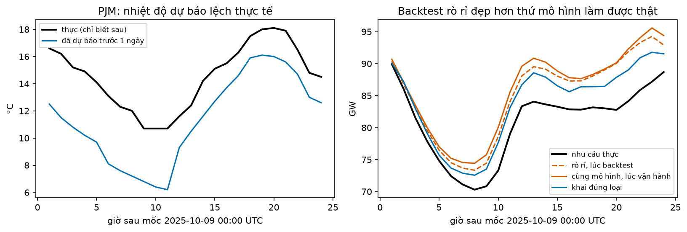
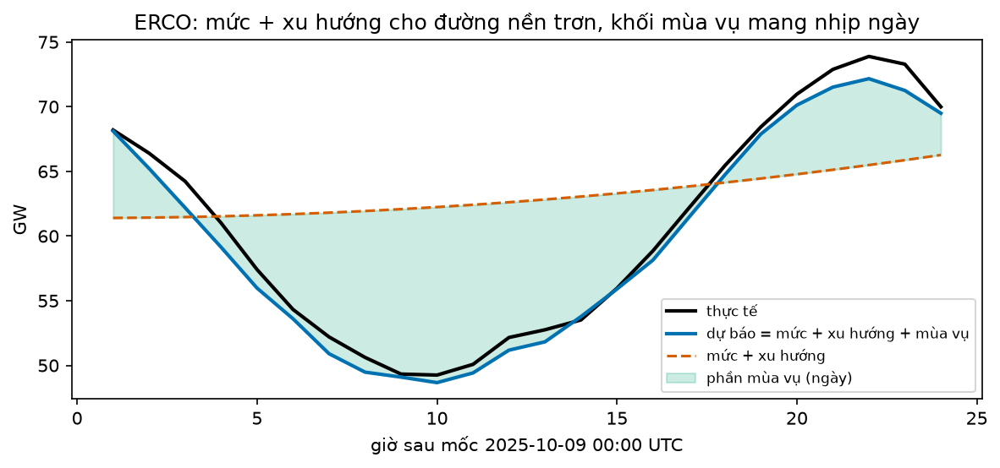
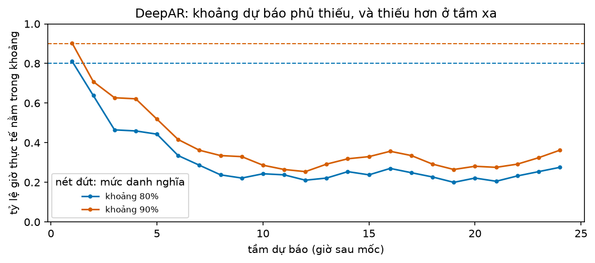
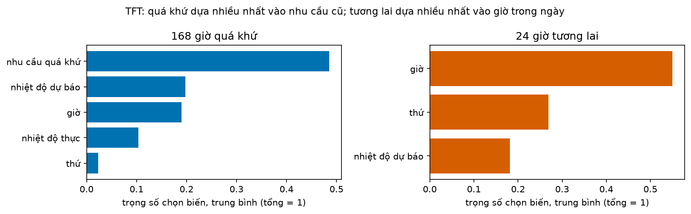

# Buổi 30 — N-BEATS, N-HiTS, DeepAR, TFT, TiDE

## 1. Mục tiêu

Sau buổi này bạn:

- Khai đúng ba loại covariate (tĩnh, quá khứ, tương lai) cho neuralforecast. Đo xem khai nhiệt độ thực là covariate tương lai làm backtest
  đẹp giả bao nhiêu.
- Giải thích bằng ví dụ số ý chính của năm kiến trúc: N-BEATS và N-HiTS (khối MLP chồng nhau), DeepAR (dự báo cả phân phối), TFT (chọn biến),
  TiDE (MLP mã hoá rồi giải mã).
- Huấn luyện cả năm trên nhu cầu điện 5 vùng của Mỹ và đặt cạnh seasonal naive, MSTL, LightGBM và dự báo do chính vùng điều độ công bố, trên
  cùng 37 mốc test, kèm thời gian huấn luyện.
- Đọc phần xu hướng, mùa vụ của N-BEATS và trọng số chọn biến của TFT; kiểm khoảng dự báo của DeepAR có phủ đúng 80% không.

Sản phẩm: bảng MASE 9 dự báo cho 5 vùng kèm thời gian, và cấu hình covariate đã sửa khỏi rò rỉ.

## 2. Nhắc lại buổi trước

- **Cửa sổ**: mạng nhận $L$ giờ gần nhất (input_size) và trả $H$ giờ tới (horizon). Hôm nay $L$ = 168, $H$ = 24.
- **MLP**: các lớp tuyến tính xen hàm kích hoạt ReLU. **Huấn luyện**: lặp tính hàm mất mát trên một lô, lấy đạo hàm, bộ tối ưu dời trọng số một
  bước (hạ gradient). **Dừng sớm**: ngưng khi sai số trên val không giảm sau một số lần kiểm (kiên nhẫn).
- **LSTM**: đọc chuỗi từng bước với trạng thái ẩn. **RevIN / chuẩn hoá theo cửa sổ**: trừ trung bình, chia độ lệch chuẩn của chính cửa sổ đầu
  vào rồi đổi ngược dự báo.
- Buổi 29 kết luận: 50 khách hàng, MSTL và LightGBM thắng ba mạng tự viết. Hôm nay dùng các kiến trúc thiết kế riêng cho dự báo, qua thư viện
  **neuralforecast**.
- **MASE**: MAE chia cho MAE của seasonal naive tuần trên đoạn train; dưới 1 là thắng "lặp lại tuần trước". **MSTL**, **LightGBM global** với lag:
  như buổi 29.
- **Covariate** (biến ngoại sinh): biến bên ngoài chuỗi giúp dự báo, như nhiệt độ khi dự báo tải điện. **Rò rỉ tương lai**: dùng số mà lúc dự báo
  chưa có.
- **Phân phối** của một đại lượng: các giá trị có thể có và khả năng của mỗi giá trị. **Quantile** mức $p$: giá trị mà $p$ phần các giá trị nằm
  dưới. **Khoảng dự báo 80%**: từ quantile 0,1 tới quantile 0,9. **Coverage**: tỷ lệ số lần thực tế nằm trong khoảng; khoảng 80% tốt thì coverage
  gần 80%.
- **Likelihood**: mức dữ liệu đã thấy "hợp" với một phân phối; học bằng likelihood là chỉnh tham số để dữ liệu thật trông hợp lý nhất.

## 3. Trạng thái đầu buổi

Sau `python lab.py up` (trong thư mục `lab/`):

| Hạng mục | Trạng thái |
|---|---|
| Nhu cầu điện | `du-lieu/raw/eia930-balance-2024-h1 … 2025-h2/` (4 tệp CSV, public domain): báo cáo EIA-930 của Cơ quan Thông tin Năng lượng Mỹ (EIA), gồm nhu cầu theo giờ (MW) và dự báo day-ahead (dự báo cả ngày hôm sau, công bố từ hôm trước) do chính vùng công bố, cho 5 vùng CISO, ERCO, MISO, NYIS, PJM |
| Nhiệt độ | `du-lieu/raw/open-meteo-du-bao-luu-<vùng>-2024-2025/` (Open-Meteo, CC BY 4.0), một thành phố mỗi vùng: nhiệt độ thực và nhiệt độ đã dự báo trước 1 ngày |
| Buổi dùng | 5 vùng × 16.800 giờ, 1/2/2024 → 31/12/2025, giờ UTC; 5 giờ nhu cầu lỗi đã lấp |
| Chia | train: trước 1/5/2025 · val (dừng sớm): 1/5 → 30/6/2025 · test: 37 mốc 00:00 UTC, cách nhau 5 ngày, 1/7 → 28/12/2025, đoán 24 giờ |
| Môi trường | Python 3.12; neuralforecast 3.2.2 (kéo theo torch 2.14.0 bản CPU, pytorch-lightning 2.5.6, ray 2.58.0), statsforecast 2.1.1, mlforecast 1.1.0, lightgbm 4.7.0, pandas 2.3.3; môi trường khoảng 1,6 GB |
| `code/kien_truc.py` | `doc_du_lieu`, `lam_sach`, `du_lieu_moc`, `tao_mo_hinh`, `huan_luyen`, `du_bao_cac_moc`, `seasonal_naive`, `eia`, `mstl`, `lightgbm`, `bang_mase`, `thanh_phan_nbeats`, `tft_chon_bien`, `coverage_theo_tam`, `doc_xe_dap` |
| `code/lab.ipynb` | notebook của Lab, bước 1–7 (khoảng 10 phút trên CPU 4 nhân) |
| **Đang cố tình sai** | `FUTR_EXOG` khai `nhiet_do_thuc` (nhiệt độ thực, chỉ biết sau) là covariate tương lai; `HIST_EXOG` rỗng |
| **Triệu chứng** | backtest đẹp hơn mức mô hình làm được lúc vận hành, khi chỉ có nhiệt độ dự báo |
| `python lab.py check` lúc này | ĐỎ: 2/5 test hỏng |

## 4. Lý thuyết

Mỗi vùng điều độ cân bằng cung và cầu điện cho một khu vực lớn; trước mỗi ngày, họ phải biết nhu cầu 24 giờ tới để xếp lịch nhà máy. Nhu cầu
lên xuống theo giờ, theo thứ trong tuần, và theo nhiệt độ (nóng thì bật điều hoà). Bài hôm nay: lúc 00:00 UTC, đoán nhu cầu 24 giờ tới của
năm vùng điều độ (tên ở bảng Từ mới).

### Từ mới trong buổi

| Thuật ngữ | Nghĩa một câu | Ví dụ |
|---|---|---|
| covariate tĩnh / quá khứ / tương lai | Tĩnh: không đổi theo thời gian. Quá khứ: chỉ biết tới lúc dự báo. Tương lai: biết trước cho cả 24 giờ tới. | Vùng; nhiệt độ đo được; nhiệt độ đã dự báo. |
| `stat_exog`, `hist_exog`, `futr_exog` | Tên ba loại đó trong neuralforecast. | `futr_exog_list=["nhiet_do_du_bao"]`. |
| N-BEATS, backcast | Chồng nhiều khối MLP; mỗi khối đoán lại quá khứ (backcast) và một phần tương lai, khối sau học phần còn lại. | Khối 1 lấy mức, khối 2 lấy độ dốc. |
| N-HiTS | Như N-BEATS nhưng mỗi khối chỉ đoán vài điểm thưa rồi nội suy. | Đoán giờ 6, 12, 18, 24 rồi nối lại. |
| DeepAR | Mạng LSTM đoán tham số một phân phối cho mỗi giờ, học bằng likelihood. | Giờ tới: trung bình 100, độ lệch chuẩn 10. |
| phân phối âm nhị thức | Phân phối cho số đếm (0, 1, 2…) khi phương sai lớn hơn trung bình. | Lượt thuê xe mỗi giờ. |
| TFT, chọn biến | Mạng có khối cho trọng số từng covariate, tổng bằng 1, ở mỗi bước. | Nhiệt độ 0,7; giờ 0,2; thứ 0,1. |
| TiDE | MLP nén quá khứ và covariate thành một dãy số ngắn rồi giải ra 24 giờ. | 245 số vào → 128 số → 24 giờ. |
| MW, GW | Megawatt, gigawatt (1 GW = 1.000 MW): công suất điện tiêu thụ trong một giờ. | Vùng lớn nhất lúc cao điểm khoảng 90 GW. |
| CISO, ERCO, MISO, NYIS, PJM | Tên viết tắt của năm vùng điều độ trong bài. | California; Texas; các bang Trung Tây; bang New York; miền Đông quanh Philadelphia. |

### 4.1 Ba loại covariate và cái giá của rò rỉ

**Vấn đề.** Nhiệt độ giúp đoán nhu cầu điện. Nhưng lúc 00:00 bạn biết nhiệt độ **nào** của 24 giờ tới? Chỉ biết con số trạm khí tượng đã
**dự báo**; nhiệt độ **thực** chỉ đo được khi giờ đó tới.

**Trực giác.** Mỗi covariate trả lời một câu hỏi: lúc ra dự báo, tôi có con số này cho các giờ tương lai không?

| Biến | Có cho 24 giờ tới lúc 00:00? | Loại |
|---|---|---|
| vùng điều độ | có, không đổi | tĩnh (`stat_exog`) |
| giờ trong ngày, thứ | có, lịch biết trước | tương lai (`futr_exog`) |
| nhiệt độ đã dự báo hôm qua | có | tương lai (`futr_exog`) |
| nhiệt độ thực | không, chỉ có quá khứ | quá khứ (`hist_exog`) |

**Đọc bảng.** Chỉ những biến có câu trả lời "có" mới được là covariate tương lai; nhiệt độ thực vẫn dùng được, nhưng chỉ cho 168 giờ quá khứ.

**Ví dụ số nhỏ — tự tính tay.** Giả sử mô hình học được: nhu cầu = 1.000 + 50 × nhiệt độ (MW). Ngày mai lúc 14 giờ, nhiệt độ thực 30 °C, nhu
cầu thực 2.500 MW; hôm qua trạm dự báo 28 °C.

- Backtest khai nhiệt độ thực là tương lai: dự báo 1.000 + 50 × 30 = 2.500 → sai số 0.
- Vận hành thật, chỉ có số dự báo: 1.000 + 50 × 28 = 2.400 → sai số (thực tế − dự báo) = +100 MW.

Backtest báo "hoàn hảo", vận hành sai 100 MW. Chênh này tỷ lệ với độ lệch của dự báo nhiệt độ: lệch 2 °C nhân 50 MW mỗi độ.

**Nói bằng lời.** Covariate tương lai phải là **đúng con số bạn sẽ có lúc vận hành**; chấm backtest bằng con số tốt hơn thế là đo một mô hình
không bao giờ tồn tại.

**Thư viện.** Khai khi tạo mô hình, rồi lúc dự báo đưa `futr_df` chứa đủ 24 giờ tới của các cột tương lai:

```python
TiDE(h=24, input_size=168, futr_exog_list=["nhiet_do_du_bao", "gio", "thu"],
     hist_exog_list=["nhiet_do_thuc"], stat_exog_list=["la_CISO", "la_ERCO", ...])
nf.predict(df=lich_su, static_df=bang_tinh, futr_df=futr)
```

`du_lieu_moc(d, moc)` trả đúng cái biết lúc mốc: lịch sử tới mốc và `futr_df` chỉ gồm các cột tương lai. Không phải mô hình nào cũng nhận đủ
ba loại: N-BEATS không nhận covariate nào; DeepAR không nhận covariate quá khứ.

**Dữ liệu thật.** Nhiệt độ dự báo hôm trước lệch nhiệt độ thực trung bình khoảng 1,3 °C (MAE, mọi vùng). N-HiTS trên các mốc test:

| Cấu hình | MASE trung bình 5 vùng |
|---|---|
| Rò rỉ: nhiệt độ thực khai tương lai, chấm bằng nhiệt độ thực | 0,355 |
| Cùng mô hình đó, lúc vận hành chỉ có nhiệt độ dự báo | 0,364 |
| Khai đúng: dự báo → tương lai, thực → quá khứ | 0,378 |
| Không dùng nhiệt độ | 0,380 |

**Đọc bảng.** So hai dòng đầu: cùng một mô hình, backtest rò rỉ báo tốt hơn thứ nó làm được thật 2,5%. Ở tầm một ngày khoản chênh nhỏ vì dự
báo nhiệt độ ngày mai đã sát. So hai dòng cuối: khi đã có một tuần nhu cầu, nhiệt độ thêm rất ít. Dòng "vận hành" còn nhỉnh hơn dòng "khai đúng";
chênh nhỏ, một seed, nên đừng đọc thành "rò rỉ có lợi". Bài học: con số báo cáo phải chấm bằng đúng đầu vào lúc vận hành.



**Cách đọc hình.**

1. **Trục ngang**: giờ sau mốc 00:00 UTC ngày 9/10/2025 (ngày dự báo nhiệt độ của PJM lệch nhiều nhất trong 37 mốc, trung bình 3,2 °C).
2. **Trục dọc**: trái là °C; phải là GW.
3. **Ký hiệu**: trái: đen là nhiệt độ thực, xanh là nhiệt độ đã dự báo. Phải: đen là nhu cầu thực; cam đứt là mô hình rò rỉ lúc backtest; cam liền
   là cùng mô hình lúc vận hành; xanh là mô hình khai đúng.
4. **Nhìn vào đâu**: bên phải, khoảng cách giữa cam đứt và cam liền, rồi giữa cam liền và đường đen.
5. **Kết luận**: ngày dự báo nhiệt độ lệch, mô hình rò rỉ lúc vận hành tệ hơn chính nó lúc backtest; mô hình khai đúng bám thực tế sát hơn cả hai.

**Tóm lại.** **Chỉ khai là covariate tương lai những số bạn thật sự có lúc ra dự báo. Số đo thực tế chỉ được là covariate quá khứ.**

**Tự kiểm tra.** Dự báo doanh số ngày mai của một cửa hàng. Xếp loại: (a) giá bán đã niêm yết cho ngày mai; (b) số khách thực tế vào cửa hàng;
(c) cửa hàng ở tỉnh nào.

<details>
<summary>Đáp án</summary>

(a) tương lai: đã chốt trước. (b) quá khứ: chỉ biết sau khi ngày đó qua, khai tương lai là rò rỉ. (c) tĩnh. Nhầm hay gặp: coi (b) là tương lai vì
"có trong dữ liệu" — dữ liệu lịch sử có đủ mọi cột, câu hỏi là lúc dự báo có hay chưa.

</details>

### 4.2 N-BEATS và N-HiTS: chồng khối MLP

**Vấn đề.** MLP của buổi 29 nhìn 168 giờ và đoán thẳng 24 giờ, không có cấu trúc gì. Có cách nào để mạng vừa mạnh vừa tách được "đâu là mức, đâu
là nhịp ngày"?

**Trực giác.** Như bóc vỏ: khối đầu giải thích phần dễ nhất của quá khứ (ví dụ mức trung bình), trừ nó đi; khối sau nhìn phần còn lại và giải
thích tiếp. Mỗi khối vừa đoán lại quá khứ (**backcast**), vừa góp một phần vào dự báo. Dự báo cuối là tổng các phần.

**Ví dụ số nhỏ — tự tính tay.** Quá khứ 3 giờ: 10, 12, 14.

- Khối 1 (mức): backcast 12, 12, 12; góp vào dự báo giờ tới 12. Phần còn lại: 10 − 12, 12 − 12, 14 − 12 = −2, 0, 2.
- Khối 2 (độ dốc): nhìn −2, 0, 2 thấy một đường thẳng tăng 2 mỗi giờ, bằng 0 ở giờ giữa; backcast −2, 0, 2. Giờ tới cách giờ giữa 2 bước nên
  khối góp 2 × 2 = +4. Phần còn lại: 0, 0, 0.
- Dự báo giờ tới = 12 + 4 = **16**, đúng bằng 14 + 2.

**N-BEATS diễn giải được.** Bản "interpretable" buộc khối xu hướng chỉ ra đường cong trơn (đa thức bậc thấp) và khối mùa vụ chỉ ra tổng các sóng
đều (sin, cos). Nhờ vậy đọc được dự báo = mức + xu hướng + mùa vụ.

**N-HiTS.** Mỗi khối chỉ đoán vài điểm thưa rồi nối lại (nội suy). Ví dụ khối đoán 4 điểm ở giờ 6, 12, 18, 24 là 40, 60, 70, 55 GW; giờ 9
lấy trung bình hai điểm kề: (40 + 60)/2 = 50. Khối đầu đoán rất thưa để bắt nhịp chậm, khối sau dày hơn để bắt nhịp nhanh; ít số phải đoán nên
nhanh và ít học thuộc nhiễu.

**Thư viện.** `NBEATS(h=24, input_size=168, stack_types=["trend", "seasonality"])`, `NHITS(...)` nhận thêm ba loại covariate. `thanh_phan_nbeats`
tách một dự báo thành các phần.

**Dữ liệu thật.** ERCO, mốc 9/10/2025: mức (nhu cầu giờ cuối) 70,4 GW; phần xu hướng đi từ −9,0 → −4,1 GW; phần mùa vụ dao động −13,6 → 6,7 GW.



**Cách đọc hình.**

1. **Trục ngang**: giờ sau mốc 00:00 UTC ngày 9/10/2025.
2. **Trục dọc**: nhu cầu, GW.
3. **Ký hiệu**: đen là thực tế; xanh là dự báo; cam đứt là mức + xu hướng; dải xanh lá là phần mùa vụ, tức khoảng cách giữa cam đứt và xanh.
4. **Nhìn vào đâu**: hình dạng của đường cam đứt so với dải xanh lá.
5. **Kết luận**: mức + xu hướng là một đường nền trơn đi lên chậm; toàn bộ nhịp ngày (đáy buổi sáng giờ UTC, đỉnh chiều tối) nằm ở khối mùa vụ.

**Tóm lại.** **N-BEATS cộng dồn phần đoán của các khối MLP, mỗi khối học phần khối trước bỏ sót; bản diễn giải được tách ra xu hướng và mùa vụ.
N-HiTS đoán điểm thưa rồi nội suy.**

**Tự kiểm tra.** Quá khứ bốn giờ: 5, 8, 11, 14. Khối đầu lấy mức trung bình, khối sau lấy độ dốc. Dự báo giờ tới bao nhiêu?

<details>
<summary>Đáp án</summary>

Mức (5 + 8 + 11 + 14)/4 = 9,5; phần còn lại −4,5; −1,5; 1,5; 4,5, dốc 3 mỗi giờ. Giờ tới cách "giữa" (vị trí 2,5) 2,5 bước: 9,5 + 3 × 2,5 =
**17** = 14 + 3. Nhầm hay gặp: cộng độ dốc vào mức một lần (ra 12,5).

</details>

### 4.3 DeepAR: đoán cả phân phối

**Vấn đề.** Vùng điều độ cần dự phòng: không chỉ một con số mà một khoảng, kiểu "tám phần mười khả năng nhu cầu nằm trong 78–82 GW". Mạng nào
đoán ra khoảng?

**Trực giác.** DeepAR là một LSTM (buổi 29), nhưng mỗi giờ nó không ra một con số mà ra **tham số của một phân phối** (ví dụ trung bình và độ
lệch chuẩn). Huấn luyện bằng likelihood: chỉnh mạng sao cho nhu cầu thật trông "hợp" nhất với phân phối đã đoán. Muốn khoảng thì rút nhiều
mẫu từ phân phối rồi lấy quantile.

**Ví dụ số nhỏ — tự tính tay.** Giờ tới, mạng ra phân phối chuẩn trung bình 100, độ lệch chuẩn 10. Với phân phối chuẩn, quantile 0,1 và 0,9 cách
trung bình 1,28 lần độ lệch chuẩn, nên khoảng 80% là 100 − 1,28 × 10 = 87,2 tới 100 + 1,28 × 10 = 112,8.

**Dữ liệu đếm.** Với số lượt thuê xe, trung bình 2 và độ lệch chuẩn 2, khoảng 80% theo phân phối chuẩn có cận dưới 2 − 1,28 × 2 = −0,56: số lượt
âm, vô lý. **Phân phối âm nhị thức** chỉ cho giá trị 0, 1, 2… và cho phép phương sai lớn hơn trung bình, nên hợp với dữ liệu đếm. Trong
neuralforecast: `DistributionLoss("NegativeBinomial")`. Chọn đúng loại phân phối là cần nhưng chưa đủ: bài tập 2 cho thấy DeepAR âm nhị thức
trên số lượt thuê xe vẫn phủ sai xa.

**Một điểm của neuralforecast.** DeepAR bản gốc, khi đoán giờ thứ hai, lấy một **mẫu** của giờ thứ nhất làm đầu vào, nên sự không chắc chắn cộng
dồn. Ví dụ giờ thứ nhất có độ lệch chuẩn 10, và giờ thứ hai bằng giờ thứ nhất cộng một phần mới cũng lệch chuẩn 10. Khi đó độ lệch chuẩn của giờ
thứ hai là $\sqrt{10^2 + 10^2} \approx 14$. neuralforecast 3.2.2 đưa **trung bình** của giờ thứ nhất trở lại, nên giờ thứ hai chỉ còn độ lệch
chuẩn 10: khoảng quá hẹp ở tầm xa.

**Dữ liệu thật.** DeepAR ở đây dùng phân phối Student-t (gần giống phân phối chuẩn nhưng đuôi dày hơn). Trên mọi mốc, vùng và giờ test:

| | Khoảng 80% | Khoảng 90% |
|---|---|---|
| Tỷ lệ giờ thực tế nằm trong khoảng | 0,31 | 0,39 |

Độ rộng khoảng 80% gần như không đổi theo tầm: 2.193 → 2.451 MW từ giờ 1 tới giờ 24.



**Cách đọc hình.**

1. **Trục ngang**: tầm dự báo, giờ 1 tới 24 sau mốc.
2. **Trục dọc**: tỷ lệ giờ thực tế nằm trong khoảng, từ 0 tới 1.
3. **Ký hiệu**: xanh là khoảng 80%, cam là khoảng 90%; nét đứt cùng màu là mức danh nghĩa.
4. **Nhìn vào đâu**: khoảng cách từ mỗi đường tới nét đứt cùng màu, ở giờ 1 và từ giờ 8 trở đi.
5. **Kết luận**: giờ đầu gần đúng, nhưng từ giờ thứ tám trở đi khoảng 80% chỉ phủ 20–30%: khoảng của DeepAR ở đây không dùng được để dự phòng.

**Tóm lại.** **DeepAR dự báo phân phối cho từng giờ, học bằng likelihood; chọn phân phối hợp với dữ liệu (đếm → âm nhị thức). Luôn kiểm coverage
theo tầm trước khi tin khoảng.**

**Tự kiểm tra.** Mạng ra phân phối chuẩn trung bình 50, độ lệch chuẩn 20 cho số đơn hàng giờ tới. Tính khoảng 80%. Có vấn đề gì?

<details>
<summary>Đáp án</summary>

50 ± 1,28 × 20 → **24,4 tới 75,6**. Không âm nên dùng được, nhưng khoảng đối xứng quanh 50, trong khi số đếm thường lệch phải (ít khi rất thấp,
đôi khi rất cao); phân phối âm nhị thức mô tả điều đó tốt hơn. Nhầm hay gặp: dùng 1,96 (của khoảng 95%) cho khoảng 80%.

</details>

### 4.4 TFT: chọn biến và nhìn lại quá khứ

**Vấn đề.** Có nhiều covariate; biến nào thật sự giúp? Mạng có tự bỏ qua biến vô ích không, và có cho ta xem không?

**Trực giác.** TFT (Temporal Fusion Transformer) đặt trước mọi thứ một **khối chọn biến**: ở mỗi giờ, nó chấm điểm từng biến rồi đổi điểm thành
trọng số dương cộng lại bằng 1, và chỉ đưa vào phần còn lại tổng có trọng số của các biến. Sau đó một khối **attention** cho mỗi giờ tương lai
tự chọn nên nhìn lại những giờ quá khứ nào.

> **Mượn trước — attention** (buổi 31 học kỹ). Mỗi giờ cần dự báo chấm điểm độ "liên quan" của từng giờ quá khứ, đổi điểm thành trọng số cộng
> bằng 1, rồi lấy tổng có trọng số. Ví dụ đoán 18 giờ thứ Ba: giờ 18 thứ Hai và 18 giờ thứ Ba tuần trước có trọng số cao, 3 giờ sáng thì thấp.

**Ví dụ số nhỏ — tự tính tay.** Điểm của ba biến (nhiệt độ, giờ, thứ) là 2, 1, 0. Đổi thành trọng số bằng hàm mũ rồi chia tổng: $e^2 \approx 7{,}39$,
$e^1 \approx 2{,}72$, $e^0 = 1$, tổng 11,11. Trọng số: 7,39/11,11 = 0,665; 2,72/11,11 = 0,245; 1/11,11 = 0,090. Điểm chênh 1 thì trọng
số chênh gần 3 lần; biến điểm thấp gần như bị bỏ.

**Thư viện.** `TFT(..., futr_exog_list=..., hist_exog_list=..., stat_exog_list=...)`; sau khi dự báo, `tft_chon_bien(nf)` đọc trọng số chọn biến
(trung bình theo thời gian) cho quá khứ, tương lai và biến tĩnh.



**Cách đọc hình.**

1. **Trục ngang**: trọng số chọn biến trung bình, các biến trong một khung cộng lại bằng 1.
2. **Trục dọc**: tên biến.
3. **Ký hiệu**: xanh là khung 168 giờ quá khứ; cam là khung 24 giờ tương lai.
4. **Nhìn vào đâu**: thanh dài nhất mỗi khung, và vị trí của nhiệt độ.
5. **Kết luận**: nhìn quá khứ, TFT dựa nhiều nhất vào chính nhu cầu cũ (0,49). Nhìn tương lai, nó dựa nhiều nhất vào giờ trong ngày (0,55), còn
   nhiệt độ dự báo chỉ 0,18: khớp mục 4.1, nhiệt độ thêm ít ở tầm một ngày.

Trọng số cho biết TFT **dùng** biến nào, không nói biến đó **gây ra** nhu cầu. Trọng số cũng đổi theo lần huấn luyện và theo lô dự báo.

**Tóm lại.** **TFT chọn biến bằng trọng số cộng bằng 1 ở mỗi giờ và dùng attention để nhìn lại quá khứ; đọc được trọng số, nhưng đó là mô tả mô
hình, không phải quan hệ nhân quả.**

**Tự kiểm tra.** Điểm của hai biến là 3 và 3. Trọng số mỗi biến bao nhiêu? Nếu điểm là 3 và 0?

<details>
<summary>Đáp án</summary>

Điểm bằng nhau → **0,5 và 0,5**. Điểm 3 và 0: $e^3 \approx 20{,}1$, $e^0 = 1$ → 20,1/21,1 ≈ **0,95** và 1/21,1 ≈ **0,05**. Nhầm hay gặp: chia 3/(3 + 0)
= 1 và 0 — trọng số dùng hàm mũ nên không bao giờ đúng bằng 0.

</details>

### 4.5 TiDE: nén rồi giải

**Vấn đề.** TFT mạnh nhưng chậm (attention, nhiều khối). Có cách nào dùng được cả covariate tương lai mà nhanh như MLP?

**Trực giác.** TiDE (Time-series Dense Encoder) chỉ dùng MLP. **Mã hoá**: nối 168 giờ nhu cầu, covariate tương lai của 24 giờ tới và biến tĩnh
thành một dãy dài, nén qua vài lớp MLP thành một dãy ngắn tóm tắt. **Giải mã**: từ dãy tóm tắt đó, cộng với covariate của đúng giờ cần đoán, ra
dự báo từng giờ. Thêm một đường tắt tuyến tính từ quá khứ thẳng tới dự báo để giữ phần dễ.

**Ví dụ số nhỏ — tự tính tay.** Đầu vào của bộ mã hoá có 168 + 24 × 3 + 5 = **245** số: 168 giờ nhu cầu, 3 covariate tương lai cho mỗi giờ trong
24 giờ tới, và 5 biến tĩnh. Nén còn 128 số (`hidden_size` = 128). Bộ giải mã ra 24 số, mỗi số được chỉnh thêm bằng 3 covariate của chính giờ đó.

**Thư viện.** `TiDE(h=24, input_size=168, hidden_size=128, futr_exog_list=..., hist_exog_list=..., stat_exog_list=...)`.

**Dữ liệu thật.** TiDE huấn luyện 29 giây, TFT 176 giây, chênh 6 lần; MASE trung bình gần như bằng nhau (0,488 và 0,492, bảng mục 4.6).

**Tóm lại.** **TiDE là MLP mã hoá quá khứ cùng covariate tương lai rồi giải ra từng giờ; nhanh hơn TFT nhiều mà sai số ngang.**

**Tự kiểm tra.** Nếu thêm một covariate tương lai nữa (4 thay vì 3) và $L$ = 336, đầu vào bộ mã hoá bao nhiêu số?

<details>
<summary>Đáp án</summary>

336 + 24 × 4 + 5 = **437** số. Nhầm hay gặp: quên nhân số covariate với 24 giờ (ra 345).

</details>

### 4.6 Bảng so sánh và chi phí

**Vấn đề.** Năm kiến trúc có đáng công hơn các cách đơn giản không, và tốn bao nhiêu?

Mọi mô hình học trên dữ liệu trước 1/7/2025 (mạng dừng sớm theo hai tháng val), rồi dự báo từng mốc bằng dữ liệu thật tới mốc. MSTL học lại ở
mỗi mốc trên 8 tuần gần nhất. "EIA" là dự báo day-ahead do chính vùng điều độ công bố.

| Mô hình | CISO | ERCO | MISO | NYIS | PJM | MASE trung bình | Giây huấn luyện |
|---|---|---|---|---|---|---|---|
| Seasonal naive | 1,046 | 0,805 | 1,023 | 1,198 | 0,960 | 1,006 | 0 |
| EIA (của vùng) | 1,258 | **0,292** | 0,375 | 0,542 | 0,403 | 0,574 | — |
| MSTL | 0,538 | 0,394 | 0,366 | **0,461** | 0,380 | 0,428 | 59 |
| LightGBM | **0,495** | 0,383 | 0,375 | 0,582 | 0,395 | 0,446 | 2 |
| N-BEATS | 0,528 | 0,303 | 0,334 | 0,512 | 0,331 | 0,402 | 9 |
| N-HiTS | 0,496 | 0,332 | **0,288** | 0,474 | **0,300** | **0,378** | 20 |
| DeepAR (trung vị) | 0,899 | 0,504 | 0,470 | 0,660 | 0,575 | 0,622 | 91 |
| TFT | 0,706 | 0,391 | 0,410 | 0,571 | 0,384 | 0,492 | 176 |
| TiDE | 0,589 | 0,358 | 0,447 | 0,621 | 0,424 | 0,488 | 29 |

**Đọc bảng.** So cột trung bình với dòng MSTL. N-HiTS và N-BEATS thắng MSTL và LightGBM, trong vài chục giây: ngược với buổi 29, vì hai kiến trúc
này được thiết kế cho dự báo. TFT và DeepAR tốn nhất mà thua MSTL. EIA tốt nhất ở ERCO nhưng thua cả seasonal naive ở CISO: dự báo "chính thức"
cũng phải được chấm. Không mô hình nào thắng cả 5 cột.

**Chi phí.** Cấu hình quyết định thời gian nhiều hơn kiến trúc. Giây huấn luyện trên CPU 4 nhân:

| Cấu hình | TFT | DeepAR | TiDE | N-HiTS | N-BEATS |
|---|---|---|---|---|---|
| Lô 1.024 cửa sổ (mặc định thư viện), 500 bước, kiểm val mỗi 50 bước | 998 | 528 | 374 | 55 | 22 |
| Rút gọn: lô 256, 300 bước, kiểm val mỗi 100 bước, kiên nhẫn 3 | 176 | 91 | 29 | 20 | 9 |

**Đọc bảng.** So hai dòng theo cột: cấu hình rút gọn nhanh hơn từ 2 tới 13 lần; TFT và DeepAR vẫn đắt nhất.

Máy 8 GB RAM chạy được: TFT dùng tới 3 GB (4,2 GB ở cấu hình đầu).

> **Nâng cao — có thể bỏ qua lần đọc đầu.** neuralforecast có các lớp `Auto*` (ví dụ `AutoNHITS`) tự thử nhiều cấu hình bằng Optuna hoặc Ray và
> giữ cấu hình tốt nhất trên val. Mỗi cấu hình là một lần huấn luyện, nên 20 cấu hình N-HiTS mất khoảng 20 × 20 giây; với TFT là cả giờ. Tune chỉ
> đáng khi đã chắc kiến trúc đó hợp dữ liệu.

**Tóm lại.** **Kiến trúc thiết kế cho dự báo (N-HiTS, N-BEATS) thắng mô hình thống kê trên bài này, nhanh; kiến trúc phức tạp hơn không tự động tốt
hơn. Luôn có seasonal naive, một mô hình thống kê, LightGBM và baseline thật của nghiệp vụ trong bảng.**

**Tự kiểm tra.** Một đồng nghiệp chỉ báo TFT: "MASE 0,49, tốt hơn seasonal naive 51%". Bảng trên cho thấy thêm điều gì cần báo?

<details>
<summary>Đáp án</summary>

TFT thua cả MSTL, LightGBM lẫn N-HiTS, và tốn thời gian gấp 9 lần N-HiTS. Chỉ so với seasonal naive là chọn baseline quá yếu (mục 4.6).
Nhầm hay gặp: tin "tốt hơn 51%" là tốt mà không hỏi "so với cái gì".

</details>

## 5. Lab từng bước

Lệnh gõ trong terminal ở thư mục `lab/`. Code các bước nằm sẵn trong `code/lab.ipynb` (mở bằng `python lab.py notebook` hoặc VS Code), chạy từng
ô từ trên xuống. Bạn sửa `code/kien_truc.py`; notebook tự nạp lại bản mới. Cả notebook chạy khoảng 10 phút. Log của thư viện (`GPU available:
False`, `Seed set to 0`) là bình thường.

### Bước 1 — Nhu cầu điện và nhiệt độ

```bash
python lab.py up           # một lần: môi trường (~1,6 GB) + dữ liệu, kiểm sha256
python lab.py check        # 2/5 test đỏ
python lab.py notebook     # chạy ô bước 1 (lần đầu import mất 30–40 giây)
```

**Mục đích:** đọc 5 vùng, xem các cột của một giờ (mục 4.1).

**Đọc kết quả:** mỗi vùng 16.800 giờ, 5 giờ lỗi đã lấp, 37 mốc test. Ba dòng cuối của PJM có nhu cầu, dự báo EIA, hai cột nhiệt độ, giờ và thứ
(đã đổi về thang nhỏ).

### Bước 2 — Tìm covariate khai sai loại

**Mục đích:** đọc `FUTR_EXOG`, `HIST_EXOG` và bảng `futr_df` mà mô hình nhận lúc mốc (mục 4.1).

**Đọc kết quả:** với `code/` gốc, `futr_df` có cột `nhiet_do_thuc`: mô hình được đưa nhiệt độ thực của 24 giờ chưa tới. Sửa trong `kien_truc.py`:
`FUTR_EXOG = ["nhiet_do_du_bao", "gio", "thu"]`, `HIST_EXOG = ["nhiet_do_thuc"]`, chạy lại ô: `futr_df` còn nhiệt độ dự báo.

### Bước 3 — Năm kiến trúc và các baseline

**Mục đích:** huấn luyện năm kiến trúc, dự báo 37 mốc, và bảng MASE cùng 4 baseline (mục 4.2–4.6). Khoảng 7 phút.

**Đọc kết quả:** thời gian và bảng như mục 4.6. MASE của mạng lệch ở chữ số thứ ba so với tài liệu là bình thường (thứ tự cộng số thực, buổi 29).

### Bước 4 — Cái giá của rò rỉ

**Mục đích:** học lại N-HiTS với nhiệt độ thực khai tương lai, chấm hai cách: như backtest và như vận hành (mục 4.1). Khoảng 1 phút.

**Đọc kết quả:** ba dòng đầu của bảng mục 4.1.

### Bước 5 — Nhìn vào trong N-BEATS và TFT

**Mục đích:** các phần mức, xu hướng, mùa vụ của N-BEATS; trọng số chọn biến của TFT (mục 4.2, 4.4).

**Đọc kết quả:** cột `muc + xu_huong + mua_vu` bằng cột `du_bao` ở mọi dòng; trọng số như hình mục 4.4.

### Bước 6 — Coverage của DeepAR

**Mục đích:** tỷ lệ giờ thực tế nằm trong khoảng 80% của DeepAR, theo tầm (mục 4.3).

**Đọc kết quả:** phủ chung khoảng 0,31; cao ở giờ đầu rồi tụt còn 0,2–0,3 từ giờ thứ tám.

### Bước 7 — Kiểm tra

```bash
python lab.py check        # 5/5 xanh
```

**Mục đích:** chấm toàn bộ.

**Đọc kết quả:** xanh 5/5 là xong. `test_futr_chi_gom_so_biet_truoc` còn đỏ thì `futr_df` vẫn mang số đo thực tế của tương lai.

## 6. Lỗi thường gặp & cách chẩn đoán

| Triệu chứng | Nguyên nhân | Chẩn đoán | Sửa |
|---|---|---|---|
| Backtest đẹp, vận hành tệ hơn | số đo thực tế khai là covariate tương lai | đổi số đo sau mốc, xem `futr_df` có đổi không | khai thành quá khứ; tương lai dùng số dự báo (mục 4.1) |
| `ValueError: Found missing values in [...]` | neuralforecast kiểm ô trống ở mọi cột của `df`, kể cả cột không dùng | xem tên cột trong lỗi | chỉ đưa các cột mô hình khai báo |
| Lỗi thiếu cột lúc `predict` | `futr_df` thiếu cột tương lai hoặc thiếu giờ | so cột `futr_df` với `futr_exog_list`; đủ 24 giờ? | dựng `futr_df` từ `du_lieu_moc` |
| DeepAR báo lỗi covariate quá khứ | DeepAR không nhận `hist_exog` | đọc thông báo lỗi | bỏ `hist_exog_list` cho DeepAR (mục 4.3) |
| TFT chạy mười mấy phút, hết RAM | cấu hình mặc định (lô 1.024 cửa sổ, `hidden_size` 128) | đo thời gian một lần huấn luyện | lô 256, `hidden_size` 32 (mục 4.6) |
| Khoảng DeepAR phủ quá ít ở tầm xa | trung bình, không phải mẫu, được đưa lại làm đầu vào | coverage theo tầm | không dùng khoảng đó để dự phòng; nới khoảng bằng sai số ngoài mẫu (buổi 25–26) |
| Cận dưới của khoảng âm với số đếm | phân phối chuẩn cho dữ liệu đếm | đếm tỷ lệ cận dưới < 0 | phân phối âm nhị thức (và kiểm coverage) |
| Tổng thành phần N-BEATS khác dự báo | mỗi khối từ `decompose` đã cộng vị trí của scaler | cộng ba khối, so với dự báo | dùng `thanh_phan_nbeats` |

## 7. Bài tập về nhà

1. **Rò rỉ ở tầm xa.** Đổi `H = 168` (một tuần) và dùng nhiệt độ dự báo trước $k$ ngày cho giờ thứ $k$ (cột `temperature_2m_previous_dayK`). Cái giá
   của rò rỉ lớn lên bao nhiêu so với 2,5%?
2. **DeepAR cho số đếm.** `kt.deepar_dem(kt.doc_xe_dap(), "NegativeBinomial")` và `"Normal"` trên số lượt thuê xe theo giờ. Tính coverage của khoảng mức 80%
   theo tầm và tỷ lệ cận dưới âm. (Lần chạy của chúng tôi: âm nhị thức chỉ phủ 19%; phân phối chuẩn phủ 59% nhưng 15% cận dưới âm; mỗi lần vài phút.)
3. **Tune.** `AutoNHITS` với `backend="optuna"`, 10 cấu hình. MASE có tốt hơn 0,378 không, và tốn bao lâu?

## 8. Tiêu chí "Xong khi"

- [ ] `python lab.py check` xanh 5/5.
- [ ] Chỉ ra được covariate khai sai loại trong `code/` và cái giá của nó (bảng bước 4).
- [ ] Bảng 9 dự báo × 5 vùng, có thời gian huấn luyện, và một đoạn nhận định: kiến trúc nào đáng dùng cho bài này, vì sao.
- [ ] Coverage theo tầm của DeepAR, kèm một câu có dùng khoảng đó được không.

## 9. Đọc thêm

- Oreshkin, B.N. và cộng sự (2020). N-BEATS: Neural basis expansion analysis for interpretable time series forecasting. *ICLR 2020*.
- Challu, C. và cộng sự (2023). N-HiTS: Neural Hierarchical Interpolation for Time Series Forecasting. *AAAI-23*.
- Salinas, D., Flunkert, V., Gasthaus, J. & Januschowski, T. (2020). DeepAR: Probabilistic forecasting with autoregressive recurrent networks.
  *International Journal of Forecasting* 36(3).
- Lim, B., Arık, S.Ö., Loeff, N. & Pfister, T. (2021). Temporal Fusion Transformers for interpretable multi-horizon time series forecasting.
  *International Journal of Forecasting* 37(4).
- Das, A. và cộng sự (2023). Long-term Forecasting with TiDE: Time-series Dense Encoder. *TMLR*.
- neuralforecast — covariate: https://nixtlaverse.nixtla.io/neuralforecast/docs/capabilities/exogenous_variables.html
- *Forecasting: Principles and Practice, the Pythonic Way*, chương 14: https://otexts.com/fpppy/14-neural-networks.html
